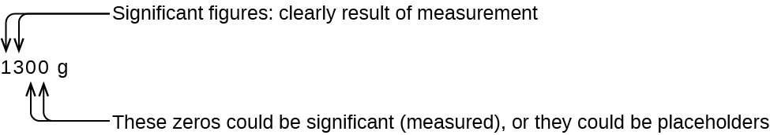

By the end of this section, you will be able to:
* Define accuracy and precision
* Distinguish exact and uncertain numbers
* Correctly represent uncertainty in quantities using significant figures
* Apply proper rounding rules to computed quantities

Counting is the only type of measurement that is free from uncertainty, provided the number of objects being counted does not change while the counting process is underway. The result of such a counting measurement is an example of an **exact number**{: data-type="term"}. If we count eggs in a carton, we know *exactly* how many eggs the carton contains. The numbers of defined quantities are also exact. By definition, 1 foot is exactly 12 inches, 1 inch is exactly 2.54 centimeters, and 1 gram is exactly 0.001 kilogram. Quantities derived from measurements other than counting, however, are uncertain to varying extents due to practical limitations of the measurement process used.

# Significant Figures in Measurement

The numbers of measured quantities, unlike defined or directly counted quantities, are not exact. To measure the volume of liquid in a graduated cylinder, you should make a reading at the bottom of the meniscus, the lowest point on the curved surface of the liquid.

  at the bottom of the meniscus."){:}

Refer to the illustration in [\[link\]](#fs-idm337865984). The bottom of the meniscus in this case clearly lies between the 21 and 22 markings, meaning the liquid volume is *certainly* greater than 21 mL but less than 22 mL. The meniscus appears to be a bit closer to the 22-mL mark than to the 21-mL mark, and so a reasonable estimate of the liquid’s volume would be 21.6 mL. In the number 21.6, then, the digits 2 and 1 are certain, but the 6 is an estimate. Some people might estimate the meniscus position to be equally distant from each of the markings and estimate the tenth-place digit as 5, while others may think it to be even closer to the 22-mL mark and estimate this digit to be 7. Note that it would be pointless to attempt to estimate a digit for the hundredths place, given that the tenths-place digit is uncertain. In general, numerical scales such as the one on this graduated cylinder will permit measurements to one-tenth of the smallest scale division. The scale in this case has 1-mL divisions, and so volumes may be measured to the nearest 0.1 mL.

This concept holds true for all measurements, even if you do not actively make an estimate. If you place a quarter on a standard electronic balance, you may obtain a reading of 6.72 g. The digits 6 and 7 are certain, and the 2 indicates that the mass of the quarter is likely between 6.71 and 6.73 grams. The quarter weighs *about* 6.72 grams, with a nominal uncertainty in the measurement of ± 0.01 gram. If we weigh the quarter on a more sensitive balance, we may find that its mass is 6.723 g. This means its mass lies between 6.722 and 6.724 grams, an uncertainty of 0.001 gram. Every measurement has some **uncertainty**{: data-type="term"}, which depends on the device used (and the user’s ability). All of the digits in a measurement, including the uncertain last digit, are called **significant figures**{: data-type="term"} or **significant digits**{: data-type="term"}. Note that zero may be a measured value; for example, if you stand on a scale that shows weight to the nearest pound and it shows “120,” then the 1 (hundreds), 2 (tens) and 0 (ones) are all significant (measured) values.

Whenever you make a measurement properly, all the digits in the result are significant. But what if you were analyzing a reported value and trying to determine what is significant and what is not? Well, for starters, all nonzero digits are significant, and it is only zeros that require some thought. We will use the terms “leading,” “trailing,” and “captive” for the zeros and will consider how to deal with them.

    Starting with the first nonzero digit on the left, count this digit and all remaining digits to the right. This is the number of significant figures in the measurement unless the last digit is a trailing zero lying to the left of the decimal point.

    Captive zeros result from measurement and are therefore always significant. Leading zeros, however, are never significant—they merely tell us where the decimal point is located.

    The leading zeros in this example are not significant. We could use exponential notation (as described in Appendix B) and express the number as 8.32407 <math xmlns="http://www.w3.org/1998/Math/MathML"><mo>×</mo></math>

 10−3; then the number 8.32407 contains all of the significant figures, and 10−3 locates the decimal point.

The number of significant figures is uncertain in a number that ends with a zero to the left of the decimal point location. The zeros in the measurement 1,300 grams could be significant or they could simply indicate where the decimal point is located. The ambiguity can be resolved with the use of exponential notation: 1.3 <math xmlns="http://www.w3.org/1998/Math/MathML"><mo>×</mo></math>

 103 (two significant figures), 1.30 <math xmlns="http://www.w3.org/1998/Math/MathML"><mo>×</mo></math>

 103 (three significant figures, if the tens place was measured), or 1.300 <math xmlns="http://www.w3.org/1998/Math/MathML"><mo>×</mo></math>

 103 (four significant figures, if the ones place was also measured). In cases where only the decimal-formatted number is available, it is prudent to assume that all trailing zeros are not significant.

    When determining significant figures, be sure to pay attention to reported values and think about the measurement and significant figures in terms of what is reasonable or likely when evaluating whether the value makes sense. For example, the official January 2014 census reported the resident population of the US as 317,297,725. Do you think the US population was correctly determined to the reported nine significant figures, that is, to the exact number of people? People are constantly being born, dying, or moving into or out of the country, and assumptions are made to account for the large number of people who are not actually counted. Because of these uncertainties, it might be more reasonable to expect that we know the population to within perhaps a million or so, in which case the population should be reported as 3.17 <math xmlns="http://www.w3.org/1998/Math/MathML"><mo>×</mo></math>

 108 people.

# Significant Figures in Calculations

A second important principle of uncertainty is that results calculated from a measurement are at least as uncertain as the measurement itself. We must take the uncertainty in our measurements into account to avoid misrepresenting the uncertainty in calculated results. One way to do this is to report the result of a calculation with the correct number of significant figures, which is determined by the following three rules for **rounding**{: data-type="term"} numbers:

1.  When we add or subtract numbers, we should round the result to the same number of decimal places as the number with the least number of decimal places (the least precise value in terms of addition and subtraction).
2.  When we multiply or divide numbers, we should round the result to the same number of digits as the number with the least number of significant figures (the least precise value in terms of multiplication and division).
3.  If the digit to be dropped (the one immediately to the right of the digit to be retained) is less than 5, we “round down” and leave the retained digit unchanged; if it is more than 5, we “round up” and increase the retained digit by 1; if the dropped digit *is* 5, we round up or down, whichever yields an even value for the retained digit. (The last part of this rule may strike you as a bit odd, but it’s based on reliable statistics and is aimed at avoiding any bias when dropping the digit “5,” since it is equally close to both possible values of the retained digit.)
{: data-number-style="arabic"}

The following examples illustrate the application of this rule in rounding a few different numbers to three significant figures:

* 0\.028675 rounds “up” to 0.0287 (the dropped digit, 7, is greater than 5)
* 18\.3384 rounds “down” to 18.3 (the dropped digit, 3, is lesser than 5)
* 6\.8752 rounds “up” to 6.88 (the dropped digit is 5, and the retained digit is even)
* 92\.85 rounds “down” to 92.8 (the dropped digit is 5, and the retained digit is even)
{: data-bullet-style="bullet"}

Let’s work through these rules with a few examples.

Rounding Numbers Round the following to the indicated number of significant figures:

(a) 31.57 (to two significant figures)

(b) 8.1649 (to three significant figures)

(c) 0.051065 (to four significant figures)

(d) 0.90275 (to four significant figures)

Solution (a) 31.57 rounds “up” to 32 (the dropped digit is 5, and the retained digit is even)

(b) 8.1649 rounds “down” to 8.16 (the dropped digit, 4, is lesser than 5)

(c) 0.051065 rounds “down” to 0.05106 (the dropped digit is 5, and the retained digit is even)

(d) 0.90275 rounds “up” to 0.9028 (the dropped digit is 5, and the retained digit is even)

Check Your Learning Round the following to the indicated number of significant figures:

(a) 0.424 (to two significant figures)

(b) 0.0038661 (to three significant figures)

(c) 421.25 (to four significant figures)

(d) 28,683.5 (to five significant figures)

Answer:

(a) 0.42; (b) 0.00387; (c) 421.2; (d) 28,684

Addition and Subtraction with Significant Figures Rule: When we add or subtract numbers, we should round the result to the same number of decimal places as the number with the least number of decimal places (i.e., the least precise value in terms of addition and subtraction).

(a) Add 1.0023 g and 4.383 g.

(b) Subtract 421.23 g from 486 g.

Solution

(a) <math xmlns="http://www.w3.org/1998/Math/MathML"><mtable columnalign="left"><mtr><mtd><mrow /></mtd></mtr><mtr><mtd><mtable columnalign="left"><mtr columnalign="left"><mtd columnalign="left"><mrow /></mtd></mtr><mtr columnalign="left"><mtd columnalign="left"><mrow><mfrac><mrow><mtable><mtr><mtd><mrow><mspace width="1.4em" /><mn>1.0023 g</mn></mrow></mtd></mtr><mtr><mtd><mrow><mtext>+ 4.383 g</mtext></mrow></mtd></mtr></mtable></mrow><mrow><mspace width="1.5em" /><mn>5.3853 g</mn></mrow></mfrac></mrow></mtd></mtr></mtable></mtd></mtr></mtable></math>

Answer is 5.385 g (round to the thousandths place; three decimal places)

(b) <math xmlns="http://www.w3.org/1998/Math/MathML"><mtable columnalign="left"><mtr><mtd><mtable columnalign="left"><mtr columnalign="left"><mtd columnalign="left"><mrow /></mtd></mtr><mtr columnalign="left"><mtd columnalign="left"><mrow /></mtd></mtr></mtable></mtd></mtr><mtr><mtd><mfrac><mrow><mtable columnalign="left"><mtr columnalign="left"><mtd columnalign="left"><mrow><mtext> </mtext><mspace width="0.8em" /><mn>486 g</mn></mrow></mtd></mtr><mtr columnalign="left"><mtd columnalign="left"><mrow><mo>−</mo><mn>421.23 g</mn></mrow></mtd></mtr></mtable></mrow><mrow><mspace width="1.3em" /><mn>64.77 g</mn></mrow></mfrac></mtd></mtr></mtable></math>

Answer is 65 g (round to the ones place; no decimal places)

  
Check Your Learning (a) Add 2.334 mL and 0.31 mL.

(b) Subtract 55.8752 m from 56.533 m.

Answer:

(a) 2.64 mL; (b) 0.658 m

Multiplication and Division with Significant Figures Rule: When we multiply or divide numbers, we should round the result to the same number of digits as the number with the least number of significant figures (the least precise value in terms of multiplication and division).

(a) Multiply 0.6238 cm by 6.6 cm.

(b) Divide 421.23 g by 486 mL.

Solution

(a) <math xmlns="http://www.w3.org/1998/Math/MathML"><mrow><mtable columnalign="left"><mtr columnalign="left"><mtd columnalign="left"><mrow><mtable columnalign="left"><mtr columnalign="left"><mtd columnalign="left"><mrow><mtext>0.6238 cm</mtext><mspace width="0.2em" /><mo>×</mo><mspace width="0.2em" /><mn>6.6</mn><mspace width="0.2em" /><mtext>cm</mtext><mo>=</mo><mn>4.11708</mn><mspace width="0.2em" /><msup><mrow><mtext>cm</mtext></mrow><mn>2</mn></msup><mspace width="0.2em" /><mo stretchy="false">⟶</mo><mspace width="0.2em" /><mtext>result is</mtext><mspace width="0.2em" /><mn>4.1</mn><mspace width="0.2em" /><msup><mrow><mtext>cm</mtext></mrow><mn>2</mn></msup><mspace width="0.2em" /><mo stretchy="false">(</mo><mtext>round to two significant figures</mtext><mo stretchy="false">)</mo></mrow></mtd></mtr><mtr columnalign="left"><mtd columnalign="left"><mrow><mtext>four significant figures</mtext><mspace width="0.2em" /><mo>×</mo><mspace width="0.2em" /><mtext>two significant figures</mtext><mspace width="0.2em" /><mo stretchy="false">⟶</mo><mspace width="0.2em" /><mtext>two significant figures answer</mtext></mrow></mtd></mtr></mtable></mrow></mtd></mtr></mtable></mrow></math>

(b) <math xmlns="http://www.w3.org/1998/Math/MathML"><mtable columnalign="left"><mtr><mtd><mfrac><mrow><mtext>421.23 g</mtext></mrow><mrow><mtext>486 mL</mtext></mrow></mfrac><mspace width="0.2em" /><mo>=</mo><mtext>0.86728... g/mL</mtext><mspace width="0.2em" /><mo stretchy="false">⟶</mo><mspace width="0.2em" /><mtext>result is 0.867 g/mL</mtext><mspace width="0.2em" /><mrow><mo>(</mo><mrow><mtext>round to three significant figures</mtext></mrow><mo>)</mo></mrow></mtd></mtr><mtr><mtd><mfrac><mrow><mtext>five significant figures</mtext></mrow><mrow><mtext>three significant figures</mtext></mrow></mfrac><mspace width="0.2em" /><mo stretchy="false">⟶</mo><mspace width="0.2em" /><mtext>three significant figures answer</mtext></mtd></mtr></mtable></math>

Check Your Learning (a) Multiply 2.334 cm and 0.320 cm.

(b) Divide 55.8752 m by 56.53 s.

Answer:

(a) 0.747 cm2 (b) 0.9884 m/s

In the midst of all these technicalities, it is important to keep in mind the reason why we use significant figures and rounding rules—to correctly represent the certainty of the values we report and to ensure that a calculated result is not represented as being more certain than the least certain value used in the calculation.

Calculation with Significant Figures One common bathtub is 13.44 dm long, 5.920 dm wide, and 2.54 dm deep. Assume that the tub is rectangular and calculate its approximate volume in liters.

Solution

<math xmlns="http://www.w3.org/1998/Math/MathML"><mtable columnalign="left"><mtr><mtd columnalign="left"><mi>V</mi></mtd><mtd columnalign="left"><mo>=</mo></mtd><mtd columnalign="left"><mi>l</mi><mspace width="0.2em" /><mo>×</mo><mspace width="0.2em" /><mi>w</mi><mspace width="0.2em" /><mo>×</mo><mspace width="0.2em" /><mi>d</mi></mtd></mtr><mtr><mtd /><mtd columnalign="left"><mo>=</mo></mtd><mtd columnalign="left"><mtext>13.44 dm</mtext><mspace width="0.2em" /><mo>×</mo><mspace width="0.2em" /><mtext>5.920 dm</mtext><mspace width="0.2em" /><mo>×</mo><mspace width="0.2em" /><mtext>2.54 dm</mtext></mtd></mtr><mtr><mtd /><mtd columnalign="left"><mo>=</mo></mtd><mtd columnalign="left"><mtext>202.09459</mtext><mn>...</mn><mspace width="0.2em" /><msup><mtext>dm</mtext><mn>3</mn></msup><mrow><mo>(</mo><mrow><mtext>value from calculator</mtext></mrow><mo>)</mo></mrow></mtd></mtr><mtr><mtd /><mtd columnalign="left"><mo>=</mo></mtd><mtd columnalign="left"><msup><mtext>202 dm</mtext><mn>3</mn></msup><mtext>, or 202 L</mtext><mspace width="0.2em" /><mrow><mo>(</mo><mrow><mtext>answer rounded to three significant figures</mtext></mrow><mo>)</mo></mrow></mtd></mtr></mtable></math>

Check Your Learning What is the density of a liquid with a mass of 31.1415 g and a volume of 30.13 cm3?

Answer:

1\.034 g/mL

Experimental Determination of Density Using Water Displacement A piece of rebar is weighed and then submerged in a graduated cylinder partially filled with water, with results as shown.

  
(a) Use these values to determine the density of this piece of rebar.

(b) Rebar is mostly iron. Does your result in (a) support this statement? How?

SolutionThe volume of the piece of rebar is equal to the volume of the water displaced:

<math xmlns="http://www.w3.org/1998/Math/MathML"><mrow><mtext>volume</mtext><mo>=</mo><mtext>22.4 mL</mtext><mo>−</mo><mtext>13.5 mL</mtext><mo>=</mo><mtext>8.9 mL</mtext><mo>=</mo><msup><mrow><mtext>8.9 cm</mtext></mrow><mn>3</mn></msup></mrow></math>

(rounded to the nearest 0.1 mL, per the rule for addition and subtraction)

The density is the mass-to-volume ratio:

<math xmlns="http://www.w3.org/1998/Math/MathML"><mrow><mtext>density</mtext><mo>=</mo><mspace width="0.2em" /><mfrac><mrow><mtext>mass</mtext></mrow><mrow><mtext>volume</mtext></mrow></mfrac><mspace width="0.2em" /><mo>=</mo><mspace width="0.2em" /><mfrac><mrow><mtext>69.658 g</mtext></mrow><mrow><msup><mrow><mtext>8.9 cm</mtext></mrow><mn>3</mn></msup></mrow></mfrac><mo>=</mo><msup><mrow><mtext>7.8 g/cm</mtext></mrow><mn>3</mn></msup></mrow></math>

(rounded to two significant figures, per the rule for multiplication and division)

From [\[link\]](/m50989#fs-idm45639696), the density of iron is 7.9 g/cm3, very close to that of rebar, which lends some support to the fact that rebar is mostly iron.

Check Your Learning An irregularly shaped piece of a shiny yellowish material is weighed and then submerged in a graduated cylinder, with results as shown.

  
(a) Use these values to determine the density of this material.

(b) Do you have any reasonable guesses as to the identity of this material? Explain your reasoning.

Answer:

(a) 19 g/cm3; (b) It is likely gold; the right appearance for gold and very close to the density given for gold in [\[link\]](/m50989#fs-idm45639696).

# Accuracy and Precision

Scientists typically make repeated measurements of a quantity to ensure the quality of their findings and to know both the **precision**{: data-type="term"} and the **accuracy**{: data-type="term"} of their results. Measurements are said to be precise if they yield very similar results when repeated in the same manner. A measurement is considered accurate if it yields a result that is very close to the true or accepted value. Precise values agree with each other; accurate values agree with a true value. These characterizations can be extended to other contexts, such as the results of an archery competition ([\[link\]](#fs-idm1827280)).

  These arrows are close to both the bull&#x2019;s eye and one another, so they are both accurate and precise. (b) These arrows are close to one another but not on target, so they are precise but not accurate. (c) These arrows are neither on target nor close to one another, so they are neither accurate nor precise."){:}

Suppose a quality control chemist at a pharmaceutical company is tasked with checking the accuracy and precision of three different machines that are meant to dispense 10 ounces (296 mL) of cough syrup into storage bottles. She proceeds to use each machine to fill five bottles and then carefully determines the actual volume dispensed, obtaining the results tabulated in [\[link\]](#fs-idp31780400).

<table summary="The volume, in milliliters, of cough medicine delivered by dispensers 1, 2 and 3 are shown in a table. The values for dispenser 1 are 283.3, 284.1, 283.9, 284.0, and 284.1. The values for dispenser 2 are 298.3, 294.2, 296.0, 297.8, and 293.9. The values for dispenser 3 are 296.1, 295.9, 296.1, 296.0, and 296.1." class="span-all"><thead>
<tr valign="top">
<th colspan="3" data-align="center">Volume (mL) of Cough Medicine Delivered by 10-oz (296 mL) Dispensers</th>
</tr>
<tr valign="top">
<th data-align="left">Dispenser #1</th>
<th data-align="left">Dispenser #2</th>
<th data-align="left">Dispenser #3</th>
</tr>
</thead><tbody>
<tr valign="top">
<td data-align="left">283.3</td>
<td data-align="left">298.3</td>
<td data-align="left">296.1</td>
</tr>
<tr valign="top">
<td data-align="left">284.1</td>
<td data-align="left">294.2</td>
<td data-align="left">295.9</td>
</tr>
<tr valign="top">
<td data-align="left">283.9</td>
<td data-align="left">296.0</td>
<td data-align="left">296.1</td>
</tr>
<tr valign="top">
<td data-align="left">284.0</td>
<td data-align="left">297.8</td>
<td data-align="left">296.0</td>
</tr>
<tr valign="top">
<td data-align="left">284.1</td>
<td data-align="left">293.9</td>
<td data-align="left">296.1</td>
</tr>
</tbody></table>

Considering these results, she will report that dispenser #1 is precise (values all close to one another, within a few tenths of a milliliter) but not accurate (none of the values are close to the target value of 296 mL, each being more than 10 mL too low). Results for dispenser #2 represent improved accuracy (each volume is less than 3 mL away from 296 mL) but worse precision (volumes vary by more than 4 mL). Finally, she can report that dispenser #3 is working well, dispensing cough syrup both accurately (all volumes within 0.1 mL of the target volume) and precisely (volumes differing from each other by no more than 0.2 mL).

# Key Concepts and Summary

Quantities can be exact or measured. Measured quantities have an associated uncertainty that is represented by the number of significant figures in the measurement. The uncertainty of a calculated value depends on the uncertainties in the values used in the calculation and is reflected in how the value is rounded. Measured values can be accurate (close to the true value) and/or precise (showing little variation when measured repeatedly).

# Chemistry End of Chapter Exercises

Express each of the following numbers in scientific notation with correct significant figures:

(a) 711.0

(b) 0.239

(c) 90743

(d) 134.2

(e) 0.05499

(f) 10000.0

(g) 0.000000738592

Express each of the following numbers in exponential notation with correct significant figures:

(a) 704

(b) 0.03344

(c) 547.9

(d) 22086

(e) 1000.00

(f) 0.0000000651

(g) 0.007157

(a) 7.04 <math xmlns="http://www.w3.org/1998/Math/MathML"><mo>×</mo></math>

 102; (b) 3.344 <math xmlns="http://www.w3.org/1998/Math/MathML"><mo>×</mo></math>

 10−2; (c) 5.479 <math xmlns="http://www.w3.org/1998/Math/MathML"><mo>×</mo></math>

 102; (d) 2.2086 <math xmlns="http://www.w3.org/1998/Math/MathML"><mo>×</mo></math>

 104; (e) 1.00000 <math xmlns="http://www.w3.org/1998/Math/MathML"><mo>×</mo></math>

 103; (f) 6.51 <math xmlns="http://www.w3.org/1998/Math/MathML"><mo>×</mo></math>

 10−8; (g) 7.157 <math xmlns="http://www.w3.org/1998/Math/MathML"><mo>×</mo></math>

 10−3

Indicate whether each of the following can be determined exactly or must be measured with some degree of uncertainty:

(a) the number of eggs in a basket

(b) the mass of a dozen eggs

(c) the number of gallons of gasoline necessary to fill an automobile gas tank

(d) the number of cm in 2 m

(e) the mass of a textbook

(f) the time required to drive from San Francisco to Kansas City at an average speed of 53 mi/h

Indicate whether each of the following can be determined exactly or must be measured with some degree of uncertainty:

(a) the number of seconds in an hour

(b) the number of pages in this book

(c) the number of grams in your weight

(d) the number of grams in 3 kilograms

(e) the volume of water you drink in one day

(f) the distance from San Francisco to Kansas City

(a) exact; (b) exact; (c) uncertain; (d) exact; (e) uncertain; (f) uncertain

How many significant figures are contained in each of the following measurements?

(a) 38.7 g

(b) 2 <math xmlns="http://www.w3.org/1998/Math/MathML"><mo>×</mo></math>

 1018 m

(c) 3,486,002 kg

(d) 9.74150 <math xmlns="http://www.w3.org/1998/Math/MathML"><mo>×</mo></math>

 10−4 J

(e) 0.0613 cm3

(f) 17.0 kg

(g) 0.01400 g/mL

How many significant figures are contained in each of the following measurements?

(a) 53 cm

(b) 2.05 <math xmlns="http://www.w3.org/1998/Math/MathML"><mo>×</mo></math>

 108 m

(c) 86,002 J

(d) 9.740 <math xmlns="http://www.w3.org/1998/Math/MathML"><mo>×</mo></math>

 104 m/s

(e) 10.0613 m3

(f) 0.17 g/mL

(g) 0.88400 s

(a) two; (b) three; (c) five; (d) four; (e) six; (f) two; (g) five

The following quantities were reported on the labels of commercial products. Determine the number of significant figures in each.

(a) 0.0055 g active ingredients

(b) 12 tablets

(c) 3% hydrogen peroxide

(d) 5.5 ounces

(e) 473 mL

(f) 1.75% bismuth

(g) 0.001% phosphoric acid

(h) 99.80% inert ingredients

Round off each of the following numbers to two significant figures:

(a) 0.436

(b) 9.000

(c) 27.2

(d) 135

(e) 1.497 <math xmlns="http://www.w3.org/1998/Math/MathML"><mo>×</mo></math>

 10−3

(f) 0.445

(a) 0.44; (b) 9.0; (c) 27; (d) 140; (e) 1.5 <math xmlns="http://www.w3.org/1998/Math/MathML"><mo>×</mo></math>

 10−3; (f) 0.44

Round off each of the following numbers to two significant figures:

(a) 517

(b) 86.3

(c) 6.382 <math xmlns="http://www.w3.org/1998/Math/MathML"><mo>×</mo></math>

 103

(d) 5.0008

(e) 22.497

(f) 0.885

Perform the following calculations and report each answer with the correct number of significant figures.

(a) 628 <math xmlns="http://www.w3.org/1998/Math/MathML"><mo>×</mo></math>

 342

(b) (5.63 <math xmlns="http://www.w3.org/1998/Math/MathML"><mo>×</mo></math>

 102) <math xmlns="http://www.w3.org/1998/Math/MathML"><mo>×</mo></math>

 (7.4 <math xmlns="http://www.w3.org/1998/Math/MathML"><mo>×</mo></math>

 103)

(c) <math xmlns="http://www.w3.org/1998/Math/MathML"><mrow><mfrac><mrow><mn>28.0</mn></mrow><mrow><mn>13.483</mn></mrow></mfrac></mrow></math>

(d) 8119 <math xmlns="http://www.w3.org/1998/Math/MathML"><mo>×</mo></math>

 0.000023

(e) 14.98 + 27,340 + 84.7593

(f) 42.7 + 0.259

(a) 2.15 <math xmlns="http://www.w3.org/1998/Math/MathML"><mo>×</mo></math>

 105; (b) 4.2 <math xmlns="http://www.w3.org/1998/Math/MathML"><mo>×</mo></math>

 106; (c) 2.08; (d) 0.19; (e) 27,440; (f) 43.0

Perform the following calculations and report each answer with the correct number of significant figures.

(a) 62.8 <math xmlns="http://www.w3.org/1998/Math/MathML"><mo>×</mo></math>

 34

(b) 0.147 + 0.0066 + 0.012

(c) 38 <math xmlns="http://www.w3.org/1998/Math/MathML"><mo>×</mo></math>

 95 <math xmlns="http://www.w3.org/1998/Math/MathML"><mo>×</mo></math>

 1.792

(d) 15 – 0.15 – 0.6155

(e) <math xmlns="http://www.w3.org/1998/Math/MathML"><mrow><mn>8.78</mn><mspace width="0.2em" /><mo>×</mo><mspace width="0.2em" /><mrow><mo>(</mo><mrow><mfrac><mrow><mn>0.0500</mn></mrow><mrow><mn>0.478</mn></mrow></mfrac></mrow><mo>)</mo></mrow></mrow></math>

(f) 140 + 7.68 + 0.014

(g) 28.7 – 0.0483

(h) <math xmlns="http://www.w3.org/1998/Math/MathML"><mrow><mfrac><mrow><mo stretchy="false">(</mo><mn>88.5</mn><mo>−</mo><mn>87.57</mn><mo stretchy="false">)</mo></mrow><mrow><mn>45.13</mn></mrow></mfrac></mrow></math>

Consider the results of the archery contest shown in this figure.

(a) Which archer is most precise?

(b) Which archer is most accurate?

(c) Who is both least precise and least accurate?

  

(a) Archer X; (b) Archer W; (c) Archer Y

Classify the following sets of measurements as accurate, precise, both, or neither.

(a) Checking for consistency in the weight of chocolate chip cookies: 17.27 g, 13.05 g, 19.46 g, 16.92 g

(b) Testing the volume of a batch of 25-mL pipettes: 27.02 mL, 26.99 mL, 26.97 mL, 27.01 mL

(c) Determining the purity of gold: 99.9999%, 99.9998%, 99.9998%, 99.9999%

## Glossary
{: data-type="glossary-title"}

accuracy
: how closely a measurement aligns with a correct value
{: .definition}

exact number
: number derived by counting or by definition
{: .definition}

precision
: how closely a measurement matches the same measurement when repeated
{: .definition}

rounding
: procedure used to ensure that calculated results properly reflect the uncertainty in the measurements used in the calculation
{: .definition}

significant figures
: (also, significant digits) all of the measured digits in a determination, including the uncertain last digit
{: .definition}

uncertainty
: estimate of amount by which measurement differs from true value
{: .definition}

