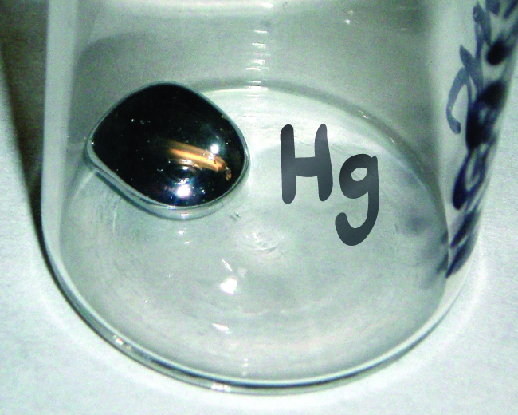

By the end of this section, you will be able to:
* Write and interpret symbols that depict the atomic number, mass number, and charge of an atom or ion
* Define the atomic mass unit and average atomic mass
* Calculate average atomic mass and isotopic abundance

The development of modern atomic theory revealed much about the inner structure of atoms. It was learned that an atom contains a very small nucleus composed of positively charged protons and uncharged neutrons, surrounded by a much larger volume of space containing negatively charged electrons. The nucleus contains the majority of an atom’s mass because protons and neutrons are much heavier than electrons, whereas electrons occupy almost all of an atom’s volume. The diameter of an atom is on the order of 10−10 m, whereas the diameter of the nucleus is roughly 10−15 m—about 100,000 times smaller. For a perspective about their relative sizes, consider this: If the nucleus were the size of a blueberry, the atom would be about the size of a football stadium ([\[link\]](#CNX_Chem_02_03_AtomSize)).

 "){: #CNX_Chem_02_03_AtomSize}

Atoms—and the protons, neutrons, and electrons that compose them—are extremely small. For example, a carbon atom weighs less than 2 <math xmlns="http://www.w3.org/1998/Math/MathML"><mrow><mo>×</mo></mrow></math>

 10−23 g, and an electron has a charge of less than 2 <math xmlns="http://www.w3.org/1998/Math/MathML"><mrow><mo>×</mo></mrow></math>

 10−19 C (coulomb). When describing the properties of tiny objects such as atoms, we use appropriately small units of measure, such as the **atomic mass unit (amu)**{: data-type="term"} and the **fundamental unit of charge (e)**{: data-type="term"}. The amu was originally defined based on hydrogen, the lightest element, then later in terms of oxygen. Since 1961, it has been defined with regard to the most abundant isotope of carbon, atoms of which are assigned masses of exactly 12 amu. (This isotope is known as “carbon-12” as will be discussed later in this module.) Thus, one amu is exactly <math xmlns="http://www.w3.org/1998/Math/MathML"><mrow><mfrac><mn>1</mn><mrow><mn>12</mn></mrow></mfrac></mrow></math>

 of the mass of one carbon-12 atom: 1 amu = 1.6605 <math xmlns="http://www.w3.org/1998/Math/MathML"><mrow><mo>×</mo></mrow></math>

 10−24 g. (The **Dalton (Da)**{: data-type="term"} and the **unified atomic mass unit (u)**{: data-type="term"} are alternative units that are equivalent to the amu.) The fundamental unit of charge (also called the elementary charge) equals the magnitude of the charge of an electron (e) with e = 1.602 <math xmlns="http://www.w3.org/1998/Math/MathML"><mrow><mo>×</mo></mrow></math>

 10−19 C.

A proton has a mass of 1.0073 amu and a charge of 1+. A neutron is a slightly heavier particle with a mass 1.0087 amu and a charge of zero; as its name suggests, it is neutral. The electron has a charge of 1− and is a much lighter particle with a mass of about 0.00055 amu (it would take about 1800 electrons to equal the mass of one proton. The properties of these fundamental particles are summarized in [\[link\]](#fs-idp90857696). (An observant student might notice that the sum of an atom’s subatomic particles does not equal the atom’s actual mass: The total mass of six protons, six neutrons, and six electrons is 12.0993 amu, slightly larger than 12.00 amu. This “missing” mass is known as the mass defect, and you will learn about it in the chapter on nuclear chemistry.)

<table summary="This table gives the name, location, charge in C, unit charge, mass in A M U and mass in grams for electrons, protons and neutrons. Electrons are located outside of the nucleus, have a charge of negative 1.602 times 10 to the negative nineteenth power, a unit charge of negative 1, and a mass of 0.00055 A M U or 0.00091 times 10 to the negative twenty-fourth power grams. Protons are located within the nucleus, have a charge of 1.602 times 10 to the negative nineteenth power, have a unit charge of positive 1, and have a mass of 1.0073 A M U or 1.6726 times 10 to the negative twenty-fourth power grams. Neutrons are located within the nucleus, have a charge of 0, have a unit charge of 0, and have a mass of 1.0087 A M U or 1.6749 times 10 to the negative twenty-fourth power grams." class="span-all"><thead>
<tr>
<th colspan="6" data-align="center">Properties of Subatomic Particles</th>
</tr>
<tr valign="top">
<th data-align="center">Name</th><th data-align="center">Location</th><th data-align="center">Charge (C)</th><th data-align="center">Unit Charge</th><th data-align="center">Mass (amu)</th><th data-align="center">Mass (g)</th>
</tr>
</thead><tbody>
<tr valign="top">
<td data-align="center">electron</td>
<td data-align="center">outside nucleus</td>
<td data-align="center">−1.602 <math xmlns="http://www.w3.org/1998/Math/MathML"><mrow><mo>×</mo></mrow></math> 10−19</td>
<td data-align="center">1−</td>
<td data-align="center">0.00055</td>
<td data-align="center">0.00091 <math xmlns="http://www.w3.org/1998/Math/MathML"><mrow><mo>×</mo></mrow></math> 10−24</td>
</tr>
<tr valign="top">
<td data-align="center">proton</td>
<td data-align="center">nucleus</td>
<td data-align="center">1.602 <math xmlns="http://www.w3.org/1998/Math/MathML"><mrow><mo>×</mo></mrow></math>10−19</td>
<td data-align="center">1+</td>
<td data-align="center">1.00727</td>
<td data-align="center">1.67262 <math xmlns="http://www.w3.org/1998/Math/MathML"><mrow><mo>×</mo></mrow></math> 10−24</td>
</tr>
<tr valign="top">
<td data-align="center">neutron</td>
<td data-align="center">nucleus</td>
<td data-align="center">0</td>
<td data-align="center">0</td>
<td data-align="center">1.00866</td>
<td data-align="center">1.67493 <math xmlns="http://www.w3.org/1998/Math/MathML"><mrow><mo>×</mo></mrow></math> 10−24</td>
</tr>
</tbody></table>

The number of protons in the nucleus of an atom is its **atomic number (Z)**{: data-type="term"}. This is the defining trait of an element: Its value determines the identity of the atom. For example, any atom that contains six protons is the element carbon and has the atomic number 6, regardless of how many neutrons or electrons it may have. A neutral atom must contain the same number of positive and negative charges, so the number of protons equals the number of electrons. Therefore, the atomic number also indicates the number of electrons in an atom. The total number of protons and neutrons in an atom is called its **mass number (A)**{: data-type="term"}. The number of neutrons is therefore the difference between the mass number and the atomic number: A – Z = number of neutrons.

<math xmlns="http://www.w3.org/1998/Math/MathML"><mtable><mtr><mtd columnalign="right"><mtext>atomic number</mtext><mspace width="0.2em" /><mo stretchy="false">(</mo><mtext>Z</mtext><mo stretchy="false">)</mo></mtd><mtd><mo>=</mo></mtd><mtd columnalign="left"><mtext>number of protons</mtext></mtd></mtr><mtr><mtd columnalign="right"><mtext>mass number</mtext><mspace width="0.2em" /><mo stretchy="false">(</mo><mtext>A</mtext><mo stretchy="false">)</mo></mtd><mtd><mo>=</mo></mtd><mtd columnalign="left"><mtext>number of protons</mtext><mo>+</mo><mtext>number of neutrons</mtext></mtd></mtr><mtr><mtd columnalign="right"><mtext>A</mtext><mo>−</mo><mtext>Z</mtext></mtd><mtd><mo>=</mo></mtd><mtd columnalign="left"><mtext>number of neutrons</mtext></mtd></mtr></mtable></math>

Atoms are electrically neutral if they contain the same number of positively charged protons and negatively charged electrons. When the numbers of these subatomic particles are *not* equal, the atom is electrically charged and is called an **ion**{: data-type="term"}. The charge of an atom is defined as follows:

Atomic charge = number of protons − number of electrons

As will be discussed in more detail later in this chapter, atoms (and molecules) typically acquire charge by gaining or losing electrons. An atom that gains one or more electrons will exhibit a negative charge and is called an **anion**{: data-type="term"}. Positively charged atoms called **cations**{: data-type="term"} are formed when an atom loses one or more electrons. For example, a neutral sodium atom (Z = 11) has 11 electrons. If this atom loses one electron, it will become a cation with a 1+ charge (11 − 10 = 1+). A neutral oxygen atom (Z = 8) has eight electrons, and if it gains two electrons it will become an anion with a 2− charge (8 − 10 = 2−).

Composition of an Atom Iodine is an essential trace element in our diet; it is needed to produce thyroid hormone. Insufficient iodine in the diet can lead to the development of a goiter, an enlargement of the thyroid gland ([\[link\]](#CNX_Chem_02_03_Iodine)).

 Insufficient iodine in the diet can cause an enlargement of the thyroid gland called a goiter. (b) The addition of small amounts of iodine to salt, which prevents the formation of goiters, has helped eliminate this concern in the US where salt consumption is high. (credit a: modification of work by &#x201C;Almazi&#x201D;/Wikimedia Commons; credit b: modification of work by Mike Mozart)"){: #CNX_Chem_02_03_Iodine}

The addition of small amounts of iodine to table salt (iodized salt) has essentially eliminated this health concern in the United States, but as much as 40% of the world’s population is still at risk of iodine deficiency. The iodine atoms are added as anions, and each has a 1− charge and a mass number of 127. Determine the numbers of protons, neutrons, and electrons in one of these iodine anions.

SolutionThe atomic number of iodine (53) tells us that a neutral iodine atom contains 53 protons in its nucleus and 53 electrons outside its nucleus. Because the sum of the numbers of protons and neutrons equals the mass number, 127, the number of neutrons is 74 (127 − 53 = 74). Since the iodine is added as a 1− anion, the number of electrons is 54 \[53 – (1–) = 54\].

Check Your LearningAn ion of platinum has a mass number of 195 and contains 74 electrons. How many protons and neutrons does it contain, and what is its charge?

Answer:

78 protons; 117 neutrons; charge is 4+

# Chemical Symbols

A **chemical symbol**{: data-type="term"} is an abbreviation that we use to indicate an element or an atom of an element. For example, the symbol for mercury is Hg ([\[link\]](#CNX_Chem_02_03_SiSymbol)). We use the same symbol to indicate one atom of mercury (microscopic domain) or to label a container of many atoms of the element mercury (macroscopic domain).

 {: #CNX_Chem_02_03_SiSymbol}

The symbols for several common elements and their atoms are listed in [\[link\]](#fs-idm36686800). Some symbols are derived from the common name of the element; others are abbreviations of the name in another language. Most symbols have one or two letters, but three-letter symbols have been used to describe some elements that have atomic numbers greater than 112. To avoid confusion with other notations, only the first letter of a symbol is capitalized. For example, Co is the symbol for the element cobalt, but CO is the notation for the compound carbon monoxide, which contains atoms of the elements carbon (C) and oxygen (O). All known elements and their symbols are in the periodic table in [\[link\]](/m51003#CNX_Chem_02_05_PerTable1) (also found in [\[link\]](/m51209#fs-idp64991424)).

<table summary="This table has two columns labeled element and symbol. The first letter of the symbol is always an uppercase letter while the second letter of the symbol is always a lowercase letter. Aluminum has the symbol A L. Bromine has the symbol B R, calcium has the symbol C A, carbon has the symbol C, chlorine has the symbol C L, chromium has the symbol C R, cobalt has the symbol C O, copper has the symbol C U, from cuprum, fluorine has the symbol F, gold has the symbol A U, from aurum, helium has the symbol H E, hydrogen has the symbol H, iodine has the symbol I, iron has the symbol F E, from ferrum, lead has the symbol P B, from plumbum, magnesium has the symbol M G, mercury has the symbol H G from hydrargyrum, nitrogen has the symbol N, oxygen has the symbol O, potassium has the symbol K, from kalium, silicon has the symbol S I, silver has the symbol A G, from argentum, sodium has the symbol N A from natrium, sulfur has the symbol S, tin has the symbol S N from stannum, and zinc has the symbol Z N." class="span-all"><thead>
<tr>
<th colspan="4" data-align="center">Some Common Elements and Their Symbols</th>
</tr>
<tr valign="top">
<th data-align="left">Element</th><th data-align="left">Symbol</th><th data-align="left">Element</th><th data-align="left">Symbol</th>
</tr>
</thead><tbody>
<tr valign="top">
<td data-align="left">aluminum </td><td data-align="left">Al</td><td data-align="left">iron</td><td data-align="left">Fe (from <em>ferrum</em>)</td>
</tr>
<tr valign="top">
<td data-align="left">bromine </td><td data-align="left">Br </td><td data-align="left">lead</td><td data-align="left">Pb (from <em>plumbum</em>)</td>
</tr>
<tr valign="top">
<td data-align="left">calcium</td><td data-align="left">Ca</td><td data-align="left">magnesium</td><td data-align="left">Mg</td>
</tr>
<tr valign="top">
<td data-align="left">carbon</td><td data-align="left">C</td><td data-align="left">mercury</td><td data-align="left">Hg (from <em>hydrargyrum</em>)</td>
</tr>
<tr valign="top">
<td data-align="left">chlorine </td><td data-align="left">Cl</td><td data-align="left">nitrogen</td><td data-align="left">N</td>
</tr>
<tr valign="top">
<td data-align="left">chromium</td><td data-align="left">Cr</td><td data-align="left">oxygen</td><td data-align="left">O</td>
</tr>
<tr valign="top">
<td data-align="left">cobalt</td><td data-align="left">Co</td><td data-align="left">potassium </td><td data-align="left">K (from <em>kalium</em>)</td>
</tr>
<tr valign="top">
<td data-align="left">copper</td><td data-align="left">Cu (from <em>cuprum</em>)</td><td data-align="left">silicon</td><td data-align="left">Si</td>
</tr>
<tr valign="top">
<td data-align="left">fluorine</td><td data-align="left">F</td><td data-align="left">silver</td><td data-align="left">Ag (from<em> argentum</em>)</td>
</tr>
<tr valign="top">
<td data-align="left">gold</td><td data-align="left">Au (from <em>aurum</em>)</td><td data-align="left">sodium</td><td data-align="left">Na (from <em>natrium</em>)</td>
</tr>
<tr valign="top">
<td data-align="left">helium</td><td data-align="left">He</td><td data-align="left">sulfur</td><td data-align="left">S</td>
</tr>
<tr valign="top">
<td data-align="left">hydrogen</td><td data-align="left">H</td><td data-align="left">tin</td><td data-align="left">Sn (from <em>stannum</em>)</td>
</tr>
<tr valign="top">
<td data-align="left">iodine</td><td data-align="left">I</td><td data-align="left">zinc</td><td data-align="left">Zn</td>
</tr>
</tbody></table>

Traditionally, the discoverer (or discoverers) of a new element names the element. However, until the name is recognized by the International Union of Pure and Applied Chemistry (IUPAC), the recommended name of the new element is based on the Latin word(s) for its atomic number. For example, element 106 was called unnilhexium (Unh), element 107 was called unnilseptium (Uns), and element 108 was called unniloctium (Uno) for several years. These elements are now named after scientists (or occasionally locations); for example, element 106 is now known as *seaborgium* (Sg) in honor of Glenn Seaborg, a Nobel Prize winner who was active in the discovery of several heavy elements.

  
Visit this [site][1] to learn more about IUPAC, the International Union of Pure and Applied Chemistry, and explore its periodic table.

# Isotopes

The symbol for a specific isotope of any element is written by placing the mass number as a superscript to the left of the element symbol ([\[link\]](#CNX_Chem_02_03_AtomSym)). The atomic number is sometimes written as a subscript preceding the symbol, but since this number defines the element’s identity, as does its symbol, it is often omitted. For example, magnesium exists as a mixture of three isotopes, each with an atomic number of 12 and with mass numbers of 24, 25, and 26, respectively. These isotopes can be identified as 24Mg, 25Mg, and 26Mg. These isotope symbols are read as “element, mass number” and can be symbolized consistent with this reading. For instance, 24Mg is read as “magnesium 24,” and can be written as “magnesium-24” or “Mg-24.” 25Mg is read as “magnesium 25,” and can be written as “magnesium-25” or “Mg-25.” All magnesium atoms have 12 protons in their nucleus. They differ only because a 24Mg atom has 12 neutrons in its nucleus, a 25Mg atom has 13 neutrons, and a 26Mg has 14 neutrons.

 , and the charge as a right superscript."){: #CNX_Chem_02_03_AtomSym}

Information about the naturally occurring isotopes of elements with atomic numbers 1 through 10 is given in [\[link\]](#fs-idm87646592). Note that in addition to standard names and symbols, the isotopes of hydrogen are often referred to using common names and accompanying symbols. Hydrogen-2, symbolized 2H, is also called deuterium and sometimes symbolized D. Hydrogen-3, symbolized 3H, is also called tritium and sometimes symbolized T.

<table summary="This table has seven columns labeled element, symbol, atomic number, number of protons, number of neutrons, mass in A M U, and percent natural abundance. The symbols for each element each show the mass number in the upper left and the atomic number in the lower left. Therefore hydrogen left superscript 1, left subscript 1, or protium, has a mass number of 1 and an atomic number of 1. Protium has one proton, 0 neutrons, a mass of 1.0078 and a natural abundance percentage of 99.985. Hydrogen left superscript 2, left subscript 1, or deuterium, has an atomic number of 1, 1 proton, 1 neutron, a mass of 2.0141 and a natural abundance percentage of 0.015. Hydrogen left superscript 3, left subscript 1, or tritium, has an atomic number of 11 protons, 2 neutrons, and a mass of 3.01605. No natural abundance percentage is given. Helium left superscript 3, left subscript 2 has an atomic number of 2, 2 protons, 1 neutron, a mass of 3.01603, and a natural abundance percentage of 0.00013. Helium left superscript 4, left subscript 2 has an atomic number of 2, 2 protons, 2 neutrons, a mass of 4.0026 and a natural abundance percentage of 100. Lithium left superscript 6, left subscript 3 has an atomic number of 3, 3 protons, 3 neutrons, a mass of 6.0151, and a natural abundance percentage of 7.42. Lithium left superscript 7, left subscript 3 has an atomic number of 3, 3 protons, 4 neutrons, a mass of 7.0160, and a natural abundance percentage of 92.8. Beryllium left superscript 9, left subscript 4 has an atomic number of 4, 4 protons, 5 neutrons, a mass of 9.0122, and a natural abundance percentage of 100. Boron left superscript 10, left subscript 5 has an atomic number of 5, 5 protons, 5 neutrons and a natural abundance percentage of 19.9. Boron left superscript 11, left subscript 5 has an atomic number of 5, 5 protons, 6 neutrons, a mass of 11.0093 and a natural abundance of 80.1. Carbon left superscript 12, left subscript 6 has an atomic number of 6, 6 protons, 6 neutrons, a mass of 12, and a natural abundance percentage of 98.89. Carbon left superscript 13, left subscript 6 has an atomic number of 6, 6 protons, 7 neutrons, a mass of 13.0033, and a natural abundance percentage of 1.11. Carbon left superscript 14, left subscript 6 has an atomic number of 6, 6 protons, 8 neutrons, and a mass of 14.0032. Its natural abundance percentage is not reported. Nitrogen left superscript 14, left subscript 7 has an atomic number of 7, 7 protons, 7 neutrons, a mass of 14.0031, and a natural abundance percentage of 99.63. Nitrogen left superscript 15, left subscript 7 has an atomic number of 7, 7 protons, 8 neutrons, a mass of 15.0001, and a natural abundance percentage of 0.37. Oxygen left superscript 16, left subscript 8 has an atomic number of 8, 8 protons, 8 neutrons, a mass of 15.9949, and a natural abundance percentage of 99.759. Oxygen left superscript 17, left subscript 8 has an atomic number of 8, 8 protons, 9 neutrons, a mass of 16.9991, and a natural abundance percentage of 0.037. Oxygen left superscript 18, left subscript 8 has an atomic number of 8, 8 protons, 10 neutrons, a mass of 17.9992, and a natural abundance percentage of 0.204. Fluorine left superscript 19, left subscript 9 has an atomic number of 9, 9 protons, 10 neutrons, a mass of 18.9984, and a natural abundance percentage of 100. Neon left superscript 20, left subscript 10 has an atomic number of 10, 10 protons, 10 neutrons, a mass of 19.9924, and a natural abundance percentage of 90.92. Neon left superscript 21, left subscript 10 has an atomic number of 10, 10 protons, 11 neutrons, a mass of 20.994, and a natural abundance percentage of 0.257. Neon left superscript 22, left subscript 10 has an atomic number of 10, 10 protons, 12 neutrons, a mass of 21.9914, and a natural abundance percentage of 8.82." class="span-all"><thead>
<tr>
<th colspan="7" data-align="center">Nuclear Compositions of Atoms of the Very Light Elements</th>
</tr>
<tr valign="top">
<th data-align="left">Element</th>
<th data-align="left">Symbol</th>
<th data-align="left">Atomic Number</th>
<th data-align="left">Number of Protons</th>
<th data-align="left">Number of Neutrons</th>
<th data-align="left">Mass (amu)</th>
<th data-align="left">% Natural Abundance</th>
</tr>
</thead><tbody>
<tr valign="middle">
<td rowspan="3" data-align="left">hydrogen</td>
<td data-align="center"><math xmlns="http://www.w3.org/1998/Math/MathML"><msubsup><mrow /><mn>1</mn><mn>1</mn></msubsup><mtext>H</mtext></math>
(protium)</td>
<td data-align="center">1</td>
<td data-align="center">1</td>
<td data-align="center">0</td>
<td data-align="center">1.0078</td>
<td data-align="center">99.989</td>
</tr>
<tr valign="top">
<td data-align="center"><math xmlns="http://www.w3.org/1998/Math/MathML"><msubsup><mrow /><mn>1</mn><mn>2</mn></msubsup><mtext>H</mtext></math>
(deuterium)</td>
<td data-align="center">1</td>
<td data-align="center">1</td>
<td data-align="center">1</td>
<td data-align="center">2.0141</td>
<td data-align="center">0.0115</td>
</tr>
<tr valign="top">
<td data-align="center"><math xmlns="http://www.w3.org/1998/Math/MathML"><msubsup><mrow /><mn>1</mn><mn>3</mn></msubsup><mtext>H</mtext></math>
(tritium)</td>
<td data-align="center">1</td>
<td data-align="center">1</td>
<td data-align="center">2</td>
<td data-align="center">3.01605</td>
<td data-align="center">— (trace)</td>
</tr>
<tr valign="middle">
<td rowspan="2" data-align="center">helium</td>
<td data-align="center"><math xmlns="http://www.w3.org/1998/Math/MathML"><msubsup><mrow /><mn>2</mn><mn>3</mn></msubsup><mtext>He</mtext></math></td>
<td data-align="center">2</td>
<td data-align="center">2</td>
<td data-align="center">1</td>
<td data-align="center">3.01603</td>
<td data-align="center">0.00013</td>
</tr>
<tr valign="top">
<td data-align="center"><math xmlns="http://www.w3.org/1998/Math/MathML"><msubsup><mrow /><mn>2</mn><mn>4</mn></msubsup><mtext>He</mtext></math></td>
<td data-align="center">2</td>
<td data-align="center">2</td>
<td data-align="center">2</td>
<td data-align="center">4.0026</td>
<td data-align="center">100</td>
</tr>
<tr valign="middle">
<td rowspan="2" data-align="center">lithium</td>
<td data-align="center"><math xmlns="http://www.w3.org/1998/Math/MathML"><msubsup><mrow /><mn>3</mn><mn>6</mn></msubsup><mtext>Li</mtext></math></td>
<td data-align="center">3</td>
<td data-align="center">3</td>
<td data-align="center">3</td>
<td data-align="center">6.0151</td>
<td data-align="center">7.59</td>
</tr>
<tr valign="top">
<td data-align="center"><math xmlns="http://www.w3.org/1998/Math/MathML"><msubsup><mrow /><mn>3</mn><mn>7</mn></msubsup><mtext>Li</mtext></math></td>
<td data-align="center">3</td>
<td data-align="center">3</td>
<td data-align="center">4</td>
<td data-align="center">7.0160</td>
<td data-align="center">92.41</td>
</tr>
<tr valign="top">
<td data-align="left">beryllium</td>
<td data-align="center"><math xmlns="http://www.w3.org/1998/Math/MathML"><msubsup><mrow /><mn>4</mn><mn>9</mn></msubsup><mtext>Be</mtext></math></td>
<td data-align="center">4</td>
<td data-align="center">4</td>
<td data-align="center">5</td>
<td data-align="center">9.0122</td>
<td data-align="center">100</td>
</tr>
<tr valign="middle">
<td rowspan="2" data-align="left">boron</td>
<td data-align="center"><math xmlns="http://www.w3.org/1998/Math/MathML"><msubsup><mrow /><mrow><mspace width="0.5em" /><mn>5</mn></mrow><mn>10</mn></msubsup><mtext>B</mtext></math></td>
<td data-align="center">5</td>
<td data-align="center">5</td>
<td data-align="center">5</td>
<td data-align="center">10.0129</td>
<td data-align="center">19.9</td>
</tr>
<tr valign="top">
<td data-align="center"><math xmlns="http://www.w3.org/1998/Math/MathML"><msubsup><mrow /><mrow><mspace width="0.5em" /><mn>5</mn></mrow><mn>11</mn></msubsup><mtext>B</mtext></math></td>
<td data-align="center">5</td>
<td data-align="center">5</td>
<td data-align="center">6</td>
<td data-align="center">11.0093</td>
<td data-align="center">80.1</td>
</tr>
<tr valign="middle">
<td rowspan="3" data-align="left">carbon</td>
<td data-align="center"><math xmlns="http://www.w3.org/1998/Math/MathML"><msubsup><mrow /><mrow><mspace width="0.5em" /><mn>6</mn></mrow><mn>12</mn></msubsup><mtext>C</mtext></math></td>
<td data-align="center">6</td>
<td data-align="center">6</td>
<td data-align="center">6</td>
<td data-align="center">12.0000</td>
<td data-align="center">98.89</td>
</tr>
<tr valign="middle">
<td data-align="center"><math xmlns="http://www.w3.org/1998/Math/MathML"><msubsup><mrow /><mrow><mspace width="0.5em" /><mn>6</mn></mrow><mn>13</mn></msubsup><mtext>C</mtext></math></td>
<td data-align="center">6</td>
<td data-align="center">6</td>
<td data-align="center">7</td>
<td data-align="center">13.0034</td>
<td data-align="center">1.11</td>
</tr>
<tr valign="top">
<td data-align="center"><math xmlns="http://www.w3.org/1998/Math/MathML"><msubsup><mrow /><mrow><mspace width="0.5em" /><mn>6</mn></mrow><mn>14</mn></msubsup><mtext>C</mtext></math>
</td>
<td data-align="center">6</td>
<td data-align="center">6</td>
<td data-align="center">8</td>
<td data-align="center">14.0032</td>
<td data-align="center">— (trace)</td>
</tr>
<tr valign="middle">
<td rowspan="2" data-align="center">nitrogen</td>
<td data-align="center"><math xmlns="http://www.w3.org/1998/Math/MathML"><msubsup><mrow /><mrow><mspace width="0.5em" /><mn>7</mn></mrow><mn>14</mn></msubsup><mtext>N</mtext></math>
</td>
<td data-align="center">7</td>
<td data-align="center">7</td>
<td data-align="center">7</td>
<td data-align="center">14.0031</td>
<td data-align="center">99.63</td>
</tr>
<tr valign="middle">
<td data-align="center"><math xmlns="http://www.w3.org/1998/Math/MathML"><msubsup><mrow /><mrow><mspace width="0.5em" /><mn>7</mn></mrow><mn>15</mn></msubsup><mtext>N</mtext></math>
</td>
<td data-align="center">7</td>
<td data-align="center">7</td>
<td data-align="center">8</td>
<td data-align="center">15.0001</td>
<td data-align="center">0.37</td>
</tr>
<tr valign="middle">
<td rowspan="3" data-align="center">oxygen</td>
<td data-align="center"><math xmlns="http://www.w3.org/1998/Math/MathML"><msubsup><mrow /><mrow><mspace width="0.5em" /><mn>8</mn></mrow><mn>16</mn></msubsup><mtext>O</mtext></math>
</td>
<td data-align="center">8</td>
<td data-align="center">8</td>
<td data-align="center">8</td>
<td data-align="center">15.9949</td>
<td data-align="center">99.757</td>
</tr>
<tr valign="middle">
<td data-align="center"><math xmlns="http://www.w3.org/1998/Math/MathML"><msubsup><mrow /><mrow><mspace width="0.5em" /><mn>8</mn></mrow><mn>17</mn></msubsup><mtext>O</mtext></math></td>
<td data-align="center">8</td>
<td data-align="center">8</td>
<td data-align="center">9</td>
<td data-align="center">16.9991</td>
<td data-align="center">0.038</td>
</tr>
<tr valign="middle">
<td data-align="center"><math xmlns="http://www.w3.org/1998/Math/MathML"><msubsup><mrow /><mrow><mspace width="0.5em" /><mn>8</mn></mrow><mn>18</mn></msubsup><mtext>O</mtext></math></td>
<td data-align="center">8</td>
<td data-align="center">8</td>
<td data-align="center">10</td>
<td data-align="center">17.9992</td>
<td data-align="center">0.205</td>
</tr>
<tr valign="middle">
<td data-align="left">fluorine</td>
<td data-align="center"><math xmlns="http://www.w3.org/1998/Math/MathML"><msubsup><mrow /><mrow><mspace width="0.5em" /><mn>9</mn></mrow><mn>19</mn></msubsup><mtext>F</mtext></math></td>
<td data-align="center">9</td>
<td data-align="center">9</td>
<td data-align="center">10</td>
<td data-align="center">18.9984</td>
<td data-align="center">100</td>
</tr>
<tr valign="middle">
<td rowspan="3" data-align="left">neon</td>
<td data-align="center"><math xmlns="http://www.w3.org/1998/Math/MathML"><msubsup><mrow /><mn>10</mn><mn>20</mn></msubsup><mtext>Ne</mtext></math>
</td>
<td data-align="center">10</td>
<td data-align="center">10</td>
<td data-align="center">10</td>
<td data-align="center">19.9924</td>
<td data-align="center">90.48</td>
</tr>
<tr valign="middle">
<td data-align="center"><math xmlns="http://www.w3.org/1998/Math/MathML"><msubsup><mrow /><mn>10</mn><mn>21</mn></msubsup><mtext>Ne</mtext></math></td>
<td data-align="center">10</td>
<td data-align="center">10</td>
<td data-align="center">11</td>
<td data-align="center">20.9938</td>
<td data-align="center">0.27</td>
</tr>
<tr valign="middle">
<td data-align="center"><math xmlns="http://www.w3.org/1998/Math/MathML"><msubsup><mrow /><mn>10</mn><mn>22</mn></msubsup><mtext>Ne</mtext></math></td>
<td data-align="center">10</td>
<td data-align="center">10</td>
<td data-align="center">12</td>
<td data-align="center">21.9914</td>
<td data-align="center">9.25</td>
</tr>
</tbody></table>

  
Use this [Build an Atom simulator][2] to build atoms of the first 10 elements, see which isotopes exist, check nuclear stability, and gain experience with isotope symbols.

# Atomic Mass

Because each proton and each neutron contribute approximately one amu to the mass of an atom, and each electron contributes far less, the **atomic mass**{: data-type="term"} of a single atom is approximately equal to its mass number (a whole number). However, the average masses of atoms of most elements are not whole numbers because most elements exist naturally as mixtures of two or more isotopes.

The mass of an element shown in a periodic table or listed in a table of atomic masses is a weighted, average mass of all the isotopes present in a naturally occurring sample of that element. This is equal to the sum of each individual isotope’s mass multiplied by its fractional abundance.

<math xmlns="http://www.w3.org/1998/Math/MathML"><mrow><mtext>average mass</mtext><mo>=</mo><mstyle displaystyle="true"><munder><mo>∑</mo><mi>i</mi></munder><mrow><msub><mrow><mo stretchy="false">(</mo><mtext>fractional abundance</mtext><mspace width="0.2em" /><mo>×</mo><mspace width="0.2em" /><mtext>isotopic mass</mtext><mo stretchy="false">)</mo></mrow><mi>i</mi></msub></mrow></mstyle></mrow></math>

For example, the element boron is composed of two isotopes: About 19.9% of all boron atoms are 10B with a mass of 10.0129 amu, and the remaining 80.1% are 11B with a mass of 11.0093 amu. The average atomic mass for boron is calculated to be:

<math xmlns="http://www.w3.org/1998/Math/MathML"><mtable><mtr><mtd columnalign="right"><mtext>boron average mass</mtext></mtd><mtd columnalign="left"><mo>=</mo><mo stretchy="false">(</mo><mn>0.199</mn><mspace width="0.2em" /><mo>×</mo><mspace width="0.2em" /><mtext>10.0129 amu</mtext><mo stretchy="false">)</mo><mo>+</mo><mo stretchy="false">(</mo><mn>0.801</mn><mspace width="0.2em" /><mo>×</mo><mspace width="0.2em" /><mtext>11.0093 amu</mtext><mo stretchy="false">)</mo></mtd></mtr><mtr><mtd /><mtd columnalign="left"><mo>=</mo><mtext>1.99 amu</mtext><mo>+</mo><mtext>8.82 amu</mtext></mtd></mtr><mtr><mtd /><mtd columnalign="left"><mo>=</mo><mtext>10.81 amu</mtext></mtd></mtr></mtable></math>

It is important to understand that no single boron atom weighs exactly 10.8 amu; 10.8 amu is the average mass of all boron atoms, and individual boron atoms weigh either approximately 10 amu or 11 amu.

Calculation of Average Atomic Mass A meteorite found in central Indiana contains traces of the noble gas neon picked up from the solar wind during the meteorite’s trip through the solar system. Analysis of a sample of the gas showed that it consisted of 91.84% 20Ne (mass 19.9924 amu), 0.47% 21Ne (mass 20.9940 amu), and 7.69% 22Ne (mass 21.9914 amu). What is the average mass of the neon in the solar wind?

Solution 

<math xmlns="http://www.w3.org/1998/Math/MathML"><mtable><mtr><mtd columnalign="right"><mtext>average mass</mtext></mtd><mtd columnalign="left"><mo>=</mo><mo stretchy="false">(</mo><mn>0.9184</mn><mspace width="0.2em" /><mo>×</mo><mspace width="0.2em" /><mtext>19.9924 amu</mtext><mo stretchy="false">)</mo><mo>+</mo><mo stretchy="false">(</mo><mn>0.0047</mn><mspace width="0.2em" /><mo>×</mo><mspace width="0.2em" /><mtext>20.9940 amu</mtext><mo stretchy="false">)</mo><mo>+</mo><mo stretchy="false">(</mo><mn>0.0769</mn><mspace width="0.2em" /><mo>×</mo><mspace width="0.2em" /><mtext>21.9914 amu</mtext><mo stretchy="false">)</mo></mtd></mtr><mtr><mtd /><mtd columnalign="left"><mo>=</mo><mo stretchy="false">(</mo><mn>18.36</mn><mo>+</mo><mn>0.099</mn><mo>+</mo><mn>1.69</mn><mo stretchy="false">)</mo><mspace width="0.2em" /><mtext>amu</mtext></mtd></mtr><mtr><mtd /><mtd columnalign="left"><mo>=</mo><mtext>20.15 amu</mtext></mtd></mtr></mtable></math>

The average mass of a neon atom in the solar wind is 20.15 amu. (The average mass of a terrestrial neon atom is 20.1796 amu. This result demonstrates that we may find slight differences in the natural abundance of isotopes, depending on their origin.)

Check Your Learning A sample of magnesium is found to contain 78.70% of 24Mg atoms (mass 23.98 amu), 10.13% of 25Mg atoms (mass 24.99 amu), and 11.17% of 26Mg atoms (mass 25.98 amu). Calculate the average mass of a Mg atom.

Answer:

24\.31 amu

We can also do variations of this type of calculation, as shown in the next example.

Calculation of Percent Abundance Naturally occurring chlorine consists of 35Cl (mass 34.96885 amu) and 37Cl (mass 36.96590 amu), with an average mass of 35.453 amu. What is the percent composition of Cl in terms of these two isotopes?

Solution The average mass of chlorine is the fraction that is 35Cl times the mass of 35Cl plus the fraction that is 37Cl times the mass of 37Cl.

<math xmlns="http://www.w3.org/1998/Math/MathML"><mrow><mtext>average mass</mtext><mo>=</mo><mo stretchy="false">(</mo><mtext>fraction of</mtext><mspace width="0.2em" /><msup><mrow /><mrow><mn>35</mn></mrow></msup><mtext>Cl</mtext><mspace width="0.2em" /><mo>×</mo><mspace width="0.2em" /><mtext>mass of</mtext><mspace width="0.2em" /><msup><mrow /><mrow><mn>35</mn></mrow></msup><mtext>Cl</mtext><mo stretchy="false">)</mo><mo>+</mo><mo stretchy="false">(</mo><mtext>fraction of</mtext><mspace width="0.2em" /><msup><mrow /><mrow><mn>37</mn></mrow></msup><mtext>Cl</mtext><mspace width="0.2em" /><mo>×</mo><mspace width="0.2em" /><mtext>mass of</mtext><mspace width="0.2em" /><msup><mrow /><mrow><mn>37</mn></mrow></msup><mtext>Cl</mtext><mo stretchy="false">)</mo></mrow></math>

If we let *x* represent the fraction that is 35Cl, then the fraction that is 37Cl is represented by 1.00 − *x*.

(The fraction that is 35Cl + the fraction that is 37Cl must add up to 1, so the fraction of 37Cl must equal 1.00 − the fraction of 35Cl.)

Substituting this into the average mass equation, we have:

<math xmlns="http://www.w3.org/1998/Math/MathML"><mtable><mtr><mtd columnalign="right"><mtext>35.453 amu</mtext></mtd><mtd><mo>=</mo></mtd><mtd columnalign="left"><mo stretchy="false">(</mo><mi>x</mi><mspace width="0.2em" /><mo>×</mo><mspace width="0.2em" /><mtext>34.96885 amu</mtext><mo stretchy="false">)</mo><mo>+</mo><mo stretchy="false">[</mo><mo stretchy="false">(</mo><mn>1.00</mn><mo>−</mo><mi>x</mi><mo stretchy="false">)</mo><mspace width="0.2em" /><mo>×</mo><mspace width="0.2em" /><mtext>36.96590 amu</mtext><mo stretchy="false">]</mo></mtd></mtr><mtr><mtd columnalign="right"><mn>35.453</mn></mtd><mtd><mo>=</mo></mtd><mtd columnalign="left"><mn>34.96885</mn><mi>x</mi><mo>+</mo><mn>36.96590</mn><mo>−</mo><mn>36.96590</mn><mi>x</mi></mtd></mtr><mtr><mtd columnalign="right"><mn>1.99705</mn><mi>x</mi></mtd><mtd><mo>=</mo></mtd><mtd columnalign="left"><mn>1.513</mn></mtd></mtr><mtr><mtd columnalign="right"><mi>x</mi></mtd><mtd><mo>=</mo></mtd><mtd columnalign="left"><mfrac><mrow><mn>1.513</mn></mrow><mrow><mn>1.99705</mn></mrow></mfrac><mspace width="0.2em" /><mo>=</mo><mn>0.7576</mn></mtd></mtr></mtable></math>

So solving yields: *x* = 0.7576, which means that 1.00 − 0.7576 = 0.2424. Therefore, chlorine consists of 75.76% 35Cl and 24.24% 37Cl.

Check Your Learning Naturally occurring copper consists of 63Cu (mass 62.9296 amu) and 65Cu (mass 64.9278 amu), with an average mass of 63.546 amu. What is the percent composition of Cu in terms of these two isotopes?

Answer:

69\.15% Cu-63 and 30.85% Cu-65

  
Visit this [site][3] to make mixtures of the main isotopes of the first 18 elements, gain experience with average atomic mass, and check naturally occurring isotope ratios using the Isotopes and Atomic Mass simulation.

The occurrence and natural abundances of isotopes can be experimentally determined using an instrument called a mass spectrometer. Mass spectrometry (MS) is widely used in chemistry, forensics, medicine, environmental science, and many other fields to analyze and help identify the substances in a sample of material. In a typical mass spectrometer ([\[link\]](#CNX_Chem_02_03_MassSpec)), the sample is vaporized and exposed to a high-energy electron beam that causes the sample’s atoms (or molecules) to become electrically charged, typically by losing one or more electrons. These cations then pass through a (variable) electric or magnetic field that deflects each cation’s path to an extent that depends on both its mass and charge (similar to how the path of a large steel ball bearing rolling past a magnet is deflected to a lesser extent that that of a small steel BB). The ions are detected, and a plot of the relative number of ions generated versus their mass-to-charge ratios (a *mass spectrum*) is made. The height of each vertical feature or peak in a mass spectrum is proportional to the fraction of cations with the specified mass-to-charge ratio. Since its initial use during the development of modern atomic theory, MS has evolved to become a powerful tool for chemical analysis in a wide range of applications.

 ![The left diagram shows how a mass spectrometer works, which is primarily a large tube that bends downward at its midpoint. The sample enters on the left side of the tube. A heater heats the sample, causing it to vaporize. The sample is also hit with a beam of electrons as it is being vaporized. Charged particles from the sample, called ions, are then accelerated and pass between two magnets. The magnetic field deflects the lightest ions most. The deflection of the ions is measured by a detector located on the right side of the tube. The graph to the right of the spectrometer shows a mass spectrum of zirconium. The relative abundance, as a percentage from 0 to 100, is graphed on the y axis, and the mass to charge ratio is graphed on the x axis. The sample contains five different isomers of zirconium. Z R 90, which has a mass to charge ratio of 90, is the most abundant isotope at about 51 percent relative abundance. Z R 91 has a mass to charge ratio of 91 and a relative abundance of about 11 percent. Z R 92 has a mass to charge ratio of 92 and a relative abundance of about 18 percent. Z R 94 has a mass to charge ratio of 94 and a relative abundance of about 18 percent. Z R 96, which has a mass to charge ratio of 96, is the least abundant zirconium isotope with a relative abundance of about 2 percent.](../resources/CNX_Chem_02_03_MassSpec.jpg "Analysis of zirconium in a mass spectrometer produces a mass spectrum with peaks showing the different isotopes of Zr."){: #CNX_Chem_02_03_MassSpec}

  
See an [animation][4] that explains mass spectrometry. Watch this [video][5] from the Royal Society for Chemistry for a brief description of the rudiments of mass spectrometry.

# Key Concepts and Summary

An atom consists of a small, positively charged nucleus surrounded by electrons. The nucleus contains protons and neutrons; its diameter is about 100,000 times smaller than that of the atom. The mass of one atom is usually expressed in atomic mass units (amu), which is referred to as the atomic mass. An amu is defined as exactly <math xmlns="http://www.w3.org/1998/Math/MathML"><mrow><mfrac><mn>1</mn><mrow><mn>12</mn></mrow></mfrac></mrow></math>

 of the mass of a carbon-12 atom and is equal to 1.6605 <math xmlns="http://www.w3.org/1998/Math/MathML"><mrow><mo>×</mo></mrow></math>

 10−24 g.

Protons are relatively heavy particles with a charge of 1+ and a mass of 1.0073 amu. Neutrons are relatively heavy particles with no charge and a mass of 1.0087 amu. Electrons are light particles with a charge of 1− and a mass of 0.00055 amu. The number of protons in the nucleus is called the atomic number (Z) and is the property that defines an atom’s elemental identity. The sum of the numbers of protons and neutrons in the nucleus is called the mass number and, expressed in amu, is approximately equal to the mass of the atom. An atom is neutral when it contains equal numbers of electrons and protons.

Isotopes of an element are atoms with the same atomic number but different mass numbers; isotopes of an element, therefore, differ from each other only in the number of neutrons within the nucleus. When a naturally occurring element is composed of several isotopes, the atomic mass of the element represents the average of the masses of the isotopes involved. A chemical symbol identifies the atoms in a substance using symbols, which are one-, two-, or three-letter abbreviations for the atoms.

# Key Equations

* <math xmlns="http://www.w3.org/1998/Math/MathML"><mrow><mtext>average mass</mtext><mo>=</mo><mstyle displaystyle="true"><munder><mo>∑</mo><mi>i</mi></munder><mrow><msub><mrow><mo stretchy="false">(</mo><mtext>fractional abundance</mtext><mspace width="0.2em" /><mo>×</mo><mspace width="0.2em" /><mtext>isotopic mass</mtext><mo stretchy="false">)</mo></mrow><mi>i</mi></msub></mrow></mstyle></mrow></math>
{: data-bullet-style="bullet"}

# Chemistry End of Chapter Exercises

In what way are isotopes of a given element always different? In what way(s) are they always the same?

Write the symbol for each of the following ions:

(a) the ion with a 1+ charge, atomic number 55, and mass number 133

(b) the ion with 54 electrons, 53 protons, and 74 neutrons

(c) the ion with atomic number 15, mass number 31, and a 3− charge

(d) the ion with 24 electrons, 30 neutrons, and a 3+ charge

(a) 133Cs+; (b) 127I−; (c) 31P3−; (d) 57Co3+

Write the symbol for each of the following ions:

(a) the ion with a 3+ charge, 28 electrons, and a mass number of 71

(b) the ion with 36 electrons, 35 protons, and 45 neutrons

(c) the ion with 86 electrons, 142 neutrons, and a 4+ charge

(d) the ion with a 2+ charge, atomic number 38, and mass number 87

Open the [Build an Atom simulation][2] and click on the Atom icon.

(a) Pick any one of the first 10 elements that you would like to build and state its symbol.

(b) Drag protons, neutrons, and electrons onto the atom template to make an atom of your element.* * *
{: data-type="newline"}

 State the numbers of protons, neutrons, and electrons in your atom, as well as the net charge and mass number.

(c) Click on “Net Charge” and “Mass Number,” check your answers to (b), and correct, if needed.

(d) Predict whether your atom will be stable or unstable. State your reasoning.

(e) Check the “Stable/Unstable” box. Was your answer to (d) correct? If not, first predict what you can do to make a stable atom of your element, and then do it and see if it works. Explain your reasoning.

(a) Carbon-12, 12C; (b) This atom contains six protons and six neutrons. There are six electrons in a neutral 12C atom. The net charge of such a neutral atom is zero, and the mass number is 12. (c) The preceding answers are correct. (d) The atom will be stable since C-12 is a stable isotope of carbon. (e) The preceding answer is correct. Other answers for this exercise are possible if a different element of isotope is chosen.

Open the [Build an Atom simulation][2]

(a) Drag protons, neutrons, and electrons onto the atom template to make a neutral atom of Oxygen-16 and give the isotope symbol for this atom.

(b) Now add two more electrons to make an ion and give the symbol for the ion you have created.

Open the [Build an Atom simulation][2]

(a) Drag protons, neutrons, and electrons onto the atom template to make a neutral atom of Lithium-6 and give the isotope symbol for this atom.

(b) Now remove one electron to make an ion and give the symbol for the ion you have created.

(a) Lithium-6 contains three protons, three neutrons, and three electrons. The isotope symbol is 6Li or <math xmlns="http://www.w3.org/1998/Math/MathML"><msubsup><mrow /><mn>3</mn><mn>6</mn></msubsup><mtext>Li</mtext><mo>.</mo></math>

 (b) 6Li+ or <math xmlns="http://www.w3.org/1998/Math/MathML"><mrow><msubsup><mrow /><mn>3</mn><mn>6</mn></msubsup><msup><mtext>Li</mtext><mo>+</mo></msup></mrow></math>

Determine the number of protons, neutrons, and electrons in the following isotopes that are used in medical diagnoses:

(a) atomic number 9, mass number 18, charge of 1−

(b) atomic number 43, mass number 99, charge of 7+

(c) atomic number 53, atomic mass number 131, charge of 1−

(d) atomic number 81, atomic mass number 201, charge of 1+

(e) Name the elements in parts (a), (b), (c), and (d).

The following are properties of isotopes of two elements that are essential in our diet. Determine the number of protons, neutrons and electrons in each and name them.

(a) atomic number 26, mass number 58, charge of 2+

(b) atomic number 53, mass number 127, charge of 1−

(a) Iron, 26 protons, 24 electrons, and 32 neutrons; (b) iodine, 53 protons, 54 electrons, and 74 neutrons

Give the number of protons, electrons, and neutrons in neutral atoms of each of the following isotopes:

(a) <math xmlns="http://www.w3.org/1998/Math/MathML"><msubsup><mrow /><mrow><mspace width="0.5em" /><mn>5</mn></mrow><mn>10</mn></msubsup><mtext>B</mtext></math>

(b) <math xmlns="http://www.w3.org/1998/Math/MathML"><msubsup><mrow /><mrow><mspace width="0.5em" /><mn>80</mn></mrow><mn>199</mn></msubsup><mtext>Hg</mtext></math>

(c) <math xmlns="http://www.w3.org/1998/Math/MathML"><msubsup><mrow /><mrow><mn>29</mn></mrow><mn>63</mn></msubsup><mtext>Cu</mtext></math>

(d) <math xmlns="http://www.w3.org/1998/Math/MathML"><msubsup><mrow /><mrow><mspace width="0.5em" /><mn>6</mn></mrow><mn>13</mn></msubsup><mtext>C</mtext></math>

(e) <math xmlns="http://www.w3.org/1998/Math/MathML"><msubsup><mrow /><mn>34</mn><mn>77</mn></msubsup><mtext>Se</mtext></math>

Give the number of protons, electrons, and neutrons in neutral atoms of each of the following isotopes:

(a) <math xmlns="http://www.w3.org/1998/Math/MathML"><msubsup><mrow /><mn>3</mn><mn>7</mn></msubsup><mtext>Li</mtext></math>

(b) <math xmlns="http://www.w3.org/1998/Math/MathML"><msubsup><mrow /><mrow><mspace width="0.5em" /><mn>52</mn></mrow><mn>125</mn></msubsup><mtext>Te</mtext></math>

(c) <math xmlns="http://www.w3.org/1998/Math/MathML"><msubsup><mrow /><mrow><mspace width="0.5em" /><mn>47</mn></mrow><mn>109</mn></msubsup><mtext>Ag</mtext></math>

(d) <math xmlns="http://www.w3.org/1998/Math/MathML"><msubsup><mrow /><mrow><mspace width="0.5em" /><mn>7</mn></mrow><mn>15</mn></msubsup><mtext>N</mtext></math>

(e) <math xmlns="http://www.w3.org/1998/Math/MathML"><msubsup><mrow /><mn>15</mn><mn>31</mn></msubsup><mtext>P</mtext></math>

(a) 3 protons, 3 electrons, 4 neutrons; (b) 52 protons, 52 electrons, 73 neutrons; (c) 47 protons, 47 electrons, 62 neutrons; (d) 7 protons, 7 electrons, 8 neutrons; (e) 15 protons, 15 electrons, 16 neutrons

Click on the [site][3] and select the “Mix Isotopes” tab, hide the “Percent Composition” and “Average Atomic Mass” boxes, and then select the element boron.

(a) Write the symbols of the isotopes of boron that are shown as naturally occurring in significant amounts.

(b) Predict the relative amounts (percentages) of these boron isotopes found in nature. Explain the reasoning behind your choice.

(c) Add isotopes to the black box to make a mixture that matches your prediction in (b). You may drag isotopes from their bins or click on “More” and then move the sliders to the appropriate amounts.

(d) Reveal the “Percent Composition” and “Average Atomic Mass” boxes. How well does your mixture match with your prediction? If necessary, adjust the isotope amounts to match your prediction.

(e) Select “Nature’s” mix of isotopes and compare it to your prediction. How well does your prediction compare with the naturally occurring mixture? Explain. If necessary, adjust your amounts to make them match “Nature’s” amounts as closely as possible.

Repeat [[link]](#fs-idm28786800) using an element that has three naturally occurring isotopes.

Let us use neon as an example. Since there are three isotopes, there is no way to be sure to accurately predict the abundances to make the total of 20.18 amu average atomic mass. Let us guess that the abundances are 9% Ne-22, 91% Ne-20, and only a trace of Ne-21. The average mass would be 20.18 amu. Checking the nature’s mix of isotopes shows that the abundances are 90.48% Ne-20, 9.25% Ne-22, and 0.27% Ne-21, so our guessed amounts have to be slightly adjusted.

An element has the following natural abundances and isotopic masses: 90.92% abundance with 19.99 amu, 0.26% abundance with 20.99 amu, and 8.82% abundance with 21.99 amu. Calculate the average atomic mass of this element.

Average atomic masses listed by IUPAC are based on a study of experimental results. Bromine has two isotopes 79Br and 81Br, whose masses (78.9183 and 80.9163 amu) and abundances (50.69% and 49.31%) were determined in earlier experiments. Calculate the average atomic mass of bromine based on these experiments.

79\.904 amu

Variations in average atomic mass may be observed for elements obtained from different sources. Lithium provides an example of this. The isotopic composition of lithium from naturally occurring minerals is 7.5% 6Li and 92.5% 7Li, which have masses of 6.01512 amu and 7.01600 amu, respectively. A commercial source of lithium, recycled from a military source, was 3.75% 6Li (and the rest 7Li). Calculate the average atomic mass values for each of these two sources.

The average atomic masses of some elements may vary, depending upon the sources of their ores. Naturally occurring boron consists of two isotopes with accurately known masses (10B, 10.0129 amu and 11B, 11.0931 amu). The actual atomic mass of boron can vary from 10.807 to 10.819, depending on whether the mineral source is from Turkey or the United States. Calculate the percent abundances leading to the two values of the average atomic masses of boron from these two countries.

Turkey source: 0.2649 (of 10.0129 amu isotope); US source: 0.2537 (of 10.0129 amu isotope)

The 18O:16O abundance ratio in some meteorites is greater than that used to calculate the average atomic mass of oxygen on earth. Is the average mass of an oxygen atom in these meteorites greater than, less than, or equal to that of a terrestrial oxygen atom?

## Glossary
{: data-type="glossary-title"}

anion
: negatively charged atom or molecule (contains more electrons than protons)
{: .definition}

atomic mass
: average mass of atoms of an element, expressed in amu
{: .definition}

atomic mass unit (amu)
: (also, unified atomic mass unit, u, or Dalton, Da) unit of mass equal to
  <math xmlns="http://www.w3.org/1998/Math/MathML"><mrow><mfrac><mn>1</mn><mrow><mn>12</mn></mrow></mfrac></mrow></math>
  
  of the mass of a 12C atom
{: .definition}

atomic number (Z)
: number of protons in the nucleus of an atom
{: .definition}

cation
: positively charged atom or molecule (contains fewer electrons than protons)
{: .definition}

chemical symbol
: one-, two-, or three-letter abbreviation used to represent an element or its atoms
{: .definition}

Dalton (Da)
: alternative unit equivalent to the atomic mass unit
{: .definition}

fundamental unit of charge
: (also called the elementary charge) equals the magnitude of the charge of an electron (e) with e = 1.602
  <math xmlns="http://www.w3.org/1998/Math/MathML"><mrow><mo>×</mo></mrow></math>
  
  10−19 C
{: .definition}

ion
: electrically charged atom or molecule (contains unequal numbers of protons and electrons)
{: .definition}

mass number (A)
: sum of the numbers of neutrons and protons in the nucleus of an atom
{: .definition}

unified atomic mass unit (u)
: alternative unit equivalent to the atomic mass unit
{: .definition}

[1]: http://openstaxcollege.org/l/16IUPAC
[2]: http://openstaxcollege.org/l/16PhetAtomBld
[3]: http://openstaxcollege.org/l/16PhetAtomMass
[4]: http://openstaxcollege.org/l/16MassSpec
[5]: http://openstaxcollege.org/l/16RSChemistry
