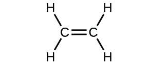
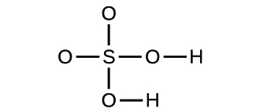
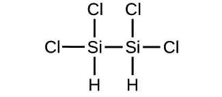
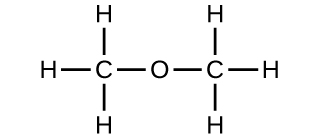

By the end of this section, you will be able to:
* Symbolize the composition of molecules using molecular formulas and empirical formulas
* Represent the bonding arrangement of atoms within molecules using structural formulas

A **molecular formula**{: data-type="term"} is a representation of a molecule that uses chemical symbols to indicate the types of atoms followed by subscripts to show the number of atoms of each type in the molecule. (A subscript is used only when more than one atom of a given type is present.) Molecular formulas are also used as abbreviations for the names of compounds.

The **structural formula**{: data-type="term"} for a compound gives the same information as its molecular formula (the types and numbers of atoms in the molecule) but also shows how the atoms are connected in the molecule. The structural formula for methane contains symbols for one C atom and four H atoms, indicating the number of atoms in the molecule ([\[link\]](#CNX_Chem_02_04_MethaneRep)). The lines represent bonds that hold the atoms together. (A chemical bond is an attraction between atoms or ions that holds them together in a molecule or a crystal.) We will discuss chemical bonds and see how to predict the arrangement of atoms in a molecule later. For now, simply know that the lines are an indication of how the atoms are connected in a molecule. A ball-and-stick model shows the geometric arrangement of the atoms with atomic sizes not to scale, and a space-filling model shows the relative sizes of the atoms.

  a molecular formula, (b) a structural formula, (c) a ball-and-stick model, and (d) a space-filling model. Carbon and hydrogen atoms are represented by black and white spheres, respectively."){: #CNX_Chem_02_04_MethaneRep}

Although many elements consist of discrete, individual atoms, some exist as molecules made up of two or more atoms of the element chemically bonded together. For example, most samples of the elements hydrogen, oxygen, and nitrogen are composed of molecules that contain two atoms each (called diatomic molecules) and thus have the molecular formulas H2, O2, and N2, respectively. Other elements commonly found as diatomic molecules are fluorine (F2), chlorine (Cl2), bromine (Br2), and iodine (I2). The most common form of the element sulfur is composed of molecules that consist of eight atoms of sulfur; its molecular formula is S8 ([\[link\]](#CNX_Chem_02_04_Sulfur)).

  a structural formula, (b) a ball-and-stick model, and (c) a space-filling model. Sulfur atoms are represented by yellow spheres."){: #CNX_Chem_02_04_Sulfur}

It is important to note that a subscript following a symbol and a number in front of a symbol do not represent the same thing; for example, H2 and 2H represent distinctly different species. H2 is a molecular formula; it represents a diatomic molecule of hydrogen, consisting of two atoms of the element that are chemically bonded together. The expression 2H, on the other hand, indicates two separate hydrogen atoms that are not combined as a unit. The expression 2H2 represents two molecules of diatomic hydrogen ([\[link\]](#CNX_Chem_02_04_Hydrogen)).

 {: #CNX_Chem_02_04_Hydrogen}

Compounds are formed when two or more elements chemically combine, resulting in the formation of bonds. For example, hydrogen and oxygen can react to form water, and sodium and chlorine can react to form table salt. We sometimes describe the composition of these compounds with an **empirical formula**{: data-type="term"}, which indicates the types of atoms present and *the simplest whole-number ratio of the number of atoms (or ions) in the compound*. For example, titanium dioxide (used as pigment in white paint and in the thick, white, blocking type of sunscreen) has an empirical formula of TiO2. This identifies the elements titanium (Ti) and oxygen (O) as the constituents of titanium dioxide, and indicates the presence of twice as many atoms of the element oxygen as atoms of the element titanium ([\[link\]](#CNX_Chem_02_04_TiO2)).

  The white compound titanium dioxide provides effective protection from the sun. (b) A crystal of titanium dioxide, TiO2, contains titanium and oxygen in a ratio of 1 to 2. The titanium atoms are gray and the oxygen atoms are red. (credit a: modification of work by &#x201C;osseous&#x201D;/Flickr)"){: #CNX_Chem_02_04_TiO2}

As discussed previously, we can describe a compound with a molecular formula, in which the subscripts indicate the *actual numbers of atoms* of each element in a molecule of the compound. In many cases, the molecular formula of a substance is derived from experimental determination of both its empirical formula and its **molecular mass**{: data-type="term" .no-emphasis} (the sum of atomic masses for all atoms composing the molecule). For example, it can be determined experimentally that benzene contains two elements, carbon (C) and hydrogen (H), and that for every carbon atom in benzene, there is one hydrogen atom. Thus, the empirical formula is CH. An experimental determination of the molecular mass reveals that a molecule of benzene contains six carbon atoms and six hydrogen atoms, so the molecular formula for benzene is C6H6 ([\[link\]](#CNX_Chem_02_04_Benzene)).

 ![Figure A shows that benzene is composed of six carbons shaped like a hexagon. Every other bond between the carbon atoms is a double bond. Each carbon also has a single bonded hydrogen atom. Figure B shows a 3-D, ball-and-stick drawing of benzene. The six carbon atoms are black spheres while the six hydrogen atoms are smaller, white spheres. Figure C is a space-filling model of benzene which shows that most of the interior space is occupied by the carbon atoms. The hydrogen atoms are embedded in the outside surface of the carbon atoms. Figure d shows a small vial filled with benzene which appears to be clear.](../resources/CNX_Chem_02_04_Benzene.jpg "Benzene, C6H6, is produced during oil refining and has many industrial uses. A benzene molecule can be represented as (a) a structural formula, (b) a ball-and-stick model, and (c) a space-filling model. (d) Benzene is a clear liquid. (credit d: modification of work by Sahar Atwa)"){: #CNX_Chem_02_04_Benzene}

If we know a compound’s formula, we can easily determine the empirical formula. (This is somewhat of an academic exercise; the reverse chronology is generally followed in actual practice.) For example, the molecular formula for acetic acid, the component that gives vinegar its sharp taste, is C2H4O2. This formula indicates that a molecule of acetic acid ([\[link\]](#CNX_Chem_02_04_AceticAcid)) contains two carbon atoms, four hydrogen atoms, and two oxygen atoms. The ratio of atoms is 2:4:2. Dividing by the lowest common denominator (2) gives the simplest, whole-number ratio of atoms, 1:2:1, so the empirical formula is CH2O. Note that a molecular formula is always a whole-number multiple of an empirical formula.

  Vinegar contains acetic acid, C2H4O2, which has an empirical formula of CH2O. It can be represented as (b) a structural formula and (c) as a ball-and-stick model. (credit a: modification of work by &#x201C;HomeSpot HQ&#x201D;/Flickr)"){: #CNX_Chem_02_04_AceticAcid}

Empirical and Molecular Formulas Molecules of glucose (blood sugar) contain 6 carbon atoms, 12 hydrogen atoms, and 6 oxygen atoms. What are the molecular and empirical formulas of glucose?

Solution The molecular formula is C6H12O6 because one molecule actually contains 6 C, 12 H, and 6 O atoms. The simplest whole-number ratio of C to H to O atoms in glucose is 1:2:1, so the empirical formula is CH2O.

Check Your Learning A molecule of metaldehyde (a pesticide used for snails and slugs) contains 8 carbon atoms, 16 hydrogen atoms, and 4 oxygen atoms. What are the molecular and empirical formulas of metaldehyde?

Answer:

Molecular formula, C8H16O4; empirical formula, C2H4O

  
You can explore [molecule building][1] using an online simulation.

Lee Cronin

What is it that chemists do? According to Lee **Cronin**{: data-type="term" .no-emphasis} ([\[link\]](#CNX_Chem_02_04_LeeCronin)), chemists make very complicated molecules by “chopping up” small molecules and “reverse engineering” them. He wonders if we could “make a really cool universal chemistry set” by what he calls “app-ing” chemistry. Could we “app” chemistry?

In a 2012 TED talk, Lee describes one fascinating possibility: combining a collection of chemical “inks” with a 3D printer capable of fabricating a reaction apparatus (tiny test tubes, beakers, and the like) to fashion a “universal toolkit of chemistry.” This toolkit could be used to create custom-tailored drugs to fight a new superbug or to “print” medicine personally configured to your genetic makeup, environment, and health situation. Says Cronin, “What Apple did for music, I’d like to do for the discovery and distribution of prescription drugs.”[1](#footnote1){: data-type="footnote-link"} View his [full talk][2] at the TED website.

"){: #CNX_Chem_02_04_LeeCronin}

It is important to be aware that it may be possible for the same atoms to be arranged in different ways: Compounds with the same molecular formula may have different atom-to-atom bonding and therefore different structures. For example, could there be another compound with the same formula as acetic acid, C2H4O2? And if so, what would be the structure of its molecules?

If you predict that another compound with the formula C2H4O2 could exist, then you demonstrated good chemical insight and are correct. Two C atoms, four H atoms, and two O atoms can also be arranged to form a methyl formate, which is used in manufacturing, as an insecticide, and for quick-drying finishes. Methyl formate molecules have one of the oxygen atoms between the two carbon atoms, differing from the arrangement in acetic acid molecules. Acetic acid and methyl formate are examples of **isomers**{: data-type="term"}—compounds with the same chemical formula but different molecular structures ([\[link\]](#CNX_Chem_02_04_Isomers)). Note that this small difference in the arrangement of the atoms has a major effect on their respective chemical properties. You would certainly not want to use a solution of methyl formate as a substitute for a solution of acetic acid (vinegar) when you make salad dressing.

 ![Figure A shows a structural diagram of acetic acid, C subscript 2 H subscript 4 O subscript 2. Acetic acid contains two carbon atoms connected by a single bond. The left carbon atom forms single bonds with three hydrogen atoms. The carbon on the right forms a double bond with an oxygen atom. The right carbon atom also forms a single bond to an oxygen atom which forms a single bond with a hydrogen atom. Figure B shows a structural diagram of methyl formate, C subscript 2 H subscript 4 O subscript 2. This molecule contains a carbon atom which forms single bonds with three hydrogen atoms, and a single bond with an oxygen atom. The oxygen atom forms a single bond with another carbon atom which forms a double bond with another oxygen atom and a single bond with a hydrogen atom.](../resources/CNX_Chem_02_04_Isomers.jpg "Molecules of (a) acetic acid and methyl formate (b) are structural isomers; they have the same formula (C2H4O2) but different structures (and therefore different chemical properties)."){: #CNX_Chem_02_04_Isomers}

Many types of isomers exist ([\[link\]](#CNX_Chem_02_04_Isomers2)). Acetic acid and methyl formate are **structural isomers**{: data-type="term"}, compounds in which the molecules differ in how the atoms are connected to each other. There are also various types of **spatial isomers**{: data-type="term"}, in which the relative orientations of the atoms in space can be different. For example, the compound carvone (found in caraway seeds, spearmint, and mandarin orange peels) consists of two isomers that are mirror images of each other. *S*-(+)-carvone smells like caraway, and *R*-(−)-carvone smells like spearmint.

 ![The top left portion of this 2 row, 4 column figure shows a structural diagram of positive carvone, C subscript 10 H subscript 14 O. This molecule has a carbon atom which forms a double bond with a C H subscript 2 group and a C H subscript 3 group. The carbon atom also forms a single bond with another carbon atom which is part of a ring. This carbon atom, being part of the ring, forms single bonds with a hydrogen atom, a C H subscript 2 group, and a C H subscript 2 group. The first C H subscript two group forms a single bond with C H which forms a double bond with a carbon atom. This carbon atom forms a single bond with a C H subscript 3 group. The carbon atom forming part of the ring forms a single bond with a carbon atom which forms a double bond with an oxygen atom and a single bond with a C H subscript 2 group to complete the ring. Below the structural diagram of carvone is a photo of caraway seeds. Column 2 contains identical ball and stick representations of the structural diagram in the top left position. The top right portions of these images each contains the letter &#x201C;S&#x201D; and there is an arrow pointing downward from the top image to the bottom image. Columns 3 and 4 are representations of negative carvone. The top row in column three depicts a mirrored image of the ball and stick structure to its left, reflected across the y axis. There is a downward pointing arrow to the image below, which is the same structure rotated counter clockwise 180 degrees. Both images in column 3 have an &#x201C;R&#x201D; in the top right corner. The image in the first row of column 4 is the same as the lewis structure in the first row of column 1, reflected across the y axis. Below this negative carvone structural diagram is a photo of spearmint leaves.](../resources/CNX_Chem_02_04_Isomers2.jpg "Molecules of carvone are spatial isomers; they only differ in the relative orientations of the atoms in space. (credit bottom left: modification of work by &#x201C;Miansari66&#x201D;/Wikimedia Commons; credit bottom right: modification of work by Forest &amp; Kim Starr)"){: #CNX_Chem_02_04_Isomers2}

  
Select this [link][3] to view an explanation of isomers, spatial isomers, and why they have different smells (select the video titled “Mirror Molecule: Carvone”).

### Key Concepts and Summary

A molecular formula uses chemical symbols and subscripts to indicate the exact numbers of different atoms in a molecule or compound. An empirical formula gives the simplest, whole-number ratio of atoms in a compound. A structural formula indicates the bonding arrangement of the atoms in the molecule. Ball-and-stick and space-filling models show the geometric arrangement of atoms in a molecule. Isomers are compounds with the same molecular formula but different arrangements of atoms.

### Chemistry End of Chapter Exercises

Explain why the symbol for an atom of the element oxygen and the formula for a molecule of oxygen differ.

The symbol for the element oxygen, O, represents both the element and one atom of oxygen. A molecule of oxygen, O2, contains two oxygen atoms; the subscript 2 in the formula must be used to distinguish the diatomic molecule from two single oxygen atoms.

Explain why the symbol for the element sulfur and the formula for a molecule of sulfur differ.

Write the molecular and empirical formulas of the following compounds:

(a)* * *
{: data-type="newline"}

* * *
{: data-type="newline"}

 (b)* * *
{: data-type="newline"}

* * *
{: data-type="newline"}

 (c)* * *
{: data-type="newline"}

* * *
{: data-type="newline"}

 (d)* * *
{: data-type="newline"}

(a) molecular CO2, empirical CO2; (b) molecular C2H2, empirical CH; (c) molecular C2H4, empirical CH2; (d) molecular H2SO4, empirical H2SO4

Write the molecular and empirical formulas of the following compounds:

(a)* * *
{: data-type="newline"}

![Figure A shows a structural diagram of four carbon atoms bonded together into a chain. The two carbon atoms on the left form a double bond with each other. All of the remaining carbon atoms form single bonds with each other. The leftmost carbon also forms single bonds with two hydrogen. The second carbon in the chain forms a single bond with a hydrogen atom. The third carbon in the chain forms a single bond with two hydrogen atoms each. The rightmost carbon forms a single bond with three hydrogen atoms each.](../resources/CNX_Chem_02_04_Question4a_img.jpg)
* * *
{: data-type="newline"}

 (b)* * *
{: data-type="newline"}

* * *
{: data-type="newline"}

 (c)* * *
{: data-type="newline"}

* * *
{: data-type="newline"}

 (d)* * *
{: data-type="newline"}

Determine the empirical formulas for the following compounds:

(a) caffeine, C8H10N4O2

(b) fructose, C12H22O11

(c) hydrogen peroxide, H2O2

(d) glucose, C6H12O6

(e) ascorbic acid (vitamin C), C6H8O6

(a) C4H5N2O; (b) C12H22O11; (c) HO; (d) CH2O; (e) C3H4O3

Determine the empirical formulas for the following compounds:

(a) acetic acid, C2H4O2

(b) citric acid, C6H8O7

(c) hydrazine, N2H4

(d) nicotine, C10H14N2

(e) butane, C4H10

Write the empirical formulas for the following compounds:

(a)* * *
{: data-type="newline"}

* * *
{: data-type="newline"}

 (b)* * *
{: data-type="newline"}

![Figure B shows a structural diagram containing a leftmost carbon that forms single bonds to three hydrogen atoms each. This leftmost carbon also forms a single bond to a second carbon atom. The second carbon atom forms a double bond with an oxygen atom. The second carbon also forms a single bond to a second oxygen atom. This oxygen atom forms a single bond to a third carbon atom. This third carbon atom forms single bonds with two hydrogen atoms each as well as a single bond with another carbon atom. The rightmost carbon atom forms a single bond with three hydrogen atoms each.](../resources/CNX_Chem_02_04_Question7b_img.jpg)

(a) CH2O; (b) C2H4O

Open the [Build a Molecule simulation][1] and select the “Larger Molecules” tab. Select an appropriate atoms “Kit” to build a molecule with two carbon and six hydrogen atoms. Drag atoms into the space above the “Kit” to make a molecule. A name will appear when you have made an actual molecule that exists (even if it is not the one you want). You can use the scissors tool to separate atoms if you would like to change the connections. Click on “3D” to see the molecule, and look at both the space-filling and ball-and-stick possibilities.

(a) Draw the structural formula of this molecule and state its name.

(b) Can you arrange these atoms in any way to make a different compound?

Use the [Build a Molecule simulation][1] to repeat [[link]](#fs-idm75792016), but build a molecule with two carbons, six hydrogens, and one oxygen.

(a) Draw the structural formula of this molecule and state its name.

(b) Can you arrange these atoms to make a different molecule? If so, draw its structural formula and state its name.

(c) How are the molecules drawn in (a) and (b) the same? How do they differ? What are they called (the type of relationship between these molecules, not their names).

(a) ethanol

(b) methoxymethane, more commonly known as dimethyl ether

(c) These molecules have the same chemical composition (types and number of atoms) but different chemical structures. They are structural isomers.

Use the [Build a Molecule simulation][1] to repeat [[link]](#fs-idm75792016), but build a molecule with three carbons, seven hydrogens, and one chlorine.

(a) Draw the structural formula of this molecule and state its name.

(b) Can you arrange these atoms to make a different molecule? If so, draw its structural formula and state its name.

(c) How are the molecules drawn in (a) and (b) the same? How do they differ? What are they called (the type of relationship between these molecules, not their names)?

### Footnotes
{: data-type="footnote-refs-title"}

* {: data-type="footnote-ref" #footnote1} [1](#footnote-ref1){: data-type="footnote-ref-link"} Lee Cronin, “Print Your Own Medicine,” Talk presented at TED Global 2012, Edinburgh, Scotland, June 2012.
{: data-list-type="bulleted" data-bullet-style="none"}

### Glossary
{: data-type="glossary-title"}

empirical formula
: formula showing the composition of a compound given as the simplest whole-number ratio of atoms
^

isomers
: compounds with the same chemical formula but different structures
^

molecular formula
: formula indicating the composition of a molecule of a compound and giving the actual number of atoms of each element in a molecule of the compound.
^

spatial isomers
: compounds in which the relative orientations of the atoms in space differ
^

structural formula
: shows the atoms in a molecule and how they are connected
^

structural isomer
: one of two substances that have the same molecular formula but different physical and chemical properties because their atoms are bonded differently

[1]: http://openstax.org/l/16molbuilding
[2]: http://openstax.org/l/16LeeCronin
[3]: http://openstax.org/l/16isomers
