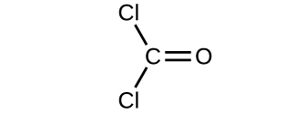
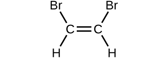
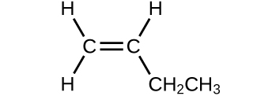
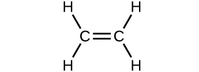
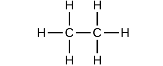

By the end of this section, you will be able to:
* Calculate formula masses for covalent and ionic compounds
* Define the amount unit mole and the related quantity Avogadro’s number Explain the relation between mass, moles, and numbers of atoms or molecules, and perform calculations deriving these quantities from one another

We can argue that modern chemical science began when scientists started exploring the quantitative as well as the qualitative aspects of chemistry. For example, Dalton’s atomic theory was an attempt to explain the results of measurements that allowed him to calculate the relative masses of elements combined in various compounds. Understanding the relationship between the masses of atoms and the chemical formulas of compounds allows us to quantitatively describe the composition of substances.

### Formula Mass

In an earlier chapter, we described the development of the atomic mass unit, the concept of average atomic masses, and the use of chemical formulas to represent the elemental makeup of substances. These ideas can be extended to calculate the **formula mass**{: data-type="term"} of a substance by summing the average atomic masses of all the atoms represented in the substance’s formula.

#### Formula Mass for Covalent Substances

For covalent substances, the formula represents the numbers and types of atoms composing a single molecule of the substance; therefore, the formula mass may be correctly referred to as a molecular mass. Consider chloroform (CHCl3), a covalent compound once used as a surgical anesthetic and now primarily used in the production of tetrafluoroethylene, the building block for the \"anti-stick\" polymer, Teflon. The molecular formula of chloroform indicates that a single molecule contains one carbon atom, one hydrogen atom, and three chlorine atoms. The average molecular mass of a chloroform molecule is therefore equal to the sum of the average atomic masses of these atoms. [\[link\]](#CNX_Chem_03_01_chloroform) outlines the calculations used to derive the molecular mass of chloroform, which is 119.37 amu.

![A table and diagram are shown. The table is made up of six columns and five rows. The header row reads: &#x201C;Element,&#x201D; &#x201C;Quantity,&#x201D; a blank space, &#x201C;Average atomic mass (a m u),&#x201D; a blank space, and &#x201C;Subtotal (a m u).&#x201D; The first column contains the symbols &#x201C;C,&#x201D; &#x201C;H,&#x201D; &#x201C;C l&#x201D; and a blank, merged cell that runs the width of the first five columns. The second column contains the numbers &#x201C;1,&#x201D; &#x201C;1,&#x201D; and &#x201C;3&#x201D; as well as the merged cell. The third column contains the multiplication symbol in each cell except for the last, merged cell. The fourth column contains the numbers &#x201C;12.01,&#x201D; &#x201C;1.008,&#x201D; and &#x201C;35.45&#x201D; as well as the merged cell. The fifth column contains the symbol &#x201C;=&#x201D; in each cell except for the last, merged cell. The sixth column contains the values &#x201C;12.01,&#x201D; &#x201C;1.008,&#x201D; &#x201C;106.35,&#x201D; and &#x201C;119.37.&#x201D; There is a thick black line below the number 106.35. The merged cell under the first five columns reads &#x201C;Molecular mass.&#x201D; To the left of the table is a diagram of a molecule. Three green spheres are attached to a slightly smaller black sphere, which is also attached to a smaller white sphere. The green spheres lie beneath and to the sides of the black sphere while the white sphere is located straight up from the black sphere.](../resources/CNX_Chem_03_01_chloroform.jpg "The average mass of a chloroform molecule, CHCl3, is 119.37 amu, which is the sum of the average atomic masses of each of its constituent atoms. The model shows the molecular structure of chloroform."){: #CNX_Chem_03_01_chloroform}

Likewise, the molecular mass of an aspirin molecule, C9H8O4, is the sum of the atomic masses of nine carbon atoms, eight hydrogen atoms, and four oxygen atoms, which amounts to 180.15 amu ([\[link\]](#CNX_Chem_03_01_aspirin)).

 ![A table and diagram are shown. The table is made up of six columns and five rows. The header row reads: &#x201C;Element,&#x201D; &#x201C;Quantity,&#x201D; a blank space, &#x201C;Average atomic mass (a m u),&#x201D; a blank space, and &#x201C;Subtotal (a m u).&#x201D; The first column contains the symbols &#x201C;C,&#x201D; &#x201C;H,&#x201D; &#x201C;O,&#x201D; and a merged cell. The merged cell runs the length of the first five columns. The second column contains the numbers &#x201C;9,&#x201D; &#x201C;8,&#x201D; and &#x201C;4&#x201D; as well as the merged, cell. The third column contains the multiplication symbol in each cell except for the last, merged cell. The fourth column contains the numbers &#x201C;12.01,&#x201D; &#x201C;1.008,&#x201D; and &#x201C;16.00&#x201D; as well as the merged cell. The fifth column contains the symbol &#x201C;=&#x201D; in each cell except for the last, merged cell. The sixth column contains the values: &#x201C;108.09,&#x201D; &#x201C;8.064,&#x201D; &#x201C;64.00,&#x201D; and &#x201C;180.15.&#x201D; There is a thick black line below the number 64.00. The merged cell under the first five columns reads &#x201C;Molecular mass.&#x201D; To the left of the table is a diagram of a molecule. Six black spheres are located in a six-sided ring and connected by alternating double and single black bonds. Attached to each of the four black spheres is one smaller white sphere. Attached to the farthest right black sphere is a red sphere, connected to two more black spheres, all in a row. Attached to the last black sphere of that row are two more white spheres. Attached to the first black sphere of that row is another red sphere. A black sphere, attached to two red spheres and a white sphere is attached to the black sphere on the top right of the six-sided ring.](../resources/CNX_Chem_03_01_aspirin.jpg "The average mass of an aspirin molecule is 180.15 amu. The model shows the molecular structure of aspirin, C9H8O4."){: #CNX_Chem_03_01_aspirin}

Computing Molecular Mass for a Covalent Compound Ibuprofen, C13H18O2, is a covalent compound and the active ingredient in several popular nonprescription pain medications, such as Advil and Motrin. What is the molecular mass (amu) for this compound?

Solution Molecules of this compound are comprised of 13 carbon atoms, 18 hydrogen atoms, and 2 oxygen atoms. Following the approach described above, the average molecular mass for this compound is therefore:

![A table is shown that is made up of six columns and five rows. The header row reads: &#x201C;Element,&#x201D; &#x201C;Quantity,&#x201D; a blank space, &#x201C;Average atomic mass (a m u),&#x201D; a blank space, and &#x201C;Subtotal (a m u).&#x201D; The first column contains the symbols &#x201C;C,&#x201D; &#x201C;H,&#x201D; &#x201C;O,&#x201D; and a merged cell. The merged cell runs the length of the first five columns. The second column contains the numbers &#x201C;13,&#x201D; &#x201C;8,&#x201D; and &#x201C;2&#x201D; as well as the merged cell. The third column contains the multiplication symbol in each cell except for the last, merged cell. The fourth column contains the numbers &#x201C;12.01,&#x201D; &#x201C;1.008,&#x201D; and &#x201C;16.00&#x201D; as well as the merged cell. The fifth column contains the symbol &#x201C;=&#x201D; in each cell except for the last, merged cell. The sixth column contains the values &#x201C;156.13,&#x201D; &#x201C;18.114,&#x201D; &#x201C;32.00,&#x201D; and &#x201C;206.27.&#x201D; There is a thick black line below the number 32.00. The merged cell under the first five columns reads &#x201C;Molecular mass.&#x201D; To the right is a ball-and-stick model of the structure. At the center, it shows six black spheres arranged in a six-sided ring with alternating double bonds. The two black spheres at the top and bottom of the six-sided ring are each bonded to one, smaller, white sphere. The black sphere on the left side of the six-sided ring is connect to another black sphere. This sphere is connected to two smaller, white spheres and another black sphere. This black sphere is connected to one, smaller white sphere, and two other black spheres. Each of these last two black spheres is connected to two smaller, white spheres. The black sphere on the right side of the six-sided ring is connected to another black sphere. This black sphere is connected to one smaller, white sphere and two other black spheres. The black sphere that is connected to it and is situated to the top right is connected to two smaller, white spheres. The black sphere connected towards the bottom right is connected to two red spheres. It forms a double bond with one of these red spheres and the other red sphere is connected to a smaller, white sphere.](../resources/CNX_Chem_03_01_ibuprofenmass_img.jpg)

Check Your Learning Acetaminophen, C8H9NO2, is a covalent compound and the active ingredient in several popular nonprescription pain medications, such as Tylenol. What is the molecular mass (amu) for this compound?

Answer:

151\.16 amu

#### Formula Mass for Ionic Compounds

Ionic compounds are composed of discrete cations and anions combined in ratios to yield electrically neutral bulk matter. The formula mass for an ionic compound is calculated in the same way as the formula mass for covalent compounds: by summing the average atomic masses of all the atoms in the compound’s formula. Keep in mind, however, that the formula for an ionic compound does not represent the composition of a discrete molecule, so it may not correctly be referred to as the “molecular mass.”

As an example, consider sodium chloride, NaCl, the chemical name for common table salt. Sodium chloride is an ionic compound composed of sodium cations, Na+, and chloride anions, Cl−, combined in a 1:1 ratio. The formula mass for this compound is computed as 58.44 amu (see [\[link\]](#CNX_Chem_03_01_saltMass)).

 ![A table and diagram are shown. The table is made up of six columns and four rows. The header row reads: &#x201C;Element,&#x201D; &#x201C;Quantity,&#x201D; a blank space, &#x201C;Average atomic mass (a m u),&#x201D; a blank space and &#x201C;Subtotal (a m u).&#x201D; The first column contains the symbols &#x201C;N a&#x201D;, &#x201C;C l,&#x201D; and a merged cell. The merged cell runs the length of the first five columns. The second column contains the numbers &#x201C;1&#x201D; and &#x201C;1&#x201D; as well as the merged cell. The third column contains the multiplication symbol in each cell except for the last, merged cell. The fourth column contains the numbers &#x201C;22.99&#x201D; and &#x201C;35.45&#x201D; as well as the merged cell. The fifth column contains the symbol &#x201C;=&#x201D; in each cell except for the last, merged cell. The sixth column contains the values &#x201C;22.99,&#x201D; &#x201C;35.45,&#x201D; and &#x201C;58.44.&#x201D; There is a thick black line below the number &#x201C;35.45.&#x201D; The merged cell under the first five columns reads &#x201C;Formula mass.&#x201D; To the left of the table is a diagram of a chemical structure. The diagram shows green and purple spheres placed in an alternating pattern, making up the corners of eight stacked cubes to form one larger cube. The green spheres are slightly smaller than the purple spheres.](../resources/CNX_Chem_03_01_saltMass.jpg "Table salt, NaCl, contains an array of sodium and chloride ions combined in a 1:1 ratio. Its formula mass is 58.44 amu."){: #CNX_Chem_03_01_saltMass}

Note that the average masses of neutral sodium and chlorine atoms were used in this computation, rather than the masses for sodium cations and chlorine anions. This approach is perfectly acceptable when computing the formula mass of an ionic compound. Even though a sodium cation has a slightly smaller mass than a sodium atom (since it is missing an electron), this difference will be offset by the fact that a chloride anion is slightly more massive than a chloride atom (due to the extra electron). Moreover, the mass of an electron is negligibly small with respect to the mass of a typical atom. Even when calculating the mass of an isolated ion, the missing or additional electrons can generally be ignored, since their contribution to the overall mass is negligible, reflected only in the nonsignificant digits that will be lost when the computed mass is properly rounded. The few exceptions to this guideline are very light ions derived from elements with precisely known atomic masses.

Computing Formula Mass for an Ionic Compound Aluminum sulfate, Al2(SO4)3, is an ionic compound that is used in the manufacture of paper and in various water purification processes. What is the formula mass (amu) of this compound?

Solution The formula for this compound indicates it contains Al3+ and SO42− ions combined in a 2:3 ratio. For purposes of computing a formula mass, it is helpful to rewrite the formula in the simpler format, Al2S3O12. Following the approach outlined above, the formula mass for this compound is calculated as follows:

![A table is shown that is made up of six columns and five rows. The header row reads: &#x201C;Element,&#x201D; &#x201C;Quantity,&#x201D; a blank space, &#x201C;Average atomic mass (a m u),&#x201D; a blank space, and &#x201C;Subtotal (a m u).&#x201D; The first column contains the symbols &#x201C;A l,&#x201D; &#x201C;S,&#x201D; &#x201C;O,&#x201D; and a merged cell. The merged cell runs the length of the first five columns. The second column contains the numbers &#x201C;2,&#x201D; &#x201C;3,&#x201D; and &#x201C;12&#x201D; as well as the merged cell. The third column contains the multiplication symbol in each cell except for the last, merged cell. The fourth column contains the numbers &#x201C;26.98,&#x201D; &#x201C;32.06,&#x201D; and &#x201C;16.00&#x201D; as well as the merged cell. The fifth column contains the symbol &#x201C;=&#x201D; in each cell except for the last, merged cell. The sixth column contains the values &#x201C;53.96,&#x201D; &#x201C;96.18,&#x201D; &#x201C;192.00,&#x201D; and &#x201C;342.14.&#x201D; There is a thick black line under the number 192.00. The merged cell under the first five columns reads &#x201C;Molecular mass.&#x201D; To the right of this table is a ball-and-stick structure. It shows yellow and grey sphere connected to red spheres in a complex pattern. The yellow and grey spheres are similar in size, but the red spheres appear to be smaller by comparison.](../resources/CNX_Chem_03_01_alsulfatemass_img.jpg)

Check Your Learning Calcium phosphate, Ca3(PO4)2, is an ionic compound and a common anti-caking agent added to food products. What is the formula mass (amu) of calcium phosphate?

Answer:

310\.18 amu

### The Mole

The identity of a substance is defined not only by the types of atoms or ions it contains, but by the quantity of each type of atom or ion. For example, water, H2O, and hydrogen peroxide, H2O2, are alike in that their respective molecules are composed of hydrogen and oxygen atoms. However, because a hydrogen peroxide molecule contains two oxygen atoms, as opposed to the water molecule, which has only one, the two substances exhibit very different properties. Today, we possess sophisticated instruments that allow the direct measurement of these defining microscopic traits; however, the same traits were originally derived from the measurement of macroscopic properties (the masses and volumes of bulk quantities of matter) using relatively simple tools (balances and volumetric glassware). This experimental approach required the introduction of a new unit for amount of substances, the *mole*, which remains indispensable in modern chemical science.

The mole is an amount unit similar to familiar units like pair, dozen, gross, etc. It provides a specific measure of *the number* of atoms or molecules in a bulk sample of matter. A **mole**{: data-type="term"} is defined as the amount of substance containing the same number of discrete entities (such as atoms, molecules, and ions) as the number of atoms in a sample of pure 12C weighing exactly 12 g. One Latin connotation for the word “mole” is “large mass” or “bulk,” which is consistent with its use as the name for this unit. The mole provides a link between an easily measured macroscopic property, bulk mass, and an extremely important fundamental property, number of atoms, molecules, and so forth.

The number of entities composing a mole has been experimentally determined to be 6.02214179 <math xmlns="http://www.w3.org/1998/Math/MathML"><mo>×</mo></math>

 1023, a fundamental constant named **Avogadro’s number (*NA*)**{: data-type="term"} or the Avogadro constant in honor of Italian scientist Amedeo Avogadro. This constant is properly reported with an explicit unit of “per mole,” a conveniently rounded version being 6.022 <math xmlns="http://www.w3.org/1998/Math/MathML"><mo>×</mo></math>

 1023/mol.

Consistent with its definition as an amount unit, 1 mole of any element contains the same number of atoms as 1 mole of any other element. The masses of 1 mole of different elements, however, are different, since the masses of the individual atoms are drastically different. The **molar mass**{: data-type="term"} of an element (or compound) is the mass in grams of 1 mole of that substance, a property expressed in units of grams per mole (g/mol) (see [\[link\]](#CNX_Chem_03_02_moles)).

 : 65.4 g zinc, 12.0 g carbon, 24.3 g magnesium, and 63.5 g copper. From left to right (bottom row): 32.1 g sulfur, 28.1 g silicon, 207 g lead, and 118.7 g tin. (credit: modification of work by Mark Ott)"){: #CNX_Chem_03_02_moles}

Because the definitions of both the mole and the atomic mass unit are based on the same reference substance, 12C, the molar mass of any substance is numerically equivalent to its atomic or formula weight in amu. Per the amu definition, a single 12C atom weighs 12 amu (its atomic mass is 12 amu). According to the definition of the mole, 12 g of 12C contains 1 mole of 12C atoms (its molar mass is 12 g/mol). This relationship holds for all elements, since their atomic masses are measured relative to that of the amu-reference substance, 12C. Extending this principle, the molar mass of a compound in grams is likewise numerically equivalent to its formula mass in amu ([\[link\]](#CNX_Chem_03_02_compound)).

 , 454.4 g of HgI2 (mercury(II) iodide, formula mass 454.4 amu), 32.0 g of CH3OH (methanol, formula mass 32.0 amu) and 256.5 g of S8 (sulfur, formula mass 256.5 amu). (credit: Sahar Atwa)"){: #CNX_Chem_03_02_compound}

| Element | Average Atomic Mass (amu) | Molar Mass (g/mol) | Atoms/Mole |
{: valign="top"}|----------
| C | 12.01 | 12.01 | 6.022 <math xmlns="http://www.w3.org/1998/Math/MathML"><mo>×</mo></math>

 1023 |
{: valign="top"}| H | 1.008 | 1.008 | 6.022 <math xmlns="http://www.w3.org/1998/Math/MathML"><mo>×</mo></math>

 1023 |
{: valign="top"}| O | 16.00 | 16.00 | 6.022 <math xmlns="http://www.w3.org/1998/Math/MathML"><mo>×</mo></math>

 1023 |
{: valign="top"}| Na | 22.99 | 22.99 | 6.022 <math xmlns="http://www.w3.org/1998/Math/MathML"><mo>×</mo></math>

 1023 |
{: valign="top"}| Cl | 35.45 | 33.45 | 6.022 <math xmlns="http://www.w3.org/1998/Math/MathML"><mo>×</mo></math>

 1023 |
{: valign="top"}{: .medium .unnumbered summary="A table is shown that is made up of four columns and six rows. The header row reads: &#x201C;Element,&#x201D; &#x201C;Average Atomic Mass (a m u),&#x201D; &#x201C;Molar Mass (g / m o l),&#x201D; and &#x201C;Atoms / Mole.&#x201D; The first column contains the symbols &#x201C;C,&#x201D; &#x201C;H,&#x201D; &#x201C;O,&#x201D; &#x201C;N a,&#x201D; and &#x201C;C l.&#x201D; The second column contains the values &#x201C;12.01,&#x201D; &#x201C;1.008,&#x201D; &#x201C;16.00,&#x201D; &#x201C;22.99,&#x201D; and &#x201C;33.45.&#x201D; The third column contains the values &#x201C;12.01,&#x201D; &#x201C;1.008,&#x201D; &#x201C;16.00,&#x201D; &#x201C;22.99,&#x201D; and &#x201C;33.45.&#x201D; The final column contains the value &#x201C;6.022 times 10 superscript 23&#x201D; in each cell." data-label=""}

While atomic mass and molar mass are numerically equivalent, keep in mind that they are vastly different in terms of scale, as represented by the vast difference in the magnitudes of their respective units (amu versus g). To appreciate the enormity of the mole, consider a small drop of water weighing about 0.03 g (see [\[link\]](#CNX_Chem_03_02_water)). Although this represents just a tiny fraction of 1 mole of water (~18 g), it contains more water molecules than can be clearly imagined. If the molecules were distributed equally among the roughly seven billion people on earth, each person would receive more than 100 billion molecules.

 "){: #CNX_Chem_03_02_water}

The mole is used in chemistry to represent 6.022 <math xmlns="http://www.w3.org/1998/Math/MathML"><mo>×</mo></math>

 1023 of something, but it can be difficult to conceptualize such a large number. Watch this [video][1] and then complete the “Think” questions that follow. Explore more about the mole by reviewing the information under “Dig Deeper.”

The relationships between formula mass, the mole, and Avogadro’s number can be applied to compute various quantities that describe the composition of substances and compounds. For example, if we know the mass and chemical composition of a substance, we can determine the number of moles and calculate number of atoms or molecules in the sample. Likewise, if we know the number of moles of a substance, we can derive the number of atoms or molecules and calculate the substance’s mass.

Deriving Moles from Grams for an Element According to nutritional guidelines from the US Department of Agriculture, the estimated average requirement for dietary potassium is 4.7 g. What is the estimated average requirement of potassium in moles?

Solution The mass of K is provided, and the corresponding amount of K in moles is requested. Referring to the periodic table, the atomic mass of K is 39.10 amu, and so its molar mass is 39.10 g/mol. The given mass of K (4.7 g) is a bit more than one-tenth the molar mass (39.10 g), so a reasonable “ballpark” estimate of the number of moles would be slightly greater than 0.1 mol.

The molar amount of a substance may be calculated by dividing its mass (g) by its molar mass (g/mol):

The factor-label method supports this mathematical approach since the unit “g” cancels and the answer has units of “mol:”

<math xmlns="http://www.w3.org/1998/Math/MathML"><mrow><mn>4.7</mn><mspace width="0.2em" /><menclose notation="horizontalstrike"><mtext>g</mtext></menclose><mspace width="0.2em" /><mtext>K</mtext><mspace width="0.2em" /><mrow><mo>(</mo><mrow><mfrac><mrow><mtext>mol K</mtext></mrow><mrow><mn>39.10</mn><mspace width="0.2em" /><menclose notation="horizontalstrike"><mtext>g</mtext></menclose></mrow></mfrac></mrow><mo>)</mo><mspace width="0.2em" /></mrow><mo>=</mo><mspace width="0.2em" /><mn>0.12</mn><mspace width="0.2em" /><mtext>mol K</mtext></mrow></math>

The calculated magnitude (0.12 mol K) is consistent with our ballpark expectation, since it is a bit greater than 0.1 mol.

Check Your Learning Beryllium is a light metal used to fabricate transparent X-ray windows for medical imaging instruments. How many moles of Be are in a thin-foil window weighing 3.24 g?

Answer:

0\.360 mol

Deriving Grams from Moles for an Element A liter of air contains 9.2 <math xmlns="http://www.w3.org/1998/Math/MathML"><mo>×</mo></math>

 10−4 mol argon. What is the mass of Ar in a liter of air?

Solution The molar amount of Ar is provided and must be used to derive the corresponding mass in grams. Since the amount of Ar is less than 1 mole, the mass will be less than the mass of 1 mole of Ar, approximately 40 g. The molar amount in question is approximately one-one thousandth (~10−3) of a mole, and so the corresponding mass should be roughly one-one thousandth of the molar mass (~0.04 g):

In this case, logic dictates (and the factor-label method supports) multiplying the provided amount (mol) by the molar mass (g/mol):

<math xmlns="http://www.w3.org/1998/Math/MathML"><mrow><mn>9.2</mn><mspace width="0.2em" /><mo>×</mo><mspace width="0.2em" /><msup><mrow><mn>10</mn></mrow><mrow><mn>−4</mn></mrow></msup><mspace width="0.2em" /><menclose notation="horizontalstrike"><mrow><mtext>mol</mtext></mrow></menclose><mspace width="0.2em" /><mtext>Ar</mtext><mspace width="0.2em" /><mrow><mo>(</mo><mrow><mfrac><mrow><mn>39.95</mn><mspace width="0.2em" /><mtext>g</mtext></mrow><mrow><menclose notation="horizontalstrike"><mrow><mtext>mol</mtext></mrow></menclose><mspace width="0.2em" /><mtext>Ar</mtext></mrow></mfrac></mrow><mo>)</mo><mspace width="0.2em" /></mrow><mo>=</mo><mspace width="0.2em" /><mn>0.037</mn><mspace width="0.2em" /><mtext>g Ar</mtext></mrow></math>

The result is in agreement with our expectations, around 0.04 g Ar.

Check Your Learning What is the mass of 2.561 mol of gold?

Answer:

504\.4 g

Deriving Number of Atoms from Mass for an Element Copper is commonly used to fabricate electrical wire ([\[link\]](#CNX_Chem_03_02_copper)). How many copper atoms are in 5.00 g of copper wire?

"){: #CNX_Chem_03_02_copper}

Solution The number of Cu atoms in the wire may be conveniently derived from its mass by a two-step computation: first calculating the molar amount of Cu, and then using Avogadro’s number (*NA*) to convert this molar amount to number of Cu atoms:

![A diagram of three boxes connected by a right-facing arrow in between each is shown. The box on the left contains the phrase, &#x201C;Mass of C u atoms ( g ),&#x201D; the middle box reads, &#x201C;Moles of C u atoms ( mol ),&#x201D; while the one on the right contains the phrase, &#x201C;Number of C u atoms.&#x201D; There is a phrase under the left arrow that says &#x201C;Divide by molar mass (g / mol),&#x201D; and under the right arrow it states, &#x201C;Multiply by Avogadro&#x2019;s number ( mol superscript negative one ).&#x201D;](../resources/CNX_Chem_03_02_copperMoles_img.jpg)

Considering that the provided sample mass (5.00 g) is a little less than one-tenth the mass of 1 mole of Cu (~64 g), a reasonable estimate for the number of atoms in the sample would be on the order of one-tenth *NA*, or approximately 1022 Cu atoms. Carrying out the two-step computation yields:

<math xmlns="http://www.w3.org/1998/Math/MathML"><mrow><mn>5.00</mn><mspace width="0.2em" /><menclose notation="horizontalstrike"><mtext>g</mtext></menclose><mspace width="0.2em" /><mtext>Cu</mtext><mspace width="0.2em" /><mrow><mo>(</mo><mrow><mfrac><mrow><menclose notation="horizontalstrike"><mrow><mtext>mol</mtext></mrow></menclose><mspace width="0.2em" /><mtext>Cu</mtext></mrow><mrow><mn>63.55</mn><mspace width="0.2em" /><menclose notation="horizontalstrike"><mtext>g</mtext></menclose></mrow></mfrac></mrow><mo>)</mo></mrow><mrow><mo>(</mo><mrow><mfrac><mrow><mn>6.022</mn><mspace width="0.2em" /><mo>×</mo><mspace width="0.2em" /><msup><mrow><mn>10</mn></mrow><mrow><mn>23</mn></mrow></msup><mspace width="0.2em" /><mtext>atoms</mtext></mrow><mrow><menclose notation="horizontalstrike"><mrow><mtext>mol</mtext></mrow></menclose></mrow></mfrac></mrow><mo>)</mo><mspace width="0.2em" /></mrow><mo>=</mo><mspace width="0.2em" /><mn>4.74</mn><mspace width="0.2em" /><mo>×</mo><mspace width="0.2em" /><msup><mrow><mn>10</mn></mrow><mrow><mn>22</mn></mrow></msup><mtext>atoms of copper</mtext></mrow></math>

The factor-label method yields the desired cancellation of units, and the computed result is on the order of 1022 as expected.

Check Your Learning A prospector panning for gold in a river collects 15.00 g of pure gold. How many Au atoms are in this quantity of gold?

Answer:

4\.586 <math xmlns="http://www.w3.org/1998/Math/MathML"><mo>×</mo></math>

 1022 Au atoms

Deriving Moles from Grams for a Compound Our bodies synthesize protein from amino acids. One of these amino acids is glycine, which has the molecular formula C2H5O2N. How many moles of glycine molecules are contained in 28.35 g of glycine?

Solution We can derive the number of moles of a compound from its mass following the same procedure we used for an element in [\[link\]](#fs-idp76540048)\:

The molar mass of glycine is required for this calculation, and it is computed in the same fashion as its molecular mass. One mole of glycine, C2H5O2N, contains 2 moles of carbon, 5 moles of hydrogen, 2 moles of oxygen, and 1 mole of nitrogen:

![A table is shown that is made up of six columns and six rows. The header row reads: &#x201C;Element,&#x201D; &#x201C;Quantity (mol element / mol compound,&#x201D; a blank space, &#x201C;Molar mass (g / mol element),&#x201D; a blank space, and &#x201C;Subtotal (a m u).&#x201D; The first column contains the symbols &#x201C;C,&#x201D; &#x201C;H,&#x201D; &#x201C;O,&#x201D; &#x201C;N,&#x201D; and a merged cell. The merged cell runs the width of the first five columns. The second column contains the numbers &#x201C;2,&#x201D; &#x201C;5,&#x201D; &#x201C;2,&#x201D; and &#x201C;1&#x201D; as well as the merged cell. The third column contains the multiplication symbol in each cell except for the last, merged cell. The fourth column contains the numbers &#x201C;12.01,&#x201D; &#x201C;1.008,&#x201D; &#x201C;16.00,&#x201D; and &#x201C;14.007&#x201D; as well as the merged cell. The fifth column contains the symbol &#x201C;=&#x201D; in each cell except for the last, merged cell. The sixth column contains the values &#x201C;24.02,&#x201D; &#x201C;5.040,&#x201D; &#x201C;32.00,&#x201D; &#x201C;14.007,&#x201D; and &#x201C;75.07.&#x201D; There is a thick black line under the number 14.007. The merged cell under the first five columns reads &#x201C;Molar mass (g / mol compound). There is a ball-and-stick drawing to the right of this table. It shows a black sphere that forms a double bond with a slightly smaller red sphere, a single bond with another red sphere, and a single bond with another black sphere. The red sphere that forms a single bond with the black sphere also forms a single bond with a smaller, white sphere. The second black sphere forms a single bond with a smaller, white sphere and a smaller blue sphere. The blue sphere forms a single bond with two smaller, white spheres each.](../resources/CNX_Chem_03_01_glycinemass_img.jpg)

The provided mass of glycine (~28 g) is a bit more than one-third the molar mass (~75 g/mol), so we would expect the computed result to be a bit greater than one-third of a mole (~0.33 mol). Dividing the compound’s mass by its molar mass yields:

<math xmlns="http://www.w3.org/1998/Math/MathML"><mrow><mn>28.35</mn><mspace width="0.2em" /><menclose notation="horizontalstrike"><mtext>g</mtext></menclose><mspace width="0.2em" /><mtext>glycine</mtext><mspace width="0.2em" /><mrow><mo>(</mo><mrow><mfrac><mrow><mtext>mol glycine</mtext></mrow><mrow><mn>75.07</mn><mspace width="0.2em" /><menclose notation="horizontalstrike"><mtext>g</mtext></menclose></mrow></mfrac></mrow><mo>)</mo><mspace width="0.2em" /></mrow><mo>=</mo><mspace width="0.2em" /><mn>0.378</mn><mspace width="0.2em" /><mtext>mol glycine</mtext></mrow></math>

This result is consistent with our rough estimate.

Check Your Learning How many moles of sucrose, C12H22O11, are in a 25-g sample of sucrose?

Answer:

0\.073 mol

Deriving Grams from Moles for a Compound Vitamin C is a covalent compound with the molecular formula C6H8O6. The recommended daily dietary allowance of vitamin C for children aged 4–8 years is 1.42 <math xmlns="http://www.w3.org/1998/Math/MathML"><mo>×</mo></math>

 10−4 mol. What is the mass of this allowance in grams?

Solution As for elements, the mass of a compound can be derived from its molar amount as shown:

The molar mass for this compound is computed to be 176.124 g/mol. The given number of moles is a very small fraction of a mole (~10−4 or one-ten thousandth); therefore, we would expect the corresponding mass to be about one-ten thousandth of the molar mass (~0.02 g). Performing the calculation, we get:

<math xmlns="http://www.w3.org/1998/Math/MathML"><mrow><mn>1.42</mn><mspace width="0.2em" /><mo>×</mo><mspace width="0.2em" /><msup><mrow><mn>10</mn></mrow><mrow><mn>−4</mn></mrow></msup><mspace width="0.2em" /><menclose notation="horizontalstrike"><mrow><mtext>mol</mtext></mrow></menclose><mspace width="0.2em" /><mtext>vitamin C</mtext><mrow><mspace width="0.2em" /><mo>(</mo><mrow><mfrac><mrow><mn>176.124</mn><mspace width="0.2em" /><mtext>g</mtext></mrow><mrow><menclose notation="horizontalstrike"><mrow><mtext>mol</mtext></mrow></menclose><mspace width="0.2em" /><mtext>vitamin C</mtext></mrow></mfrac></mrow><mo>)</mo><mspace width="0.2em" /></mrow><mo>=</mo><mspace width="0.2em" /><mn>0.0250</mn><mspace width="0.2em" /><mtext>g vitamin C</mtext></mrow></math>

This is consistent with the anticipated result.

Check Your Learning What is the mass of 0.443 mol of hydrazine, N2H4?

Answer:

14\.2 g

Deriving the Number of Atoms and Molecules from the Mass of a Compound A packet of an artificial sweetener contains 40.0 mg of saccharin (C7H5NO3S), which has the structural formula:

![A diagram of a molecule is shown that is made up of two ring structures attached together. The left ring is hexagonal in shape with C atoms at each point of the ring and alternating single and double bonds. A double bond occurs between the C atom at the top vertex of the hexagon and the C atom down and to the left of it. The C atoms on the left, top, and bottom of the structure form a single bond to an H atom each. The two right C atoms make up one side of a pentagon and the other points of the pentagon are made up of a C atom, an N atom, and an S atom if read clockwise. The C atom forms a double bond with an O atom. The N atom forms a single bond with an H atom. The S atom forms two double bonds to two O atoms.](../resources/CNX_Chem_03_02_saccharin_img.jpg)

Given that saccharin has a molar mass of 183.18 g/mol, how many saccharin molecules are in a 40.0-mg (0.0400-g) sample of saccharin? How many carbon atoms are in the same sample?

Solution The number of molecules in a given mass of compound is computed by first deriving the number of moles, as demonstrated in [\[link\]](#fs-idm1714048), and then multiplying by Avogadro’s number:

![A diagram of three boxes connected by a right-facing arrow in between each is shown. The box on the left contains the phrase, &#x201C;Mass of C subscript seven H subscript five N O subscript three S ( g ),&#x201D; the middle box reads, &#x201C;Moles of C subscript seven H subscript five N O subscript three S ( mol ),&#x201D; while the one on the right contains the phrase, &#x201C;Number of C subscript seven H subscript five N O subscript three S molecules.&#x201D; There is a phrase under the left arrow that says, &#x201C;Divide by molar mass (g / mol),&#x201D; and under the right arrow it states, &#x201C;Multiply by Avogadro&#x2019;s number ( mol superscript negative one).&#x201D;](../resources/CNX_Chem_03_02_sacch_img.jpg)

Using the provided mass and molar mass for saccharin yields:

<math xmlns="http://www.w3.org/1998/Math/MathML"><mtable columnalign="left"><mtr /><mtr /><mtr><mtd><mn>0.0400</mn><mspace width="0.2em" /><menclose notation="horizontalstrike"><mtext>g</mtext></menclose><mspace width="0.2em" /><msub><mtext>C</mtext><mn>7</mn></msub><msub><mtext>H</mtext><mn>5</mn></msub><msub><mtext>NO</mtext><mn>3</mn></msub><mtext>S</mtext><mspace width="0.2em" /><mrow><mo>(</mo><mrow><mfrac><mrow><menclose notation="horizontalstrike"><mrow><mtext>mol</mtext></mrow></menclose><mspace width="0.2em" /><msub><mtext>C</mtext><mn>7</mn></msub><msub><mtext>H</mtext><mn>5</mn></msub><msub><mrow><mtext>NO</mtext></mrow><mn>3</mn></msub><mtext>S</mtext></mrow><mrow><mn>183.18</mn><mspace width="0.2em" /><menclose notation="horizontalstrike"><mtext>g</mtext></menclose><mspace width="0.2em" /><msub><mtext>C</mtext><mn>7</mn></msub><msub><mtext>H</mtext><mn>5</mn></msub><msub><mrow><mtext>NO</mtext></mrow><mn>3</mn></msub><mtext>S</mtext></mrow></mfrac></mrow><mo>)</mo></mrow><mrow><mo>(</mo><mrow><mfrac><mrow><mn>6.022</mn><mspace width="0.2em" /><mo>×</mo><mspace width="0.2em" /><msup><mrow><mn>10</mn></mrow><mrow><mn>23</mn></mrow></msup><mspace width="0.2em" /><msub><mtext>C</mtext><mn>7</mn></msub><msub><mtext>H</mtext><mn>5</mn></msub><msub><mrow><mtext>NO</mtext></mrow><mn>3</mn></msub><mtext>S</mtext><mspace width="0.2em" /><mtext>molecules</mtext></mrow><mrow><mn>1</mn><mspace width="0.2em" /><menclose notation="horizontalstrike"><mrow><mtext>mol</mtext></mrow></menclose><mspace width="0.2em" /><msub><mtext>C</mtext><mn>7</mn></msub><msub><mtext>H</mtext><mn>5</mn></msub><msub><mrow><mtext>NO</mtext></mrow><mn>3</mn></msub><mtext>S</mtext></mrow></mfrac></mrow><mo>)</mo></mrow></mtd></mtr><mtr><mtd><mo>=</mo><mspace width="0.2em" /><mn>1.31</mn><mspace width="0.2em" /><mo>×</mo><mspace width="0.2em" /><msup><mn>10</mn><mrow><mn>20</mn></mrow></msup><mspace width="0.2em" /><msub><mtext>C</mtext><mn>7</mn></msub><msub><mtext>H</mtext><mn>5</mn></msub><msub><mtext>NO</mtext><mn>3</mn></msub><mtext>S</mtext><mspace width="0.2em" /><mtext>molecules</mtext></mtd></mtr></mtable></math>

The compound’s formula shows that each molecule contains seven carbon atoms, and so the number of C atoms in the provided sample is:

<math xmlns="http://www.w3.org/1998/Math/MathML"><mrow><mn>1.31</mn><mspace width="0.2em" /><mo>×</mo><mspace width="0.2em" /><msup><mrow><mn>10</mn></mrow><mrow><mn>20</mn></mrow></msup><mspace width="0.2em" /><msub><mtext>C</mtext><mn>7</mn></msub><msub><mtext>H</mtext><mn>5</mn></msub><msub><mrow><mtext>NO</mtext></mrow><mn>3</mn></msub><mtext>S molecules</mtext><mspace width="0.2em" /><mrow><mo>(</mo><mrow><mfrac><mrow><mn>7</mn><mspace width="0.2em" /><mtext>C atoms</mtext></mrow><mrow><mn>1</mn><mspace width="0.2em" /><msub><mtext>C</mtext><mn>7</mn></msub><msub><mtext>H</mtext><mn>5</mn></msub><msub><mrow><mtext>NO</mtext></mrow><mn>3</mn></msub><mtext>S molecule</mtext></mrow></mfrac></mrow><mo>)</mo><mspace width="0.2em" /></mrow><mo>=</mo><mspace width="0.2em" /><mn>9.20</mn><mspace width="0.2em" /><mo>×</mo><mspace width="0.2em" /><msup><mrow><mn>10</mn></mrow><mrow><mn>21</mn></mrow></msup><mspace width="0.2em" /><mtext>C atoms</mtext></mrow></math>

Check Your Learning How many C4H10 molecules are contained in 9.213 g of this compound? How many hydrogen atoms?

Answer:

9\.545 <math xmlns="http://www.w3.org/1998/Math/MathML"><mo>×</mo></math>

 1022 molecules C4 H10; 9.545 <math xmlns="http://www.w3.org/1998/Math/MathML"><mo>×</mo></math>

 1023 atoms H

Counting Neurotransmitter Molecules in the Brain

The brain is the control center of the central nervous system ([\[link\]](#CNX_Chem_03_01_brain)). It sends and receives signals to and from muscles and other internal organs to monitor and control their functions; it processes stimuli detected by sensory organs to guide interactions with the external world; and it houses the complex physiological processes that give rise to our intellect and emotions. The broad field of neuroscience spans all aspects of the structure and function of the central nervous system, including research on the anatomy and physiology of the brain. Great progress has been made in brain research over the past few decades, and the BRAIN Initiative, a federal initiative announced in 2013, aims to accelerate and capitalize on these advances through the concerted efforts of various industrial, academic, and government agencies (more details available at www.whitehouse.gov/share/brain-initiative).

 A typical human brain weighs about 1.5 kg and occupies a volume of roughly 1.1 L. (b) Information is transmitted in brain tissue and throughout the central nervous system by specialized cells called neurons (micrograph shows cells at 1600&#xD7; magnification)."){: #CNX_Chem_03_01_brain}

Specialized cells called neurons transmit information between different parts of the central nervous system by way of electrical and chemical signals. Chemical signaling occurs at the interface between different neurons when one of the cells releases molecules (called neurotransmitters) that diffuse across the small gap between the cells (called the synapse) and bind to the surface of the other cell. These neurotransmitter molecules are stored in small intracellular structures called vesicles that fuse to the cell wall and then break open to release their contents when the neuron is appropriately stimulated. This process is called exocytosis (see [\[link\]](#CNX_Chem_03_01_exocytosis)). One neurotransmitter that has been very extensively studied is dopamine, C8H11NO2. Dopamine is involved in various neurological processes that impact a wide variety of human behaviors. Dysfunctions in the dopamine systems of the brain underlie serious neurological diseases such as Parkinson’s and schizophrenia.

![Two diagrams are shown. In the upper left corner of the left diagram, an oval with a darkened center that has five short, branching appendages and one long tail-like appendage is shown and connected by an arrow to another image. This image depicts a close-up view of the oval section and its interaction with the tail-like portion of a similar structure. The close up view is composed of a narrow tube labeled &#x201C;neuron&#x201D; leading down to a bulbous base that holds thirteen circles filled with small dots. These circles are labeled &#x201C;vesicles.&#x201D; The base of the bulbous structure is next to a curved object labeled &#x201C;neuron&#x201D; and very small dots are emerging from the bulb&#x2019;s base and flowing toward the curved structure. The gap in between the two structures is labeled &#x201C;synapse,&#x201D; and the small dots are labeled &#x201C;neurotransmitters.&#x201D; The diagram on the right depicts a molecule composed of six black spheres connected by alternating double and single bonds in a hexagonal ring with other spheres attached to it. Three of the black spheres are connected to one smaller, white sphere each. Two of the black balls are connected to a smaller red sphere each. Each red sphere is connected to a smaller, white sphere. One black sphere is connected to another black sphere. It is connected to two smaller, white spheres and another black sphere. This second black sphere is connected to two smaller white spheres, and a slightly smaller blue sphere. The blue sphere is connected to two smaller, white spheres.](../resources/CNX_Chem_03_01_exocytosis.jpg "(a) Chemical signals are transmitted from neurons to other cells by the release of neurotransmitter molecules into the small gaps (synapses) between the cells. (b) Dopamine, C8H11NO2, is a neurotransmitter involved in a number of neurological processes."){: #CNX_Chem_03_01_exocytosis}

One important aspect of the complex processes related to dopamine signaling is the number of neurotransmitter molecules released during exocytosis. Since this number is a central factor in determining neurological response (and subsequent human thought and action), it is important to know how this number changes with certain controlled stimulations, such as the administration of drugs. It is also important to understand the mechanism responsible for any changes in the number of neurotransmitter molecules released—for example, some dysfunction in exocytosis, a change in the number of vesicles in the neuron, or a change in the number of neurotransmitter molecules in each vesicle.

Significant progress has been made recently in directly measuring the number of dopamine molecules stored in individual vesicles and the amount actually released when the vesicle undergoes exocytosis. Using miniaturized probes that can selectively detect dopamine molecules in very small amounts, scientists have determined that the vesicles of a certain type of mouse brain neuron contain an average of 30,000 dopamine molecules per vesicle (about <math xmlns="http://www.w3.org/1998/Math/MathML"><mrow><mn>5</mn><mspace width="0.2em" /><mo>×</mo><mspace width="0.2em" /><msup><mrow><mn>10</mn></mrow><mrow><mn>−20</mn></mrow></msup></mrow></math>

 mol or 50 zmol). Analysis of these neurons from mice subjected to various drug therapies shows significant changes in the average number of dopamine molecules contained in individual vesicles, increasing or decreasing by up to three-fold, depending on the specific drug used. These studies also indicate that not all of the dopamine in a given vesicle is released during exocytosis, suggesting that it may be possible to regulate the fraction released using pharmaceutical therapies.[1](#footnote1){: data-type="footnote-link"}

### Key Concepts and Summary

The formula mass of a substance is the sum of the average atomic masses of each atom represented in the chemical formula and is expressed in atomic mass units. The formula mass of a covalent compound is also called the molecular mass. A convenient amount unit for expressing very large numbers of atoms or molecules is the mole. Experimental measurements have determined the number of entities composing 1 mole of substance to be 6.022 <math xmlns="http://www.w3.org/1998/Math/MathML"><mo>×</mo></math>

 1023, a quantity called Avogadro’s number. The mass in grams of 1 mole of substance is its molar mass. Due to the use of the same reference substance in defining the atomic mass unit and the mole, the formula mass (amu) and molar mass (g/mol) for any substance are numerically equivalent (for example, one H2O molecule weighs approximately18 amu and 1 mole of H2O molecules weighs approximately 18 g).

### Chemistry End of Chapter Exercises

What is the total mass (amu) of carbon in each of the following molecules?

(a) CH4

(b) CHCl3

(c) C12H10O6

(d) CH3CH2CH2CH2CH3

(a) 12.01 amu; (b) 12.01 amu; (c) 144.12 amu; (d) 60.05 amu

What is the total mass of hydrogen in each of the molecules?

(a) CH4

(b) CHCl3

(c) C12H10O6

(d) CH3CH2CH2CH2CH3

Calculate the molecular or formula mass of each of the following:

(a) P4

(b) H2O

(c) Ca(NO3)2

(d) CH3CO2H (acetic acid)

(e) C12H22O11 (sucrose, cane sugar).

(a) 123.896 amu; (b) 18.015 amu; (c) 164.086 amu; (d) 60.052 amu; (e) 342.297 amu

Determine the molecular mass of the following compounds:

(a)* * *
{: data-type="newline"}

  
(b)* * *
{: data-type="newline"}

  
(c)* * *
{: data-type="newline"}

  
(d)* * *
{: data-type="newline"}

  

Determine the molecular mass of the following compounds:

(a)* * *
{: data-type="newline"}

  
(b)* * *
{: data-type="newline"}

  
(c)* * *
{: data-type="newline"}

  
(d)* * *
{: data-type="newline"}

  

(a) 56.107 amu;* * *
{: data-type="newline"}

 (b) 54.091 amu;* * *
{: data-type="newline"}

 (c) 199.9976 amu;* * *
{: data-type="newline"}

 (d) 97.9950 amu

Which molecule has a molecular mass of 28.05 amu?

(a)* * *
{: data-type="newline"}

  
(b)* * *
{: data-type="newline"}

  
(c)* * *
{: data-type="newline"}

  

Write a sentence that describes how to determine the number of moles of a compound in a known mass of the compound if we know its molecular formula.

Use the molecular formula to find the molar mass; to obtain the number of moles, divide the mass of compound by the molar mass of the compound expressed in grams.

Compare 1 mole of H2, 1 mole of O2, and 1 mole of F2.

(a) Which has the largest number of molecules? Explain why.

(b) Which has the greatest mass? Explain why.

Which contains the greatest mass of oxygen: 0.75 mol of ethanol (C2H5OH), 0.60 mol of formic acid (HCO2H), or 1.0 mol of water (H2O)? Explain why.

Formic acid. Its formula has twice as many oxygen atoms as the other two compounds (one each). Therefore, 0.60 mol of formic acid would be equivalent to 1.20 mol of a compound containing a single oxygen atom.

Which contains the greatest number of moles of oxygen atoms: 1 mol of ethanol (C2H5OH), 1 mol of formic acid (HCO2H), or 1 mol of water (H2O)? Explain why.

How are the molecular mass and the molar mass of a compound similar and how are they different?

The two masses have the same numerical value, but the units are different: The molecular mass is the mass of 1 molecule while the molar mass is the mass of 6.022 <math xmlns="http://www.w3.org/1998/Math/MathML"><mo>×</mo></math>

 1023 molecules.

Calculate the molar mass of each of the following compounds:

(a) hydrogen fluoride, HF

(b) ammonia, NH3

(c) nitric acid, HNO3

(d) silver sulfate, Ag2SO4

(e) boric acid, B(OH)3

Calculate the molar mass of each of the following:

(a) S8

(b) C5H12

(c) Sc2(SO4)3

(d) CH3COCH3 (acetone)

(e) C6H12O6 (glucose)

(a) 256.528 g/mol; (b) 72.150 g mol−1; (c) 378.103 g mol−1; (d) 58.080 g mol−1; (e) 180.158 g mol−1

Calculate the empirical or molecular formula mass and the molar mass of each of the following minerals:

(a) limestone, CaCO3

(b) halite, NaCl

(c) beryl, Be3Al2Si6O18

(d) malachite, Cu2(OH)2CO3

(e) turquoise, CuAl6(PO4)4(OH)8(H2O)4

Calculate the molar mass of each of the following:

(a) the anesthetic halothane, C2HBrClF3

(b) the herbicide paraquat, C12H14N2Cl2

(c) caffeine, C8H10N4O2

(d) urea, CO(NH2)2

(e) a typical soap, C17H35CO2Na

(a) 197.382 g mol−1; (b) 257.163 g mol−1; (c) 194.193 g mol−1; (d) 60.056 g mol−1; (e) 306.464 g mol−1

Determine the number of moles of compound and the number of moles of each type of atom in each of the following:

(a) 25.0 g of propylene, C3H6

(b) 3.06 <math xmlns="http://www.w3.org/1998/Math/MathML"><mo>×</mo></math>

 10−3 g of the amino acid glycine, C2H5NO2

(c) 25 lb of the herbicide Treflan, C13H16N2O4F (1 lb = 454 g)

(d) 0.125 kg of the insecticide Paris Green, Cu4(AsO3)2(CH3CO2)2

(e) 325 mg of aspirin, C6H4(CO2H)(CO2CH3)

Determine the mass of each of the following:

(a) 0.0146 mol KOH

(b) 10.2 mol ethane, C2H6

(c) 1.6 <math xmlns="http://www.w3.org/1998/Math/MathML"><mo>×</mo></math>

 10−3 mol Na2 SO4

(d) 6.854 <math xmlns="http://www.w3.org/1998/Math/MathML"><mo>×</mo></math>

 103 mol glucose, C6 H12 O6

(e) 2.86 mol Co(NH3)6Cl3

(a) 0.819 g;* * *
{: data-type="newline"}

 (b) 307 g;* * *
{: data-type="newline"}

 (c) 0.23 g;* * *
{: data-type="newline"}

 (d) 1.235 <math xmlns="http://www.w3.org/1998/Math/MathML"><mo>×</mo></math>

 106 g (1235 kg);* * *
{: data-type="newline"}

 (e) 765 g* * *
{: data-type="newline"}

Determine the number of moles of the compound and determine the number of moles of each type of atom in each of the following:

(a) 2.12 g of potassium bromide, KBr

(b) 0.1488 g of phosphoric acid, H3PO4

(c) 23 kg of calcium carbonate, CaCO3

(d) 78.452 g of aluminum sulfate, Al2(SO4)3

(e) 0.1250 mg of caffeine, C8H10N4O2

Determine the mass of each of the following:

(a) 2.345 mol LiCl

(b) 0.0872 mol acetylene, C2H2

(c) 3.3 <math xmlns="http://www.w3.org/1998/Math/MathML"><mo>×</mo></math>

 10−2 mol Na2 CO3

(d) 1.23 <math xmlns="http://www.w3.org/1998/Math/MathML"><mo>×</mo></math>

 103 mol fructose, C6 H12 O6

(e) 0.5758 mol FeSO4(H2O)7

(a) 99.41 g;* * *
{: data-type="newline"}

 (b) 2.27 g;* * *
{: data-type="newline"}

 (c) 3.5 g;* * *
{: data-type="newline"}

 (d) 222 kg;* * *
{: data-type="newline"}

 (e) 160.1 g* * *
{: data-type="newline"}

The approximate minimum daily dietary requirement of the amino acid leucine, C6H13NO2, is 1.1 g. What is this requirement in moles?

Determine the mass in grams of each of the following:

(a) 0.600 mol of oxygen atoms

(b) 0.600 mol of oxygen molecules, O2

(c) 0.600 mol of ozone molecules, O3

(a) 9.60 g; (b) 19.2 g; (c) 28.8 g

A 55-kg woman has 7.5 <math xmlns="http://www.w3.org/1998/Math/MathML"><mo>×</mo></math>

 10−3 mol of hemoglobin (molar mass = 64,456 g/mol) in her blood. How many hemoglobin molecules is this? What is this quantity in grams?

Determine the number of atoms and the mass of zirconium, silicon, and oxygen found in 0.3384 mol of zircon, ZrSiO4, a semiprecious stone.

zirconium: 2.038 <math xmlns="http://www.w3.org/1998/Math/MathML"><mo>×</mo></math>

 1023 atoms; 30.87 g; silicon: 2.038 <math xmlns="http://www.w3.org/1998/Math/MathML"><mo>×</mo></math>

 1023 atoms; 9.504 g; oxygen: 8.151 <math xmlns="http://www.w3.org/1998/Math/MathML"><mo>×</mo></math>

 1023 atoms; 21.66 g

Determine which of the following contains the greatest mass of hydrogen: 1 mol of CH4, 0.6 mol of C6H6, or 0.4 mol of C3H8.

Determine which of the following contains the greatest mass of aluminum: 122 g of AlPO4, 266 g of Al2C16, or 225 g of Al2S3.

AlPO4: 1.000 mol, or 26.98 g Al* * *
{: data-type="newline"}

 Al2Cl6: 1.994 mol, or 53.74 g Al* * *
{: data-type="newline"}

 Al2S3: 3.00 mol, or 80.94 g Al* * *
{: data-type="newline"}

 The Al2S3 sample thus contains the greatest mass of Al.* * *
{: data-type="newline"}

Diamond is one form of elemental carbon. An engagement ring contains a diamond weighing 1.25 carats (1 carat = 200 mg). How many atoms are present in the diamond?

The Cullinan diamond was the largest natural diamond ever found (January 25, 1905). It weighed 3104 carats (1 carat = 200 mg). How many carbon atoms were present in the stone?

3\.113 <math xmlns="http://www.w3.org/1998/Math/MathML"><mo>×</mo></math>

 1025 C atoms

One 55-gram serving of a particular cereal supplies 270 mg of sodium, 11% of the recommended daily allowance. How many moles and atoms of sodium are in the recommended daily allowance?

A certain nut crunch cereal contains 11.0 grams of sugar (sucrose, C12H22O11) per serving size of 60.0 grams. How many servings of this cereal must be eaten to consume 0.0278 moles of sugar?

0\.865 servings, or about 1 serving.

A tube of toothpaste contains 0.76 g of sodium monofluorophosphate (Na2PO3F) in 100 mL.

(a) What mass of fluorine atoms in mg was present?

(b) How many fluorine atoms were present?

Which of the following represents the least number of molecules?

(a) 20.0 g of H2O (18.02 g/mol)

(b) 77.0 g of CH4 (16.06 g/mol)

(c) 68.0 g of CaH2 (42.09 g/mol)

(d) 100.0 g of N2O (44.02 g/mol)

(e) 84.0 g of HF (20.01 g/mol)

20\.0 g H2O represents the least number of molecules since it has the least number of moles.

### Footnotes
{: data-type="footnote-refs-title"}

* {: data-type="footnote-ref" #footnote1} [1](#footnote-ref1){: data-type="footnote-ref-link"} Omiatek, Donna M., Amanda J. Bressler, Ann-Sofie Cans, Anne M. Andrews, Michael L. Heien, and Andrew G. Ewing. “The Real Catecholamine Content of Secretory Vesicles in the CNS Revealed by Electrochemical Cytometry.” *Scientific Report* 3 (2013): 1447, accessed January 14, 2015, doi:10.1038/srep01447.
{: data-list-type="bulleted" data-bullet-style="none"}

### Glossary
{: data-type="glossary-title"}

Avogadro’s number (*NA*)
: experimentally determined value of the number of entities comprising 1 mole of substance, equal to 6.022
  <math xmlns="http://www.w3.org/1998/Math/MathML"><mo>×</mo></math>
  
  1023 mol−1
^

formula mass
: sum of the average masses for all atoms represented in a chemical formula; for covalent compounds, this is also the molecular mass
^

molar mass
: mass in grams of 1 mole of a substance
^

mole
: amount of substance containing the same number of atoms, molecules, ions, or other entities as the number of atoms in exactly 12 grams of 12C

[1]: http://openstaxcollege.org/l/16molevideo
