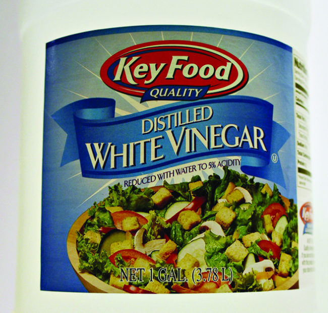

By the end of this section, you will be able to:
* Describe the fundamental properties of solutions
* Calculate solution concentrations using molarity
* Perform dilution calculations using the dilution equation

In preceding sections, we focused on the composition of substances: samples of matter that contain only one type of element or compound. However, mixtures—samples of matter containing two or more substances physically combined—are more commonly encountered in nature than are pure substances. Similar to a pure substance, the relative composition of a mixture plays an important role in determining its properties. The relative amount of oxygen in a planet’s atmosphere determines its ability to sustain aerobic life. The relative amounts of iron, carbon, nickel, and other elements in steel (a mixture known as an “alloy”) determine its physical strength and resistance to corrosion. The relative amount of the active ingredient in a medicine determines its effectiveness in achieving the desired pharmacological effect. The relative amount of sugar in a beverage determines its sweetness (see [\[link\]](#CNX_Chem_03_03_espresso)). In this section, we will describe one of the most common ways in which the relative compositions of mixtures may be quantified.

 "){: #CNX_Chem_03_03_espresso}

### Solutions

We have previously defined solutions as homogeneous mixtures, meaning that the composition of the mixture (and therefore its properties) is uniform throughout its entire volume. Solutions occur frequently in nature and have also been implemented in many forms of manmade technology. We will explore a more thorough treatment of solution properties in the chapter on solutions and colloids, but here we will introduce some of the basic properties of solutions.

The relative amount of a given solution component is known as its **concentration**{: data-type="term"}. Often, though not always, a solution contains one component with a concentration that is significantly greater than that of all other components. This component is called the **solvent**{: data-type="term"} and may be viewed as the medium in which the other components are dispersed, or **dissolved**{: data-type="term"}. Solutions in which water is the solvent are, of course, very common on our planet. A solution in which water is the solvent is called an **aqueous solution**{: data-type="term"}.

A **solute**{: data-type="term"} is a component of a solution that is typically present at a much lower concentration than the solvent. Solute concentrations are often described with qualitative terms such as **dilute**{: data-type="term"} (of relatively low concentration) and **concentrated**{: data-type="term"} (of relatively high concentration).

Concentrations may be quantitatively assessed using a wide variety of measurement units, each convenient for particular applications. **Molarity (*M*)**{: data-type="term"} is a useful concentration unit for many applications in chemistry. Molarity is defined as the number of moles of solute in exactly 1 liter (1 L) of the solution:

<math xmlns="http://www.w3.org/1998/Math/MathML"><mrow><mi>M</mi><mo>=</mo><mspace width="0.2em" /><mfrac><mrow><mtext>mol solute</mtext></mrow><mrow><mtext>L solution</mtext></mrow></mfrac><mspace width="0.2em" /></mrow></math>

Calculating Molar Concentrations A 355-mL soft drink sample contains 0.133 mol of sucrose (table sugar). What is the molar concentration of sucrose in the beverage?

Solution Since the molar amount of solute and the volume of solution are both given, the molarity can be calculated using the definition of molarity. Per this definition, the solution volume must be converted from mL to L:

<math xmlns="http://www.w3.org/1998/Math/MathML"><mrow><mi>M</mi><mo>=</mo><mspace width="0.2em" /><mfrac><mrow><mtext>mol solute</mtext></mrow><mrow><mtext>L solution</mtext></mrow></mfrac><mspace width="0.2em" /><mo>=</mo><mspace width="0.2em" /><mfrac><mrow><mn>0.133</mn><mspace width="0.2em" /><mtext>mol</mtext></mrow><mrow><mn>355</mn><mspace width="0.2em" /><mtext>mL</mtext><mspace width="0.2em" /><mo>×</mo><mspace width="0.2em" /><mfrac><mrow><mn>1</mn><mspace width="0.2em" /><mtext>L</mtext></mrow><mrow><mn>1000</mn><mspace width="0.2em" /><mtext>mL</mtext></mrow></mfrac><mspace width="0.2em" /></mrow></mfrac><mspace width="0.2em" /><mo>=</mo><mn>0.375</mn><mspace width="0.2em" /><mi>M</mi></mrow></math>

Check Your Learning A teaspoon of table sugar contains about 0.01 mol sucrose. What is the molarity of sucrose if a teaspoon of sugar has been dissolved in a cup of tea with a volume of 200 mL?

Answer:

0\.05 *M*

Deriving Moles and Volumes from Molar Concentrations How much sugar (mol) is contained in a modest sip (~10 mL) of the soft drink from [\[link\]](#fs-idm98982768)?

Solution In this case, we can rearrange the definition of molarity to isolate the quantity sought, moles of sugar. We then substitute the value for molarity that we derived in [\[link\]](#fs-idm98982768), 0.375 *M*\:

<math xmlns="http://www.w3.org/1998/Math/MathML"><mtable><mtr><mtd /></mtr><mtr><mtd><mi>M</mi><mo>=</mo><mspace width="0.2em" /><mfrac><mrow><mtext>mol solute</mtext></mrow><mrow><mtext>L solution</mtext></mrow></mfrac><mspace width="0.2em" /></mtd></mtr><mtr><mtd><mtext>mol solute</mtext><mo>=</mo><mi>M</mi><mspace width="0.2em" /><mo>×</mo><mspace width="0.2em" /><mtext>L solution</mtext></mtd></mtr><mtr><mtd /></mtr><mtr><mtd><mtext>mol solute</mtext><mspace width="0.2em" /><mo>=</mo><mspace width="0.2em" /><mn>0.375</mn><mspace width="0.4em" /><mfrac><mrow><mtext>mol sugar</mtext></mrow><mtext>L</mtext></mfrac><mspace width="0.2em" /><mo>×</mo><mspace width="0.2em" /><mrow><mo>(</mo><mrow><mn>10</mn><mspace width="0.2em" /><mtext>mL</mtext><mspace width="0.2em" /><mo>×</mo><mspace width="0.2em" /><mfrac><mrow><mn>1</mn><mspace width="0.2em" /><mtext>L</mtext></mrow><mrow><mn>1000</mn><mspace width="0.2em" /><mtext>mL</mtext></mrow></mfrac></mrow><mo>)</mo><mspace width="0.2em" /></mrow><mo>=</mo><mspace width="0.2em" /><mn>0.004</mn><mspace width="0.2em" /><mtext>mol sugar</mtext></mtd></mtr></mtable></math>

Check Your Learning What volume (mL) of the sweetened tea described in [\[link\]](#fs-idm98982768) contains the same amount of sugar (mol) as 10 mL of the soft drink in this example?

Answer:

80 mL

Calculating Molar Concentrations from the Mass of Solute Distilled white vinegar ([\[link\]](#CNX_Chem_03_04_vinegar)) is a solution of acetic acid, CH3CO2H, in water. A 0.500-L vinegar solution contains 25.2 g of acetic acid. What is the concentration of the acetic acid solution in units of molarity?

{: #CNX_Chem_03_04_vinegar}

Solution As in previous examples, the definition of molarity is the primary equation used to calculate the quantity sought. In this case, the mass of solute is provided instead of its molar amount, so we must use the solute’s molar mass to obtain the amount of solute in moles:

<math xmlns="http://www.w3.org/1998/Math/MathML"><mrow><mi>M</mi><mo>=</mo><mspace width="0.2em" /><mfrac><mrow><mtext>mol solute</mtext></mrow><mrow><mtext>L solution</mtext></mrow></mfrac><mspace width="0.2em" /><mo>=</mo><mspace width="0.2em" /><mfrac><mrow><mn>25.2 g</mn><mspace width="0.2em" /><msub><mrow><mtext>CH</mtext></mrow><mn>3</mn></msub><msub><mrow><mtext>CO</mtext></mrow><mn>2</mn></msub><mtext>H</mtext><mspace width="0.2em" /><mo>×</mo><mspace width="0.2em" /><mfrac><mrow><mn>1</mn><mspace width="0.2em" /><msub><mrow><mtext>mol CH</mtext></mrow><mn>3</mn></msub><msub><mrow><mtext>CO</mtext></mrow><mn>2</mn></msub><mtext>H</mtext></mrow><mrow><msub><mrow><mtext>60.052 g CH</mtext></mrow><mn>3</mn></msub><msub><mrow><mtext>CO</mtext></mrow><mn>2</mn></msub><mtext>H</mtext></mrow></mfrac><mspace width="0.2em" /></mrow><mrow><mtext>0.500 L solution</mtext></mrow></mfrac><mspace width="0.2em" /><mo>=</mo><mn>0.839</mn><mspace width="0.2em" /><mi>M</mi></mrow></math>

<math xmlns="http://www.w3.org/1998/Math/MathML"><mtable columnalign="left"><mtr><mtd /></mtr><mtr><mtd><mi>M</mi><mo>=</mo><mspace width="0.2em" /><mfrac><mrow><mtext>mol solute</mtext></mrow><mrow><mtext>L solution</mtext></mrow></mfrac><mspace width="0.2em" /><mo>=</mo><mn>0.839</mn><mspace width="0.2em" /><mi>M</mi></mtd></mtr><mtr><mtd><mi>M</mi><mo>=</mo><mspace width="0.2em" /><mfrac><mrow><mn>0.839</mn><mspace width="0.2em" /><mtext>mol solute</mtext></mrow><mrow><mn>1.00</mn><mspace width="0.2em" /><mtext>L solution</mtext></mrow></mfrac><mspace width="0.2em" /></mtd></mtr></mtable></math>

Check Your Learning Calculate the molarity of 6.52 g of CoCl2 (128.9 g/mol) dissolved in an aqueous solution with a total volume of 75.0 mL.

Answer:

0\.674 *M*

Determining the Mass of Solute in a Given Volume of Solution How many grams of NaCl are contained in 0.250 L of a 5.30-*M* solution?

Solution The volume and molarity of the solution are specified, so the amount (mol) of solute is easily computed as demonstrated in [\[link\]](#fs-idm64107376)\:

<math xmlns="http://www.w3.org/1998/Math/MathML"><mtable><mtr><mtd /></mtr><mtr><mtd><mi>M</mi><mo>=</mo><mspace width="0.2em" /><mfrac><mrow><mtext>mol solute</mtext></mrow><mrow><mtext>L solution</mtext></mrow></mfrac><mspace width="0.2em" /></mtd></mtr><mtr><mtd><mtext>mol solute</mtext><mo>=</mo><mi>M</mi><mspace width="0.2em" /><mo>×</mo><mspace width="0.2em" /><mtext>L solution</mtext></mtd></mtr><mtr /><mtr><mtd><mtext>mol solute</mtext><mo>=</mo><mn>5.30</mn><mspace width="0.2em" /><mfrac><mrow><mtext>mol NaCl</mtext></mrow><mtext>L</mtext></mfrac><mspace width="0.2em" /><mo>×</mo><mspace width="0.2em" /><mn>0.250</mn><mspace width="0.2em" /><mtext>L</mtext><mo>=</mo><mn>1.325</mn><mspace width="0.2em" /><mtext>mol NaCl</mtext></mtd></mtr></mtable></math>

Finally, this molar amount is used to derive the mass of NaCl:

<math xmlns="http://www.w3.org/1998/Math/MathML"><mrow><mtext>1.325 mol NaCl</mtext><mspace width="0.2em" /><mo>×</mo><mspace width="0.2em" /><mfrac><mrow><mn>58.44</mn><mspace width="0.2em" /><mtext>g NaCl</mtext></mrow><mrow><mtext>mol NaCl</mtext></mrow></mfrac><mspace width="0.2em" /><mo>=</mo><mn>77.4</mn><mspace width="0.2em" /><mtext>g NaCl</mtext></mrow></math>

Check Your Learning How many grams of CaCl2 (110.98 g/mol) are contained in 250.0 mL of a 0.200-*M* solution of calcium chloride?

Answer:

5\.55 g CaCl2

When performing calculations stepwise, as in [\[link\]](#fs-idm104693104), it is important to refrain from rounding any intermediate calculation results, which can lead to rounding errors in the final result. In [\[link\]](#fs-idm104693104), the molar amount of NaCl computed in the first step, 1.325 mol, would be properly rounded to 1.32 mol if it were to be reported; however, although the last digit (5) is not significant, it must be retained as a guard digit in the intermediate calculation. If we had not retained this guard digit, the final calculation for the mass of NaCl would have been 77.1 g, a difference of 0.3 g.

In addition to retaining a guard digit for intermediate calculations, we can also avoid rounding errors by performing computations in a single step (see [\[link\]](#fs-idm88061984)). This eliminates intermediate steps so that only the final result is rounded.

Determining the Volume of Solution Containing a Given Mass of Solute In [\[link\]](#fs-idm81897840), we found the typical concentration of vinegar to be 0.839 *M*. What volume of vinegar contains 75.6 g of acetic acid?

Solution First, use the molar mass to calculate moles of acetic acid from the given mass:

<math xmlns="http://www.w3.org/1998/Math/MathML"><mrow><mtext>g solute</mtext><mspace width="0.2em" /><mo>×</mo><mspace width="0.2em" /><mfrac><mrow><mtext>mol solute</mtext></mrow><mrow><mtext>g solute</mtext></mrow></mfrac><mspace width="0.2em" /><mo>=</mo><mtext>mol solute</mtext></mrow></math>

Then, use the molarity of the solution to calculate the volume of solution containing this molar amount of solute:

<math xmlns="http://www.w3.org/1998/Math/MathML"><mrow><mtext>mol solute</mtext><mspace width="0.2em" /><mo>×</mo><mspace width="0.2em" /><mfrac><mrow><mtext>L solution</mtext></mrow><mrow><mtext>mol solute</mtext></mrow></mfrac><mspace width="0.2em" /><mo>=</mo><mtext>L solution</mtext></mrow></math>

Combining these two steps into one yields:

<math xmlns="http://www.w3.org/1998/Math/MathML"><mrow><mtext>g solute</mtext><mspace width="0.2em" /><mo>×</mo><mspace width="0.2em" /><mfrac><mrow><mtext>mol solute</mtext></mrow><mrow><mtext>g solute</mtext></mrow></mfrac><mspace width="0.2em" /><mo>×</mo><mspace width="0.2em" /><mfrac><mrow><mtext>L solution</mtext></mrow><mrow><mtext>mol solute</mtext></mrow></mfrac><mspace width="0.2em" /><mo>=</mo><mtext>L solution</mtext></mrow></math>

<math xmlns="http://www.w3.org/1998/Math/MathML"><mrow><mn>75.6</mn><mspace width="0.2em" /><mtext>g</mtext><mspace width="0.2em" /><msub><mrow><mtext>CH</mtext></mrow><mn>3</mn></msub><msub><mrow><mtext>CO</mtext></mrow><mn>2</mn></msub><mtext>H</mtext><mspace width="0.2em" /><mrow><mo>(</mo><mrow><mfrac><mrow><mtext>mol</mtext><mspace width="0.2em" /><msub><mrow><mtext>CH</mtext></mrow><mn>3</mn></msub><msub><mrow><mtext>CO</mtext></mrow><mn>2</mn></msub><mtext>H</mtext><mspace width="0.2em" /></mrow><mrow><mn>60.05</mn><mspace width="0.2em" /><mtext>g</mtext></mrow></mfrac></mrow><mo>)</mo></mrow><mspace width="0.2em" /><mrow><mo>(</mo><mrow><mfrac><mrow><mtext>L solution</mtext></mrow><mrow><mn>0.839</mn><mspace width="0.2em" /><mtext>mol</mtext><mspace width="0.2em" /><msub><mrow><mtext>CH</mtext></mrow><mn>3</mn></msub><msub><mrow><mtext>CO</mtext></mrow><mn>2</mn></msub><mtext>H</mtext></mrow></mfrac></mrow><mo>)</mo><mspace width="0.2em" /></mrow><mo>=</mo><mspace width="0.2em" /><mn>1.50</mn><mspace width="0.2em" /><mtext>L solution</mtext></mrow></math>

Check Your Learning What volume of a 1.50-*M* KBr solution contains 66.0 g KBr?

Answer:

0\.370 L

### Dilution of Solutions

**Dilution**{: data-type="term"} is the process whereby the concentration of a solution is lessened by the addition of solvent. For example, we might say that a glass of iced tea becomes increasingly diluted as the ice melts. The water from the melting ice increases the volume of the solvent (water) and the overall volume of the solution (iced tea), thereby reducing the relative concentrations of the solutes that give the beverage its taste ([\[link\]](#CNX_Chem_03_04_dilution)).

 "){: #CNX_Chem_03_04_dilution}

Dilution is also a common means of preparing solutions of a desired concentration. By adding solvent to a measured portion of a more concentrated *stock solution*, we can achieve a particular concentration. For example, commercial pesticides are typically sold as solutions in which the active ingredients are far more concentrated than is appropriate for their application. Before they can be used on crops, the pesticides must be diluted. This is also a very common practice for the preparation of a number of common laboratory reagents ([\[link\]](#CNX_Chem_03_04_solution)).

 "){: #CNX_Chem_03_04_solution}

A simple mathematical relationship can be used to relate the volumes and concentrations of a solution before and after the dilution process. According to the definition of molarity, the molar amount of solute in a solution is equal to the product of the solution’s molarity and its volume in liters:

<math xmlns="http://www.w3.org/1998/Math/MathML"><mrow><mi>n</mi><mo>=</mo><mi>M</mi><mi>L</mi></mrow></math>

Expressions like these may be written for a solution before and after it is diluted:

<math xmlns="http://www.w3.org/1998/Math/MathML"><mrow><msub><mi>n</mi><mn>1</mn></msub><mo>=</mo><msub><mi>M</mi><mn>1</mn></msub><msub><mi>L</mi><mn>1</mn></msub></mrow></math>

<math xmlns="http://www.w3.org/1998/Math/MathML"><mrow><msub><mi>n</mi><mn>2</mn></msub><mo>=</mo><msub><mi>M</mi><mn>2</mn></msub><msub><mi>L</mi><mn>2</mn></msub></mrow></math>

where the subscripts “1” and “2” refer to the solution before and after the dilution, respectively. Since the dilution process *does not change the amount of solute in the solution,*{::}*n*1 = *n*2. Thus, these two equations may be set equal to one another:

<math xmlns="http://www.w3.org/1998/Math/MathML"><mrow><msub><mi>M</mi><mn>1</mn></msub><msub><mi>L</mi><mn>1</mn></msub><mo>=</mo><msub><mi>M</mi><mn>2</mn></msub><msub><mi>L</mi><mn>2</mn></msub></mrow></math>

This relation is commonly referred to as the dilution equation. Although we derived this equation using molarity as the unit of concentration and liters as the unit of volume, other units of concentration and volume may be used, so long as the units properly cancel per the factor-label method. Reflecting this versatility, the dilution equation is often written in the more general form:

<math xmlns="http://www.w3.org/1998/Math/MathML"><mrow><msub><mi>C</mi><mn>1</mn></msub><msub><mi>V</mi><mn>1</mn></msub><mo>=</mo><msub><mi>C</mi><mn>2</mn></msub><msub><mi>V</mi><mn>2</mn></msub></mrow></math>

where *C* and *V* are concentration and volume, respectively.

Use the [simulation][1] to explore the relations between solute amount, solution volume, and concentration and to confirm the dilution equation.

Determining the Concentration of a Diluted Solution If 0.850 L of a 5.00-*M* solution of copper nitrate, Cu(NO3)2, is diluted to a volume of 1.80 L by the addition of water, what is the molarity of the diluted solution?

Solution We are given the volume and concentration of a stock solution, *V*1 and *C*1, and the volume of the resultant diluted solution, *V*2. We need to find the concentration of the diluted solution, *C*2. We thus rearrange the dilution equation in order to isolate *C*2\:

<math xmlns="http://www.w3.org/1998/Math/MathML"><mtable><mtr><mtd><msub><mi>C</mi><mn>1</mn></msub><msub><mi>V</mi><mn>1</mn></msub><mo>=</mo><msub><mi>C</mi><mn>2</mn></msub><msub><mi>V</mi><mn>2</mn></msub></mtd></mtr><mtr><mtd /></mtr><mtr><mtd><msub><mi>C</mi><mn>2</mn></msub><mo>=</mo><mspace width="0.2em" /><mfrac><mrow><msub><mi>C</mi><mn>1</mn></msub><msub><mi>V</mi><mn>1</mn></msub></mrow><mrow><msub><mi>V</mi><mn>2</mn></msub></mrow></mfrac><mspace width="0.2em" /></mtd></mtr></mtable></math>

Since the stock solution is being diluted by more than two-fold (volume is increased from 0.85 L to 1.80 L), we would expect the diluted solution’s concentration to be less than one-half 5 *M*. We will compare this ballpark estimate to the calculated result to check for any gross errors in computation (for example, such as an improper substitution of the given quantities). Substituting the given values for the terms on the right side of this equation yields:

<math xmlns="http://www.w3.org/1998/Math/MathML"><mrow><msub><mi>C</mi><mn>2</mn></msub><mo>=</mo><mspace width="0.2em" /><mfrac><mrow><mn>0.850</mn><mspace width="0.2em" /><mtext>L</mtext><mspace width="0.2em" /><mo>×</mo><mspace width="0.2em" /><mn>5.00</mn><mspace width="0.2em" /><mfrac><mrow><mtext>mol</mtext></mrow><mtext>L</mtext></mfrac><mspace width="0.2em" /></mrow><mrow><mn>1.80 L</mn></mrow></mfrac><mspace width="0.2em" /><mo>=</mo><mn>2.36</mn><mspace width="0.2em" /><mi>M</mi></mrow></math>

This result compares well to our ballpark estimate (it’s a bit less than one-half the stock concentration, 5 *M*).

Check Your Learning What is the concentration of the solution that results from diluting 25.0 mL of a 2.04-*M* solution of CH3OH to 500.0 mL?

Answer:

0\.102 *M* CH3OH

Volume of a Diluted Solution What volume of 0.12 *M* HBr can be prepared from 11 mL (0.011 L) of 0.45 *M* HBr?

Solution We are given the volume and concentration of a stock solution, *V*1 and *C*1, and the concentration of the resultant diluted solution, *C*2. We need to find the volume of the diluted solution, *V*2. We thus rearrange the dilution equation in order to isolate *V*2\:

<math xmlns="http://www.w3.org/1998/Math/MathML"><mtable><mtr><mtd><msub><mi>C</mi><mn>1</mn></msub><msub><mi>V</mi><mn>1</mn></msub><mo>=</mo><msub><mi>C</mi><mn>2</mn></msub><msub><mi>V</mi><mn>2</mn></msub></mtd></mtr><mtr><mtd /></mtr><mtr><mtd><msub><mi>V</mi><mn>2</mn></msub><mo>=</mo><mspace width="0.2em" /><mfrac><mrow><msub><mi>C</mi><mn>1</mn></msub><msub><mi>V</mi><mn>1</mn></msub></mrow><mrow><msub><mi>C</mi><mn>2</mn></msub></mrow></mfrac><mspace width="0.2em" /></mtd></mtr></mtable></math>

Since the diluted concentration (0.12 *M*) is slightly more than one-fourth the original concentration (0.45 *M*), we would expect the volume of the diluted solution to be roughly four times the original volume, or around 44 mL. Substituting the given values and solving for the unknown volume yields:

<math xmlns="http://www.w3.org/1998/Math/MathML"><mtable><mtr><mtd /></mtr><mtr><mtd><msub><mi>V</mi><mn>2</mn></msub><mo>=</mo><mspace width="0.2em" /><mfrac><mrow><mrow><mo>(</mo><mrow><mn>0.45</mn><mspace width="0.2em" /><mi>M</mi></mrow><mo>)</mo></mrow><mrow><mo>(</mo><mrow><mn>0.011</mn><mspace width="0.2em" /><mtext>L</mtext></mrow><mo>)</mo></mrow></mrow><mrow><mrow><mo>(</mo><mrow><mn>0.12</mn><mspace width="0.2em" /><mi>M</mi></mrow><mo>)</mo></mrow></mrow></mfrac><mspace width="0.2em" /></mtd></mtr><mtr><mtd><msub><mi>V</mi><mn>2</mn></msub><mo>=</mo><mn>0.041</mn><mspace width="0.2em" /><mtext>L</mtext></mtd></mtr></mtable></math>

The volume of the 0.12-*M* solution is 0.041 L (41 mL). The result is reasonable and compares well with our rough estimate.

Check Your Learning A laboratory experiment calls for 0.125 *M* HNO3. What volume of 0.125 *M* HNO3 can be prepared from 0.250 L of 1.88 *M* HNO3?

Answer:

3\.76 L

Volume of a Concentrated Solution Needed for Dilution What volume of 1.59 *M* KOH is required to prepare 5.00 L of 0.100 *M* KOH?

Solution We are given the concentration of a stock solution, *C*1, and the volume and concentration of the resultant diluted solution, *V*2 and *C*2. We need to find the volume of the stock solution, *V*1. We thus rearrange the dilution equation in order to isolate *V*1\:

<math xmlns="http://www.w3.org/1998/Math/MathML"><mtable><mtr><mtd><msub><mi>C</mi><mn>1</mn></msub><msub><mi>V</mi><mn>1</mn></msub><mo>=</mo><msub><mi>C</mi><mn>2</mn></msub><msub><mi>V</mi><mn>2</mn></msub></mtd></mtr><mtr><mtd /></mtr><mtr><mtd><msub><mi>V</mi><mn>1</mn></msub><mo>=</mo><mspace width="0.2em" /><mfrac><mrow><msub><mi>C</mi><mn>2</mn></msub><msub><mi>V</mi><mn>2</mn></msub></mrow><mrow><msub><mi>C</mi><mn>1</mn></msub></mrow></mfrac><mspace width="0.2em" /></mtd></mtr></mtable></math>

Since the concentration of the diluted solution 0.100 *M* is roughly one-sixteenth that of the stock solution (1.59 *M*), we would expect the volume of the stock solution to be about one-sixteenth that of the diluted solution, or around 0.3 liters. Substituting the given values and solving for the unknown volume yields:

<math xmlns="http://www.w3.org/1998/Math/MathML"><mtable><mtr><mtd /></mtr><mtr><mtd><msub><mi>V</mi><mn>1</mn></msub><mo>=</mo><mspace width="0.2em" /><mfrac><mrow><mrow><mo>(</mo><mrow><mn>0.100</mn><mspace width="0.2em" /><mi>M</mi></mrow><mo>)</mo></mrow><mrow><mo>(</mo><mrow><mn>5.00</mn><mspace width="0.2em" /><mtext>L</mtext></mrow><mo>)</mo></mrow></mrow><mrow><mn>1.59</mn><mspace width="0.2em" /><mi>M</mi></mrow></mfrac><mspace width="0.2em" /></mtd></mtr><mtr><mtd><msub><mi>V</mi><mn>1</mn></msub><mo>=</mo><mn>0.314</mn><mspace width="0.2em" /><mtext>L</mtext></mtd></mtr></mtable></math>

Thus, we would need 0.314 L of the 1.59-*M* solution to prepare the desired solution. This result is consistent with our rough estimate.

Check Your Learning What volume of a 0.575-*M* solution of glucose, C6H12O6, can be prepared from 50.00 mL of a 3.00-*M* glucose solution?

Answer:

0\.261 L

### Key Concepts and Summary

Solutions are homogeneous mixtures. Many solutions contain one component, called the solvent, in which other components, called solutes, are dissolved. An aqueous solution is one for which the solvent is water. The concentration of a solution is a measure of the relative amount of solute in a given amount of solution. Concentrations may be measured using various units, with one very useful unit being molarity, defined as the number of moles of solute per liter of solution. The solute concentration of a solution may be decreased by adding solvent, a process referred to as dilution. The dilution equation is a simple relation between concentrations and volumes of a solution before and after dilution.

### Chemistry End of Chapter Exercises

Explain what changes and what stays the same when 1.00 L of a solution of NaCl is diluted to 1.80 L.

What information do we need to calculate the molarity of a sulfuric acid solution?

We need to know the number of moles of sulfuric acid dissolved in the solution and the volume of the solution.

What does it mean when we say that a 200-mL sample and a 400-mL sample of a solution of salt have the same molarity? In what ways are the two samples identical? In what ways are these two samples different?

Determine the molarity for each of the following solutions:

(a) 0.444 mol of CoCl2 in 0.654 L of solution

(b) 98.0 g of phosphoric acid, H3PO4, in 1.00 L of solution

(c) 0.2074 g of calcium hydroxide, Ca(OH)2, in 40.00 mL of solution

(d) 10.5 kg of Na2SO4·10H2O in 18.60 L of solution

(e) 7.0 <math xmlns="http://www.w3.org/1998/Math/MathML"><mo>×</mo></math>

 10−3 mol of I2 in 100.0 mL of solution

(f) 1.8 <math xmlns="http://www.w3.org/1998/Math/MathML"><mo>×</mo></math>

 104 mg of HCl in 0.075 L of solution

(a) 0.679 *M*;* * *
{: data-type="newline"}

 (b) 1.00 *M*;* * *
{: data-type="newline"}

 (c) 0.06998 *M*;* * *
{: data-type="newline"}

 (d) 1.75 *M*;* * *
{: data-type="newline"}

 (e) 0.070 *M*;* * *
{: data-type="newline"}

 (f) 6.6 *M*

Determine the molarity of each of the following solutions:

(a) 1.457 mol KCl in 1.500 L of solution

(b) 0.515 g of H2SO4 in 1.00 L of solution

(c) 20.54 g of Al(NO3)3 in 1575 mL of solution

(d) 2.76 kg of CuSO4·5H2O in 1.45 L of solution

(e) 0.005653 mol of Br2 in 10.00 mL of solution

(f) 0.000889 g of glycine, C2H5NO2, in 1.05 mL of solution

Consider this question: What is the mass of the solute in 0.500 L of 0.30 *M* glucose, C6H12O6, used for intravenous injection?

(a) Outline the steps necessary to answer the question.

(b) Answer the question.

(a) determine the number of moles of glucose in 0.500 L of solution; determine the molar mass of glucose; determine the mass of glucose from the number of moles and its molar mass; (b) 27 g

Consider this question: What is the mass of solute in 200.0 L of a 1.556-*M* solution of KBr?

(a) Outline the steps necessary to answer the question.

(b) Answer the question.

Calculate the number of moles and the mass of the solute in each of the following solutions:

(a) 2.00 L of 18.5 *M* H2SO4, concentrated sulfuric acid

(b) 100.0 mL of 3.8 <math xmlns="http://www.w3.org/1998/Math/MathML"><mo>×</mo></math>

 10−5 *M* NaCN, the minimum lethal concentration of sodium cyanide in blood serum

(c) 5.50 L of 13.3 *M* H2CO, the formaldehyde used to “fix” tissue samples

(d) 325 mL of 1.8 <math xmlns="http://www.w3.org/1998/Math/MathML"><mo>×</mo></math>

 10−6 *M* FeSO4, the minimum concentration of iron sulfate detectable by taste in drinking water

(a) 37.0 mol H2SO4;* * *
{: data-type="newline"}

 3.63 <math xmlns="http://www.w3.org/1998/Math/MathML"><mo>×</mo></math>

 103 g H2SO4;* * *
{: data-type="newline"}

 (b) 3.8 <math xmlns="http://www.w3.org/1998/Math/MathML"><mo>×</mo></math>

 10−6 mol NaCN;* * *
{: data-type="newline"}

 1.9 <math xmlns="http://www.w3.org/1998/Math/MathML"><mo>×</mo></math>

 10−4 g NaCN;* * *
{: data-type="newline"}

 (c) 73.2 mol H2CO;* * *
{: data-type="newline"}

 2.20 kg H2CO;* * *
{: data-type="newline"}

 (d) 5.9 <math xmlns="http://www.w3.org/1998/Math/MathML"><mo>×</mo></math>

 10−7 mol FeSO4;* * *
{: data-type="newline"}

 8.9 <math xmlns="http://www.w3.org/1998/Math/MathML"><mo>×</mo></math>

 10−5 g FeSO4

Calculate the number of moles and the mass of the solute in each of the following solutions:

(a) 325 mL of 8.23 <math xmlns="http://www.w3.org/1998/Math/MathML"><mo>×</mo></math>

 10−5 *M* KI, a source of iodine in the diet

(b) 75.0 mL of 2.2 <math xmlns="http://www.w3.org/1998/Math/MathML"><mo>×</mo></math>

 10−5 *M* H2SO4, a sample of acid rain

(c) 0.2500 L of 0.1135 *M* K2CrO4, an analytical reagent used in iron assays

(d) 10.5 L of 3.716 *M* (NH4)2SO4, a liquid fertilizer

Consider this question: What is the molarity of KMnO4 in a solution of 0.0908 g of KMnO4 in 0.500 L of solution?

(a) Outline the steps necessary to answer the question.

(b) Answer the question.

(a) Determine the molar mass of KMnO4; determine the number of moles of KMnO4 in the solution; from the number of moles and the volume of solution, determine the molarity; (b) 1.15 <math xmlns="http://www.w3.org/1998/Math/MathML"><mo>×</mo></math>

 10−3 *M*

Consider this question: What is the molarity of HCl if 35.23 mL of a solution of HCl contain 0.3366 g of HCl?

(a) Outline the steps necessary to answer the question.

(b) Answer the question.

Calculate the molarity of each of the following solutions:

(a) 0.195 g of cholesterol, C27H46O, in 0.100 L of serum, the average concentration of cholesterol in human serum

(b) 4.25 g of NH3 in 0.500 L of solution, the concentration of NH3 in household ammonia

(c) 1.49 kg of isopropyl alcohol, C3H7OH, in 2.50 L of solution, the concentration of isopropyl alcohol in rubbing alcohol

(d) 0.029 g of I2 in 0.100 L of solution, the solubility of I2 in water at 20 °C

(a) 5.04 <math xmlns="http://www.w3.org/1998/Math/MathML"><mo>×</mo></math>

 10−3 *M*;* * *
{: data-type="newline"}

 (b) 0.499 *M*;* * *
{: data-type="newline"}

 (c) 9.92 *M*;* * *
{: data-type="newline"}

 (d) 1.1 <math xmlns="http://www.w3.org/1998/Math/MathML"><mo>×</mo></math>

 10−3 *M*

Calculate the molarity of each of the following solutions:

(a) 293 g HCl in 666 mL of solution, a concentrated HCl solution

(b) 2.026 g FeCl3 in 0.1250 L of a solution used as an unknown in general chemistry laboratories

(c) 0.001 mg Cd2+ in 0.100 L, the maximum permissible concentration of cadmium in drinking water

(d) 0.0079 g C7H5SNO3 in one ounce (29.6 mL), the concentration of saccharin in a diet soft drink.

There is about 1.0 g of calcium, as Ca2+, in 1.0 L of milk. What is the molarity of Ca2+ in milk?

0\.025 *M*

What volume of a 1.00-*M* Fe(NO3)3 solution can be diluted to prepare 1.00 L of a solution with a concentration of 0.250 *M*?

If 0.1718 L of a 0.3556-*M* C3H7OH solution is diluted to a concentration of 0.1222 *M*, what is the volume of the resulting solution?

0\.5000 L

If 4.12 L of a 0.850 *M*-H3PO4 solution is be diluted to a volume of 10.00 L, what is the concentration of the resulting solution?

What volume of a 0.33-*M* C12H22O11 solution can be diluted to prepare 25 mL of a solution with a concentration of 0.025 *M*?

1\.9 mL

What is the concentration of the NaCl solution that results when 0.150 L of a 0.556-*M* solution is allowed to evaporate until the volume is reduced to 0.105 L?

What is the molarity of the diluted solution when each of the following solutions is diluted to the given final volume?

(a) 1.00 L of a 0.250-*M* solution of Fe(NO3)3 is diluted to a final volume of 2.00 L

(b) 0.5000 L of a 0.1222-*M* solution of C3H7OH is diluted to a final volume of 1.250 L

(c) 2.35 L of a 0.350-*M* solution of H3PO4 is diluted to a final volume of 4.00 L

(d) 22.50 mL of a 0.025-*M* solution of C12H22O11 is diluted to 100.0 mL

(a) 0.125 *M*;* * *
{: data-type="newline"}

 (b) 0.04888 *M*;* * *
{: data-type="newline"}

 (c) 0.206 *M*;* * *
{: data-type="newline"}

 (e) 0.0056 *M*

What is the final concentration of the solution produced when 225.5 mL of a 0.09988-*M* solution of Na2CO3 is allowed to evaporate until the solution volume is reduced to 45.00 mL?

A 2.00-L bottle of a solution of concentrated HCl was purchased for the general chemistry laboratory. The solution contained 868.8 g of HCl. What is the molarity of the solution?

11\.9 *M*

An experiment in a general chemistry laboratory calls for a 2.00-*M* solution of HCl. How many mL of 11.9 *M* HCl would be required to make 250 mL of 2.00 *M* HCl?

What volume of a 0.20-*M* K2SO4 solution contains 57 g of K2SO4?

1\.6 L

The US Environmental Protection Agency (EPA) places limits on the quantities of toxic substances that may be discharged into the sewer system. Limits have been established for a variety of substances, including hexavalent chromium, which is limited to 0.50 mg/L. If an industry is discharging hexavalent chromium as potassium dichromate (K2Cr2O7), what is the maximum permissible molarity of that substance?

### Key Equations

* <math xmlns="http://www.w3.org/1998/Math/MathML"><mrow><mi>M</mi><mo>=</mo><mspace width="0.2em" /><mfrac><mrow><mtext>mol solute</mtext></mrow><mrow><mtext>L solution</mtext></mrow></mfrac><mspace width="0.2em" /></mrow></math>

* *C*1*V*1 = *C*2*V*2
{: data-bullet-style="bullet"}

### Glossary
{: data-type="glossary-title"}

aqueous solution
: solution for which water is the solvent
^

concentrated
: qualitative term for a solution containing solute at a relatively high concentration
^

concentration
: quantitative measure of the relative amounts of solute and solvent present in a solution
^

dilute
: qualitative term for a solution containing solute at a relatively low concentration
^

dilution
: process of adding solvent to a solution in order to lower the concentration of solutes
^

dissolved
: describes the process by which solute components are dispersed in a solvent
^

molarity (*M*)
: unit of concentration, defined as the number of moles of solute dissolved in 1 liter of solution
^

solute
: solution component present in a concentration less than that of the solvent
^

solvent
: solution component present in a concentration that is higher relative to other components

[1]: http://openstaxcollege.org/l/16Phetsolvents
