

By the end of this section, you will be able to:
* Write Lewis symbols for neutral atoms and ions
* Draw Lewis structures depicting the bonding in simple molecules

Thus far in this chapter, we have discussed the various types of bonds that form between atoms and/or ions. In all cases, these bonds involve the sharing or transfer of valence shell electrons between atoms. In this section, we will explore the typical method for depicting valence shell electrons and chemical bonds, namely Lewis symbols and Lewis structures.

### Lewis Symbols

We use Lewis symbols to describe valence electron configurations of atoms and monatomic ions. A **Lewis symbol**{: data-type="term"} consists of an elemental symbol surrounded by one dot for each of its valence electrons:

[\[link\]](#CNX_Chem_07_03_3rowLewis) shows the Lewis symbols for the elements of the third period of the periodic table.

 ![A table is shown that has three columns and nine rows. The header row reads &#x201C;Atoms,&#x201D; &#x201C;Electronic Configuration,&#x201D; and &#x201C;Lewis Symbol.&#x201D; The first column contains the words &#x201C;sodium,&#x201D; &#x201C;magnesium,&#x201D; &#x201C;aluminum,&#x201D; &#x201C;silicon,&#x201D; &#x201C;phosphorus,&#x201D; &#x201C;sulfur,&#x201D; &#x201C;chlorine,&#x201D; and &#x201C;argon.&#x201D; The second column contains the symbols and numbers &#x201C;\[ N e \] 3 s superscript 2,&#x201D; &#x201C;\[ N e \] 3 s superscript 2, 3 p superscript 1,&#x201D; &#x201C;\[ N e \] 3 s superscript 2, 3 p superscript 2,&#x201D; &#x201C;\[ N e \] 3 s superscript 2, 3 p superscript 3,&#x201D; &#x201C;\[ N e \] 3 s superscript 2, 3 p superscript 4,&#x201D; &#x201C;\[ N e \] 3 s superscript 2, 3 p superscript 5,&#x201D; and &#x201C;\[ N e \] 3 s superscript 2, 3 p superscript 6.&#x201D; The third column contains Lewis structures for N a with one dot, M g with two dots, A l with three dots, Si with four dots, P with five dots, S with six dots, C l with seven dots, and A r with eight dots.](../resources/CNX_Chem_07_03_3rowLewis.jpg "Lewis symbols illustrating the number of valence electrons for each element in the third period of the periodic table."){: #CNX_Chem_07_03_3rowLewis}

Lewis symbols can also be used to illustrate the formation of cations from atoms, as shown here for sodium and calcium:

![Two diagrams are shown. The left diagram shows a Lewis dot structure of sodium with one dot, then a right-facing arrow leading to a sodium symbol with a superscripted plus sign, a plus sign, and the letter &#x201C;e&#x201D; with a superscripted negative sign. The terms below this diagram read &#x201C;Sodium atom&#x201D; and &#x201C;Sodium cation.&#x201D; The right diagram shows a Lewis dot structure of calcium with two dots, then a right-facing arrow leading to a calcium symbol with a superscripted two and a plus sign, a plus sign, and the value &#x201C;2e&#x201D; with a superscripted negative sign. The terms below this diagram read &#x201C;Calcium atom&#x201D; and &#x201C;Calcium cation.&#x201D;](../resources/CNX_Chem_07_03_NaCa_img.jpg)

Likewise, they can be used to show the formation of anions from atoms, as shown here for chlorine and sulfur:

![Two diagrams are shown. The left diagram shows a Lewis dot structure of chlorine with seven dots and the letter &#x201C;e&#x201D; with a superscripted negative sign, then a right-facing arrow leading to a chlorine symbol with eight dots and a superscripted negative sign. The terms below this diagram read, &#x201C;Chlorine atom,&#x201D; and, &#x201C;Chlorine anion.&#x201D; The right diagram shows a Lewis dot structure of sulfur with six dots and the symbol &#x201C;2e&#x201D; with a superscripted negative sign, then a right-facing arrow leading to a sulfur symbol with eight dots and a superscripted two and negative sign. The terms below this diagram read, &#x201C;Sulfur atom,&#x201D; and, &#x201C;Sulfur anion.&#x201D;](../resources/CNX_Chem_07_03_ClS_img.jpg)

[\[link\]](#CNX_Chem_07_03_IonLewis) demonstrates the use of Lewis symbols to show the transfer of electrons during the formation of ionic compounds.

 ![A table is shown with four rows. The header row reads &#x201C;Metal,&#x201D; &#x201C;Nonmetal,&#x201D; and &#x201C;Ionic Compound.&#x201D; The second row shows the Lewis structures of a reaction. A sodium symbol with one dot, a plus sign, and a chlorine symbol with seven dots lie to the left of a right-facing arrow. To the right of the arrow a sodium symbol with a superscripted plus sign is drawn next to a chlorine symbol with eight dots surrounded by brackets with a superscripted negative sign. One of the dots on the C l atom is red. The terms &#x201C;sodium atom,&#x201D; &#x201C;chlorine atom,&#x201D; and &#x201C;sodium chloride ( sodium ion and chloride ion )&#x201D; are written under the reaction. The third row shows the Lewis structures of a reaction. A magnesium symbol with two red dots, a plus sign, and an oxygen symbol with six dots lie to the left of a right-facing arrow. To the right of the arrow a magnesium symbol with a superscripted two and a plus sign is drawn next to an oxygen symbol with eight dots, two of which are red, surrounded by brackets with a superscripted two a and a negative sign. The terms &#x201C;magnesium atom,&#x201D; &#x201C;oxygen atom,&#x201D; and &#x201C;magnesium oxide ( magnesium ion and oxide ion )&#x201D; are written under the reaction. The fourth row shows the Lewis structures of a reaction. A calcium symbol with two red dots, a plus sign, and a fluorine symbol with a coefficient of two and seven dots lie to the left of a right-facing arrow. To the right of the arrow a calcium symbol with a superscripted two and a plus sign is drawn next to a fluorine symbol with eight dots, one of which is red, surrounded by brackets with a superscripted negative sign and a subscripted two. The terms &#x201C;calcium atom,&#x201D; &#x201C;fluorine atoms,&#x201D; and &#x201C;calcium fluoride ( calcium ion and two fluoride ions )&#x201D; are written under the reaction.](../resources/CNX_Chem_07_03_IonLewis.jpg "Cations are formed when atoms lose electrons, represented by fewer Lewis dots, whereas anions are formed by atoms gaining electrons. The total number of electrons does not change."){: #CNX_Chem_07_03_IonLewis}

### Lewis Structures

We also use Lewis symbols to indicate the formation of covalent bonds, which are shown in **Lewis structures**{: data-type="term"}, drawings that describe the bonding in molecules and polyatomic ions. For example, when two chlorine atoms form a chlorine molecule, they share one pair of electrons:

![A Lewis dot diagram shows a reaction. Two chlorine symbols, each surrounded by seven dots are separated by a plus sign. The dots on the first atom are all black and the dots on the second atom are all read. The phrase, &#x201C;Chlorine atoms&#x201D; is written below. A right-facing arrow points to two chlorine symbols, each with six dots surrounding their outer edges and a shared pair of dots in between. One of the shared dots is black and one is red. The phrase, &#x201C;Chlorine molecule&#x201D; is written below.](../resources/CNX_Chem_07_03_C12dot_img.jpg)

The Lewis structure indicates that each Cl atom has three pairs of electrons that are not used in bonding (called **lone pairs**{: data-type="term"}) and one shared pair of electrons (written between the atoms). A dash (or line) is sometimes used to indicate a shared pair of electrons:

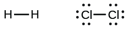

A single shared pair of electrons is called a **single bond**{: data-type="term"}. Each Cl atom interacts with eight valence electrons: the six in the lone pairs and the two in the single bond.

#### The Octet Rule

The other halogen molecules (F2, Br2, I2, and At2) form bonds like those in the chlorine molecule: one single bond between atoms and three lone pairs of electrons per atom. This allows each halogen atom to have a noble gas electron configuration. The tendency of main group atoms to form enough bonds to obtain eight valence electrons is known as the **octet rule**{: data-type="term"}.

The number of bonds that an atom can form can often be predicted from the number of electrons needed to reach an octet (eight valence electrons); this is especially true of the nonmetals of the second period of the periodic table (C, N, O, and F). For example, each atom of a group 14 element has four electrons in its outermost shell and therefore requires four more electrons to reach an octet. These four electrons can be gained by forming four covalent bonds, as illustrated here for carbon in CCl4 (carbon tetrachloride) and silicon in SiH4 (silane). Because hydrogen only needs two electrons to fill its valence shell, it is an exception to the octet rule. The transition elements and inner transition elements also do not follow the octet rule:

![Two sets of Lewis dot structures are shown. The left structures depict five C l symbols in a cross shape with eight dots around each, the word &#x201C;or&#x201D; and the same five C l symbols, connected by four single bonds in a cross shape. The name &#x201C;Carbon tetrachloride&#x201D; is written below the structure. The right hand structures show a S i symbol, surrounded by eight dots and four H symbols in a cross shape. The word &#x201C;or&#x201D; separates this from an S i symbol with four single bonds connecting the four H symbols in a cross shape. The name &#x201C;Silane&#x201D; is written below these diagrams.](../resources/CNX_Chem_07_03_XY4struc_img.jpg)

Group 15 elements such as nitrogen have five valence electrons in the atomic Lewis symbol: one lone pair and three unpaired electrons. To obtain an octet, these atoms form three covalent bonds, as in NH3 (ammonia). Oxygen and other atoms in group 16 obtain an octet by forming two covalent bonds:

#### Double and Triple Bonds

As previously mentioned, when a pair of atoms shares one pair of electrons, we call this a single bond. However, a pair of atoms may need to share more than one pair of electrons in order to achieve the requisite octet. A **double bond**{: data-type="term"} forms when two pairs of electrons are shared between a pair of atoms, as between the carbon and oxygen atoms in CH2O (formaldehyde) and between the two carbon atoms in C2H4 (ethylene):

![Two pairs of Lewis structures are shown. The left pair of structures shows a carbon atom forming single bonds to two hydrogen atoms. There are four electrons between the C atom and an O atom. The O atom also has two pairs of dots. The word &#x201C;or&#x201D; separates this structure from the same diagram, except this time there is a double bond between the C atom and O atom. The name, &#x201C;Formaldehyde&#x201D; is written below these structures. A right-facing arrow leads to two more structures. The left shows two C atoms with four dots in between them and each forming single bonds to two H atoms. The word &#x201C;or&#x201D; lies to the left of the second structure, which is the same except that the C atoms form double bonds with one another. The name, &#x201C;Ethylene&#x201D; is written below these structures.](../resources/CNX_Chem_07_03_DoubleBond_img.jpg)

A **triple bond**{: data-type="term"} forms when three electron pairs are shared by a pair of atoms, as in carbon monoxide (CO) and the cyanide ion (CN–):

![Two pairs of Lewis structures are shown and connected by a right-facing arrow. The left pair of structures show a C atom and an O atom with six dots in between them and a lone pair on each. The word &#x201C;or&#x201D; and the same structure with a triple bond in between the C atom and O atom also are shown. The name &#x201C;Carbon monoxide&#x201D; is written below this structure. The right pair of structures show a C atom and an N atom with six dots in between them and a lone pair on each. The word &#x201C;or&#x201D; and the same structure with a triple bond in between the C atom and N atom also are shown. The name &#x201C;Cyanide ion&#x201D; is written below this structure.](../resources/CNX_Chem_07_03_COCN_img.jpg)

### Writing Lewis Structures with the Octet Rule

For very simple molecules and molecular ions, we can write the Lewis structures by merely pairing up the unpaired electrons on the constituent atoms. See these examples:

![Three reactions are shown with Lewis dot diagrams. The first shows a hydrogen with one red dot, a plus sign and a bromine with seven dots, one of which is red, connected by a right-facing arrow to a hydrogen and bromine with a pair of red dots in between them. There are also three lone pairs on the bromine. The second reaction shows a hydrogen with a coefficient of two and one red dot, a plus sign, and a sulfur atom with six dots, two of which are red, connected by a right facing arrow to two hydrogen atoms and one sulfur atom. There are two red dots in between the two hydrogen atoms and the sulfur atom. Both pairs of these dots are red. The sulfur atom also has two lone pairs of dots. The third reaction shows two nitrogen atoms each with five dots, three of which are red, separated by a plus sign, and connected by a right-facing arrow to two nitrogen atoms with six red electron dots in between one another. Each nitrogen atom also has one lone pair of electrons.](../resources/CNX_Chem_07_03_Unprelec_img.jpg)

For more complicated molecules and molecular ions, it is helpful to follow the step-by-step procedure outlined here:

1.  Determine the total number of valence (outer shell) electrons. For cations, subtract one electron for each positive charge. For anions, add one electron for each negative charge.
2.  Draw a skeleton structure of the molecule or ion, arranging the atoms around a central atom. (Generally, the least electronegative element should be placed in the center.) Connect each atom to the central atom with a single bond (one electron pair).
3.  Distribute the remaining electrons as lone pairs on the terminal atoms (except hydrogen), completing an octet around each atom.
4.  Place all remaining electrons on the central atom.
5.  Rearrange the electrons of the outer atoms to make multiple bonds with the central atom in order to obtain octets wherever possible.
{: data-number-style="arabic"}

Let us determine the Lewis structures of SiH4, <math xmlns="http://www.w3.org/1998/Math/MathML"><mrow><msub><mtext>CHO</mtext><mn>2</mn></msub><msup><mrow /><mtext>−</mtext></msup><mo>,</mo></mrow></math>

 NO+, and OF2 as examples in following this procedure:

1.  Determine the total number of valence (outer shell) electrons in the molecule or ion.
    * For a molecule, we add the number of valence electrons on each atom in the molecule:
      * * *
      {: data-type="newline"}
      
      

      <math xmlns="http://www.w3.org/1998/Math/MathML"><mtable columnalign="left"><mtr><mtd /></mtr> <mtr><mtd><mspace width="0.8em" /><msub><mtext>SiH</mtext><mn>4</mn></msub></mtd></mtr> <mtr><mtd><mspace width="0.8em" /><mtext>Si: 4 valence electrons/atom</mtext><mspace width="0.2em" /><mo>×</mo><mspace width="0.2em" /><mtext>1 atom</mtext><mo>=</mo><mn>4</mn></mtd></mtr> <mtr><mtd><munder accentunder="true"><mrow><mo>+</mo><mspace width="0.2em" /><mtext>H: 1 valence electron/atom</mtext><mspace width="0.2em" /><mo>×</mo><mspace width="0.2em" /><mtext>4 atoms</mtext><mo>=</mo><mn>4</mn></mrow><mo stretchy="true">¯</mo></munder></mtd></mtr> <mtr><mtd /></mtr> <mtr><mtd><mspace width="16.0em" /><mo>=</mo><mtext>8 valence electrons</mtext></mtd></mtr></mtable></math>
      

    
    * For a *negative ion*, such as
      <math xmlns="http://www.w3.org/1998/Math/MathML"><mrow><msub><mtext>CHO</mtext><mn>2</mn></msub><msup><mrow /><mtext>−</mtext></msup><mo>,</mo></mrow></math>
      
      we add the number of valence electrons on the atoms to the number of negative charges on the ion (one electron is gained for each single negative charge):
      * * *
      {: data-type="newline"}
      
      

      <math xmlns="http://www.w3.org/1998/Math/MathML"><mtable columnalign="left"><mtr><mtd /></mtr><mtr><mtd><mspace width="0.5em" /><msub><mtext>CHO</mtext><mn>2</mn></msub><msup><mrow /><mtext>−</mtext></msup></mtd></mtr><mtr><mtd><mspace width="0.48em" /><mtext>C: 4 valence electrons/atom</mtext><mspace width="0.2em" /><mo>×</mo><mspace width="0.2em" /><mtext>1 atom</mtext><mo>=</mo><mn>4</mn></mtd></mtr><mtr><mtd><mspace width="0.8em" /><mtext>H: 1 valence electron/atom</mtext><mspace width="0.2em" /><mo>×</mo><mspace width="0.2em" /><mtext>1 atom</mtext><mo>=</mo><mn>1</mn></mtd></mtr><mtr><mtd><mspace width="0.05em" /><mtext>O: 6 valence electrons/atom</mtext><mspace width="0.2em" /><mo>×</mo><mspace width="0.2em" /><mtext>2 atoms</mtext><mo>=</mo><mn>12</mn></mtd></mtr><mtr><mtd><munder accentunder="true"><mrow><mo>+</mo><mspace width="6.5em" /><mtext>1 additional electron</mtext><mo>=</mo><mn>1</mn></mrow><mo stretchy="true">¯</mo></munder></mtd></mtr><mtr><mtd /></mtr><mtr><mtd><mspace width="15.50em" /><mo>=</mo><mtext>18 valence electrons</mtext></mtd></mtr></mtable></math>
      

    
    * For a *positive ion*, such as NO+, we add the number of valence electrons on the atoms in the ion and then subtract the number of positive charges on the ion (one electron is lost for each single positive charge) from the total number of valence electrons:
      * * *
      {: data-type="newline"}
      
      

      <math xmlns="http://www.w3.org/1998/Math/MathML"><mtable columnalign="left"><mtr /><mtr /><mtr><mtd><mspace width="0.1em" /><msup><mtext>NO</mtext><mo>+</mo></msup></mtd></mtr><mtr><mtd><mtext>N: 5 valence electrons/atom</mtext><mspace width="0.2em" /><mo>×</mo><mspace width="0.2em" /><mtext>1 atom</mtext><mo>=</mo><mn>5</mn></mtd></mtr><mtr><mtd /></mtr><mtr><mtd><mspace width="0.4em" /><mtext>O: 6 valence electron/atom</mtext><mspace width="0.2em" /><mo>×</mo><mspace width="0.2em" /><mtext>1 atom</mtext><mo>=</mo><mn>6</mn></mtd></mtr><mtr><mtd><mspace width="0.35em" /><munder accentunder="true"><mrow><mo>+</mo><mspace width="0.5em" /><mtext>−1 electron (positive charge)</mtext><mspace width="1.8em" /><mo>=</mo><mn>−1</mn></mrow><mo stretchy="true">¯</mo></munder></mtd></mtr><mtr><mtd /></mtr><mtr><mtd><mspace width="15.02em" /><mo>=</mo><mtext>10 valence electrons</mtext></mtd></mtr></mtable></math>
      

    
    * Since OF2 is a neutral molecule, we simply add the number of valence electrons:
      * * *
      {: data-type="newline"}
      
      

      <math xmlns="http://www.w3.org/1998/Math/MathML"><mtable columnalign="left"><mtr><mtd /></mtr><mtr><mtd><mspace width="0.8em" /><msub><mtext>OF</mtext><mtext>2</mtext></msub></mtd></mtr><mtr><mtd><mspace width="1.25em" /><mtext>O: 6 valence electrons/atom</mtext><mspace width="0.2em" /><mo>×</mo><mspace width="0.2em" /><mtext>1 atom</mtext><mo>=</mo><mn>6</mn></mtd></mtr><mtr><mtd><mspace width="0.1em" /><munder accentunder="true"><mrow><mo>+</mo><mspace width="0.2em" /><mtext>F: 7 valence electrons/atom</mtext><mspace width="0.2em" /><mo>×</mo><mspace width="0.2em" /><mtext>2 atoms</mtext><mo>=</mo><mn>14</mn></mrow><mo stretchy="true">¯</mo></munder></mtd></mtr><mtr><mtd><mspace width="16.28em" /><mo>=</mo><mtext>20 valence electrons</mtext></mtd></mtr></mtable></math>
      

    {: data-bullet-style="bullet"}

2.  Draw a skeleton structure of the molecule or ion, arranging the atoms around a central atom and connecting each atom to the central atom with a single (one electron pair) bond. (Note that we denote ions with brackets around the structure, indicating the charge outside the brackets:)
    * * *
    {: data-type="newline"}
    
    

    ![Four Lewis diagrams are shown. The first shows one silicon single boned to four hydrogen atoms. The second shows a carbon which forms a single bond with an oxygen and a hydrogen and a double bond with a second oxygen. This structure is surrounded by brackets and has a superscripted negative sign near the upper right corner. The third structure shows a nitrogen single bonded to an oxygen and surrounded by brackets with a superscripted plus sign in the upper right corner. The last structure shows two fluorine atoms single bonded to a central oxygen.](../resources/CNX_Chem_07_03_Singlebond_img.jpg)
    

    
    * * *
    {: data-type="newline"}
    
    When several arrangements of atoms are possible, as for
    <math xmlns="http://www.w3.org/1998/Math/MathML"><mrow><msub><mtext>CHO</mtext><mn>2</mn></msub><msup><mrow /><mtext>−</mtext></msup><mo>,</mo></mrow></math>
    
    we must use experimental evidence to choose the correct one. In general, the less electronegative elements are more likely to be central atoms. In
    <math xmlns="http://www.w3.org/1998/Math/MathML"><mrow><msub><mtext>CHO</mtext><mn>2</mn></msub><msup><mrow /><mtext>−</mtext></msup><mo>,</mo></mrow></math>
    
    the less electronegative carbon atom occupies the central position with the oxygen and hydrogen atoms surrounding it. Other examples include P in POCl3, S in SO2, and Cl in
    <math xmlns="http://www.w3.org/1998/Math/MathML"><mrow><msub><mrow><mtext>ClO</mtext></mrow><mn>4</mn></msub><msup><mrow /><mtext>−</mtext></msup><mo>.</mo></mrow></math>
    
    An exception is that hydrogen is almost never a central atom. As the most electronegative element, fluorine also cannot be a central atom.
3.  Distribute the remaining electrons as lone pairs on the terminal atoms (except hydrogen) to complete their valence shells with an octet of electrons.
    * There are no remaining electrons on SiH4, so it is unchanged:
      * * *
      {: data-type="newline"}
      
      

      ![Four Lewis structures are shown. The first shows one silicon single boned to four hydrogen atoms. The second shows a carbon single bonded to two oxygen atoms that each have three lone pairs and single bonded to a hydrogen. This structure is surrounded by brackets and has a superscripted negative sign near the upper right corner. The third structure shows a nitrogen single bonded to an oxygen, each with three lone pairs of electrons. This structure is surrounded by brackets with a superscripted plus sign in the upper right corner. The last structure shows two fluorine atoms, each with three lone pairs of electrons, single bonded to a central oxygen.](../resources/CNX_Chem_07_03_SiH4_img.jpg)
      

    {: data-bullet-style="bullet"}

4.  Place all remaining electrons on the central atom.
    * For SiH4,
      <math xmlns="http://www.w3.org/1998/Math/MathML"><mrow><msub><mrow><mtext>CHO</mtext></mrow><mn>2</mn></msub><msup><mrow /><mtext>−</mtext></msup><mo>,</mo></mrow></math>
      
      and NO+, there are no remaining electrons; we already placed all of the electrons determined in Step 1.
    * For OF2, we had 16 electrons remaining in Step 3, and we placed 12, leaving 4 to be placed on the central atom:
      * * *
      {: data-type="newline"}
      
      

      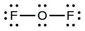
      

    {: data-bullet-style="bullet"}

5.  Rearrange the electrons of the outer atoms to make multiple bonds with the central atom in order to obtain octets wherever possible.
    * SiH4\: Si already has an octet, so nothing needs to be done.
    * <math xmlns="http://www.w3.org/1998/Math/MathML"><mrow><msub><mrow><mtext>CHO</mtext></mrow><mn>2</mn></msub><msup><mrow /><mtext>−</mtext></msup><mo>:</mo></mrow></math>
      
      We have distributed the valence electrons as lone pairs on the oxygen atoms, but the carbon atom lacks an octet:
      * * *
      {: data-type="newline"}
      
      

      ![Two Lewis diagrams are shown with the word &#x201C;gives&#x201D; in between them. The left diagram, surrounded by brackets and with a superscripted negative sign, shows a carbon atom single bonded to two oxygen atoms, each with three lone pairs of electrons. The carbon atom also forms a single bond with a hydrogen atom. A curved arrow points from a lone pair on one of the oxygen atoms to the carbon atom. The right diagram, surrounded by brackets and with a superscripted negative sign, shows a carbon atom single bonded to an oxygen atom with three lone pairs of electrons, double bonded to an oxygen atom with two lone pairs of electrons, and single bonded to a hydrogen atom.](../resources/CNX_Chem_07_03_formate2_img.jpg)
      

    
    * NO+\: For this ion, we added eight valence electrons, but neither atom has an octet. We cannot add any more electrons since we have already used the total that we found in Step 1, so we must move electrons to form a multiple bond:
      * * *
      {: data-type="newline"}
      
      

      
      

      
      * * *
      {: data-type="newline"}
      
      This still does not produce an octet, so we must move another pair, forming a triple bond:
      * * *
      {: data-type="newline"}
      
      

      
      

    
    * In OF2, each atom has an octet as drawn, so nothing changes.
    {: data-bullet-style="bullet"}
{: data-number-style="arabic"}

Writing Lewis Structures NASA’s Cassini-Huygens mission detected a large cloud of toxic hydrogen cyanide (HCN) on Titan, one of Saturn’s moons. Titan also contains ethane (H3CCH3), acetylene (HCCH), and ammonia (NH3). What are the Lewis structures of these molecules?

Solution

*Calculate the number of valence electrons.*
* * *
{: data-type="newline"}

HCN: (1
<math xmlns="http://www.w3.org/1998/Math/MathML"><mo>×</mo></math>
1) + (4
<math xmlns="http://www.w3.org/1998/Math/MathML"><mo>×</mo></math>
1) + (5
<math xmlns="http://www.w3.org/1998/Math/MathML"><mo>×</mo></math>
1) = 10
* * *
{: data-type="newline"}

H3CCH3: (1
<math xmlns="http://www.w3.org/1998/Math/MathML"><mo>×</mo></math>
3) + (2
<math xmlns="http://www.w3.org/1998/Math/MathML"><mo>×</mo></math>
4) + (1
<math xmlns="http://www.w3.org/1998/Math/MathML"><mo>×</mo></math>
3) = 14
* * *
{: data-type="newline"}

HCCH: (1
<math xmlns="http://www.w3.org/1998/Math/MathML"><mo>×</mo></math>
1) + (2
<math xmlns="http://www.w3.org/1998/Math/MathML"><mo>×</mo></math>
4) + (1
<math xmlns="http://www.w3.org/1998/Math/MathML"><mo>×</mo></math>
1) = 10
* * *
{: data-type="newline"}

NH3: (5
<math xmlns="http://www.w3.org/1998/Math/MathML"><mo>×</mo></math>
1) + (3
<math xmlns="http://www.w3.org/1998/Math/MathML"><mo>×</mo></math>
1) = 8

*Draw a skeleton and connect the atoms with single bonds.* Remember that H is never a central atom:
* * *
{: data-type="newline"}

  

*Where needed, distribute electrons to the terminal atoms:*
* * *
{: data-type="newline"}

  
* * *
{: data-type="newline"}

HCN: six electrons placed on N
* * *
{: data-type="newline"}

H3CCH3: no electrons remain
* * *
{: data-type="newline"}

HCCH: no terminal atoms capable of accepting electrons
* * *
{: data-type="newline"}

NH3: no terminal atoms capable of accepting electrons

*Where needed, place remaining electrons on the central atom:*
* * *
{: data-type="newline"}

 ![Four Lewis structures are shown. The first structure shows a carbon atom single bonded to a hydrogen atom and a nitrogen atom, which has three lone pairs of electrons. The second structure shows two carbon atoms single bonded to one another. Each is single bonded to three hydrogen atoms. The third structure shows two carbon atoms, each with a lone pair of electrons, single bonded to one another and each single bonded to one hydrogen atom. The fourth structure shows a nitrogen atom with a lone pair of electrons single bonded to three hydrogen atoms.](../resources/CNX_Chem_07_03_ex070301_3_img.jpg) 
* * *
{: data-type="newline"}

HCN: no electrons remain
* * *
{: data-type="newline"}

H3CCH3: no electrons remain
* * *
{: data-type="newline"}

HCCH: four electrons placed on carbon
* * *
{: data-type="newline"}

NH3: two electrons placed on nitrogen

*Where needed, rearrange electrons to form multiple bonds in order to obtain an octet on each atom:*
* * *
{: data-type="newline"}

HCN: form two more C–N bonds
* * *
{: data-type="newline"}

H3CCH3: all atoms have the correct number of electrons
* * *
{: data-type="newline"}

HCCH: form a triple bond between the two carbon atoms
* * *
{: data-type="newline"}

NH3: all atoms have the correct number of electrons
* * *
{: data-type="newline"}

 ![Four Lewis structures are shown. The first structure shows a carbon atom single bonded to a hydrogen atom and a nitrogen atom, which has three lone pairs of electrons. Two curved arrows point from the nitrogen to the carbon. Below this structure is the word &#x201C;gives&#x201D; and below that is the same structure, but this time there is a triple bond between the carbon and nitrogen. The second structure shows two carbons single bonded to one another and each single bonded to three hydrogen atoms. The third structure shows two carbon atoms, each with a lone pair of electrons, single bonded to one another and each single bonded to one hydrogen atom. Two curved arrows point from the carbon atoms to the space in between the two. Below this structure is the word &#x201C;gives&#x201D; and the same structure, but this time with a triple bond between the two carbons. The fourth structure shows a nitrogen atom with a lone pair of electrons single bonded to three hydrogen atoms.](../resources/CNX_Chem_07_03_ex070301_4_img.jpg) 

Check Your Learning Both carbon monoxide, CO, and carbon dioxide, CO2, are products of the combustion of fossil fuels. Both of these gases also cause problems: CO is toxic and CO2 has been implicated in global climate change. What are the Lewis structures of these two molecules?

Answer:

Fullerene Chemistry

Carbon soot has been known to man since prehistoric times, but it was not until fairly recently that the molecular structure of the main component of soot was discovered. In 1996, the Nobel Prize in Chemistry was awarded to Richard **Smalley**{: data-type="term" .no-emphasis} ([\[link\]](#CNX_Chem_07_03_Smalley)), Robert Curl, and Harold Kroto for their work in discovering a new form of carbon, the C60 buckminsterfullerene molecule ([\[link\]](/m51046#CNX_Chem_07_00_Bucky)). An entire class of compounds, including spheres and tubes of various shapes, were discovered based on C60. This type of molecule, called a fullerene, shows promise in a variety of applications. Because of their size and shape, fullerenes can encapsulate other molecules, so they have shown potential in various applications from hydrogen storage to targeted drug delivery systems. They also possess unique electronic and optical properties that have been put to good use in solar powered devices and chemical sensors.

, a professor of physics, chemistry, and astronomy at Rice University, was one of the leading advocates for fullerene chemistry. Upon his death in 2005, the US Senate honored him as the &#x201C;Father of Nanotechnology.&#x201D; (credit: United States Department of Energy)"){: #CNX_Chem_07_03_Smalley}

### Exceptions to the Octet Rule

Many covalent molecules have central atoms that do not have eight electrons in their Lewis structures. These molecules fall into three categories:

* Odd-electron molecules have an odd number of valence electrons, and therefore have an unpaired electron.
* Electron-deficient molecules have a central atom that has fewer electrons than needed for a noble gas configuration.
* Hypervalent molecules have a central atom that has more electrons than needed for a noble gas configuration.
{: data-bullet-style="bullet"}

#### Odd-electron Molecules

We call molecules that contain an odd number of electrons **free radicals**{: data-type="term"}. Nitric oxide, NO, is an example of an odd-electron molecule; it is produced in internal combustion engines when oxygen and nitrogen react at high temperatures.

To draw the Lewis structure for an odd-electron molecule like NO, we follow the same five steps we would for other molecules, but with a few minor changes:

1.  *Determine the total number of valence (outer shell) electrons*. The sum of the valence electrons is 5 (from N) + 6 (from O) = 11. The odd number immediately tells us that we have a free radical, so we know that not every atom can have eight electrons in its valence shell.
2.  *Draw a skeleton structure of the molecule*. We can easily draw a skeleton with an N–O single bond:
    * * *
    {: data-type="newline"}
    
    N–O
3.  *Distribute the remaining electrons as lone pairs on the terminal atoms*. In this case, there is no central atom, so we distribute the electrons around both atoms. We give eight electrons to the more electronegative atom in these situations; thus oxygen has the filled valence shell:
    * * *
    {: data-type="newline"}
    
    

    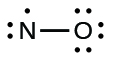
    

4.  *Place all remaining electrons on the central atom*. Since there are no remaining electrons, this step does not apply.
5.  *Rearrange the electrons to make multiple bonds with the central atom in order to obtain octets wherever possible.* We know that an odd-electron molecule cannot have an octet for every atom, but we want to get each atom as close to an octet as possible. In this case, nitrogen has only five electrons around it. To move closer to an octet for nitrogen, we take one of the lone pairs from oxygen and use it to form a NO double bond. (We cannot take another lone pair of electrons on oxygen and form a triple bond because nitrogen would then have nine electrons:)
    * * *
    {: data-type="newline"}
    
    

    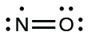
    

{: data-number-style="arabic"}

#### Electron-deficient Molecules

We will also encounter a few molecules that contain central atoms that do not have a filled valence shell. Generally, these are molecules with central atoms from groups 2 and 12, outer atoms that are hydrogen, or other atoms that do not form multiple bonds. For example, in the Lewis structures of beryllium dihydride, BeH2, and boron trifluoride, BF3, the beryllium and boron atoms each have only four and six electrons, respectively. It is possible to draw a structure with a double bond between a boron atom and a fluorine atom in BF3, satisfying the octet rule, but experimental evidence indicates the bond lengths are closer to that expected for B–F single bonds. This suggests the best Lewis structure has three B–F single bonds and an electron deficient boron. The reactivity of the compound is also consistent with an electron deficient boron. However, the B–F bonds are slightly shorter than what is actually expected for B–F single bonds, indicating that some double bond character is found in the actual molecule.

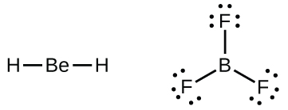

An atom like the boron atom in BF3, which does not have eight electrons, is very reactive. It readily combines with a molecule containing an atom with a lone pair of electrons. For example, NH3 reacts with BF3 because the lone pair on nitrogen can be shared with the boron atom:

![A reaction is shown with three Lewis diagrams. The left diagram shows a boron atom single bonded to three fluorine atoms, each with three lone pairs of electrons. There is a plus sign. The next structure shows a nitrogen atom with one lone pair of electrons single bonded to three hydrogen atoms. A right-facing arrow leads to the final Lewis structure that shows a boron atom single bonded to a nitrogen atom and single bonded to three fluorine atoms, each with three lone pairs of electrons. The nitrogen atom is also single bonded to three hydrogen atoms. The bond between the boron atom and the nitrogen atom is colored red.](../resources/CNX_Chem_07_03_dative_img.jpg)

#### Hypervalent Molecules

Elements in the second period of the periodic table (*n* = 2) can accommodate only eight electrons in their valence shell orbitals because they have only four valence orbitals (one 2*s* and three 2*p* orbitals). Elements in the third and higher periods (*n* ≥ 3) have more than four valence orbitals and can share more than four pairs of electrons with other atoms because they have empty *d* orbitals in the same shell. Molecules formed from these elements are sometimes called **hypervalent molecules**{: data-type="term"}. [\[link\]](#CNX_Chem_07_03_PF5SF6_img) shows the Lewis structures for two hypervalent molecules, PCl5 and SF6.

 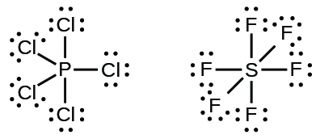{: #CNX_Chem_07_03_PF5SF6_img}

In some hypervalent molecules, such as IF5 and XeF4, some of the electrons in the outer shell of the central atom are lone pairs:

When we write the Lewis structures for these molecules, we find that we have electrons left over after filling the valence shells of the outer atoms with eight electrons. These additional electrons must be assigned to the central atom.

Writing Lewis Structures: Octet Rule Violations Xenon is a noble gas, but it forms a number of stable compounds. We examined XeF4 earlier. What are the Lewis structures of XeF2 and XeF6?

Solution We can draw the Lewis structure of any covalent molecule by following the six steps discussed earlier. In this case, we can condense the last few steps, since not all of them apply.

1.  *Calculate the number of valence electrons:*
    * * *
    {: data-type="newline"}
    
    XeF2\: 8 + (2
    <math xmlns="http://www.w3.org/1998/Math/MathML"><mo>×</mo></math>
    
    7) = 22
    * * *
    {: data-type="newline"}
    
    XeF6\: 8 + (6
    <math xmlns="http://www.w3.org/1998/Math/MathML"><mo>×</mo></math>
    
    7) = 50
2.  *Draw a skeleton joining the atoms by single bonds.* Xenon will be the central atom because fluorine cannot be a central atom:
    * * *
    {: data-type="newline"}
    
    

    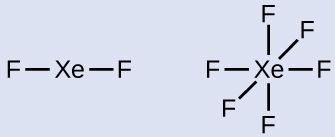
    

3.  *Distribute the remaining electrons.*
    * * *
    {: data-type="newline"}
    
    XeF2\: We place three lone pairs of electrons around each F atom, accounting for 12 electrons and giving each F atom 8 electrons. Thus, six electrons (three lone pairs) remain. These lone pairs must be placed on the Xe atom. This is acceptable because Xe atoms have empty valence shell *d* orbitals and can accommodate more than eight electrons. The Lewis structure of XeF2 shows two bonding pairs and three lone pairs of electrons around the Xe atom:
    * * *
    {: data-type="newline"}
    
    

    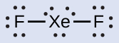
    

    
    * * *
    {: data-type="newline"}
    
    XeF6\: We place three lone pairs of electrons around each F atom, accounting for 36 electrons. Two electrons remain, and this lone pair is placed on the Xe atom:
    * * *
    {: data-type="newline"}
    
    

    
    

{: data-number-style="arabic" .stepwise}

Check Your Learning The halogens form a class of compounds called the interhalogens, in which halogen atoms covalently bond to each other. Write the Lewis structures for the interhalogens BrCl3 and <math xmlns="http://www.w3.org/1998/Math/MathML"><mrow><msub><mtext>ICl</mtext><mn>4</mn></msub><msup><mrow /><mtext>−</mtext></msup><mo>.</mo></mrow></math>

Answer:

### Key Concepts and Summary

Valence electronic structures can be visualized by drawing Lewis symbols (for atoms and monatomic ions) and Lewis structures (for molecules and polyatomic ions). Lone pairs, unpaired electrons, and single, double, or triple bonds are used to indicate where the valence electrons are located around each atom in a Lewis structure. Most structures—especially those containing second row elements—obey the octet rule, in which every atom (except H) is surrounded by eight electrons. Exceptions to the octet rule occur for odd-electron molecules (free radicals), electron-deficient molecules, and hypervalent molecules.

### Chemistry End of Chapter Exercises

Write the Lewis symbols for each of the following ions:

(a) As3–

(b) I–

(c) Be2+

(d) O2–

(e) Ga3+

(f) Li+

(g) N3–

(a) eight electrons:* * *
{: data-type="newline"}

  
;* * *
{: data-type="newline"}

 (b) eight electrons:* * *
{: data-type="newline"}

  
;* * *
{: data-type="newline"}

 (c) no electrons* * *
{: data-type="newline"}

 Be2+;* * *
{: data-type="newline"}

 (d) eight electrons:* * *
{: data-type="newline"}

  
;* * *
{: data-type="newline"}

 (e) no electrons* * *
{: data-type="newline"}

 Ga3+;* * *
{: data-type="newline"}

 (f) no electrons* * *
{: data-type="newline"}

 Li+;* * *
{: data-type="newline"}

 (g) eight electrons:* * *
{: data-type="newline"}

  

Many monatomic ions are found in seawater, including the ions formed from the following list of elements. Write the Lewis symbols for the monatomic ions formed from the following elements:

(a) Cl

(b) Na

(c) Mg

(d) Ca

(e) K

(f) Br

(g) Sr

(h) F

Write the Lewis symbols of the ions in each of the following ionic compounds and the Lewis symbols of the atom from which they are formed:

(a) MgS

(b) Al2O3

(c) GaCl3

(d) K2O

(e) Li3N

(f) KF

(a)* * *
{: data-type="newline"}

  
;* * *
{: data-type="newline"}

 (b)* * *
{: data-type="newline"}

  
;* * *
{: data-type="newline"}

 (c)* * *
{: data-type="newline"}

  
;* * *
{: data-type="newline"}

 (d)* * *
{: data-type="newline"}

  
;* * *
{: data-type="newline"}

 (e)* * *
{: data-type="newline"}

  
;* * *
{: data-type="newline"}

 (f)* * *
{: data-type="newline"}

  

In the Lewis structures listed here, M and X represent various elements in the third period of the periodic table. Write the formula of each compound using the chemical symbols of each element:

(a)* * *
{: data-type="newline"}

  
(b)* * *
{: data-type="newline"}

  
(c)* * *
{: data-type="newline"}

  
(d)* * *
{: data-type="newline"}

  

Write the Lewis structure for the diatomic molecule P2, an unstable form of phosphorus found in high-temperature phosphorus vapor.

* * *
{: data-type="newline"}

  

Write Lewis structures for the following:

(a) H2

(b) HBr

(c) PCl3

(d) SF2

(e) H2CCH2

(f) HNNH

(g) H2CNH

(h) NO–

(i) N2

(j) CO

(k) CN–

Write Lewis structures for the following:

(a) O2

(b) H2CO

(c) AsF3

(d) ClNO

(e) SiCl4

(f) H3O+

(g) <math xmlns="http://www.w3.org/1998/Math/MathML"><mrow><msub><mtext>NH</mtext><mn>4</mn></msub><msup><mrow /><mo>+</mo></msup></mrow></math>

(h) <math xmlns="http://www.w3.org/1998/Math/MathML"><mrow><msub><mtext>BF</mtext><mn>4</mn></msub><msup><mrow /><mtext>−</mtext></msup></mrow></math>

(i) HCCH

(j) ClCN

(k) <math xmlns="http://www.w3.org/1998/Math/MathML"><mrow><msub><mtext>C</mtext><mn>2</mn></msub><msup><mrow /><mtext>2+</mtext></msup></mrow></math>

(a)* * *
{: data-type="newline"}

 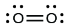 
* * *
{: data-type="newline"}

 In this case, the Lewis structure is inadequate to depict the fact that experimental studies have shown two unpaired electrons in each oxygen molecule*.** * *
{: data-type="newline"}

 (b)* * *
{: data-type="newline"}

 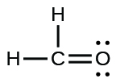 
;* * *
{: data-type="newline"}

 (c)* * *
{: data-type="newline"}

 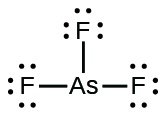 
;* * *
{: data-type="newline"}

 (d)* * *
{: data-type="newline"}

  
;* * *
{: data-type="newline"}

 (e)* * *
{: data-type="newline"}

 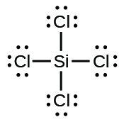 
;* * *
{: data-type="newline"}

 (f)* * *
{: data-type="newline"}

 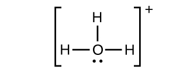 
;* * *
{: data-type="newline"}

 (g)* * *
{: data-type="newline"}

 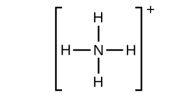 
;* * *
{: data-type="newline"}

 (h)* * *
{: data-type="newline"}

 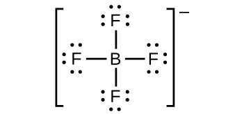 
;* * *
{: data-type="newline"}

 (i)* * *
{: data-type="newline"}

 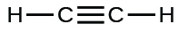 
;* * *
{: data-type="newline"}

 (j)* * *
{: data-type="newline"}

 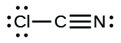 
;* * *
{: data-type="newline"}

 (k)* * *
{: data-type="newline"}

 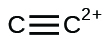 

Write Lewis structures for the following:

(a) ClF3

(b) PCl5

(c) BF3

(d) <math xmlns="http://www.w3.org/1998/Math/MathML"><mrow><msub><mtext>PF</mtext><mn>6</mn></msub><msup><mrow /><mtext>−</mtext></msup></mrow></math>

Write Lewis structures for the following:

(a) SeF6

(b) XeF4

(c) <math xmlns="http://www.w3.org/1998/Math/MathML"><mrow><msub><mtext>SeCl</mtext><mn>3</mn></msub><msup><mrow /><mo>+</mo></msup></mrow></math>

(d) Cl2BBCl2 (contains a B–B bond)

(a) SeF6:* * *
{: data-type="newline"}

 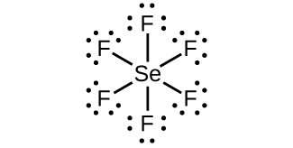 
;* * *
{: data-type="newline"}

 (b) XeF4:* * *
{: data-type="newline"}

 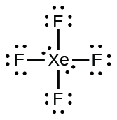 
;* * *
{: data-type="newline"}

 (c) <math xmlns="http://www.w3.org/1998/Math/MathML"><mrow><msub><mtext>SeCl</mtext><mn>3</mn></msub><msup><mrow /><mtext>+</mtext></msup><mtext>:</mtext></mrow></math>

* * *
{: data-type="newline"}

 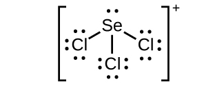 
;* * *
{: data-type="newline"}

 (d) Cl2BBCl2:* * *
{: data-type="newline"}

 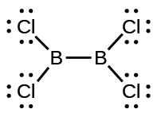 

Write Lewis structures for:

(a) <math xmlns="http://www.w3.org/1998/Math/MathML"><mrow><msub><mtext>PO</mtext><mn>4</mn></msub><msup><mrow /><mtext>3−</mtext></msup></mrow></math>

(b) <math xmlns="http://www.w3.org/1998/Math/MathML"><mrow><msub><mtext>ICl</mtext><mn>4</mn></msub><msup><mrow /><mtext>−</mtext></msup></mrow></math>

(c) <math xmlns="http://www.w3.org/1998/Math/MathML"><mrow><msub><mtext>SO</mtext><mn>3</mn></msub><msup><mrow /><mtext>2−</mtext></msup></mrow></math>

(d) HONO

Correct the following statement: “The bonds in solid PbCl2 are ionic; the bond in a HCl molecule is covalent. Thus, all of the valence electrons in PbCl2 are located on the Cl– ions, and all of the valence electrons in a HCl molecule are shared between the H and Cl atoms.”

Two valence electrons per Pb atom are transferred to Cl atoms; the resulting Pb2+ ion has a 6*s*2 valence shell configuration. Two of the valence electrons in the HCl molecule are shared, and the other six are located on the Cl atom as lone pairs of electrons.

Write Lewis structures for the following molecules or ions:

(a) SbH3

(b) XeF2

(c) Se8 (a cyclic molecule with a ring of eight Se atoms)

Methanol, H3COH, is used as the fuel in some race cars. Ethanol, C2H5OH, is used extensively as motor fuel in Brazil. Both methanol and ethanol produce CO2 and H2O when they burn. Write the chemical equations for these combustion reactions using Lewis structures instead of chemical formulas.

![Two reactions are shown using Lewis structures. The top reaction shows a carbon atom, single bonded to three hydrogen atoms and single bonded to an oxygen atom with two lone pairs of electrons. The oxygen atom is also bonded to a hydrogen atom. This is followed by a plus sign and the number one point five, followed by two oxygen atoms bonded together with a double bond and each with two lone pairs of electrons. A right-facing arrow leads to a carbon atom that is double bonded to two oxygen atoms, each of which has two lone pairs of electrons. This structure is followed by a plus sign, a number two, and a structure made up of an oxygen with two lone pairs of electrons single bonded to two hydrogen atoms. The bottom reaction shows a carbon atom, single bonded to three hydrogen atoms and single bonded to another carbon atom. The second carbon atom is single bonded to two hydrogen atoms and one oxygen atom with two lone pairs of electrons. The oxygen atom is also bonded to a hydrogen atom. This is followed by a plus sign and the number three, followed by two oxygen atoms bonded together with a double bond. Each oxygen atom has two lone pairs of electrons. A right-facing arrow leads to a number two and a carbon atom that is double bonded to two oxygen atoms, each of which has two lone pairs of electrons. This structure is followed by a plus sign, a number three, and a structure made up of an oxygen with two lone pairs of electrons single bonded to two hydrogen atoms.](../resources/CNX_Chem_07_03_Question18_img.jpg)

Many planets in our solar system contain organic chemicals including methane (CH4) and traces of ethylene (C2H4), ethane (C2H6), propyne (H3CCCH), and diacetylene (HCCCCH). Write the Lewis structures for each of these molecules.

Carbon tetrachloride was formerly used in fire extinguishers for electrical fires. It is no longer used for this purpose because of the formation of the toxic gas phosgene, Cl2CO. Write the Lewis structures for carbon tetrachloride and phosgene.

 * * *
{: data-type="newline"}

  

Identify the atoms that correspond to each of the following electron configurations. Then, write the Lewis symbol for the common ion formed from each atom:

(a) 1*s*22*s*22*p*5

(b) 1*s*22*s*22*p*63*s*2

(c) 1*s*22*s*22*p*63*s*23*p*64*s*23*d*10

(d) 1*s*22*s*22*p*63*s*23*p*64*s*23*d*104*p*4

(e) 1*s*22*s*22*p*63*s*23*p*64*s*23*d*104*p*1

The arrangement of atoms in several biologically important molecules is given here. Complete the Lewis structures of these molecules by adding multiple bonds and lone pairs. Do not add any more atoms.

(a) the amino acid serine:

(b) urea:

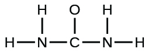

(c) pyruvic acid:

(d) uracil:

(e) carbonic acid:

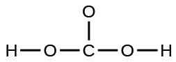

(a)* * *
{: data-type="newline"}

 ![A Lewis structure is shown. A nitrogen atom is single bonded to two hydrogen atoms and a carbon atom. The carbon atom is single bonded to a hydrogen atom and two other carbon atoms. One of these carbon atoms is single bonded to two hydrogen atoms and an oxygen atom. The oxygen atom is bonded to a hydrogen atom. The other carbon is single bonded to two oxygen atoms, one of which is bonded to a hydrogen atom. The oxygen atoms have two lone pairs of electron dots, and the nitrogen atom has one lone pair of electron dots.](../resources/CNX_Chem_07_03_Impbioansa_img.jpg) 
;* * *
{: data-type="newline"}

 (b)* * *
{: data-type="newline"}

  
;* * *
{: data-type="newline"}

 (c)* * *
{: data-type="newline"}

  
;* * *
{: data-type="newline"}

 (d)* * *
{: data-type="newline"}

 ![A Lewis hexagonal ring structure is shown. From the top of the ring, three carbon atoms, one nitrogen atom, a carbon atom and a nitrogen atom are single bonded to one another. The top carbon is single bonded to an oxygen, the second and third carbons and the nitrogen atom are each single bonded to a hydrogen atom. The next carbon is single bonded to an oxygen atom and the last nitrogen is single bonded to a hydrogen atom. The oxygen atoms have two lone pairs of electron dots, and the nitrogen atoms have one lone pair of electron dots.](../resources/CNX_Chem_07_03_Impbioansd_img.jpg) 
;* * *
{: data-type="newline"}

 (e)* * *
{: data-type="newline"}

 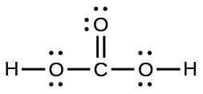 

A compound with a molar mass of about 28 g/mol contains 85.7% carbon and 14.3% hydrogen by mass. Write the Lewis structure for a molecule of the compound.

A compound with a molar mass of about 42 g/mol contains 85.7% carbon and 14.3% hydrogen by mass. Write the Lewis structure for a molecule of the compound.

 * * *
{: data-type="newline"}

  

Two arrangements of atoms are possible for a compound with a molar mass of about 45 g/mol that contains 52.2% C, 13.1% H, and 34.7% O by mass. Write the Lewis structures for the two molecules.

How are single, double, and triple bonds similar? How do they differ?

Each bond includes a sharing of electrons between atoms. Two electrons are shared in a single bond; four electrons are shared in a double bond; and six electrons are shared in a triple bond.

### Glossary
{: data-type="glossary-title"}

double bond
: covalent bond in which two pairs of electrons are shared between two atoms
^

free radical
: molecule that contains an odd number of electrons
^

hypervalent molecule
: molecule containing at least one main group element that has more than eight electrons in its valence shell
^

Lewis structure
: diagram showing lone pairs and bonding pairs of electrons in a molecule or an ion
^

Lewis symbol
: symbol for an element or monatomic ion that uses a dot to represent each valence electron in the element or ion
^

lone pair
: two (a pair of) valence electrons that are not used to form a covalent bond
^

octet rule
: guideline that states main group atoms will form structures in which eight valence electrons interact with each nucleus, counting bonding electrons as interacting with both atoms connected by the bond
^

single bond
: bond in which a single pair of electrons is shared between two atoms
^

triple bond
: bond in which three pairs of electrons are shared between two atoms

