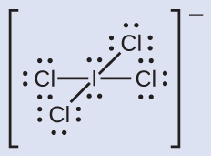
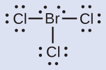
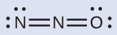
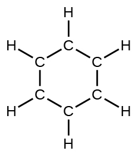
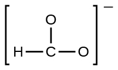
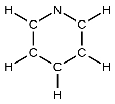
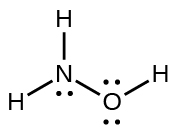
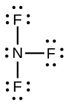

By the end of this section, you will be able to:
* Compute formal charges for atoms in any Lewis structure
* Use formal charges to identify the most reasonable Lewis structure for a given molecule
* Explain the concept of resonance and draw Lewis structures representing resonance forms for a given molecule

In the previous section, we discussed how to write Lewis structures for molecules and polyatomic ions. As we have seen, however, in some cases, there is seemingly more than one valid structure for a molecule. We can use the concept of formal charges to help us predict the most appropriate Lewis structure when more than one is reasonable.

### Calculating Formal Charge

The **formal charge**{: data-type="term"} of an atom in a molecule is the *hypothetical* charge the atom would have if we could redistribute the electrons in the bonds evenly between the atoms. Another way of saying this is that formal charge results when we take the number of valence electrons of a neutral atom, subtract the nonbonding electrons, and then subtract the number of bonds connected to that atom in the Lewis structure.

Thus, we calculate formal charge as follows:

<math xmlns="http://www.w3.org/1998/Math/MathML"><mrow><mtext>formal charge</mtext><mo>=</mo><mtext># valence shell electrons (free atom)</mtext><mo>−</mo><mtext># lone pair electrons</mtext><mspace width="0.2em" /><mo>−</mo><mspace width="0.2em" /><mfrac><mn>1</mn><mn>2</mn></mfrac><mspace width="0.2em" /><mtext># bonding electrons</mtext></mrow></math>

We can double-check formal charge calculations by determining the sum of the formal charges for the whole structure. The sum of the formal charges of all atoms in a molecule must be zero; the sum of the formal charges in an ion should equal the charge of the ion.

We must remember that the formal charge calculated for an atom is not the *actual* charge of the atom in the molecule. Formal charge is only a useful bookkeeping procedure; it does not indicate the presence of actual charges.

Calculating Formal Charge from Lewis Structures Assign formal charges to each atom in the interhalogen ion <math xmlns="http://www.w3.org/1998/Math/MathML"><mrow><msub><mtext>ICl</mtext><mn>4</mn></msub><msup><mrow /><mtext>−</mtext></msup><mo>.</mo></mrow></math>

Solution

1.  *We divide the bonding electron pairs equally for all I–Cl bonds:*
    * * *
    {: data-type="newline"}
    
      
2.  *We assign lone pairs of electrons to their atoms*. Each Cl atom now has seven electrons assigned to it, and the I atom has eight.
3.  *Subtract this number from the number of valence electrons for the neutral atom:*
    * * *
    {: data-type="newline"}
    
    I: 7 – 8 = –1
    * * *
    {: data-type="newline"}
    
    Cl: 7 – 7 = 0
    * * *
    {: data-type="newline"}
    
    The sum of the formal charges of all the atoms equals –1, which is identical to the charge of the ion (–1).
{: type="1" .stepwise}

Check Your Learning Calculate the formal charge for each atom in the carbon monoxide molecule:

  

Answer:

C −1, O +1

Calculating Formal Charge from Lewis Structures Assign formal charges to each atom in the interhalogen molecule BrCl3.

Solution

1.  *Assign one of the electrons in each Br–Cl bond to the Br atom and one to the Cl atom in that bond:*
    * * *
    {: data-type="newline"}
    
      
2.  *Assign the lone pairs to their atom.* Now each Cl atom has seven electrons and the Br atom has seven electrons.
3.  *Subtract this number from the number of valence electrons for the neutral atom.* This gives the formal charge:
    * * *
    {: data-type="newline"}
    
    Br: 7 – 7 = 0
    * * *
    {: data-type="newline"}
    
    Cl: 7 – 7 = 0
    * * *
    {: data-type="newline"}
    
    All atoms in BrCl3 have a formal charge of zero, and the sum of the formal charges totals zero, as it must in a neutral molecule.
{: type="1" .stepwise}

Check Your Learning Determine the formal charge for each atom in NCl3.

Answer:

N: 0; all three Cl atoms: 0

  

### Using Formal Charge to Predict Molecular Structure

The arrangement of atoms in a molecule or ion is called its **molecular structure**{: data-type="term"}. In many cases, following the steps for writing Lewis structures may lead to more than one possible molecular structure—different multiple bond and lone-pair electron placements or different arrangements of atoms, for instance. A few guidelines involving formal charge can be helpful in deciding which of the possible structures is most likely for a particular molecule or ion:

1.  A molecular structure in which all formal charges are zero is preferable to one in which some formal charges are not zero.
2.  If the Lewis structure must have nonzero formal charges, the arrangement with the smallest nonzero formal charges is preferable.
3.  Lewis structures are preferable when adjacent formal charges are zero or of the opposite sign.
4.  When we must choose among several Lewis structures with similar distributions of formal charges, the structure with the negative formal charges on the more electronegative atoms is preferable.
{: type="1"}

To see how these guidelines apply, let us consider some possible structures for carbon dioxide, CO2. We know from our previous discussion that the less electronegative atom typically occupies the central position, but formal charges allow us to understand *why* this occurs. We can draw three possibilities for the structure: carbon in the center and double bonds, carbon in the center with a single and triple bond, and oxygen in the center with double bonds:

  ![Three Lewis structures are shown. The left and right structures show a carbon atom double bonded to two oxygen atoms, each of which has two lone pairs of electrons. The center structure shows a carbon atom that is triple bonded to an oxygen atom with one lone pair of electrons and single bonded to an oxygen atom with three lone pairs of electrons. The third structure shows an oxygen atom double bonded to another oxygen atom with to lone pairs of electrons. The first oxygen atom is also double bonded to a carbon atom with two lone pairs of electrons.](../resources/CNX_Chem_07_04_CO2pos_img.jpg)  Comparing the three formal charges, we can definitively identify the structure on the left as preferable because it has only formal charges of zero (Guideline 1).

As another example, the thiocyanate ion, an ion formed from a carbon atom, a nitrogen atom, and a sulfur atom, could have three different molecular structures: CNS–, NCS–, or CSN–. The formal charges present in each of these molecular structures can help us pick the most likely arrangement of atoms. Possible Lewis structures and the formal charges for each of the three possible structures for the thiocyanate ion are shown here:

  ![Two rows of structures and numbers are shown. The top row is labeled, &#x201C;Structure&#x201D; and depicts three Lewis structures and the bottom row is labeled, &#x201C;Formal charge.&#x201D; The left structure shows a carbon atom double bonded to a nitrogen atom with two lone electron pairs on one side and double bonded to a sulfur atom with two lone electron pairs on the other. The structure is surrounded by brackets and has a superscripted negative sign. Below this structure are the numbers negative one, zero, and zero. The middle structure shows a carbon atom with two lone pairs of electrons double bonded to a nitrogen atom that is double bonded to a sulfur atom with two lone electron pairs. The structure is surrounded by brackets and has a superscripted negative sign. Below this structure are the numbers negative two, positive one, and zero. The right structure shows a carbon atom with two lone electron pairs double bonded to a sulfur atom that is double bonded to a nitrogen atom with two lone electron pairs. The structure is surrounded by brackets and has a superscripted negative sign. Below this structure are the numbers negative two, positive two, and one.](../resources/CNX_Chem_07_04_Thiocyan_img.jpg)  Note that the sum of the formal charges in each case is equal to the charge of the ion (–1). However, the first arrangement of atoms is preferred because it has the lowest number of atoms with nonzero formal charges (Guideline 2). Also, it places the least electronegative atom in the center, and the negative charge on the more electronegative element (Guideline 4).

Using Formal Charge to Determine Molecular Structure Nitrous oxide, N2O, commonly known as laughing gas, is used as an anesthetic in minor surgeries, such as the routine extraction of wisdom teeth. Which is the likely structure for nitrous oxide?

  
Solution Determining formal charge yields the following:

 ![Two Lewis structures are shown with the word &#x201C;or&#x201D; in between them. The left structure depicts a nitrogen atom with two lone pairs of electrons double bonded to a nitrogen atom that is double bonded to an oxygen atom with two lone pairs of electrons. The numbers negative one, positive one, and zero are written above this structure. The right structure shows a nitrogen atom with two lone pairs of electrons double bonded to an oxygen atom that is double bonded to a nitrogen atom with two lone pairs of electrons. The numbers negative one, positive two, and negative one are written above this structure.](../resources/CNX_Chem_07_04_N2Ofc_img.jpg) 
The structure with a terminal oxygen atom best satisfies the criteria for the most stable distribution of formal charge:

  
The number of atoms with formal charges are minimized (Guideline 2), and there is no formal charge larger than one (Guideline 2). This is again consistent with the preference for having the less electronegative atom in the central position.

Check Your Learning Which is the most likely molecular structure for the nitrite <math xmlns="http://www.w3.org/1998/Math/MathML"><mrow><mo>(</mo><msub><mtext>NO</mtext><mn>2</mn></msub><msup><mrow /><mtext>−</mtext></msup><mo>)</mo></mrow></math>

 ion?

 ![Two Lewis structures are shown with the word &#x201C;or&#x201D; written between them. The left structure shows a nitrogen atom with two lone pairs of electrons double bonded to an oxygen atom with one lone pair of electrons that is single bonded to an oxygen atom with three lone pairs of electrons. Brackets surround this structure and there is a superscripted negative sign. The right structure shows an oxygen atom with two lone pairs of electrons double bonded to a nitrogen atom with one lone pair of electrons that is single bonded to an oxygen with three lone pairs of electrons. Brackets surround this structure and there is a superscripted negative sign.](../resources/CNX_Chem_07_04_NO2ion_img.jpg) 

Answer:

ONO–

### Resonance

You may have noticed that the nitrite anion in [\[link\]](#fs-idp56478288) can have two possible structures with the atoms in the same positions. The electrons involved in the N–O double bond, however, are in different positions:

  ![Two Lewis structures are shown. The left structure shows an oxygen atom with three lone pairs of electrons single bonded to a nitrogen atom with one lone pair of electrons that is double bonded to an oxygen with two lone pairs of electrons. Brackets surround this structure, and there is a superscripted negative sign. The right structure shows an oxygen atom with two lone pairs of electrons double bonded to a nitrogen atom with one lone pair of electrons that is single bonded to an oxygen atom with three lone pairs of electrons. Brackets surround this structure, and there is a superscripted negative sign.](../resources/CNX_Chem_07_04_NO2res_img.jpg)  If nitrite ions do indeed contain a single and a double bond, we would expect for the two bond lengths to be different. A double bond between two atoms is shorter (and stronger) than a single bond between the same two atoms. Experiments show, however, that both N–O bonds in <math xmlns="http://www.w3.org/1998/Math/MathML"><mrow><msub><mrow><mtext>NO</mtext></mrow><mn>2</mn></msub><msup><mrow /><mtext>−</mtext></msup></mrow></math>

 have the same strength and length, and are identical in all other properties.

It is not possible to write a single Lewis structure for <math xmlns="http://www.w3.org/1998/Math/MathML"><mrow><msub><mrow><mtext>NO</mtext></mrow><mn>2</mn></msub><msup><mrow /><mtext>−</mtext></msup></mrow></math>

 in which nitrogen has an octet and both bonds are equivalent. Instead, we use the concept of **resonance**{: data-type="term"}\: if two or more Lewis structures with the same arrangement of atoms can be written for a molecule or ion, the actual distribution of electrons is an *average* of that shown by the various Lewis structures. The actual distribution of electrons in each of the nitrogen-oxygen bonds in <math xmlns="http://www.w3.org/1998/Math/MathML"><mrow><msub><mrow><mtext>NO</mtext></mrow><mn>2</mn></msub><msup><mrow /><mtext>−</mtext></msup></mrow></math>

 is the average of a double bond and a single bond. We call the individual Lewis structures **resonance forms**{: data-type="term"}. The actual electronic structure of the molecule (the average of the resonance forms) is called a **resonance hybrid**{: data-type="term"} of the individual resonance forms. A double-headed arrow between Lewis structures indicates that they are resonance forms. Thus, the electronic structure of the <math xmlns="http://www.w3.org/1998/Math/MathML"><mrow><msub><mrow><mtext>NO</mtext></mrow><mn>2</mn></msub><msup><mrow /><mtext>−</mtext></msup></mrow></math>

 ion is shown as:

  ![Two Lewis structures are shown with a double headed arrow drawn between them. The left structure shows an oxygen atom with two lone pairs of electrons double bonded to a nitrogen atom with one lone pair of electrons that is single bonded to an oxygen atom with three lone pairs of electrons. Brackets surround this structure, and there is a superscripted negative sign. The right structure shows an oxygen atom with three lone pairs of electrons single bonded to a nitrogen atom with one lone pair of electrons that is double bonded to an oxygen atom with two lone pairs of electrons. Brackets surround this structure, and there is a superscripted negative sign.](../resources/CNX_Chem_07_04_NO2resarr_img.jpg)  We should remember that a molecule described as a resonance hybrid *never* possesses an electronic structure described by either resonance form. It does not fluctuate between resonance forms; rather, the actual electronic structure is *always* the average of that shown by all resonance forms. George Wheland, one of the pioneers of resonance theory, used a historical analogy to describe the relationship between resonance forms and resonance hybrids. A medieval traveler, having never before seen a rhinoceros, described it as a hybrid of a dragon and a unicorn because it had many properties in common with both. Just as a rhinoceros is neither a dragon sometimes nor a unicorn at other times, a resonance hybrid is neither of its resonance forms at any given time. Like a rhinoceros, it is a real entity that experimental evidence has shown to exist. It has some characteristics in common with its resonance forms, but the resonance forms themselves are convenient, imaginary images (like the unicorn and the dragon).

The carbonate anion, <math xmlns="http://www.w3.org/1998/Math/MathML"><mrow><msub><mtext>CO</mtext><mn>3</mn></msub><msup><mrow /><mtext>2−</mtext></msup><mo>,</mo></mrow></math>

 provides a second example of resonance:

  ![Three Lewis structures are shown with double headed arrows in between. Each structure is surrounded by brackets, and each has a superscripted two negative sign. The left structure depicts a carbon atom bonded to three oxygen atoms. It is single bonded to two of these oxygen atoms, each of which has three lone pairs of electrons, and double bonded to the third, which has two lone pairs of electrons. The double bond is located between the lower left oxygen atom and the carbon atom. The central and right structures are the same as the first, but the position of the double bonded oxygen has moved to the lower right oxygen in the central structure and to the top oxygen in the right structure.](../resources/CNX_Chem_07_04_CO3res_img.jpg)  One oxygen atom must have a double bond to carbon to complete the octet on the central atom. All oxygen atoms, however, are equivalent, and the double bond could form from any one of the three atoms. This gives rise to three resonance forms of the carbonate ion. Because we can write three identical resonance structures, we know that the actual arrangement of electrons in the carbonate ion is the average of the three structures. Again, experiments show that all three C–O bonds are exactly the same.

  
The online [Lewis Structure Make][1] includes many examples to practice drawing resonance structures.

### Key Concepts and Summary

In a Lewis structure, formal charges can be assigned to each atom by treating each bond as if one-half of the electrons are assigned to each atom. These hypothetical formal charges are a guide to determining the most appropriate Lewis structure. A structure in which the formal charges are as close to zero as possible is preferred. Resonance occurs in cases where two or more Lewis structures with identical arrangements of atoms but different distributions of electrons can be written. The actual distribution of electrons (the resonance hybrid) is an average of the distribution indicated by the individual Lewis structures (the resonance forms).

### Key Equations

* <math xmlns="http://www.w3.org/1998/Math/MathML"><mrow><mtext>formal charge</mtext><mspace width="0.2em" /><mo>=</mo><mtext># valence shell electrons (free atom)</mtext><mspace width="0.1em" /><mo>−</mo><mspace width="0.2em" /><mtext># one pair electrons</mtext><mspace width="0.2em" /><mo>−</mo><mspace width="0.2em" /><mfrac><mn>1</mn><mn>2</mn></mfrac><mspace width="0.3em" /><mtext># bonding electrons</mtext></mrow></math>
{: data-bullet-style="bullet"}

### Chemistry End of Chapter Exercises

Write resonance forms that describe the distribution of electrons in each of these molecules or ions.

(a) selenium dioxide, OSeO

(b) nitrate ion, <math xmlns="http://www.w3.org/1998/Math/MathML"><mrow><msub><mrow><mtext>NO</mtext></mrow><mn>3</mn></msub><msup><mrow /><mtext>−</mtext></msup></mrow></math>

(c) nitric acid, HNO3 (N is bonded to an OH group and two O atoms)

(d) benzene, C6H6:

  
(e) the formate ion:

  

Write resonance forms that describe the distribution of electrons in each of these molecules or ions.

(a) sulfur dioxide, SO2

(b) carbonate ion, <math xmlns="http://www.w3.org/1998/Math/MathML"><mrow><msub><mrow><mtext>CO</mtext></mrow><mn>3</mn></msub><msup><mrow /><mtext>2−</mtext></msup></mrow></math>

(c) hydrogen carbonate ion, <math xmlns="http://www.w3.org/1998/Math/MathML"><mrow><msub><mtext>HCO</mtext><mn>3</mn></msub><msup><mrow /><mtext>−</mtext></msup></mrow></math>

 (C is bonded to an OH group and two O atoms)

(d) pyridine:

  
(e) the allyl ion:

  

(a)* * *
{: data-type="newline"}

 ![Two Lewis structures are shown with a double-headed arrow in between. The left structure shows a sulfur atom with a lone pair of electrons single bonded to the left to an oxygen atom with three lone pairs of electrons. The sulfur atom is also double bonded on the right to an oxygen atom with two lone pairs of electrons. The right structure depicts the same atoms, but this time the double bond is between the left oxygen and the sulfur atom. The lone pairs of electrons have also shifted to account for the change of bond types. The sulfur atom in the right structures, also has a third electron dot below it.](../resources/CNX_Chem_07_04_Ques2ansa_img.jpg) 
;* * *
{: data-type="newline"}

 (b)* * *
{: data-type="newline"}

 ![Three Lewis structures are shown, with double-headed arrows in between, each surrounded by brackets and a superscripted two negative sign. The left structure depicts a carbon atom bonded to three oxygen atoms. It is single bonded to two of these oxygen atoms, each of which has three lone pairs of electrons, and double bonded to the third, which has two lone pairs of electrons. The double bond is located between the bottom oxygen and the carbon. The central and right structures are the same as the first, but the position of the double bonded oxygen has moved to the left oxygen in the right structure while the central structure only has single bonds. The lone pairs of electrons change to correspond with the bonds as well.](../resources/CNX_Chem_07_04_Ques2ansb_img.jpg) 
;* * *
{: data-type="newline"}

 (c)* * *
{: data-type="newline"}

 ![Two Lewis structures are shown, with a double-headed arrow in between, each surrounded by brackets and a superscripted negative sign. The left structure depicts a carbon atom bonded to three oxygen atoms. It is single bonded to one of these oxygen atoms, which has three lone pairs of electrons, and double bonded to the other two, which have two lone pairs of electrons. One of the double bonded oxygen atoms also has a single bond to a hydrogen atom. The right structure is the same as the first, but there is only one double bonded oxygen. The oxygen with the single bonded hydrogen now has a single bond to the carbon atom. The lone pairs of electrons have also changed to correspond with the bonds.](../resources/CNX_Chem_07_04_Ques2ansc_img.jpg) 
;* * *
{: data-type="newline"}

 (d)* * *
{: data-type="newline"}

  
;* * *
{: data-type="newline"}

 (e)* * *
{: data-type="newline"}

 ![Two Lewis structures are shown with a double-headed arrow in between. The left structure shows a carbon atom single bonded to two hydrogen atoms and a second carbon atom. The second carbon atom is single bonded to a hydrogen atom and double bonded to a third carbon atom. The third carbon atom is single bonded to two hydrogen atoms. The whole structure is surrounded by brackets and a superscripted negative sign. The right structure shows a carbon atom single bonded to two hydrogen atoms and double bonded to a second carbon atom. The second carbon atom is single bonded to a hydrogen atom and a third carbon atom. The third carbon atom is single bonded to two hydrogen atoms. The whole structure is surrounded by brackets and a superscripted negative sign.](../resources/CNX_Chem_07_04_Ques2anse_img.jpg) 

Write the resonance forms of ozone, O3, the component of the upper atmosphere that protects the Earth from ultraviolet radiation.

Sodium nitrite, which has been used to preserve bacon and other meats, is an ionic compound. Write the resonance forms of the nitrite ion, <math xmlns="http://www.w3.org/1998/Math/MathML"><mrow><msub><mrow><mtext>NO</mtext></mrow><mtext>2</mtext></msub><msup><mrow /><mtext>–</mtext></msup><mtext>.</mtext></mrow></math>

 * * *
{: data-type="newline"}

 ![Two pairs of Lewis structures are shown with a double-headed arrow in between each pair. The left structure of the first pair shows a nitrogen atom with one lone pair of electrons single bonded to an oxygen atom with three lone pairs of electrons. It is also double bonded to an oxygen with two lone pairs of electrons. The right image of this pair depicts the mirror image of the left. Both images are surrounded by brackets and a superscripted negative sign. They are labeled, &#x201C;For N O subscript two superscript negative sign.&#x201D; The left structure of the second pair shows an oxygen atom with one lone pair of electrons single bonded to an oxygen atom with three lone pairs of electrons. It is also double bonded to an oxygen atom with two lone pairs of electrons. The right structure appears as a mirror image of the left. These structures are labeled, &#x201C;For O subscript three.&#x201D;](../resources/CNX_Chem_07_04_Ques11ans_img.jpg) 

In terms of the bonds present, explain why acetic acid, CH3CO2H, contains two distinct types of carbon-oxygen bonds, whereas the acetate ion, formed by loss of a hydrogen ion from acetic acid, only contains one type of carbon-oxygen bond. The skeleton structures of these species are shown:

 ![Two Lewis structures are shown with a double headed arrow in between. The left structure shows a carbon atom single bonded to three hydrogen atoms and a second carbon atom. The second carbon is single bonded to two oxygen atoms. One of the oxygen atoms is single bonded to a hydrogen atom. The right structure, surrounded by brackets and with a superscripted negative sign, depicts a carbon atom single bonded to three hydrogen atoms and a second carbon atom. The second carbon atom is single bonded to two oxygen atoms.](../resources/CNX_Chem_07_04_Acet_img.jpg) 

Write the Lewis structures for the following, and include resonance structures where appropriate. Indicate which has the strongest carbon-oxygen bond.

(a) CO2

(b) CO

(a)* * *
{: data-type="newline"}

  
* * *
{: data-type="newline"}

 (b)* * *
{: data-type="newline"}

  
* * *
{: data-type="newline"}

 CO has the strongest carbon-oxygen bond because there is a triple bond joining C and O. CO2 has double bonds.

Toothpastes containing sodium hydrogen carbonate (sodium bicarbonate) and hydrogen peroxide are widely used. Write Lewis structures for the hydrogen carbonate ion and hydrogen peroxide molecule, with resonance forms where appropriate.

Determine the formal charge of each element in the following:

(a) HCl

(b) CF4

(c) PCl3

(d) PF5

(a) H: 0, Cl: 0; (b) C: 0, F: 0; (c) P: 0, Cl 0; (d) P: 0, F: 0

Determine the formal charge of each element in the following:

(a) H3O+

(b) <math xmlns="http://www.w3.org/1998/Math/MathML"><mrow><msub><mtext>SO</mtext><mn>4</mn></msub><msup><mrow /><mtext>2−</mtext></msup></mrow></math>

(c) NH3

(d) <math xmlns="http://www.w3.org/1998/Math/MathML"><mrow><msub><mtext>O</mtext><mn>2</mn></msub><msup><mrow /><mtext>2−</mtext></msup></mrow></math>

(e) H2O2

Calculate the formal charge of chlorine in the molecules Cl2, BeCl2, and ClF5.

Cl in Cl2: 0; Cl in BeCl2: 0; Cl in ClF5: 0

Calculate the formal charge of each element in the following compounds and ions:

(a) F2CO

(b) NO–

(c) <math xmlns="http://www.w3.org/1998/Math/MathML"><mrow><msub><mtext>BF</mtext><mn>4</mn></msub><msup><mrow /><mtext>−</mtext></msup></mrow></math>

(d) <math xmlns="http://www.w3.org/1998/Math/MathML"><mrow><msub><mtext>SnCl</mtext><mn>3</mn></msub><msup><mrow /><mtext>−</mtext></msup></mrow></math>

(e) H2CCH2

(f) ClF3

(g) SeF6

(h) <math xmlns="http://www.w3.org/1998/Math/MathML"><mrow><msub><mtext>PO</mtext><mn>4</mn></msub><msup><mrow /><mtext>3−</mtext></msup></mrow></math>

Draw all possible resonance structures for each of these compounds. Determine the formal charge on each atom in each of the resonance structures:

(a) O3

(b) SO2

(c) <math xmlns="http://www.w3.org/1998/Math/MathML"><mrow><msub><mtext>NO</mtext><mn>2</mn></msub><msup><mrow /><mtext>−</mtext></msup></mrow></math>

(d) <math xmlns="http://www.w3.org/1998/Math/MathML"><mrow><msub><mtext>NO</mtext><mn>3</mn></msub><msup><mrow /><mtext>−</mtext></msup></mrow></math>

(a)* * *
{: data-type="newline"}

 ![Two Lewis structures are shown with a double-headed arrow in between. The left structure shows an oxygen atom with one lone pair of electrons single bonded to an oxygen atom with three lone pairs of electrons. It is also double bonded to an oxygen atom with two lone pairs of electrons. The symbols and numbers below this structure read, &#x201C;( 0 ), ( positive 1 ), ( negative 1 ).&#x201D; The phrase, &#x201C;Formal charge,&#x201D; and a right-facing arrow lie to the left of this structure. The right structure appears as a mirror image of the left and the symbols and numbers below this structure read, &#x201C;( negative 1 ), ( positive 1 ), ( 0 ).&#x201D;](../resources/CNX_Chem_07_04_Exercis12a_img.jpg) 
;* * *
{: data-type="newline"}

 (b)* * *
{: data-type="newline"}

 ![Two Lewis structures are shown, with a double-headed arrow in between. The left structure shows a sulfur atom with one lone pair of electrons single bonded to an oxygen atom with three lone pairs of electrons. The sulfur atom also double bonded to an oxygen atom with two lone pairs of electrons. The symbols and numbers below this structure read, &#x201C;( negative 1 ), ( positive 1 ), ( 0 ).&#x201D; The right structure appears as a mirror image of the left and the symbols and numbers below this structure read, &#x201C;( 0 ), ( positive 1 ), ( negative 1 ).&#x201D;](../resources/CNX_Chem_07_04_Exercis12b_img.jpg) 
;* * *
{: data-type="newline"}

 (c)* * *
{: data-type="newline"}

 ![\[Two Lewis structures are shown, with brackets surrounding each with a superscripted negative sign and a double ended arrow in between. The left structure shows a nitrogen atom with one lone pair of electrons single bonded to an oxygen atom with three lone pairs of electrons and double bonded to an oxygen atom with two lone pairs of electrons. The symbols and numbers below this structure read &#x201C;open parenthesis, 0, close parenthesis, open parenthesis, 0, close parenthesis, open parenthesis, negative 1, close parenthesis. The right structure appears as a mirror image of the left and the symbols and numbers below this structure read &#x201C;open parenthesis, negative 1, close parenthesis, open parenthesis, 0, close parenthesis, open parenthesis, 0, close parenthesis.\]](../resources/CNX_Chem_07_04_Exercis12c_img.jpg) 
;* * *
{: data-type="newline"}

 (d)* * *
{: data-type="newline"}

 ![\[Three Lewis structures are shown, with brackets surrounding each with a superscripted negative sign and a double ended arrow in between. The left structure shows a nitrogen atom single bonded to two oxygen atoms, each with three lone pairs of electrons and double bonded to an oxygen atom with two lone pairs of electrons. The single bonded oxygen atoms are labeled, from the top of the structure and going clockwise, &#x201C;open parenthesis, negative 1, close parenthesis, open parenthesis, positive 1, close parenthesis&#x201D;. The symbols and numbers below this structure read &#x201C;open parenthesis, 0, close parenthesis, open parenthesis, negative 1, close parenthesis. The middle structure shows a nitrogen atom single bonded to two oxygen atoms, each with three lone pairs of electrons, one of which is labeled &#x201C;open parenthesis, positive 1, close parenthesis&#x201D; and double bonded to an oxygen atom with two lone pairs of electrons labeled &#x201C;open parenthesis, 0, close parenthesis&#x201D;. The symbols and numbers below this structure read &#x201C;open parenthesis, negative 1, close parenthesis, open parenthesis, negative 1, close parenthesis. The right structure shows a nitrogen atom single bonded to two oxygen atoms, each with three lone pairs of electrons and double bonded to an oxygen atom with two lone pairs of electrons. One of the single bonded oxygen atoms is labeled, &#x201C;open parenthesis, negative 1, close parenthesis while the double bonded oxygen is labeled, &#x201C;open parenthesis, positive 1, close parenthesis&#x201D;. The symbols and numbers below this structure read &#x201C;open parenthesis, negative 1, close parenthesis&#x201D; and &#x201C;open parenthesis, 0, close parenthesis&#x201D;.\]](../resources/CNX_Chem_07_04_Exercis12d_img.jpg) 

Based on formal charge considerations, which of the following would likely be the correct arrangement of atoms in nitrosyl chloride: ClNO or ClON?

Based on formal charge considerations, which of the following would likely be the correct arrangement of atoms in hypochlorous acid: HOCl or OClH?

HOCl

Based on formal charge considerations, which of the following would likely be the correct arrangement of atoms in sulfur dioxide: OSO or SOO?

Draw the structure of hydroxylamine, H3NO, and assign formal charges; look up the structure. Is the actual structure consistent with the formal charges?

The structure that gives zero formal charges is consistent with the actual structure:* * *
{: data-type="newline"}

  

Iodine forms a series of fluorides (listed here). Write Lewis structures for each of the four compounds and determine the formal charge of the iodine atom in each molecule:

(a) IF

(b) IF3

(c) IF5

(d) IF7

Write the Lewis structure and chemical formula of the compound with a molar mass of about 70 g/mol that contains 19.7% nitrogen and 80.3% fluorine by mass, and determine the formal charge of the atoms in this compound.

NF3;* * *
{: data-type="newline"}

  

Which of the following structures would we expect for nitrous acid? Determine the formal charges:

 ![Two Lewis structures are shown, with the word &#x201C;or&#x201D; in between. The left structure shows a nitrogen atom single bonded to an oxygen atom with three lone pairs of electrons. It is also single bonded to a hydrogen atom and double bonded to an oxygen atom with two lone pairs of electrons. The right structure shows a hydrogen atom single bonded to an oxygen atom with two lone pairs of electrons. The oxygen atom is single bonded to a nitrogen atom which is double bonded to an oxygen atom with two lone pairs of electrons.](../resources/CNX_Chem_07_04_HNO2_img.jpg) 

Sulfuric acid is the industrial chemical produced in greatest quantity worldwide. About 90 billion pounds are produced each year in the United States alone. Write the Lewis structure for sulfuric acid, H2SO4, which has two oxygen atoms and two OH groups bonded to the sulfur.

 * * *
{: data-type="newline"}

  

### Glossary
{: data-type="glossary-title"}

formal charge
: charge that would result on an atom by taking the number of valence electrons on the neutral atom and subtracting the nonbonding electrons and the number of bonds (one-half of the bonding electrons)
^

molecular structure
: arrangement of atoms in a molecule or ion
^

resonance
: situation in which one Lewis structure is insufficient to describe the bonding in a molecule and the average of multiple structures is observed
^

resonance forms
: two or more Lewis structures that have the same arrangement of atoms but different arrangements of electrons
^

resonance hybrid
: average of the resonance forms shown by the individual Lewis structures

[1]: http://openstax.org/l/16LewisMake
