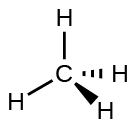
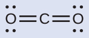
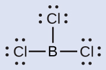
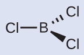
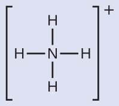
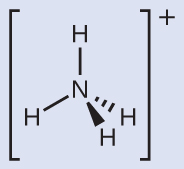
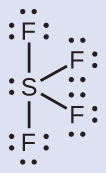
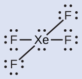

By the end of this section, you will be able to:
* Predict the structures of small molecules using valence shell electron pair repulsion (VSEPR) theory
* Explain the concepts of polar covalent bonds and molecular polarity
* Assess the polarity of a molecule based on its bonding and structure

Thus far, we have used two-dimensional Lewis structures to represent molecules. However, molecular structure is actually three-dimensional, and it is important to be able to describe molecular bonds in terms of their distances, angles, and relative arrangements in space ([\[link\]](#CNX_Chem_07_06_CH2O)). A **bond angle**{: data-type="term"} is the angle between any two bonds that include a common atom, usually measured in degrees. A **bond distance**{: data-type="term"} (or bond length) is the distance between the nuclei of two bonded atoms along the straight line joining the nuclei. Bond distances are measured in Ångstroms (1 Å = 10–10 m) or picometers (1 pm = 10–12 m, 100 pm = 1 Å).

 ![A pair of images are shown. The left image shows a carbon atom with three atoms bonded in a triangular arrangement around it. There are two hydrogen atoms bonded on the left side of the carbon and the angle between them is labeled, &#x201C;118 degrees&#x201D; and, &#x201C;Bond angle.&#x201D; The carbon is also double bonded to an oxygen atom. The double bond is shaded and there is a bracket which labels the bond, &#x201C;Bond length ( angstrom ), ( center to center ),&#x201D; and, &#x201C;1.21 angstrom.&#x201D; The right image shows a ball-and-stick model of the same elements. The hydrogen atoms are white, the carbon atom is black, and the oxygen atom is red.](../resources/CNX_Chem_07_06_CH2O.jpg "Bond distances (lengths) and angles are shown for the formaldehyde molecule, H2CO."){: #CNX_Chem_07_06_CH2O}

# VSEPR Theory

**Valence shell electron-pair repulsion theory (VSEPR theory)**{: data-type="term"} enables us to predict the molecular structure, including approximate bond angles around a central atom, of a molecule from an examination of the number of bonds and lone electron pairs in its Lewis structure. The VSEPR model assumes that electron pairs in the valence shell of a central atom will adopt an arrangement that minimizes repulsions between these electron pairs by maximizing the distance between them. The electrons in the valence shell of a central atom form either bonding pairs of electrons, located primarily between bonded atoms, or lone pairs. The electrostatic repulsion of these electrons is reduced when the various regions of high electron density assume positions as far from each other as possible.

VSEPR theory predicts the arrangement of electron pairs around each central atom and, usually, the correct arrangement of atoms in a molecule. We should understand, however, that the theory only considers electron-pair repulsions. Other interactions, such as nuclear-nuclear repulsions and nuclear-electron attractions, are also involved in the final arrangement that atoms adopt in a particular molecular structure.

As a simple example of VSEPR theory, let us predict the structure of a gaseous BeF2 molecule. The Lewis structure of BeF2 ([\[link\]](#CNX_Chem_07_06_BeF2)) shows only two electron pairs around the central beryllium atom. With two bonds and no lone pairs of electrons on the central atom, the bonds are as far apart as possible, and the electrostatic repulsion between these regions of high electron density is reduced to a minimum when they are on opposite sides of the central atom. The bond angle is 180° ([\[link\]](#CNX_Chem_07_06_BeF2)).

 {: #CNX_Chem_07_06_BeF2}

[\[link\]](#CNX_Chem_07_06_Egeom) illustrates this and other electron-pair geometries that minimize the repulsions among regions of high electron density (bonds and/or lone pairs). Two regions of electron density around a central atom in a molecule form a **linear**{: data-type="term"} geometry; three regions form a **trigonal planar**{: data-type="term"} geometry; four regions form a **tetrahedral**{: data-type="term"} geometry; five regions form a **trigonal bipyramidal**{: data-type="term"} geometry; and six regions form an **octahedral**{: data-type="term"} geometry.

 ![A table with four rows and six columns is shown. The header column contains the phrases, &#x201C;Number of regions,&#x201D; &#x201C;Spatial arrangement,&#x201D; &#x201C;Wedge/dash Notation,&#x201D; and &#x201C;Electron pair Geometry.&#x201D; The first row reads: &#x201C;Two regions of high electron density ( bonds and/or unshared pairs )&#x201D;, &#x201C;Three regions of high electron density ( bonds and/or unshared pairs ),&#x201D; &#x201C;Four regions of high electron density ( bonds and/or unshared pairs ),&#x201D; &#x201C;Five regions of high electron density ( bonds and/or unshared pairs ),&#x201D; and &#x201C;Six regions of high electron density ( bonds and/or unshared pairs ).&#x201D; The second row shows diagrams of orbitals. The first image shows two oval-shaped orbs with an arrow indicating an angle of 180 degrees. The second image shows three oval-shaped orbs with an arrow indicating an angle of 120 degrees. The third image shows four oval-shaped orbs with an arrow indicating an angle of 109.5 degrees. The fourth image shows five oval-shaped orbs with an arrow indicating an angle of 90 and 120 degrees. The fifth image shows six oval-shaped orbs with an arrow indicating an angle of 90 degrees. The third row contains Lewis structures. The first structure shows a beryllium atom single bonded to two hydrogen atoms. The second structure shows a boron atom single bonded to three hydrogen atoms. The third structure shows a carbon atom single bonded to four hydrogen atoms. The fourth structure shows a phosphorus atom single bonded to five fluorine atoms. The fifth structure shows a sulfur atom single bonded to six fluorine atoms. The fourth row contains the phrases &#x201C;Linear; 180 degree angle,&#x201D; Trigonal Planar; all angles 120 degrees,&#x201D; &#x201C;Tetrahedral; all angles 109.5 degrees,&#x201D; &#x201C;Trigonal bipyramidal; angles of 90 degrees and 120 degrees. An attached atom may be equatorial, ( in the plane of the triangle ), or axial, ( above the plane of the triangle ),&#x201D; and &#x201C;Octahedral; 90 degrees or 180 degrees.&#x201D;](../resources/CNX_Chem_07_06_Egeom.jpg "The basic electron-pair geometries predicted by VSEPR theory maximize the space around any region of electron density (bonds or lone pairs)."){: #CNX_Chem_07_06_Egeom}

## Electron-pair Geometry versus Molecular Structure

It is important to note that electron-pair geometry around a central atom is *not* the same thing as its molecular structure. The electron-pair geometries shown in [\[link\]](#CNX_Chem_07_06_Egeom) describe all regions where electrons are located, bonds as well as lone pairs. Molecular structure describes the location of the *atoms*, not the electrons.

We differentiate between these two situations by naming the geometry that includes *all* electron pairs the **electron-pair geometry**{: data-type="term"}. The structure that includes only the placement of the atoms in the molecule is called the **molecular structure**{: data-type="term"}. The electron-pair geometries will be the same as the molecular structures when there are no lone electron pairs around the central atom, but they will be different when there are lone pairs present on the central atom.

For example, the methane molecule, CH4, which is the major component of natural gas, has four bonding pairs of electrons around the central carbon atom; the electron-pair geometry is tetrahedral, as is the molecular structure ([\[link\]](#CNX_Chem_07_06_CH4)). On the other hand, the ammonia molecule, NH3, also has four electron pairs associated with the nitrogen atom, and thus has a tetrahedral electron-pair geometry. One of these regions, however, is a lone pair, which is not included in the molecular structure, and this lone pair influences the shape of the molecule ([\[link\]](#CNX_Chem_07_06_NH3)).

 {: #CNX_Chem_07_06_CH4}

![Three images are shown and labeled, &#x201C;a,&#x201D; &#x201C;b,&#x201D; and &#x201C;c.&#x201D; Image a shows a nitrogen atom single bonded to three hydrogen atoms. There are four oval-shaped orbs that surround each hydrogen and one facing away from the rest of the molecule. These orbs are located in a tetrahedral arrangement. Image b shows a ball-and-stick model of the nitrogen single bonded to the three hydrogen atoms. Image c is the same as image a, but there are four curved, double headed arrows that circle the molecule and are labeled, &#x201C;106.8 degrees.&#x201D;](../resources/CNX_Chem_07_06_NH3.jpg "(a) The electron-pair geometry for the ammonia molecule is tetrahedral with one lone pair and three single bonds. (b) The trigonal pyramidal molecular structure is determined from the electron-pair geometry. (c) The actual bond angles deviate slightly from the idealized angles because the lone pair takes up a larger region of space than do the single bonds, causing the HNH angle to be slightly smaller than 109.5&#xB0;."){: #CNX_Chem_07_06_NH3}

As seen in [\[link\]](#CNX_Chem_07_06_NH3), small distortions from the ideal angles in [\[link\]](#CNX_Chem_07_06_Egeom) can result from differences in repulsion between various regions of electron density. VSEPR theory predicts these distortions by establishing an order of repulsions and an order of the amount of space occupied by different kinds of electron pairs. The order of electron-pair repulsions from greatest to least repulsion is:

<math xmlns="http://www.w3.org/1998/Math/MathML"><mrow><mtext>lone pair-lone pair</mtext><mo>&gt;</mo><mtext>lone pair-bonding pair</mtext><mo>&gt;</mo><mtext>bonding pair-bonding pair</mtext></mrow></math>

This order of repulsions determines the amount of space occupied by different regions of electrons. A lone pair of electrons occupies a larger region of space than the electrons in a triple bond; in turn, electrons in a triple bond occupy more space than those in a double bond, and so on. The order of sizes from largest to smallest is:

<math xmlns="http://www.w3.org/1998/Math/MathML"><mrow><mtext>lone pair</mtext><mo>&gt;</mo><mtext>triple bond</mtext><mo>&gt;</mo><mtext>double bond</mtext><mo>&gt;</mo><mtext>single bond</mtext></mrow></math>

Consider formaldehyde, H2CO, which is used as a preservative for biological and anatomical specimens ([\[link\]](#CNX_Chem_07_06_CH2O)). This molecule has regions of high electron density that consist of two single bonds and one double bond. The basic geometry is trigonal planar with 120° bond angles, but we see that the double bond causes slightly larger angles (121°), and the angle between the single bonds is slightly smaller (118°).

In the ammonia molecule, the three hydrogen atoms attached to the central nitrogen are not arranged in a flat, trigonal planar molecular structure, but rather in a three-dimensional trigonal pyramid ([\[link\]](#CNX_Chem_07_06_NH3)) with the nitrogen atom at the apex and the three hydrogen atoms forming the base. The ideal bond angles in a trigonal pyramid are based on the tetrahedral electron pair geometry. Again, there are slight deviations from the ideal because lone pairs occupy larger regions of space than do bonding electrons. The H–N–H bond angles in NH3 are slightly smaller than the 109.5° angle in a regular tetrahedron ([\[link\]](#CNX_Chem_07_06_Egeom)) because the lone pair-bonding pair repulsion is greater than the bonding pair-bonding pair repulsion ([\[link\]](#CNX_Chem_07_06_NH3)). [\[link\]](#CNX_Chem_07_06_molgeom) illustrates the ideal molecular structures, which are predicted based on the electron-pair geometries for various combinations of lone pairs and bonding pairs.

 ![A table is shown that is comprised of six rows and six columns. The header row reads: &#x201C;Number of Electron Pairs,&#x201D; &#x201C;Electron pair geometries; 0 lone pair,&#x201D; &#x201C;1 lone pair,&#x201D; &#x201C;2 lone pairs,&#x201D; &#x201C;3 lone pairs,&#x201D; and &#x201C;4 lone pairs.&#x201D; The first column contains the numbers 2, 3, 4, 5, and 6. The first space in the second column contains a structure in which the letter E is single bonded to the letter X on each side. The angle of the bonds is labeled with a curved, double headed arrow and the value, &#x201C;180 degrees.&#x201D; The structure is labeled, &#x201C;Linear.&#x201D; The second space in the second column contains a structure in which the letter E is single bonded to the letter X on three sides. The angle between the bonds is labeled with a curved, double headed arrow and the value, &#x201C;120 degrees.&#x201D; The structure is labeled, &#x201C;Trigonal planar.&#x201D; The third space in the second column contains a structure in which the letter E is single bonded to the letter X four times. The angle between the bonds is labeled with a curved, double headed arrow and the value, &#x201C;109 degrees.&#x201D; The structure is labeled, &#x201C;Tetrahedral.&#x201D; The fourth space in the second column contains a structure in which the letter E is single bonded to the letter X on five sides. The angle between the bonds is labeled with a curved, double headed arrow and the values &#x201C;90 and 120 degrees.&#x201D; The structure is labeled, &#x201C;Trigonal bipyramid.&#x201D; The fifth space in the second column contains a structure in which the letter E is single bonded to the letter X on six sides. The angle between the bonds is labeled with a curved, double headed arrow and the value, &#x201C;90 degrees.&#x201D; The structure is labeled, &#x201C;Octahedral.&#x201D; The first space in the third column is empty while the second contains a structure in which the letter E is single bonded to the letter X on each side and has a lone pair of electrons. The angle between the bonds is labeled with a curved, double headed arrow and the value, &#x201C;less than 120 degrees.&#x201D; The structure is labeled, &#x201C;Bent or angular.&#x201D; The third space in the third column contains a structure in which the letter E is single bonded to the letter X three times and to a lone pair of electrons. It is labeled with a curved, double headed arrow and the value, &#x201C;less than 109 degrees.&#x201D; The structure is labeled, &#x201C;Trigonal pyramid.&#x201D; The fourth space in the third column contains a structure in which the letter E is single bonded to the letter X on four sides and has a lone pair of electrons. The bond angle is labeled with a curved, double headed arrow and the values, &#x201C;less than 90 and less than 120 degrees.&#x201D; The structure is labeled, &#x201C;Sawhorse or seesaw.&#x201D; The fifth space in the third column contains a structure in which the letter E is single bonded to the letter X on five sides and has a lone pair of electrons. The bond angle is labeled with a curved, double headed arrow and the value, &#x201C;less than 90 degrees.&#x201D; The structure is labeled, &#x201C;Square pyramidal.&#x201D; The first and second spaces in the fourth column are empty while the third contains a structure in which the letter E is single bonded to the letter X on each side and has two lone pairs of electrons. The bond angle is labeled with a curved, double headed arrow and the value, &#x201C;less than less than 109 degrees.&#x201D; The structure is labeled, &#x201C;Bent or angular.&#x201D; The fourth space in the fourth column contains a structure in which the letter E is single bonded to the letter X three times and to two lone pairs of electrons. The bond angle is labeled with a curved, double headed arrow and the value, &#x201C;less than 90 degrees.&#x201D; The structure is labeled, &#x201C;T - shape.&#x201D; The fifth space in the fourth column contains a structure in which the letter E is single bonded to the letter X on four sides and has two lone pairs of electrons. The bond angle is labeled with a curved, double headed arrow and the value &#x201C;90 degrees.&#x201D; The structure is labeled, &#x201C;Square planar.&#x201D; The first, second and third spaces in the fifth column are empty while the fourth contains a structure in which the letter E is single bonded to the letter X on each side and has three lone pairs of electrons. The bond angle is labeled with a curved, double headed arrow and the value, &#x201C;180 degrees.&#x201D; The structure is labeled, &#x201C;Linear.&#x201D; The fifth space in the fifth column contains a structure in which the letter E is single bonded to the letter X three times and to three lone pairs of electrons. The bond angle is labeled with a curved, double headed arrow and the value, &#x201C;less than 90 degrees.&#x201D; The structure is labeled, &#x201C;T - shape.&#x201D; The first, second, third, and fourth spaces in the sixth column are empty while the fifth contains a structure in which the letter E is single bonded to the letter X on each side and has four lone pairs of electrons. The bond angle is labeled with a curved, double headed arrow and the value &#x201C;180 degrees.&#x201D; The structure is labeled, &#x201C;Linear.&#x201D; All the structures use wedges and dashes to give them three dimensional appearances.](../resources/CNX_Chem_07_06_molgeom.jpg "The molecular structures are identical to the electron-pair geometries when there are no lone pairs present (first column). For a particular number of electron pairs (row), the molecular structures for one or more lone pairs are determined based on modifications of the corresponding electron-pair geometry."){: #CNX_Chem_07_06_molgeom}

According to VSEPR theory, the terminal atom locations (Xs in [\[link\]](#CNX_Chem_07_06_molgeom)) are equivalent within the linear, trigonal planar, and tetrahedral electron-pair geometries (the first three rows of the table). It does not matter which X is replaced with a lone pair because the molecules can be rotated to convert positions. For trigonal bipyramidal electron-pair geometries, however, there are two distinct X positions, as shown in [\[link\]](#CNX_Chem_07_06_Axeq)\: an **axial position**{: data-type="term"} (if we hold a model of a trigonal bipyramid by the two axial positions, we have an axis around which we can rotate the model) and an **equatorial position**{: data-type="term"} (three positions form an equator around the middle of the molecule). As shown in [\[link\]](#CNX_Chem_07_06_molgeom), the axial position is surrounded by bond angles of 90°, whereas the equatorial position has more space available because of the 120° bond angles. In a trigonal bipyramidal electron-pair geometry, lone pairs always occupy equatorial positions because these more spacious positions can more easily accommodate the larger lone pairs.

Theoretically, we can come up with three possible arrangements for the three bonds and two lone pairs for the ClF3 molecule ([\[link\]](#CNX_Chem_07_06_Axeq)). The stable structure is the one that puts the lone pairs in equatorial locations, giving a T-shaped molecular structure.

 ![Four sets of images are shown and labeled, &#x201C;a,&#x201D; &#x201C;b,&#x201D; &#x201C;c,&#x201D; and &#x201C;d.&#x201D; Each image is separated by a dashed vertical line. Image a shows a six-faced, bi-pyramidal structure where the central vertical axis is labeled, &#x201C;Axial,&#x201D; and the horizontal plane is labeled, &#x201C;Equatorial.&#x201D; Image b shows a pair of diagrams in the same shape as image a, but in these diagrams, the left has a chlorine atom in the center while the right has a chlorine atom in the center, two fluorine atoms on the upper and lower ends, and one fluorine in the left horizontal position. Image c shows a pair of diagrams in the same shape as image a, but in these diagrams, the left has a chlorine atom in the center while the right has a chlorine atom in the center and three fluorine atoms in each horizontal position. Image d shows a pair of diagrams in the same shape as image a, but in these diagrams, the left has a chlorine atom in the center while the right has a chlorine atom in the center, two fluorine atoms in the horizontal positions, and one in the axial bottom position.](../resources/CNX_Chem_07_06_Axeq.jpg "(a) In a trigonal bipyramid, the two axial positions are located directly across from one another, whereas the three equatorial positions are located in a triangular arrangement. (b&#x2013;d) The two lone pairs (red lines) in ClF3 have several possible arrangements, but the T-shaped molecular structure (b) is the one actually observed, consistent with the larger lone pairs both occupying equatorial positions."){: #CNX_Chem_07_06_Axeq}

When a central atom has two lone electron pairs and four bonding regions, we have an octahedral electron-pair geometry. The two lone pairs are on opposite sides of the octahedron (180° apart), giving a square planar molecular structure that minimizes lone pair-lone pair repulsions ([\[link\]](#CNX_Chem_07_06_molgeom)).

## Predicting Electron Pair Geometry and Molecular Structure

The following procedure uses VSEPR theory to determine the electron pair geometries and the molecular structures:

1.  Write the Lewis structure of the molecule or polyatomic ion.
2.  Count the number of regions of electron density (lone pairs and bonds) around the central atom. A single, double, or triple bond counts as one region of electron density.
3.  Identify the electron-pair geometry based on the number of regions of electron density: linear, trigonal planar, tetrahedral, trigonal bipyramidal, or octahedral ([\[link\]](#CNX_Chem_07_06_molgeom), first column).
4.  Use the number of lone pairs to determine the molecular structure ([\[link\]](#CNX_Chem_07_06_molgeom)). If more than one arrangement of lone pairs and chemical bonds is possible, choose the one that will minimize repulsions, remembering that lone pairs occupy more space than multiple bonds, which occupy more space than single bonds. In trigonal bipyramidal arrangements, repulsion is minimized when every lone pair is in an equatorial position. In an octahedral arrangement with two lone pairs, repulsion is minimized when the lone pairs are on opposite sides of the central atom.
{: data-number-style="arabic"}

The following examples illustrate the use of VSEPR theory to predict the molecular structure of molecules or ions that have no lone pairs of electrons. In this case, the molecular structure is identical to the electron pair geometry.

Predicting Electron-pair Geometry and Molecular Structure: CO2 and BCl3 Predict the electron-pair geometry and molecular structure for each of the following:

(a) carbon dioxide, CO2, a molecule produced by the combustion of fossil fuels

(b) boron trichloride, BCl3, an important industrial chemical

Solution (a) We write the Lewis structure of CO2 as:

  
This shows us two regions of high electron density around the carbon atom—each double bond counts as one region, and there are no lone pairs on the carbon atom. Using VSEPR theory, we predict that the two regions of electron density arrange themselves on opposite sides of the central atom with a bond angle of 180°. The electron-pair geometry and molecular structure are identical, and CO2 molecules are linear.

(b) We write the Lewis structure of BCl3 as:

  
Thus we see that BCl3 contains three bonds, and there are no lone pairs of electrons on boron. The arrangement of three regions of high electron density gives a trigonal planar electron-pair geometry. The B–Cl bonds lie in a plane with 120° angles between them. BCl3 also has a trigonal planar molecular structure ([\[link\]](#CNX_Chem_07_06_BCl3mol)).

{: #CNX_Chem_07_06_BCl3mol}

The electron-pair geometry and molecular structure of BCl3 are both trigonal planar. Note that the VSEPR geometry indicates the correct bond angles (120°), unlike the Lewis structure shown above.

Check Your Learning Carbonate, <math xmlns="http://www.w3.org/1998/Math/MathML"><mrow><msub><mrow><mtext>CO</mtext></mrow><mn>3</mn></msub><msup><mrow /><mrow><mtext>2−</mtext></mrow></msup><mo>,</mo></mrow></math>

 is a common polyatomic ion found in various materials from eggshells to antacids. What are the electron-pair geometry and molecular structure of this polyatomic ion?

Answer:

The electron-pair geometry is trigonal planar and the molecular structure is trigonal planar. Due to resonance, all three C–O bonds are identical. Whether they are single, double, or an average of the two, each bond counts as one region of electron density.

Predicting Electron-pair Geometry and Molecular Structure: Ammonium Two of the top 50 chemicals produced in the United States, ammonium nitrate and ammonium sulfate, both used as fertilizers, contain the ammonium ion. Predict the electron-pair geometry and molecular structure of the <math xmlns="http://www.w3.org/1998/Math/MathML"><mrow><msub><mrow><mtext>NH</mtext></mrow><mn>4</mn></msub><msup><mrow /><mtext>+</mtext></msup></mrow></math>

 cation.

Solution We write the Lewis structure of <math xmlns="http://www.w3.org/1998/Math/MathML"><mrow><msub><mrow><mtext>NH</mtext></mrow><mn>4</mn></msub><msup><mrow /><mtext>+</mtext></msup></mrow></math>

 as:

 
We can see that <math xmlns="http://www.w3.org/1998/Math/MathML"><mrow><msub><mrow><mtext>NH</mtext></mrow><mn>4</mn></msub><msup><mrow /><mo>+</mo></msup></mrow></math>

 contains four bonds from the nitrogen atom to hydrogen atoms and no lone pairs. We expect the four regions of high electron density to arrange themselves so that they point to the corners of a tetrahedron with the central nitrogen atom in the middle ([\[link\]](#CNX_Chem_07_06_molgeom)). Therefore, the electron pair geometry of <math xmlns="http://www.w3.org/1998/Math/MathML"><mrow><msub><mrow><mtext>NH</mtext></mrow><mn>4</mn></msub><msup><mrow /><mtext>+</mtext></msup></mrow></math>

 is tetrahedral, and the molecular structure is also tetrahedral ([\[link\]](#CNX_Chem_07_06_NH4mol)).

{: #CNX_Chem_07_06_NH4mol}

Check Your Learning Identify a molecule with trigonal bipyramidal molecular structure.

Answer:

Any molecule with five electron pairs around the central atoms including no lone pairs will be trigonal bipyramidal. PF5 is a common example.

The next several examples illustrate the effect of lone pairs of electrons on molecular structure.

Predicting Electron-pair Geometry and Molecular Structure: Lone Pairs on the Central Atom Predict the electron-pair geometry and molecular structure of a water molecule.

Solution The Lewis structure of H2O indicates that there are four regions of high electron density around the oxygen atom: two lone pairs and two chemical bonds:

 
We predict that these four regions are arranged in a tetrahedral fashion ([\[link\]](#CNX_Chem_07_06_H2Omol)), as indicated in [\[link\]](#CNX_Chem_07_06_molgeom). Thus, the electron-pair geometry is tetrahedral and the molecular structure is bent with an angle slightly less than 109.5°. In fact, the bond angle is 104.5°.

 H2O has four regions of electron density around the central atom, so it has a tetrahedral electron-pair geometry. (b) Two of the electron regions are lone pairs, so the molecular structure is bent."){: #CNX_Chem_07_06_H2Omol}

Check Your Learning The hydronium ion, H3O+, forms when acids are dissolved in water. Predict the electron-pair geometry and molecular structure of this cation.

Answer:

electron pair geometry: tetrahedral; molecular structure: trigonal pyramidal

Predicting Electron-pair Geometry and Molecular Structure: SF4 Sulfur tetrafluoride, SF4, is extremely valuable for the preparation of fluorine-containing compounds used as herbicides (i.e., SF4 is used as a fluorinating agent). Predict the electron-pair geometry and molecular structure of a SF4 molecule.

Solution The Lewis structure of SF4 indicates five regions of electron density around the sulfur atom: one lone pair and four bonding pairs:

 
We expect these five regions to adopt a trigonal bipyramidal electron-pair geometry. To minimize lone pair repulsions, the lone pair occupies one of the equatorial positions. The molecular structure ([\[link\]](#CNX_Chem_07_06_SF4mol)) is that of a seesaw ([\[link\]](#CNX_Chem_07_06_molgeom)).

 SF4 has a trigonal bipyramidal arrangement of the five regions of electron density. (b) One of the regions is a lone pair, which results in a seesaw-shaped molecular structure."){: #CNX_Chem_07_06_SF4mol}

Check Your Learning Predict the electron pair geometry and molecular structure for molecules of XeF2.

Answer:

The electron-pair geometry is trigonal bipyramidal. The molecular structure is linear.

Predicting Electron-pair Geometry and Molecular Structure: XeF4 Of all the noble gases, xenon is the most reactive, frequently reacting with elements such as oxygen and fluorine. Predict the electron-pair geometry and molecular structure of the XeF4 molecule.

Solution The Lewis structure of XeF4 indicates six regions of high electron density around the xenon atom: two lone pairs and four bonds:

 
These six regions adopt an octahedral arrangement ([\[link\]](#CNX_Chem_07_06_molgeom)), which is the electron-pair geometry. To minimize repulsions, the lone pairs should be on opposite sides of the central atom ([\[link\]](#CNX_Chem_07_06_XeF4mol)). The five atoms are all in the same plane and have a square planar molecular structure.

 XeF4 adopts an octahedral arrangement with two lone pairs (red lines) and four bonds in the electron-pair geometry. (b) The molecular structure is square planar with the lone pairs directly across from one another."){: #CNX_Chem_07_06_XeF4mol}

Check Your Learning In a certain molecule, the central atom has three lone pairs and two bonds. What will the electron pair geometry and molecular structure be?

Answer:

electron pair geometry: trigonal bipyramidal; molecular structure: linear

## Molecular Structure for Multicenter Molecules

When a molecule or polyatomic ion has only one central atom, the molecular structure completely describes the shape of the molecule. Larger molecules do not have a single central atom, but are connected by a chain of interior atoms that each possess a “local” geometry. The way these local structures are oriented with respect to each other also influences the molecular shape, but such considerations are largely beyond the scope of this introductory discussion. For our purposes, we will only focus on determining the local structures.

Predicting Structure in Multicenter Molecules The Lewis structure for the simplest amino acid, glycine, H2NCH2CO2H, is shown here. Predict the local geometry for the nitrogen atom, the two carbon atoms, and the oxygen atom with a hydrogen atom attached:

 
Solution

 ![A Lewis structure depicts a nitrogen atom with one lone pair of electrons that is single bonded to two hydrogen atoms and a carbon atom. The atoms described are drawn with bonds that indicate a three-dimensional, tetrahedral shape around the nitrogen atom. The carbon is, in turn, single bonded to two hydrogen atoms and another carbon atom, and again, a tetrahedral, three dimensional configuration is indicated by the types of bonds. This second carbon atom is double bonded to an oxygen atom and single bonded to an oxygen that has two lone pairs of electrons and a single bond to a hydrogen atom.](../resources/CNX_Chem_07_06_gly3D_img.jpg)
Consider each central atom independently. The electron-pair geometries:

* nitrogen––four regions of electron density; tetrahedral
* carbon (
  <u data-effect="underline">C</u>
  
  H2)––four regions of electron density; tetrahedral
* carbon (
  <u data-effect="underline">C</u>
  
  O2)—three regions of electron density; trigonal planar
* oxygen (
  <u data-effect="underline">O</u>
  
  H)—four regions of electron density; tetrahedral
{: data-bullet-style="bullet"}

The local structures:

* nitrogen––three bonds, one lone pair; trigonal pyramidal
* carbon (
  <u data-effect="underline">C</u>
  
  H2)—four bonds, no lone pairs; tetrahedral
* carbon (
  <u data-effect="underline">C</u>
  
  O2)—three bonds (double bond counts as one bond), no lone pairs; trigonal planar
* oxygen (
  <u data-effect="underline">O</u>
  
  H)—two bonds, two lone pairs; bent (109°)
{: data-bullet-style="bullet"}

Check Your Learning Another amino acid is alanine, which has the Lewis structure shown here. Predict the electron-pair geometry and local structure of the nitrogen atom, the three carbon atoms, and the oxygen atom with hydrogen attached:

 

Answer:

electron-pair geometries: nitrogen––tetrahedral; carbon (<u data-effect="underline">C</u>

H)—tetrahedral; carbon (<u data-effect="underline">C</u>

H3)—tetrahedral; carbon (<u data-effect="underline">C</u>

O2)—trigonal planar; oxygen (<u data-effect="underline">O</u>

H)—tetrahedral; local structures: nitrogen—trigonal pyramidal; carbon (<u data-effect="underline">C</u>

H)—tetrahedral; carbon (<u data-effect="underline">C</u>

H3)—tetrahedral; carbon (<u data-effect="underline">C</u>

O2)—trigonal planar; oxygen (<u data-effect="underline">O</u>

H)—bent (109°)

 
The [molecular shape simulator][1] lets you build various molecules and practice naming their electron-pair geometries and molecular structures.

Molecular Simulation Using [molecular shape simulator][1] allows us to control whether bond angles and/or lone pairs are displayed by checking or unchecking the boxes under “Options” on the right. We can also use the “Name” checkboxes at bottom-left to display or hide the electron pair geometry (called “electron geometry” in the simulator) and/or molecular structure (called “molecular shape” in the simulator).

Build the molecule HCN in the simulator based on the following Lewis structure:

<math xmlns="http://www.w3.org/1998/Math/MathML"><mrow><mtext>H–C</mtext><mo>≡</mo><mtext>N</mtext></mrow></math>

Click on each bond type or lone pair at right to add that group to the central atom. Once you have the complete molecule, rotate it to examine the predicted molecular structure. What molecular structure is this?

Solution The molecular structure is linear.

Check Your Learning Build a more complex molecule in the simulator. Identify the electron-group geometry, molecular structure, and bond angles. Then try to find a chemical formula that would match the structure you have drawn.

Answer:

Answers will vary. For example, an atom with four single bonds, a double bond, and a lone pair has an octahedral electron-group geometry and a square pyramidal molecular structure. XeOF4 is a molecule that adopts this structure.

# Molecular Polarity and Dipole Moment

As discussed previously, polar covalent bonds connect two atoms with differing electronegativities, leaving one atom with a partial positive charge (δ+) and the other atom with a partial negative charge (δ–), as the electrons are pulled toward the more electronegative atom. This separation of charge gives rise to a **bond dipole moment**{: data-type="term"}. The magnitude of a bond dipole moment is represented by the Greek letter mu (*µ*) and is given by the formula shown here, where Q is the magnitude of the partial charges (determined by the electronegativity difference) and r is the distance between the charges:

<math xmlns="http://www.w3.org/1998/Math/MathML"><mrow><mi fontstyle="italic">μ</mi><mo>=</mo><mtext>Qr</mtext></mrow></math>

This bond moment can be represented as a **vector**{: data-type="term"}, a quantity having both direction and magnitude ([\[link\]](#CNX_Chem_07_06_BondVector)). Dipole vectors are shown as arrows pointing along the bond from the less electronegative atom toward the more electronegative atom. A small plus sign is drawn on the less electronegative end to indicate the partially positive end of the bond. The length of the arrow is proportional to the magnitude of the electronegativity difference between the two atoms.

  There is a small difference in electronegativity between C and H, represented as a short vector. (b) The electronegativity difference between B and F is much larger, so the vector representing the bond moment is much longer."){: #CNX_Chem_07_06_BondVector}

A whole molecule may also have a separation of charge, depending on its molecular structure and the polarity of each of its bonds. If such a charge separation exists, the molecule is said to be a **polar molecule**{: data-type="term"} (or dipole); otherwise the molecule is said to be nonpolar. The **dipole moment**{: data-type="term"} measures the extent of net charge separation in the molecule as a whole. We determine the dipole moment by adding the bond moments in three-dimensional space, taking into account the molecular structure.

For diatomic molecules, there is only one bond, so its bond dipole moment determines the molecular polarity. Homonuclear diatomic molecules such as Br2 and N2 have no difference in electronegativity, so their dipole moment is zero. For heteronuclear molecules such as CO, there is a small dipole moment. For HF, there is a larger dipole moment because there is a larger difference in electronegativity.

When a molecule contains more than one bond, the geometry must be taken into account. If the bonds in a molecule are arranged such that their bond moments cancel (vector sum equals zero), then the molecule is nonpolar. This is the situation in CO2 ([\[link\]](#CNX_Chem_07_06_CO2H2Odip)). Each of the bonds is polar, but the molecule as a whole is nonpolar. From the Lewis structure, and using VSEPR theory, we determine that the CO2 molecule is linear with polar C=O bonds on opposite sides of the carbon atom. The bond moments cancel because they are pointed in opposite directions. In the case of the water molecule ([\[link\]](#CNX_Chem_07_06_CO2H2Odip)), the Lewis structure again shows that there are two bonds to a central atom, and the electronegativity difference again shows that each of these bonds has a nonzero bond moment. In this case, however, the molecular structure is bent because of the lone pairs on O, and the two bond moments do not cancel. Therefore, water does have a net dipole moment and is a polar molecule (dipole).

 ![Two images are shown and labeled, &#x201C;a&#x201D; and &#x201C;b.&#x201D; Image a shows a carbon atom bonded to two oxygen atoms in a ball-and-stick representation. Two arrows face away from the center of the molecule in opposite directions and are drawn horizontally like the molecule. These arrows are labeled, &#x201C;Bond moments,&#x201D; and the image is labeled, &#x201C;Overall dipole moment equals 0.&#x201D; Image b shows an oxygen atom bonded to two hydrogen atoms in a downward-facing v-shaped arrangement. An upward-facing, vertical arrow is drawn below the molecule while two upward and inward facing arrows are drawn above the molecule. The upper arrows are labeled, &#x201C;Bond moments,&#x201D; while the image is labeled, &#x201C;Overall dipole moment.&#x201D;](../resources/CNX_Chem_07_06_CO2H2Odip.jpg "The overall dipole moment of a molecule depends on the individual bond dipole moments and how they are arranged. (a) Each CO bond has a bond dipole moment, but they point in opposite directions so that the net CO2 molecule is nonpolar. (b) In contrast, water is polar because the OH bond moments do not cancel out."){: #CNX_Chem_07_06_CO2H2Odip}

The OCS molecule has a structure similar to CO2, but a sulfur atom has replaced one of the oxygen atoms. To determine if this molecule is polar, we draw the molecular structure. VSEPR theory predicts a linear molecule:

   Although the C–O bond is polar, C and S have the same electronegativity values as shown in [\[link\]](/m51048#CNX_Chem_07_02_ENTable), so there is no C–S dipole. Thus, the two bonds do not have of the same bond dipole moment, and the bond moments do not cancel. Because oxygen is more electronegative than sulfur, the oxygen end of the molecule is the negative end.

Chloromethane, CH3Cl, is another example of a polar molecule. Although the polar C–Cl and C–H bonds are arranged in a tetrahedral geometry, the C–Cl bonds have a larger bond moment than the C–H bond, and the bond moments do not completely cancel each other. All of the dipoles have a downward component in the orientation shown, since carbon is more electronegative than hydrogen and less electronegative than chlorine:

   When we examine the highly symmetrical molecules BF3 (trigonal planar), CH4 (tetrahedral), PF5 (trigonal bipyramidal), and SF6 (octahedral), in which all the polar bonds are identical, the molecules are nonpolar. The bonds in these molecules are arranged such that their dipoles cancel. However, just because a molecule contains identical bonds does not mean that the dipoles will always cancel. Many molecules that have identical bonds and lone pairs on the central atoms have bond dipoles that do not cancel. Examples include H2S and NH3. A hydrogen atom is at the positive end and a nitrogen or sulfur atom is at the negative end of the polar bonds in these molecules:

  ![Two Lewis structures are shown. The left structure shows a sulfur atom with two lone pairs of electrons single bonded to two hydrogen atoms. Near the sulfur is a dipole symbol with a superscripted negative sign. Near each hydrogen is a dipole symbol with a superscripted positive sign. The right structure shows a nitrogen atom with one lone pair of electrons single bonded to three hydrogen atoms. Near the nitrogen is a dipole symbol with a superscripted negative sign. Near each hydrogen is a dipole symbol with a superscripted positive sign.](../resources/CNX_Chem_07_06_SH2NH3_img.jpg) To summarize, to be polar, a molecule must:

1.  Contain at least one polar covalent bond.
2.  Have a molecular structure such that the sum of the vectors of each bond dipole moment does not cancel.
{: data-number-style="arabic"}

## Properties of Polar Molecules

Polar molecules tend to align when placed in an electric field with the positive end of the molecule oriented toward the negative plate and the negative end toward the positive plate ([\[link\]](#CNX_Chem_07_06_Dipolfield)). We can use an electrically charged object to attract polar molecules, but nonpolar molecules are not attracted. Also, polar solvents are better at dissolving polar substances, and nonpolar solvents are better at dissolving nonpolar substances.

 ![Two diagrams are shown and labeled, &#x201C;a&#x201D; and &#x201C;b.&#x201D; Diagram a shows two vertical, black lines. The left line is labeled with a negative sign and the right with a positive sign. There are five molecules in between. The molecules are separate from one another and are composed of a hydrogen atom bonded to a fluorine atom. The fluorine atom is labeled with a dipole symbol and a superscripted negative sign while the hydrogen atom is labeled with a dipole symbol and a superscripted positive sign. The molecules are randomly oriented in the space. The right diagram is also bracketed by two vertical, lines, but this time the line labeled as negative is red and the line labeled as positive is blue. The same molecules are present, but this time they are all facing horizontally, with the hydrogen-end of each molecule facing toward the red line.](../resources/CNX_Chem_07_06_Dipolfield.jpg "(a) Molecules are always randomly distributed in the liquid state in the absence of an electric field. (b) When an electric field is applied, polar molecules like HF will align to the dipoles with the field direction."){: #CNX_Chem_07_06_Dipolfield}

 
The [molecule polarity simulation][2] provides many ways to explore dipole moments of bonds and molecules.

Polarity Simulations Open the [molecule polarity simulation][2] and select the “Three Atoms” tab at the top. This should display a molecule ABC with three electronegativity adjustors. You can display or hide the bond moments, molecular dipoles, and partial charges at the right. Turning on the Electric Field will show whether the molecule moves when exposed to a field, similar to [\[link\]](#CNX_Chem_07_06_Dipolfield).

Use the electronegativity controls to determine how the molecular dipole will look for the starting bent molecule if:

(a) A and C are very electronegative and B is in the middle of the range.

(b) A is very electronegative, and B and C are not.

Solution (a) Molecular dipole moment points immediately between A and C.

(b) Molecular dipole moment points along the A–B bond, toward A.

Check Your Learning Determine the partial charges that will give the largest possible bond dipoles.

Answer:

The largest bond moments will occur with the largest partial charges. The two solutions above represent how unevenly the electrons are shared in the bond. The bond moments will be maximized when the electronegativity difference is greatest. The controls for A and C should be set to one extreme, and B should be set to the opposite extreme. Although the magnitude of the bond moment will not change based on whether B is the most electronegative or the least, the direction of the bond moment will.

# Key Concepts and Summary

VSEPR theory predicts the three-dimensional arrangement of atoms in a molecule. It states that valence electrons will assume an electron-pair geometry that minimizes repulsions between areas of high electron density (bonds and/or lone pairs). Molecular structure, which refers only to the placement of atoms in a molecule and not the electrons, is equivalent to electron-pair geometry only when there are no lone electron pairs around the central atom. A dipole moment measures a separation of charge. For one bond, the bond dipole moment is determined by the difference in electronegativity between the two atoms. For a molecule, the overall dipole moment is determined by both the individual bond moments and how these dipoles are arranged in the molecular structure. Polar molecules (those with an appreciable dipole moment) interact with electric fields, whereas nonpolar molecules do not.

# Chemistry End of Chapter Exercises

Explain why the HOH molecule is bent, whereas the HBeH molecule is linear.

The placement of the two sets of unpaired electrons in water forces the bonds to assume a tetrahedral arrangement, and the resulting HOH molecule is bent. The HBeH molecule (in which Be has only two electrons to bond with the two electrons from the hydrogens) must have the electron pairs as far from one another as possible and is therefore linear.

What feature of a Lewis structure can be used to tell if a molecule’s (or ion’s) electron-pair geometry and molecular structure will be identical?

Explain the difference between electron-pair geometry and molecular structure.

Space must be provided for each pair of electrons whether they are in a bond or are present as lone pairs. Electron-pair geometry considers the placement of all electrons. Molecular structure considers only the bonding-pair geometry.

Why is the H–N–H angle in NH3 smaller than the H–C–H bond angle in CH4? Why is the H–N–H angle in <math xmlns="http://www.w3.org/1998/Math/MathML"><mrow><msub><mrow><mtext>NH</mtext></mrow><mn>4</mn></msub><msup><mrow /><mo>+</mo></msup></mrow></math>

 identical to the H–C–H bond angle in CH4?

Explain how a molecule that contains polar bonds can be nonpolar.

As long as the polar bonds are compensated (for example. two identical atoms are found directly across the central atom from one another), the molecule can be nonpolar.

As a general rule, MXn molecules (where M represents a central atom and X represents terminal atoms; n = 2 – 5) are polar if there is one or more lone pairs of electrons on M. NH3 (M = N, X = H, n = 3) is an example. There are two molecular structures with lone pairs that are exceptions to this rule. What are they?

Predict the electron pair geometry and the molecular structure of each of the following molecules or ions:

(a) SF6

(b) PCl5

(c) BeH2

(d) <math xmlns="http://www.w3.org/1998/Math/MathML"><mrow><msub><mrow><mtext>CH</mtext></mrow><mn>3</mn></msub><msup><mrow /><mo>+</mo></msup></mrow></math>

(a) Both the electron geometry and the molecular structure are octahedral.* * *
{: data-type="newline"}

 (b) Both the electron geometry and the molecular structure are trigonal bipyramid.* * *
{: data-type="newline"}

 (c) Both the electron geometry and the molecular structure are linear.* * *
{: data-type="newline"}

 (d) Both the electron geometry and the molecular structure are trigonal planar.* * *
{: data-type="newline"}

Identify the electron pair geometry and the molecular structure of each of the following molecules or ions:

(a) <math xmlns="http://www.w3.org/1998/Math/MathML"><mrow><msub><mrow><mtext>IF</mtext></mrow><mn>6</mn></msub><msup><mrow /><mo>+</mo></msup></mrow></math>

(b) CF4

(c) BF3

(d) <math xmlns="http://www.w3.org/1998/Math/MathML"><mrow><msub><mrow><mtext>SiF</mtext></mrow><mn>5</mn></msub><msup><mrow /><mtext>−</mtext></msup></mrow></math>

(e) BeCl2

What are the electron-pair geometry and the molecular structure of each of the following molecules or ions?

(a) ClF5

(b) <math xmlns="http://www.w3.org/1998/Math/MathML"><mrow><msub><mrow><mtext>ClO</mtext></mrow><mn>2</mn></msub><msup><mrow /><mtext>−</mtext></msup></mrow></math>

(c) <math xmlns="http://www.w3.org/1998/Math/MathML"><mrow><msub><mrow><mtext>TeCl</mtext></mrow><mn>4</mn></msub><msup><mrow /><mrow><mtext>2−</mtext></mrow></msup></mrow></math>

(d) PCl3

(e) SeF4

(f) <math xmlns="http://www.w3.org/1998/Math/MathML"><mrow><msub><mrow><mtext>PH</mtext></mrow><mn>2</mn></msub><msup><mrow /><mtext>−</mtext></msup></mrow></math>

(a) electron-pair geometry: octahedral, molecular structure: square pyramidal; (b) electron-pair geometry: tetrahedral, molecular structure: bent; (c) electron-pair geometry: octahedral, molecular structure: square planar; (d) electron-pair geometry: tetrahedral, molecular structure: trigonal pyramidal; (e) electron-pair geometry: trigonal bypyramidal, molecular structure: seesaw; (f) electron-pair geometry: tetrahedral, molecular structure: bent (109°)

Predict the electron pair geometry and the molecular structure of each of the following ions:

(a) H3O+

(b) <math xmlns="http://www.w3.org/1998/Math/MathML"><mrow><msub><mrow><mtext>PCl</mtext></mrow><mn>4</mn></msub><msup><mrow /><mtext>−</mtext></msup></mrow></math>

(c) <math xmlns="http://www.w3.org/1998/Math/MathML"><mrow><msub><mrow><mtext>SnCl</mtext></mrow><mn>3</mn></msub><msup><mrow /><mtext>−</mtext></msup></mrow></math>

(d) <math xmlns="http://www.w3.org/1998/Math/MathML"><mrow><msub><mrow><mtext>BrCl</mtext></mrow><mn>4</mn></msub><msup><mrow /><mtext>−</mtext></msup></mrow></math>

(e) ICl3

(f) XeF4

(g) SF2

Identify the electron pair geometry and the molecular structure of each of the following molecules:

(a) ClNO (N is the central atom)

(b) CS2

(c) Cl2CO (C is the central atom)

(d) Cl2SO (S is the central atom)

(e) SO2F2 (S is the central atom)

(f) XeO2F2 (Xe is the central atom)

(g) <math xmlns="http://www.w3.org/1998/Math/MathML"><mrow><msub><mrow><mtext>ClOF</mtext></mrow><mn>2</mn></msub><msup><mrow /><mo>+</mo></msup></mrow></math>

 (Cl is the central atom)

(a) electron-pair geometry: trigonal planar, molecular structure: bent (120°); (b) electron-pair geometry: linear, molecular structure: linear; (c) electron-pair geometry: trigonal planar, molecular structure: trigonal planar; (d) electron-pair geometry: tetrahedral, molecular structure: trigonal pyramidal; (e) electron-pair geometry: tetrahedral, molecular structure: tetrahedral; (f) electron-pair geometry: trigonal bipyramidal, molecular structure: seesaw; (g) electron-pair geometry: tetrahedral, molecular structure: trigonal pyramidal

Predict the electron pair geometry and the molecular structure of each of the following:

(a) IOF5 (I is the central atom)

(b) POCl3 (P is the central atom)

(c) Cl2SeO (Se is the central atom)

(d) ClSO+ (S is the central atom)

(e) F2SO (S is the central atom)

(f) <math xmlns="http://www.w3.org/1998/Math/MathML"><mrow><msub><mtext>NO</mtext><mn>2</mn></msub><msup><mrow /><mtext>−</mtext></msup></mrow></math>

(g) <math xmlns="http://www.w3.org/1998/Math/MathML"><mrow><msub><mtext>SiO</mtext><mn>4</mn></msub><msup><mrow /><mtext>4−</mtext></msup></mrow></math>

Which of the following molecules and ions contain polar bonds? Which of these molecules and ions have dipole moments?

(a) ClF5

(b) <math xmlns="http://www.w3.org/1998/Math/MathML"><mrow><msub><mtext>ClO</mtext><mn>2</mn></msub><msup><mrow /><mtext>−</mtext></msup></mrow></math>

(c) <math xmlns="http://www.w3.org/1998/Math/MathML"><mrow><msub><mtext>TeCl</mtext><mn>4</mn></msub><msup><mrow /><mtext>2−</mtext></msup></mrow></math>

(d) PCl3

(e) SeF4

(f) <math xmlns="http://www.w3.org/1998/Math/MathML"><mrow><msub><mtext>PH</mtext><mn>2</mn></msub><msup><mrow /><mtext>−</mtext></msup></mrow></math>

(g) XeF2

All of these molecules and ions contain polar bonds. Only ClF5, <math xmlns="http://www.w3.org/1998/Math/MathML"><mrow><msub><mtext>ClO</mtext><mn>2</mn></msub><msup><mrow /><mtext>−</mtext></msup><mo>,</mo></mrow></math>

 PCl3, SeF4, and <math xmlns="http://www.w3.org/1998/Math/MathML"><mrow><msub><mtext>PH</mtext><mn>2</mn></msub><msup><mrow /><mtext>−</mtext></msup></mrow></math>

 have dipole moments.

Which of the molecules and ions in [[link]](#fs-idp67177072) contain polar bonds? Which of these molecules and ions have dipole moments?

(a) H3O+

(b) <math xmlns="http://www.w3.org/1998/Math/MathML"><mrow><msub><mtext>PCl</mtext><mn>4</mn></msub><msup><mrow /><mtext>−</mtext></msup></mrow></math>

(c) <math xmlns="http://www.w3.org/1998/Math/MathML"><mrow><msub><mtext>SnCl</mtext><mn>3</mn></msub><msup><mrow /><mtext>−</mtext></msup></mrow></math>

(d) <math xmlns="http://www.w3.org/1998/Math/MathML"><mrow><msub><mtext>BrCl</mtext><mn>4</mn></msub><msup><mrow /><mtext>−</mtext></msup></mrow></math>

(e) ICl3

(f) XeF4

(g) SF2

Which of the following molecules have dipole moments?

(a) CS2

(b) SeS2

(c) CCl2F2

(d) PCl3 (P is the central atom)

(e) ClNO (N is the central atom)

SeS2, CCl2F2, PCl3, and ClNO all have dipole moments.

Identify the molecules with a dipole moment:

(a) SF4

(b) CF4

(c) Cl2CCBr2

(d) CH3Cl

(e) H2CO

The molecule XF3 has a dipole moment. Is X boron or phosphorus?

P

The molecule XCl2 has a dipole moment. Is X beryllium or sulfur?

Is the Cl2BBCl2 molecule polar or nonpolar?

nonpolar

There are three possible structures for PCl2F3 with phosphorus as the central atom. Draw them and discuss how measurements of dipole moments could help distinguish among them.

Describe the molecular structure around the indicated atom or atoms:

(a) the sulfur atom in sulfuric acid, H2SO4 [(HO)2SO2]

(b) the chlorine atom in chloric acid, HClO3 [HOClO2]

(c) the oxygen atom in hydrogen peroxide, HOOH

(d) the nitrogen atom in nitric acid, HNO3 [HONO2]

(e) the oxygen atom in the OH group in nitric acid, HNO3 [HONO2]

(f) the central oxygen atom in the ozone molecule, O3

(g) each of the carbon atoms in propyne, CH3CCH

(h) the carbon atom in Freon, CCl2F2

(i) each of the carbon atoms in allene, H2CCCH2

(a) tetrahedral; (b) trigonal pyramidal; (c) bent (109°); (d) trigonal planar; (e) bent (109°); (f) bent (109°); (g) <u data-effect="underline">C</u>

H3CCH tetrahedral, CH3<u data-effect="underline">CC</u>

H linear; (h) tetrahedral; (i) H2C<u data-effect="underline">C</u>

CH2 linear; H2<u data-effect="underline">C</u>

C<u data-effect="underline">C</u>

H2 trigonal planar

Draw the Lewis structures and predict the shape of each compound or ion:

(a) CO2

(b) <math xmlns="http://www.w3.org/1998/Math/MathML"><mrow><msub><mtext>NO</mtext><mn>2</mn></msub><msup><mrow /><mtext>−</mtext></msup></mrow></math>

(c) SO3

(d) <math xmlns="http://www.w3.org/1998/Math/MathML"><mrow><msub><mtext>SO</mtext><mn>3</mn></msub><msup><mrow /><mtext>2−</mtext></msup></mrow></math>

A molecule with the formula AB2, in which A and B represent different atoms, could have one of three different shapes. Sketch and name the three different shapes that this molecule might have. Give an example of a molecule or ion for each shape.

 * * *
{: data-type="newline"}

  ![Three Lewis diagrams are shown. The first diagram shows the letter A single bonded to the left and right to the letter B. An example, &#x201C;C O subscript 2,&#x201D; and the term, &#x201C;linear,&#x201D; are written beside this diagram. The second diagram shows the letter A with two lone pairs of electrons, single bonded to the left and lower right to the letter B. An example, &#x201C;H subscript 2 O,&#x201D; and the term, &#x201C;bent with an approximately 109 degree angle,&#x201D; are written beside this diagram. The third diagram shows the letter A with one lone electron pair, single bonded to the left and lower right to the letter B. An example, &#x201C;S O subscript 2,&#x201D; and the term, &#x201C;bent with an approximately 120 degree angle,&#x201D; are written beside this diagram.](../resources/CNX_Chem_07_06_Ques23ans_img.jpg)

A molecule with the formula AB3, in which A and B represent different atoms, could have one of three different shapes. Sketch and name the three different shapes that this molecule might have. Give an example of a molecule or ion that has each shape.

Draw the Lewis electron dot structures for these molecules, including resonance structures where appropriate:

(a) <math xmlns="http://www.w3.org/1998/Math/MathML"><mrow><msub><mtext>CS</mtext><mn>3</mn></msub><msup><mrow /><mtext>2−</mtext></msup></mrow></math>

(b) CS2

(c) CS

(d) predict the molecular shapes for <math xmlns="http://www.w3.org/1998/Math/MathML"><mrow><msub><mtext>CS</mtext><mn>3</mn></msub><msup><mrow /><mtext>2−</mtext></msup></mrow></math>

 and CS2 and explain how you arrived at your predictions

(a)* * *
{: data-type="newline"}

  ![The figure shows three Lewis structures that are each surrounded by brackets and have a superscripted 2 negative sign. They are written with a double-headed arrow in between each diagram. The first of this trio has a carbon atom single bonded to two sulfur atoms, each of which has thee lone pairs of electrons, and double bonded to a third sulfur atom with two lone pairs of electrons. The second and third diagrams have the same atoms present, but each time the double bond moves between a different carbon and sulfur pair. The lone electron pairs also shift to correspond with the bond changes.](../resources/CNX_Chem_07_06_CS3a_img.jpg);* * *
{: data-type="newline"}

 (b)* * *
{: data-type="newline"}

  ;* * *
{: data-type="newline"}

 (c)* * *
{: data-type="newline"}

  ;* * *
{: data-type="newline"}

 (d) <math xmlns="http://www.w3.org/1998/Math/MathML"><mrow><msub><mtext>CS</mtext><mn>3</mn></msub><msup><mrow /><mtext>2−</mtext></msup></mrow></math>

 includes three regions of electron density (all are bonds with no lone pairs); the shape is trigonal planar; CS2 has only two regions of electron density (all bonds with no lone pairs); the shape is linear

What is the molecular structure of the stable form of FNO2? (N is the central atom.)

A compound with a molar mass of about 42 g/mol contains 85.7% carbon and 14.3% hydrogen. What is its molecular structure?

The Lewis structure is made from three units, but the atoms must be rearranged:* * *
{: data-type="newline"}

  

Use the [simulation][2] to perform the following exercises for a two-atom molecule:

(a) Adjust the electronegativity value so the bond dipole is pointing toward B. Then determine what the electronegativity values must be to switch the dipole so that it points toward A.

(b) With a partial positive charge on A, turn on the electric field and describe what happens.

(c) With a small partial negative charge on A, turn on the electric field and describe what happens.

(d) Reset all, and then with a large partial negative charge on A, turn on the electric field and describe what happens.

Use the [simulation][2] to perform the following exercises for a real molecule. You may need to rotate the molecules in three dimensions to see certain dipoles.

(a) Sketch the bond dipoles and molecular dipole (if any) for O3. Explain your observations.

(b) Look at the bond dipoles for NH3. Use these dipoles to predict whether N or H is more electronegative.

(c) Predict whether there should be a molecular dipole for NH3 and, if so, in which direction it will point. Check the molecular dipole box to test your hypothesis.

The molecular dipole points away from the hydrogen atoms.

Use the [Molecule Shape simulator][1] to build a molecule. Starting with the central atom, click on the double bond to add one double bond. Then add one single bond and one lone pair. Rotate the molecule to observe the complete geometry. Name the electron group geometry and molecular structure and predict the bond angle. Then click the check boxes at the bottom and right of the simulator to check your answers.

Use the [Molecule Shape simulator][1] to explore real molecules. On the Real Molecules tab, select H2O. Switch between the “real” and “model” modes. Explain the difference observed.

The structures are very similar. In the model mode, each electron group occupies the same amount of space, so the bond angle is shown as 109.5°. In the “real” mode, the lone pairs are larger, causing the hydrogens to be compressed. This leads to the smaller angle of 104.5°.

Use the [Molecule Shape simulator][1] to explore real molecules. On the Real Molecules tab, select “model” mode and S2O. What is the model bond angle? Explain whether the “real” bond angle should be larger or smaller than the ideal model angle.

[1]: http://openstaxcollege.org/l/16MolecShape
[2]: http://openstaxcollege.org/l/16MolecPolarity
