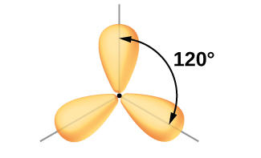
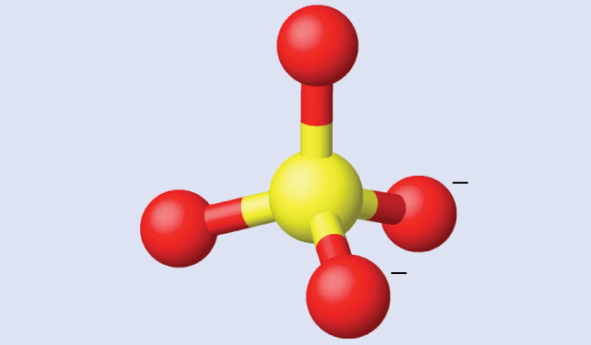
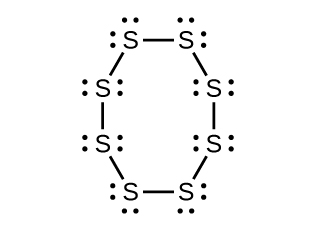
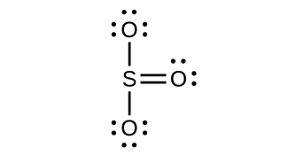
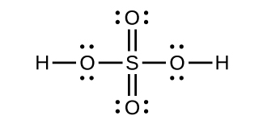

By the end of this section, you will be able to:
* Explain the concept of atomic orbital hybridization
* Determine the hybrid orbitals associated with various molecular geometries

Thinking in terms of overlapping atomic orbitals is one way for us to explain how chemical bonds form in diatomic molecules. However, to understand how molecules with more than two atoms form stable bonds, we require a more detailed model. As an example, let us consider the water molecule, in which we have one oxygen atom bonding to two hydrogen atoms. Oxygen has the electron configuration 1*s*22*s*22*p*4, with two unpaired electrons (one in each of the two 2*p* orbitals). Valence bond theory would predict that the two O–H bonds form from the overlap of these two 2*p* orbitals with the 1*s* orbitals of the hydrogen atoms. If this were the case, the bond angle would be 90°, as shown in [\[link\]](#CNX_Chem_08_02_H2Ovb), because *p* orbitals are perpendicular to each other. Experimental evidence shows that the bond angle is 104.5°, not 90°. The prediction of the valence bond theory model does not match the real-world observations of a water molecule; a different model is needed.

  with the 1s orbitals of two hydrogen atoms (blue) would produce a bond angle of 90&#xB0;. This is not consistent with experimental evidence.1"){: #CNX_Chem_08_02_H2Ovb}

Quantum-mechanical calculations suggest why the observed bond angles in H2O differ from those predicted by the overlap of the 1*s* orbital of the hydrogen atoms with the 2*p* orbitals of the oxygen atom. The mathematical expression known as the wave function, *ψ*, contains information about each orbital and the wavelike properties of electrons in an isolated atom. When atoms are bound together in a molecule, the wave functions combine to produce new mathematical descriptions that have different shapes. This process of combining the wave functions for atomic orbitals is called **hybridization**{: data-type="term"} and is mathematically accomplished by the *linear combination of atomic orbitals*, LCAO, (a technique that we will encounter again later). The new orbitals that result are called **hybrid orbitals**{: data-type="term"}. The valence orbitals in an *isolated* oxygen atom are a 2*s* orbital and three 2*p* orbitals. The valence orbitals in an oxygen atom in a water molecule differ; they consist of four equivalent hybrid orbitals that point approximately toward the corners of a tetrahedron ([\[link\]](#CNX_Chem_08_02_H2Otet)). Consequently, the overlap of the O and H orbitals should result in a tetrahedral bond angle (109.5°). The observed angle of 104.5° is experimental evidence for which quantum-mechanical calculations give a useful explanation: Valence bond theory must include a hybridization component to give accurate predictions.

  A water molecule has four regions of electron density, so VSEPR theory predicts a tetrahedral arrangement of hybrid orbitals. (b) Two of the hybrid orbitals on oxygen contain lone pairs, and the other two overlap with the 1s orbitals of hydrogen atoms to form the O&#x2013;H bonds in H2O. This description is more consistent with the experimental structure."){: #CNX_Chem_08_02_H2Otet}

The following ideas are important in understanding hybridization:

1.  Hybrid orbitals do not exist in isolated atoms. They are formed only in covalently bonded atoms.
2.  Hybrid orbitals have shapes and orientations that are very different from those of the atomic orbitals in isolated atoms.
3.  A set of hybrid orbitals is generated by combining atomic orbitals. The number of hybrid orbitals in a set is equal to the number of atomic orbitals that were combined to produce the set.
4.  All orbitals in a set of hybrid orbitals are equivalent in shape and energy.
5.  The type of hybrid orbitals formed in a bonded atom depends on its electron-pair geometry as predicted by the VSEPR theory.
6.  Hybrid orbitals overlap to form σ bonds. Unhybridized orbitals overlap to form π bonds.
{: data-number-style="arabic"}

In the following sections, we shall discuss the common types of hybrid orbitals.

# *sp* Hybridization

The beryllium atom in a gaseous BeCl2 molecule is an example of a central atom with no lone pairs of electrons in a linear arrangement of three atoms. There are two regions of valence electron density in the BeCl2 molecule that correspond to the two covalent Be–Cl bonds. To accommodate these two electron domains, two of the Be atom’s four valence orbitals will mix to yield two hybrid orbitals. This hybridization process involves mixing of the valence *s* orbital with one of the valence *p* orbitals to yield two equivalent ***sp* hybrid orbitals**{: data-type="term"} that are oriented in a linear geometry ([\[link\]](#CNX_Chem_08_02_spGeom)). In this figure, the set of *sp* orbitals appears similar in shape to the original *p* orbital, but there is an important difference. The number of atomic orbitals combined always equals the number of hybrid orbitals formed. The *p* orbital is one orbital that can hold up to two electrons. The *sp* set is two equivalent orbitals that point 180° from each other. The two electrons that were originally in the *s* orbital are now distributed to the two *sp* orbitals, which are half filled. In gaseous BeCl2, these half-filled hybrid orbitals will overlap with orbitals from the chlorine atoms to form two identical σ bonds.

 ![A series of three diagrams connected by a right-facing arrow that is labeled, &#x201C;Hybridization,&#x201D; and a downward-facing arrow labeled, &#x201C;Gives a linear arrangement,&#x201D; are shown. The first diagram shows a blue spherical orbital and a red, peanut-shaped orbital, each placed on an X, Y, Z axis system. The second diagram shows the same two orbitals, but they are now purple and have one enlarged lobe and one smaller lobe. Each lies along the x-axis in the drawing. The third diagram shows the same two orbitals, but their smaller lobes now overlap along the x-axis while their larger lobes are located at and labeled as &#x201C;180 degrees&#x201D; from one another.](../resources/CNX_Chem_08_02_spGeom.jpg "Hybridization of an s orbital (blue) and a p orbital (red) of the same atom produces two sp hybrid orbitals (purple). Each hybrid orbital is oriented primarily in just one direction. Note that each sp orbital contains one lobe that is significantly larger than the other. The set of two sp orbitals are oriented at 180&#xB0;, which is consistent with the geometry for two domains."){: #CNX_Chem_08_02_spGeom}

We illustrate the electronic differences in an isolated Be atom and in the bonded Be atom in the orbital energy-level diagram in [\[link\]](#CNX_Chem_08_02_spDiag). These diagrams represent each orbital by a horizontal line (indicating its energy) and each electron by an arrow. Energy increases toward the top of the diagram. We use one upward arrow to indicate one electron in an orbital and two arrows (up and down) to indicate two electrons of opposite spin.

 ![A diagram is shown in two parts, connected by a right facing arrow labeled, &#x201C;Hybridization.&#x201D; The left diagram shows an up-facing arrow labeled, &#x201C;E.&#x201D; To the lower right of the arrow is a short, horizontal line labeled, &#x201C;2 s,&#x201D; that has two vertical half-arrows facing up and down on it. To the upper right of the arrow are a series of three short, horizontal lines labeled, &#x201C;2 p.&#x201D; Above these two sets of lines is the phrase, &#x201C;Orbitals in an isolated B e atom.&#x201D; The right side of the diagram shows two short, horizontal lines placed halfway up the space and each labeled, &#x201C;s p.&#x201D; An upward-facing half arrow is drawn vertically on each line. Above these lines are two other short, horizontal lines, each labeled, &#x201C;2 p.&#x201D; Above these two sets of lines is the phrase, &#x201C;Orbitals in the s p hybridized B e in B e C l subscript 2.&#x201D;](../resources/CNX_Chem_08_02_spDiag.jpg "This orbital energy-level diagram shows the sp hybridized orbitals on Be in the linear BeCl2 molecule. Each of the two sp hybrid orbitals holds one electron and is thus half filled and available for bonding via overlap with a Cl 3p orbital."){: #CNX_Chem_08_02_spDiag}

When atomic orbitals hybridize, the valence electrons occupy the newly created orbitals. The Be atom had two valence electrons, so each of the *sp* orbitals gets one of these electrons. Each of these electrons pairs up with the unpaired electron on a chlorine atom when a hybrid orbital and a chlorine orbital overlap during the formation of the Be–Cl bonds.

Any central atom surrounded by just two regions of valence electron density in a molecule will exhibit *sp* hybridization. Other examples include the mercury atom in the linear HgCl2 molecule, the zinc atom in Zn(CH3)2, which contains a linear C–Zn–C arrangement, and the carbon atoms in HCCH and CO2.

  
Check out the University of Wisconsin-Oshkosh [website][1] to learn about visualizing hybrid orbitals in three dimensions.

# *sp*2 Hybridization

The valence orbitals of a central atom surrounded by three regions of electron density consist of a set of three ***sp*2 hybrid orbitals**{: data-type="term"} and one unhybridized *p* orbital. This arrangement results from *sp*2 hybridization, the mixing of one *s* orbital and two *p* orbitals to produce three identical hybrid orbitals oriented in a trigonal planar geometry ([\[link\]](#CNX_Chem_08_02_sp2Geom)).

 ![A series of three diagrams connected by a right-facing arrow that is labeled, &#x201C;Hybridization,&#x201D; and a downward-facing arrow labeled, &#x201C;Gives a trigonal planar arrangement,&#x201D; are shown. The first diagram shows a blue spherical orbital and two red, peanut-shaped orbitals, each placed on an X, Y, Z axis system. The two red orbitals are located on the x and z axes, respectively. The second diagram shows the same three orbitals, but they are now purple and have one enlarged lobe and one smaller lobe. Each lies in a different axis in the drawing. The third diagram shows the same three orbitals, but their smaller lobes now overlap while their larger lobes are located at and labeled as &#x201C;120 degrees&#x201D; from one another.](../resources/CNX_Chem_08_02_sp2Geom.jpg "The hybridization of an s orbital (blue) and two p orbitals (red) produces three equivalent sp2 hybridized orbitals (purple) oriented at 120&#xB0; with respect to each other. The remaining unhybridized p orbital is not shown here, but is located along the z axis."){: #CNX_Chem_08_02_sp2Geom}

Although quantum mechanics yields the “plump” orbital lobes as depicted in [\[link\]](#CNX_Chem_08_02_sp2Geom), sometimes for clarity these orbitals are drawn thinner and without the minor lobes, as in [\[link\]](#CNX_Chem_08_02_sp2Conv), to avoid obscuring other features of a given illustration. We will use these “thinner” representations whenever the true view is too crowded to easily visualize.

 {: #CNX_Chem_08_02_sp2Conv}

The observed structure of the borane molecule, BH3, suggests *sp*2 hybridization for boron in this compound. The molecule is trigonal planar, and the boron atom is involved in three bonds to hydrogen atoms ([\[link\]](#CNX_Chem_08_02_BH3)). We can illustrate the comparison of orbitals and electron distribution in an isolated boron atom and in the bonded atom in BH3 as shown in the orbital energy level diagram in [\[link\]](#CNX_Chem_08_02_BH3Diag). We redistribute the three valence electrons of the boron atom in the three *sp*2 hybrid orbitals, and each boron electron pairs with a hydrogen electron when B–H bonds form.

 {: #CNX_Chem_08_02_BH3}

![A diagram is shown in two parts, connected by a right facing arrow labeled, &#x201C;Hybridization.&#x201D; The left diagram shows an up-facing arrow labeled &#x201C;E.&#x201D; To the lower right of the arrow is a short, horizontal line labeled, &#x201C;2 s,&#x201D; that has two vertical half-arrows facing up and down on it. To the upper right of the arrow are a series of three short, horizontal lines labeled, &#x201C;2 p.&#x201D; Above both sets of these lines is the phrase, &#x201C;Orbitals in an isolated B atom.&#x201D; One of the lines has a vertical, up-facing arrow drawn on it. The right side of the diagram shows three short, horizontal lines placed halfway up the space and each labeled, &#x201C;s p superscript 2.&#x201D; An upward-facing half arrow is drawn vertically on each line. Above these lines is one other short, horizontal line, labeled, &#x201C;2 p.&#x201D; Above both sets of lines is the phrase, &#x201C;Orbitals in the s p superscript 2 hybridized B atom in B H subscript 3.&#x201D;](../resources/CNX_Chem_08_02_BH3Diag.jpg "In an isolated B atom, there are one 2s and three 2p valence orbitals. When boron is in a molecule with three regions of electron density, three of the orbitals hybridize and create a set of three sp2 orbitals and one unhybridized 2p orbital. The three half-filled hybrid orbitals each overlap with an orbital from a hydrogen atom to form three &#x3C3; bonds in BH3."){: #CNX_Chem_08_02_BH3Diag}

Any central atom surrounded by three regions of electron density will exhibit *sp*2 hybridization. This includes molecules with a lone pair on the central atom, such as ClNO ([\[link\]](#CNX_Chem_08_02_sp2Ex)), or molecules with two single bonds and a double bond connected to the central atom, as in formaldehyde, CH2O, and ethene, H2CCH2.

 ![Three Lewis structures are shown. The left-hand structure shows a chlorine atom surrounded by three lone pairs of electrons single bonded to a nitrogen atom with one lone pair of electrons and double bonded to an oxygen atom with two lone pairs of electrons. The middle structure shows a carbon atom single bonded to two hydrogen atoms and double bonded to an oxygen atom that has two lone pairs of electrons. The right-hand structure shows two carbon atoms, double bonded to one another and each single bonded to two hydrogen atoms.](../resources/CNX_Chem_08_02_sp2Ex.jpg "The central atom(s) in each of the structures shown contain three regions of electron density and are sp2 hybridized. As we know from the discussion of VSEPR theory, a region of electron density contains all of the electrons that point in one direction. A lone pair, an unpaired electron, a single bond, or a multiple bond would each count as one region of electron density."){: #CNX_Chem_08_02_sp2Ex}

# *sp*3 Hybridization

The valence orbitals of an atom surrounded by a tetrahedral arrangement of bonding pairs and lone pairs consist of a set of four ***sp*3 hybrid orbitals**{: data-type="term"}. The hybrids result from the mixing of one *s* orbital and all three *p* orbitals that produces four identical *sp*3 hybrid orbitals ([\[link\]](#CNX_Chem_08_02_sp3Geom)). Each of these hybrid orbitals points toward a different corner of a tetrahedron.

 ![A series of three diagrams connected by a right-facing arrow that is labeled, &#x201C;Hybridization,&#x201D; and a downward-facing arrow labeled, &#x201C;Gives a tetrahedral arrangement,&#x201D; are shown. The first diagram shows a blue spherical orbital and three red, peanut-shaped orbitals, each placed on an x, y, z axis system. The three red orbitals are located on the x , y and z axes, respectively. The second diagram shows the same four orbitals, but they are now purple and have one enlarged lobe and one smaller lobe. Each lies in a different axis in the drawing. The third diagram shows the same four orbitals, but their smaller lobes now overlap to form a tetrahedral structure.](../resources/CNX_Chem_08_02_sp3Geom.jpg "The hybridization of an s orbital (blue) and three p orbitals (red) produces four equivalent sp3 hybridized orbitals (purple) oriented at 109.5&#xB0; with respect to each other."){: #CNX_Chem_08_02_sp3Geom}

A molecule of methane, CH4, consists of a carbon atom surrounded by four hydrogen atoms at the corners of a tetrahedron. The carbon atom in methane exhibits *sp*3 hybridization. We illustrate the orbitals and electron distribution in an isolated carbon atom and in the bonded atom in CH4 in [\[link\]](#CNX_Chem_08_02_sp3Diag). The four valence electrons of the carbon atom are distributed equally in the hybrid orbitals, and each carbon electron pairs with a hydrogen electron when the C–H bonds form.

 ![A diagram is shown in two parts, connected by a right facing arrow labeled, &#x201C;Hybridization.&#x201D; The left diagram shows an up-facing arrow labeled &#x201C;E.&#x201D; To the lower right of the arrow is a short, horizontal line labeled, &#x201C;2 s,&#x201D; that has two vertical half-arrows facing up and down on it. To the upper right of the arrow are a series of three short, horizontal lines labeled, &#x201C;2 p.&#x201D; Two of the lines have a vertical, up-facing arrow drawn on them. Above both sets of lines is the phrase, &#x201C;Orbitals in an isolated C atom.&#x201D; The right side of the diagram shows four short, horizontal lines placed halfway up the space and each labeled, &#x201C;s p superscript 3.&#x201D; An upward-facing half arrow is drawn vertically on each line. Above these lines is the phrase, &#x201C;Orbitals in the s p superscript 3 hybridized C atom in C H subscript 4.&#x201D;](../resources/CNX_Chem_08_02_sp3Diag.jpg "The four valence atomic orbitals from an isolated carbon atom all hybridize when the carbon bonds in a molecule like CH4 with four regions of electron density. This creates four equivalent sp3 hybridized orbitals. Overlap of each of the hybrid orbitals with a hydrogen orbital creates a C&#x2013;H &#x3C3; bond."){: #CNX_Chem_08_02_sp3Diag}

In a methane molecule, the 1*s* orbital of each of the four hydrogen atoms overlaps with one of the four *sp*3 orbitals of the carbon atom to form a sigma (σ) bond. This results in the formation of four strong, equivalent covalent bonds between the carbon atom and each of the hydrogen atoms to produce the methane molecule, CH4.

The structure of ethane, C2H6, is similar to that of methane in that each carbon in ethane has four neighboring atoms arranged at the corners of a tetrahedron—three hydrogen atoms and one carbon atom ([\[link\]](#CNX_Chem_08_02_ethane)). However, in ethane an *sp*3 orbital of one carbon atom overlaps end to end with an *sp*3 orbital of a second carbon atom to form a σ bond between the two carbon atoms. Each of the remaining *sp*3 hybrid orbitals overlaps with an *s* orbital of a hydrogen atom to form carbon–hydrogen σ bonds. The structure and overall outline of the bonding orbitals of ethane are shown in [\[link\]](#CNX_Chem_08_02_ethane). The orientation of the two CH3 groups is not fixed relative to each other. Experimental evidence shows that rotation around σ bonds occurs easily.

  In the ethane molecule, C2H6, each carbon has four sp3 orbitals. (b) These four orbitals overlap to form seven &#x3C3; bonds."){: #CNX_Chem_08_02_ethane}

An *sp*3 hybrid orbital can also hold a lone pair of electrons. For example, the nitrogen atom in ammonia is surrounded by three bonding pairs and a lone pair of electrons directed to the four corners of a tetrahedron. The nitrogen atom is *sp*3 hybridized with one hybrid orbital occupied by the lone pair.

The molecular structure of water is consistent with a tetrahedral arrangement of two lone pairs and two bonding pairs of electrons. Thus we say that the oxygen atom is *sp*3 hybridized, with two of the hybrid orbitals occupied by lone pairs and two by bonding pairs. Since lone pairs occupy more space than bonding pairs, structures that contain lone pairs have bond angles slightly distorted from the ideal. Perfect tetrahedra have angles of 109.5°, but the observed angles in ammonia (107.3°) and water (104.5°) are slightly smaller. Other examples of *sp*3 hybridization include CCl4, PCl3, and NCl3.

# *sp*3*d* and *sp*3*d*2 Hybridization

To describe the five bonding orbitals in a trigonal bipyramidal arrangement, we must use five of the valence shell atomic orbitals (the *s* orbital, the three *p* orbitals, and one of the *d* orbitals), which gives five ***sp*3*d* hybrid orbitals**{: data-type="term"}. With an octahedral arrangement of six hybrid orbitals, we must use six valence shell atomic orbitals (the *s* orbital, the three *p* orbitals, and two of the *d* orbitals in its valence shell), which gives six ***sp*3*d*2 hybrid orbitals**{: data-type="term"}. These hybridizations are only possible for atoms that have *d* orbitals in their valence subshells (that is, not those in the first or second period).

In a molecule of phosphorus pentachloride, PCl5, there are five P–Cl bonds (thus five pairs of valence electrons around the phosphorus atom) directed toward the corners of a trigonal bipyramid. We use the 3*s* orbital, the three 3*p* orbitals, and one of the 3*d* orbitals to form the set of five *sp*3*d* hybrid orbitals ([\[link\]](#CNX_Chem_08_02_sp3d)) that are involved in the P–Cl bonds. Other atoms that exhibit *sp*3*d* hybridization include the sulfur atom in SF4 and the chlorine atoms in ClF3 and in <math xmlns="http://www.w3.org/1998/Math/MathML"><mrow><msub><mtext>ClF</mtext><mn>4</mn></msub><msup><mrow /><mtext>+</mtext></msup><mo>.</mo></mrow></math>

 (The electrons on fluorine atoms are omitted for clarity.)

 ![Three Lewis structures are shown along with designations of molecular shape. The left image shows a sulfur atom singly bonded to four fluorine atoms. The sulfur atom has one lone pair of electrons while each fluorine has three. Two fluorine atoms are drawn vertically up and down from the sulfur while the other two are shown going into and out of the page. The second structure shows one chlorine atom singly bonded to three fluorine atoms. The chlorine has two lone pairs of electrons while each fluorine has three. Two fluorine atoms are drawn vertically up and down from the sulfur while the other is shown horizontally. The right structure shows a chlorine atom singly bonded to four fluorine atoms. The chlorine atom has one lone pair of electrons and a superscript plus sign, while each fluorine has three lone pairs of electrons. Two fluorine atoms are drawn vertically up and down from the sulfur while the other two are shown going into and out of the page.](../resources/CNX_Chem_08_02_sp3d_img.jpg "The three compounds pictured exhibit sp3d hybridization in the central atom and a trigonal bipyramid form. SF4 and ClF4+ have one lone pair of electrons on the central atom, and ClF3 has two lone pairs giving it the T-shape shown."){: #CNX_Chem_08_02_sp3d_img}

 The five regions of electron density around phosphorus in PCl5 require five hybrid sp3d orbitals. (b) These orbitals combine to form a trigonal bipyramidal structure with each large lobe of the hybrid orbital pointing at a vertex. As before, there are also small lobes pointing in the opposite direction for each orbital (not shown for clarity)."){: #CNX_Chem_08_02_sp3d}

The sulfur atom in sulfur hexafluoride, SF6, exhibits *sp*3*d*2 hybridization. A molecule of sulfur hexafluoride has six bonding pairs of electrons connecting six fluorine atoms to a single sulfur atom. There are no lone pairs of electrons on the central atom. To bond six fluorine atoms, the 3*s* orbital, the three 3*p* orbitals, and two of the 3*d* orbitals form six equivalent *sp*3*d*2 hybrid orbitals, each directed toward a different corner of an octahedron. Other atoms that exhibit *sp*3*d*2 hybridization include the phosphorus atom in <math xmlns="http://www.w3.org/1998/Math/MathML"><mrow><msub><mtext>PCl</mtext><mn>6</mn></msub><msup><mrow /><mtext>−</mtext></msup><mo>,</mo></mrow></math>

 the iodine atom in the interhalogens <math xmlns="http://www.w3.org/1998/Math/MathML"><mrow><msub><mtext>IF</mtext><mn>6</mn></msub><msup><mrow /><mtext>+</mtext></msup><mo>,</mo></mrow></math>

 IF5, <math xmlns="http://www.w3.org/1998/Math/MathML"><mrow><msub><mtext>ICl</mtext><mn>4</mn></msub><msup><mrow /><mtext>−</mtext></msup><mo>,</mo></mrow></math>

 <math xmlns="http://www.w3.org/1998/Math/MathML"><mrow><msub><mtext>IF</mtext><mn>4</mn></msub><msup><mrow /><mtext>−</mtext></msup></mrow></math>

 and the xenon atom in XeF4.

  Sulfur hexafluoride, SF6, has an octahedral structure that requires sp3d2 hybridization. (b) The six sp3d2 orbitals form an octahedral structure around sulfur. Again, the minor lobe of each orbital is not shown for clarity."){: #CNX_Chem_08_02_SF6}

# Assignment of Hybrid Orbitals to Central Atoms

The hybridization of an atom is determined based on the number of regions of electron density that surround it. The geometrical arrangements characteristic of the various sets of hybrid orbitals are shown in [\[link\]](#CNX_Chem_08_02_HybrdOrbit). These arrangements are identical to those of the electron-pair geometries predicted by VSEPR theory. VSEPR theory predicts the shapes of molecules, and hybrid orbital theory provides an explanation for how those shapes are formed. To find the hybridization of a central atom, we can use the following guidelines:

1.  Determine the Lewis structure of the molecule.
2.  Determine the number of regions of electron density around an atom using VSEPR theory, in which single bonds, multiple bonds, radicals, and lone pairs each count as one region.
3.  Assign the set of hybridized orbitals from [\[link\]](#CNX_Chem_08_02_HybrdOrbit) that corresponds to this geometry.
{: data-number-style="arabic"}

 ![A table is shown that is composed of five columns and six rows. The header row contains the phrases, &#x201C;Regions of electron density,&#x201D; &#x201C;Arrangement,&#x201D; (which has two columns below it), and &#x201C;Hybridization,&#x201D; (which has two columns below it). The first column contains the numbers &#x201C;2,&#x201D; &#x201C;3,&#x201D; &#x201C;4,&#x201D; &#x201C;5,&#x201D; and &#x201C;6.&#x201D; The second column contains images of a line, a triangle, a three sided pyramid, a trigonal bipyramid, and an eight-faced ocatahedron. The third column contains the terms, &#x201C;Linear,&#x201D; &#x201C;Trigonal planar,&#x201D; &#x201C;Tetrahedral,&#x201D; &#x201C;Trigonal bipyramidal,&#x201D; and &#x201C;Octahedral.&#x201D; The fourth column contains the terms &#x201C;s p,&#x201D; &#x201C;s p superscript 2,&#x201D; &#x201C;s p superscript 3,&#x201D; &#x201C;s p superscript 3 d,&#x201D; and &#x201C;s p superscript 3 d superscript 2.&#x201D; The last column contains drawings of the molecules beginning with a peanut-shaped structure marked with an angle of &#x201C;180 degrees.&#x201D; The second structure is made up of three equal-sized, rounded structures connected at one point with an angle of &#x201C;120 degrees,&#x201D; while the third structure is a three-dimensional arrangement of four equal-sized, rounded structures labeled as &#x201C;109.5 degrees.&#x201D; The fourth structure is made up of five equal-sized, rounded structures connected at &#x201C;120 and 90 degrees,&#x201D; while the fifth structure has six equal-sized, rounded structures connected at &#x201C;90 degrees.&#x201D;](../resources/CNX_Chem_08_02_HybrdOrbit.jpg "The shapes of hybridized orbital sets are consistent with the electron-pair geometries. For example, an atom surrounded by three regions of electron density is sp2 hybridized, and the three sp2 orbitals are arranged in a trigonal planar fashion."){: #CNX_Chem_08_02_HybrdOrbit}

It is important to remember that hybridization was devised to rationalize experimentally observed molecular geometries. The model works well for molecules containing small central atoms, in which the valence electron pairs are close together in space. However, for larger central atoms, the valence-shell electron pairs are farther from the nucleus, and there are fewer repulsions. Their compounds exhibit structures that are often not consistent with VSEPR theory, and hybridized orbitals are not necessary to explain the observed data. For example, we have discussed the H–O–H bond angle in H2O, 104.5°, which is more consistent with *sp*3 hybrid orbitals (109.5°) on the central atom than with 2*p* orbitals (90°). Sulfur is in the same group as oxygen, and H2S has a similar Lewis structure. However, it has a much smaller bond angle (92.1°), which indicates much less hybridization on sulfur than oxygen. Continuing down the group, tellurium is even larger than sulfur, and for H2Te, the observed bond angle (90°) is consistent with overlap of the 5*p* orbitals, without invoking hybridization. We invoke hybridization where it is necessary to explain the observed structures.

    

Assigning Hybridization Ammonium sulfate is important as a fertilizer. What is the hybridization of the sulfur atom in the sulfate ion, <math xmlns="http://www.w3.org/1998/Math/MathML"><mrow><msub><mtext>SO</mtext><mn>4</mn></msub><msup><mrow /><mtext>2−</mtext></msup><mo>?</mo></mrow></math>

Solution The Lewis structure of sulfate shows there are four regions of electron density. The hybridization is *sp*3.

  
Check Your Learning What is the hybridization of the selenium atom in SeF4?

  

Answer:

The selenium atom is *sp*3*d* hybridized.

Assigning Hybridization Urea, NH2C(O)NH2, is sometimes used as a source of nitrogen in fertilizers. What is the hybridization of each nitrogen and carbon atom in urea?

Solution The Lewis structure of urea is

  
The nitrogen atoms are surrounded by four regions of electron density, which arrange themselves in a tetrahedral electron-pair geometry. The hybridization in a tetrahedral arrangement is *sp*3 ([\[link\]](#CNX_Chem_08_02_HybrdOrbit)). This is the hybridization of the nitrogen atoms in urea.

The carbon atom is surrounded by three regions of electron density, positioned in a trigonal planar arrangement. The hybridization in a trigonal planar electron pair geometry is *sp*2 ([\[link\]](#CNX_Chem_08_02_HybrdOrbit)), which is the hybridization of the carbon atom in urea.

Check Your Learning Acetic acid, H3CC(O)OH, is the molecule that gives vinegar its odor and sour taste. What is the hybridization of the two carbon atoms in acetic acid?

  

Answer:

H3<u data-effect="underline">C</u>, *sp*3; <u data-effect="underline">C</u>(O)OH, *sp*2

# Key Concepts and Summary

We can use hybrid orbitals, which are mathematical combinations of some or all of the valence atomic orbitals, to describe the electron density around covalently bonded atoms. These hybrid orbitals either form sigma (σ) bonds directed toward other atoms of the molecule or contain lone pairs of electrons. We can determine the type of hybridization around a central atom from the geometry of the regions of electron density about it. Two such regions imply *sp* hybridization; three, *sp*2 hybridization; four, *sp*3 hybridization; five, *sp*3*d* hybridization; and six, *sp*3*d*2 hybridization. Pi (π) bonds are formed from unhybridized atomic orbitals (*p* or *d* orbitals).

# Chemistry End of Chapter Exercises

Why is the concept of hybridization required in valence bond theory?

Hybridization is introduced to explain the geometry of bonding orbitals in valance bond theory.

Give the shape that describes each hybrid orbital set:

(a) *sp*2

(b) *sp*3*d*

(c) *sp*

(d) *sp*3*d*2

Explain why a carbon atom cannot form five bonds using *sp*3*d* hybrid orbitals.

There are no *d* orbitals in the valence shell of carbon.

What is the hybridization of the central atom in each of the following?

(a) BeH2

(b) SF6

(c) <math xmlns="http://www.w3.org/1998/Math/MathML"><mrow><msub><mtext>PO</mtext><mn>4</mn></msub><msup><mrow /><mtext>3−</mtext></msup></mrow></math>

(d) PCl5

A molecule with the formula AB3 could have one of four different shapes. Give the shape and the hybridization of the central A atom for each.

trigonal planar, *sp*2; trigonal pyramidal (one lone pair on A) *sp*3; T-shaped (two lone pairs on A *sp*3*d*, or (three lone pairs on A) *sp*3*d*2

Methionine, CH3SCH2CH2CH(NH2)CO2H, is an amino acid found in proteins. Draw a Lewis structure of this compound. What is the hybridization type of each carbon, oxygen, the nitrogen, and the sulfur?

 ![A Lewis structure is shown in which a carbon atom is single bonded to three hydrogen atoms and single bonded to a sulfur atom with two lone pairs of electrons. The sulfur atom is attached to a chain of four singly bonded carbon atoms, the first two of which are single bonded to two hydrogen atoms each, and the third of which is single bonded to a hydrogen atom and single bonded to a nitrogen atom which has one lone electron pair. The nitrogen atom is also single bonded to two hydrogen atoms. The fourth andfinal carbon in the chain is double bonded to an oxygen with two lone pairs of electrons and single bonded to an oxygen atom with two lone pairs of electrons. The second oxygen atom is single bonded to a hydrogen atom.](../resources/CNX_Chem_08_02_methionine_img.jpg) 

Sulfuric acid is manufactured by a series of reactions represented by the following equations:* * *
{: data-type="newline"}

<math xmlns="http://www.w3.org/1998/Math/MathML"><mrow><msub><mtext>S</mtext><mn>8</mn></msub><mo stretchy="false">(</mo><mi>s</mi><mo stretchy="false">)</mo><mo>+</mo><mn>8</mn><msub><mtext>O</mtext><mn>2</mn></msub><mo stretchy="false">(</mo><mi>g</mi><mo stretchy="false">)</mo><mspace width="0.2em" /><mo stretchy="false">⟶</mo><mspace width="0.2em" /><mn>8</mn><msub><mrow><mtext>SO</mtext></mrow><mn>2</mn></msub><mo stretchy="false">(</mo><mi>g</mi><mo stretchy="false">)</mo></mrow></math>

* * *
{: data-type="newline"}

<math xmlns="http://www.w3.org/1998/Math/MathML"><mrow><mn>2</mn><mtext>S</mtext><msub><mtext>O</mtext><mn>2</mn></msub><mo stretchy="false">(</mo><mi>g</mi><mo stretchy="false">)</mo><mo>+</mo><msub><mtext>O</mtext><mn>2</mn></msub><mo stretchy="false">(</mo><mi>g</mi><mo stretchy="false">)</mo><mspace width="0.2em" /><mo stretchy="false">⟶</mo><mspace width="0.2em" /><mn>2</mn><msub><mrow><mtext>SO</mtext></mrow><mn>3</mn></msub><mo stretchy="false">(</mo><mi>g</mi><mo stretchy="false">)</mo></mrow></math>

* * *
{: data-type="newline"}

<math xmlns="http://www.w3.org/1998/Math/MathML"><mrow><msub><mrow><mtext>SO</mtext></mrow><mn>3</mn></msub><mo stretchy="false">(</mo><mi>g</mi><mo stretchy="false">)</mo><mo>+</mo><msub><mtext>H</mtext><mn>2</mn></msub><mtext>O</mtext><mo stretchy="false">(</mo><mi>l</mi><mo stretchy="false">)</mo><mspace width="0.2em" /><mo stretchy="false">⟶</mo><mspace width="0.2em" /><msub><mtext>H</mtext><mn>2</mn></msub><msub><mrow><mtext>SO</mtext></mrow><mn>4</mn></msub><mo stretchy="false">(</mo><mi>l</mi><mo stretchy="false">)</mo></mrow></math>

Draw a Lewis structure, predict the molecular geometry by VSEPR, and determine the hybridization of sulfur for the following:

(a) circular S8 molecule

(b) SO2 molecule

(c) SO3 molecule

(d) H2SO4 molecule (the hydrogen atoms are bonded to oxygen atoms)

(a) Each S has a bent (109°) geometry, *sp*3* * *
{: data-type="newline"}

   * * *
{: data-type="newline"}

 (b) Bent (120°), *sp*2* * *
{: data-type="newline"}

   * * *
{: data-type="newline"}

 (c) Trigonal planar, *sp*2* * *
{: data-type="newline"}

   * * *
{: data-type="newline"}

 (d) Tetrahedral, *sp*3* * *
{: data-type="newline"}

   

Two important industrial chemicals, ethene, C2H4, and propene, C3H6, are produced by the steam (or thermal) cracking process:* * *
{: data-type="newline"}

 

<math xmlns="http://www.w3.org/1998/Math/MathML"><mrow><mn>2</mn><msub><mtext>C</mtext><mn>3</mn></msub><msub><mtext>H</mtext><mn>8</mn></msub><mo stretchy="false">(</mo><mi>g</mi><mo stretchy="false">)</mo><mspace width="0.2em" /><mo stretchy="false">⟶</mo><mspace width="0.2em" /><msub><mtext>C</mtext><mn>2</mn></msub><msub><mtext>H</mtext><mn>4</mn></msub><mo stretchy="false">(</mo><mi>g</mi><mo stretchy="false">)</mo><mo>+</mo><msub><mtext>C</mtext><mn>3</mn></msub><msub><mtext>H</mtext><mn>6</mn></msub><mo stretchy="false">(</mo><mi>g</mi><mo stretchy="false">)</mo><mo>+</mo><msub><mrow><mtext>CH</mtext></mrow><mn>4</mn></msub><mo stretchy="false">(</mo><mi>g</mi><mo stretchy="false">)</mo><mo>+</mo><msub><mtext>H</mtext><mn>2</mn></msub><mo stretchy="false">(</mo><mi>g</mi><mo stretchy="false">)</mo></mrow></math>

For each of the four carbon compounds, do the following:

(a) Draw a Lewis structure.

(b) Predict the geometry about the carbon atom.

(c) Determine the hybridization of each type of carbon atom.

For many years after they were discovered, it was believed that the noble gases could not form compounds. Now we know that belief to be incorrect. A mixture of xenon and fluorine gases, confined in a quartz bulb and placed on a windowsill, is found to slowly produce a white solid. Analysis of the compound indicates that it contains 77.55% Xe and 22.45% F by mass.

(a) What is the formula of the compound?

(b) Write a Lewis structure for the compound.

(c) Predict the shape of the molecules of the compound.

(d) What hybridization is consistent with the shape you predicted?

(a) XeF2* * *
{: data-type="newline"}

(b)* * *
{: data-type="newline"}

  * * *
{: data-type="newline"}

 (c) linear (d) *sp*3*d*

Consider nitrous acid, HNO2 (HONO).

(a) Write a Lewis structure.

(b) What are the electron pair and molecular geometries of the internal oxygen and nitrogen atoms in the HNO2 molecule?

(c) What is the hybridization on the internal oxygen and nitrogen atoms in HNO2?

Strike-anywhere matches contain a layer of KClO3 and a layer of P4S3. The heat produced by the friction of striking the match causes these two compounds to react vigorously, which sets fire to the wooden stem of the match. KClO3 contains the <math xmlns="http://www.w3.org/1998/Math/MathML"><mrow><msub><mtext>ClO</mtext><mn>3</mn></msub><msup><mrow /><mtext>−</mtext></msup></mrow></math>

 ion. P4S3 is an unusual molecule with the skeletal structure.

  
(a) Write Lewis structures for P4S3 and the <math xmlns="http://www.w3.org/1998/Math/MathML"><mrow><msub><mrow><mtext>ClO</mtext></mrow><mn>3</mn></msub><msup><mrow /><mo>–</mo></msup></mrow></math>

 ion.

(b) Describe the geometry about the P atoms, the S atom, and the Cl atom in these species.

(c) Assign a hybridization to the P atoms, the S atom, and the Cl atom in these species.

(d) Determine the oxidation states and formal charge of the atoms in P4S3 and the <math xmlns="http://www.w3.org/1998/Math/MathML"><mrow><msub><mrow><mtext>ClO</mtext></mrow><mn>3</mn></msub><msup><mrow /><mo>–</mo></msup></mrow></math>

 ion.

(a)* * *
{: data-type="newline"}

  ![Two Lewis structure are shown, the left of which depicts three phosphorus atoms single bonded together to form a triangle. Each phosphorus is bonded to a sulfur atom by a vertical single bond and each of those sulfur atoms is then bonded to a single phosphorus atom so that a six-sided ring is created with a sulfur in the middle. Each sulfur atom in this structure has two lone pairs of electrons while each phosphorus has one lone pair. The second Lewis structure shows a chlorine atom with one lone pair of electrons single bonded to three oxygen atoms, each of which has three lone pairs of electrons.](../resources/CNX_Chem_08_02_phsphorus2_img.jpg) * * *
{: data-type="newline"}

 (b) P atoms, trigonal pyramidal; S atoms, bent, with two lone pairs; Cl atoms, trigonal pyramidal; (c) Hybridization about P, S, and Cl is, in all cases, *sp*3; (d) Oxidation states P +1, S<math xmlns="http://www.w3.org/1998/Math/MathML"><mrow><mo>−</mo><mn>1</mn><mfrac><mn>1</mn><mn>3</mn></mfrac><mo>,</mo></mrow></math>

 Cl +5, O –2. Formal charges: P 0; S 0; Cl +2: O –1

Identify the hybridization of each carbon atom in the following molecule. (The arrangement of atoms is given; you need to determine how many bonds connect each pair of atoms.)

  

Write Lewis structures for NF3 and PF5. On the basis of hybrid orbitals, explain the fact that NF3, PF3, and PF5 are stable molecules, but NF5 does not exist.

  
Phosphorus and nitrogen can form *sp*3 hybrids to form three bonds and hold one lone pair in PF3 and NF3, respectively. However, nitrogen has no valence *d* orbitals, so it cannot form a set of *sp*3*d* hybrid orbitals to bind five fluorine atoms in NF5. Phosphorus has *d* orbitals and can bind five fluorine atoms with *sp*3*d* hybrid orbitals in PF5.

In addition to NF3, two other fluoro derivatives of nitrogen are known: N2F4 and N2F2. What shapes do you predict for these two molecules? What is the hybridization for the nitrogen in each molecule?

## Footnotes
{: data-type="footnote-title"}

1.  [1](#footnote-ref1){: data-type="footnote-ref" name="footnote1"} Note that orbitals may sometimes be drawn in an elongated “balloon” shape rather than in a more realistic “plump” shape in order to make the geometry easier to visualize.

## Glossary
{: data-type="glossary-title"}

hybrid orbital
: orbital created by combining atomic orbitals on a central atom
{: .definition}

hybridization
: model that describes the changes in the atomic orbitals of an atom when it forms a covalent compound
{: .definition}

*sp* hybrid orbital
: one of a set of two orbitals with a linear arrangement that results from combining one *s* and one *p* orbital
{: .definition}

*sp*2 hybrid orbital
: one of a set of three orbitals with a trigonal planar arrangement that results from combining one *s* and two *p* orbitals
{: .definition}

*sp*3 hybrid orbital
: one of a set of four orbitals with a tetrahedral arrangement that results from combining one *s* and three *p* orbitals
{: .definition}

*sp*3*d* hybrid orbital
: one of a set of five orbitals with a trigonal bipyramidal arrangement that results from combining one *s*, three *p*, and one *d* orbital
{: .definition}

*sp*3*d*2 hybrid orbital
: one of a set of six orbitals with an octahedral arrangement that results from combining one *s*, three *p*, and two *d* orbitals
{: .definition}

[1]: http://openstaxcollege.org/l/16hybridorbital
