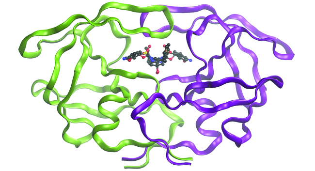

By the end of this section, you will be able to:
* Outline the basic quantum-mechanical approach to deriving molecular orbitals from atomic orbitals
* Describe traits of bonding and antibonding molecular orbitals
* Calculate bond orders based on molecular electron configurations
* Write molecular electron configurations for first- and second-row diatomic molecules
* Relate these electron configurations to the molecules’ stabilities and magnetic properties

For almost every covalent molecule that exists, we can now draw the Lewis structure, predict the electron-pair geometry, predict the molecular geometry, and come close to predicting bond angles. However, one of the most important molecules we know, the oxygen molecule O2, presents a problem with respect to its Lewis structure. We would write the following Lewis structure for O2\:

    This electronic structure adheres to all the rules governing Lewis theory. There is an O=O double bond, and each oxygen atom has eight electrons around it. However, this picture is at odds with the magnetic behavior of oxygen. By itself, O2 is not magnetic, but it is attracted to magnetic fields. Thus, when we pour liquid oxygen past a strong magnet, it collects between the poles of the magnet and defies gravity, as in [\[link\]](/m51054#CNX_Chem_08_00_LiqO2). Such attraction to a magnetic field is called **paramagnetism**{: data-type="term"}, and it arises in molecules that have unpaired electrons. And yet, the Lewis structure of O2 indicates that all electrons are paired. How do we account for this discrepancy?

Magnetic susceptibility measures the force experienced by a substance in a magnetic field. When we compare the weight of a sample to the weight measured in a magnetic field ([\[link\]](#CNX_Chem_08_04_Gouy)), paramagnetic samples that are attracted to the magnet will appear heavier because of the force exerted by the magnetic field. We can calculate the number of unpaired electrons based on the increase in weight.

 {: #CNX_Chem_08_04_Gouy}

Experiments show that each O2 molecule has two unpaired electrons. The Lewis-structure model does not predict the presence of these two unpaired electrons. Unlike oxygen, the apparent weight of most molecules decreases slightly in the presence of an inhomogeneous magnetic field. Materials in which all of the electrons are paired are **diamagnetic**{: data-type="term"} and weakly repel a magnetic field. Paramagnetic and diamagnetic materials do not act as permanent magnets. Only in the presence of an applied magnetic field do they demonstrate attraction or repulsion.

  
Water, like most molecules, contains all paired electrons. Living things contain a large percentage of water, so they demonstrate diamagnetic behavior. If you place a frog near a sufficiently large magnet, it will levitate. You can see [videos][1] of diamagnetic floating frogs, strawberries, and more.

Molecular orbital theory (MO theory) provides an explanation of chemical bonding that accounts for the paramagnetism of the oxygen molecule. It also explains the bonding in a number of other molecules, such as violations of the octet rule and more molecules with more complicated bonding (beyond the scope of this text) that are difficult to describe with Lewis structures. Additionally, it provides a model for describing the energies of electrons in a molecule and the probable location of these electrons. Unlike valence bond theory, which uses hybrid orbitals that are assigned to one specific atom, MO theory uses the combination of atomic orbitals to yield molecular orbitals that are *delocalized* over the entire molecule rather than being localized on its constituent atoms. MO theory also helps us understand why some substances are electrical conductors, others are semiconductors, and still others are insulators. [\[link\]](#fs-idm162808816) summarizes the main points of the two complementary bonding theories. Both theories provide different, useful ways of describing molecular structure.

<table summary="A table is shown that is composed of two columns and six rows. The header row reads, &#x201C;Valence Bond Theory,&#x201D; and, &#x201C;Molecular Orbital Theory.&#x201D; The first column contains the phrases: &#x201C;considers bonds as localized between one pair of atoms,&#x201D; &#x201C;creates bonds from overlap of atomic orbitals ( s, p, d&#x2026;) and hybrid orbitals ( s p , s p superscript 2, s p superscript 3 &#x2026; ) ,&#x201D; &#x201C;forms sigma or pi bonds,&#x201D; &#x201C;predicts molecular shape based on the number of regions of electron density,&#x201D; and, &#x201C;needs multiple structures are needed to describe resonance.&#x201D; The second column reads, &#x201C;considers electrons delocalized throughout the entire molecule,&#x201D; &#x201C;combines atomic orbitals to form molecular orbitals ( sigma, sigma superscript asterik, pi, pi superscript asterisk ),&#x201D; &#x201C;creates bonding and antibonding interactions based on which orbitals are filled,&#x201D; &#x201C;predicts the arrangement of electrons in molecules.&#x201D;" class="span-all"><thead>
<tr valign="middle">
<th colspan="2" data-align="center">Comparison of Bonding Theories</th>
</tr>
<tr valign="middle">
<th data-align="left">Valence Bond Theory</th>
<th data-align="left">Molecular Orbital Theory</th></tr>
</thead><tbody>
<tr valign="middle">
<td data-align="left">considers bonds as localized between one pair of atoms</td>
<td data-align="left">considers electrons delocalized throughout the entire molecule</td></tr>
<tr valign="middle">
<td data-align="left">creates bonds from overlap of atomic orbitals (<em>s, p, d</em>…) and hybrid orbitals (<em>sp, sp</em>2, <em>sp</em>3…)</td>
<td data-align="left">combines atomic orbitals to form molecular orbitals (σ, σ*, π, π*)</td></tr>
<tr valign="middle">
<td data-align="left">forms σ or π bonds</td>
<td data-align="left">creates bonding and antibonding interactions based on which orbitals are filled</td></tr>
<tr valign="middle">
<td data-align="left">predicts molecular shape based on the number of regions of electron density</td>
<td data-align="left">predicts the arrangement of electrons in molecules</td></tr>
<tr valign="middle">
<td data-align="left">needs multiple structures to describe resonance</td>
<td data-align="left" /></tr>
</tbody></table>

**Molecular orbital theory**{: data-type="term"} describes the distribution of electrons in molecules in much the same way that the distribution of electrons in atoms is described using atomic orbitals. Using quantum mechanics, the behavior of an electron in a molecule is still described by a wave function, *Ψ*, analogous to the behavior in an atom. Just like electrons around isolated atoms, electrons around atoms in molecules are limited to discrete (quantized) energies. The region of space in which a valence electron in a molecule is likely to be found is called a **molecular orbital (*Ψ*2)**{: data-type="term"}. Like an atomic orbital, a molecular orbital is full when it contains two electrons with opposite spin.

We will consider the molecular orbitals in molecules composed of two identical atoms (H2 or Cl2, for example). Such molecules are called **homonuclear diatomic molecules**{: data-type="term"}. In these diatomic molecules, several types of molecular orbitals occur.

The mathematical process of combining atomic orbitals to generate molecular orbitals is called the **linear combination of atomic orbitals (LCAO)**{: data-type="term"}. The wave function describes the wavelike properties of an electron. Molecular orbitals are combinations of atomic orbital wave functions. Combining waves can lead to constructive interference, in which peaks line up with peaks, or destructive interference, in which peaks line up with troughs ([\[link\]](#CNX_Chem_08_04_waveadd)). In orbitals, the waves are three dimensional, and they combine with in-phase waves producing regions with a higher probability of electron density and out-of-phase waves producing nodes, or regions of no electron density.

 ![A pair of diagrams are shown and labeled, &#x201C;a&#x201D; and &#x201C;b.&#x201D; Diagram a shows two identical waves with two crests and two troughs. They are drawn one above the other with a plus sign in between and an equal sign to the right. To the right of the equal sign is a much taller wave with a same number of troughs and crests. Diagram b shows two waves with two crests and two troughs, but they are mirror images of one another rotated over a horizontal axis. They are drawn one above the other with a plus sign in between and an equal sign to the right. To the right of the equal sign is a flat line.](../resources/CNX_Chem_08_04_waveadd.jpg "(a) When in-phase waves combine, constructive interference produces a wave with greater amplitude. (b) When out-of-phase waves combine, destructive interference produces a wave with less (or no) amplitude."){: #CNX_Chem_08_04_waveadd}

There are two types of molecular orbitals that can form from the overlap of two atomic *s* orbitals on adjacent atoms. The two types are illustrated in [\[link\]](#CNX_Chem_08_04_ssigma). The in-phase combination produces a lower energy **σ*s* molecular orbital**{: data-type="term"} (read as \"sigma-s\") in which most of the electron density is directly between the nuclei. The out-of-phase addition (which can also be thought of as subtracting the wave functions) produces a higher energy **<math xmlns="http://www.w3.org/1998/Math/MathML"><mrow><msubsup><mtext>σ</mtext><mi>s</mi><mo>*</mo></msubsup></mrow></math>

 molecular orbital**{: data-type="term"} (read as \"sigma-s-star\") molecular orbital in which there is a node between the nuclei. The asterisk signifies that the orbital is an antibonding orbital. Electrons in a σ*s* orbital are attracted by both nuclei at the same time and are more stable (of lower energy) than they would be in the isolated atoms. Adding electrons to these orbitals creates a force that holds the two nuclei together, so we call these orbitals **bonding orbitals**{: data-type="term"}. Electrons in the <math xmlns="http://www.w3.org/1998/Math/MathML"><mrow><msubsup><mtext>σ</mtext><mi>s</mi><mo>*</mo></msubsup></mrow></math>

 orbitals are located well away from the region between the two nuclei. The attractive force between the nuclei and these electrons pulls the two nuclei apart. Hence, these orbitals are called **antibonding orbitals**{: data-type="term"}. Electrons fill the lower-energy bonding orbital before the higher-energy antibonding orbital, just as they fill lower-energy atomic orbitals before they fill higher-energy atomic orbitals.

 ![A diagram is shown that depicts a vertical upward-facing arrow that lies to the left of all the other portions of the diagram and is labeled, &#x201C;E.&#x201D; To the immediate right of the midpoint of the arrow are two circles each labeled with a positive sign, the letter S, and the phrase, &#x201C;Atomic orbitals.&#x201D; These are followed by a right-facing horizontal arrow that points to the same two circles labeled with plus signs, but they are now touching and are labeled, &#x201C;Combine atomic orbitals.&#x201D; Two right-facing arrows lead to the last portion of the diagram, one facing upward and one facing downward. The upper arrow is labeled, &#x201C;Subtract,&#x201D; and points to two oblong ovals labeled with plus signs, and the phrase, &#x201C;Antibonding orbitals sigma subscript s superscript asterisk.&#x201D; The lower arrow is labeled, &#x201C;Add,&#x201D; and points to an elongated oval with two plus signs that is labeled, &#x201C;Bonding orbital sigma subscript s.&#x201D; The heading over the last section of the diagram are the words, &#x201C;Molecular orbitals.&#x201D;](../resources/CNX_Chem_08_04_ssigma.jpg "Sigma (&#x3C3;) and sigma-star (&#x3C3;*) molecular orbitals are formed by the combination of two s atomic orbitals. The plus (+) signs indicate the locations of nuclei."){: #CNX_Chem_08_04_ssigma}

  
You can watch [animations][2] visualizing the calculated atomic orbitals combining to form various molecular orbitals at the Orbitron website.

In *p* orbitals, the wave function gives rise to two lobes with opposite phases, analogous to how a two-dimensional wave has both parts above and below the average. We indicate the phases by shading the orbital lobes different colors. When orbital lobes of the same phase overlap, constructive wave interference increases the electron density. When regions of opposite phase overlap, the destructive wave interference decreases electron density and creates nodes. When *p* orbitals overlap end to end, they create σ and σ\* orbitals ([\[link\]](#CNX_Chem_08_04_pMOsigma)). If two atoms are located along the *x*-axis in a Cartesian coordinate system, the two *px* orbitals overlap end to end and form σ*px* (bonding) and <math xmlns="http://www.w3.org/1998/Math/MathML"><mrow><msubsup><mtext>σ</mtext><mrow><mi>p</mi><mi>x</mi></mrow><mo>*</mo></msubsup></mrow></math>

 (antibonding) (read as \"sigma-p-x\" and \"sigma-p-x star,\" respectively). Just as with *s*-orbital overlap, the asterisk indicates the orbital with a node between the nuclei, which is a higher-energy, antibonding orbital.

 ![Two horizontal rows of diagrams are shown. The upper diagram shows two equally-sized peanut-shaped orbitals with a plus sign in between them connected to a merged orbital diagram by a right facing arrow. The merged diagram has a much larger oval at the center and much smaller ovular orbitals on the edge. It is labeled, &#x201C;sigma subscript p x.&#x201D; The lower diagram shows two equally-sized peanut-shaped orbitals with a plus sign in between them connected to a split orbital diagram by a right facing arrow. The split diagram has a much larger oval at the outer ends and much smaller ovular orbitals on the inner edges. It is labeled, &#x201C;sigma subscript p x superscript asterisk&#x201D;.](../resources/CNX_Chem_08_04_pMOsigma.jpg "Combining wave functions of two p atomic orbitals along the internuclear axis creates two molecular orbitals, &#x3C3;p and &#x3C3;p*."){: #CNX_Chem_08_04_pMOsigma}

The side-by-side overlap of two *p* orbitals gives rise to a **pi (π) bonding molecular orbital**{: data-type="term"} and a **π\* antibonding molecular orbital**{: data-type="term"}, as shown in [\[link\]](#CNX_Chem_08_04_pMOpi). In valence bond theory, we describe π bonds as containing a nodal plane containing the internuclear axis and perpendicular to the lobes of the *p* orbitals, with electron density on either side of the node. In molecular orbital theory, we describe the π orbital by this same shape, and a π bond exists when this orbital contains electrons. Electrons in this orbital interact with both nuclei and help hold the two atoms together, making it a bonding orbital. For the out-of-phase combination, there are two nodal planes created, one along the internuclear axis and a perpendicular one between the nuclei.

  containing the internuclear axis with the two lobes of the orbital located above and below this node."){: #CNX_Chem_08_04_pMOpi}

In the molecular orbitals of diatomic molecules, each atom also has two sets of *p* orbitals oriented side by side (*py* and *pz*), so these four atomic orbitals combine pairwise to create two π orbitals and two π\* orbitals. The π*py* and <math xmlns="http://www.w3.org/1998/Math/MathML"><mrow><msubsup><mtext>π</mtext><mrow><mi>p</mi><mi>y</mi></mrow><mo>*</mo></msubsup></mrow></math>

 orbitals are oriented at right angles to the π*pz* and <math xmlns="http://www.w3.org/1998/Math/MathML"><mrow><msubsup><mtext>π</mtext><mrow><mi>p</mi><mi>z</mi></mrow><mo>*</mo></msubsup></mrow></math>

 orbitals. Except for their orientation, the π*py* and π*pz* orbitals are identical and have the same energy; they are **degenerate orbitals**{: data-type="term"}. The <math xmlns="http://www.w3.org/1998/Math/MathML"><mrow><msubsup><mtext>π</mtext><mrow><mi>p</mi><mi>y</mi></mrow><mo>*</mo></msubsup></mrow></math>

 and <math xmlns="http://www.w3.org/1998/Math/MathML"><mrow><msubsup><mtext>π</mtext><mrow><mi>p</mi><mi>z</mi></mrow><mo>*</mo></msubsup></mrow></math>

 antibonding orbitals are also degenerate and identical except for their orientation. A total of six molecular orbitals results from the combination of the six atomic *p* orbitals in two atoms: σ*px* and <math xmlns="http://www.w3.org/1998/Math/MathML"><mrow><msubsup><mtext>σ</mtext><mrow><mi>p</mi><mi>x</mi></mrow><mo>*</mo></msubsup><mo>,</mo></mrow></math>

 π*py* and <math xmlns="http://www.w3.org/1998/Math/MathML"><mrow><msubsup><mtext>π</mtext><mrow><mi>p</mi><mi>y</mi></mrow><mo>*</mo></msubsup><mo>,</mo></mrow></math>

 π*pz* and <math xmlns="http://www.w3.org/1998/Math/MathML"><mrow><msubsup><mtext>π</mtext><mrow><mi>p</mi><mi>z</mi></mrow><mo>*</mo></msubsup><mo>.</mo></mrow></math>

Molecular Orbitals Predict what type (if any) of molecular orbital would result from adding the wave functions so each pair of orbitals shown overlap. The orbitals are all similar in energy.

 ![Three diagrams are shown and labeled &#x201C;a,&#x201D; &#x201C;b,&#x201D; and &#x201C;c.&#x201D; Diagram a shows two horizontal peanut-shaped orbitals laying side-by-side. They are labeled, &#x201C;3 p subscript x and 3 p subscript x.&#x201D; Diagram b shows one vertical and one horizontal peanut-shaped orbital which are at right angles to one another. They are labeled, &#x201C;3 p subscript x and 3 p subscript y.&#x201D; Diagram c shows two vertical peanut-shaped orbitals laying side-by-side and labeled, &#x201C;3 p subscript y and 3 p subscript y.&#x201D;](../resources/CNX_Chem_08_04_AOtype_img.jpg) 
Solution(a) is an in-phase combination, resulting in a σ3*p* orbital

(b) will not result in a new orbital because the in-phase component (bottom) and out-of-phase component (top) cancel out. Only orbitals with the correct alignment can combine.

(c) is an out-of-phase combination, resulting in a <math xmlns="http://www.w3.org/1998/Math/MathML"><mrow><msubsup><mtext>π</mtext><mrow><mn>3</mn><mi>p</mi></mrow><mo>*</mo></msubsup></mrow></math>

 orbital.

Check Your LearningLabel the molecular orbital shown as *σ* or π, bonding or antibonding and indicate where the node occurs.

  

Answer:

The orbital is located along the internuclear axis, so it is a σ orbital. There is a node bisecting the internuclear axis, so it is an antibonding orbital.* * *
{: data-type="newline"}

  

Walter Kohn: Nobel Laureate

Walter **Kohn**{: data-type="term" .no-emphasis} ([\[link\]](#CNX_Chem_08_04_Kohn)) is a theoretical physicist who studies the electronic structure of solids. His work combines the principles of quantum mechanics with advanced mathematical techniques. This technique, called density functional theory, makes it possible to compute properties of molecular orbitals, including their shape and energies. Kohn and mathematician John Pople were awarded the Nobel Prize in Chemistry in 1998 for their contributions to our understanding of electronic structure. Kohn also made significant contributions to the physics of semiconductors.

"){: #CNX_Chem_08_04_Kohn}

Kohn’s biography has been remarkable outside the realm of physical chemistry as well. He was born in Austria, and during World War II he was part of the Kindertransport program that rescued 10,000 children from the Nazi regime. His summer jobs included discovering gold deposits in Canada and helping Polaroid explain how its instant film worked. Although he is now an emeritus professor, he is still actively working on projects involving global warming and renewable energy.

Computational Chemistry in Drug Design

While the descriptions of bonding described in this chapter involve many theoretical concepts, they also have many practical, real-world applications. For example, drug design is an important field that uses our understanding of chemical bonding to develop pharmaceuticals. This interdisciplinary area of study uses biology (understanding diseases and how they operate) to identify specific targets, such as a binding site that is involved in a disease pathway. By modeling the structures of the binding site and potential drugs, computational chemists can predict which structures can fit together and how effectively they will bind (see [\[link\]](#CNX_Chem_08_04_HIVProteas)). Thousands of potential candidates can be narrowed down to a few of the most promising candidates. These candidate molecules are then carefully tested to determine side effects, how effectively they can be transported through the body, and other factors. Dozens of important new pharmaceuticals have been discovered with the aid of computational chemistry, and new research projects are underway.

{: #CNX_Chem_08_04_HIVProteas}

# Molecular Orbital Energy Diagrams

The relative energy levels of atomic and molecular orbitals are typically shown in a **molecular orbital diagram**{: data-type="term"} ([\[link\]](#CNX_Chem_08_04_FillMo)). For a diatomic molecule, the atomic orbitals of one atom are shown on the left, and those of the other atom are shown on the right. Each horizontal line represents one orbital that can hold two electrons. The molecular orbitals formed by the combination of the atomic orbitals are shown in the center. Dashed lines show which of the atomic orbitals combine to form the molecular orbitals. For each pair of atomic orbitals that combine, one lower-energy (bonding) molecular orbital and one higher-energy (antibonding) orbital result. Thus we can see that combining the six 2*p* atomic orbitals results in three bonding orbitals (one σ and two π) and three antibonding orbitals (one σ\* and two π\*).

We predict the distribution of electrons in these molecular orbitals by filling the orbitals in the same way that we fill atomic orbitals, by the Aufbau principle. Lower-energy orbitals fill first, electrons spread out among degenerate orbitals before pairing, and each orbital can hold a maximum of two electrons with opposite spins ([\[link\]](#CNX_Chem_08_04_FillMo)). Just as we write electron configurations for atoms, we can write the molecular electronic configuration by listing the orbitals with superscripts indicating the number of electrons present. For clarity, we place parentheses around molecular orbitals with the same energy. In this case, each orbital is at a different energy, so parentheses separate each orbital. Thus we would expect a diatomic molecule or ion containing seven electrons (such as <math xmlns="http://www.w3.org/1998/Math/MathML"><mrow><msub><mtext>Be</mtext><mn>2</mn></msub><msup><mrow /><mtext>+</mtext></msup><mo stretchy="false">)</mo></mrow></math>

 would have the molecular electron configuration <math xmlns="http://www.w3.org/1998/Math/MathML"><mrow><msup><mrow><mrow><mo stretchy="false">(</mo><mrow><msub><mtext>σ</mtext><mrow><mn>1</mn><mi>s</mi></mrow></msub></mrow><mo stretchy="false">)</mo></mrow></mrow><mn>2</mn></msup><msup><mrow><mrow><mo stretchy="false">(</mo><mrow><msubsup><mtext>σ</mtext><mrow><mn>1</mn><mi>s</mi></mrow><mo>*</mo></msubsup></mrow><mo stretchy="false">)</mo></mrow></mrow><mn>2</mn></msup><msup><mrow><mrow><mo stretchy="false">(</mo><mrow><msub><mtext>σ</mtext><mrow><mn>2</mn><mi>s</mi></mrow></msub></mrow><mo stretchy="false">)</mo></mrow></mrow><mn>2</mn></msup><msup><mrow><mrow><mo stretchy="false">(</mo><mrow><msubsup><mtext>σ</mtext><mrow><mn>2</mn><mi>s</mi></mrow><mo>*</mo></msubsup></mrow><mo stretchy="false">)</mo></mrow></mrow><mn>1</mn></msup><mo>.</mo></mrow></math>

 It is common to omit the core electrons from molecular orbital diagrams and configurations and include only the valence electrons.

 ![A diagram is shown that has an upward-facing vertical arrow running along the left side labeled, &#x201C;E.&#x201D; At the bottom center of the diagram is a horizontal line labeled, &#x201C;sigma subscript 2 s,&#x201D; that has two vertical half arrows drawn on it, one facing up and one facing down. This line is connected to the right and left by upward-facing, dotted lines to two more horizontal lines, each labeled, &#x201C;2 s.&#x201D; The line on the left has two vertical half arrows drawn on it, one facing up and one facing down while the line of the right has one half arrow facing up drawn on it. These two lines are connected by upward-facing dotted lines to another line in the center of the diagram, but further up from the first. It is labeled, &#x201C;sigma subscript 2 s superscript asterisk.&#x201D; This horizontal line has one upward-facing vertical half-arrow drawn on it. Moving farther up the center of the diagram is a long horizontal line labeled, &#x201C;sigma subscript 2 p subscript x,&#x201D; which lies below two horizontal lines. These two horizontal lines lie side-by-side, and labeled, &#x201C;pi subscript 2 p subscript y,&#x201D; and, &#x201C;pi subscript 2 p subscript z.&#x201D; Both the bottom and top lines are connected to the right and left by upward-facing, dotted lines to three more horizontal lines, each labeled, &#x201C;2 p.&#x201D; These sets of lines are connected by upward-facing dotted lines to another single line and then pair of double lines in the center of the diagram, but farther up from the lower lines. They are labeled, &#x201C;sigma subscript 2 p subscript x superscript asterisk,&#x201D; and, &#x201C;&#x201C;pi subscript 2 p subscript y superscript asterisk,&#x201D; and, &#x201C;pi subscript 2 p subscript z superscript asterisk,&#x201D; respectively. The left and right sides of the diagram have headers that read, &#x201D;Atomic orbitals,&#x201D; while the center is header reads &#x201C;Molecular orbitals&#x201D;.](../resources/CNX_Chem_08_04_FillMo.jpg "This is the molecular orbital diagram for the homonuclear diatomic Be2+, showing the molecular orbitals of the valence shell only. The molecular orbitals are filled in the same manner as atomic orbitals, using the Aufbau principle and Hund&#x2019;s rule."){: #CNX_Chem_08_04_FillMo}

# Bond Order

The filled molecular orbital diagram shows the number of electrons in both bonding and antibonding molecular orbitals. The net contribution of the electrons to the bond strength of a molecule is identified by determining the **bond order**{: data-type="term"} that results from the filling of the molecular orbitals by electrons.

When using Lewis structures to describe the distribution of electrons in molecules, we define bond order as the number of bonding pairs of electrons between two atoms. Thus a single bond has a bond order of 1, a double bond has a bond order of 2, and a triple bond has a bond order of 3. We define bond order differently when we use the molecular orbital description of the distribution of electrons, but the resulting bond order is usually the same. The MO technique is more accurate and can handle cases when the Lewis structure method fails, but both methods describe the same phenomenon.

In the molecular orbital model, an electron contributes to a bonding interaction if it occupies a bonding orbital and it contributes to an antibonding interaction if it occupies an antibonding orbital. The bond order is calculated by subtracting the destabilizing (antibonding) electrons from the stabilizing (bonding) electrons. Since a bond consists of two electrons, we divide by two to get the bond order. We can determine bond order with the following equation:

<math xmlns="http://www.w3.org/1998/Math/MathML"><mrow><mtext>bond order</mtext><mo>=</mo><mspace width="0.2em" /><mfrac><mrow><mrow><mo>(</mo><mrow><mtext>number of bonding electrons</mtext></mrow><mo>)</mo></mrow><mspace width="0.2em" /><mo>−</mo><mspace width="0.2em" /><mrow><mo>(</mo><mrow><mtext>number of antibonding electrons</mtext></mrow><mo>)</mo></mrow></mrow><mn>2</mn></mfrac></mrow></math>

The order of a covalent bond is a guide to its strength; a bond between two given atoms becomes stronger as the bond order increases ([\[link\]](/m51056#fs-idp43355056)). If the distribution of electrons in the molecular orbitals between two atoms is such that the resulting bond would have a bond order of zero, a stable bond does not form. We next look at some specific examples of MO diagrams and bond orders.

# Bonding in Diatomic Molecules

A dihydrogen molecule (H2) forms from two hydrogen atoms. When the atomic orbitals of the two atoms combine, the electrons occupy the molecular orbital of lowest energy, the σ1*s* bonding orbital. A dihydrogen molecule, H2, readily forms because the energy of a H2 molecule is lower than that of two H atoms. The σ1*s* orbital that contains both electrons is lower in energy than either of the two 1*s* atomic orbitals.

A molecular orbital can hold two electrons, so both electrons in the H2 molecule are in the σ1*s* bonding orbital; the electron configuration is <math xmlns="http://www.w3.org/1998/Math/MathML"><mrow><msup><mrow><mrow><mo>(</mo><mrow><msub><mtext>σ</mtext><mrow><mn>1</mn><mi>s</mi></mrow></msub></mrow><mo>)</mo></mrow></mrow><mn>2</mn></msup><mo>.</mo></mrow></math>

 We represent this configuration by a molecular orbital energy diagram ([\[link\]](#CNX_Chem_08_04_H2MO)) in which a single upward arrow indicates one electron in an orbital, and two (upward and downward) arrows indicate two electrons of opposite spin.

 ![A diagram is shown that has an upward-facing vertical arrow running along the left side labeled &#x201C;E.&#x201D; At the bottom center of the diagram is a horizontal line labeled, &#x201C;sigma subscript 1 s,&#x201D; that has two vertical half arrows drawn on it, one facing up and one facing down. This line is connected to the right and left by upward-facing, dotted lines to two more horizontal lines, each labeled, &#x201C;1 s,&#x201D; and each with one vertical half-arrow facing up drawn on it. These two lines are connected by upward-facing dotted lines to another line in the center of the diagram, but farther up from the first, and labeled, &#x201C;sigma subscript 1 s superscript asterisk.&#x201D; The left and right sides of the diagram have headers that read, &#x201D;Atomic orbitals,&#x201D; while the center header reads, &#x201C;Molecular orbitals.&#x201D; The bottom left and right are labeled &#x201C;H&#x201D; while the center is labeled &#x201C;H subscript 2.&#x201D;](../resources/CNX_Chem_08_04_H2MO.jpg "The molecular orbital energy diagram predicts that H2 will be a stable molecule with lower energy than the separated atoms."){: #CNX_Chem_08_04_H2MO}

A dihydrogen molecule contains two bonding electrons and no antibonding electrons so we have

<math xmlns="http://www.w3.org/1998/Math/MathML"><mrow><msub><mrow><mtext>bond order in H</mtext></mrow><mn>2</mn></msub><mo>=</mo><mspace width="0.2em" /><mfrac><mrow><mrow><mo>(</mo><mrow><mn>2</mn><mo>−</mo><mn>0</mn></mrow><mo>)</mo></mrow></mrow><mn>2</mn></mfrac><mspace width="0.2em" /><mo>=</mo><mn>1</mn></mrow></math>

Because the bond order for the H–H bond is equal to 1, the bond is a single bond.

A helium atom has two electrons, both of which are in its 1*s* orbital. Two helium atoms do not combine to form a dihelium molecule, He2, with four electrons, because the stabilizing effect of the two electrons in the lower-energy bonding orbital would be offset by the destabilizing effect of the two electrons in the higher-energy antibonding molecular orbital. We would write the hypothetical electron configuration of He2 as <math xmlns="http://www.w3.org/1998/Math/MathML"><mrow><msup><mrow><mrow><mo stretchy="false">(</mo><mrow><msub><mtext>σ</mtext><mrow><mn>1</mn><mi>s</mi></mrow></msub></mrow><mo stretchy="false">)</mo></mrow></mrow><mn>2</mn></msup><msup><mrow><mrow><mo stretchy="false">(</mo><mrow><msubsup><mtext>σ</mtext><mrow><mn>1</mn><mi>s</mi></mrow><mo>*</mo></msubsup></mrow><mo stretchy="false">)</mo></mrow></mrow><mn>2</mn></msup></mrow></math>

 as in [\[link\]](#CNX_Chem_08_04_He2MO). The net energy change would be zero, so there is no driving force for helium atoms to form the diatomic molecule. In fact, helium exists as discrete atoms rather than as diatomic molecules. The bond order in a hypothetical dihelium molecule would be zero.

<math xmlns="http://www.w3.org/1998/Math/MathML"><mrow><msub><mrow><mtext>bond order in He</mtext></mrow><mn>2</mn></msub><mo>=</mo><mspace width="0.2em" /><mfrac><mrow><mrow><mo>(</mo><mrow><mn>2</mn><mo>−</mo><mn>2</mn></mrow><mo>)</mo></mrow></mrow><mn>2</mn></mfrac><mspace width="0.2em" /><mo>=</mo><mn>0</mn></mrow></math>

A bond order of zero indicates that no bond is formed between two atoms.

 ![A diagram is shown that has an upward-facing vertical arrow running along the left side labeled, &#x201C;E.&#x201D; At the bottom center of the diagram is a horizontal line labeled, &#x201C;sigma subscript 1 s,&#x201D; that has two vertical half arrows drawn on it, one facing up and one facing down. This line is connected to the right and left by upward-facing, dotted lines to two more horizontal lines, each labeled, &#x201C;1 s,&#x201D; and each with one vertical half-arrow facing up and one facing down drawn on it. These two lines are connected by upward-facing dotted lines to another line in the center of the diagram, but farther up from the first, and labeled, &#x201C;sigma subscript 1 s superscript asterisk.&#x201D; This line has one upward-facing and one downward-facing vertical arrow drawn on it. The left and right sides of the diagram have headers that read, &#x201C;Atomic orbitals,&#x201D; while the center header reads, &#x201C;Molecular orbitals.&#x201D; The bottom left and right are labeled, &#x201C;H e,&#x201D; while the center is labeled, &#x201C;H e subscript 2.&#x201D;](../resources/CNX_Chem_08_04_He2MO.jpg "The molecular orbital energy diagram predicts that He2 will not be a stable molecule, since it has equal numbers of bonding and antibonding electrons."){: #CNX_Chem_08_04_He2MO}

## The Diatomic Molecules of the Second Period

Eight possible homonuclear diatomic molecules might be formed by the atoms of the second period of the periodic table: Li2, Be2, B2, C2, N2, O2,** F2, and Ne2. However, we can predict that the Be2 molecule and the Ne2 molecule would not be stable. We can see this by a consideration of the molecular electron configurations ([\[link\]](#fs-idp20943328)).

We predict valence molecular orbital electron configurations just as we predict electron configurations of atoms. Valence electrons are assigned to valence molecular orbitals with the lowest possible energies. Consistent with Hund’s rule, whenever there are two or more degenerate molecular orbitals, electrons fill each orbital of that type singly before any pairing of electrons takes place.

As we saw in valence bond theory, σ bonds are generally more stable than π bonds formed from degenerate atomic orbitals. Similarly, in molecular orbital theory, σ orbitals are usually more stable than π orbitals. However, this is not always the case. The MOs for the valence orbitals of the second period are shown in [\[link\]](#CNX_Chem_08_04_X2MOs). Looking at Ne2 molecular orbitals, we see that the order is consistent with the generic diagram shown in the previous section. However, for atoms with three or fewer electrons in the *p* orbitals (Li through N) we observe a different pattern, in which the σ*p* orbital is higher in energy than the π*p* set. Obtain the molecular orbital diagram for a homonuclear diatomic ion by adding or subtracting electrons from the diagram for the neutral molecule.

 ![A graph is shown in which the y-axis is labeled, &#x201C;E,&#x201D; and appears as a vertical, upward-facing arrow. Across the top, the graph reads, &#x201C;L i subscript 2,&#x201D; &#x201C;B e subscript 2,&#x201D; &#x201C;B subscript 2,&#x201D; &#x201C;C subscript 2,&#x201D; &#x201C;N subscript 2,&#x201D; &#x201C;O subscript 2,&#x201D; &#x201C;F subscript 2,&#x201D; and &#x201C;Ne subscript 2.&#x201D; Directly below each of these element terms is a single pink line, and all lines are connected to one another by a dashed line, to create an overall line that decreases in height as it moves from left to right across the graph. This line is labeled, &#x201C;sigma subscript 2 p x superscript asterisk&#x201D;. Directly below each of these lines is a set of two pink lines, and all lines are connected to one another by a dashed line, to create an overall line that decreases in height as it moves from left to right across the graph. It is consistently lower than the first line. This line is labeled, &#x201C;pi subscript 2 p y superscript asterisk,&#x201D; and, &#x201C;pi subscript 2 p z superscript asterisk.&#x201D; Directly below each of these double lines is a single pink line, and all lines are connected to one another by a dashed line, to create an overall line that decreases in height as it moves from left to right across the graph. It has a distinctive drop at the label, &#x201C;O subscript 2.&#x201D; This line is labeled, &#x201C;sigma subscript 2 p x.&#x201D; Directly below each of these lines is a set of two pink lines, and all lines are connected to one another by a dashed line to create an overall line that decreases very slightly in height as it moves from left to right across the graph. It is consistently lower than the third line until it reaches the point labeled, &#x201C;O subscript 2.&#x201D; This line is labeled, &#x201C;pi subscript 2 p y,&#x201D; and, &#x201C;pi subscript 2 p z.&#x201D; Directly below each of these lines is a single blue line, and all lines are connected to one another by a dashed line to create an overall line that decreases in height as it moves from left to right across the graph. This line is labeled, &#x201C;sigma subscript 2 s superscript asterisk.&#x201D; Finally, directly below each of these lines is a single blue line, and all lines are connected to one another by a dashed line to create an overall line that decreases in height as it moves from left to right across the graph. This line is labeled. &#x201C;sigma subscript 2 s.&#x201D;](../resources/CNX_Chem_08_04_X2MOs.jpg "This shows the MO diagrams for each homonuclear diatomic molecule in the second period. The orbital energies decrease across the period as the effective nuclear charge increases and atomic radius decreases. Between N2 and O2, the order of the orbitals changes."){: #CNX_Chem_08_04_X2MOs}

  
You can practice labeling and filling molecular orbitals with this [interactive tutorial][3] from the University of Sydney.

This switch in orbital ordering occurs because of a phenomenon called **s-p mixing**{: data-type="term"}. s-p mixing does not create new orbitals; it merely influences the energies of the existing molecular orbitals. The σs wavefunction mathematically combines with the σp wavefunction, with the result that the σs orbital becomes more stable, and the σp orbital becomes less stable ([\[link\]](#CNX_Chem_08_04_spmix)). Similarly, the antibonding orbitals also undergo s-p mixing, with the σs\* becoming more stable and the σp\* becoming less stable.

 ![A diagram is shown. At the bottom left of the diagram is a horizontal line that is connected to the right and left by upward-facing, dotted lines to two more horizontal lines. Those two lines are connected by upward-facing dotted lines to another line in the center of the diagram but farther up from the first. Each of the bottom two central lines has a vertical downward-facing arrow. Above this structure is a horizontal line that is connected to the right and left by upward-facing, dotted lines to two sets of three horizontal lines and those two lines are connected by upward-facing dotted lines to another line in the center of the diagram, but further up from the first. In between the horizontal lines of this structure are two pairs of horizontal lines that are above the first line but below the second and connected by dotted lines to the side horizontal lines. The bottom and top central lines each have an upward-facing vertical arrow. These two structures are redrawn on the right side of the diagram, but this time, the central lines of the bottom structure are moved downward in relation to the side lines. The upper portion of the structure has its central lines shifted upward in relation to the side lines. This structure also shows the bottom line appearing above the set of two lines.](../resources/CNX_Chem_08_04_spmix.jpg "Without mixing, the MO pattern occurs as expected, with the &#x3C3;p orbital lower in energy than the &#x3C3;p orbitals. When s-p mixing occurs, the orbitals shift as shown, with the &#x3C3;p orbital higher in energy than the &#x3C0;p orbitals."){: #CNX_Chem_08_04_spmix}

s-p mixing occurs when the *s* and *p* orbitals have similar energies. The energy difference between 2*s* and 2*p* orbitals in O, F, and Neis greater than that in Li, Be, B, C, and N. Because of this, O2, F2, and Ne2 exhibit negligible s-p mixing (not sufficient to change the energy ordering), and their MO diagrams follow the normal pattern, as shown in [\[link\]](#CNX_Chem_08_04_X2MOs). All of the other period 2 diatomic molecules do have s-p mixing, which leads to the pattern where the σp orbital is raised above the πp set.

Using the MO diagrams shown in [\[link\]](#CNX_Chem_08_04_X2MOs), we can add in the electrons and determine the molecular electron configuration and bond order for each of the diatomic molecules. As shown in [\[link\]](#fs-idp20943328), Be2 and Ne2 molecules would have a bond order of 0, and these molecules do not exist.

<table summary="A table is shown that has three columns and nine rows. The header row reads: &#x201C;Molecule,&#x201D; &#x201C;Electron Configuration,&#x201D; and, &#x201C;Bond Order.&#x201D; The first column contains the symbols &#x201C;L i subscript 2,&#x201D; &#x201C;B e subscript 2 ( unstable ),&#x201D; &#x201C;B e subscript 2,&#x201D; &#x201C;C subscript 2,&#x201D; &#x201C;N subscript 2,&#x201D; &#x201C;O subscript 2,&#x201D; &#x201C;F subscript 2,&#x201D; and, &#x201C;Ne subscript 2 ( unstable ).&#x201D; The second column contains the symbols &#x201C;( sigma subscript 2 s ) superscript 2,&#x201D; &#x201C;( sigma subscript 2 s ) superscript 2 ( sigma superscript asterisk subscript 2 s ) superscript 2,&#x201D; &#x201C;( sigma subscript 2 s ) superscript 2 ( sigma superscript asterisk subscript 2 s ) superscript 2 ( pi subscript 2 p y, pi subscript 2 p z ) superscript 2,&#x201D; &#x201C;( sigma subscript 2 s ) superscript 2 ( sigma superscript asterisk subscript 2 s ) superscript 2 ( pi subscript 2 p y, pi subscript 2 p z ) superscript 4,&#x201D; &#x201C;( sigma subscript 2 s ) superscript 2 ( sigma superscript asterisk subscript 2 s ) superscript 2 ( pi subscript 2 p y, pi subscript 2 p z ) superscript 4 ( sigma subscript 2 p x ) superscript 2,&#x201D; &#x201C;( sigma subscript 2 s ) superscript 2 ( sigma superscript asterisk subscript 2 s ) superscript 2 ( sigma subscript 2 p x ) superscript 2 ( pi subscript 2 p y, pi subscript 2 p z ) superscript 4 ( pi superscript asterisk subscript 2 p y, pi superscript asterisk subscript 2 p z ) superscript 2,&#x201D; &#x201C;( sigma subscript 2 s ) superscript 2 ( sigma superscript asterisk subscript 2 s ) superscript 2 ( sigma subscript 2 p x ) superscript 2 ( pi subscript 2 p y, pi subscript 2 p z ) superscript 4 ( pi superscript asterisk subscript 2 p y, pi superscript asterisk subscript 2 p z ) superscript 4,&#x201D; and &#x201C;( sigma subscript 2 s ) superscript 2 ( sigma superscript asterisk subscript 2 s ) superscript 2 ( sigma subscript 2 p x ) superscript 2 ( pi subscript 2 p y, pi subscript 2 p z ) superscript 4 ( pi superscript asterisk subscript 2 p y, pi superscript asterisk subscript 2 p z ) superscript 4 ( sigma superscript asterisk subscript 2 p x ) superscript 2.&#x201D; The third column contains the numbers: &#x201C;1,&#x201D; &#x201C;0,&#x201D; &#x201C;1,&#x201D; &#x201C;2,&#x201D; &#x201C;3,&#x201D; &#x201C;2,&#x201D; &#x201C;1,&#x201D; &#x201C;0.&#x201D;" class="span-all"><thead>
<tr valign="middle">
<th colspan="3" data-align="center">Electron Configuration and Bond Order for Molecular Orbitals in Homonuclear Diatomic Molecules of Period Two Elements</th>
</tr>
<tr valign="middle">
<th data-align="left">Molecule</th>
<th data-align="left">Electron Configuration</th>
<th data-align="left">Bond Order</th></tr>
</thead><tbody>
<tr valign="middle">
<td data-align="left">Li2</td>
<td data-align="left"><math xmlns="http://www.w3.org/1998/Math/MathML"><mrow><msup><mrow><mrow><mo stretchy="false">(</mo><mrow><msub><mtext>σ</mtext><mrow><mn>2</mn><mi>s</mi></mrow></msub></mrow><mo stretchy="false">)</mo></mrow></mrow><mn>2</mn></msup></mrow></math></td>
<td data-align="left">1</td></tr>
<tr valign="middle">
<td data-align="left">Be2 (unstable)</td>
<td data-align="left"><math xmlns="http://www.w3.org/1998/Math/MathML"><mrow><msup><mrow><mrow><mo stretchy="false">(</mo><mrow><msub><mtext>σ</mtext><mrow><mn>2</mn><mi>s</mi></mrow></msub></mrow><mo stretchy="false">)</mo></mrow></mrow><mn>2</mn></msup><msup><mrow><mrow><mo stretchy="false">(</mo><mrow><msubsup><mtext>σ</mtext><mrow><mn>2</mn><mi>s</mi></mrow><mo>*</mo></msubsup></mrow><mo stretchy="false">)</mo></mrow></mrow><mn>2</mn></msup></mrow></math></td>
<td data-align="left">0</td></tr>
<tr valign="middle">
<td data-align="left">B2</td>
<td data-align="left"><math xmlns="http://www.w3.org/1998/Math/MathML"><mrow><msup><mrow><mrow><mo stretchy="false">(</mo><mrow><msub><mtext>σ</mtext><mrow><mn>2</mn><mi>s</mi></mrow></msub></mrow><mo stretchy="false">)</mo></mrow></mrow><mn>2</mn></msup><msup><mrow><mrow><mo stretchy="false">(</mo><mrow><msubsup><mtext>σ</mtext><mrow><mn>2</mn><mi>s</mi></mrow><mo>*</mo></msubsup></mrow><mo stretchy="false">)</mo></mrow></mrow><mn>2</mn></msup><msup><mrow><mrow><mo stretchy="false">(</mo><mrow><msub><mtext>π</mtext><mrow><mn>2</mn><mi>p</mi><mi>y</mi></mrow></msub><mo>,</mo><mspace width="0.2em" /><msub><mtext>π</mtext><mrow><mn>2</mn><mi>p</mi><mi>z</mi></mrow></msub></mrow><mo stretchy="false">)</mo></mrow></mrow><mn>2</mn></msup></mrow></math></td>
<td data-align="left">1</td></tr>
<tr valign="middle">
<td data-align="left">C2</td>
<td data-align="left"><math xmlns="http://www.w3.org/1998/Math/MathML"><mrow><msup><mrow><mrow><mo stretchy="false">(</mo><mrow><msub><mtext>σ</mtext><mrow><mn>2</mn><mi>s</mi></mrow></msub></mrow><mo stretchy="false">)</mo></mrow></mrow><mn>2</mn></msup><msup><mrow><mrow><mo stretchy="false">(</mo><mrow><msubsup><mtext>σ</mtext><mrow><mn>2</mn><mi>s</mi></mrow><mo>*</mo></msubsup></mrow><mo stretchy="false">)</mo></mrow></mrow><mn>2</mn></msup><msup><mrow><mrow><mo stretchy="false">(</mo><mrow><msub><mtext>π</mtext><mrow><mn>2</mn><mi>p</mi><mi>y</mi></mrow></msub><mo>,</mo><mspace width="0.2em" /><msub><mtext>π</mtext><mrow><mn>2</mn><mi>p</mi><mi>z</mi></mrow></msub></mrow><mo stretchy="false">)</mo></mrow></mrow><mn>4</mn></msup></mrow></math></td>
<td data-align="left">2</td></tr>
<tr valign="middle">
<td data-align="left">N2</td>
<td data-align="left"><math xmlns="http://www.w3.org/1998/Math/MathML"><mrow><msup><mrow><mrow><mo stretchy="false">(</mo><mrow><msub><mtext>σ</mtext><mrow><mn>2</mn><mi>s</mi></mrow></msub></mrow><mo stretchy="false">)</mo></mrow></mrow><mn>2</mn></msup><msup><mrow><mrow><mo stretchy="false">(</mo><mrow><msubsup><mtext>σ</mtext><mrow><mn>2</mn><mi>s</mi></mrow><mo>*</mo></msubsup></mrow><mo stretchy="false">)</mo></mrow></mrow><mn>2</mn></msup><msup><mrow><mrow><mo stretchy="false">(</mo><mrow><msub><mtext>π</mtext><mrow><mn>2</mn><mi>p</mi><mi>y</mi></mrow></msub><mo>,</mo><mspace width="0.2em" /><msub><mtext>π</mtext><mrow><mn>2</mn><mi>p</mi><mi>z</mi></mrow></msub></mrow><mo stretchy="false">)</mo></mrow></mrow><mn>4</mn></msup><msup><mrow><mrow><mo stretchy="false">(</mo><mrow><msub><mtext>σ</mtext><mrow><mn>2</mn><mi>p</mi><mi>x</mi></mrow></msub></mrow><mo stretchy="false">)</mo></mrow></mrow><mn>2</mn></msup></mrow></math></td>
<td data-align="left">3</td></tr>
<tr valign="middle">
<td data-align="left">O2</td>
<td data-align="left"><math xmlns="http://www.w3.org/1998/Math/MathML"><mrow><msup><mrow><mrow><mo stretchy="false">(</mo><mrow><msub><mtext>σ</mtext><mrow><mn>2</mn><mi>s</mi></mrow></msub></mrow><mo stretchy="false">)</mo></mrow></mrow><mn>2</mn></msup><msup><mrow><mrow><mo stretchy="false">(</mo><mrow><msubsup><mtext>σ</mtext><mrow><mn>2</mn><mi>s</mi></mrow><mo>*</mo></msubsup></mrow><mo stretchy="false">)</mo></mrow></mrow><mn>2</mn></msup><msup><mrow><mrow><mo stretchy="false">(</mo><mrow><msub><mtext>σ</mtext><mrow><mn>2</mn><mi>p</mi><mi>x</mi></mrow></msub></mrow><mo stretchy="false">)</mo></mrow></mrow><mn>2</mn></msup><msup><mrow><mrow><mo stretchy="false">(</mo><mrow><msub><mtext>π</mtext><mrow><mn>2</mn><mi>p</mi><mi>y</mi></mrow></msub><mo>,</mo><mspace width="0.2em" /><msub><mtext>π</mtext><mrow><mn>2</mn><mi>p</mi><mi>z</mi></mrow></msub></mrow><mo stretchy="false">)</mo></mrow></mrow><mn>4</mn></msup><msup><mrow><mrow><mo stretchy="false">(</mo><mrow><msubsup><mtext>π</mtext><mrow><mn>2</mn><mi>p</mi><mi>y</mi></mrow><mo>*</mo></msubsup><mo>,</mo><mspace width="0.2em" /><msubsup><mtext>π</mtext><mrow><mn>2</mn><mi>p</mi><mi>z</mi></mrow><mo>*</mo></msubsup></mrow><mo stretchy="false">)</mo></mrow></mrow><mn>2</mn></msup></mrow></math></td>
<td data-align="left">2</td></tr>
<tr valign="middle">
<td data-align="left">F2</td>
<td data-align="left"><math xmlns="http://www.w3.org/1998/Math/MathML"><mrow><msup><mrow><mrow><mo stretchy="false">(</mo><mrow><msub><mtext>σ</mtext><mrow><mn>2</mn><mi>s</mi></mrow></msub></mrow><mo stretchy="false">)</mo></mrow></mrow><mn>2</mn></msup><msup><mrow><mrow><mo stretchy="false">(</mo><mrow><msubsup><mtext>σ</mtext><mrow><mn>2</mn><mi>s</mi></mrow><mo>*</mo></msubsup></mrow><mo stretchy="false">)</mo></mrow></mrow><mn>2</mn></msup><msup><mrow><mrow><mo stretchy="false">(</mo><mrow><msub><mtext>σ</mtext><mrow><mn>2</mn><mi>p</mi><mi>x</mi></mrow></msub></mrow><mo stretchy="false">)</mo></mrow></mrow><mn>2</mn></msup><msup><mrow><mrow><mo stretchy="false">(</mo><mrow><msub><mtext>π</mtext><mrow><mn>2</mn><mi>p</mi><mi>y</mi></mrow></msub><mo>,</mo><mspace width="0.2em" /><msub><mtext>π</mtext><mrow><mn>2</mn><mi>p</mi><mi>z</mi></mrow></msub></mrow><mo stretchy="false">)</mo></mrow></mrow><mn>4</mn></msup><msup><mrow><mrow><mo stretchy="false">(</mo><mrow><msubsup><mtext>π</mtext><mrow><mn>2</mn><mi>p</mi><mi>y</mi></mrow><mo>*</mo></msubsup><mo>,</mo><mspace width="0.2em" /><msubsup><mtext>π</mtext><mrow><mn>2</mn><mi>p</mi><mi>z</mi></mrow><mo>*</mo></msubsup></mrow><mo stretchy="false">)</mo></mrow></mrow><mn>4</mn></msup></mrow></math></td>
<td data-align="left">1</td></tr>
<tr valign="middle">
<td data-align="left">Ne2 (unstable)</td>
<td data-align="left"><math xmlns="http://www.w3.org/1998/Math/MathML"><mrow><msup><mrow><mrow><mo stretchy="false">(</mo><mrow><msub><mtext>σ</mtext><mrow><mn>2</mn><mi>s</mi></mrow></msub></mrow><mo stretchy="false">)</mo></mrow></mrow><mn>2</mn></msup><msup><mrow><mrow><mo stretchy="false">(</mo><mrow><msubsup><mtext>σ</mtext><mrow><mn>2</mn><mi>s</mi></mrow><mo>*</mo></msubsup></mrow><mo stretchy="false">)</mo></mrow></mrow><mn>2</mn></msup><msup><mrow><mrow><mo stretchy="false">(</mo><mrow><msub><mtext>σ</mtext><mrow><mn>2</mn><mi>p</mi><mi>x</mi></mrow></msub></mrow><mo stretchy="false">)</mo></mrow></mrow><mn>2</mn></msup><msup><mrow><mrow><mo stretchy="false">(</mo><mrow><msub><mtext>π</mtext><mrow><mn>2</mn><mi>p</mi><mi>y</mi></mrow></msub><mo>,</mo><mspace width="0.2em" /><msub><mtext>π</mtext><mrow><mn>2</mn><mi>p</mi><mi>z</mi></mrow></msub></mrow><mo stretchy="false">)</mo></mrow></mrow><mn>4</mn></msup><msup><mrow><mrow><mo stretchy="false">(</mo><mrow><msubsup><mtext>π</mtext><mrow><mn>2</mn><mi>p</mi><mi>y</mi></mrow><mo>*</mo></msubsup><mo>,</mo><mspace width="0.2em" /><msubsup><mtext>π</mtext><mrow><mn>2</mn><mi>p</mi><mi>z</mi></mrow><mo>*</mo></msubsup></mrow><mo stretchy="false">)</mo></mrow></mrow><mn>4</mn></msup><msup><mrow><mrow><mo stretchy="false">(</mo><mrow><msubsup><mtext>σ</mtext><mrow><mn>2</mn><mi>p</mi><mi>x</mi></mrow><mo>*</mo></msubsup></mrow><mo stretchy="false">)</mo></mrow></mrow><mn>2</mn></msup></mrow></math></td>
<td data-align="left">0</td></tr>
</tbody></table>

The combination of two lithium atoms to form a lithium molecule, Li2, is analogous to the formation of H2, but the atomic orbitals involved are the valence 2*s* orbitals. Each of the two lithium atoms has one valence electron. Hence, we have two valence electrons available for the σ2*s* bonding molecular orbital. Because both valence electrons would be in a bonding orbital, we would predict the Li2 molecule to be stable. The molecule is, in fact, present in appreciable concentration in lithium vapor at temperatures near the boiling point of the element. All of the other molecules in [\[link\]](#fs-idp20943328) with a bond order greater than zero are also known.

The O2 molecule has enough electrons to half fill the <math xmlns="http://www.w3.org/1998/Math/MathML"><mrow><mrow><mo>(</mo><mrow><msubsup><mtext>π</mtext><mrow><mn>2</mn><mi>p</mi><mi>y</mi></mrow><mo>*</mo></msubsup><mo>,</mo><mspace width="0.2em" /><msubsup><mtext>π</mtext><mrow><mn>2</mn><mi>p</mi><mi>z</mi></mrow><mo>*</mo></msubsup></mrow><mo>)</mo></mrow></mrow></math>

 level. We expect the two electrons that occupy these two degenerate orbitals to be unpaired, and this molecular electronic configuration for O2 is in accord with the fact that the oxygen molecule has two unpaired electrons ([\[link\]](#CNX_Chem_08_04_O2MO)). The presence of two unpaired electrons has proved to be difficult to explain using Lewis structures, but the molecular orbital theory explains it quite well. In fact, the unpaired electrons of the oxygen molecule provide a strong piece of support for the molecular orbital theory.

Band Theory

When two identical atomic orbitals on different atoms combine, two molecular orbitals result (see [\[link\]](#CNX_Chem_08_04_ssigma)). The bonding orbital is lower in energy than the original atomic orbitals because the atomic orbitals are in-phase in the molecular orbital. The antibonding orbital is higher in energy than the original atomic orbitals because the atomic orbitals are out-of-phase.

In a solid, similar things happen, but on a much larger scale. Remember that even in a small sample there are a huge number of atoms (typically &gt; 1023 atoms), and therefore a huge number of atomic orbitals that may be combined into molecular orbitals. When *N* valence atomic orbitals, all of the same energy and each containing one (1) electron, are combined, *N*/2 (filled) bonding orbitals and *N*/2 (empty) antibonding orbitals will result. Each bonding orbital will show an energy lowering as the atomic orbitals are *mostly* in-phase, but each of the bonding orbitals will be a little different and have slightly different energies. The antibonding orbitals will show an increase in energy as the atomic orbitals are *mostly* out-of-phase, but each of the antibonding orbitals will also be a little different and have slightly different energies. The allowed energy levels for all the bonding orbitals are so close together that they form a band, called the valence band. Likewise, all the antibonding orbitals are very close together and form a band, called the conduction band. [\[link\]](#CNX_Chem_08_04_Band) shows the bands for three important classes of materials: insulators, semiconductors, and conductors.

![This figure shows three diagrams. The first is labeled, &#x201C;Insulator,&#x201D; and it consists of two boxes. The &#x201C;conduction&#x201D; box is above and the &#x201C;valence&#x201D; box is below. A large gap marked by 4 dashed lines contains a double-headed arrow. One head pointing towards the &#x201C;conduction box&#x201D; and the other towards the &#x201C;valence&#x201D; box. The arrow is labeled, &#x201C;Band gap.&#x201D; The second diagram is similar to the first, but the band gap is about half as large. This diagram is labeled, &#x201C;Semiconductor.&#x201D; The third diagram is similar to the other two, but the band gap is about a fifth that of the &#x201C;Semiconductor&#x201D; diagram. This diagram is labeled, &#x201C;Conductor.&#x201D;](../resources/CNX_Chem_08_04_Band.jpg "Molecular orbitals in solids are so closely spaced that they are described as bands. The valence band is lower in energy and the conduction band is higher in energy. The type of solid is determined by the size of the &#x201C;band gap&#x201D; between the valence and conduction bands. Only a very small amount of energy is required to move electrons from the valence band to the conduction band in a conductor, and so they conduct electricity well. In an insulator, the band gap is large, so that very few electrons move, and they are poor conductors of electricity. Semiconductors are in between: they conduct electricity better than insulators, but not as well as conductors."){: #CNX_Chem_08_04_Band}

In order to conduct electricity, electrons must move from the filled valence band to the empty conduction band where they can move throughout the solid. The size of the band gap, or the energy difference between the top of the valence band and the bottom of the conduction band, determines how easy it is to move electrons between the bands. Only a small amount of energy is required in a conductor because the band gap is very small. This small energy difference is “easy” to overcome, so they are good conductors of electricity. In an insulator, the band gap is so “large” that very few electrons move into the conduction band; as a result, insulators are poor conductors of electricity. Semiconductors conduct electricity when “moderate” amounts of energy are provided to move electrons out of the valence band and into the conduction band. Semiconductors, such as silicon, are found in many electronics.

Semiconductors are used in devices such as computers, smartphones, and solar cells. Solar cells produce electricity when light provides the energy to move electrons out of the valence band. The electricity that is generated may then be used to power a light or tool, or it can be stored for later use by charging a battery. As of December 2014, up to 46% of the energy in sunlight could be converted into electricity using solar cells.

Molecular Orbital Diagrams, Bond Order, and Number of Unpaired Electrons Draw the molecular orbital diagram for the oxygen molecule, O2. From this diagram, calculate the bond order for O2. How does this diagram account for the paramagnetism of O2?

SolutionWe draw a molecular orbital energy diagram similar to that shown in [\[link\]](#CNX_Chem_08_04_X2MOs). Each oxygen atom contributes six electrons, so the diagram appears as shown in [\[link\]](#CNX_Chem_08_04_O2MO).

![A diagram is shown that has an upward-facing vertical arrow running along the left side labeled, &#x201C;E.&#x201D; At the bottom center of the diagram is a horizontal line labeled, &#x201C;sigma subscript 2 s,&#x201D; that has two vertical half arrows drawn on it, one facing up and one facing down. This line is connected to the right and left by upward-facing, dotted lines to two more horizontal lines, each labeled, &#x201C;2 s,&#x201D; and with two vertical half arrows drawn on them, one facing up and one facing down. These two lines are connected by upward-facing dotted lines to another line in the center of the diagram, but farther up from the first and labeled, &#x201C;sigma subscript 2 s superscript asterisk.&#x201D; This horizontal line has two vertical half-arrow drawn on it, one facing up and one facing down. Moving further up the center of the diagram is a horizontal line labeled, &#x201C;sigma subscript 2 p subscript x,&#x201D; which lies below two horizontal lines, lying side-by-side, and labeled &#x201C;pi subscript 2 p subscript y,&#x201D; and &#x201C;pi subscript 2 p subscript z.&#x201D; Both the bottom and top lines are connected to the right and left by upward-facing, dotted lines to three more horizontal lines, each labeled, &#x201C;2 p,&#x201D; on either side. These sets of lines each hold three upward-facing and one downward-facing half-arrow. They are connected by upward-facing dotted lines to another single line and then pair of double lines in the center of the diagram, but farther up from the lower lines. They are labeled, &#x201C;sigma subscript 2 p subscript x superscript asterisk,&#x201D; &#x201C;pi subscript 2 p subscript y superscript asterisk,&#x201D; and &#x201C;pi subscript 2 p subscript z superscript asterisk,&#x201D; respectively. The lower of these two central, horizontal lines each contain one upward-facing half-arrow. The left and right sides of the diagram have headers that read, &#x201D;Atomic orbitals,&#x201D; while the center header reads, &#x201C;Molecular orbitals.&#x201D;](../resources/CNX_Chem_08_04_O2MO.jpg "The molecular orbital energy diagram for O2 predicts two unpaired electrons."){: #CNX_Chem_08_04_O2MO}

We calculate the bond order as

<math xmlns="http://www.w3.org/1998/Math/MathML"><mrow><msub><mtext>O</mtext><mn>2</mn></msub><mo>=</mo><mspace width="0.2em" /><mfrac><mrow><mrow><mo>(</mo><mrow><mn>8</mn><mo>−</mo><mn>4</mn></mrow><mo>)</mo></mrow></mrow><mn>2</mn></mfrac><mspace width="0.2em" /><mo>=</mo><mn>2</mn></mrow></math>

Oxygen\'s paramagnetism is explained by the presence of two unpaired electrons in the (π2*py*, π2*pz*)\* molecular orbitals.

Check Your LearningThe main component of air is N2. From the molecular orbital diagram of N2, predict its bond order and whether it is diamagnetic or paramagnetic.

Answer:

N2 has a bond order of 3 and is diamagnetic.

Ion Predictions with MO Diagrams Give the molecular orbital configuration for the valence electrons in <math xmlns="http://www.w3.org/1998/Math/MathML"><mrow><msub><mtext>C</mtext><mn>2</mn></msub><msup><mrow /><mtext>2−</mtext></msup><mo>.</mo></mrow></math>

 Will this ion be stable?

SolutionLooking at the appropriate MO diagram, we see that the π orbitals are lower in energy than the σ*p* orbital. The valence electron configuration for C2 is <math xmlns="http://www.w3.org/1998/Math/MathML"><mrow><msup><mrow><mo stretchy="false">(</mo><msub><mtext>σ</mtext><mrow><mn>2</mn><mi>s</mi></mrow></msub><mo stretchy="false">)</mo></mrow><mn>2</mn></msup><msup><mrow><mo stretchy="false">(</mo><msubsup><mtext>σ</mtext><mrow><mtext>2</mtext><mi>s</mi></mrow><mo>*</mo></msubsup><mo stretchy="false">)</mo></mrow><mn>2</mn></msup><msup><mrow><mo stretchy="false">(</mo><msub><mtext>π</mtext><mrow><mn>2</mn><mi>p</mi><mi>y</mi></mrow></msub><mo>,</mo><mspace width="0.2em" /><msub><mtext>π</mtext><mrow><mn>2</mn><mi>p</mi><mi>z</mi></mrow></msub><mo stretchy="false">)</mo></mrow><mn>4</mn></msup><mo>.</mo></mrow></math>

 Adding two more electrons to generate the <math xmlns="http://www.w3.org/1998/Math/MathML"><mrow><msub><mtext>C</mtext><mn>2</mn></msub><msup><mrow /><mtext>2−</mtext></msup></mrow></math>

 anion will give a valence electron configuration of <math xmlns="http://www.w3.org/1998/Math/MathML"><mrow><msup><mrow><mo stretchy="false">(</mo><msub><mtext>σ</mtext><mrow><mn>2</mn><mi>s</mi></mrow></msub><mo stretchy="false">)</mo></mrow><mn>2</mn></msup><msup><mrow><mo stretchy="false">(</mo><msubsup><mtext>σ</mtext><mrow><mtext>2</mtext><mi>s</mi></mrow><mo>*</mo></msubsup><mo stretchy="false">)</mo></mrow><mn>2</mn></msup><msup><mrow><mo stretchy="false">(</mo><msub><mtext>π</mtext><mrow><mn>2</mn><mi>p</mi><mi>y</mi></mrow></msub><mo>,</mo><mspace width="0.2em" /><msub><mtext>π</mtext><mrow><mn>2</mn><mi>p</mi><mi>z</mi></mrow></msub><mo stretchy="false">)</mo></mrow><mn>4</mn></msup><msup><mrow><mo stretchy="false">(</mo><msub><mtext>σ</mtext><mrow><mn>2</mn><mi>p</mi><mi>x</mi></mrow></msub><mo stretchy="false">)</mo></mrow><mn>2</mn></msup><mo>.</mo></mrow></math>

 Since this has six more bonding electrons than antibonding, the bond order will be 3, and the ion should be stable.

Check Your LearningHow many unpaired electrons would be present on a <math xmlns="http://www.w3.org/1998/Math/MathML"><mrow><msub><mtext>Be</mtext><mn>2</mn></msub><msup><mrow /><mtext>2−</mtext></msup></mrow></math>

 ion? Would it be paramagnetic or diamagnetic?

Answer:

two, paramagnetic

  
Creating molecular orbital diagrams for molecules with more than two atoms relies on the same basic ideas as the diatomic examples presented here. However, with more atoms, computers are required to calculate how the atomic orbitals combine. See [three-dimensional drawings][4] of the molecular orbitals for C6H6.

# Key Concepts and Summary

Molecular orbital (MO) theory describes the behavior of electrons in a molecule in terms of combinations of the atomic wave functions. The resulting molecular orbitals may extend over all the atoms in the molecule. Bonding molecular orbitals are formed by in-phase combinations of atomic wave functions, and electrons in these orbitals stabilize a molecule. Antibonding molecular orbitals result from out-of-phase combinations of atomic wave functions and electrons in these orbitals make a molecule less stable. Molecular orbitals located along an internuclear axis are called σ MOs. They can be formed from *s* orbitals or from *p* orbitals oriented in an end-to-end fashion. Molecular orbitals formed from *p* orbitals oriented in a side-by-side fashion have electron density on opposite sides of the internuclear axis and are called π orbitals.

We can describe the electronic structure of diatomic molecules by applying molecular orbital theory to the valence electrons of the atoms. Electrons fill molecular orbitals following the same rules that apply to filling atomic orbitals; Hund’s rule and the Aufbau principle tell us that lower-energy orbitals will fill first, electrons will spread out before they pair up, and each orbital can hold a maximum of two electrons with opposite spins. Materials with unpaired electrons are paramagnetic and attracted to a magnetic field, while those with all-paired electrons are diamagnetic and repelled by a magnetic field. Correctly predicting the magnetic properties of molecules is in advantage of molecular orbital theory over Lewis structures and valence bond theory.

# Key Equations

* <math xmlns="http://www.w3.org/1998/Math/MathML"><mrow><mtext>bond order</mtext><mo>=</mo><mspace width="0.2em" /><mfrac><mrow><mrow><mo>(</mo><mrow><mtext>number of bonding electron</mtext></mrow><mo>)</mo></mrow><mo>−</mo><mrow><mo>(</mo><mrow><mtext>number of antibonding electrons</mtext></mrow><mo>)</mo></mrow></mrow><mn>2</mn></mfrac></mrow></math>
{: data-bullet-style="bullet"}

# Chemistry End of Chapter Exercises

Sketch the distribution of electron density in the bonding and antibonding molecular orbitals formed from two *s* orbitals and from two *p* orbitals.

How are the following similar, and how do they differ?

(a) σ molecular orbitals and π molecular orbitals

(b) *ψ* for an atomic orbital and *ψ* for a molecular orbital

(c) bonding orbitals and antibonding orbitals

(a) Similarities: Both are bonding orbitals that can contain a maximum of two electrons. Differences: σ orbitals are end-to-end combinations of atomic orbitals, whereas π orbitals are formed by side-by-side overlap of orbitals. (b) Similarities: Both are quantum-mechanical constructs that represent the probability of finding the electron about the atom or the molecule. Differences: *ψ* for an atomic orbital describes the behavior of only one electron at a time based on the atom. For a molecule, *ψ* represents a mathematical combination of atomic orbitals. (c) Similarities: Both are orbitals that can contain two electrons. Differences: Bonding orbitals result in holding two or more atoms together. Antibonding orbitals have the effect of destabilizing any bonding that has occurred.

If molecular orbitals are created by combining five atomic orbitals from atom A and five atomic orbitals from atom B combine, how many molecular orbitals will result?

Can a molecule with an odd number of electrons ever be diamagnetic? Explain why or why not.

An odd number of electrons can never be paired, regardless of the arrangement of the molecular orbitals. It will always be paramagnetic.

Can a molecule with an even number of electrons ever be paramagnetic? Explain why or why not.

Why are bonding molecular orbitals lower in energy than the parent atomic orbitals?

Bonding orbitals have electron density in close proximity to more than one nucleus. The interaction between the bonding positively charged nuclei and negatively charged electrons stabilizes the system.

Calculate the bond order for an ion with this configuration:* * *
{: data-type="newline"}

 

<math xmlns="http://www.w3.org/1998/Math/MathML"><mrow><msup><mrow><mrow><mo stretchy="false">(</mo><mrow><msub><mtext>σ</mtext><mrow><mn>2</mn><mi>s</mi></mrow></msub></mrow><mo stretchy="false">)</mo></mrow></mrow><mn>2</mn></msup><msup><mrow><mrow><mo stretchy="false">(</mo><mrow><msubsup><mtext>σ</mtext><mrow><mn>2</mn><mi>s</mi></mrow><mo>*</mo></msubsup></mrow><mo stretchy="false">)</mo></mrow></mrow><mn>2</mn></msup><msup><mrow><mrow><mo stretchy="false">(</mo><mrow><msub><mtext>σ</mtext><mrow><mn>2</mn><mi>p</mi><mi>x</mi></mrow></msub></mrow><mo stretchy="false">)</mo></mrow></mrow><mn>2</mn></msup><msup><mrow><mrow><mo stretchy="false">(</mo><mrow><msub><mtext>π</mtext><mrow><mn>2</mn><mi>p</mi><mi>y</mi></mrow></msub><mo>,</mo><mspace width="0.2em" /><msub><mtext>π</mtext><mrow><mn>2</mn><mi>p</mi><mi>z</mi></mrow></msub></mrow><mo stretchy="false">)</mo></mrow></mrow><mn>4</mn></msup><msup><mrow><mo stretchy="false">(</mo><mrow><msubsup><mtext>π</mtext><mrow><mn>2</mn><mi>p</mi><mi>y</mi></mrow><mo>*</mo></msubsup><mo>,</mo><mspace width="0.2em" /><msubsup><mtext>π</mtext><mrow><mn>2</mn><mi>p</mi><mi>z</mi></mrow><mo>*</mo></msubsup></mrow><mo stretchy="false">)</mo></mrow><mn>3</mn></msup></mrow></math>

Explain why an electron in the bonding molecular orbital in the H2 molecule has a lower energy than an electron in the 1*s* atomic orbital of either of the separated hydrogen atoms.

The pairing of the two bonding electrons lowers the energy of the system relative to the energy of the nonbonded electrons.

Predict the valence electron molecular orbital configurations for the following, and state whether they will be stable or unstable ions.

(a) <math xmlns="http://www.w3.org/1998/Math/MathML"><mrow><msub><mtext>Na</mtext><mn>2</mn></msub><msup><mrow /><mtext>2+</mtext></msup></mrow></math>

(b) <math xmlns="http://www.w3.org/1998/Math/MathML"><mrow><msub><mtext>Mg</mtext><mn>2</mn></msub><msup><mrow /><mtext>2+</mtext></msup></mrow></math>

(c) <math xmlns="http://www.w3.org/1998/Math/MathML"><mrow><msub><mtext>Al</mtext><mn>2</mn></msub><msup><mrow /><mtext>2+</mtext></msup></mrow></math>

(d) <math xmlns="http://www.w3.org/1998/Math/MathML"><mrow><msub><mtext>Si</mtext><mn>2</mn></msub><msup><mrow /><mtext>2+</mtext></msup></mrow></math>

(e) <math xmlns="http://www.w3.org/1998/Math/MathML"><mrow><msub><mtext>P</mtext><mn>2</mn></msub><msup><mrow /><mtext>2+</mtext></msup></mrow></math>

(f) <math xmlns="http://www.w3.org/1998/Math/MathML"><mrow><msub><mtext>S</mtext><mn>2</mn></msub><msup><mrow /><mtext>2+</mtext></msup></mrow></math>

(g) <math xmlns="http://www.w3.org/1998/Math/MathML"><mrow><msub><mtext>F</mtext><mn>2</mn></msub><msup><mrow /><mtext>2+</mtext></msup></mrow></math>

(h) <math xmlns="http://www.w3.org/1998/Math/MathML"><mrow><msub><mtext>Ar</mtext><mn>2</mn></msub><msup><mrow /><mtext>2+</mtext></msup></mrow></math>

Determine the bond order of each member of the following groups, and determine which member of each group is predicted by the molecular orbital model to have the strongest bond.

(a) H2, <math xmlns="http://www.w3.org/1998/Math/MathML"><mrow><msub><mtext>H</mtext><mn>2</mn></msub><msup><mrow /><mtext>+</mtext></msup><mo>,</mo></mrow></math>

 <math xmlns="http://www.w3.org/1998/Math/MathML"><mrow><msub><mtext>H</mtext><mn>2</mn></msub><msup><mrow /><mtext>−</mtext></msup></mrow></math>

(b) O2, <math xmlns="http://www.w3.org/1998/Math/MathML"><mrow><msub><mtext>O</mtext><mn>2</mn></msub><msup><mrow /><mtext>2+</mtext></msup><mo>,</mo></mrow></math>

 <math xmlns="http://www.w3.org/1998/Math/MathML"><mrow><msub><mtext>O</mtext><mn>2</mn></msub><msup><mrow /><mtext>2−</mtext></msup></mrow></math>

(c) Li2, <math xmlns="http://www.w3.org/1998/Math/MathML"><mrow><msub><mtext>Be</mtext><mn>2</mn></msub><msup><mrow /><mtext>+</mtext></msup><mo>,</mo></mrow></math>

 Be2

(d) F2, <math xmlns="http://www.w3.org/1998/Math/MathML"><mrow><msub><mtext>F</mtext><mn>2</mn></msub><msup><mrow /><mtext>+</mtext></msup><mo>,</mo></mrow></math>

 <math xmlns="http://www.w3.org/1998/Math/MathML"><mrow><msub><mtext>F</mtext><mn>2</mn></msub><msup><mrow /><mtext>−</mtext></msup></mrow></math>

(e) N2, <math xmlns="http://www.w3.org/1998/Math/MathML"><mrow><msub><mtext>N</mtext><mn>2</mn></msub><msup><mrow /><mtext>+</mtext></msup><mo>,</mo></mrow></math>

 <math xmlns="http://www.w3.org/1998/Math/MathML"><mrow><msub><mtext>N</mtext><mn>2</mn></msub><msup><mrow /><mtext>−</mtext></msup></mrow></math>

(a) H2 bond order = 1, <math xmlns="http://www.w3.org/1998/Math/MathML"><mrow><msub><mtext>H</mtext><mn>2</mn></msub><msup><mrow /><mtext>+</mtext></msup></mrow></math>

 bond order = 0.5, <math xmlns="http://www.w3.org/1998/Math/MathML"><mrow><msub><mtext>H</mtext><mn>2</mn></msub><msup><mrow /><mtext>−</mtext></msup></mrow></math>

 bond order = 0.5, strongest bond is H2; (b) O2 bond order = 2, <math xmlns="http://www.w3.org/1998/Math/MathML"><mrow><msub><mtext>O</mtext><mn>2</mn></msub><msup><mrow /><mtext>2+</mtext></msup></mrow></math>

 bond order = 3; <math xmlns="http://www.w3.org/1998/Math/MathML"><mrow><msub><mtext>O</mtext><mn>2</mn></msub><msup><mrow /><mtext>2−</mtext></msup></mrow></math>

 bond order = 1, strongest bond is <math xmlns="http://www.w3.org/1998/Math/MathML"><mrow><msub><mtext>O</mtext><mn>2</mn></msub><msup><mrow /><mtext>2+</mtext></msup><mo>;</mo></mrow></math>

 (c) Li2 bond order = 1, <math xmlns="http://www.w3.org/1998/Math/MathML"><mrow><msub><mtext>Be</mtext><mn>2</mn></msub><msup><mrow /><mtext>+</mtext></msup></mrow></math>

 bond order = 0.5, Be2 bond order = 0, strongest bond is <math xmlns="http://www.w3.org/1998/Math/MathML"><msub><mtext>Li</mtext><mn>2</mn></msub></math>

;(d) F2 bond order = 1, <math xmlns="http://www.w3.org/1998/Math/MathML"><mrow><msub><mtext>F</mtext><mn>2</mn></msub><msup><mrow /><mtext>+</mtext></msup></mrow></math>

 bond order = 1.5, <math xmlns="http://www.w3.org/1998/Math/MathML"><mrow><msub><mtext>F</mtext><mn>2</mn></msub><msup><mrow /><mtext>−</mtext></msup></mrow></math>

 bond order = 0.5, strongest bond is <math xmlns="http://www.w3.org/1998/Math/MathML"><mrow><msub><mtext>F</mtext><mn>2</mn></msub><msup><mrow /><mtext>+</mtext></msup><mo>;</mo></mrow></math>

 (e) N2 bond order = 3, <math xmlns="http://www.w3.org/1998/Math/MathML"><mrow><msub><mtext>N</mtext><mn>2</mn></msub><msup><mrow /><mtext>+</mtext></msup></mrow></math>

 bond order = 2.5, <math xmlns="http://www.w3.org/1998/Math/MathML"><mrow><msub><mtext>N</mtext><mn>2</mn></msub><msup><mrow /><mtext>−</mtext></msup></mrow></math>

 bond order = 2.5, strongest bond is N2

For the first ionization energy for an N2 molecule, what molecular orbital is the electron removed from?

Compare the atomic and molecular orbital diagrams to identify the member of each of the following pairs that has the highest first ionization energy (the most tightly bound electron) in the gas phase:

(a) H and H2

(b) N and N2

(c) O and O2

(d) C and C2

(e) B and B2

(a) H2; (b) N2; (c) O; (d) C2; (e) B2

Which of the period 2 homonuclear diatomic molecules are predicted to be paramagnetic?

A friend tells you that the 2*s* orbital for fluorine starts off at a much lower energy than the 2*s* orbital for lithium, so the resulting σ2*s* molecular orbital in F2 is more stable than in Li2. Do you agree?

Yes, fluorine is a smaller atom than Li, so atoms in the 2*s* orbital are closer to the nucleus and more stable.

True or false: Boron contains 2*s*22*p*1 valence electrons, so only one *p* orbital is needed to form molecular orbitals.

What charge would be needed on F2 to generate an ion with a bond order of 2?

2+

Predict whether the MO diagram for S2 would show s-p mixing or not.

Explain why <math xmlns="http://www.w3.org/1998/Math/MathML"><mrow><msub><mtext>N</mtext><mn>2</mn></msub><msup><mrow /><mtext>2+</mtext></msup></mrow></math>

 is diamagnetic, while <math xmlns="http://www.w3.org/1998/Math/MathML"><mrow><msub><mtext>O</mtext><mn>2</mn></msub><msup><mrow /><mtext>4+</mtext></msup><mo>,</mo></mrow></math>

 which has the same number of valence electrons, is paramagnetic.

N2 has s-p mixing, so the π orbitals are the last filled in <math xmlns="http://www.w3.org/1998/Math/MathML"><mrow><msub><mtext>N</mtext><mn>2</mn></msub><msup><mrow /><mtext>2+</mtext></msup><mo>.</mo></mrow></math>

 O2 does not have s-p mixing, so the σ*p* orbital fills before the π orbitals.

Using the MO diagrams, predict the bond order for the stronger bond in each pair:

(a) B2 or <math xmlns="http://www.w3.org/1998/Math/MathML"><mrow><msub><mtext>B</mtext><mn>2</mn></msub><msup><mrow /><mtext>+</mtext></msup></mrow></math>

(b) F2 or <math xmlns="http://www.w3.org/1998/Math/MathML"><mrow><msub><mtext>F</mtext><mn>2</mn></msub><msup><mrow /><mtext>+</mtext></msup></mrow></math>

(c) O2 or <math xmlns="http://www.w3.org/1998/Math/MathML"><mrow><msub><mtext>O</mtext><mn>2</mn></msub><msup><mrow /><mtext>2+</mtext></msup></mrow></math>

(d) <math xmlns="http://www.w3.org/1998/Math/MathML"><mrow><msub><mtext>C</mtext><mn>2</mn></msub><msup><mrow /><mtext>+</mtext></msup></mrow></math>

 or <math xmlns="http://www.w3.org/1998/Math/MathML"><mrow><msub><mtext>C</mtext><mn>2</mn></msub><msup><mrow /><mtext>−</mtext></msup></mrow></math>

## Glossary
{: data-type="glossary-title"}

antibonding orbital
: molecular orbital located outside of the region between two nuclei; electrons in an antibonding orbital destabilize the molecule
{: .definition}

bond order
: number of pairs of electrons between two atoms; it can be found by the number of bonds in a Lewis structure or by the difference between the number of bonding and antibonding electrons divided by two
{: .definition}

bonding orbital
: molecular orbital located between two nuclei; electrons in a bonding orbital stabilize a molecule
{: .definition}

degenerate orbitals
: orbitals that have the same energy
{: .definition}

diamagnetism
: phenomenon in which a material is not magnetic itself but is repelled by a magnetic field; it occurs when there are only paired electrons present
{: .definition}

homonuclear diatomic molecule
: molecule consisting of two identical atoms
{: .definition}

linear combination of atomic orbitals
: technique for combining atomic orbitals to create molecular orbitals
{: .definition}

molecular orbital
: region of space in which an electron has a high probability of being found in a molecule
{: .definition}

molecular orbital diagram
: visual representation of the relative energy levels of molecular orbitals
{: .definition}

molecular orbital theory
: model that describes the behavior of electrons delocalized throughout a molecule in terms of the combination of atomic wave functions
{: .definition}

paramagnetism
: phenomenon in which a material is not magnetic itself but is attracted to a magnetic field; it occurs when there are unpaired electrons present
{: .definition}

π bonding orbital
: molecular orbital formed by side-by-side overlap of atomic orbitals, in which the electron density is found on opposite sides of the internuclear axis
{: .definition}

π\* bonding orbital
: antibonding molecular orbital formed by out of phase side-by-side overlap of atomic orbitals, in which the electron density is found on both sides of the internuclear axis, and there is a node between the nuclei
{: .definition}

σ bonding orbital
: molecular orbital in which the electron density is found along the axis of the bond
{: .definition}

σ\* bonding orbital
: antibonding molecular orbital formed by out-of-phase overlap of atomic orbital along the axis of the bond, generating a node between the nuclei
{: .definition}

s-p mixing
: change that causes σ*p* orbitals to be less stable than π*p* orbitals due to the mixing of *s* and *p*-based molecular orbitals of similar energies.
{: .definition}

[1]: http://openstaxcollege.org/l/16diamagnetic
[2]: http://openstaxcollege.org/l/16molecorbital
[3]: http://openstaxcollege.org/l/16labelorbital
[4]: http://openstaxcollege.org/l/16orbitaldiag
