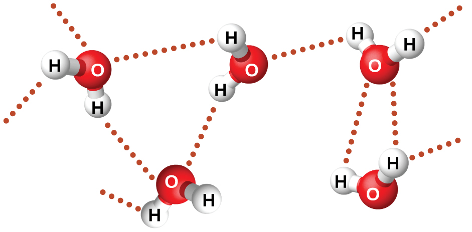

By the end of this section, you will be able to:
* Describe the types of intermolecular forces possible between atoms or molecules in condensed phases (dispersion forces, dipole-dipole attractions, and hydrogen bonding)
* Identify the types of intermolecular forces experienced by specific molecules based on their structures
* Explain the relation between the intermolecular forces present within a substance and the temperatures associated with changes in its physical state

As was the case for gaseous substances, the kinetic molecular theory may be used to explain the behavior of solids and liquids. In the following description, the term *particle* will be used to refer to an atom, molecule, or ion. Note that we will use the popular phrase “intermolecular attraction” to refer to attractive forces between the particles of a substance, regardless of whether these particles are molecules, atoms, or ions.

Consider these two aspects of the molecular-level environments in solid, liquid, and gaseous matter:

* Particles in a solid are tightly packed together and often arranged in a regular pattern; in a liquid, they are close together with no regular arrangement; in a gas, they are far apart with no regular arrangement.
* Particles in a solid vibrate about fixed positions and do not generally move in relation to one another; in a liquid, they move past each other but remain in essentially constant contact; in a gas, they move independently of one another except when they collide.
{: data-bullet-style="bullet"}

The differences in the properties of a solid, liquid, or gas reflect the strengths of the attractive forces between the atoms, molecules, or ions that make up each phase. The phase in which a substance exists depends on the relative extents of its **intermolecular forces**{: data-type="term"} (IMFs) and the kinetic energies (KE) of its molecules. IMFs are the various forces of attraction that may exist between the atoms and molecules of a substance due to electrostatic phenomena, as will be detailed in this module. These forces serve to hold particles close together, whereas the particles’ KE provides the energy required to overcome the attractive forces and thus increase the distance between particles. [\[link\]](#CNX_Chem_10_01_KMTPhases1) illustrates how changes in physical state may be induced by changing the temperature, hence, the average KE, of a given substance.

 ![Three sealed flasks are labeled, &#x201C;Crystalline solid,&#x201D; &#x201C;Liquid,&#x201D; and &#x201C;Gas,&#x201D; from left to right. The first flask holds a cube composed of small spheres sitting on the bottom while the second flask shows a lot of small spheres in the bottom that are spaced a small distance apart from one another and have lines around them to indicate motion. The third flask shows a few spheres spread far from one another with larger lines to indicate motion. There is a right-facing arrow that spans the top of all three flasks. The arrow is labeled, &#x201C;Increasing K E ( temperature ).&#x201D; There is a left-facing arrow that spans the bottom of all three flasks. The arrow is labeled, &#x201C;Increasing I M F.&#x201D;](../resources/CNX_Chem_10_01_KMTPhases1.jpg "Transitions between solid, liquid, and gaseous states of a substance occur when conditions of temperature or pressure favor the associated changes in intermolecular forces. (Note: The space between particles in the gas phase is much greater than shown.)"){: #CNX_Chem_10_01_KMTPhases1}

As an example of the processes depicted in this figure, consider a sample of water. When gaseous water is cooled sufficiently, the attractions between H2O molecules will be capable of holding them together when they come into contact with each other; the gas condenses, forming liquid H2O. For example, liquid water forms on the outside of a cold glass as the water vapor in the air is cooled by the cold glass, as seen in [\[link\]](#CNX_Chem_10_01_WaterPhase).

  on the outside of a cold beverage glass or (b) in the form of fog. (credit a: modification of work by Jenny Downing; credit b: modification of work by Cory Zanker)"){: #CNX_Chem_10_01_WaterPhase}

We can also liquefy many gases by compressing them, if the temperature is not too high. The increased pressure brings the molecules of a gas closer together, such that the attractions between the molecules become strong relative to their KE. Consequently, they form liquids. Butane, C4H10, is the fuel used in disposable lighters and is a gas at standard temperature and pressure. Inside the lighter’s fuel compartment, the butane is compressed to a pressure that results in its condensation to the liquid state, as shown in [\[link\]](#CNX_Chem_10_01_ButanePhase).

 "){: #CNX_Chem_10_01_ButanePhase}

Finally, if the temperature of a liquid becomes sufficiently low, or the pressure on the liquid becomes sufficiently high, the molecules of the liquid no longer have enough KE to overcome the IMF between them, and a solid forms. A more thorough discussion of these and other changes of state, or phase transitions, is provided in a later module of this chapter.

  
Access this [interactive simulation][1] on states of matter, phase transitions, and intermolecular forces. This simulation is useful for visualizing concepts introduced throughout this chapter.

# Forces between Molecules

Under appropriate conditions, the attractions between all gas molecules will cause them to form liquids or solids. This is due to intermolecular forces, not *intra*molecular forces. *Intra*molecular forces are those *within* the molecule that keep the molecule together, for example, the bonds between the atoms. *Inter*molecular forces are the attractions *between* molecules, which determine many of the physical properties of a substance. [\[link\]](#CNX_Chem_10_01_IntravInter) illustrates these different molecular forces. The strengths of these attractive forces vary widely, though usually the IMFs between small molecules are weak compared to the intramolecular forces that bond atoms together within a molecule. For example, to overcome the IMFs in one mole of liquid HCl and convert it into gaseous HCl requires only about 17 kilojoules. However, to break the covalent bonds between the hydrogen and chlorine atoms in one mole of HCl requires about 25 times more energy—430 kilojoules.

 {: #CNX_Chem_10_01_IntravInter}

All of the attractive forces between neutral atoms and molecules are known as **van der Waals forces**{: data-type="term"}, although they are usually referred to more informally as intermolecular attraction. We will consider the various types of IMFs in the next three sections of this module.

# Dispersion Forces

One of the three van der Waals forces is present in all condensed phases, regardless of the nature of the atoms or molecules composing the substance. This attractive force is called the **London dispersion force**{: data-type="term" .no-emphasis} in honor of German-born American physicist Fritz **London**{: data-type="term" .no-emphasis} who, in 1928, first explained it. This force is often referred to as simply the **dispersion force**{: data-type="term"}. Because the electrons of an atom or molecule are in constant motion (or, alternatively, the electron’s location is subject to quantum-mechanical variability), at any moment in time, an atom or molecule can develop a temporary, **instantaneous dipole**{: data-type="term"} if its electrons are distributed asymmetrically. The presence of this dipole can, in turn, distort the electrons of a neighboring atom or molecule, producing an **induced dipole**{: data-type="term"}. These two rapidly fluctuating, temporary dipoles thus result in a relatively weak electrostatic attraction between the species—a so-called dispersion force like that illustrated in [\[link\]](#CNX_Chem_10_01_DispForces).

 ![Two pairs of molecules are shown where each molecule has one larger blue side labeled &#x201C;delta sign, negative sign&#x201D; and a smaller red side labeled &#x201C;delta sign, positive sign.&#x201D; Toward the middle of the both molecules, but still on each distinct side, is a black dot. Between the two images is a dotted line labeled, &#x201C;Attractive force.&#x201D; In the first image, the red and blue sides are labeled, &#x201C;Unequal distribution of electrons.&#x201D; Below both images are brackets. The brackets are labeled, &#x201C;Temporary dipoles.&#x201D;](../resources/CNX_Chem_10_01_DispForces.jpg "Dispersion forces result from the formation of temporary dipoles, as illustrated here for two nonpolar diatomic molecules."){: #CNX_Chem_10_01_DispForces}

Dispersion forces that develop between atoms in different molecules can attract the two molecules to each other. The forces are relatively weak, however, and become significant only when the molecules are very close. Larger and heavier atoms and molecules exhibit stronger dispersion forces than do smaller and lighter atoms and molecules. F2 and Cl2 are gases at room temperature (reflecting weaker attractive forces); Br2 is a liquid, and I2 is a solid (reflecting stronger attractive forces). Trends in observed melting and boiling points for the halogens clearly demonstrate this effect, as seen in [\[link\]](#fs-idp55860464).

<table summary="This table has six rows and five columns. The first row is a header row and it labels each column: &#x201C;Halogen,&#x201D; &#x201C;Molar Mass,&#x201D; &#x201C;Atomic Radius,&#x201D; &#x201C;Melting Point,&#x201D; and &#x201C;Boiling Point.&#x201D; Under the &#x201C;Halogen&#x201D; column are the following: Fluorine, F subscript 2; Chlorine, C l subscript 2; bromine, B r subscript 2; iodine, I subscript 2; astatine, A t subscript 2. Under the &#x201C;Molar Mass&#x201D; column are the following: 38 g / mol; 71 g / mol; 160 g / mol; 254 g / mol; 420 g / mol. Under the &#x201C;Atomic Radius&#x201D; column are the following: 72 p m; 99 p m; 114 p m; 133 p m; 150 p m. Under the &#x201C;Melting Point&#x201D; column are the following: 53 K; 172 K; 266 K; 387 K; and 575 K. Under the &#x201C;Boiling Point&#x201D; column are the following: 85 K; 238 K; 332 K; 457 K; and 610 K." class="span-all"><thead>
<tr valign="middle">
<th colspan="5">Melting and Boiling Points of the Halogens</th>
</tr>
<tr valign="middle">
<th>Halogen</th>
<th>Molar Mass</th>
<th>Atomic Radius</th>
<th>Melting Point</th>
<th>Boiling Point</th>
</tr>
</thead><tbody>
<tr valign="middle">
<td>fluorine, F2</td>
<td>38 g/mol</td>
<td>72 pm</td>
<td>53 K</td>
<td>85 K</td>
</tr>
<tr valign="middle">
<td>chlorine, Cl2</td>
<td>71 g/mol</td>
<td>99 pm</td>
<td>172 K</td>
<td>238 K</td>
</tr>
<tr valign="middle">
<td>bromine, Br2</td>
<td>160 g/mol</td>
<td>114 pm</td>
<td>266 K</td>
<td>332 K</td>
</tr>
<tr valign="middle">
<td>iodine, I2</td>
<td>254 g/mol</td>
<td>133 pm</td>
<td>387 K</td>
<td>457 K</td>
</tr>
<tr valign="middle">
<td>astatine, At2</td>
<td>420 g/mol</td>
<td>150 pm</td>
<td>575 K</td>
<td>610 K</td>
</tr>
</tbody></table>

The increase in melting and boiling points with increasing atomic/molecular size may be rationalized by considering how the strength of dispersion forces is affected by the electronic structure of the atoms or molecules in the substance. In a larger atom, the valence electrons are, on average, farther from the nuclei than in a smaller atom. Thus, they are less tightly held and can more easily form the temporary dipoles that produce the attraction. The measure of how easy or difficult it is for another electrostatic charge (for example, a nearby ion or polar molecule) to distort a molecule’s charge distribution (its electron cloud) is known as **polarizability**{: data-type="term"}. A molecule that has a charge cloud that is easily distorted is said to be very polarizable and will have large dispersion forces; one with a charge cloud that is difficult to distort is not very polarizable and will have small dispersion forces.

London Forces and Their Effects Order the following compounds of a group 14 element and hydrogen from lowest to highest boiling point: CH4, SiH4, GeH4, and SnH4. Explain your reasoning.

Solution Applying the skills acquired in the chapter on chemical bonding and molecular geometry, all of these compounds are predicted to be nonpolar, so they may experience only dispersion forces: the smaller the molecule, the less polarizable and the weaker the dispersion forces; the larger the molecule, the larger the dispersion forces. The molar masses of CH4, SiH4, GeH4, and SnH4 are approximately 16 g/mol, 32 g/mol, 77 g/mol, and 123 g/mol, respectively. Therefore, CH4 is expected to have the lowest boiling point and SnH4 the highest boiling point. The ordering from lowest to highest boiling point is expected to be CH4 &lt; SiH4 &lt; GeH4 &lt; SnH4.

A graph of the actual boiling points of these compounds versus the period of the group 14 element shows this prediction to be correct:

 ![A line graph, titled &#x201C;Carbon Family,&#x201D; is shown where the y-axis is labeled &#x201C;Temperature, ( degree sign C )&#x201D; and has values of &#x201C;negative 200&#x201D; to &#x201C;negative 40&#x201D; from bottom to top in increments of 20. The x-axis is labeled &#x201C;Period&#x201D; and has values of &#x201C;0&#x201D; to &#x201C;5&#x201D; in increments of 1. The first point on the graph is labeled &#x201C;C H subscript 4&#x201D; and is at point &#x201C;2, negative 160.&#x201D; The second point on the graph is labeled &#x201C;S i H subscript 4&#x201D; and is at point &#x201C;3, negative 120&#x201D; while the third point on the graph is labeled &#x201C;G e H subscript 4&#x201D; and is at point &#x201C;4, negative 100.&#x201D; The fourth point on the graph is labeled &#x201C;S n H subscript 4&#x201D; and is at point &#x201C;5, negative 60.&#x201D;](../resources/CNX_Chem_10_01_BoilPoints_img.jpg) 
Check Your Learning Order the following hydrocarbons from lowest to highest boiling point: C2H6, C3H8, and C4H10.

Answer:

C2H6 &lt; C3H8 &lt; C4H10. All of these compounds are nonpolar and only have London dispersion forces: the larger the molecule, the larger the dispersion forces and the higher the boiling point. The ordering from lowest to highest boiling point is therefore C2H6 &lt; C3H8 &lt; C4H10.

The shapes of molecules also affect the magnitudes of the dispersion forces between them. For example, boiling points for the isomers *n*-pentane, isopentane, and neopentane (shown in [\[link\]](#CNX_Chem_10_01_PentIso)) are 36 °C, 27 °C, and 9.5 °C, respectively. Even though these compounds are composed of molecules with the same chemical formula, C5H12, the difference in boiling points suggests that dispersion forces in the liquid phase are different, being greatest for *n*-pentane and least for neopentane. The elongated shape of *n*-pentane provides a greater surface area available for contact between molecules, resulting in correspondingly stronger dispersion forces. The more compact shape of isopentane offers a smaller surface area available for intermolecular contact and, therefore, weaker dispersion forces. Neopentane molecules are the most compact of the three, offering the least available surface area for intermolecular contact and, hence, the weakest dispersion forces. This behavior is analogous to the connections that may be formed between strips of VELCRO brand fasteners: the greater the area of the strip’s contact, the stronger the connection.

 ![Three images of molecules are shown. The first shows a cluster of large, gray spheres each bonded together and to several smaller, white spheres. There is a gray, jagged line and then the mirror image of the first cluster of spheres is shown. Above these two clusters is the label, &#x201C;Small contact area, weakest attraction,&#x201D; and below is the label, &#x201C;neopentane boiling point: 9.5 degrees C.&#x201D; The second shows a chain of three gray spheres bonded by the middle sphere to a fourth gray sphere. Each gray sphere is bonded to several smaller, white spheres. There is a jagged, gray line and then the mirror image of the first chain appears. Above these two chains is the label, &#x201C;Less surface area, less attraction,&#x201D; and below is the label, &#x201C;isopentane boiling point: 27 degrees C.&#x201D; The third image shows a chain of five gray spheres bonded together and to several smaller, white spheres. There is a jagged gray line and then the mirror image of the first chain appears. Above these chains is the label, &#x201C;Large contact area, strong attraction,&#x201D; and below is the label, &#x201C;n-pentane boiling point 36 degrees C.&#x201D;](../resources/CNX_Chem_10_01_PentIso.jpg "The strength of the dispersion forces increases with the contact area between molecules, as demonstrated by the boiling points of these pentane isomers."){: #CNX_Chem_10_01_PentIso}

Geckos and Intermolecular Forces

Geckos have an amazing ability to adhere to most surfaces. They can quickly run up smooth walls and across ceilings that have no toe-holds, and they do this without having suction cups or a sticky substance on their toes. And while a gecko can lift its feet easily as it walks along a surface, if you attempt to pick it up, it sticks to the surface. How are geckos (as well as spiders and some other insects) able to do this? Although this phenomenon has been investigated for hundreds of years, scientists only recently uncovered the details of the process that allows geckos’ feet to behave this way.

Geckos’ toes are covered with hundreds of thousands of tiny hairs known as *setae*, with each seta, in turn, branching into hundreds of tiny, flat, triangular tips called *spatulae*. The huge numbers of spatulae on its setae provide a gecko, shown in [\[link\]](#CNX_Chem_10_01_Geckos), with a large total surface area for sticking to a surface. In 2000, Kellar **Autumn**{: data-type="term" .no-emphasis}, who leads a multi-institutional gecko research team, found that geckos adhered equally well to both polar silicon dioxide and nonpolar gallium arsenide. This proved that geckos stick to surfaces because of dispersion forces—weak intermolecular attractions arising from temporary, synchronized charge distributions between adjacent molecules. Although dispersion forces are very weak, the total attraction over millions of spatulae is large enough to support many times the gecko’s weight.

In 2014, two scientists developed a model to explain how geckos can rapidly transition from “sticky” to “non-sticky.” Alex **Greaney**{: data-type="term" .no-emphasis} and Congcong **Hu**{: data-type="term" .no-emphasis} at Oregon State University described how geckos can achieve this by changing the angle between their spatulae and the surface. Geckos’ feet, which are normally nonsticky, become sticky when a small shear force is applied. By curling and uncurling their toes, geckos can alternate between sticking and unsticking from a surface, and thus easily move across it. Further investigations may eventually lead to the development of better adhesives and other applications.

, which branch into many triangular tips (spatulae). Geckos adhere to surfaces because of van der Waals attractions between the surface and a gecko&#x2019;s millions of spatulae. By changing how the spatulae contact the surface, geckos can turn their stickiness &#x201C;on&#x201D; and &#x201C;off.&#x201D; (credit photo: modification of work by &#x201C;JC*+A!&#x201D;/Flickr)"){: #CNX_Chem_10_01_Geckos}

  
Watch this [video][2] to learn more about Kellar Autumn’s research that determined that van der Waals forces are responsible for a gecko’s ability to cling and climb.

# Dipole-Dipole Attractions

Recall from the chapter on chemical bonding and molecular geometry that *polar* molecules have a partial positive charge on one side and a partial negative charge on the other side of the molecule—a separation of charge called a *dipole*. Consider a polar molecule such as hydrogen chloride, HCl. In the HCl molecule, the more electronegative Cl atom bears the partial negative charge, whereas the less electronegative H atom bears the partial positive charge. An attractive force between HCl molecules results from the attraction between the positive end of one HCl molecule and the negative end of another. This attractive force is called a **dipole-dipole attraction**{: data-type="term"}—the electrostatic force between the partially positive end of one polar molecule and the partially negative end of another, as illustrated in [\[link\]](#CNX_Chem_10_01_DipDip).

 ![Two pairs of molecules are shown where each molecule has one larger blue side labeled &#x201C;delta sign, negative sign&#x201D; and a smaller red side labeled &#x201C;delta sign, positive sign. In the first pair, the red sides of the two molecules both face to the left and the blue side to the right. A horizontal dotted line lies in between the two. In the second pair, the molecules face up and down, with the red and blue ends aligning. A horizontal dotted line lies between the red and blue ends facing upward and another lies between the red and blue ends facing downward.](../resources/CNX_Chem_10_01_DipDip.jpg "This image shows two arrangements of polar molecules, such as HCl, that allow an attraction between the partial negative end of one molecule and the partial positive end of another."){: #CNX_Chem_10_01_DipDip}

The effect of a dipole-dipole attraction is apparent when we compare the properties of HCl molecules to nonpolar F2 molecules. Both HCl and F2 consist of the same number of atoms and have approximately the same molecular mass. At a temperature of 150 K, molecules of both substances would have the same average KE. However, the dipole-dipole attractions between HCl molecules are sufficient to cause them to “stick together” to form a liquid, whereas the relatively weaker dispersion forces between nonpolar F2 molecules are not, and so this substance is gaseous at this temperature. The higher normal boiling point of HCl (188 K) compared to F2 (85 K) is a reflection of the greater strength of dipole-dipole attractions between HCl molecules, compared to the attractions between nonpolar F2 molecules. We will often use values such as boiling or freezing points, or enthalpies of vaporization or fusion, as indicators of the relative strengths of IMFs of attraction present within different substances.

Dipole-Dipole Forces and Their Effects Predict which will have the higher boiling point: N2 or CO. Explain your reasoning.

Solution CO and N2 are both diatomic molecules with masses of about 28 amu, so they experience similar London dispersion forces. Because CO is a polar molecule, it experiences dipole-dipole attractions. Because N2 is nonpolar, its molecules cannot exhibit dipole-dipole attractions. The dipole-dipole attractions between CO molecules are comparably stronger than the dispersion forces between nonpolar N2 molecules, so CO is expected to have the higher boiling point.

Check Your Learning Predict which will have the higher boiling point: ICl or Br2. Explain your reasoning.

Answer:

ICl. ICl and Br2 have similar masses (~160 amu) and therefore experience similar London dispersion forces. ICl is polar and thus also exhibits dipole-dipole attractions; Br2 is nonpolar and does not. The relatively stronger dipole-dipole attractions require more energy to overcome, so ICl will have the higher boiling point.

# Hydrogen Bonding

Nitrosyl fluoride (ONF, molecular mass 49 amu) is a gas at room temperature. Water (H2O, molecular mass 18 amu) is a liquid, even though it has a lower molecular mass. We clearly cannot attribute this difference between the two compounds to dispersion forces. Both molecules have about the same shape and ONF is the heavier and larger molecule. It is, therefore, expected to experience more significant dispersion forces. Additionally, we cannot attribute this difference in boiling points to differences in the dipole moments of the molecules. Both molecules are polar and exhibit comparable dipole moments. The large difference between the boiling points is due to a particularly strong dipole-dipole attraction that may occur when a molecule contains a hydrogen atom bonded to a fluorine, oxygen, or nitrogen atom (the three most electronegative elements). The very large difference in electronegativity between the H atom (2.1) and the atom to which it is bonded (4.0 for an F atom, 3.5 for an O atom, or 3.0 for a N atom), combined with the very small size of a H atom and the relatively small sizes of F, O, or N atoms, leads to *highly concentrated partial charges* with these atoms. Molecules with F-H, O-H, or N-H moieties are very strongly attracted to similar moieties in nearby molecules, a particularly strong type of dipole-dipole attraction called **hydrogen bonding**{: data-type="term"}. Examples of hydrogen bonds include HF⋯HF, H2O⋯HOH, and H3N⋯HNH2, in which the hydrogen bonds are denoted by dots. [\[link\]](#CNX_Chem_10_01_HBonding) illustrates hydrogen bonding between water molecules.

 {: #CNX_Chem_10_01_HBonding}

Despite use of the word “bond,” keep in mind that hydrogen bonds are *intermolecular* attractive forces, not *intramolecular* attractive forces (covalent bonds). Hydrogen bonds are much weaker than covalent bonds, only about 5 to 10% as strong, but are generally much stronger than other dipole-dipole attractions and dispersion forces.

Hydrogen bonds have a pronounced effect on the properties of condensed phases (liquids and solids). For example, consider the trends in boiling points for the binary hydrides of group 15 (NH3, PH3, AsH3, and SbH3), group 16 hydrides (H2O, H2S, H2Se, and H2Te), and group 17 hydrides (HF, HCl, HBr, and HI). The boiling points of the heaviest three hydrides for each group are plotted in [\[link\]](#CNX_Chem_10_01_HydrideBP1). As we progress down any of these groups, the polarities of the molecules decrease slightly, whereas the sizes of the molecules increase substantially. The effect of increasingly stronger dispersion forces dominates that of increasingly weaker dipole-dipole attractions, and the boiling points are observed to increase steadily.

 ![A line graph is shown where the y-axis is labeled &#x201C;Boiling point (, degree sign, C )&#x201D; and has values of &#x201C; negative 150&#x201D; to &#x201C;150&#x201D; from bottom to top in increments of 50. The x-axis is labeled &#x201C;Period&#x201D; and has values of &#x201C;0&#x201D; to &#x201C;5&#x201D; in increments of 1. Three lines are shown on the graph and are labeled in the legend. The red line is labeled as &#x201C;halogen family,&#x201D; the blue is &#x201C;oxygen family&#x201D; and the green is &#x201C;nitrogen family.&#x201D; The first point on the red line is labeled &#x201C;question mark&#x201D; and is at point &#x201C;2, negative 120&#x201D;. The second point on the line is labeled &#x201C;H C l&#x201D; and is at point &#x201C;3, negative 80&#x201D; while the third point on the line is labeled &#x201C;H B r&#x201D; and is at point &#x201C;4, negative 60&#x201D;. The fourth point on the line is labeled &#x201C;H I&#x201D; and is at point &#x201C;5, negative 40.&#x201D; The first point on the green line is labeled &#x201C;question mark&#x201D; and is at point &#x201C;2, negative 125.&#x201D; The second point on the line is labeled &#x201C;P H, subscript 3&#x201D; and is at point &#x201C;3, negative 80&#x201D; while the third point on the line is labeled &#x201C;A s H, subscript 3&#x201D; and is at point &#x201C;4, negative 55.&#x201D; The fourth point on the line is labeled &#x201C;S b H, subscript 3&#x201D; and is at point &#x201C;5, negative 10.&#x201D; The first point on the blue line is labeled &#x201C;question mark&#x201D; and is at point &#x201C;2, negative 80.&#x201D; The second point on the line is labeled &#x201C;H, subscript 2, S&#x201D; and is at point &#x201C;3, negative 55&#x201D; while the third point on the line is labeled &#x201C;H, subscript 2, S e&#x201D; and is at point &#x201C;4, negative 45.&#x201D; The fourth point on the line is labeled &#x201C;H, subscript 2, T e&#x201D; and is at point &#x201C;5, negative 3.&#x201D;](../resources/CNX_Chem_10_01_HydrideBP1.jpg "For the group 15, 16, and 17 hydrides, the boiling points for each class of compounds increase with increasing molecular mass for elements in periods 3, 4, and 5."){: #CNX_Chem_10_01_HydrideBP1}

If we use this trend to predict the boiling points for the lightest hydride for each group, we would expect NH3 to boil at about −120 °C, H2O to boil at about −80 °C, and HF to boil at about −110 °C. However, when we measure the boiling points for these compounds, we find that they are dramatically higher than the trends would predict, as shown in [\[link\]](#CNX_Chem_10_01_HydrideBP2). The stark contrast between our naïve predictions and reality provides compelling evidence for the strength of hydrogen bonding.

 ![A line graph is shown where the y-axis is labeled &#x201C;Boiling point, ( degree sign, C )&#x201D; and has values of &#x201C;negative 150&#x201D; to &#x201C;150&#x201D; from bottom to top in increments of 50. The x-axis is labeled &#x201C;Period&#x201D; and has values of &#x201C;0&#x201D; to &#x201C;5&#x201D; in increments of 1. Three lines are shown on the graph and are labeled in the legend. The red line is labeled as &#x201C;halogen family,&#x201D; the blue is &#x201C;oxygen family&#x201D; and the green is &#x201C;nitrogen family.&#x201D; The first point on the red line is labeled &#x201C;H F&#x201D; and is at point &#x201C;2, 25.&#x201D; The second point on the line is labeled &#x201C;H C l&#x201D; and is at point &#x201C;3, negative 80&#x201D; while the third point on the line is labeled &#x201C;H B r&#x201D; and is at point &#x201C;4, negative 60.&#x201D; The fourth point on the line is labeled &#x201C;H I&#x201D; and is at point &#x201C;5, negative 40.&#x201D; The first point on the green line is labeled &#x201C;N H, subscript 3&#x201D; and is at point &#x201C;2, negative 40.&#x201D; The second point on the line is labeled &#x201C;P H, subscript 3&#x201D; and is at point &#x201C;3, negative 80&#x201D; while the third point on the line is labeled &#x201C;A s H, subscript 3&#x201D; and is at point &#x201C;4, negative 55.&#x201D; The fourth point on the line is labeled &#x201C;S b H, subscript 3&#x201D; and is at point &#x201C;5, negative 10.&#x201D; The first point on the blue line is labeled &#x201C;H, subscript 2, O&#x201D; and is at point &#x201C;2, 100.&#x201D; The second point on the line is labeled &#x201C;H, subscript 2, S&#x201D; and is at point &#x201C;3, negative 55&#x201D; while the third point on the line is labeled &#x201C;H, subscript 2, S e&#x201D; and is at point &#x201C;4, negative 45.&#x201D; The fourth point on the line is labeled &#x201C;H, subscript 2, T e&#x201D; and is at point &#x201C;5, negative 3.&#x201D;](../resources/CNX_Chem_10_01_HydrideBP2.jpg "In comparison to periods 3&#x2212;5, the binary hydrides of period 2 elements in groups 17, 16 and 15 (F, O and N, respectively) exhibit anomalously high boiling points due to hydrogen bonding."){: #CNX_Chem_10_01_HydrideBP2}

Effect of Hydrogen Bonding on Boiling Points Consider the compounds dimethylether (CH3OCH3), ethanol (CH3CH2OH), and propane (CH3CH2CH3). Their boiling points, not necessarily in order, are −42.1 °C, −24.8 °C, and 78.4 °C. Match each compound with its boiling point. Explain your reasoning.

Solution The VSEPR-predicted shapes of CH3OCH3, CH3CH2OH, and CH3CH2CH3 are similar, as are their molar masses (46 g/mol, 46 g/mol, and 44 g/mol, respectively), so they will exhibit similar dispersion forces. Since CH3CH2CH3 is nonpolar, it may exhibit *only* dispersion forces. Because CH3OCH3 is polar, it will also experience dipole-dipole attractions. Finally, CH3CH2OH has an −OH group, and so it will experience the uniquely strong dipole-dipole attraction known as hydrogen bonding. So the ordering in terms of strength of IMFs, and thus boiling points, is CH3CH2CH3 &lt; CH3OCH3 &lt; CH3CH2OH. The boiling point of propane is −42.1 °C, the boiling point of dimethylether is −24.8 °C, and the boiling point of ethanol is 78.5 °C.

Check Your Learning Ethane (CH3CH3) has a melting point of −183 °C and a boiling point of −89 °C. Predict the melting and boiling points for methylamine (CH3NH2). Explain your reasoning.

Answer:

The melting point and boiling point for methylamine are predicted to be significantly greater than those of ethane. CH3CH3 and CH3NH2 are similar in size and mass, but methylamine possesses an −NH group and therefore may exhibit hydrogen bonding. This greatly increases its IMFs, and therefore its melting and boiling points. It is difficult to predict values, but the known values are a melting point of −93 °C and a boiling point of −6 °C.

Hydrogen Bonding and DNA

Deoxyribonucleic acid (DNA) is found in every living organism and contains the genetic information that determines the organism’s characteristics, provides the blueprint for making the proteins necessary for life, and serves as a template to pass this information on to the organism’s offspring. A DNA molecule consists of two (anti-)parallel chains of repeating nucleotides, which form its well-known double helical structure, as shown in [\[link\]](#CNX_Chem_10_01_DNA).

![Two images are shown. The first lies on the left side of the page and shows a helical structure like a twisted ladder where the rungs of the ladder, labeled &#x201C;Base pair&#x201D; are red, yellow, green and blue paired bars. The red and yellow bars, which are always paired together, are labeled in the legend, which is titled &#x201C;Nitrogenous bases&#x201D; as &#x201C;adenine&#x201D; and &#x201C;thymine,&#x201D; respectively. The blue and green bars, which are always paired together, are labeled in the legend as &#x201C;guanine&#x201D; and &#x201C;cytosine,&#x201D; respectively. At the top of the helical structure, the left-hand side rail, or &#x201C;Sugar, dash, phosphate backbone,&#x201D; is labeled as &#x201C;3, prime&#x201D; while the right is labeled as &#x201C;5, prime.&#x201D; These labels are reversed at the bottom of the helix. To the right of the page is a large Lewis structure. The top left corner of this structure, labeled &#x201C;5, prime,&#x201D; shows a phosphorus atom single bonded to three oxygen atoms, one of which has a superscripted negative charge, and double bonded to a fourth oxygen atom. One of the single bonded oxygen atoms is single bonded to the left corner of a five-membered ring with an oxygen atom at its top point and which is single bonded to an oxygen atom on the bottom left. This oxygen atom is single bonded to a phosphorus atom that is single bonded to two other hydrogen atoms and double bonded to a fourth oxygen atom. The lower left of these oxygen atoms is single bonded to another oxygen atom that is single bonded to a five-membered ring with an oxygen in the upper bonding site. The bottom left of this ring has a hydroxyl group attached to it while the upper right carbon is single bonded to a nitrogen atom that is part of a five-membered ring bonded to a six-membered ring. Both of these rings have points of unsaturation and nitrogen atoms bonded into their structures. On the right side of the six-membered ring are two single bonded amine groups and a double bonded oxygen. Three separate dotted lines extend from these sites to corresponding sites on a second six-membered ring. This ring has points of unsaturation and a nitrogen atom in the bottom right bonding position that is single bonded to a five-membered ring on the right side of the image. This ring is single bonded to a carbon that is single bonded to an oxygen that is single bonded to a phosphorus. The phosphorus is single bonded to two other oxygen atoms and double bonded to a fourth oxygen atom. This group is labeled &#x201C;5, prime.&#x201D; The five-membered ring is also bonded on the top side to an oxygen that is bonded to a phosphorus single bonded to two other oxygen atoms and double bonded to a fourth oxygen atom. The upper left oxygen of this group is single bonded to a carbon that is single bonded to a five-membered ring with an oxygen in the bottom bonding position. This ring has a hydroxyl group on its upper right side that is labeled &#x201C;3, prime&#x201D; and is bonded on the left side to a nitrogen that is a member of a five-membered ring. This ring is bonded to a six-membered ring and both have points of unsaturation. This ring has a nitrogen on the left side, as well as an amine group, that have two dotted lines leading from them to an oxygen and amine group on a six membered ring. These dotted lines are labeled &#x201C;Hydrogen bonds.&#x201D; The six membered ring also has a double bonded oxygen on its lower side and a nitrogen atom on its left side that is single bonded to a five-membered ring. This ring connects to the two phosphate groups mentioned at the start of this to form a large circle. The name &#x201C;guanine&#x201D; is written below the lower left side of this image while the name &#x201C;cytosine&#x201D; is written on the lower right. The name &#x201C;thymine&#x201D; is written above the right side of the image and &#x201C;adenine&#x201D; is written on the top right. Three sections are indicated below the images where the left is labeled &#x201C;Sugar, dash, phosphate backbone,&#x201D; the middle is labeled &#x201C;Bases&#x201D; and the right is labeled &#x201C;Sugar, dash, phosphate backbone.&#x201D;](../resources/CNX_Chem_10_01_DNA.jpg "Two separate DNA molecules form a double-stranded helix in which the molecules are held together via hydrogen bonding. (credit: modification of work by Jerome Walker, Dennis Myts)"){: #CNX_Chem_10_01_DNA}

Each nucleotide contains a (deoxyribose) sugar bound to a phosphate group on one side, and one of four nitrogenous bases on the other. Two of the bases, cytosine (C) and thymine (T), are single-ringed structures known as pyrimidines. The other two, adenine (A) and guanine (G), are double-ringed structures called purines. These bases form complementary base pairs consisting of one purine and one pyrimidine, with adenine pairing with thymine, and cytosine with guanine. Each base pair is held together by hydrogen bonding. A and T share two hydrogen bonds, C and G share three, and both pairings have a similar shape and structure [\[link\]](#CNX_Chem_10_01_DNA2).

![A large Lewis structure is shown. The top left corner of this structure, labeled &#x201C;5, prime,&#x201D; shows a phosphorus atom single bonded to three oxygen atoms, one of which has a superscripted negative charge, and double bonded to a fourth oxygen atom. One of the single bonded oxygen atoms is single bonded to the left corner of a five-membered ring with an oxygen atom at its top point and which is single bonded to an oxygen atom on the bottom left. This oxygen atom is single bonded to a phosphorus atom that is single bonded to two other hydrogen atoms and double bonded to a fourth oxygen atom. The lower left of these oxygen atoms is single bonded to another oxygen atom that is single bonded to a five-membered ring with an oxygen in the upper bonding site. The bottom left of this ring has a hydroxyl group attached to it while the upper right carbon is single bonded to a nitrogen atom that is part of a five-membered ring bonded to a six-membered ring. Both of these rings have points of unsaturation and nitrogen atoms bonded into their structures. On the right side of the six-membered ring are two single bonded amine groups and a double bonded oxygen. Three separate dotted lines extend from these sites to corresponding sites on a second six-membered ring. This ring has points of unsaturation and a nitrogen atom in the bottom right bonding position that is single bonded to a five-membered ring on the right side of the image. This ring is single bonded to a carbon that is single bonded to an oxygen that is single bonded to a phosphorus. The phosphorus is single bonded to two other oxygen atoms and double bonded to a fourth oxygen atom. This group is labeled &#x201C;5, prime.&#x201D; The five-membered ring is also bonded on the top side to an oxygen that is bonded to a phosphorus single bonded to two other oxygen atoms and double bonded to a fourth oxygen atom. The upper left oxygen of this group is single bonded to a carbon that is single bonded to a five-membered ring with an oxygen in the bottom bonding position. This ring has a hydroxyl group on its upper right side that is labeled &#x201C;3, prime&#x201D; and is bonded on the left side to a nitrogen that is a member of a five-membered ring. This ring is bonded to a six-membered ring and both have points of unsaturation. This ring has a nitrogen on the left side, as well as an amine group, that have two dotted lines leading from them to an oxygen and amine group on a six membered ring. These dotted lines are labeled &#x201C;Hydrogen bonds.&#x201D; The six membered ring also has a double bonded oxygen on its lower side and a nitrogen atom on its left side that is single bonded to a five-membered ring. This ring connects to the two phosphate groups mentioned at the start of this to form a large circle. The name &#x201C;guanine&#x201D; is written below the lower left side of this image while the name &#x201C;cytosine&#x201D; is written on the lower right. The name &#x201C;thymine&#x201D; is written above the right side of the image and &#x201C;adenine&#x201D; is written on the top right. Three sections are indicated below the images where the left is labeled &#x201C;Sugar, dash, phosphate backbone,&#x201D; the middle is labeled &#x201C;Bases&#x201D; and the right is labeled &#x201C;Sugar, dash, phosphate backbone.&#x201D;](../resources/CNX_Chem_10_01_DNA2.jpg "The geometries of the base molecules result in maximum hydrogen bonding between adenine and thymine (AT) and between guanine and cytosine (GC), so-called &#x201C;complementary base pairs.&#x201D;"){: #CNX_Chem_10_01_DNA2}

The cumulative effect of millions of hydrogen bonds effectively holds the two strands of DNA together. Importantly, the two strands of DNA can relatively easily “unzip” down the middle since hydrogen bonds are relatively weak compared to the covalent bonds that hold the atoms of the individual DNA molecules together. This allows both strands to function as a template for replication.

# Key Concepts and Summary

The physical properties of condensed matter (liquids and solids) can be explained in terms of the kinetic molecular theory. In a liquid, intermolecular attractive forces hold the molecules in contact, although they still have sufficient KE to move past each other.

Intermolecular attractive forces, collectively referred to as van der Waals forces, are responsible for the behavior of liquids and solids and are electrostatic in nature. Dipole-dipole attractions result from the electrostatic attraction of the partial negative end of one dipolar molecule for the partial positive end of another. The temporary dipole that results from the motion of the electrons in an atom can induce a dipole in an adjacent atom and give rise to the London dispersion force. London forces increase with increasing molecular size. Hydrogen bonds are a special type of dipole-dipole attraction that results when hydrogen is bonded to one of the three most electronegative elements: F, O, or N.

# Chemistry End of Chapter Exercises

In terms of their bulk properties, how do liquids and solids differ? How are they similar?

Liquids and solids are similar in that they are matter composed of atoms, ions, or molecules. They are incompressible and have similar densities that are both much larger than those of gases. They are different in that liquids have no fixed shape, and solids are rigid.

In terms of the kinetic molecular theory, in what ways are liquids similar to solids? In what ways are liquids different from solids?

In terms of the kinetic molecular theory, in what ways are liquids similar to gases? In what ways are liquids different from gases?

They are similar in that the atoms or molecules are free to move from one position to another. They differ in that the particles of a liquid are confined to the shape of the vessel in which they are placed. In contrast, a gas will expand without limit to fill the space into which it is placed.

Explain why liquids assume the shape of any container into which they are poured, whereas solids are rigid and retain their shape.

What is the evidence that all neutral atoms and molecules exert attractive forces on each other?

All atoms and molecules will condense into a liquid or solid in which the attractive forces exceed the kinetic energy of the molecules, at sufficiently low temperature.

Open the [PhET States of Matter Simulation][1] to answer the following questions:

(a) Select the Solid, Liquid, Gas tab. Explore by selecting different substances, heating and cooling the systems, and changing the state. What similarities do you notice between the four substances for each phase (solid, liquid, gas)? What differences do you notice?

(b) For each substance, select each of the states and record the given temperatures. How do the given temperatures for each state correlate with the strengths of their intermolecular attractions? Explain.

(c) Select the Interaction Potential tab, and use the default neon atoms. Move the Ne atom on the right and observe how the potential energy changes. Select the Total Force button, and move the Ne atom as before. When is the total force on each atom attractive and large enough to matter? Then select the Component Forces button, and move the Ne atom. When do the attractive (van der Waals) and repulsive (electron overlap) forces balance? How does this relate to the potential energy versus the distance between atoms graph? Explain.

Define the following and give an example of each:

(a) dispersion force

(b) dipole-dipole attraction

(c) hydrogen bond

(a) Dispersion forces occur as an atom develops a temporary dipole moment when its electrons are distributed asymmetrically about the nucleus. This structure is more prevalent in large atoms such as argon or radon. A second atom can then be distorted by the appearance of the dipole in the first atom. The electrons of the second atom are attracted toward the positive end of the first atom, which sets up a dipole in the second atom. The net result is rapidly fluctuating, temporary dipoles that attract one another (example: Ar). (b) A dipole-dipole attraction is a force that results from an electrostatic attraction of the positive end of one polar molecule for the negative end of another polar molecule (example: ICI molecules attract one another by dipole-dipole interaction). (c) Hydrogen bonds form whenever a hydrogen atom is bonded to one of the more electronegative atoms, such as a fluorine, oxygen, nitrogen, or chlorine atom. The electrostatic attraction between the partially positive hydrogen atom in one molecule and the partially negative atom in another molecule gives rise to a strong dipole-dipole interaction called a hydrogen bond (example: <math xmlns="http://www.w3.org/1998/Math/MathML"><mrow><mtext>HF</mtext><mtext>⋯</mtext><mtext>HF</mtext><mo stretchy="false">).</mo></mrow></math>

The types of intermolecular forces in a substance are identical whether it is a solid, a liquid, or a gas. Why then does a substance change phase from a gas to a liquid or to a solid?

Why do the boiling points of the noble gases increase in the order He &lt; Ne &lt; Ar &lt; Kr &lt; Xe?

The London forces typically increase as the number of electrons increase.

Neon and HF have approximately the same molecular masses.

(a) Explain why the boiling points of Neon and HF differ.

(b) Compare the change in the boiling points of Ne, Ar, Kr, and Xe with the change of the boiling points of HF, HCl, HBr, and HI, and explain the difference between the changes with increasing atomic or molecular mass.

Arrange each of the following sets of compounds in order of increasing boiling point temperature:

(a) HCl, H2O, SiH4

(b) F2, Cl2, Br2

(c) CH4, C2H6, C3H8

(d) O2, NO, N2

(a) SiH4 &lt; HCl &lt; H2O; (b) F2 &lt; Cl2 &lt; Br2; (c) CH4 &lt; C2H6 &lt; C3H8; (d) N2 &lt; O2 &lt; NO

The molecular mass of butanol, C4H9OH, is 74.14; that of ethylene glycol, CH2(OH)CH2OH, is 62.08, yet their boiling points are 117.2 °C and 174 °C, respectively. Explain the reason for the difference.

On the basis of intermolecular attractions, explain the differences in the boiling points of *n*–butane (−1 °C) and chloroethane (12 °C), which have similar molar masses.

Only rather small dipole-dipole interactions from C-H bonds are available to hold *n*-butane in the liquid state. Chloroethane, however, has rather large dipole interactions because of the Cl-C bond; the interaction is therefore stronger, leading to a higher boiling point.

On the basis of dipole moments and/or hydrogen bonding, explain in a qualitative way the differences in the boiling points of acetone (56.2 °C) and 1-propanol (97.4 °C), which have similar molar masses.

The melting point of H2O(*s*) is 0 °C. Would you expect the melting point of H2S(*s*) to be −85 °C, 0 °C, or 185 °C? Explain your answer.

−85 °C. Water has stronger hydrogen bonds so it melts at a higher temperature.

Silane (SiH4), phosphine (PH3), and hydrogen sulfide (H2S) melt at −185 °C, −133 °C, and −85 °C, respectively. What does this suggest about the polar character and intermolecular attractions of the three compounds?

Explain why a hydrogen bond between two water molecules is weaker than a hydrogen bond between two hydrogen fluoride molecules.

The hydrogen bond between two hydrogen fluoride molecules is stronger than that between two water molecules because the electronegativity of F is greater than that of O. Consequently, the partial negative charge on F is greater than that on O. The hydrogen bond between the partially positive H and the larger partially negative F will be stronger than that formed between H and O.

Under certain conditions, molecules of acetic acid, CH3COOH, form “dimers,” pairs of acetic acid molecules held together by strong intermolecular attractions:

  
Draw a dimer of acetic acid, showing how two CH3COOH molecules are held together, and stating the type of IMF that is responsible.

Proteins are chains of amino acids that can form in a variety of arrangements, one of which is a helix. What kind of IMF is responsible for holding the protein strand in this shape? On the protein image, show the locations of the IMFs that hold the protein together:

 ![Two turns of a helical structure are shown horizontally. Three Lewis structures are superimposed on the helix. The first shows horizontally stacked dashes next to an oxygen atom, with three dots connecting to a hydrogen atom, and a single dash connecting the hydrogen atom to a nitrogen atom. The second shows a carbon atom double bonded to an oxygen atom, then three dots connecting to a hydrogen atom which is bonded to a nitrogen atom. The third shows a carbon atom double bonded to an oxygen atom with three dots extending to the right of the oxygen atom.](../resources/CNX_Chem_10_01_Aminacidch_img.jpg) 

H-bonding is the principle IMF holding the DNA strands together. The H-bonding is between the <math xmlns="http://www.w3.org/1998/Math/MathML"><mrow><mtext>N</mtext><mo>−</mo><mtext>H</mtext></mrow></math>

 and <math xmlns="http://www.w3.org/1998/Math/MathML"><mrow><mtext>C</mtext><mo>=</mo><mtext>O</mtext><mo>.</mo></mrow></math>

The density of liquid NH3 is 0.64 g/mL; the density of gaseous NH3 at STP is 0.0007 g/mL. Explain the difference between the densities of these two phases.

Identify the intermolecular forces present in the following solids:

(a) CH3CH2OH

(b) CH3CH2CH3

(c) CH3CH2Cl

(a) hydrogen bonding and dispersion forces; (b) dispersion forces; (c) dipole-dipole attraction and dispersion forces

[1]: http://openstaxcollege.org/l/16phetvisual
[2]: http://openstaxcollege.org/l/16kellaraut
