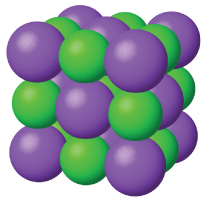
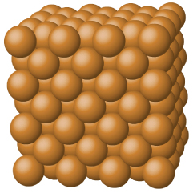

By the end of this section, you will be able to:
* Define and describe the bonding and properties of ionic, molecular, metallic, and covalent network crystalline solids
* Describe the main types of crystalline solids: ionic solids, metallic solids, covalent network solids, and molecular solids
* Explain the ways in which crystal defects can occur in a solid

When most liquids are cooled, they eventually freeze and form **crystalline solids**{: data-type="term"}, solids in which the atoms, ions, or molecules are arranged in a definite repeating pattern. It is also possible for a liquid to freeze before its molecules become arranged in an orderly pattern. The resulting materials are called **amorphous solids**{: data-type="term"} or noncrystalline solids (or, sometimes, glasses). The particles of such solids lack an ordered internal structure and are randomly arranged ([\[link\]](#CNX_Chem_10_05_TypesSol)).

  or randomly (amorphous)."){: #CNX_Chem_10_05_TypesSol}

Metals and ionic compounds typically form ordered, crystalline solids. Substances that consist of large molecules, or a mixture of molecules whose movements are more restricted, often form amorphous solids. For examples, candle waxes are amorphous solids composed of large hydrocarbon molecules. Some substances, such as boron oxide (shown in [\[link\]](#CNX_Chem_10_05_BoronOxide)), can form either crystalline or amorphous solids, depending on the conditions under which it is produced. Also, amorphous solids may undergo a transition to the crystalline state under appropriate conditions.

  Diboron trioxide, B2O3, is normally found as a white, amorphous solid (a glass), which has a high degree of disorder in its structure. (b) By careful, extended heating, it can be converted into a crystalline form of B2O3, which has a very ordered arrangement."){: #CNX_Chem_10_05_BoronOxide}

Crystalline solids are generally classified according the nature of the forces that hold its particles together. These forces are primarily responsible for the physical properties exhibited by the bulk solids. The following sections provide descriptions of the major types of crystalline solids: ionic, metallic, covalent network, and molecular.

# Ionic Solids

**Ionic solids**{: data-type="term"}, such as sodium chloride and nickel oxide, are composed of positive and negative ions that are held together by electrostatic attractions, which can be quite strong ([\[link\]](#CNX_Chem_10_05_IonicSolid)). Many ionic crystals also have high melting points. This is due to the very strong attractions between the ions—in ionic compounds, the attractions between full charges are (much) larger than those between the partial charges in polar molecular compounds. This will be looked at in more detail in a later discussion of lattice energies. Although they are hard, they also tend to be brittle, and they shatter rather than bend. Ionic solids do not conduct electricity; however, they do conduct when molten or dissolved because their ions are free to move. Many simple compounds formed by the reaction of a metallic element with a nonmetallic element are ionic.

 {: #CNX_Chem_10_05_IonicSolid}

# Metallic Solids

**Metallic solids**{: data-type="term"} such as crystals of copper, aluminum, and iron are formed by metal atoms [\[link\]](#CNX_Chem_10_05_Metallic). The structure of metallic crystals is often described as a uniform distribution of atomic nuclei within a “sea” of delocalized electrons. The atoms within such a metallic solid are held together by a unique force known as *metallic bonding* that gives rise to many useful and varied bulk properties. All exhibit high thermal and electrical conductivity, metallic luster, and malleability. Many are very hard and quite strong. Because of their malleability (the ability to deform under pressure or hammering), they do not shatter and, therefore, make useful construction materials. The melting points of the metals vary widely. Mercury is a liquid at room temperature, and the alkali metals melt below 200 °C. Several post-transition metals also have low melting points, whereas the transition metals melt at temperatures above 1000 °C. These differences reflect differences in strengths of metallic bonding among the metals.

 {: #CNX_Chem_10_05_Metallic}

# Covalent Network Solid

**Covalent network solids**{: data-type="term"} include crystals of diamond, silicon, some other nonmetals, and some covalent compounds such as silicon dioxide (sand) and silicon carbide (carborundum, the abrasive on sandpaper). Many minerals have networks of covalent bonds. The atoms in these solids are held together by a network of covalent bonds, as shown in [\[link\]](#CNX_Chem_10_05_NtwrkSolid). To break or to melt a covalent network solid, covalent bonds must be broken. Because covalent bonds are relatively strong, covalent network solids are typically characterized by hardness, strength, and high melting points. For example, diamond is one of the hardest substances known and melts above 3500 °C.

 ![Four pairs of images are shown. In the first pair, a square box containing a black atom bonded to four other black atoms is shown above a structure composed of many black atoms, each bonded to four other black atoms, where one of the upper atoms is labeled &#x201C;carbon&#x201D; and the whole structure is labeled &#x201C;diamond.&#x201D; In the second pair, a square box containing a white atom bonded to four red atoms is shown above a structure composed of many white atoms, each bonded to four red atoms, where one of the red atoms is labeled &#x201C;oxygen&#x201D; and one of the white atoms is labeled &#x201C;silicon.&#x201D; The whole structure is labeled &#x201C;silicon dioxide.&#x201D; In the third pair, a square box containing a blue atom bonded to four white atoms is shown above a structure composed of many blue atoms, each bonded to four white atoms, where one of the blue atoms is labeled &#x201C;carbon&#x201D; and one of the white atoms is labeled &#x201C;silicon.&#x201D; The whole structure is labeled &#x201C;silicon carbide.&#x201D; In the fourth pair, a square box containing six black atoms bonded into a ring is shown above a structure composed of many rings, arranged into sheets layered one atop the other, where one of the black atoms is labeled &#x201C;carbon.&#x201D; The whole structure is labeled &#x201C;graphite.&#x201D;](../resources/CNX_Chem_10_05_NtwrkSolid.jpg "A covalent crystal contains a three-dimensional network of covalent bonds, as illustrated by the structures of diamond, silicon dioxide, silicon carbide, and graphite. Graphite is an exceptional example, composed of planar sheets of covalent crystals that are held together in layers by noncovalent forces. Unlike typical covalent solids, graphite is very soft and electrically conductive."){: #CNX_Chem_10_05_NtwrkSolid}

# Molecular Solid

**Molecular solids**{: data-type="term"}, such as ice, sucrose (table sugar), and iodine, as shown in [\[link\]](#CNX_Chem_10_05_MolSolids), are composed of neutral molecules. The strengths of the attractive forces between the units present in different crystals vary widely, as indicated by the melting points of the crystals. Small symmetrical molecules (nonpolar molecules), such as H2, N2, O2, and F2, have weak attractive forces and form molecular solids with very low melting points (below −200 °C). Substances consisting of larger, nonpolar molecules have larger attractive forces and melt at higher temperatures. Molecular solids composed of molecules with permanent dipole moments (polar molecules) melt at still higher temperatures. Examples include ice (melting point, 0 °C) and table sugar (melting point, 185 °C).

  consists of small, nonpolar molecules and forms a molecular solid with a melting point of &#x2212;78 &#xB0;C. Iodine (I2) consists of larger, nonpolar molecules and forms a molecular solid that melts at 114 &#xB0;C."){: #CNX_Chem_10_05_MolSolids}

# Properties of Solids

A crystalline solid, like those listed in [\[link\]](#fs-idp121853232), has a precise melting temperature because each atom or molecule of the same type is held in place with the same forces or energy. Thus, the attractions between the units that make up the crystal all have the same strength and all require the same amount of energy to be broken. The gradual softening of an amorphous material differs dramatically from the distinct melting of a crystalline solid. This results from the structural nonequivalence of the molecules in the amorphous solid. Some forces are weaker than others, and when an amorphous material is heated, the weakest intermolecular attractions break first. As the temperature is increased further, the stronger attractions are broken. Thus amorphous materials soften over a range of temperatures.

<table summary="This table has five rows and five columns. The first row is a header row, and it labels each column: &#x201C;Type of Solid,&#x201D; &#x201C;Type of Particles,&#x201D; &#x201C;Type of Attractions,&#x201D; &#x201C;Properties,&#x201D; and &#x201C;Examples.&#x201D; Under the &#x201C;Type of Solid&#x201D; column are the following: ionic, metallic, covalent network, and molecular. Under the &#x201C;Type of Particles&#x201D; column are the following: ions, atoms of electropositive elements, atoms of electronegative elements, and molecules ( or atoms ). Under the &#x201C;Type of Attractions&#x201D; column are the following: ionic bonds, metallic bonds, covalent bonds, I M F s. Under the &#x201C;Properties column&#x201D; are the following: hard, brittle, conducts electricity as a liquid but not as a solid, high to very high melting points; shiny, malleable, ductile, conducts heat and electricity well, variable hardness and melting temperature; very hard, not conductive, very high melting points; variable hardness, variable brittleness, not conductive, low melting points. Under the &#x201C;Examples&#x201D; column are the following: N a C l, A l subscript 2 O subscript 3; C u, F e, T I, P b, U; C (diamond), S I O subscript 2, S i C; H subscript 2 O, C O subscript 2, I subscript 2, C subscript 12 H subscript 22 O subscript 11." class="span-all"><thead valign="middle">
<tr valign="middle">
<th colspan="5" data-align="center">Types of Crystalline Solids and Their Properties</th>
</tr>
<tr valign="middle">
<th data-align="left">Type of Solid</th>
<th data-align="left">Type of Particles</th>
<th data-align="left">Type of Attractions</th>
<th data-align="left">Properties</th>
<th data-align="left">Examples</th>
</tr>
</thead><tbody valign="middle">
<tr valign="middle">
<td data-align="left">ionic</td>
<td data-align="left">ions</td>
<td data-align="left">ionic bonds</td>
<td data-align="left">hard, brittle, conducts electricity as a liquid but not as a solid, high to very high melting points</td>
<td data-align="left">NaCl, Al2O3</td>
</tr>
<tr valign="middle">
<td data-align="left">metallic</td>
<td data-align="left">atoms of electropositive elements</td>
<td data-align="left">metallic bonds</td>
<td data-align="left">shiny, malleable, ductile, conducts heat and electricity well, variable hardness and melting temperature</td>
<td data-align="left">Cu, Fe, Ti, Pb, U</td>
</tr>
<tr valign="middle">
<td data-align="left">covalent network</td>
<td data-align="left">atoms of electronegative elements</td>
<td data-align="left">covalent bonds</td>
<td data-align="left">very hard, not conductive, very high melting points</td>
<td data-align="left">C (diamond), SiO2, SiC</td>
</tr>
<tr valign="middle">
<td data-align="left">molecular</td>
<td data-align="left">molecules (or atoms)</td>
<td data-align="left">IMFs</td>
<td data-align="left">variable hardness, variable brittleness, not conductive, low melting points</td>
<td data-align="left">H2O, CO2, I2, C12H22O11</td>
</tr>
</tbody></table>

Graphene: Material of the Future

Carbon is an essential element in our world. The unique properties of carbon atoms allow the existence of carbon-based life forms such as ourselves. Carbon forms a huge variety of substances that we use on a daily basis, including those shown in [\[link\]](#CNX_Chem_10_05_Carbon). You may be familiar with diamond and graphite, the two most common *allotropes* of carbon. (Allotropes are different structural forms of the same element.) Diamond is one of the hardest-known substances, whereas graphite is soft enough to be used as pencil lead. These very different properties stem from the different arrangements of the carbon atoms in the different allotropes.

![Three pairs of images are shown, each composed of a photo and a diagram. In the first pair, the photo shows a close-up view of a colorless, multi-faceted crystal and the diagram shows many gray spheres bonded together in a net-like structure. The caption below this pair reads &#x201C;diamond.&#x201D; In the second pair, the photo shows a rough textured, dark gray solid while the image shows four horizontal sheets, composed of interlocking black spheres, lying atop one another. This pair has a caption that reads &#x201C;graphite.&#x201D; The third pair shows a photo of twelve black hexagons on a yellow background where two of the hexagons are encircled by a gray border and a caption of &#x201C;1.4 times 10, superscript negative 10, m, Distance between center of atoms&#x201D; and an image of many black hexagons evenly arranged on a yellow background. The caption below this pair of images reads &#x201C;Graphite surface.&#x201D;](../resources/CNX_Chem_10_05_Carbon.jpg "Diamond is extremely hard because of the strong bonding between carbon atoms in all directions. Graphite (in pencil lead) rubs off onto paper due to the weak attractions between the carbon layers. An image of a graphite surface shows the distance between the centers of adjacent carbon atoms. (credit left photo: modification of work by Steve Jurvetson; credit middle photo: modification of work by United States Geological Survey)"){: #CNX_Chem_10_05_Carbon}

You may be less familiar with a recently discovered form of carbon: graphene. Graphene was first isolated in 2004 by using tape to peel off thinner and thinner layers from graphite. It is essentially a single sheet (one atom thick) of graphite. Graphene, illustrated in [\[link\]](#CNX_Chem_10_05_Graphene), is not only strong and lightweight, but it is also an excellent conductor of electricity and heat. These properties may prove very useful in a wide range of applications, such as vastly improved computer chips and circuits, better batteries and solar cells, and stronger and lighter structural materials. The 2010 Nobel Prize in Physics was awarded to Andre **Geim**{: data-type="term" .no-emphasis} and Konstantin **Novoselov**{: data-type="term" .no-emphasis} for their pioneering work with graphene.

![Four images are shown. In the upper image, labeled &#x201C;Graphene sheet,&#x201D; a box is drawn around a sheet of interconnected hexagonal rings. In the lower left image, a sphere is composed of hexagonal rings linked together and is labeled &#x201C;Buckyball.&#x201D; In the lower middle image, a tube is shown that is composed of many hexagonal rings joined together and is labeled &#x201C;Nanotube.&#x201D; In the lower right image, four horizontal sheets composed of joined, hexagonal rings is shown and labeled &#x201C;Stacked sheets.&#x201D;](../resources/CNX_Chem_10_05_Graphene.jpg "Graphene sheets can be formed into buckyballs, nanotubes, and stacked layers."){: #CNX_Chem_10_05_Graphene}

# Crystal Defects

In a crystalline solid, the atoms, ions, or molecules are arranged in a definite repeating pattern, but occasional defects may occur in the pattern. Several types of defects are known, as illustrated in [\[link\]](#CNX_Chem_10_05_CrystDfcts). **Vacancies**{: data-type="term"} are defects that occur when positions that should contain atoms or ions are vacant. Less commonly, some atoms or ions in a crystal may occupy positions, called **interstitial sites**{: data-type="term"}, located between the regular positions for atoms. Other distortions are found in impure crystals, as, for example, when the cations, anions, or molecules of the impurity are too large to fit into the regular positions without distorting the structure. Trace amounts of impurities are sometimes added to a crystal (a process known as *doping)* in order to create defects in the structure that yield desirable changes in its properties. For example, silicon crystals are doped with varying amounts of different elements to yield suitable electrical properties for their use in the manufacture of semiconductors and computer chips.

 {: #CNX_Chem_10_05_CrystDfcts}

# Key Concepts and Summary

Some substances form crystalline solids consisting of particles in a very organized structure; others form amorphous (noncrystalline) solids with an internal structure that is not ordered. The main types of crystalline solids are ionic solids, metallic solids, covalent network solids, and molecular solids. The properties of the different kinds of crystalline solids are due to the types of particles of which they consist, the arrangements of the particles, and the strengths of the attractions between them. Because their particles experience identical attractions, crystalline solids have distinct melting temperatures; the particles in amorphous solids experience a range of interactions, so they soften gradually and melt over a range of temperatures. Some crystalline solids have defects in the definite repeating pattern of their particles. These defects (which include vacancies, atoms or ions not in the regular positions, and impurities) change physical properties such as electrical conductivity, which is exploited in the silicon crystals used to manufacture computer chips.

# Chemistry End of Chapter Exercises

What types of liquids typically form amorphous solids?

At very low temperatures oxygen, O2, freezes and forms a crystalline solid. Which best describes these crystals?

(a) ionic

(b) covalent network

(c) metallic

(d) amorphous

(e) molecular crystals

(e) molecular crystals

As it cools, olive oil slowly solidifies and forms a solid over a range of temperatures. Which best describes the solid?

(a) ionic

(b) covalent network

(c) metallic

(d) amorphous

(e) molecular crystals

Explain why ice, which is a crystalline solid, has a melting temperature of 0 °C, whereas butter, which is an amorphous solid, softens over a range of temperatures.

Ice has a crystalline structure stabilized by hydrogen bonding. These intermolecular forces are of comparable strength and thus require the same amount of energy to overcome. As a result, ice melts at a single temperature and not over a range of temperatures. The various, very large molecules that compose butter experience varied van der Waals attractions of various strengths that are overcome at various temperatures, and so the melting process occurs over a wide temperature range.

Identify the type of crystalline solid (metallic, network covalent, ionic, or molecular) formed by each of the following substances:

(a) SiO2

(b) KCl

(c) Cu

(d) CO2

(e) C (diamond)

(f) BaSO4

(g) NH3

(h) NH4F

(i) C2H5OH

Identify the type of crystalline solid (metallic, network covalent, ionic, or molecular) formed by each of the following substances:

(a) CaCl2

(b) SiC

(c) N2

(d) Fe

(e) C (graphite)

(f) CH3CH2CH2CH3

(g) HCl

(h) NH4NO3

(i) K3PO4

(a) ionic; (b) covalent network; (c) molecular; (d) metallic; (e) covalent network; (f) molecular; (g) molecular; (h) ionic; (i) ionic

Classify each substance in the table as either a metallic, ionic, molecular, or covalent network solid:* * *
{: data-type="newline"}

 | Substance | Appearance | Melting Point | Electrical Conductivity | Solubility in Water |
{: valign="top"}|----------
| X | lustrous, malleable | 1500 °C | high | insoluble |
{: valign="top"}| Y | soft, yellow | 113 °C | none | insoluble |
{: valign="top"}| Z | hard, white | 800 °C | only if melted/dissolved | soluble |
{: valign="top"}{: .medium .unnumbered summary="This table has four rows and five columns. The first row is a header row, and it labels each column: &#x201C;Substance,&#x201D; &#x201C;Appearance,&#x201D; &#x201C;Melting Point,&#x201D; &#x201C;Electrical Conductivity,&#x201D; and &#x201C;Solubility in Water.&#x201D; Under the &#x201C;Substance&#x201D; column are the following: X, Y, and Z. Under the &#x201C;Appearance&#x201D; column are the following: lustrous, malleable; soft, yellow; hard, white. Under the &#x201C;Melting Point,&#x201D; column are the following: 1500 degrees C, 113 degrees C, and 800 degrees C. Under the &#x201C;Electrical Conductivity&#x201D; column are the following: high; none; only if melted / dissolved. Under the &#x201C;Solubility in Water&#x201D; column are the following: insoluble, insoluble, and soluble." data-label=""}

Classify each substance in the table as either a metallic, ionic, molecular, or covalent network solid:* * *
{: data-type="newline"}

 | Substance | Appearance | Melting Point | Electrical Conductivity | Solubility in Water |
{: valign="top"}|----------
| X | brittle, white | 800 °C | only if melted/dissolved | soluble |
{: valign="top"}| Y | shiny, malleable | 1100 °C | high | insoluble |
{: valign="top"}| Z | hard, colorless | 3550 °C | none | insoluble |
{: valign="top"}{: .medium .unnumbered summary="This table has four rows and five columns. The first row is a header row, and it labels each column: &#x201C;Substance,&#x201D; &#x201C;Appearance,&#x201D; &#x201C;Melting Point,&#x201D; &#x201C;Electrical Conductivity,&#x201D; and &#x201C;Solubility in Water.&#x201D; Under the &#x201C;Substance&#x201D; column are the following: X, Y, and Z. Under the &#x201C;Appearance&#x201D; column are the following: brittle, white; shiny, malleable; hard, colorless. Under the &#x201C;Melting Point,&#x201D; column are the following: 800 degrees C, 1100 degrees C, and 3550 degrees C. Under the &#x201C;Electrical Conductivity&#x201D; column are the following: only if melted / dissolved, high, and none. Under the &#x201C;Solubility in Water&#x201D; column are the following: soluble, insoluble, and insoluble." data-label=""}

X = ionic; Y = metallic; Z = covalent network

Identify the following substances as ionic, metallic, covalent network, or molecular solids:

Substance A is malleable, ductile, conducts electricity well, and has a melting point of 1135 °C. Substance B is brittle, does not conduct electricity as a solid but does when molten, and has a melting point of 2072 °C. Substance C is very hard, does not conduct electricity, and has a melting point of 3440 °C. Substance D is soft, does not conduct electricity, and has a melting point of 185 °C.

Substance A is shiny, conducts electricity well, and melts at 975 °C. Substance A is likely a(n):

(a) ionic solid

(b) metallic solid

(c) molecular solid

(d) covalent network solid

(b) metallic solid

Substance B is hard, does not conduct electricity, and melts at 1200 °C. Substance B is likely a(n):

(a) ionic solid

(b) metallic solid

(c) molecular solid

(d) covalent network solid

## Glossary
{: data-type="glossary-title"}

amorphous solid
: (also, noncrystalline solid) solid in which the particles lack an ordered internal structure
{: .definition}

covalent network solid
: solid whose particles are held together by covalent bonds
{: .definition}

crystalline solid
: solid in which the particles are arranged in a definite repeating pattern
{: .definition}

interstitial sites
: spaces between the regular particle positions in any array of atoms or ions
{: .definition}

ionic solid
: solid composed of positive and negative ions held together by strong electrostatic attractions
{: .definition}

metallic solid
: solid composed of metal atoms
{: .definition}

molecular solid
: solid composed of neutral molecules held together by intermolecular forces of attraction
{: .definition}

vacancy
: defect that occurs when a position that should contain an atom or ion is vacant
{: .definition}

