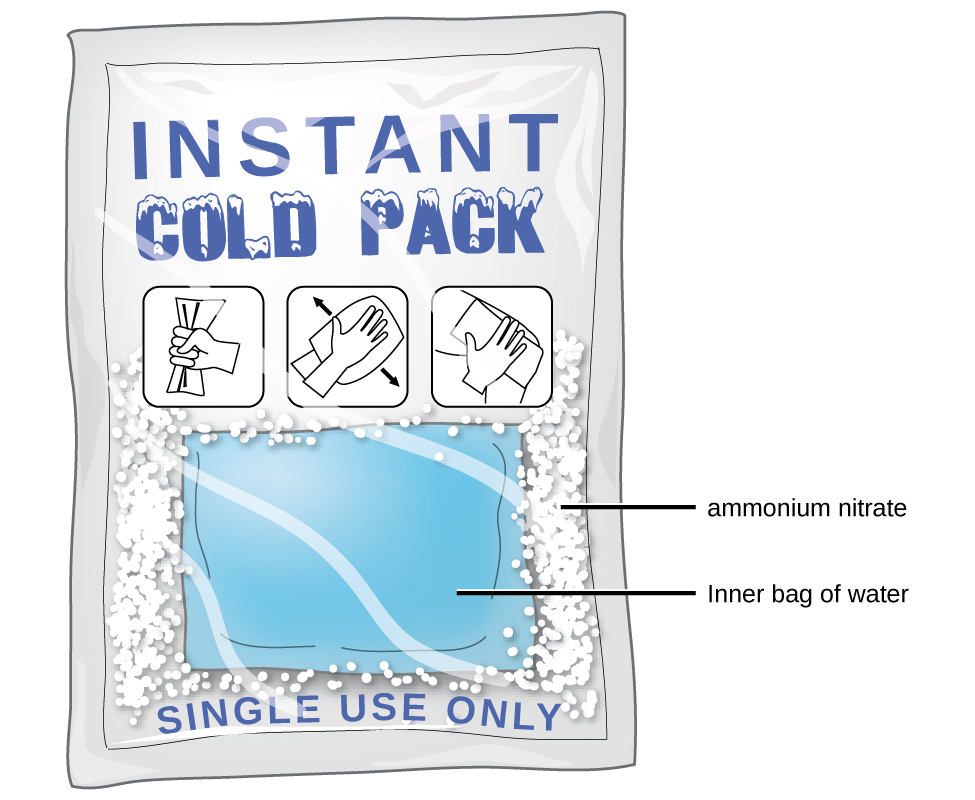

By the end of this section, you will be able to:
* Describe the basic properties of solutions and how they form
* Predict whether a given mixture will yield a solution based on molecular properties of its components
* Explain why some solutions either produce or absorb heat when they form

An earlier chapter of this text introduced *solutions*, defined as homogeneous mixtures of two or more substances. Often, one component of a solution is present at a significantly greater concentration, in which case it is called the *solvent*. The other components of the solution present in relatively lesser concentrations are called *solutes*. Sugar is a covalent solid composed of sucrose molecules, C12H22O11. When this compound dissolves in water, its molecules become uniformly distributed among the molecules of water:

<math xmlns="http://www.w3.org/1998/Math/MathML"><mrow><msub><mtext>C</mtext><mrow><mn>12</mn></mrow></msub><msub><mtext>H</mtext><mrow><mn>22</mn></mrow></msub><msub><mtext>O</mtext><mrow><mn>11</mn></mrow></msub><mo stretchy="false">(</mo><mi>s</mi><mo stretchy="false">)</mo><mspace width="0.2em" /><mo stretchy="false">⟶</mo><mspace width="0.2em" /><msub><mtext>C</mtext><mrow><mn>12</mn></mrow></msub><msub><mtext>H</mtext><mrow><mn>22</mn></mrow></msub><msub><mtext>O</mtext><mrow><mn>11</mn></mrow></msub><mo stretchy="false">(</mo><mi>a</mi><mi>q</mi><mo stretchy="false">)</mo></mrow></math>

The subscript “*aq*” in the equation signifies that the sucrose molecules are solutes and are therefore *individually dispersed* throughout the *aqueous solution* (water is the solvent). Although sucrose molecules are heavier than water molecules, they remain dispersed throughout the solution; gravity does not cause them to “settle out” over time.

Potassium dichromate, K2Cr2O7, is an ionic compound composed of colorless potassium ions, K+, and orange dichromate ions, <math xmlns="http://www.w3.org/1998/Math/MathML"><mrow><mtext>C</mtext><msub><mtext>r</mtext><mn>2</mn></msub><msub><mtext>O</mtext><mn>7</mn></msub><msup><mrow /><mrow><mtext>2−</mtext></mrow></msup><mo>.</mo></mrow></math>

 When a small amount of solid potassium dichromate is added to water, the compound dissolves and dissociates to yield potassium ions and dichromate ions uniformly distributed throughout the mixture ([\[link\]](#CNX_Chem_11_01_K2Cr2O7_1)), as indicated in this equation:

<math xmlns="http://www.w3.org/1998/Math/MathML"><mrow><msub><mtext>K</mtext><mn>2</mn></msub><mtext>C</mtext><msub><mtext>r</mtext><mn>2</mn></msub><msub><mtext>O</mtext><mn>7</mn></msub><mo stretchy="false">(</mo><mi>s</mi><mo stretchy="false">)</mo><mspace width="0.2em" /><mo stretchy="false">⟶</mo><mspace width="0.2em" /><mn>2</mn><msup><mtext>K</mtext><mtext>+</mtext></msup><mo stretchy="false">(</mo><mrow><mi>a</mi><mi>q</mi><mo stretchy="false">)</mo></mrow><mo>+</mo><mtext>C</mtext><msub><mtext>r</mtext><mn>2</mn></msub><msub><mtext>O</mtext><mn>7</mn></msub><msup><mrow /><mrow><mtext>2−</mtext></mrow></msup><mo stretchy="false">(</mo><mi>a</mi><mi>q</mi><mo stretchy="false">)</mo></mrow></math>

As with the mixture of sugar and water, this mixture is also an aqueous solution. Its solutes, potassium and dichromate ions, remain individually dispersed among the solvent (water) molecules.

 is mixed with water, it forms a homogeneous orange solution. (credit: modification of work by Mark Ott)"){: #CNX_Chem_11_01_K2Cr2O7_1}

  
Visit this [virtual lab][1] to view simulations of the dissolution of common covalent and ionic substances (sugar and salt) in water.

Water is used so often as a solvent that the word solution has come to imply an aqueous solution to many people. However, almost any gas, liquid, or solid can act as a solvent. Many **alloys**{: data-type="term"} are solid solutions of one metal dissolved in another; for example, US five-cent coins contain nickel dissolved in copper. Air is a gaseous solution, a homogeneous mixture of nitrogen, oxygen, and several other gases. Oxygen (a gas), alcohol (a liquid), and sugar (a solid) all dissolve in water (a liquid) to form liquid solutions. [\[link\]](#fs-idp13681744) gives examples of several different solutions and the phases of the solutes and solvents.

<table summary="The table provides solutes and solvents for a variety of solutions. In air, the solute is O subscript 2 g and the solvent is N subscript 2 g. In soft drinks, the solute is C O subscript 2 g and the solvent is H subscript 2 O l. In hydrogen in palladium, H subscript 2 g is the solute and P d s is the solvent. In rubbing alcohol, H subscript 2 O l is the solute and C subscript 3 H subscript 8 O l or 2 &#x2013; propanol is the solvent. In saltwater, N a C l s is the solute and H subscript 2 O l is the solvent. In brass, Z n s is the solute and C u s is the solvent." class="span-all"><thead>
<tr valign="middle">
<th colspan="3" data-align="center">Different Types of Solutions</th>
</tr>
<tr valign="middle">
<th data-align="left">Solution</th>
<th data-align="left">Solute</th>
<th data-align="left">Solvent</th>
</tr>
</thead><tbody>
<tr valign="middle">
<td data-align="left">air</td>
<td data-align="left">O2(<em>g</em>)</td>
<td data-align="left">N2(<em>g</em>)</td>
</tr>
<tr valign="middle">
<td data-align="left">soft drinks<a data-type="footnote-link" href="#footnote1">1</a></td>
<td data-align="left">CO2(<em>g</em>)</td>
<td data-align="left">H2O(<em>l</em>)</td>
</tr>
<tr valign="middle">
<td data-align="left">hydrogen in palladium</td>
<td data-align="left">H2(<em>g</em>)</td>
<td data-align="left">Pd(<em>s</em>)</td>
</tr>
<tr valign="middle">
<td data-align="left">rubbing alcohol</td>
<td data-align="left">H2O(<em><em>l</em></em>)</td>
<td data-align="left">C3H8O(<em><em>l</em></em>) (2-propanol)</td>
</tr>
<tr valign="middle">
<td data-align="left">saltwater</td>
<td data-align="left">NaCl(<em><em>s</em></em>)</td>
<td data-align="left">H2O(<em><em>l</em></em>)</td>
</tr>
<tr valign="middle">
<td data-align="left">brass</td>
<td data-align="left">Zn(<em><em>s</em></em>)</td>
<td data-align="left">Cu(<em><em>s</em></em>)</td>
</tr>
</tbody></table>

Solutions exhibit these defining traits:

* They are homogeneous; that is, after a solution is mixed, it has the same composition at all points throughout (its composition is uniform).
* The physical state of a solution—solid, liquid, or gas—is typically the same as that of the solvent, as demonstrated by the examples in [\[link\]](#fs-idp13681744).
* The components of a solution are dispersed on a molecular scale; that is, they consist of a mixture of separated molecules, atoms, and/or ions.
* The dissolved solute in a solution will not settle out or separate from the solvent.
* The composition of a solution, or the concentrations of its components, can be varied continuously, within limits.
{: data-bullet-style="bullet"}

### The Formation of Solutions

The formation of a solution is an example of a **spontaneous process**{: data-type="term"}, a process that occurs under specified conditions without the requirement of energy from some external source. Sometimes we stir a mixture to speed up the dissolution process, but this is not necessary; a homogeneous solution would form if we waited long enough. The topic of spontaneity is critically important to the study of chemical thermodynamics and is treated more thoroughly in a later chapter of this text. For purposes of this chapter’s discussion, it will suffice to consider two criteria that *favor*, but do not guarantee, the spontaneous formation of a solution:

1.  a decrease in the internal energy of the system (an exothermic change, as discussed in the previous chapter on thermochemistry)
2.  an increase in the disorder in the system (which indicates an increase in the *entropy* of the system, as you will learn about in the later chapter on thermodynamics)
{: type="1"}

In the process of dissolution, an internal energy change often, but not always, occurs as heat is absorbed or evolved. An increase in disorder always results when a solution forms.

When the strengths of the intermolecular forces of attraction between solute and solvent species in a solution are no different than those present in the separated components, the solution is formed with no accompanying energy change. Such a solution is called an **ideal solution**{: data-type="term"}. A mixture of ideal gases (or gases such as helium and argon, which closely approach ideal behavior) is an example of an ideal solution, since the entities comprising these gases experience no significant intermolecular attractions.

When containers of helium and argon are connected, the gases spontaneously mix due to diffusion and form a solution ([\[link\]](#CNX_Chem_11_01_HeArsol)). The formation of this solution clearly involves an increase in disorder, since the helium and argon atoms occupy a volume twice as large as that which each occupied before mixing.

{: #CNX_Chem_11_01_HeArsol}

Ideal solutions may also form when structurally similar liquids are mixed. For example, mixtures of the alcohols methanol (CH3OH) and ethanol (C2H5OH) form ideal solutions, as do mixtures of the hydrocarbons pentane, C5H12, and hexane, C6H14. Placing methanol and ethanol, or pentane and hexane, in the bulbs shown in [\[link\]](#CNX_Chem_11_01_HeArsol) will result in the same diffusion and subsequent mixing of these liquids as is observed for the He and Ar gases (although at a much slower rate), yielding solutions with no significant change in energy. Unlike a mixture of gases, however, the components of these liquid-liquid solutions do, indeed, experience intermolecular attractive forces. But since the molecules of the two substances being mixed are structurally very similar, the intermolecular attractive forces between like and unlike molecules are essentially the same, and the dissolution process, therefore, does not entail any appreciable increase or decrease in energy. These examples illustrate how diffusion alone can provide the driving force required to cause the spontaneous formation of a solution. In some cases, however, the relative magnitudes of intermolecular forces of attraction between solute and solvent species may prevent dissolution.

Three types of intermolecular attractive forces are relevant to the dissolution process: solute-solute, solvent-solvent, and solute-solvent. As illustrated in [\[link\]](#CNX_Chem_11_01_solusolv), the formation of a solution may be viewed as a stepwise process in which energy is consumed to overcome solute-solute and solvent-solvent attractions (endothermic processes) and released when solute-solvent attractions are established (an exothermic process referred to as **solvation**{: data-type="term"}). The relative magnitudes of the energy changes associated with these stepwise processes determine whether the dissolution process overall will release or absorb energy. In some cases, solutions do not form because the energy required to separate solute and solvent species is so much greater than the energy released by solvation.

 ![The top, central region of the figure shows solute particles as seven blue spheres and solvent particles as 16 red spheres in separate, labeled boxes. The particles in these boxes are touching. An arrow labeled &#x201C;Step 1&#x201D; points left of the solute box, and shows the blue spheres no longer touching in another box labeled &#x201C;expanded solute.&#x201D; An arrow labeled &#x201C;Step 2&#x201D; points right from the solvent box and shows the red spheres no longer touching in another box labeled &#x201C;expanded solvent.&#x201D; Arrows proceed from the bottom of the expanded solute and expanded solvent boxes and join at the bottom of the figure where a step 3 label is shown. The joined arrows point to a box just above in which the red and blue spheres are mixed together and touching. The solute and solvent boxes are joined by another arrow labeled &#x201C;direct formation of solution&#x201D; which points downward at the center of the figure. This arrow also points to the box containing mixed red and blue spheres near the bottom of the figure.](../resources/CNX_Chem_11_01_solusolv.jpg "This schematic representation of dissolution shows a stepwise process involving the endothermic separation of solute and solvent species (Steps 1 and 2) and exothermic solvation (Step 3)."){: #CNX_Chem_11_01_solusolv}

For example, cooking oils and water will not mix to any appreciable extent to yield solutions ([\[link\]](#CNX_Chem_11_01_oilwater1)). Hydrogen bonding is the dominant intermolecular attractive force present in liquid water; the nonpolar hydrocarbon molecules of cooking oils are not capable of hydrogen bonding, instead being held together by dispersion forces. Forming an oil-water solution would require overcoming the very strong hydrogen bonding in water, as well as the significantly strong dispersion forces between the relatively large oil molecules. And, since the polar water molecules and nonpolar oil molecules would not experience very strong intermolecular attraction, very little energy would be released by solvation.

 "){: #CNX_Chem_11_01_oilwater1}

On the other hand, a mixture of ethanol and water will mix in any proportions to yield a solution. In this case, both substances are capable of hydrogen bonding, and so the solvation process is sufficiently exothermic to compensate for the endothermic separations of solute and solvent molecules.

As noted at the beginning of this module, spontaneous solution formation is favored, but not guaranteed, by exothermic dissolution processes. While many soluble compounds do, indeed, dissolve with the release of heat, some dissolve endothermically. Ammonium nitrate (NH4NO3) is one such example and is used to make instant cold packs for treating injuries like the one pictured in [\[link\]](#CNX_Chem_11_01_Icepack). A thin-walled plastic bag of water is sealed inside a larger bag with solid NH4NO3. When the smaller bag is broken, a solution of NH4NO3 forms, absorbing heat from the surroundings (the injured area to which the pack is applied) and providing a cold compress that decreases swelling. Endothermic dissolutions such as this one require a greater energy input to separate the solute species than is recovered when the solutes are solvated, but they are spontaneous nonetheless due to the increase in disorder that accompanies formation of the solution.

 {: #CNX_Chem_11_01_Icepack}

  
Watch this brief [video][2] illustrating endothermic and exothermic dissolution processes.

#### Key Concepts and Summary

A solution forms when two or more substances combine physically to yield a mixture that is homogeneous at the molecular level. The solvent is the most concentrated component and determines the physical state of the solution. The solutes are the other components typically present at concentrations less than that of the solvent. Solutions may form endothermically or exothermically, depending upon the relative magnitudes of solute and solvent intermolecular attractive forces. Ideal solutions form with no appreciable change in energy.

#### Chemistry End of Chapter Exercises

How do solutions differ from compounds? From other mixtures?

A solution can vary in composition, while a compound cannot vary in composition. Solutions are homogeneous at the molecular level, while other mixtures are heterogeneous.

Which of the principal characteristics of solutions can we see in the solutions of K2Cr2O7 shown in [[link]](#CNX_Chem_11_01_K2Cr2O7_1)?

When KNO3 is dissolved in water, the resulting solution is significantly colder than the water was originally.

(a) Is the dissolution of KNO3 an endothermic or an exothermic process?

(b) What conclusions can you draw about the intermolecular attractions involved in the process?

(c) Is the resulting solution an ideal solution?

(a) The process is endothermic as the solution is consuming heat. (b) Attraction between the K+ and <math xmlns="http://www.w3.org/1998/Math/MathML"><mrow><mtext>N</mtext><msub><mtext>O</mtext><mn>3</mn></msub><msup><mrow /><mtext>−</mtext></msup></mrow></math>

 ions is stronger than between the ions and water molecules (the ion-ion interactions have a lower, more negative energy). Therefore, the dissolution process increases the energy of the molecular interactions, and it consumes the thermal energy of the solution to make up for the difference. (c) No, an ideal solution is formed with no appreciable heat release or consumption.

Give an example of each of the following types of solutions:

(a) a gas in a liquid

(b) a gas in a gas

(c) a solid in a solid

Indicate the most important types of intermolecular attractions in each of the following solutions:

(a) The solution in [[link]](#CNX_Chem_11_01_K2Cr2O7_1).

(b) NO(*l*) in CO(*l*)

(c) Cl2(*g*) in Br2(*l*)

(d) HCl(*g*) in benzene C6H6(*l*)

(e) Methanol CH3OH(*l*) in H2O(*l*)

(a) ion-dipole forces; (b) dipole-dipole forces; (c) dispersion forces; (d) dispersion forces; (e) hydrogen bonding

Predict whether each of the following substances would be more soluble in water (polar solvent) or in a hydrocarbon such as heptane (C7H16, nonpolar solvent):

(a) vegetable oil (nonpolar)

(b) isopropyl alcohol (polar)

(c) potassium bromide (ionic)

Heat is released when some solutions form; heat is absorbed when other solutions form. Provide a molecular explanation for the difference between these two types of spontaneous processes.

Heat is released when the total intermolecular forces (IMFs) between the solute and solvent molecules are stronger than the total IMFs in the pure solute and in the pure solvent: Breaking weaker IMFs and forming stronger IMFs releases heat. Heat is absorbed when the total IMFs in the solution are weaker than the total of those in the pure solute and in the pure solvent: Breaking stronger IMFs and forming weaker IMFs absorbs heat.

Solutions of hydrogen in palladium may be formed by exposing Pd metal to H2 gas. The concentration of hydrogen in the palladium depends on the pressure of H2 gas applied, but in a more complex fashion than can be described by Henry’s law. Under certain conditions, 0.94 g of hydrogen gas is dissolved in 215 g of palladium metal (solution density = 10.8 g cm3).

(a) Determine the molarity of this solution.

(b) Determine the molality of this solution.

(c) Determine the percent by mass of hydrogen atoms in this solution.

### Footnotes
{: data-type="footnote-refs-title"}

* {: data-type="footnote-ref" #footnote1} [1](#footnote-ref1){: data-type="footnote-ref-link"} If bubbles of gas are observed within the liquid, the mixture is not homogeneous and, thus, not a solution.
{: data-list-type="bulleted" data-bullet-style="none"}

### Glossary
{: data-type="glossary-title"}

alloy
: solid mixture of a metallic element and one or more additional elements
^

ideal solution
: solution that forms with no accompanying energy change
^

solvation
: exothermic process in which intermolecular attractive forces between the solute and solvent in a solution are established
^

spontaneous process
: physical or chemical change that occurs without the addition of energy from an external source

[1]: http://openstax.org/l/16Phetsugar
[2]: http://openstax.org/l/16endoexo
