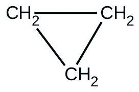

By the end of this section, you will be able to:
* Explain the form and function of an integrated rate law
* Perform integrated rate law calculations for zero-, first-, and second-order reactions
* Define half-life and carry out related calculations
* Identify the order of a reaction from concentration/time data

The rate laws we have seen thus far relate the rate and the concentrations of reactants. We can also determine a second form of each rate law that relates the concentrations of reactants and time. These are called **integrated rate laws**{: data-type="term"}. We can use an integrated rate law to determine the amount of reactant or product present after a period of time or to estimate the time required for a reaction to proceed to a certain extent. For example, an integrated rate law is used to determine the length of time a radioactive material must be stored for its radioactivity to decay to a safe level.

Using calculus, the differential rate law for a chemical reaction can be integrated with respect to time to give an equation that relates the amount of reactant or product present in a reaction mixture to the elapsed time of the reaction. This process can either be very straightforward or very complex, depending on the complexity of the differential rate law. For purposes of discussion, we will focus on the resulting integrated rate laws for first-, second-, and zero-order reactions.

# First-Order Reactions

An equation relating the rate constant *k* to the initial concentration \[*A*\]0 and the concentration \[*A*\]*t* present after any given time *t* can be derived for a first-order reaction and shown to be:

<math xmlns="http://www.w3.org/1998/Math/MathML"><mrow><mtext>ln</mtext><mrow><mo>(</mo><mrow><mfrac><mrow><msub><mrow><mrow><mo>[</mo><mi>A</mi><mo>]</mo></mrow></mrow><mi>t</mi></msub></mrow><mrow><msub><mrow><mrow><mo>[</mo><mi>A</mi><mo>]</mo></mrow></mrow><mn>0</mn></msub></mrow></mfrac></mrow><mo>)</mo></mrow><mo>=</mo><mtext>−</mtext><mi>k</mi><mi>t</mi></mrow></math>

or

<math xmlns="http://www.w3.org/1998/Math/MathML"><mrow><mtext>ln</mtext><mrow><mo>(</mo><mrow><mfrac><mrow><msub><mrow><mrow><mo>[</mo><mi>A</mi><mo>]</mo></mrow></mrow><mn>0</mn></msub></mrow><mrow><msub><mrow><mrow><mo>[</mo><mi>A</mi><mo>]</mo></mrow></mrow><mi>t</mi></msub></mrow></mfrac></mrow><mo>)</mo></mrow><mo>=</mo><mi>k</mi><mi>t</mi></mrow></math>

or

<math xmlns="http://www.w3.org/1998/Math/MathML"><mo>[</mo><mi>A</mi><mo>]</mo> <mo>=</mo> <msub><mrow><mo>[</mo><mi>A</mi><mo>]</mo></mrow><mn>0</mn></msub> <msup><mi>e</mi><mrow><mo>−</mo><mi>k</mi><mi>t</mi></mrow></msup> </math>

The Integrated Rate Law for a First-Order ReactionThe rate constant for the first-order decomposition of cyclobutane, C4H8 at 500 °C is 9.2 <math xmlns="http://www.w3.org/1998/Math/MathML"><mrow><mo>×</mo></mrow></math>

 10−3 s−1\:

<math xmlns="http://www.w3.org/1998/Math/MathML"><mrow><msub><mtext>C</mtext><mn>4</mn></msub><msub><mtext>H</mtext><mn>8</mn></msub><mspace width="0.2em" /><mo stretchy="false">⟶</mo><mspace width="0.2em" /><msub><mrow><mtext>2C</mtext></mrow><mn>2</mn></msub><msub><mtext>H</mtext><mn>4</mn></msub></mrow></math>

How long will it take for 80.0% of a sample of C4H8 to decompose?

Solution We use the integrated form of the rate law to answer questions regarding time:

<math xmlns="http://www.w3.org/1998/Math/MathML"><mrow><mtext>ln</mtext><mrow><mo>(</mo><mrow><mfrac><mrow><msub><mrow><mrow><mo>[</mo><mi>A</mi><mo>]</mo></mrow></mrow><mn>0</mn></msub></mrow><mrow><mrow><mo>[</mo><mi>A</mi><mo>]</mo></mrow></mrow></mfrac></mrow><mo>)</mo></mrow><mo>=</mo><mi>k</mi><mi>t</mi></mrow></math>

There are four variables in the rate law, so if we know three of them, we can determine the fourth. In this case we know \[*A*\]0, \[*A*\], and *k*, and need to find *t*.

The initial concentration of C4H8, \[*A*\]0, is not provided, but the provision that 80.0% of the sample has decomposed is enough information to solve this problem. Let *x* be the initial concentration, in which case the concentration after 80.0% decomposition is 20.0% of *x* or 0.200*x.* Rearranging the rate law to isolate *t* and substituting the provided quantities yields:

<math xmlns="http://www.w3.org/1998/Math/MathML"><mtable><mtr><mtd columnalign="right"><mi>t</mi></mtd><mtd columnalign="left"><mo>=</mo><mtext>ln</mtext><mspace width="0.2em" /><mfrac><mrow><mrow><mo>[</mo><mi>x</mi><mo>]</mo></mrow></mrow><mrow><mrow><mo>[</mo><mrow><mn>0.200</mn><mi>x</mi></mrow><mo>]</mo></mrow></mrow></mfrac><mspace width="0.4em" /><mo>×</mo><mspace width="0.4em" /><mfrac><mn>1</mn><mi>k</mi></mfrac></mtd></mtr><mtr><mtd /><mtd columnalign="left"><mo>=</mo><mtext>ln</mtext><mspace width="0.2em" /><mfrac><mrow><mn>0.100</mn><mspace width="0.2em" /><msup><mrow><mtext>mol L</mtext></mrow><mrow><mn>−1</mn></mrow></msup></mrow><mrow><mn>0.020</mn><mspace width="0.2em" /><msup><mrow><mtext>mol L</mtext></mrow><mrow><mn>−1</mn></mrow></msup></mrow></mfrac><mspace width="0.4em" /><mo>×</mo><mspace width="0.4em" /><mfrac><mn>1</mn><mrow><mn>9.2</mn><mspace width="0.2em" /><mo>×</mo><mspace width="0.2em" /><msup><mrow><mn>10</mn></mrow><mrow><mn>−3</mn></mrow></msup><mspace width="0.2em" /><msup><mrow><mtext>s</mtext></mrow><mrow><mn>−1</mn></mrow></msup></mrow></mfrac></mtd></mtr><mtr><mtd /><mtd columnalign="left"><mo>=</mo><mn>1.609</mn><mspace width="0.2em" /><mo>×</mo><mspace width="0.4em" /><mfrac><mn>1</mn><mrow><mn>9.2</mn><mspace width="0.2em" /><mo>×</mo><mspace width="0.2em" /><msup><mrow><mn>10</mn></mrow><mrow><mn>−3</mn></mrow></msup><mspace width="0.2em" /><msup><mrow><mtext>s</mtext></mrow><mrow><mn>−1</mn></mrow></msup></mrow></mfrac></mtd></mtr><mtr><mtd /><mtd columnalign="left"><mo>=</mo><mn>1.7</mn><mspace width="0.2em" /><mo>×</mo><mspace width="0.2em" /><msup><mn>10</mn><mn>2</mn></msup><mspace width="0.2em" /><mtext>s</mtext></mtd></mtr></mtable></math>

Check Your Learning Iodine-131 is a radioactive isotope that is used to diagnose and treat some forms of thyroid cancer. Iodine-131 decays to xenon-131 according to the equation:

<math xmlns="http://www.w3.org/1998/Math/MathML"><mrow><mtext>I-131</mtext><mspace width="0.2em" /><mo stretchy="false">⟶</mo><mspace width="0.2em" /><mtext>Xe-131</mtext><mo>+</mo><mtext>electron</mtext></mrow></math>

The decay is first-order with a rate constant of 0.138 d−1. All radioactive decay is first order. How many days will it take for 90% of the iodine−131 in a 0.500 *M* solution of this substance to decay to Xe-131?

Answer:

16\.7 days

We can use integrated rate laws with experimental data that consist of time and concentration information to determine the order and rate constant of a reaction. The integrated rate law can be rearranged to a standard linear equation format:

<math xmlns="http://www.w3.org/1998/Math/MathML"><mtable><mtr><mtd columnalign="right"><mtext>ln</mtext><mrow><mo>[</mo><mi>A</mi><mo>]</mo></mrow></mtd><mtd><mo>=</mo></mtd><mtd columnalign="left"><mo stretchy="false">(</mo><mtext>−</mtext><mi>k</mi><mo stretchy="false">)</mo><mo stretchy="false">(</mo><mi>t</mi><mo stretchy="false">)</mo><mo>+</mo><mtext>ln</mtext><msub><mrow><mo>[</mo><mi>A</mi><mo>]</mo></mrow><mn>0</mn></msub></mtd></mtr><mtr><mtd columnalign="right"><mi>y</mi></mtd><mtd><mo>=</mo></mtd><mtd columnalign="left"><mi>m</mi><mi>x</mi><mo>+</mo><mi>b</mi></mtd></mtr></mtable></math>

A plot of ln\[*A*\] versus *t* for a first-order reaction is a straight line with a slope of −*k* and an intercept of ln\[*A*\]0. If a set of rate data are plotted in this fashion but do *not* result in a straight line, the reaction is not first order in *A*.

Determination of Reaction Order by Graphing Show that the data in [\[link\]](/m51097#CNX_Chem_12_01_KDataH2O2) can be represented by a first-order rate law by graphing ln\[H2O2\] versus time. Determine the rate constant for the rate of decomposition of H2O2 from this data.

Solution The data from [\[link\]](/m51097#CNX_Chem_12_01_KDataH2O2) with the addition of values of ln\[H2O2\] are given in [\[link\]](#CNX_Chem_12_04_FrstOKin).

![A graph is shown with the label &#x201C;Time ( h )&#x201D; on the x-axis and &#x201C;l n \[ H subscript 2 O subscript 2 \]&#x201D; on the y-axis. The x-axis shows markings at 6, 12, 18, and 24 hours. The vertical axis shows markings at negative 3, negative 2, negative 1, and 0. A decreasing linear trend line is drawn through five points represented at the coordinates (0, 0), (6, negative 0.693), (12, negative 1.386), (18, negative 2.079), and (24, negative 2.772).](../resources/CNX_Chem_12_04_FrstOKin.jpg "The linear relationship between the ln[H2O2] and time shows that the decomposition of hydrogen peroxide is a first-order reaction."){: #CNX_Chem_12_04_FrstOKin}

| Trial | Time (h) | \[H2O2\] (*M*) | ln\[H2O2\] |
{: valign="middle"}|----------
| 1 | 0 | 1.000 | 0.0 |
{: valign="middle"}| 2 | 6.00 | 0.500 | −0.693 |
{: valign="middle"}| 3 | 12.00 | 0.250 | −1.386 |
{: valign="middle"}| 4 | 18.00 | 0.125 | −2.079 |
{: valign="middle"}| 5 | 24.00 | 0.0625 | −2.772 |
{: valign="middle"}{: summary="This table contains four columns and six rows. The first row is a header row, and it labels each column, &#x201C;Trial,&#x201D; &#x201C;Time ( h ),&#x201D; &#x201C;[ H subscript 2 O subscript 2 ] ( M ),&#x201D; and &#x201C;l n [ H subscript 2 O subscript 2 ].&#x201D; Under the &#x201C;Trial&#x201D; column are the numbers: 1, 2, 3, 4, and 5. Under the column, &#x201C;Time ( h )&#x201D; are the numbers 0, 6.00, 12.00, 18.00, and 24.00. Under the column &#x201C;[ H subscript 2 O subscript 2 ] ( M ),&#x201D; are the numbers 1.000, 0.500, 0.250, 0.125, and 0.0625. Under the column, &#x201C;l n [ H subscript 2 O subscript 2 ],&#x201D; are the numbers: 0.0, negative 0.693, negative 1.386, negative 2.079, and negative 2.772." .medium .unnumbered data-label=""}

The plot of ln\[H2O2\] versus time is linear, thus we have verified that the reaction may be described by a first-order rate law.

The rate constant for a first-order reaction is equal to the negative of the slope of the plot of ln\[H2O2\] versus time where:

<math xmlns="http://www.w3.org/1998/Math/MathML"><mrow><mtext>slope</mtext><mo>=</mo><mspace width="0.1em" /><mfrac><mrow><mtext>change in</mtext><mspace width="0.2em" /><mi>y</mi></mrow><mrow><mtext>change in</mtext><mspace width="0.2em" /><mi>x</mi></mrow></mfrac><mspace width="0.1em" /><mo>=</mo><mspace width="0.1em" /><mfrac><mrow><mtext>Δ</mtext><mi>y</mi></mrow><mrow><mtext>Δ</mtext><mi>x</mi></mrow></mfrac><mspace width="0.1em" /><mo>=</mo><mspace width="0.1em" /><mfrac><mrow><mtext>Δln</mtext><mrow><mo>[</mo><mrow><msub><mtext>H</mtext><mn>2</mn></msub><msub><mtext>O</mtext><mn>2</mn></msub></mrow><mo>]</mo></mrow></mrow><mrow><mtext>Δ</mtext><mi>t</mi></mrow></mfrac></mrow></math>

In order to determine the slope of the line, we need two values of ln\[H2O2\] at different values of *t* (one near each end of the line is preferable). For example, the value of ln\[H2O2\] when *t* is 6.00 h is −0.693; the value when *t* = 12.00 h is −1.386:

<math xmlns="http://www.w3.org/1998/Math/MathML"><mtable><mtr><mtd columnalign="right"><mtext>slope</mtext></mtd><mtd><mo>=</mo></mtd><mtd columnalign="left"><mfrac><mrow><mn>−1.386</mn><mrow><mo>−</mo><mo>(</mo><mrow><mn>−0.693</mn></mrow><mo>)</mo></mrow></mrow><mrow><mtext>12.00 h</mtext><mo>−</mo><mtext>6.00 h</mtext></mrow></mfrac></mtd></mtr> <mtr><mtd /><mtd><mo>=</mo></mtd><mtd columnalign="left"><mfrac><mrow><mn>−0.693</mn></mrow><mrow><mtext>6.00 h</mtext></mrow></mfrac></mtd></mtr> <mtr><mtd /><mtd><mo>=</mo></mtd><mtd columnalign="left"><mn>−1.155</mn><mspace width="0.2em" /><mo>×</mo><mspace width="0.2em" /><msup><mn>10</mn><mrow><mn>−1</mn></mrow></msup><mspace width="0.2em" /><msup><mtext>h</mtext><mrow><mn>−1</mn></mrow></msup></mtd></mtr> <mtr><mtd columnalign="right"><mi>k</mi></mtd><mtd><mo>=</mo></mtd><mtd columnalign="left"><mo>−</mo><mtext>slope</mtext><mo>=</mo><mo>−</mo><mrow><mo>(</mo><mrow><mn>−1.155</mn><mspace width="0.2em" /><mo>×</mo><mspace width="0.2em" /><msup><mrow><mn>10</mn></mrow><mrow><mn>−1</mn></mrow></msup><mspace width="0.2em" /><msup><mrow><mtext>h</mtext></mrow><mrow><mn>−1</mn></mrow></msup></mrow><mo>)</mo></mrow><mo>=</mo><mn>1.155</mn><mspace width="0.2em" /><mo>×</mo><mspace width="0.2em" /><msup><mn>10</mn><mrow><mn>−1</mn></mrow></msup><mspace width="0.2em" /><msup><mtext>h</mtext><mrow><mn>−1</mn></mrow></msup></mtd></mtr></mtable></math>

Check Your Learning Graph the following data to determine whether the reaction <math xmlns="http://www.w3.org/1998/Math/MathML"><mrow><mi>A</mi><mspace width="0.2em" /><mo stretchy="false">⟶</mo><mspace width="0.2em" /><mi>B</mi><mo>+</mo><mi>C</mi></mrow></math>

 is first order.

| Trial | Time (s) | \[*A*\] |
{: valign="middle"}|----------
| 1 | 4.0 | 0.220 |
{: valign="middle"}| 2 | 8.0 | 0.144 |
{: valign="middle"}| 3 | 12.0 | 0.110 |
{: valign="middle"}| 4 | 16.0 | 0.088 |
{: valign="middle"}| 5 | 20.0 | 0.074 |
{: valign="middle"}{: summary="This table has three columns and six rows. The first row is a header row, and it labels each column, &#x201C;Trial,&#x201D; &#x201C;Time ( s ),&#x201D; and, &#x201C;[ A ].&#x201D; Under the &#x201C;Trial&#x201D; column are the numbers: 1, 2, 3, 4, and 5. Under the &#x201C;Time ( s )&#x201D; column are the numbers: 4.0, 8.0, 12.0, 16.0, and 20.0. Under the &#x201C; [ A ]&#x201D; column are the numbers: 0.220, 0.144, 0.110, 0.088, and 0.074." .medium .unnumbered data-label=""}

Answer:

The plot of ln\[*A*\] vs. *t* is not a straight line. The equation is not first order:* * *
{: data-type="newline"}

 ![A graph, labeled above as &#x201C;l n \[ A \] vs. Time&#x201D; is shown. The x-axis is labeled, &#x201C;Time ( s )&#x201D; and the y-axis is labeled, &#x201C;l n \[ A \].&#x201D; The x-axis shows markings at 5, 10, 15, 20, and 25 hours. The y-axis shows markings at negative 3, negative 2, negative 1, and 0. A slight curve is drawn connecting five points at coordinates of approximately (4, negative 1.5), (8, negative 2), (12, negative 2.2), (16, negative 2.4), and (20, negative 2.6).](../resources/CNX_Chem_12_04_CYL1_img.jpg) 

# Second-Order Reactions

The equations that relate the concentrations of reactants and the rate constant of second-order reactions are fairly complicated. We will limit ourselves to the simplest second-order reactions, namely, those with rates that are dependent upon just one reactant’s concentration and described by the differential rate law:

<math xmlns="http://www.w3.org/1998/Math/MathML"><mrow><mtext>Rate</mtext><mo>=</mo><mi>k</mi><msup><mrow><mrow><mo>[</mo><mi>A</mi><mo>]</mo></mrow></mrow><mn>2</mn></msup></mrow></math>

For these second-order reactions, the integrated rate law is:

<math xmlns="http://www.w3.org/1998/Math/MathML"><mrow><mfrac><mn>1</mn><mrow><mrow><mo>[</mo><mi>A</mi><mo>]</mo></mrow></mrow></mfrac><mspace width="0.1em" /><mo>=</mo><mi>k</mi><mi>t</mi><mo>+</mo><mspace width="0.2em" /><mfrac><mn>1</mn><mrow><msub><mrow><mrow><mo>[</mo><mi>A</mi><mo>]</mo></mrow></mrow><mn>0</mn></msub></mrow></mfrac></mrow></math>

where the terms in the equation have their usual meanings as defined earlier.

The Integrated Rate Law for a Second-Order Reaction The reaction of butadiene gas (C4H6) with itself produces C8H12 gas as follows:

<math xmlns="http://www.w3.org/1998/Math/MathML"><mrow><msub><mrow><mtext>2C</mtext></mrow><mn>4</mn></msub><msub><mtext>H</mtext><mtext>6</mtext></msub><mo stretchy="false">(</mo><mi>g</mi><mo stretchy="false">)</mo><mspace width="0.2em" /><mo stretchy="false">⟶</mo><mspace width="0.2em" /><msub><mrow><mtext>C</mtext></mrow><mn>8</mn></msub><msub><mtext>H</mtext><mtext>12</mtext></msub><mo stretchy="false">(</mo><mi>g</mi><mo stretchy="false">)</mo></mrow></math>

The reaction is second order with a rate constant equal to 5.76 <math xmlns="http://www.w3.org/1998/Math/MathML"><mrow><mo>×</mo></mrow></math>

 10−2 L/mol/min under certain conditions. If the initial concentration of butadiene is 0.200 *M*, what is the concentration remaining after 10.0 min?

Solution We use the integrated form of the rate law to answer questions regarding time. For a second-order reaction, we have:

<math xmlns="http://www.w3.org/1998/Math/MathML"><mrow><mfrac><mn>1</mn><mrow><mrow><mo>[</mo><mi>A</mi><mo>]</mo></mrow></mrow></mfrac><mspace width="0.1em" /><mo>=</mo><mi>k</mi><mi>t</mi><mo>+</mo><mspace width="0.2em" /><mfrac><mn>1</mn><mrow><msub><mrow><mrow><mo>[</mo><mi>A</mi><mo>]</mo></mrow></mrow><mn>0</mn></msub></mrow></mfrac></mrow></math>

We know three variables in this equation: \[*A*\]0 = 0.200 mol/L, *k* = 5.76 <math xmlns="http://www.w3.org/1998/Math/MathML"><mrow><mo>×</mo></mrow></math>

 10−2 L/mol/min, and *t* = 10.0 min. Therefore, we can solve for \[*A*\], the fourth variable:

<math xmlns="http://www.w3.org/1998/Math/MathML"><mtable><mtr><mtd columnalign="right"><mfrac><mn>1</mn><mrow><mrow><mo>[</mo><mi>A</mi><mo>]</mo></mrow></mrow></mfrac></mtd><mtd><mo>=</mo></mtd><mtd columnalign="left"><mrow><mo>(</mo><mrow><mn>5.76</mn><mspace width="0.2em" /><mo>×</mo><mspace width="0.2em" /><msup><mrow><mn>10</mn></mrow><mrow><mn>−2</mn></mrow></msup><mspace width="0.2em" /><msup><mrow><mtext>L mol</mtext></mrow><mrow><mn>−1</mn></mrow></msup><mspace width="0.2em" /><msup><mrow><mi>min</mi></mrow><mrow><mn>−1</mn></mrow></msup></mrow><mo>)</mo></mrow><mspace width="0.2em" /><mrow><mo>(</mo><mrow><mn>10</mn><mspace width="0.2em" /><mtext>min</mtext></mrow><mo>)</mo></mrow><mo>+</mo><mspace width="0.2em" /><mfrac><mn>1</mn><mrow><mn>0.200</mn><mspace width="0.2em" /><msup><mrow><mtext>mol</mtext></mrow><mrow><mn>−1</mn></mrow></msup></mrow></mfrac></mtd></mtr><mtr><mtd columnalign="right"><mfrac><mn>1</mn><mrow><mrow><mo>[</mo><mi>A</mi><mo>]</mo></mrow></mrow></mfrac></mtd><mtd><mo>=</mo></mtd><mtd columnalign="left"><mrow><mo>(</mo><mrow><mn>5.76</mn><mspace width="0.2em" /><mo>×</mo><mspace width="0.2em" /><msup><mrow><mn>10</mn></mrow><mrow><mn>−1</mn></mrow></msup><mspace width="0.2em" /><msup><mrow><mtext>L mol</mtext></mrow><mrow><mn>−1</mn></mrow></msup></mrow><mo>)</mo></mrow><mo>+</mo><mn>5.00</mn><mspace width="0.2em" /><msup><mtext>L mol</mtext><mrow><mn>−1</mn></mrow></msup></mtd></mtr><mtr><mtd columnalign="right"><mfrac><mn>1</mn><mrow><mrow><mo>[</mo><mi>A</mi><mo>]</mo></mrow></mrow></mfrac></mtd><mtd><mo>=</mo></mtd><mtd columnalign="left"><mn>5.58</mn><mspace width="0.2em" /><msup><mtext>L mol</mtext><mrow><mn>−1</mn></mrow></msup></mtd></mtr><mtr><mtd columnalign="right"><mrow><mo>[</mo><mi>A</mi><mo>]</mo></mrow></mtd><mtd><mo>=</mo></mtd><mtd columnalign="left"><mn>1.79</mn><mspace width="0.2em" /><mo>×</mo><mspace width="0.2em" /><msup><mn>10</mn><mrow><mn>−1</mn></mrow></msup><mspace width="0.2em" /><msup><mtext>mol L</mtext><mrow><mn>−1</mn></mrow></msup></mtd></mtr></mtable></math>

Therefore 0.179 mol/L of butadiene remain at the end of 10.0 min, compared to the 0.200 mol/L that was originally present.

Check Your Learning If the initial concentration of butadiene is 0.0200 *M*, what is the concentration remaining after 20.0 min?

Answer:

0\.0196 mol/L

The integrated rate law for our second-order reactions has the form of the equation of a straight line:

<math xmlns="http://www.w3.org/1998/Math/MathML"><mtable><mtr><mtd columnalign="right"><mfrac><mn>1</mn><mrow><mrow><mo>[</mo><mi>A</mi><mo>]</mo></mrow></mrow></mfrac></mtd><mtd><mo>=</mo></mtd><mtd columnalign="left"><mi>k</mi><mi>t</mi><mo>+</mo><mspace width="0.2em" /><mfrac><mn>1</mn><mrow><msub><mrow><mrow><mo>[</mo><mi>A</mi><mo>]</mo></mrow></mrow><mn>0</mn></msub></mrow></mfrac></mtd></mtr><mtr><mtd columnalign="right"><mi>y</mi></mtd><mtd><mo>=</mo></mtd><mtd columnalign="left"><mi>m</mi><mi>x</mi><mo>+</mo><mi>b</mi></mtd></mtr></mtable></math>

A plot of <math xmlns="http://www.w3.org/1998/Math/MathML"><mrow><mfrac><mn>1</mn><mrow><mrow><mo>[</mo><mi>A</mi><mo>]</mo></mrow></mrow></mfrac></mrow></math>

 versus *t* for a second-order reaction is a straight line with a slope of *k* and an intercept of <math xmlns="http://www.w3.org/1998/Math/MathML"><mrow><mfrac><mn>1</mn><mrow><msub><mrow><mrow><mo>[</mo><mi>A</mi><mo>]</mo></mrow></mrow><mn>0</mn></msub></mrow></mfrac><mo>.</mo></mrow></math>

 If the plot is not a straight line, then the reaction is not second order.

Determination of Reaction Order by Graphing

Test the data given to show whether the dimerization of C4H6 is a first- or a second-order reaction.

Solution | Trial | Time (s) | \[C4H6\] (*M*) |
{: valign="middle"}|----------
| 1 | 0 | 1.00 <math xmlns="http://www.w3.org/1998/Math/MathML"><mrow><mo>×</mo></mrow></math>

 10−2 |
{: valign="middle"}| 2 | 1600 | 5.04 <math xmlns="http://www.w3.org/1998/Math/MathML"><mrow><mo>×</mo></mrow></math>

 10−3 |
{: valign="middle"}| 3 | 3200 | 3.37 <math xmlns="http://www.w3.org/1998/Math/MathML"><mrow><mo>×</mo></mrow></math>

 10−3 |
{: valign="middle"}| 4 | 4800 | 2.53 <math xmlns="http://www.w3.org/1998/Math/MathML"><mrow><mo>×</mo></mrow></math>

 10−3 |
{: valign="middle"}| 5 | 6200 | 2.08 <math xmlns="http://www.w3.org/1998/Math/MathML"><mrow><mo>×</mo></mrow></math>

 10−3 |
{: valign="middle"}{: summary="This table contains three columns and six rows. The first row is a header row and it labels each column, &#x201C;Trial,&#x201D; &#x201C;Time ( s ),&#x201D; and &#x201C;[ C subscript 4 H subscript 6 ] ( M ).&#x201D; Under the &#x201C;Trial&#x201D; column are the numbers: 1, 2, 3, 4, and 5. Under the &#x201C;Time ( s )&#x201D; column are the numbers: 0, 1600, 3200, 4800, and 6200. Under the column &#x201C;[ C subscript 4 H subscript 6 ] ( M )&#x201D; are the numbers: 1.00 times ten to the negative 2; 5.04 times ten to the negative 3; 3.37 times ten to the negative 3; 2.53 times ten to the negative 3; and 2.08 times ten to the negative 3." .medium .unnumbered data-label=""}

In order to distinguish a first-order reaction from a second-order reaction, we plot ln\[C4H6\] versus *t* and compare it with a plot of <math xmlns="http://www.w3.org/1998/Math/MathML"><mrow><mfrac><mtext>1</mtext><mrow><mrow><mo>[</mo><mrow><msub><mtext>C</mtext><mn>4</mn></msub><msub><mtext>H</mtext><mn>6</mn></msub></mrow><mo>]</mo></mrow></mrow></mfrac></mrow></math>

 versus *t*. The values needed for these plots follow.

| Time (s) | <math xmlns="http://www.w3.org/1998/Math/MathML"><mrow><mfrac><mn>1</mn><mrow><mrow><mo>[</mo><mrow><msub><mtext>C</mtext><mn>4</mn></msub><msub><mtext>H</mtext><mn>6</mn></msub></mrow><mo>]</mo></mrow></mrow></mfrac><mspace width="0.4em" /><mo stretchy="false">(</mo><msup><mi>M</mi><mrow><mn>−1</mn></mrow></msup><mo stretchy="false">)</mo></mrow></math>

 | ln\[C4H6\] |
{: valign="middle"}|----------
| 0 | 100 | −4.605 |
{: valign="middle"}| 1600 | 198 | −5.289 |
{: valign="middle"}| 3200 | 296 | −5.692 |
{: valign="middle"}| 4800 | 395 | −5.978 |
{: valign="middle"}| 6200 | 481 | −6.175 |
{: valign="middle"}{: summary="This table contains three columns and six rows. The first row is a header row and it labels each column, &#x201C;Time ( s ),&#x201D; &#x201C;1 over [ C subscript 4 H subscript 6 ] ( M superscript negative 1 ),&#x201D; and &#x201C;l n [ C subscript 4 H subscript 6 ].&#x201D; Under the column &#x201C;Time ( s )&#x201D; are the numbers: 0, 1600, 3200, 4800, and 6200. Under the &#x201C;1 over [ C subscript 4 H subscript 6 ] ( M superscript negative 1 )&#x201D; column are the numbers: 100, 198, 296, 395, and 481. Under the &#x201C;l n [ C subscript 4 H subscript 6 ]&#x201D; column are the numbers: negative 4.605, negative 5.289, negative 5.692, negative 5.978, and negative 6.175." .medium .unnumbered data-label=""}

The plots are shown in [\[link\]](#CNX_Chem_12_04_2OrdKin). As you can see, the plot of ln\[C4H6\] versus *t* is not linear, therefore the reaction is not first order. The plot of <math xmlns="http://www.w3.org/1998/Math/MathML"><mrow><mfrac><mn>1</mn><mrow><mrow><mo>[</mo><mrow><msub><mtext>C</mtext><mn>4</mn></msub><msub><mtext>H</mtext><mn>6</mn></msub></mrow><mo>]</mo></mrow></mrow></mfrac></mrow></math>

 versus *t* is linear, indicating that the reaction is second order.

![Two graphs are shown, each with the label &#x201C;Time ( s )&#x201D; on the x-axis. The graph on the left is labeled, &#x201C;l n \[ C subscript 4 H subscript 6 \],&#x201D; on the y-axis. The graph on the right is labeled &#x201C;1 divided by \[ C subscript 4 H subscript 6 \],&#x201D; on the y-axis. The x-axes for both graphs show markings at 3000 and 6000. The y-axis for the graph on the left shows markings at negative 6, negative 5, and negative 4. A decreasing slightly concave up curve is drawn through five points at coordinates that are (0, negative 4.605), (1600, negative 5.289), (3200, negative 5.692), (4800, negative 5.978), and (6200, negative 6.175). The y-axis for the graph on the right shows markings at 100, 300, and 500. An approximately linear increasing curve is drawn through five points at coordinates that are (0, 100), (1600, 198), (3200, 296), and (4800, 395), and (6200, 481).](../resources/CNX_Chem_12_04_2OrdKin.jpg "These two graphs show first- and second-order plots for the dimerization of C4H6. Since the first-order plot (left) is not linear, we know that the reaction is not first order. The linear trend in the second-order plot (right) indicates that the reaction follows second-order kinetics."){: #CNX_Chem_12_04_2OrdKin}

Check Your Learning Does the following data fit a second-order rate law?

| Trial | Time (s) | \[*A*\] (*M*) |
{: valign="middle"}|----------
| 1 | 5 | 0.952 |
{: valign="middle"}| 2 | 10 | 0.625 |
{: valign="middle"}| 3 | 15 | 0.465 |
{: valign="middle"}| 4 | 20 | 0.370 |
{: valign="middle"}| 5 | 25 | 0.308 |
{: valign="middle"}| 6 | 35 | 0.230 |
{: valign="middle"}{: summary="This table contains three columns and seven rows. The first row is a header row, and it labels each column, &#x201C;Trial,&#x201D; &#x201C;Time ( s ),&#x201D; and, &#x201C;[ A ] ( M ).&#x201D; Under the &#x201C;Trial&#x201D; column are the numbers: 1, 2, 3, 4, 5, and 6. Under the &#x201C;Time ( s )&#x201D; column are the numbers: 5, 10, 15, 20, 25, and 35. Under the &#x201C;[ A ] ( M )&#x201D; column are the numbers 0.952, 0.625, 0.465, 0.370, 0.308, and 0.230." .medium .unnumbered data-label=""}

Answer:

Yes. The plot of <math xmlns="http://www.w3.org/1998/Math/MathML"><mrow><mfrac><mn>1</mn><mrow><mrow><mo>[</mo><mi>A</mi><mo>]</mo></mrow></mrow></mfrac></mrow></math>

 vs. *t* is linear:

 ![A graph, with the title &#x201C;1 divided by \[ A \] vs. Time&#x201D; is shown, with the label, &#x201C;Time ( s ),&#x201D; on the x-axis. The label &#x201C;1 divided by \[ A \]&#x201D; appears left of the y-axis. The x-axis shows markings beginning at zero and continuing at intervals of 10 up to and including 40. The y-axis on the left shows markings beginning at 0 and increasing by intervals of 1 up to and including 5. A line with an increasing trend is drawn through six points at approximately (4, 1), (10, 1.5), (15, 2.2), (20, 2.8), (26, 3.4), and (36, 4.4).](../resources/CNX_Chem_12_04_CYL2_img.jpg) 

# Zero-Order Reactions

For zero-order reactions, the differential rate law is:

<math xmlns="http://www.w3.org/1998/Math/MathML"><mrow><mtext>Rate</mtext><mo>=</mo><mi>k</mi><msup><mrow><mrow><mo>[</mo><mi>A</mi><mo>]</mo></mrow></mrow><mn>0</mn></msup><mo>=</mo><mi>k</mi></mrow></math>

A zero-order reaction thus exhibits a constant reaction rate, regardless of the concentration of its reactants.

The integrated rate law for a zero-order reaction also has the form of the equation of a straight line:

<math xmlns="http://www.w3.org/1998/Math/MathML"><mtable><mtr><mtd columnalign="right"><mrow><mo>[</mo><mi>A</mi><mo>]</mo></mrow></mtd><mtd><mo>=</mo></mtd><mtd columnalign="left"><mtext>−</mtext><mi>k</mi><mi>t</mi><mo>+</mo><msub><mrow><mo>[</mo><mi>A</mi><mo>]</mo></mrow><mn>0</mn></msub></mtd></mtr><mtr><mtd columnalign="right"><mi>y</mi></mtd><mtd><mo>=</mo></mtd><mtd columnalign="left"><mi>m</mi><mi>x</mi><mo>+</mo><mi>b</mi></mtd></mtr></mtable></math>

A plot of \[*A*\] versus *t* for a zero-order reaction is a straight line with a slope of *−k* and an intercept of \[*A*\]0. [\[link\]](#CNX_Chem_12_04_AmDecomK) shows a plot of \[NH3\] versus *t* for the decomposition of ammonia on a hot tungsten wire and for the decomposition of ammonia on hot quartz (SiO2). The decomposition of NH3 on hot tungsten is zero order; the plot is a straight line. The decomposition of NH3 on hot quartz is not zero order (it is first order). From the slope of the line for the zero-order decomposition, we can determine the rate constant:

<math xmlns="http://www.w3.org/1998/Math/MathML"><mrow><mtext>slope</mtext><mo>=</mo><mtext>−</mtext><mi>k</mi><mo>=</mo><msup><mrow><mn>1.3110</mn></mrow><mrow><mn>−6</mn></mrow></msup><mspace width="0.2em" /><mtext>mol/L/s</mtext></mrow></math>

 ![A graph is shown with the label, &#x201C;Time ( s ),&#x201D; on the x-axis and, &#x201C;\[ N H subscript 3 \] M,&#x201D; on the y-axis. The x-axis shows a single value of 1000 marked near the right end of the axis. The vertical axis shows markings at 1.0 times 10 superscript negative 3, 2.0 times 10 superscript negative 3, and 3.0 times 10 superscript negative 3. A decreasing linear trend line is drawn through six points at the approximate coordinates: (0, 2.8 times 10 superscript negative 3), (200, 2.6 times 10 superscript negative 3), (400, 2.3 times 10 superscript negative 3), (600, 2.0 times 10 superscript negative 3), (800, 1.8 times 10 superscript negative 3), and (1000, 1.6 times 10 superscript negative 3). This line is labeled &#x201C;Decomposition on W.&#x201D; A decreasing slightly concave up curve is similarly drawn through eight points at the approximate coordinates: (0, 2.8 times 10 superscript negative 3), (100, 2.5 times 10 superscript negative 3), (200, 2.1 times 10 superscript negative 3), (300, 1.9 times 10 superscript negative 3), (400, 1.6 times 10 superscript negative 3), (500, 1.4 times 10 superscript negative 3), and (750, 1.1 times 10 superscript negative 3), ending at about (1000, 0.7 times 10 superscript negative 3). This curve is labeled &#x201C;Decomposition on S i O subscript 2.&#x201D;](../resources/CNX_Chem_12_04_AmDecomK.jpg "The decomposition of NH3 on a tungsten (W) surface is a zero-order reaction, whereas on a quartz (SiO2) surface, the reaction is first order."){: #CNX_Chem_12_04_AmDecomK}

# The Half-Life of a Reaction

The **half-life of a reaction (*t*1/2)**{: data-type="term"} is the time required for one-half of a given amount of reactant to be consumed. In each succeeding half-life, half of the remaining concentration of the reactant is consumed. Using the decomposition of hydrogen peroxide ([\[link\]](/m51097#CNX_Chem_12_01_KDataH2O2)) as an example, we find that during the first half-life (from 0.00 hours to 6.00 hours), the concentration of H2O2 decreases from 1.000 *M* to 0.500 *M*. During the second half-life (from 6.00 hours to 12.00 hours), it decreases from 0.500 *M* to 0.250 *M*; during the third half-life, it decreases from 0.250 *M* to 0.125 *M*. The concentration of H2O2 decreases by half during each successive period of 6.00 hours. The decomposition of hydrogen peroxide is a first-order reaction, and, as can be shown, the half-life of a first-order reaction is independent of the concentration of the reactant. However, half-lives of reactions with other orders depend on the concentrations of the reactants.

## First-Order Reactions

We can derive an equation for determining the half-life of a first-order reaction from the alternate form of the integrated rate law as follows:

<math xmlns="http://www.w3.org/1998/Math/MathML"><mtable><mtr /><mtr><mtd columnalign="right"><mtext>ln</mtext><mspace width="0.2em" /><mfrac><mrow><msub><mrow><mrow><mo>[</mo><mi>A</mi><mo>]</mo></mrow></mrow><mn>0</mn></msub></mrow><mrow><mrow><mo>[</mo><mi>A</mi><mo>]</mo></mrow></mrow></mfrac></mtd><mtd><mo>=</mo></mtd><mtd columnalign="left"><mi>k</mi><mi>t</mi></mtd></mtr><mtr><mtd columnalign="right"><mi>t</mi></mtd><mtd><mo>=</mo></mtd><mtd columnalign="left"><mtext>ln</mtext><mspace width="0.2em" /><mfrac><mrow><msub><mrow><mrow><mo>[</mo><mi>A</mi><mo>]</mo></mrow></mrow><mn>0</mn></msub></mrow><mrow><mrow><mo>[</mo><mi>A</mi><mo>]</mo></mrow></mrow></mfrac><mspace width="0.4em" /><mo>×</mo><mspace width="0.4em" /><mfrac><mn>1</mn><mi>k</mi></mfrac></mtd></mtr></mtable></math>

If we set the time *t* equal to the half-life, <math xmlns="http://www.w3.org/1998/Math/MathML"><mrow><msub><mi>t</mi><mrow><mn>1</mn><mtext>/</mtext><mn>2</mn></mrow></msub><mo>,</mo></mrow></math>

 the corresponding concentration of *A* at this time is equal to one-half of its initial concentration. Hence, when <math xmlns="http://www.w3.org/1998/Math/MathML"><mrow><mi>t</mi><mo>=</mo><msub><mi>t</mi><mrow><mn>1</mn><mtext>/</mtext><mn>2</mn></mrow></msub><mo>,</mo></mrow></math>

 <math xmlns="http://www.w3.org/1998/Math/MathML"><mrow><mo stretchy="false">[</mo><mi>A</mi><mo stretchy="false">]</mo><mo>=</mo><mspace width="0.1em" /><mfrac><mn>1</mn><mn>2</mn></mfrac><msub><mrow><mo stretchy="false">[</mo><mi>A</mi><mo stretchy="false">]</mo></mrow><mn>0</mn></msub><mo>.</mo></mrow></math>

Therefore:

<math xmlns="http://www.w3.org/1998/Math/MathML"><mtable><mtr><mtd columnalign="right"><msub><mi>t</mi><mrow><mn>1</mn><mtext>/</mtext><mn>2</mn></mrow></msub></mtd><mtd columnalign="left"><mo>=</mo><mtext>ln</mtext><mspace width="0.2em" /><mfrac><mrow><msub><mrow><mrow><mo>[</mo><mi>A</mi><mo>]</mo></mrow></mrow><mn>0</mn></msub></mrow><mrow><mfrac><mn>1</mn><mn>2</mn></mfrac><msub><mrow><mrow><mo>[</mo><mi>A</mi><mo>]</mo></mrow></mrow><mn>0</mn></msub></mrow></mfrac><mspace width="0.4em" /><mo>×</mo><mspace width="0.4em" /><mfrac><mn>1</mn><mi>k</mi></mfrac></mtd></mtr><mtr><mtd /><mtd columnalign="left"><mo>=</mo><mtext>ln</mtext><mspace width="0.2em" /><mn>2</mn><mspace width="0.2em" /><mo>×</mo><mspace width="0.4em" /><mfrac><mn>1</mn><mi>k</mi></mfrac><mspace width="0.1em" /><mo>=</mo><mn>0.693</mn><mspace width="0.2em" /><mo>×</mo><mspace width="0.4em" /><mfrac><mn>1</mn><mi>k</mi></mfrac></mtd></mtr></mtable></math>

Thus:

<math xmlns="http://www.w3.org/1998/Math/MathML"><mrow><msub><mi>t</mi><mrow><mn>1</mn><mtext>/</mtext><mn>2</mn></mrow></msub><mo>=</mo><mspace width="0.1em" /><mfrac><mrow><mn>0.693</mn></mrow><mi>k</mi></mfrac></mrow></math>

We can see that the half-life of a first-order reaction is inversely proportional to the rate constant *k*. A fast reaction (shorter half-life) will have a larger *k*; a slow reaction (longer half-life) will have a smaller *k*.

Calculation of a First-order Rate Constant using Half-Life Calculate the rate constant for the first-order decomposition of hydrogen peroxide in water at 40 °C, using the data given in [\[link\]](#CNX_Chem_12_04_HPerDcmp).

![A diagram of 5 beakers is shown, each approximately half-filled with colored substances. Beneath each beaker are three rows of text. The first beaker contains a bright green substance and is labeled below as, &#x201C;1.000 M, 0 s, and ( 0 h ).&#x201D; The second beaker contains a slightly lighter green substance and is labeled below as, &#x201C;0.500 M, 2.16 times 10 superscript 4 s, and ( 6 h ).&#x201D; The third beaker contains an even lighter green substance and is labeled below as, &#x201C;0.250 M, 4.32 times 10 superscript 4 s, and ( 12 h ).&#x201D; The fourth beaker contains a green tinted substance and is labeled below as, &#x201C;0.125 M, 6.48 times 10 superscript 4 s, and ( 18 h ).&#x201D; The fifth beaker contains a colorless substance and is labeled below as, &#x201C;0.0625 M, 8.64 times 10 superscript 4 s, and ( 24 h ).&#x201D;](../resources/CNX_Chem_12_04_HPerDcmp.jpg "The decomposition of H2O2 (2H2O2&#x27F6;2H2O+O2) at 40 &#xB0;C is illustrated. The intensity of the color symbolizes the concentration of H2O2 at the indicated times; H2O2 is actually colorless."){: #CNX_Chem_12_04_HPerDcmp}

Solution The half-life for the decomposition of H2O2 is 2.16 <math xmlns="http://www.w3.org/1998/Math/MathML"><mrow><mo>×</mo></mrow></math>

 104 s:

<math xmlns="http://www.w3.org/1998/Math/MathML"><mtable><mtr><mtd columnalign="right"><msub><mi>t</mi><mrow><mn>1</mn><mtext>/</mtext><mn>2</mn></mrow></msub></mtd><mtd><mo>=</mo></mtd><mtd columnalign="left"><mfrac><mrow><mn>0.693</mn></mrow><mi>k</mi></mfrac></mtd></mtr><mtr><mtd columnalign="right"><mi>k</mi></mtd><mtd><mo>=</mo></mtd><mtd columnalign="left"><mfrac><mrow><mn>0.693</mn></mrow><mrow><msub><mi>t</mi><mrow><mn>1</mn><mtext>/</mtext><mn>2</mn></mrow></msub></mrow></mfrac><mspace width="0.1em" /><mo>=</mo><mspace width="0.1em" /><mfrac><mrow><mn>0.693</mn></mrow><mrow><mn>2.16</mn><mspace width="0.2em" /><mo>×</mo><mspace width="0.2em" /><msup><mrow><mn>10</mn></mrow><mn>4</mn></msup><mspace width="0.2em" /><mtext>s</mtext></mrow></mfrac><mspace width="0.1em" /><mo>=</mo><mn>3.21</mn><mspace width="0.2em" /><mo>×</mo><mspace width="0.2em" /><msup><mn>10</mn><mrow><mn>−5</mn></mrow></msup><mspace width="0.2em" /><msup><mtext>s</mtext><mrow><mn>−1</mn></mrow></msup></mtd></mtr></mtable></math>

Check Your Learning The first-order radioactive decay of iodine-131 exhibits a rate constant of 0.138 d−1. What is the half-life for this decay?

Answer:

5\.02 d.

## Second-Order Reactions

We can derive the equation for calculating the half-life of a second order as follows:

<math xmlns="http://www.w3.org/1998/Math/MathML"><mrow><mfrac><mn>1</mn><mrow><mrow><mo>[</mo><mi>A</mi><mo>]</mo></mrow></mrow></mfrac><mspace width="0.1em" /><mo>=</mo><mi>k</mi><mi>t</mi><mo>+</mo><mspace width="0.2em" /><mfrac><mn>1</mn><mrow><msub><mrow><mrow><mo>[</mo><mi>A</mi><mo>]</mo></mrow></mrow><mn>0</mn></msub></mrow></mfrac></mrow></math>

or

<math xmlns="http://www.w3.org/1998/Math/MathML"><mrow><mfrac><mn>1</mn><mrow><mrow><mo>[</mo><mi>A</mi><mo>]</mo></mrow></mrow></mfrac><mspace width="0.2em" /><mo>−</mo><mspace width="0.2em" /><mfrac><mn>1</mn><mrow><msub><mrow><mrow><mo>[</mo><mi>A</mi><mo>]</mo></mrow></mrow><mn>0</mn></msub></mrow></mfrac><mspace width="0.1em" /><mo>=</mo><mi>k</mi><mi>t</mi></mrow></math>

If

<math xmlns="http://www.w3.org/1998/Math/MathML"><mrow><mi>t</mi><mo>=</mo><msub><mi>t</mi><mrow><mn>1</mn><mtext>/</mtext><mn>2</mn></mrow></msub></mrow></math>

then

<math xmlns="http://www.w3.org/1998/Math/MathML"><mrow><mrow><mo>[</mo><mi>A</mi><mo>]</mo></mrow><mo>=</mo><mspace width="0.1em" /><mfrac><mn>1</mn><mn>2</mn></mfrac><msub><mrow><mrow><mo>[</mo><mi>A</mi><mo>]</mo></mrow></mrow><mn>0</mn></msub></mrow></math>

and we can write:

<math xmlns="http://www.w3.org/1998/Math/MathML"><mtable><mtr><mtd columnalign="right"><mfrac><mn>1</mn><mrow><mfrac><mn>1</mn><mn>2</mn></mfrac><msub><mrow><mrow><mo>[</mo><mi>A</mi><mo>]</mo></mrow></mrow><mn>0</mn></msub></mrow></mfrac><mspace width="0.2em" /><mo>−</mo><mspace width="0.2em" /><mfrac><mn>1</mn><mrow><msub><mrow><mrow><mo>[</mo><mi>A</mi><mo>]</mo></mrow></mrow><mn>0</mn></msub></mrow></mfrac></mtd><mtd><mo>=</mo></mtd><mtd columnalign="left"><mi>k</mi><msub><mi>t</mi><mrow><mn>1</mn><mtext>/</mtext><mn>2</mn></mrow></msub></mtd></mtr><mtr><mtd columnalign="right"><mn>2</mn><msub><mrow><mo>[</mo><mi>A</mi><mo>]</mo></mrow><mn>0</mn></msub><mo>−</mo><mspace width="0.2em" /><mfrac><mn>1</mn><mrow><msub><mrow><mrow><mo>[</mo><mi>A</mi><mo>]</mo></mrow></mrow><mn>0</mn></msub></mrow></mfrac></mtd><mtd><mo>=</mo></mtd><mtd columnalign="left"><mi>k</mi><msub><mi>t</mi><mrow><mn>1</mn><mtext>/</mtext><mn>2</mn></mrow></msub></mtd></mtr><mtr><mtd columnalign="right"><mfrac><mn>1</mn><mrow><msub><mrow><mrow><mo>[</mo><mi>A</mi><mo>]</mo></mrow></mrow><mn>0</mn></msub></mrow></mfrac></mtd><mtd><mo>=</mo></mtd><mtd columnalign="left"><mi>k</mi><msub><mi>t</mi><mrow><mn>1</mn><mtext>/</mtext><mn>2</mn></mrow></msub></mtd></mtr></mtable></math>

Thus:

<math xmlns="http://www.w3.org/1998/Math/MathML"><mrow><msub><mi>t</mi><mrow><mn>1</mn><mtext>/</mtext><mn>2</mn></mrow></msub><mo>=</mo><mspace width="0.1em" /><mfrac><mn>1</mn><mrow><mi>k</mi><msub><mrow><mrow><mo>[</mo><mi>A</mi><mo>]</mo></mrow></mrow><mn>0</mn></msub></mrow></mfrac></mrow></math>

For a second-order reaction, <math xmlns="http://www.w3.org/1998/Math/MathML"><mrow><msub><mi>t</mi><mrow><mn>1</mn><mtext>/</mtext><mn>2</mn></mrow></msub></mrow></math>

 is inversely proportional to the concentration of the reactant, and the half-life increases as the reaction proceeds because the concentration of reactant decreases. Consequently, we find the use of the half-life concept to be more complex for second-order reactions than for first-order reactions. Unlike with first-order reactions, the rate constant of a second-order reaction cannot be calculated directly from the half-life unless the initial concentration is known.

## Zero-Order Reactions

We can derive an equation for calculating the half-life of a zero order reaction as follows:

<math xmlns="http://www.w3.org/1998/Math/MathML"><mrow><mrow><mo>[</mo><mi>A</mi><mo>]</mo></mrow><mo>=</mo><mtext>−</mtext><mi>k</mi><mi>t</mi><mo>+</mo><msub><mrow><mrow><mo>[</mo><mi>A</mi><mo>]</mo></mrow></mrow><mn>0</mn></msub></mrow></math>

When half of the initial amount of reactant has been consumed <math xmlns="http://www.w3.org/1998/Math/MathML"><mrow><mi>t</mi><mo>=</mo><msub><mi>t</mi><mrow><mn>1</mn><mtext>/</mtext><mn>2</mn></mrow></msub></mrow></math>

 and <math xmlns="http://www.w3.org/1998/Math/MathML"><mrow><mo stretchy="false">[</mo><mi>A</mi><mo stretchy="false">]</mo><mo>=</mo><mspace width="0.1em" /><mfrac><mrow><msub><mrow><mo stretchy="false">[</mo><mi>A</mi><mo stretchy="false">]</mo></mrow><mn>0</mn></msub></mrow><mn>2</mn></mfrac><mo>.</mo></mrow></math>

 Thus:

<math xmlns="http://www.w3.org/1998/Math/MathML"><mtable><mtr><mtd columnalign="right"><mfrac><mrow><msub><mrow><mrow><mo>[</mo><mtext>A</mtext><mo>]</mo></mrow></mrow><mn>0</mn></msub></mrow><mn>2</mn></mfrac></mtd><mtd><mo>=</mo></mtd><mtd columnalign="left"><mtext>−</mtext><mi>k</mi><msub><mi>t</mi><mrow><mn>1</mn><mtext>/</mtext><mn>2</mn></mrow></msub><mo>+</mo><msub><mrow><mo>[</mo><mtext>A</mtext><mo>]</mo></mrow><mn>0</mn></msub></mtd></mtr><mtr><mtd columnalign="right"><mi>k</mi><msub><mi>t</mi><mrow><mn>1</mn><mtext>/</mtext><mn>2</mn></mrow></msub></mtd><mtd><mo>=</mo></mtd><mtd columnalign="left"><mfrac><mrow><msub><mrow><mrow><mo>[</mo><mtext>A</mtext><mo>]</mo></mrow></mrow><mn>0</mn></msub></mrow><mn>2</mn></mfrac></mtd></mtr></mtable></math>

and

<math xmlns="http://www.w3.org/1998/Math/MathML"><mrow><msub><mi>t</mi><mrow><mn>1</mn><mtext>/</mtext><mn>2</mn></mrow></msub><mo>=</mo><mspace width="0.2em" /><mtext /><mfrac><mrow><msub><mrow><mrow><mo>[</mo><mi>A</mi><mo>]</mo></mrow></mrow><mn>0</mn></msub></mrow><mrow><mn>2</mn><mi>k</mi></mrow></mfrac></mrow></math>

The half-life of a zero-order reaction increases as the initial concentration increases.

Equations for both differential and integrated rate laws and the corresponding half-lives for zero-, first-, and second-order reactions are summarized in [\[link\]](#fs-idm117482272).

<table summary="This table contains four columns and seven rows. The first column and the first row both serve as headers. The first cell in the first column is blank and is followed by, &#x201C;rate law,&#x201D; &#x201C;units of rate constant,&#x201D; &#x201C;integrated rate law,&#x201D; &#x201C;plot needed for linear fit of rate date,&#x201D; &#x201C;relationship between slope of linear plot and rate constant,&#x201D; and &#x201C;half-life.&#x201D; The first row labels each column, &#x201C;Zero-Order,&#x201D; &#x201C;First-Order,&#x201D; and &#x201C;Second-Order.&#x201D; Under &#x201C;Zero-order&#x201D; are the following: &#x201C;rate = k,&#x201D; &#x201C;M s superscript negative 1,&#x201D; &#x201C;[ A ] = negative k t + [ A ] subscript 0,&#x201D; &#x201C;[ A ] v s. t,&#x201D; &#x201C;k = negative slope,&#x201D; and &#x201C;t subscript one half = [ A ] subscript 0 over 2 k.&#x201D; Under &#x201C;First-Order&#x201D; are the following: &#x201C;rate = k [ A ],&#x201D; &#x201C;s superscript negative 1,&#x201D; &#x201C;l n [ A ] = negative k t plus l n [ A ] subscript 0,&#x201D; &#x201C;l n [ A ] v s. t,&#x201D; &#x201C;k = negative slope,&#x201D; and &#x201C;t subscript one half = 0.693 over k.&#x201D; Under &#x201C;Second-Order&#x201D; are the following: &#x201C;rate = k [ A ] superscript 2,&#x201D; &#x201C;M superscript negative 1 s superscript negative 1,&#x201D; &#x201C;1 over [ A ] = k t + ( 1 over [ A ] subscript 0 ),&#x201D; &#x201C;1 over [ A ] v s. t,&#x201D; &#x201C;k = positive slope,&#x201D; and &#x201C;t subscript one half &#x2013; 1 over [ A ] subscript 0 k.&#x201D;" class="span-all"><thead>
<tr valign="middle">
<th colspan="4" data-align="center">Summary of Rate Laws for Zero-, First-, and Second-Order Reactions</th>
</tr>
<tr valign="middle">
<th data-align="left" />
<th data-align="left"> Zero-Order </th>
<th data-align="left"> First-Order </th>
<th data-align="left">Second-Order</th>
</tr>
</thead><tbody>
<tr valign="middle">
<td data-align="left">rate law</td>
<td data-align="left">rate = <em>k</em></td>
<td data-align="left">rate = <em>k</em>[<em>A</em>]</td>
<td data-align="left">rate = <em>k</em>[<em>A</em>]2</td>
</tr>
<tr valign="middle">
<td data-align="left">units of rate constant</td>
<td data-align="left"><em>M</em> s−1</td>
<td data-align="left">s−1</td>
<td data-align="left"><em>M</em>−1 s−1</td>
</tr>
<tr valign="middle">
<td data-align="left">integrated rate law</td>
<td data-align="left">[<em>A</em>] = −<em>kt</em> + [<em>A</em>]0</td>
<td data-align="left">ln[<em>A</em>] = −<em>kt</em> + ln[<em>A</em>]0</td>
<td data-align="left"><math xmlns="http://www.w3.org/1998/Math/MathML"><mrow><mfrac><mn>1</mn><mrow><mo stretchy="false">[</mo><mi>A</mi><mo stretchy="false">]</mo></mrow></mfrac><mspace width="0.1em" /><mo>=</mo><mi>k</mi><mi>t</mi><mo>+</mo><mrow><mo>(</mo><mrow><mfrac><mn>1</mn><mrow><msub><mrow><mrow><mo>[</mo><mi>A</mi><mo>]</mo></mrow></mrow><mn>0</mn></msub></mrow></mfrac></mrow><mo>)</mo></mrow></mrow></math></td>
</tr>
<tr valign="middle">
<td data-align="left">plot needed for linear fit of rate data</td>
<td data-align="left">[<em>A</em>] vs. <em>t</em></td>
<td data-align="left">ln[<em>A</em>] vs. <em>t</em></td>
<td data-align="left"><math xmlns="http://www.w3.org/1998/Math/MathML"><mrow><mfrac><mn>1</mn><mrow><mo stretchy="false">[</mo><mi>A</mi><mo stretchy="false">]</mo></mrow></mfrac></mrow></math> vs. <em>t</em></td>
</tr>
<tr valign="middle">
<td data-align="left">relationship between slope of linear plot and rate constant</td>
<td data-align="left"><em>k</em> = −slope</td>
<td data-align="left"><em>k</em> = −slope</td>
<td data-align="left"><em>k</em> = +slope</td>
</tr>
<tr valign="middle">
<td data-align="left">half-life</td>
<td data-align="left"><math xmlns="http://www.w3.org/1998/Math/MathML"><mrow><msub><mi>t</mi><mrow><mn>1</mn><mtext>/</mtext><mn>2</mn></mrow></msub><mo>=</mo><mspace width="0.1em" /><mfrac><mrow><msub><mrow><mo stretchy="false">[</mo><mi>A</mi><mo stretchy="false">]</mo></mrow><mn>0</mn></msub></mrow><mrow><mn>2</mn><mi>k</mi></mrow></mfrac></mrow></math></td>
<td data-align="left"><math xmlns="http://www.w3.org/1998/Math/MathML"><mrow><msub><mi>t</mi><mrow><mn>1</mn><mtext>/</mtext><mn>2</mn></mrow></msub><mo>=</mo><mspace width="0.1em" /><mfrac><mrow><mn>0.693</mn></mrow><mi>k</mi></mfrac></mrow></math></td>
<td data-align="left"><math xmlns="http://www.w3.org/1998/Math/MathML"><mrow><msub><mi>t</mi><mrow><mn>1</mn><mtext>/</mtext><mn>2</mn></mrow></msub><mo>=</mo><mspace width="0.1em" /><mfrac><mn>1</mn><mrow><msub><mrow><mrow><mo>[</mo><mi>A</mi><mo>]</mo></mrow></mrow><mn>0</mn></msub><mi>k</mi></mrow></mfrac></mrow></math></td>
</tr>
</tbody></table>

# Key Concepts and Summary

Differential rate laws can be determined by the method of initial rates or other methods. We measure values for the initial rates of a reaction at different concentrations of the reactants. From these measurements, we determine the order of the reaction in each reactant. Integrated rate laws are determined by integration of the corresponding differential rate laws. Rate constants for those rate laws are determined from measurements of concentration at various times during a reaction.

The half-life of a reaction is the time required to decrease the amount of a given reactant by one-half. The half-life of a zero-order reaction decreases as the initial concentration of the reactant in the reaction decreases. The half-life of a first-order reaction is independent of concentration, and the half-life of a second-order reaction decreases as the concentration increases.

# Key Equations

* integrated rate law for zero-order reactions:
  <math xmlns="http://www.w3.org/1998/Math/MathML"><mrow><mrow><mo>[</mo><mi>A</mi><mo>]</mo></mrow><mo>=</mo><mtext>−</mtext><mi>k</mi><mi>t</mi><mo>+</mo><msub><mrow><mrow><mo>[</mo><mi>A</mi><mo>]</mo></mrow></mrow><mn>0</mn></msub><mo>,</mo></mrow></math>
  
  <math xmlns="http://www.w3.org/1998/Math/MathML"><mrow><msub><mi>t</mi><mrow><mn>1</mn><mtext>/</mtext><mn>2</mn></mrow></msub><mo>=</mo><mspace width="0.1em" /><mfrac><mrow><msub><mrow><mrow><mo>[</mo><mi>A</mi><mo>]</mo></mrow></mrow><mn>0</mn></msub></mrow><mrow><mn>2</mn><mi>k</mi></mrow></mfrac></mrow></math>

* integrated rate law for first-order reactions:
  <math xmlns="http://www.w3.org/1998/Math/MathML"><mrow><mtext>ln</mtext><mrow><mo>[</mo><mi>A</mi><mo>]</mo></mrow><mo>=</mo><mtext>−</mtext><mi>k</mi><mi>t</mi><mo>+</mo><mtext>ln</mtext><msub><mrow><mrow><mo>[</mo><mi>A</mi><mo>]</mo></mrow></mrow><mn>0</mn></msub><mo>,</mo><mspace width="0.2em" /><mtext /><msub><mi>t</mi><mrow><mn>1</mn><mtext>/</mtext><mn>2</mn></mrow></msub><mo>=</mo><mspace width="0.1em" /><mfrac><mrow><mn>0.693</mn></mrow><mi>k</mi></mfrac></mrow></math>

* integrated rate law for second-order reactions:
  <math xmlns="http://www.w3.org/1998/Math/MathML"><mrow><mfrac><mn>1</mn><mrow><mrow><mo>[</mo><mi>A</mi><mo>]</mo></mrow></mrow></mfrac><mspace width="0.1em" /><mo>=</mo><mi>k</mi><mi>t</mi><mo>+</mo><mspace width="0.2em" /><mfrac><mn>1</mn><mrow><msub><mrow><mrow><mo>[</mo><mi>A</mi><mo>]</mo></mrow></mrow><mn>0</mn></msub></mrow></mfrac><mo>,</mo></mrow></math>
  
  <math xmlns="http://www.w3.org/1998/Math/MathML"><mrow><msub><mi>t</mi><mrow><mn>1</mn><mtext>/</mtext><mn>2</mn></mrow></msub><mo>=</mo><mspace width="0.1em" /><mfrac><mn>1</mn><mrow><msub><mrow><mrow><mo>[</mo><mi>A</mi><mo>]</mo></mrow></mrow><mn>0</mn></msub><mi>k</mi></mrow></mfrac></mrow></math>
{: data-bullet-style="bullet"}

# Chemistry End of Chapter Exercises

Describe how graphical methods can be used to determine the order of a reaction and its rate constant from a series of data that includes the concentration of *A* at varying times.

Use the data provided to graphically determine the order and rate constant of the following reaction: <math xmlns="http://www.w3.org/1998/Math/MathML"><mrow><msub><mrow><mtext>SO</mtext></mrow><mn>2</mn></msub><msub><mrow><mtext>Cl</mtext></mrow><mn>2</mn></msub><mspace width="0.2em" /><mo stretchy="false">⟶</mo><mspace width="0.2em" /><msub><mrow><mspace width="0.2em" /><mtext>SO</mtext></mrow><mn>2</mn></msub><mo>+</mo><msub><mrow><mtext>Cl</mtext></mrow><mn>2</mn></msub></mrow></math>

<table summary="This table contains two columns and eight rows. The first column is labeled, &#x201C;Time ( s ),&#x201D; and the second column is labeled, &#x201C;[ S O subscript 2 C l subscript 2 ] ( M ).&#x201D; Under the &#x201C;Time ( s )&#x201D; column are the numbers: 0; 5.00 times ten to the third power; 1.00 times ten to the fourth power; 1.50 times ten to the fourth power; 2.50 times ten to the fourth power; 3.00 times ten to the fourth power; and 4.00 times ten to the fourth power. Under the &#x201C;[ S O subscript 2 C l subscript 2 ] ( M )&#x201D; column are the numbers: 0.100, 0.0896, 0.0802, 0.0719, 0.0577, 0.0517, and 0.0415." class="column-header medium unnumbered" data-label=""><tbody>
<tr valign="middle">
<td data-align="left">Time (s)</td>
<td data-align="left">0</td>
<td data-align="left">5.00 <math xmlns="http://www.w3.org/1998/Math/MathML"><mo>×</mo></math> 103</td>
<td data-align="left">1.00 <math xmlns="http://www.w3.org/1998/Math/MathML"><mo>×</mo></math> 104</td>
<td data-align="left">1.50 <math xmlns="http://www.w3.org/1998/Math/MathML"><mo>×</mo></math> 104</td>
</tr>
<tr valign="middle">
<td data-align="left">[SO2Cl2] (<em>M</em>)</td>
<td data-align="left">0.100</td>
<td data-align="left">0.0896</td>
<td data-align="left">0.0802</td>
<td data-align="left">0.0719</td>
</tr>
<tr valign="middle">
<td data-align="left">Time (s)</td>
<td data-align="left">2.50 <math xmlns="http://www.w3.org/1998/Math/MathML"><mo>×</mo></math> 104</td>
<td data-align="left">3.00 <math xmlns="http://www.w3.org/1998/Math/MathML"><mo>×</mo></math> 104</td>
<td data-align="left">4.00 <math xmlns="http://www.w3.org/1998/Math/MathML"><mo>×</mo></math> 104</td>
<td rowspan="2" />
</tr>
<tr valign="middle">
<td data-align="left">[SO2Cl2] (<em>M</em>)</td>
<td data-align="left">0.0577</td>
<td data-align="left">0.0517</td>
<td data-align="left">0.0415</td>
</tr>
</tbody></table>

Plotting a graph of ln[SO2Cl2] versus *t* reveals a linear trend; therefore we know this is a first-order reaction:* * *
{: data-type="newline"}

  ![A graph is shown with the label &#x201C;Time ( s )&#x201D; on the x-axis and &#x201C;l n \[ S O subscript 2 C l subscript 2 \] M&#x201D; on the y-axis. The x-axis begins at 0 and extends to 4.00 times 10 superscript 4 with markings every 1.00 times 10 superscript 4. The y-axis shows markings extending from negative 3.5 to negative 2.5. A decreasing linear trend line is drawn through seven points at the approximate coordinates: (0, negative 2.3), (0.5 times 10 superscript 4, negative 2.4), (1.0 times 10 superscript 4, negative 2.5), (1.5 times 10 superscript 4, negative 2.6), (2.0 times 10 superscript 4, negative 2.9), (2.5 times 10 superscript 4, negative 3.0), and (3.0 times 10 superscript 4, negative 3.2).](../resources/CNX_Chem_12_04_Exercise02_img.jpg) * * *
{: data-type="newline"}

 *k* = −2.20 <math xmlns="http://www.w3.org/1998/Math/MathML"><mo>×</mo></math>

 105 s−1

Use the data provided in a graphical method to determine the order and rate constant of the following reaction:* * *
{: data-type="newline"}

 <math xmlns="http://www.w3.org/1998/Math/MathML"><mrow><mn>2</mn><mi>P</mi><mspace width="0.2em" /><mo stretchy="false">⟶</mo><mspace width="0.2em" /><mi>Q</mi><mo>+</mo><mi>W</mi></mrow></math>

* * *
{: data-type="newline"}

 | Time (s) | 9.0 | 13.0 | 18.0 | 22.0 | 25.0 |
{: valign="middle"}| [P] (*M*) | 1.077 <math xmlns="http://www.w3.org/1998/Math/MathML"><mo>×</mo></math>

 10−3 | 1.068 <math xmlns="http://www.w3.org/1998/Math/MathML"><mo>×</mo></math>

 10−3 | 1.055 <math xmlns="http://www.w3.org/1998/Math/MathML"><mo>×</mo></math>

 10−3 | 1.046 <math xmlns="http://www.w3.org/1998/Math/MathML"><mo>×</mo></math>

 10−3 | 1.039 <math xmlns="http://www.w3.org/1998/Math/MathML"><mo>×</mo></math>

 10−3 |
{: valign="middle"}{: summary="This table contains two columns and six rows. The first row is a header row, and it labels each column, &#x201C;Time ( s ), &#x201C; and &#x201C;[ P ] ( M ).&#x201D; Under the &#x201C;Time ( s )&#x201D; column are the numbers: 9.0, 13.0, 18.0, 22.0, and 25.0. Under the &#x201C;[ P ] ( M )&#x201D; column are the numbers: 1.077 times ten to the negative 3; 1.068 times ten to the negative 3; 1.055 times ten to the negative 3; 1.046 times ten to the negative 3; and 1.039 times ten to the negative 3." .column-header .medium .unnumbered data-label=""}

Pure ozone decomposes slowly to oxygen, <math xmlns="http://www.w3.org/1998/Math/MathML"><mrow><msub><mrow><mtext>2O</mtext></mrow><mn>3</mn></msub><mo stretchy="false">(</mo><mi>g</mi><mo stretchy="false">)</mo><mspace width="0.2em" /><mo stretchy="false">⟶</mo><mspace width="0.2em" /><msub><mrow><mtext>3O</mtext></mrow><mn>2</mn></msub><mo stretchy="false">(</mo><mi>g</mi><mo stretchy="false">)</mo><mo>.</mo></mrow></math>

 Use the data provided in a graphical method and determine the order and rate constant of the reaction.* * *
{: data-type="newline"}

 <table summary="This table has two columns and eight rows. The first row is a header row, and it labels each column, &#x201C;Time ( h ),&#x201D; and, &#x201C;[ O subscript 3 ] ( M ).&#x201D; Under the &#x201C;Time ( h )&#x201D; column are the numbers: 0; 2.0 times ten to the third power; 7.6 times ten to the third power; 1.00 times ten to the fourth power; 1.23 times ten to the fourth power; 1.43 times ten to the fourth power; 1.70 times ten to the fourth power. Under the &#x201C;[ O subscript 3 ] ( M )&#x201D; column are the numbers: 1.00 times ten to the negative 5; 4.98 times ten to the negative 6; 2.07 times ten to the negative 6; 1.66 times ten to the negative 6; 1.39 times ten to the negative 6; 1.22 times ten to the negative 6; and 1.05 times ten to the negative 6." class="column-header medium unnumbered" data-label=""><tbody>
<tr valign="middle">
<td data-align="left">Time (h)</td>
<td data-align="left">0</td>
<td data-align="left">2.0 <math xmlns="http://www.w3.org/1998/Math/MathML"><mo>×</mo></math> 103</td>
<td data-align="left">7.6 <math xmlns="http://www.w3.org/1998/Math/MathML"><mo>×</mo></math> 103</td>
<td data-align="left">1.00 <math xmlns="http://www.w3.org/1998/Math/MathML"><mo>×</mo></math> 104</td>
</tr>
<tr valign="middle">
<td data-align="left">[O3] (<em>M</em>)</td>
<td data-align="left">1.00 <math xmlns="http://www.w3.org/1998/Math/MathML"><mo>×</mo></math> 10−5</td>
<td data-align="left">4.98 <math xmlns="http://www.w3.org/1998/Math/MathML"><mo>×</mo></math> 10−6</td>
<td data-align="left">2.07 <math xmlns="http://www.w3.org/1998/Math/MathML"><mo>×</mo></math> 10−6</td>
<td data-align="left">1.66 <math xmlns="http://www.w3.org/1998/Math/MathML"><mo>×</mo></math> 10−6</td>
</tr>
<tr valign="middle">
<td data-align="left">Time (h)</td>
<td data-align="left">1.23 <math xmlns="http://www.w3.org/1998/Math/MathML"><mo>×</mo></math> 104</td>
<td data-align="left">1.43 <math xmlns="http://www.w3.org/1998/Math/MathML"><mo>×</mo></math> 104</td>
<td data-align="left">1.70 <math xmlns="http://www.w3.org/1998/Math/MathML"><mo>×</mo></math> 104</td>
<td rowspan="2" />
</tr>
<tr valign="middle">
<td data-align="left">[O3] (<em>M</em>)</td>
<td data-align="left">1.39 <math xmlns="http://www.w3.org/1998/Math/MathML"><mo>×</mo></math> 10−6</td>
<td data-align="left">1.22 <math xmlns="http://www.w3.org/1998/Math/MathML"><mo>×</mo></math> 10−6</td>
<td data-align="left">1.05 <math xmlns="http://www.w3.org/1998/Math/MathML"><mo>×</mo></math> 10−6</td>
</tr>
</tbody></table>

* * *
{: data-type="newline"}

 ![A graph is shown with the label, &#x201C;t ( h ,)&#x201D; on the x-axis and, &#x201C;1 divided by \[ O subscript 3 \] M,&#x201D; on the y-axis. The x-axis shows markings at 0, 2 times 10 superscript 3, 6 times 10 superscript 3, 10 time 10 superscript 3, 14 times 10 superscript 3, and 18 times 10 superscript 3. The y-axis shows markings beginning at 0, increasing by 1 up to and including 9. An increasing linear trend line is drawn through seven points at the coordinates: (0, 1.00), (2.0 times 10 superscript 3, 2.01), (7.6 times 10 superscript 3, 4.83), (1.00 times 10 superscript 4, 6.02), (1.23 times 10 superscript 4 , 6.02), (1.43 times 10 superscript 4, 8.20) and (1.70 times 10 superscript 4, 9.52). A horizontal line segment is drawn through the first point and a vertical line segment is similarly drawn through the last point to make a right triangle on the graph. The horizontal leg of the triangle is labeled &#x201C; capital delta t.&#x201D; The vertical leg is labeled &#x201C;capital delta 1 divided by \[ O subscript 3 \].&#x201D;](../resources/CNX_Chem_12_04_Exercise04_img.jpg) * * *
{: data-type="newline"}

 The plot is nicely linear, so the reaction is second order.* * *
{: data-type="newline"}

 *k* = 50.1 L mol−1 h−1

From the given data, use a graphical method to determine the order and rate constant of the following reaction:* * *
{: data-type="newline"}

 <math xmlns="http://www.w3.org/1998/Math/MathML"><mrow><mn>2</mn><mi>X</mi><mspace width="0.2em" /><mo stretchy="false">⟶</mo><mspace width="0.2em" /><mi>Y</mi><mo>+</mo><mi>Z</mi></mrow></math>

* * *
{: data-type="newline"}

 | Time (s) | 5.0 | 10.0 | 15.0 | 20.0 | 25.0 | 30.0 | 35.0 | 40.0 |
{: valign="middle"}| [*X*] (*M*) | 0.0990 | 0.0497 | 0.0332 | 0.0249 | 0.0200 | 0.0166 | 0.0143 | 0.0125 |
{: valign="middle"}{: summary="This table contains two columns and nine rows. The first row is a header row, and it labels each column, &#x201C;Time ( s ),&#x201D; and &#x201C;[ X ] ( M ).&#x201D; Under the &#x201C;Time ( s )&#x201D; column are the numbers: 5.0, 10.0, 15.0, 20.0, 25.0, 30.0, 35.0, and 40.0. Under the &#x201C;[ X ] ( M )&#x201D; column are the numbers; 0.0990, 0.497, 0.0332, 0.0249, 0.0200, 0.0166, 0.0143, and 0.0125." .column-header .medium .unnumbered data-label=""}

What is the half-life for the first-order decay of phosphorus-32? <math xmlns="http://www.w3.org/1998/Math/MathML"> <mo>(</mo> <msubsup><mrow /><mn>15</mn><mn>32</mn></msubsup><mtext>P</mtext> <mspace width="0.2em" /><mo stretchy="false">⟶</mo><mspace width="0.2em" /> <msubsup><mrow /><mn>16</mn><mn>32</mn></msubsup><mtext>S</mtext> <mo>+</mo><msup><mtext>e</mtext><mo>−</mo></msup><mo>)</mo></math>

 The rate constant for the decay is 4.85 <math xmlns="http://www.w3.org/1998/Math/MathML"><mo>×</mo></math>

 10−2 day−1.

14\.3 d

What is the half-life for the first-order decay of carbon-14? <math xmlns="http://www.w3.org/1998/Math/MathML"><mo>(</mo> <msubsup><mrow /><mrow><mspace width="0.5em" /><mn>6</mn></mrow><mrow><mn>14</mn></mrow></msubsup><mtext>C</mtext> <mo stretchy="false">⟶</mo> <msubsup><mrow /><mrow><mspace width="0.5em" /><mn>7</mn></mrow><mrow><mn>14</mn></mrow></msubsup><mrow><mtext>N</mtext></mrow> <mo>+</mo><msup><mtext>e</mtext><mo>−</mo></msup><mo>)</mo></math>

 The rate constant for the decay is 1.21 <math xmlns="http://www.w3.org/1998/Math/MathML"><mo>×</mo></math>

 10−4 year−1.

What is the half-life for the decomposition of NOCl when the concentration of NOCl is 0.15 *M*? The rate constant for this second-order reaction is 8.0 <math xmlns="http://www.w3.org/1998/Math/MathML"><mo>×</mo></math>

 10−8 L/mol/s.

8\.3 <math xmlns="http://www.w3.org/1998/Math/MathML"><mo>×</mo></math>

 107 s

What is the half-life for the decomposition of O3 when the concentration of O3 is 2.35 <math xmlns="http://www.w3.org/1998/Math/MathML"><mo>×</mo></math>

 10−6 *M*? The rate constant for this second-order reaction is 50.4 L/mol/h.

The reaction of compound  *A* to give compounds  *C* and  *D* was found to be second-order in  *A*. The rate constant for the reaction was determined to be 2.42 L/mol/s. If the initial concentration is 0.500 mol/L, what is the value of t1/2?

0\.826 s

The half-life of a reaction of compound *A* to give compounds *D* and *E* is 8.50 min when the initial concentration of *A* is 0.150 mol/L. How long will it take for the concentration to drop to 0.0300 mol/L if the reaction is (a) first order with respect to *A* or (b) second order with respect to *A*?

Some bacteria are resistant to the antibiotic penicillin because they produce penicillinase, an enzyme with a molecular weight of 3 <math xmlns="http://www.w3.org/1998/Math/MathML"><mo>×</mo></math>

 104 g/mol that converts penicillin into inactive molecules. Although the kinetics of enzyme-catalyzed reactions can be complex, at low concentrations this reaction can be described by a rate equation that is first order in the catalyst (penicillinase) and that also involves the concentration of penicillin. From the following data: 1.0 L of a solution containing 0.15 µg (0.15 <math xmlns="http://www.w3.org/1998/Math/MathML"><mo>×</mo></math>

 10−6 g) of penicillinase, determine the order of the reaction with respect to penicillin and the value of the rate constant.* * *
{: data-type="newline"}

 | [Penicillin] (*M*) | Rate (mol/L/min) |
{: valign="middle"}|----------
| 2.0 <math xmlns="http://www.w3.org/1998/Math/MathML"><mo>×</mo></math>

 10−6 | 1.0 <math xmlns="http://www.w3.org/1998/Math/MathML"><mo>×</mo></math>

 10−10 |
{: valign="middle"}| 3.0 <math xmlns="http://www.w3.org/1998/Math/MathML"><mo>×</mo></math>

 10−6 | 1.5 <math xmlns="http://www.w3.org/1998/Math/MathML"><mo>×</mo></math>

 10−10 |
{: valign="middle"}| 4.0 <math xmlns="http://www.w3.org/1998/Math/MathML"><mo>×</mo></math>

 10−6 | 2.0 <math xmlns="http://www.w3.org/1998/Math/MathML"><mo>×</mo></math>

 10−10 |
{: valign="middle"}{: summary="This table contains two columns and four rows. The first row is a header row, and it labels each column, &#x201C;[ Penicillin ] ( M ),&#x201D; and, &#x201C;Rate ( mol / L / min ).&#x201D; Under the &#x201C;[ Penicillin ] ( M )&#x201D; column are the numbers: 2.0 times ten to the negative six; 3.0 times ten to the negative six; and 4.0 times ten to the negative 6. Under the &#x201C;Rate ( mol / L / min )&#x201D; column are the numbers: 1.0 times ten to the negative ten; 1.5 times ten to the negative 10; and 2.0 times ten to the negative 10." .medium .unnumbered data-label=""}

The reaction is first order.* * *
{: data-type="newline"}

 *k* = 1.0 <math xmlns="http://www.w3.org/1998/Math/MathML"><mo>×</mo></math>

 107 L mol−1 min−1

Both technetium-99 and thallium-201 are used to image heart muscle in patients with suspected heart problems. The half-lives are 6 h and 73 h, respectively. What percent of the radioactivity would remain for each of the isotopes after 2 days (48 h)?

There are two molecules with the formula C3H6. Propene, <math xmlns="http://www.w3.org/1998/Math/MathML"><mrow><msub><mrow><mtext>CH</mtext></mrow><mn>3</mn></msub><mtext>CH</mtext><mo>=</mo><msub><mrow><mtext>CH</mtext></mrow><mn>2</mn></msub><mo>,</mo></mrow></math>

 is the monomer of the polymer polypropylene, which is used for indoor-outdoor carpets. Cyclopropane is used as an anesthetic:* * *
{: data-type="newline"}

   

When heated to 499 °C, cyclopropane rearranges (isomerizes) and forms propene with a rate constant of* * *
{: data-type="newline"}

5.95 <math xmlns="http://www.w3.org/1998/Math/MathML"><mo>×</mo></math>

 10−4 s−1. What is the half-life of this reaction? What fraction of the cyclopropane remains after 0.75 h at 499.5 °C?

4\.98; 20% remains

Fluorine-18 is a radioactive isotope that decays by positron emission to form oxygen-18 with a half-life of 109.7 min. (A positron is a particle with the mass of an electron and a single unit of positive charge; the equation is <math xmlns="http://www.w3.org/1998/Math/MathML"> <msubsup><mrow /><mn>518</mn><mrow><mspace width="1em" /><mn>9</mn></mrow></msubsup><mtext>F</mtext> <mo stretchy="false">⟶</mo> <msubsup><mrow /><mn>18</mn><mrow><mspace width="0.5em" /><mn>8</mn></mrow></msubsup><mtext>O</mtext> <mo>+</mo><msup><mtext>e</mtext><mo>−</mo></msup><mo>.</mo><mo stretchy="false">)</mo></math>

 Physicians use 18F to study the brain by injecting a quantity of fluoro-substituted glucose into the blood of a patient. The glucose accumulates in the regions where the brain is active and needs nourishment.

(a) What is the rate constant for the decomposition of fluorine-18?

(b) If a sample of glucose containing radioactive fluorine-18 is injected into the blood, what percent of the radioactivity will remain after 5.59 h?

(c) How long does it take for 99.99% of the 18F to decay?

Suppose that the half-life of steroids taken by an athlete is 42 days. Assuming that the steroids biodegrade by a first-order process, how long would it take for <math xmlns="http://www.w3.org/1998/Math/MathML"><mrow><mfrac><mn>1</mn><mrow><mn>64</mn></mrow></mfrac></mrow></math>

 of the initial dose to remain in the athlete’s body?

252 days

Recently, the skeleton of King Richard III was found under a parking lot in England. If tissue samples from the skeleton contain about 93.79% of the carbon-14 expected in living tissue, what year did King Richard III die? The half-life for carbon-14 is 5730 years.

Nitroglycerine is an extremely sensitive explosive. In a series of carefully controlled experiments, samples of the explosive were heated to 160 °C and their first-order decomposition studied. Determine the average rate constants for each experiment using the following data:* * *
{: data-type="newline"}

 | Initial [C3H5N3O9] (*M*) | 4.88 | 3.52 | 2.29 | 1.81 | 5.33 | 4.05 | 2.95 | 1.72 |
{: valign="middle"}| *t* (s) | 300 | 300 | 300 | 300 | 180 | 180 | 180 | 180 |
{: valign="middle"}| % Decomposed | 52.0 | 52.9 | 53.2 | 53.9 | 34.6 | 35.9 | 36.0 | 35.4 |
{: valign="middle"}{: summary="This table contains three columns and nine rows. The first row is a header row, and it labels each column, &#x201C;Initial [ C subscript 3 H subscript 5 N subscript 3 O subscript 9 ] ( M ),&#x201D; &#x201C;t ( s ),&#x201D; and &#x201C;% Decomposed.&#x201D; Under the &#x201C;Initial [ C subscript 3 H subscript 5 N subscript 3 O subscript 9 ] ( M )&#x201D; column are the numbers: 4.88, 3.52, 2.29, 1.81, 5.33, 4.05, 2.95, and 1.72. Under the &#x201C;t ( s )&#x201D; column are the numbers: 300, 300, 300, 300, 180, 180, 180, and 180. Under the &#x201C;% Decomposed&#x201D; column are the numbers: 52.0, 52.9, 53.2, 53.9, 34.6, 35.9, 36.0, and 35.4." .column-header .medium .unnumbered data-label=""}

| [*A*]0 (*M*) | *k* <math xmlns="http://www.w3.org/1998/Math/MathML"><mo>×</mo></math>

 103 (s−1) |
{: valign="middle"}|----------
| 4.88 | 2.45 |
| 3.52 | 2.51 |
| 2.29 | 2.54 |
| 1.81 | 2.58 |
| 5.33 | 2.35 |
| 4.05 | 2.44 |
| 2.95 | 2.47 |
| 1.72 | 2.43 |
{: summary="This table has five columns and nine rows. The first row is a header row, and it labels each column: &#x201C;[ A ] subscript 0 ( M ),&#x201D; &#x201C;[ A ] ( M ),&#x201D; &#x201C;l n ( [ A ] subscript 0 over [ A ] ),&#x201D; &#x201C;t ( s ),&#x201D; and &#x201C;k times 10 to the third power ( s superscript negative 1 ).&#x201D; Under the &#x201C;[ A ] subscript 0 ( M )&#x201D; column are the numbers: 4.88, 3.52, 2.29, 1.81, 5.33, 4.05, 2.95, and 1.72. Under the &#x201C;[ A ] ( M )&#x201D; column are the numbers: 2.34, 1.66, 1.07, 0.834, 3.49, 2.61, 1.89, and 1.11. Under the &#x201C;l n ( [ A ] subscript 0 over [ A ] )&#x201D; column are the numbers: 0.734, 0.752, 0.761, 0.775, 0.423, 0.439, 0.445, and 0.438. Under the &#x201C;t ( s )&#x201D; column are the numbers: 300, 300, 300, 300, 180, 180, 180, and 180. Under the &#x201C;k times 10 to the third power ( s superscript negative 1 )&#x201D; columns are the numbers: 2.45, 2.51, 2.54, 2.58, 2.35, 2.44, 2.47, and 2.43." .medium .unnumbered data-label=""}

For the past 10 years, the unsaturated hydrocarbon 1,3-butadiene <math xmlns="http://www.w3.org/1998/Math/MathML"><mrow><mo stretchy="false">(</mo><msub><mrow><mtext>CH</mtext></mrow><mtext>2</mtext></msub><mo>=</mo><mtext>CH</mtext><mo>–</mo><mtext>CH</mtext><mo>=</mo><msub><mrow><mtext>CH</mtext></mrow><mn>2</mn></msub><mo stretchy="false">)</mo></mrow></math>

 has ranked 38th among the top 50 industrial chemicals. It is used primarily for the manufacture of synthetic rubber. An isomer exists also as cyclobutene:* * *
{: data-type="newline"}

   

The isomerization of cyclobutene to butadiene is first-order and the rate constant has been measured as 2.0 <math xmlns="http://www.w3.org/1998/Math/MathML"><mo>×</mo></math>

 10−4 s−1 at 150 °C in a 0.53-L flask. Determine the partial pressure of cyclobutene and its concentration after 30.0 minutes if an isomerization reaction is carried out at 150 °C with an initial pressure of 55 torr.

## Glossary
{: data-type="glossary-title"}

half-life of a reaction (*t*l/2)
: time required for half of a given amount of reactant to be consumed
{: .definition}

integrated rate law
: equation that relates the concentration of a reactant to elapsed time of reaction
{: .definition}

