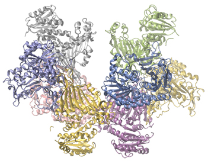

By the end of this section, you will be able to:
* Explain the function of a catalyst in terms of reaction mechanisms and potential energy diagrams
* List examples of catalysis in natural and industrial processes

We have seen that the rate of many reactions can be accelerated by catalysts. A catalyst speeds up the rate of a reaction by lowering the activation energy; in addition, the catalyst is regenerated in the process. Several reactions that are thermodynamically favorable in the absence of a catalyst only occur at a reasonable rate when a catalyst is present. One such reaction is catalytic hydrogenation, the process by which hydrogen is added across an alkene C=C bond to afford the saturated alkane product. A comparison of the reaction coordinate diagrams (also known as energy diagrams) for catalyzed and uncatalyzed alkene hydrogenation is shown in [\[link\]](#CNX_Chem_12_07_Hydrogenat).

 ![A graph is shown with the label, &#x201C;Reaction coordinate,&#x201D; on the x-axis and the label,&#x201C;Energy,&#x201D; on the y-axis. Approximately half-way up the y-axis, a short portion of a black concave down curve which has a horizontal line extended from it across the graph. The left end of this line is labeled &#x201C;H subscript 2 C equals C H subscript 2 plus H subscript 2.&#x201D; The black concave down curve extends upward to reach a maximum near the height of the y-axis. The peak of this curve is labeled, &#x201C;Transition state.&#x201D; A double sided arrow extends from the horizontal line to the peak of the curve. This arrow is labeled, &#x201C;Activation energy of Uncatalyzed reation.&#x201D; From the peak, the curve continues downward to a second horizontally flattened region well below the origin of the curve near the x-axis. This flattened region is shaded in blue and is labeled &#x201C;H subscript 3 C dash C H subscript 3.&#x201D; A double sided arrow is drawn from the lowers part of this curve at the far right of the graph to the line extending across the graph above it. This arrow is labeled, &#x201C;capital delta H less than 0 : exothermic.&#x201D; A second curve is drawn with the same flattened regions at the start and end of the curve. The height of this curve is about two-thirds the height of the first curve. A double sided arrow is drawn from the horizontal line that originates at the left side of the graph to the peak of this second curve. This arrow is labeled, &#x201C;Activation energy of catalyzed reaction.&#x201D;](../resources/CNX_Chem_12_07_Hydrogenat.jpg "This graph compares the reaction coordinates for catalyzed and uncatalyzed alkene hydrogenation."){: #CNX_Chem_12_07_Hydrogenat}

Catalysts function by providing an alternate reaction mechanism that has a lower activation energy than would be found in the absence of the catalyst. In some cases, the catalyzed mechanism may include additional steps, as depicted in the reaction diagrams shown in [\[link\]](#CNX_Chem_12_07_CatReCoDig). This lower activation energy results in an increase in rate as described by the Arrhenius equation. Note that a catalyst decreases the activation energy for both the forward and the reverse reactions and hence *accelerates both the forward and the reverse reactions*. Consequently, the presence of a catalyst will permit a system to reach equilibrium more quickly, but it has no effect on the position of the equilibrium as reflected in the value of its equilibrium constant (see the later chapter on chemical equilibrium).

 ![A graph is shown with the label, &#x201C;Extent of reaction,&#x201D; appearing in a right pointing arrow below the x-axis and the label, &#x201C;Energy,&#x201D; in an upward pointing arrow just left of the y-axis. Approximately one-fifth of the way up the y-axis, a very short, somewhat flattened portion of both a red and a blue curve are shown. This region is labeled &#x201C;Reactants.&#x201D; A red concave down curve extends upward to reach a maximum near the height of the y-axis. This curve is labeled, &#x201C;Uncatalyzed pathway.&#x201D; From the peak, the curve continues downward to a second horizontally flattened region at a height of about one-third the height of the y-axis. This flattened region is labeled, &#x201C;Products.&#x201D; A second curve is drawn in blue with the same flattened regions at the start and end of the curve. The height of this curve is about two-thirds the height of the first curve and just right of its maximum, the curve dips low, then rises back and continues a downward trend at a lower height, but similar to that of the red curve. This blue curve is labeled, &#x201C;Catalyzed pathway.&#x201D;](../resources/CNX_Chem_12_07_CatReCoDig.jpg "This potential energy diagram shows the effect of a catalyst on the activation energy. The catalyst provides a different reaction path with a lower activation energy. As shown, the catalyzed pathway involves a two-step mechanism (note the presence of two transition states) and an intermediate species (represented by the valley between the two transitions states)."){: #CNX_Chem_12_07_CatReCoDig}

Using Reaction Diagrams to Compare Catalyzed Reactions The two reaction diagrams here represent the same reaction: one without a catalyst and one with a catalyst. Identify which diagram suggests the presence of a catalyst, and determine the activation energy for the catalyzed reaction:

 ![In this figure, two graphs are shown. The x-axes are labeled, &#x201C;Extent of reaction,&#x201D; and the y-axes are labeled, &#x201C;Energy ( k J ).&#x201D; The y-axes are marked off from 0 to 50 in intervals of five. In a, a blue curve is shown. It begins with a horizontal segment at about 6. The curve then rises sharply near the middle to reach a maximum of about 32 and similarly falls to another horizontal segment at about 10. In b, the curve begins and ends similarly, but the maximum reached near the center of the graph is only 20.](../resources/CNX_Chem_12_07_Rxndiagramex_img.jpg) 
Solution A catalyst does not affect the energy of reactant or product, so those aspects of the diagrams can be ignored; they are, as we would expect, identical in that respect. There is, however, a noticeable difference in the transition state, which is distinctly lower in diagram (b) than it is in (a). This indicates the use of a catalyst in diagram (b). The activation energy is the difference between the energy of the starting reagents and the transition state—a maximum on the reaction coordinate diagram. The reagents are at 6 kJ and the transition state is at 20 kJ, so the activation energy can be calculated as follows:

<math xmlns="http://www.w3.org/1998/Math/MathML"><mrow><msub><mi>E</mi><mtext>a</mtext></msub><mo>=</mo><mn>20</mn><mspace width="0.2em" /><mtext>kJ</mtext><mo>−</mo><mn>6</mn><mspace width="0.2em" /><mtext>kJ</mtext><mo>=</mo><mn>14</mn><mspace width="0.2em" /><mtext>kJ</mtext></mrow></math>

Check Your Learning Determine which of the two diagrams here (both for the same reaction) involves a catalyst, and identify the activation energy for the catalyzed reaction:

 ![In this figure, two graphs are shown. The x-axes are labeled, &#x201C;Extent of reaction,&#x201D; and the y-axes are labeledc &#x201C;Energy (k J).&#x201D; The y-axes are marked off from 0 to 100 at intervals of 10. In a, a blue curve is shown. It begins with a horizontal segment at about 10. The curve then rises sharply near the middle to reach a maximum of about 91, then sharply falls to about 52, again rises sharply to about 73 and falls to another horizontal segment at about 5. In b, the curve begins and ends similarly, but the first peak reaches about 81, drops to about 55, then rises to about 77 before falling to the horizontal region at about 5.](../resources/CNX_Chem_12_07_Rxndiagramcyl_img.jpg) 

Answer:

Diagram (b) is a catalyzed reaction with an activation energy of about 70 kJ.

# Homogeneous Catalysts

A **homogeneous catalyst**{: data-type="term"} is present in the same phase as the reactants. It interacts with a reactant to form an intermediate substance, which then decomposes or reacts with another reactant in one or more steps to regenerate the original catalyst and form product.

As an important illustration of homogeneous catalysis, consider the earth’s ozone layer. Ozone in the upper atmosphere, which protects the earth from ultraviolet radiation, is formed when oxygen molecules absorb ultraviolet light and undergo the reaction:

<math xmlns="http://www.w3.org/1998/Math/MathML"><mrow><mn>3</mn><msub><mtext>O</mtext><mn>2</mn></msub><mo stretchy="false">(</mo><mi>g</mi><mo stretchy="false">)</mo><mover><mo>→</mo><mrow><mspace width="0.7em" /><mi>h</mi><mi>v</mi><mspace width="0.7em" /></mrow></mover><mn>2</mn><msub><mtext>O</mtext><mn>3</mn></msub><mo stretchy="false">(</mo><mi>g</mi><mo stretchy="false">)</mo></mrow></math>

Ozone is a relatively unstable molecule that decomposes to yield diatomic oxygen by the reverse of this equation. This decomposition reaction is consistent with the following mechanism:

<math xmlns="http://www.w3.org/1998/Math/MathML"><mtable columnalign="left"><mtr /><mtr><mtd><msub><mtext>O</mtext><mn>3</mn></msub><mspace width="0.2em" /><mo stretchy="false">⟶</mo><mspace width="0.2em" /><msub><mtext>O</mtext><mn>2</mn></msub><mo>+</mo><mtext>O</mtext></mtd></mtr><mtr><mtd><mtext>O</mtext><mo>+</mo><msub><mtext>O</mtext><mn>3</mn></msub><mspace width="0.2em" /><mo stretchy="false">⟶</mo><mspace width="0.2em" /><mn>2</mn><msub><mtext>O</mtext><mn>2</mn></msub></mtd></mtr></mtable></math>

The presence of nitric oxide, NO, influences the rate of decomposition of ozone. Nitric oxide acts as a catalyst in the following mechanism:

<math xmlns="http://www.w3.org/1998/Math/MathML"><mtable columnalign="left"><mtr /><mtr><mtd><mtext>NO(</mtext><mi>g</mi><mo stretchy="false">)</mo><mo>+</mo><msub><mtext>O</mtext><mtext>3</mtext></msub><mo stretchy="false">(</mo><mi>g</mi><mo stretchy="false">)</mo><mspace width="0.2em" /><mo stretchy="false">⟶</mo><mspace width="0.2em" /><msub><mtext>NO</mtext><mtext>2</mtext></msub><mo stretchy="false">(</mo><mi>g</mi><mo stretchy="false">)</mo><mo>+</mo><msub><mtext>O</mtext><mtext>2</mtext></msub><mo stretchy="false">(</mo><mi>g</mi><mo stretchy="false">)</mo></mtd></mtr><mtr><mtd><msub><mtext>O</mtext><mn>3</mn></msub><mo stretchy="false">(</mo><mi>g</mi><mo stretchy="false">)</mo><mspace width="0.2em" /><mo stretchy="false">⟶</mo><mspace width="0.2em" /><msub><mtext>O</mtext><mn>2</mn></msub><mo stretchy="false">(</mo><mi>g</mi><mo stretchy="false">)</mo><mo>+</mo><mtext>O</mtext><mo stretchy="false">(</mo><mi>g</mi><mo stretchy="false">)</mo></mtd></mtr><mtr><mtd><msub><mtext>NO</mtext><mn>2</mn></msub><mo stretchy="false">(</mo><mi>g</mi><mo stretchy="false">)</mo><mo>+</mo><mtext>O</mtext><mo stretchy="false">(</mo><mi>g</mi><mo stretchy="false">)</mo><mspace width="0.2em" /><mo stretchy="false">⟶</mo><mspace width="0.2em" /><mtext>NO</mtext><mo stretchy="false">(</mo><mi>g</mi><mo stretchy="false">)</mo><mo>+</mo><msub><mtext>O</mtext><mn>2</mn></msub><mo stretchy="false">(</mo><mi>g</mi><mo stretchy="false">)</mo></mtd></mtr></mtable></math>

The overall chemical change for the catalyzed mechanism is the same as:

<math xmlns="http://www.w3.org/1998/Math/MathML"><mrow><mn>2</mn><msub><mtext>O</mtext><mn>3</mn></msub><mo stretchy="false">(</mo><mi>g</mi><mo stretchy="false">)</mo><mspace width="0.2em" /><mo stretchy="false">⟶</mo><mspace width="0.2em" /><mn>3</mn><msub><mtext>O</mtext><mn>2</mn></msub><mo stretchy="false">(</mo><mi>g</mi><mo stretchy="false">)</mo></mrow></math>

The nitric oxide reacts and is regenerated in these reactions. It is not permanently used up; thus, it acts as a catalyst. The rate of decomposition of ozone is greater in the presence of nitric oxide because of the catalytic activity of NO. Certain compounds that contain chlorine also catalyze the decomposition of ozone.

Mario J. Molina

The 1995 Nobel Prize in Chemistry was shared by Paul J. Crutzen, Mario J. **Molina**{: data-type="term" .no-emphasis} ([\[link\]](#CNX_Chem_12_07_Molina)), and F. Sherwood Rowland “for their work in atmospheric chemistry, particularly concerning the formation and decomposition of ozone.”[1](#footnote1){: data-type="footnote-number" name="footnote-ref1"} Molina, a Mexican citizen, carried out the majority of his work at the Massachusetts Institute of Technology (MIT).

 Mexican chemist Mario Molina (1943 &#x2013;) shared the Nobel Prize in Chemistry in 1995 for his research on (b) the Antarctic ozone hole. (credit a: courtesy of Mario Molina; credit b: modification of work by NASA)"){: #CNX_Chem_12_07_Molina}

In 1974, Molina and Rowland published a paper in the journal *Nature* (one of the major peer-reviewed publications in the field of science) detailing the threat of chlorofluorocarbon gases to the stability of the ozone layer in earth’s upper atmosphere. The ozone layer protects earth from solar radiation by absorbing ultraviolet light. As chemical reactions deplete the amount of ozone in the upper atmosphere, a measurable “hole” forms above Antarctica, and an increase in the amount of solar ultraviolet radiation— strongly linked to the prevalence of skin cancers—reaches earth’s surface. The work of Molina and Rowland was instrumental in the adoption of the Montreal Protocol, an international treaty signed in 1987 that successfully began phasing out production of chemicals linked to ozone destruction.

Molina and Rowland demonstrated that chlorine atoms from human-made chemicals can catalyze ozone destruction in a process similar to that by which NO accelerates the depletion of ozone. Chlorine atoms are generated when chlorocarbons or chlorofluorocarbons—once widely used as refrigerants and propellants—are photochemically decomposed by ultraviolet light or react with hydroxyl radicals. A sample mechanism is shown here using methyl chloride:

<math xmlns="http://www.w3.org/1998/Math/MathML"><mrow><msub><mrow><mtext>CH</mtext></mrow><mn>3</mn></msub><mtext>Cl</mtext><mo>+</mo><mtext>OH</mtext><mspace width="0.2em" /><mo stretchy="false">⟶</mo><mspace width="0.2em" /><mtext>Cl</mtext><mo>+</mo><mtext>other products</mtext></mrow></math>

Chlorine radicals break down ozone and are regenerated by the following catalytic cycle:

<math xmlns="http://www.w3.org/1998/Math/MathML"><mtable columnalign="left"><mtr /><mtr><mtd><mtext>Cl</mtext><mo>+</mo><msub><mtext>O</mtext><mn>3</mn></msub><mspace width="0.2em" /><mo stretchy="false">⟶</mo><mspace width="0.2em" /><mtext>ClO</mtext><mo>+</mo><msub><mtext>O</mtext><mn>2</mn></msub></mtd></mtr><mtr><mtd><mtext>ClO</mtext><mo>+</mo><mtext>O</mtext><mspace width="0.2em" /><mo stretchy="false">⟶</mo><mspace width="0.2em" /><mtext>Cl</mtext><mo>+</mo><msub><mtext>O</mtext><mn>2</mn></msub></mtd></mtr><mtr><mtd><mtext>overall Reaction:</mtext><mspace width="0.2em" /><msub><mtext>O</mtext><mn>3</mn></msub><mo>+</mo><mtext>O</mtext><mspace width="0.2em" /><mo stretchy="false">⟶</mo><mspace width="0.2em" /><mn>2</mn><msub><mtext>O</mtext><mn>2</mn></msub></mtd></mtr></mtable></math>

A single monatomic chlorine can break down thousands of ozone molecules. Luckily, the majority of atmospheric chlorine exists as the catalytically inactive forms Cl2 and ClONO2.

Since receiving his portion of the Nobel Prize, Molina has continued his work in atmospheric chemistry at MIT.

Glucose-6-Phosphate Dehydrogenase Deficiency

Enzymes in the human body act as catalysts for important chemical reactions in cellular metabolism. As such, a deficiency of a particular enzyme can translate to a life-threatening disease. G6PD (glucose-6-phosphate dehydrogenase) deficiency, a genetic condition that results in a shortage of the enzyme glucose-6-phosphate dehydrogenase, is the most common enzyme deficiency in humans. This enzyme, shown in [\[link\]](#CNX_Chem_12_07_Gluc6PhoDe), is the rate-limiting enzyme for the metabolic pathway that supplies NADPH to cells ([\[link\]](#CNX_Chem_12_07_HMPShuntPa)).

{: #CNX_Chem_12_07_Gluc6PhoDe}

A disruption in this pathway can lead to reduced glutathione in red blood cells; once all glutathione is consumed, enzymes and other proteins such as hemoglobin are susceptible to damage. For example, hemoglobin can be metabolized to bilirubin, which leads to jaundice, a condition that can become severe. People who suffer from G6PD deficiency must avoid certain foods and medicines containing chemicals that can trigger damage their glutathione-deficient red blood cells.

![A reaction mechanism is diagrammed in this figure. At the left, the name Glucose is followed by a horizontal, right pointing arrow, labeled, &#x201C;Hexokinase.&#x201D; Below this arrow and to the left is a yellow star shape labeled, &#x201C;A T P.&#x201D; A curved arrow extends from this shape to the right pointing arrow, and down to the right to a small brown oval labeled, &#x201C;A D P.&#x201D; To the right of the horizontal arrow is the name Glucose 6 phosphate, which is followed by another horizontal, right pointing arrow which is labeled, &#x201C;G 6 P D.&#x201D; A small orange rectangle below and left of this arrow is labeled &#x201C;N A D P superscript plus.&#x201D; A curved arrow extends from this shape to the right pointing arrow, and down to the right to a small salmon-colored rectangle labeled &#x201C;N A P D H.&#x201D; A curved arrow extends from this shape below and to the left, back to the orange rectangle labeled, &#x201C;N A D P superscript plus.&#x201D; Another curved arrow extends from a green oval labeled &#x201C;G S S G&#x201D; below the orange rectangle, up to the arrow curving back to the orange rectangle. This last curved arrow continues on to the lower right to a second green oval labeled, &#x201C;G S H.&#x201D; The end of this curved arrow is labeled, &#x201C;Glutathione reductase.&#x201D; To the right of the rightmost horizontal arrow appears the name 6 phosphogluconate.](../resources/CNX_Chem_12_07_HMPShuntPa.jpg "In the mechanism for the pentose phosphate pathway, G6PD catalyzes the reaction that regulates NAPDH, a co-enzyme that regulates glutathione, an antioxidant that protects red blood cells and other cells from oxidative damage."){: #CNX_Chem_12_07_HMPShuntPa}

# Heterogeneous Catalysts

A **heterogeneous catalyst**{: data-type="term"} is a catalyst that is present in a different phase (usually a solid) than the reactants. Such catalysts generally function by furnishing an active surface upon which a reaction can occur. Gas and liquid phase reactions catalyzed by heterogeneous catalysts occur on the surface of the catalyst rather than within the gas or liquid phase.

Heterogeneous catalysis has at least four steps:

1.  Adsorption of the reactant onto the surface of the catalyst
2.  Activation of the adsorbed reactant
3.  Reaction of the adsorbed reactant
4.  Diffusion of the product from the surface into the gas or liquid phase (desorption).
{: data-number-style="arabic"}

Any one of these steps may be slow and thus may serve as the rate determining step. In general, however, in the presence of the catalyst, the overall rate of the reaction is faster than it would be if the reactants were in the gas or liquid phase.

[\[link\]](#CNX_Chem_12_07_HetCats) illustrates the steps that chemists believe to occur in the reaction of compounds containing a carbon–carbon double bond with hydrogen on a nickel catalyst. Nickel is the catalyst used in the hydrogenation of polyunsaturated fats and oils (which contain several carbon–carbon double bonds) to produce saturated fats and oils (which contain only carbon–carbon single bonds).

 ![In this figure, four diagrams labeled a through d are shown. In each, a green square surface is shown in perspective to provide a three-dimensional appearance. In a, the label &#x201C;N i surface&#x201D; is placed above with a line segment extending to the green square. At the lower left and upper right, pairs of white spheres bonded tougher together appear as well as white spheres on the green surface. Black arrows are drawn from each of the white spheres above the surface to the white sphere on the green surface. In b, the white spheres are still present on the green surface. Near the center of this surface is a molecule with two central black spheres with a double bond indicated by two horizontal black rods between them. Above and below to the left and right, a total of four white spheres are connected to the black spheres with white rods. A line segment extends from this structure to the label, &#x201C;Ethylene absorbed on surface breaking pi bonds.&#x201D; Just above this is a nearly identical structure greyed out with three downward pointing arrows to the black and white structure to indicate downward motion. The label &#x201C;Ethylene&#x201D; at the top of the diagram is connected to the greyed out structure with a line segment. In c, the diagram is very similar to b except that the greyed out structure and labels are gone and one of the white spheres near the black and white structure in each pair on the green surface is greyed out. Arrows point from the greyed out white spheres to the double bond between the two black spheres. In d, only a single white sphere remains from each pair in the green surface. A curved arrow points from the middle of the green surface to a model above with two central black spheres with a single black rod indicating a single bond between them. Each of the black rods has three small white spheres bonded as indicated by white rods between the black spheres and the small white spheres. The four bonds around each black sphere are evenly distributed about the black spheres.](../resources/CNX_Chem_12_07_HetCats.jpg "There are four steps in the catalysis of the reaction C2H4+H2&#x27F6;C2H6 by nickel. (a) Hydrogen is adsorbed on the surface, breaking the H&#x2013;H bonds and forming Ni&#x2013;H bonds. (b) Ethylene is adsorbed on the surface, breaking the &#x3C0;-bond and forming Ni&#x2013;C bonds. (c) Atoms diffuse across the surface and form new C&#x2013;H bonds when they collide. (d) C2H6 molecules escape from the nickel surface, since they are not strongly attracted to nickel."){: #CNX_Chem_12_07_HetCats}

Other significant industrial processes that involve the use of heterogeneous catalysts include the preparation of sulfuric acid, the preparation of ammonia, the oxidation of ammonia to nitric acid, and the synthesis of methanol, CH3OH. Heterogeneous catalysts are also used in the catalytic converters found on most gasoline-powered automobiles ([\[link\]](#CNX_Chem_12_07_CatConvert)).

Automobile Catalytic Converters

Scientists developed catalytic converters to reduce the amount of toxic emissions produced by burning gasoline in internal combustion engines. Catalytic converters take advantage of all five factors that affect the speed of chemical reactions to ensure that exhaust emissions are as safe as possible.

By utilizing a carefully selected blend of catalytically active metals, it is possible to effect complete combustion of all carbon-containing compounds to carbon dioxide while also reducing the output of nitrogen oxides. This is particularly impressive when we consider that one step involves adding more oxygen to the molecule and the other involves removing the oxygen ([\[link\]](#CNX_Chem_12_07_CatConvert)).

![An image is shown of a catalytic converter. At the upper left, a blue arrow pointing into a pipe that enters a larger, widened chamber is labeled, &#x201C;Dirty emissions.&#x201D; A small black arrow that points to the lower right is positioned along the upper left side of the widened region. This arrow is labeled, &#x201C;Additional oxygen from air pump.&#x201D; The image shows the converter with the upper surface removed, exposing a red-brown interior. The portion of the converter closest to the dirty emissions inlet shows small, round components in an interior layer. This layer is labeled &#x201C;Three-way reduction catalyst.&#x201D; The middle region shows closely packed small brown rods that are aligned parallel to the dirty emissions inlet pipe. The final quarter of the interior of the catalytic converter again shows a layer of closely packed small red brown circles. Two large light grey arrows extend from this layer to the open region at the lower right of the image to the label &#x201C;Clean emissions.&#x201D;](../resources/CNX_Chem_12_07_CatConvert.jpg "A catalytic converter allows for the combustion of all carbon-containing compounds to carbon dioxide, while at the same time reducing the output of nitrogen oxide and other pollutants in emissions from gasoline-burning engines."){: #CNX_Chem_12_07_CatConvert}

Most modern, three-way catalytic converters possess a surface impregnated with a platinum-rhodium catalyst, which catalyzes the conversion nitric oxide into dinitrogen and oxygen as well as the conversion of carbon monoxide and hydrocarbons such as octane into carbon dioxide and water vapor:

<math xmlns="http://www.w3.org/1998/Math/MathML"><mtable columnalign="left"><mtr><mtd><mn>2</mn><msub><mtext>NO</mtext><mtext>2</mtext></msub><mo stretchy="false">(</mo><mi>g</mi><mo stretchy="false">)</mo><mspace width="0.2em" /><mo stretchy="false">⟶</mo><mspace width="0.2em" /><msub><mtext>N</mtext><mtext>2</mtext></msub><mo stretchy="false">(</mo><mi>g</mi><mo stretchy="false">)</mo><mo>+</mo><mn>2</mn><msub><mtext>O</mtext><mtext>2</mtext></msub><mo stretchy="false">(</mo><mi>g</mi><mo stretchy="false">)</mo></mtd></mtr><mtr><mtd><mn>2</mn><mtext>CO(</mtext><mi>g</mi><mo stretchy="false">)</mo><mo>+</mo><msub><mtext>O</mtext><mn>2</mn></msub><mo stretchy="false">(</mo><mi>g</mi><mo stretchy="false">)</mo><mspace width="0.2em" /><mo stretchy="false">⟶</mo><mspace width="0.2em" /><mn>2</mn><msub><mtext>CO</mtext><mtext>2</mtext></msub><mo stretchy="false">(</mo><mi>g</mi><mo stretchy="false">)</mo></mtd></mtr><mtr><mtd><mn>2</mn><msub><mtext>C</mtext><mn>8</mn></msub><msub><mtext>H</mtext><mrow><mn>18</mn></mrow></msub><mo stretchy="false">(</mo><mi>g</mi><mo stretchy="false">)</mo><mo>+</mo><mn>25</mn><msub><mtext>O</mtext><mn>2</mn></msub><mo stretchy="false">(</mo><mi>g</mi><mo stretchy="false">)</mo><mspace width="0.2em" /><mo stretchy="false">⟶</mo><mspace width="0.2em" /><mn>16</mn><msub><mtext>CO</mtext><mn>2</mn></msub><mo stretchy="false">(</mo><mi>g</mi><mo stretchy="false">)</mo><mo>+</mo><mn>18</mn><msub><mtext>H</mtext><mn>2</mn></msub><mtext>O</mtext><mo stretchy="false">(</mo><mi>g</mi><mo stretchy="false">)</mo></mtd></mtr></mtable></math>

In order to be as efficient as possible, most catalytic converters are preheated by an electric heater. This ensures that the metals in the catalyst are fully active even before the automobile exhaust is hot enough to maintain appropriate reaction temperatures.

  
The University of California at Davis’ “ChemWiki” provides a [thorough explanation][1] of how catalytic converters work.

Enzyme Structure and Function

The study of enzymes is an important interconnection between biology and chemistry. Enzymes are usually proteins (polypeptides) that help to control the rate of chemical reactions between biologically important compounds, particularly those that are involved in cellular metabolism. Different classes of enzymes perform a variety of functions, as shown in [\[link\]](#fs-idm184565904).

<table summary="This table has two columns and seven rows. The first row is a header row, and it labels each column, &#x201C;Class,&#x201D; and, &#x201C;Function.&#x201D; Under the &#x201C;Class&#x201D; column are the following: &#x201C;oxidoreductases,&#x201D; &#x201C;transferases,&#x201D; &#x201C;hydrolases,&#x201D; &#x201C;lyases,&#x201D; &#x201C;isomerases,&#x201D; and &#x201C;ligases.&#x201D; Under the &#x201C;Function&#x201D; column are the following: &#x201C;redox reactions,&#x201D; &#x201C;transfer of functional groups,&#x201D; &#x201C;hydrolysis reactions,&#x201D; &#x201C;group elimination to form double bonds,&#x201D; &#x201C;isomerization,&#x201D; and &#x201C;bond formation with ATP hydrolysis.&#x201D;" class="span-all"><thead>
<tr valign="middle">
<th colspan="2" data-align="center">Classes of Enzymes and Their Functions</th>
</tr>
<tr valign="middle">
<th data-align="left">Class</th>
<th data-align="left">Function</th>
</tr>
</thead><tbody>
<tr valign="middle">
<td data-align="left">oxidoreductases</td>
<td data-align="left">redox reactions</td>
</tr>
<tr valign="middle">
<td data-align="left">transferases</td>
<td data-align="left">transfer of functional groups</td>
</tr>
<tr valign="middle">
<td data-align="left">hydrolases</td>
<td data-align="left">hydrolysis reactions</td>
</tr>
<tr valign="middle">
<td data-align="left">lyases</td>
<td data-align="left">group elimination to form double bonds</td>
</tr>
<tr valign="middle">
<td data-align="left">isomerases</td>
<td data-align="left">isomerization</td>
</tr>
<tr valign="middle">
<td data-align="left">ligases</td>
<td data-align="left">bond formation with ATP hydrolysis</td>
</tr>
</tbody></table>
Enzyme molecules possess an active site, a part of the molecule with a shape that allows it to bond to a specific substrate (a reactant molecule), forming an enzyme-substrate complex as a reaction intermediate. There are two models that attempt to explain how this active site works. The most simplistic model is referred to as the lock-and-key hypothesis, which suggests that the molecular shapes of the active site and substrate are complementary, fitting together like a key in a lock. The induced fit hypothesis, on the other hand, suggests that the enzyme molecule is flexible and changes shape to accommodate a bond with the substrate. This is not to suggest that an enzyme’s active site is completely malleable, however. Both the lock-and-key model and the induced fit model account for the fact that enzymes can only bind with specific substrates, since in general a particular enzyme only catalyzes a particular reaction ([\[link\]](#CNX_Chem_12_07_Enzyme)).

![A diagram is shown of two possible interactions of an enzyme and a substrate. In a, which is labeled &#x201C;Lock-and-key,&#x201D; two diagrams are shown. The first shows a green wedge-like shape with two small depressions in the upper surface of similar size, but the depression on the left has a curved shape, and the depression on the right has a pointed shape. This green shape is labeled &#x201C;Enzyme.&#x201D; Just above this shape are two smaller, irregular, lavender shapes each with a projection from its lower surface. The lavender shape on the left has a curved projection which matches the shape of the depression on the left in the green shape below. This projection is shaded orange and has a curved arrow extending from in to the matching depression in the green shape below. Similarly, the lavender shape on the right has a projection with a pointed tip which matches the shape of the depression on the right in the green shape below. This projection is shaded orange and has a curved arrow extending from in to the matching depression in the green shape below. Two line segments extend from the depressions in the green shape to form an inverted V shape above the depressions. Above this and between the lavender shapes is the label, &#x201C;Active site is proper shape.&#x201D; The label &#x201C;Substrates&#x201D; is at the very top of the diagram with line segments extending to the two lavender shapes. To the right of this diagram is a second diagram showing the lavender shapes positioned next to each other, fit snugly into the depressions in the green shape, which is labeled &#x201C;Enzyme.&#x201D; Above this diagram is the label, &#x201C;Substrate complex formed.&#x201D; In b, which is labeled &#x201C;Induced fit,&#x201D; two diagrams are shown. The first shows a green wedge-like shape with two small depressions in the upper surface of similar size, but irregular shape. This green shape is labeled &#x201C;Enzyme.&#x201D; Just above this shape are two smaller irregular lavender shapes each with a projection from its lower surface. The lavender shape on the left has a curved projection. This projection is shaded orange and has a curved arrow extending from it to the irregular depression just below it in the green shape below. Similarly, the lavender shape on the right has a projection with a pointed tip. This projection is shaded orange and has a curved arrow extending from it to the irregular depression just below it in the green shape below. Two line segments extend from the depressions in the green shape to form an inverted V shape above the depressions. Above this and between the lavender shapes is the label, &#x201C;Active site changes to fit.&#x201D; The label, &#x201C;Substrates&#x201D; is at the very top of the diagram with line segments extending to the two lavender shapes. To the right of this diagram is a second diagram showing the purple shapes positioned next to each other, fit snugly into the depressions in the green shape, which is labeled &#x201C;Enzyme.&#x201D; Above this diagram is the label &#x201C;Substrate complex formed.&#x201D; The projections from the lavender shapes match the depression shapes in the green shape, resulting in a proper fit.](../resources/CNX_Chem_12_07_Enzyme.jpg "(a) According to the lock-and-key model, the shape of an enzyme&#x2019;s active site is a perfect fit for the substrate. (b) According to the induced fit model, the active site is somewhat flexible, and can change shape in order to bond with the substrate."){: #CNX_Chem_12_07_Enzyme}

  
The [Royal Society of Chemistry][2] provides an excellent introduction to enzymes for students and teachers.

# Key Concepts and Summary

Catalysts affect the rate of a chemical reaction by altering its mechanism to provide a lower activation energy. Catalysts can be homogenous (in the same phase as the reactants) or heterogeneous (a different phase than the reactants).

# Chemistry End of Chapter Exercises

Account for the increase in reaction rate brought about by a catalyst.

The general mode of action for a catalyst is to provide a mechanism by which the reactants can unite more readily by taking a path with a lower reaction energy. The rates of both the forward and the reverse reactions are increased, leading to a faster achievement of equilibrium.

Compare the functions of homogeneous and heterogeneous catalysts.

Consider this scenario and answer the following questions: Chlorine atoms resulting from decomposition of chlorofluoromethanes, such as CCl2F2, catalyze the decomposition of ozone in the atmosphere. One simplified mechanism for the decomposition is:* * *
{: data-type="newline"}

 <math xmlns="http://www.w3.org/1998/Math/MathML"><mtable columnalign="left"><mtr /><mtr /><mtr><mtd><msub><mtext>O</mtext><mn>3</mn></msub><mover><mo>→</mo><mrow><mspace width="0.2em" /><mtext>sunlight</mtext><mspace width="0.2em" /></mrow></mover><msub><mtext>O</mtext><mn>2</mn></msub><mo>+</mo><mtext>O</mtext></mtd></mtr><mtr><mtd><msub><mtext>O</mtext><mn>3</mn></msub><mo>+</mo><mtext>Cl</mtext><mspace width="0.2em" /><mo stretchy="false">⟶</mo><mspace width="0.2em" /><msub><mtext>O</mtext><mn>2</mn></msub><mo>+</mo><mtext>ClO</mtext></mtd></mtr><mtr><mtd><mtext>ClO</mtext><mo>+</mo><mtext>O</mtext><mspace width="0.2em" /><mo stretchy="false">⟶</mo><mspace width="0.2em" /><mtext>Cl</mtext><mo>+</mo><msub><mtext>O</mtext><mn>2</mn></msub></mtd></mtr></mtable></math>

(a) Explain why chlorine atoms are catalysts in the gas-phase transformation:* * *
{: data-type="newline"}

 <math xmlns="http://www.w3.org/1998/Math/MathML"><mrow><mn>2</mn><msub><mtext>O</mtext><mn>3</mn></msub><mspace width="0.2em" /><mo stretchy="false">⟶</mo><mspace width="0.2em" /><mn>3</mn><msub><mtext>O</mtext><mn>2</mn></msub></mrow></math>

(b) Nitric oxide is also involved in the decomposition of ozone by the mechanism:* * *
{: data-type="newline"}

 <math xmlns="http://www.w3.org/1998/Math/MathML"><mtable columnalign="left"><mtr /><mtr><mtd><msub><mtext>O</mtext><mn>3</mn></msub><mover><mo>→</mo><mrow><mspace width="0.2em" /><mtext>sunlight</mtext><mspace width="0.2em" /></mrow></mover><msub><mtext>O</mtext><mn>2</mn></msub><mo>+</mo><mtext>O</mtext></mtd></mtr><mtr><mtd><msub><mtext>O</mtext><mn>3</mn></msub><mo>+</mo><mtext>NO</mtext><mspace width="0.2em" /><mo stretchy="false">⟶</mo><mspace width="0.2em" /><msub><mtext>NO</mtext><mn>2</mn></msub><mo>+</mo><msub><mtext>O</mtext><mn>2</mn></msub></mtd></mtr><mtr><mtd><msub><mtext>NO</mtext><mn>2</mn></msub><mo>+</mo><mtext>O</mtext><mspace width="0.2em" /><mo stretchy="false">⟶</mo><mspace width="0.2em" /><mtext>NO</mtext><mo>+</mo><msub><mtext>O</mtext><mn>2</mn></msub></mtd></mtr></mtable></math>

Is NO a catalyst for the decomposition? Explain your answer.

(a) Chlorine atoms are a catalyst because they react in the second step but are regenerated in the third step. Thus, they are not used up, which is a characteristic of catalysts. (b) NO is a catalyst for the same reason as in part (a).

For each of the following pairs of reaction diagrams, identify which of the pair is catalyzed:

(a)* * *
{: data-type="newline"}

  ![In this figure, two graphs are shown. The x-axes are labeled, &#x201C;Extent of reaction,&#x201D; and the y-axes are labeled, &#x201C;Energy (k J).&#x201D; The y-axis of the first graph is marked off from 0 to 30 in intervals of 5. The y-axis of the second graph is marked off from 0 to 25 by intervals of 5. In a, a blue curve is shown. It begins with a horizontal region at about 12. The curve then rises sharply near the middle to reach a maximum of about 24 and similarly falls to another horizontal segment at 5. In b, the curve begins and ends similarly, but the maximum reached near the center of the graph is only 20.](../resources/CNX_Chem_12_07_Exercise4a_img.jpg) 

(b)* * *
{: data-type="newline"}

  ![In this figure, two graphs are shown. The x-axes are labeled, &#x201C;Extent of reaction,&#x201D; and the y-axes are labeled, &#x201C;Energy.&#x201D; The y-axes are marked off from 0 to 50 in intervals of 5. In a, a blue curve is shown. It begins with a horizontal region at about 2. The curve then rises sharply near the middle to reach a maximum of about 43 and similarly falls to another horizontal segment at 15. In b, the curve begins and ends similarly, but the maximum reached near the center of the graph is only about 32.](../resources/CNX_Chem_12_07_Exercise4b_img.jpg) 

For each of the following pairs of reaction diagrams, identify which of the pairs is catalyzed:

(a)* * *
{: data-type="newline"}

  ![In this figure, two graphs are shown. The x-axes are labeled, &#x201C;Extent of reaction&#x201D; and the y-axes are labeled, &#x201C;Energy (k J).&#x201D; The y-axes are marked off from 0 to 50 at intervals of 5. In a, a blue curve is shown. It begins with a horizontal segment at about 2J. The curve then rises sharply near the middle to reach a maximum of about 46, then sharply falls to about 35, again rises to about 38 and falls to another horizontal segment at about 15. In b, the curve begins and ends similarly, but the first peak reaches about 46, drops to about 35, then rises to about 43 before falling to the horizontal region at about 15.](../resources/CNX_Chem_12_07_Exercise5a_img.jpg) 

(b)* * *
{: data-type="newline"}

  ![In this figure, two graphs are shown. The x-axes are labeled, &#x201C;Extent of reaction,&#x201D; and the y-axes are labeled, &#x201C;Energy (k J).&#x201D; The y-axes are marked off from 0 to 50 at intervals of 5. In a, a blue curve is shown. It begins with a horizontal segment at about 34. The curve then rises sharply near the middle to reach a maximum of about 45, then sharply falls to about 25, again rises sharply to about 35 and falls to another horizontal segment at about 15. In b, the curve begins and ends similarly, but the first peak reaches about 40, drops to 25, then rises to 35 before falling to the horizontal region at about 15.](../resources/CNX_Chem_12_07_Exercise5b_img.jpg) 

The lowering of the transition state energy indicates the effect of a catalyst. (a) B; (b) B

For each of the following reaction diagrams, estimate the activation energy (*E*a) of the reaction:

(a)* * *
{: data-type="newline"}

   

(b)* * *
{: data-type="newline"}

   

For each of the following reaction diagrams, estimate the activation energy (*E*a) of the reaction:

(a)* * *
{: data-type="newline"}

   

(b)* * *
{: data-type="newline"}

   

The energy needed to go from the initial state to the transition state is (a) 10 kJ; (b) 10 kJ

Based on the diagrams in [[link]](#fs-idm260004768), which of the reactions has the fastest rate? Which has the slowest rate?

Based on the diagrams in [[link]](#fs-idm218836096), which of the reactions has the fastest rate? Which has the slowest rate?

Both have the same activation energy, so they also have the same rate.

## Footnotes
{: data-type="footnote-title"}

1.  [1](#footnote-ref1){: data-type="footnote-ref" name="footnote1"} “The Nobel Prize in Chemistry 1995,” Nobel Prize.org, accessed February 18, 2015, http://www.nobelprize.org/nobel\\\_prizes/chemistry/laureates/1995/.

## Glossary
{: data-type="glossary-title"}

heterogeneous catalyst
: catalyst present in a different phase from the reactants, furnishing a surface at which a reaction can occur
{: .definition}

homogeneous catalyst
: catalyst present in the same phase as the reactants
{: .definition}

[1]: http://openstaxcollege.org/l/16catconvert
[2]: http://openstaxcollege.org/l/16enzymes
