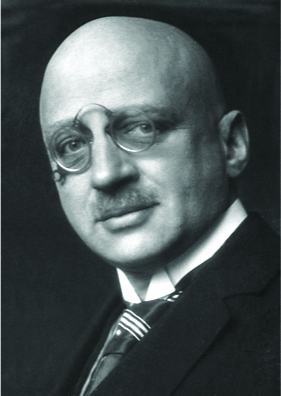

By the end of this section, you will be able to:
* Describe the ways in which an equilibrium system can be stressed
* Predict the response of a stressed equilibrium using Le Châtelier’s principle

As we saw in the previous section, reactions proceed in both directions (reactants go to products and products go to reactants). We can tell a reaction is at equilibrium if the reaction quotient (*Q*) is equal to the equilibrium constant (*K*). We next address what happens when a system at equilibrium is disturbed so that *Q* is no longer equal to *K*. If a system at equilibrium is subjected to a perturbance or **stress**{: data-type="term"} (such as a change in concentration) the **position of equilibrium**{: data-type="term"} changes. Since this stress affects the concentrations of the reactants and the products, the value of *Q* will no longer equal the value of *K*. To re-establish equilibrium, the system will either shift toward the products (if *Q &lt;* K) or the reactants (if Q &gt; *K*) until *Q* returns to the same value as *K*.

This process is described by **Le Châtelier\'s principle**{: data-type="term"}\: When a chemical system at equilibrium is disturbed, it returns to equilibrium by counteracting the disturbance. As described in the previous paragraph, the disturbance causes a change in *Q*; the reaction will shift to re-establish *Q* = *K*.

# Predicting the Direction of a Reversible Reaction

Le Châtelier\'s principle can be used to predict changes in equilibrium concentrations when a system that is at equilibrium is subjected to a stress. However, if we have a mixture of reactants and products that have not yet reached equilibrium, the changes necessary to reach equilibrium may not be so obvious. In such a case, we can compare the values of *Q* and *K* for the system to predict the changes.

## Effect of Change in Concentration on Equilibrium

A chemical system at equilibrium can be temporarily shifted out of equilibrium by adding or removing one or more of the reactants or products. The concentrations of both reactants and products then undergo additional changes to return the system to equilibrium.

The stress on the system in [\[link\]](#CNX_Chem_13_03_tubes) is the reduction of the equilibrium concentration of SCN− (lowering the concentration of one of the reactants would cause *Q* to be larger than *K*). As a consequence, Le Châtelier\'s principle leads us to predict that the concentration of Fe(SCN)2+ should decrease, increasing the concentration of SCN− part way back to its original concentration, and increasing the concentration of Fe3+ above its initial equilibrium concentration.

  The test tube contains 0.1 M Fe3+. (b) Thiocyanate ion has been added to solution in (a), forming the red Fe(SCN)2+ ion. Fe3+(aq)+SCN&#x2212;(aq)&#x21CC;Fe(SCN)2+(aq). (c) Silver nitrate has been added to the solution in (b), precipitating some of the SCN&#x2212; as the white solid AgSCN. Ag+(aq)+SCN&#x2212;(aq)&#x21CC;AgSCN(s). The decrease in the SCN&#x2212; concentration shifts the first equilibrium in the solution to the left, decreasing the concentration (and lightening color) of the Fe(SCN)2+. (credit: modification of work by Mark Ott)"){: #CNX_Chem_13_03_tubes}

The effect of a change in concentration on a system at equilibrium is illustrated further by the equilibrium of this chemical reaction:

<math xmlns="http://www.w3.org/1998/Math/MathML"><mrow><msub><mtext>H</mtext><mn>2</mn></msub><mo stretchy="false">(</mo><mi>g</mi><mo stretchy="false">)</mo><mo>+</mo><msub><mtext>I</mtext><mn>2</mn></msub><mo stretchy="false">(</mo><mi>g</mi><mo stretchy="false">)</mo><mo stretchy="false">⇌</mo><mn>2</mn><mtext>HI</mtext><mo stretchy="false">(</mo><mi>g</mi><mo stretchy="false">)</mo><mspace width="5em" /><msub><mi>K</mi><mi>c</mi></msub><mo>=</mo><mn>50.0</mn><mspace width="0.2em" /><mtext>at</mtext><mspace width="0.2em" /><mn>400</mn><mspace width="0.2em" /><mtext>°C</mtext></mrow></math>

The numeric values for this example have been determined experimentally. A mixture of gases at 400 °C with \[H2\] = \[I2\] = 0.221 *M* and \[HI\] = 1.563 *M* is at equilibrium; for this mixture, *Qc* = *Kc* = 50.0. If H2 is introduced into the system so quickly that its concentration doubles before it begins to react (new \[H2\] = 0.442 *M*), the reaction will shift so that a new equilibrium is reached, at which \[H2\] = 0.374 *M*, \[I2\] = 0.153 *M*, and \[HI\] = 1.692 *M*. This gives:

<math xmlns="http://www.w3.org/1998/Math/MathML"><mrow><msub><mi>Q</mi><mi>c</mi></msub><mo>=</mo><mspace width="0.2em" /><mfrac><mrow><msup><mrow><mrow><mo>[</mo><mrow><mtext>HI</mtext></mrow><mo>]</mo></mrow></mrow><mn>2</mn></msup></mrow><mrow><mrow><mo>[</mo><mrow><msub><mtext>H</mtext><mn>2</mn></msub></mrow><mo>]</mo></mrow><mspace width="0.2em" /><mrow><mo>[</mo><mrow><msub><mtext>I</mtext><mn>2</mn></msub></mrow><mo>]</mo></mrow></mrow></mfrac><mo>=</mo><mspace width="0.2em" /><mfrac><mrow><msup><mrow><mrow><mo>(</mo><mrow><mn>1.692</mn></mrow><mo>)</mo></mrow></mrow><mn>2</mn></msup></mrow><mrow><mrow><mo>(</mo><mrow><mn>0.374</mn></mrow><mo>)</mo></mrow><mrow><mo>(</mo><mrow><mn>0.153</mn></mrow><mo>)</mo></mrow></mrow></mfrac><mspace width="0.2em" /><mo>=</mo><mn>50.0</mn><mo>=</mo><msub><mi>K</mi><mi>c</mi></msub></mrow></math>

We have stressed this system by introducing additional H2. The stress is relieved when the reaction shifts to the right, using up some (but not all) of the excess H2, reducing the amount of uncombined I2, and forming additional HI.

## Effect of Change in Pressure on Equilibrium

Sometimes we can change the position of equilibrium by changing the pressure of a system. However, changes in pressure have a measurable effect only in systems in which gases are involved, and then only when the chemical reaction produces a change in the total number of gas molecules in the system. An easy way to recognize such a system is to look for different numbers of moles of gas on the reactant and product sides of the equilibrium. While evaluating pressure (as well as related factors like volume), it is important to remember that equilibrium constants are defined with regard to concentration (for *Kc*) or partial pressure (for *KP*). Some changes to total pressure, like adding an inert gas that is not part of the equilibrium, will change the total pressure but not the partial pressures of the gases in the equilibrium constant expression. Thus, addition of a gas not involved in the equilibrium will not perturb the equilibrium.

  
Check out this [link][1] to see a dramatic visual demonstration of how equilibrium changes with pressure changes.

As we increase the pressure of a gaseous system at equilibrium, either by decreasing the volume of the system or by adding more of one of the components of the equilibrium mixture, we introduce a stress by increasing the partial pressures of one or more of the components. In accordance with Le Châtelier\'s principle, a shift in the equilibrium that reduces the total number of molecules per unit of volume will be favored because this relieves the stress. The reverse reaction would be favored by a decrease in pressure.

Consider what happens when we increase the pressure on a system in which NO, O2, and NO2 are at equilibrium:

<math xmlns="http://www.w3.org/1998/Math/MathML"><mrow><mn>2</mn><mtext>NO</mtext><mo stretchy="false">(</mo><mi>g</mi><mo stretchy="false">)</mo><mo>+</mo><msub><mtext>O</mtext><mn>2</mn></msub><mo stretchy="false">(</mo><mi>g</mi><mo stretchy="false">)</mo><mo stretchy="false">⇌</mo><mn>2</mn><msub><mrow><mtext>NO</mtext></mrow><mn>2</mn></msub><mo stretchy="false">(</mo><mi>g</mi><mo stretchy="false">)</mo></mrow></math>

The formation of additional amounts of NO2 decreases the total number of molecules in the system because each time two molecules of NO2 form, a total of three molecules of NO and O2 are consumed. This reduces the total pressure exerted by the system and reduces, but does not completely relieve, the stress of the increased pressure. On the other hand, a decrease in the pressure on the system favors decomposition of NO2 into NO and O2, which tends to restore the pressure.

Now consider this reaction:

<math xmlns="http://www.w3.org/1998/Math/MathML"><mrow><msub><mtext>N</mtext><mn>2</mn></msub><mo stretchy="false">(</mo><mi>g</mi><mo stretchy="false">)</mo><mo>+</mo><msub><mtext>O</mtext><mn>2</mn></msub><mo stretchy="false">(</mo><mi>g</mi><mo stretchy="false">)</mo><mo stretchy="false">⇌</mo><mn>2</mn><mtext>NO</mtext><mo stretchy="false">(</mo><mi>g</mi><mo stretchy="false">)</mo></mrow></math>

Because there is no change in the total number of molecules in the system during reaction, a change in pressure does not favor either formation or decomposition of gaseous nitrogen monoxide.

## Effect of Change in Temperature on Equilibrium

Changing concentration or pressure perturbs an equilibrium because the reaction quotient is shifted away from the equilibrium value. Changing the temperature of a system at equilibrium has a different effect: A change in temperature actually changes the value of the equilibrium constant. However, we can qualitatively predict the effect of the temperature change by treating it as a stress on the system and applying Le Châtelier\'s principle.

When hydrogen reacts with gaseous iodine, heat is evolved.

<math xmlns="http://www.w3.org/1998/Math/MathML"><mrow><msub><mtext>H</mtext><mn>2</mn></msub><mo stretchy="false">(</mo><mi>g</mi><mo stretchy="false">)</mo><mo>+</mo><msub><mtext>I</mtext><mn>2</mn></msub><mo stretchy="false">(</mo><mi>g</mi><mo stretchy="false">)</mo><mo stretchy="false">⇌</mo><mn>2</mn><mtext>HI</mtext><mo stretchy="false">(</mo><mi>g</mi><mo stretchy="false">)</mo><mspace width="5em" /><mtext>Δ</mtext><mi>H</mi><mo>=</mo><mn>−9.4</mn><mspace width="0.2em" /><mtext>kJ</mtext><mspace width="0.2em" /><mrow><mo>(</mo><mrow><mtext>exothermic</mtext></mrow><mo>)</mo></mrow></mrow></math>

Because this reaction is exothermic, we can write it with heat as a product.

<math xmlns="http://www.w3.org/1998/Math/MathML"><mrow><msub><mtext>H</mtext><mn>2</mn></msub><mo stretchy="false">(</mo><mi>g</mi><mo stretchy="false">)</mo><mo>+</mo><msub><mtext>I</mtext><mn>2</mn></msub><mo stretchy="false">(</mo><mi>g</mi><mo stretchy="false">)</mo><mo stretchy="false">⇌</mo><mtext>2HI</mtext><mo stretchy="false">(</mo><mi>g</mi><mo stretchy="false">)</mo><mo>+</mo><mtext>heat</mtext></mrow></math>

Increasing the temperature of the reaction increases the internal energy of the system. Thus, increasing the temperature has the effect of increasing the amount of one of the products of this reaction. The reaction shifts to the left to relieve the stress, and there is an increase in the concentration of H2 and I2 and a reduction in the concentration of HI. Lowering the temperature of this system reduces the amount of energy present, favors the production of heat, and favors the formation of hydrogen iodide.

When we change the temperature of a system at equilibrium, the equilibrium constant for the reaction changes. Lowering the temperature in the HI system increases the equilibrium constant: At the new equilibrium the concentration of HI has increased and the concentrations of H2 and I2 decreased. Raising the temperature decreases the value of the equilibrium constant, from 67.5 at 357 °C to 50.0 at 400 °C.

Temperature affects the equilibrium between NO2 and N2O4 in this reaction

<math xmlns="http://www.w3.org/1998/Math/MathML"><mrow><msub><mtext>N</mtext><mn>2</mn></msub><msub><mtext>O</mtext><mn>4</mn></msub><mo stretchy="false">(</mo><mi>g</mi><mo stretchy="false">)</mo><mo stretchy="false">⇌</mo><mn>2</mn><msub><mrow><mtext>NO</mtext></mrow><mn>2</mn></msub><mo stretchy="false">(</mo><mi>g</mi><mo stretchy="false">)</mo><mspace width="5em" /><mtext>Δ</mtext><mi>H</mi><mo>=</mo><mn>57.20</mn><mspace width="0.2em" /><mtext>kJ</mtext></mrow></math>

The positive Δ*H* value tells us that the reaction is endothermic and could be written

<math xmlns="http://www.w3.org/1998/Math/MathML"><mrow><mtext>heat</mtext><mo>+</mo><msub><mtext>N</mtext><mn>2</mn></msub><msub><mtext>O</mtext><mn>4</mn></msub><mo stretchy="false">(</mo><mi>g</mi><mo stretchy="false">)</mo><mo stretchy="false">⇌</mo><mn>2</mn><msub><mrow><mtext>NO</mtext></mrow><mn>2</mn></msub><mo stretchy="false">(</mo><mi>g</mi><mo stretchy="false">)</mo></mrow></math>

At higher temperatures, the gas mixture has a deep brown color, indicative of a significant amount of brown NO2 molecules. If, however, we put a stress on the system by cooling the mixture (withdrawing energy), the equilibrium shifts to the left to supply some of the energy lost by cooling. The concentration of colorless N2O4 increases, and the concentration of brown NO2 decreases, causing the brown color to fade.

  
This interactive [animation][2] allows you to apply Le Châtelier\'s principle to predict the effects of changes in concentration, pressure, and temperature on reactant and product concentrations.

# Catalysts Do Not Affect Equilibrium

As we learned during our study of kinetics, a catalyst can speed up the rate of a reaction. Though this increase in reaction rate may cause a system to reach equilibrium more quickly (by speeding up the forward and reverse reactions), a catalyst has no effect on the value of an equilibrium constant nor on equilibrium concentrations.

The interplay of changes in concentration or pressure, temperature, and the lack of an influence of a catalyst on a chemical equilibrium is illustrated in the industrial synthesis of ammonia from nitrogen and hydrogen according to the equation

<math xmlns="http://www.w3.org/1998/Math/MathML"><mrow><msub><mtext>N</mtext><mn>2</mn></msub><mo stretchy="false">(</mo><mi>g</mi><mo stretchy="false">)</mo><mo>+</mo><mn>3</mn><msub><mtext>H</mtext><mn>2</mn></msub><mo stretchy="false">(</mo><mi>g</mi><mo stretchy="false">)</mo><mo stretchy="false">⇌</mo><mn>2</mn><msub><mrow><mtext>NH</mtext></mrow><mn>3</mn></msub><mo stretchy="false">(</mo><mi>g</mi><mo stretchy="false">)</mo></mrow></math>

A large quantity of ammonia is manufactured by this reaction. Each year, ammonia is among the top 10 chemicals, by mass, manufactured in the world. About 2 billion pounds are manufactured in the United States each year.

Ammonia plays a vital role in our global economy. It is used in the production of fertilizers and is, itself, an important fertilizer for the growth of corn, cotton, and other crops. Large quantities of ammonia are converted to nitric acid, which plays an important role in the production of fertilizers, explosives, plastics, dyes, and fibers, and is also used in the steel industry.

Fritz Haber

In the early 20th century, German chemist Fritz Haber ([\[link\]](#CNX_Chem_13_03_FritzHaber)) developed a practical process for converting diatomic nitrogen, which cannot be used by plants as a nutrient, to ammonia, a form of nitrogen that is easiest for plants to absorb.

<math xmlns="http://www.w3.org/1998/Math/MathML"><mrow><msub><mtext>N</mtext><mn>2</mn></msub><mo stretchy="false">(</mo><mi>g</mi><mo stretchy="false">)</mo><mo>+</mo><mn>3</mn><msub><mtext>H</mtext><mn>2</mn></msub><mo stretchy="false">(</mo><mi>g</mi><mo stretchy="false">)</mo><mo stretchy="false">⇌</mo><mn>2</mn><msub><mrow><mtext>NH</mtext></mrow><mn>3</mn></msub><mo stretchy="false">(</mo><mi>g</mi><mo stretchy="false">)</mo></mrow></math>

The availability of nitrogen is a strong limiting factor to the growth of plants. Despite accounting for 78% of air, diatomic nitrogen (N2) is nutritionally unavailable due the tremendous stability of the nitrogen-nitrogen triple bond. For plants to use atmospheric nitrogen, the nitrogen must be converted to a more bioavailable form (this conversion is called nitrogen fixation).

Haber was born in Breslau, Prussia (presently Wroclaw, Poland) in December 1868. He went on to study chemistry and, while at the University of Karlsruhe, he developed what would later be known as the Haber process: the catalytic formation of ammonia from hydrogen and atmospheric nitrogen under high temperatures and pressures. For this work, Haber was awarded the 1918 Nobel Prize in Chemistry for synthesis of ammonia from its elements. The Haber process was a boon to agriculture, as it allowed the production of fertilizers to no longer be dependent on mined feed stocks such as sodium nitrate. Currently, the annual production of synthetic nitrogen fertilizers exceeds 100 million tons and synthetic fertilizer production has increased the number of humans that arable land can support from 1.9 persons per hectare in 1908 to 4.3 in 2008.

{: #CNX_Chem_13_03_FritzHaber}

In addition to his work in ammonia production, Haber is also remembered by history as one of the fathers of chemical warfare. During World War I, he played a major role in the development of poisonous gases used for trench warfare. Regarding his role in these developments, Haber said, “During peace time a scientist belongs to the World, but during war time he belongs to his country.”Herrlich, P. “The Responsibility of the Scientist: What Can History Teach Us About How Scientists Should Handle Research That Has the Potential to Create Harm?” *EMBO Reports* 14 (2013): 759–764. Haber defended the use of gas warfare against accusations that it was inhumane, saying that death was death, by whatever means it was inflicted. He stands as an example of the ethical dilemmas that face scientists in times of war and the double-edged nature of the sword of science.

Like Haber, the products made from ammonia can be multifaceted. In addition to their value for agriculture, nitrogen compounds can also be used to achieve destructive ends. Ammonium nitrate has also been used in explosives, including improvised explosive devices. Ammonium nitrate was one of the components of the bomb used in the attack on the Alfred P. Murrah Federal Building in downtown Oklahoma City on April 19, 1995.

It has long been known that nitrogen and hydrogen react to form ammonia. However, it became possible to manufacture ammonia in useful quantities by the reaction of nitrogen and hydrogen only in the early 20th century after the factors that influence its equilibrium were understood.

To be practical, an industrial process must give a large yield of product relatively quickly. One way to increase the yield of ammonia is to increase the pressure on the system in which N2, H2, and NH3 are at equilibrium or are coming to equilibrium.

<math xmlns="http://www.w3.org/1998/Math/MathML"><mrow><msub><mtext>N</mtext><mn>2</mn></msub><mo stretchy="false">(</mo><mi>g</mi><mo stretchy="false">)</mo><mo>+</mo><mn>3</mn><msub><mtext>H</mtext><mn>2</mn></msub><mo stretchy="false">(</mo><mi>g</mi><mo stretchy="false">)</mo><mo stretchy="false">⇌</mo><mn>2</mn><msub><mrow><mtext>NH</mtext></mrow><mn>3</mn></msub><mo stretchy="false">(</mo><mi>g</mi><mo stretchy="false">)</mo></mrow></math>

The formation of additional amounts of ammonia reduces the total pressure exerted by the system and somewhat reduces the stress of the increased pressure.

Although increasing the pressure of a mixture of N2, H2, and NH3 will increase the yield of ammonia, at low temperatures, the rate of formation of ammonia is slow. At room temperature, for example, the reaction is so slow that if we prepared a mixture of N2 and H2, no detectable amount of ammonia would form during our lifetime. The formation of ammonia from hydrogen and nitrogen is an exothermic process:

<math xmlns="http://www.w3.org/1998/Math/MathML"><mrow><msub><mtext>N</mtext><mn>2</mn></msub><mo stretchy="false">(</mo><mi>g</mi><mo stretchy="false">)</mo><mo>+</mo><mn>3</mn><msub><mtext>H</mtext><mn>2</mn></msub><mo stretchy="false">(</mo><mi>g</mi><mo stretchy="false">)</mo><mspace width="0.2em" /><mo stretchy="false">⟶</mo><mspace width="0.2em" /><mn>2</mn><msub><mrow><mtext>NH</mtext></mrow><mn>3</mn></msub><mo stretchy="false">(</mo><mi>g</mi><mo stretchy="false">)</mo><mspace width="5em" /><mtext>Δ</mtext><mi>H</mi><mo>=</mo><mn>−92.2</mn><mspace width="0.2em" /><mtext>kJ</mtext></mrow></math>

Thus, increasing the temperature to increase the rate lowers the yield. If we lower the temperature to shift the equilibrium to favor the formation of more ammonia, equilibrium is reached more slowly because of the large decrease of reaction rate with decreasing temperature.

Part of the rate of formation lost by operating at lower temperatures can be recovered by using a catalyst. The net effect of the catalyst on the reaction is to cause equilibrium to be reached more rapidly.

In the commercial production of ammonia, conditions of about 500 °C, 150–900 atm, and the presence of a catalyst are used to give the best compromise among rate, yield, and the cost of the equipment necessary to produce and contain high-pressure gases at high temperatures ([\[link\]](#CNX_Chem_13_03_factory)).

 ![A diagram is shown that is composed of three main sections. The first section shows an intake pipe labeled with blue arrows and the terms, &#x201C;N subscript 2, H subscript 2, feed gases,&#x201D; and &#x201C;Compressor.&#x201D; This pipe leads to a large chamber with a turbine in the top section and a coil in the bottom section. From top to bottom, the sections of this chamber are labeled, &#x201C;Heat exchanger,&#x201D; &#x201C;Catalyst chamber 400 to 500 degrees C,&#x201D; &#x201C;Catalyst,&#x201D; &#x201C;Heater,&#x201D; and &#x201C;Preheated feed gases.&#x201D; One pipe leads from the top of this chamber with red arrows and is labeled, &#x201C;N H subscript 3 and unreacted N subscript 2, H subscript 2,&#x201D; while another pipe leads to the bottom of the chamber and reads, &#x201C;Compressor,&#x201D; and has orange arrows going through it. These two pipes are connected to a square container that is labeled, &#x201C;Heat exchanger,&#x201D; and has red arrows going into it from the upper pipe, orange arrows going away from it to the lower pipe and into a third system. The pipes leading into and out of the heat exchanger are labeled, &#x201C;Recycled N subscript 2, H subscript 2.&#x201D; The third system shows a container with an interior zig-zag-shaped pipe that sits on a base that contains a curled pipe on a storage tank. From the top of the image to the bottom are the terms, &#x201C;N H subscript 3 and unreacted N subscript 2, H subscript 2,&#x201D; &#x201C;Condenser,&#x201D; &#x201C;Cold water in,&#x201D; &#x201C;Refrigeration,&#x201D; &#x201C;N H subscript 3 ( l ),&#x201D; and &#x201C;Storage&#x201D; Blue arrows lead away from the base of this system and into the second system while other blue arrows lead into the system from the right side of the diagram and back out of the same chamber.](../resources/CNX_Chem_13_03_factory.jpg "Commercial production of ammonia requires heavy equipment to handle the high temperatures and pressures required. This schematic outlines the design of an ammonia plant."){: #CNX_Chem_13_03_factory}

# Key Concepts and Summary

Systems at equilibrium can be disturbed by changes to temperature, concentration, and, in some cases, volume and pressure; volume and pressure changes will disturb equilibrium if the number of moles of gas is different on the reactant and product sides of the reaction. The system\'s response to these disturbances is described by Le Châtelier\'s principle: The system will respond in a way that counteracts the disturbance. Not all changes to the system result in a disturbance of the equilibrium. Adding a catalyst affects the rates of the reactions but does not alter the equilibrium, and changing pressure or volume will not significantly disturb systems with no gases or with equal numbers of moles of gas on the reactant and product side.

<table summary="This table contains four columns and seven rows. The first row is a header row and it labels each column: &#x201C;Disturbance,&#x201D; &#x201C;Observed Change as Equilibrium is Restored,&#x201D; &#x201C;Direction of Shift,&#x201D; and &#x201C;Effect on K.&#x201D; Under the &#x201C;Disturbance&#x201D; column are the following: &#x201C;reactant added,&#x201D; &#x201C;product added,&#x201D; &#x201C;decrease in volume / increase in gas pressure,&#x201D; &#x201C;increase in volume / decrease in gas pressure,&#x201D; &#x201C;temperature increase,&#x201D; and &#x201C;temperature decrease.&#x201D; Under the &#x201C;Observed Change as Equilibrium is Restored,&#x201D; column are the following: &#x201C;added reactant is partially consumed,&#x201D; &#x201C;added product is partially consumed,&#x201D; &#x201C;pressure decreases,&#x201D; &#x201C;pressure increases,&#x201D; &#x201C;heat is absorbed,&#x201D; and &#x201C;heat is given off.&#x201D; Under the &#x201C;Direction of Shift&#x201D; column are the following: &#x201C;toward products,&#x201D; &#x201C;toward reactants,&#x201D; &#x201C;toward side with fewer moles of gas,&#x201D; &#x201C;toward side with fewer moles of gas,&#x201D; &#x201C;toward products for endothermic, toward reactants for exothermic,&#x201D; and &#x201C;toward reactants for endothermic, toward products for exothermic.&#x201D; Under the &#x201C;Effect on K&#x201D; column are the following: &#x201C;none,&#x201D; &#x201C;none,&#x201D; &#x201C;none,&#x201D; &#x201C;none,&#x201D; &#x201C;changes,&#x201D; and &#x201C;changes.&#x201D;" class="span-all"><thead>
<tr valign="middle">
<th colspan="4">Effects of Disturbances of Equilibrium and <em>K</em></th>
</tr>
<tr valign="middle">
<th>Disturbance</th>
<th>Observed Change as Equilibrium is Restored</th>
<th>Direction of Shift</th>
<th>Effect on <em>K</em></th>
</tr>
</thead><tbody>
<tr valign="middle">
<td>reactant added</td>
<td>added reactant is partially consumed</td>
<td>toward products</td>
<td>none</td>
</tr>
<tr valign="middle">
<td>product added</td>
<td>added product is partially consumed</td>
<td>toward reactants</td>
<td>none</td>
</tr>
<tr valign="middle">
<td>decrease in volume/increase in gas pressure</td>
<td>pressure decreases</td>
<td>toward side with fewer moles of gas</td>
<td>none</td>
</tr>
<tr valign="middle">
<td>increase in volume/decrease in gas pressure</td>
<td>pressure increases</td>
<td>toward side with fewer moles of gas</td>
<td>none</td>
</tr>
<tr valign="middle">
<td>temperature increase</td>
<td>heat is absorbed</td>
<td>toward products for endothermic, toward reactants for exothermic</td>
<td>changes</td>
</tr>
<tr valign="middle">
<td>temperature decrease</td>
<td>heat is given off</td>
<td>toward reactants for endothermic, toward products for exothermic</td>
<td>changes</td>
</tr>
</tbody></table>

# Chemistry End of Chapter Exercises

The following equation represents a reversible decomposition:* * *
{: data-type="newline"}

 <math xmlns="http://www.w3.org/1998/Math/MathML"><mrow><msub><mrow><mtext>CaCO</mtext></mrow><mn>3</mn></msub><mo stretchy="false">(</mo><mi>s</mi><mo stretchy="false">)</mo><mo stretchy="false">⇌</mo><mtext>CaO</mtext><mo stretchy="false">(</mo><mi>s</mi><mo stretchy="false">)</mo><mo>+</mo><msub><mrow><mtext>CO</mtext></mrow><mn>2</mn></msub><mo stretchy="false">(</mo><mi>g</mi><mo stretchy="false">)</mo></mrow></math>

Under what conditions will decomposition in a closed container proceed to completion so that no CaCO3 remains?

The amount of CaCO3 must be so small that <math xmlns="http://www.w3.org/1998/Math/MathML"><mrow><msub><mi>P</mi><mrow><msub><mrow><mtext>CO</mtext></mrow><mn>2</mn></msub></mrow></msub></mrow></math>

 is less than *KP* when the CaCO3 has completely decomposed. In other words, the starting amount of CaCO3 cannot completely generate the full <math xmlns="http://www.w3.org/1998/Math/MathML"><mrow><msub><mi>P</mi><mrow><msub><mrow><mtext>CO</mtext></mrow><mn>2</mn></msub></mrow></msub></mrow></math>

 required for equilibrium.

Explain how to recognize the conditions under which changes in pressure would affect systems at equilibrium.

What property of a reaction can we use to predict the effect of a change in temperature on the value of an equilibrium constant?

The change in enthalpy may be used. If the reaction is exothermic, the heat produced can be thought of as a product. If the reaction is endothermic the heat added can be thought of as a reactant. Additional heat would shift an exothermic reaction back to the reactants but would shift an endothermic reaction to the products. Cooling an exothermic reaction causes the reaction to shift toward the product side; cooling an endothermic reaction would cause it to shift to the reactants' side.

What would happen to the color of the solution in part (b) of [[link]](#CNX_Chem_13_03_tubes) if a small amount of NaOH were added and Fe(OH)3 precipitated? Explain your answer.

The following reaction occurs when a burner on a gas stove is lit:* * *
{: data-type="newline"}

 <math xmlns="http://www.w3.org/1998/Math/MathML"><mrow><msub><mrow><mtext>CH</mtext></mrow><mn>4</mn></msub><mo stretchy="false">(</mo><mi>g</mi><mo stretchy="false">)</mo><mo>+</mo><mn>2</mn><msub><mtext>O</mtext><mn>2</mn></msub><mo stretchy="false">(</mo><mi>g</mi><mo stretchy="false">)</mo><mo stretchy="false">⇌</mo><msub><mrow><mtext>CO</mtext></mrow><mn>2</mn></msub><mo stretchy="false">(</mo><mi>g</mi><mo stretchy="false">)</mo><mo>+</mo><mn>2</mn><msub><mtext>H</mtext><mn>2</mn></msub><mtext>O</mtext><mo stretchy="false">(</mo><mi>g</mi><mo stretchy="false">)</mo></mrow></math>

Is an equilibrium among CH4, O2, CO2, and H2O established under these conditions? Explain your answer.

No, it is not at equilibrium. Because the system is not confined, products continuously escape from the region of the flame; reactants are also added continuously from the burner and surrounding atmosphere.

A necessary step in the manufacture of sulfuric acid is the formation of sulfur trioxide, SO3, from sulfur dioxide, SO2, and oxygen, O2, shown here. At high temperatures, the rate of formation of SO3 is higher, but the equilibrium amount (concentration or partial pressure) of SO3 is lower than it would be at lower temperatures.* * *
{: data-type="newline"}

 <math xmlns="http://www.w3.org/1998/Math/MathML"><mrow><mn>2</mn><msub><mrow><mtext>SO</mtext></mrow><mn>2</mn></msub><mo stretchy="false">(</mo><mi>g</mi><mo stretchy="false">)</mo><mo>+</mo><msub><mtext>O</mtext><mn>2</mn></msub><mo stretchy="false">(</mo><mi>g</mi><mo stretchy="false">)</mo><mspace width="0.2em" /><mo stretchy="false">⟶</mo><mspace width="0.2em" /><mn>2</mn><msub><mrow><mtext>SO</mtext></mrow><mn>3</mn></msub><mo stretchy="false">(</mo><mi>g</mi><mo stretchy="false">)</mo></mrow></math>

(a) Does the equilibrium constant for the reaction increase, decrease, or remain about the same as the temperature increases?

(b) Is the reaction endothermic or exothermic?

Suggest four ways in which the concentration of hydrazine, N2H4, could be increased in an equilibrium described by the following equation:* * *
{: data-type="newline"}

 <math xmlns="http://www.w3.org/1998/Math/MathML"><mrow><msub><mtext>N</mtext><mn>2</mn></msub><mo stretchy="false">(</mo><mi>g</mi><mo stretchy="false">)</mo><mo>+</mo><mn>2</mn><msub><mtext>H</mtext><mn>2</mn></msub><mo stretchy="false">(</mo><mi>g</mi><mo stretchy="false">)</mo><mo stretchy="false">⇌</mo><msub><mtext>N</mtext><mn>2</mn></msub><msub><mtext>H</mtext><mn>4</mn></msub><mo stretchy="false">(</mo><mi>g</mi><mo stretchy="false">)</mo><mspace width="5em" /><mtext>Δ</mtext><mi>H</mi><mo>=</mo><mn>95</mn><mspace width="0.2em" /><mtext>kJ</mtext></mrow></math>

Add N2; add H2; decrease the container volume; heat the mixture.

Suggest four ways in which the concentration of PH3 could be increased in an equilibrium described by the following equation:* * *
{: data-type="newline"}

 <math xmlns="http://www.w3.org/1998/Math/MathML"><mrow><msub><mtext>P</mtext><mn>4</mn></msub><mo stretchy="false">(</mo><mi>g</mi><mo stretchy="false">)</mo><mo>+</mo><mn>6</mn><msub><mtext>H</mtext><mn>2</mn></msub><mo stretchy="false">(</mo><mi>g</mi><mo stretchy="false">)</mo><mo stretchy="false">⇌</mo><mn>4</mn><msub><mrow><mtext>PH</mtext></mrow><mn>3</mn></msub><mo stretchy="false">(</mo><mi>g</mi><mo stretchy="false">)</mo><mspace width="5em" /><mtext>Δ</mtext><mi>H</mi><mo>=</mo><mn>110.5</mn><mspace width="0.2em" /><mtext>kJ</mtext></mrow></math>

How will an increase in temperature affect each of the following equilibria? How will a decrease in the volume of the reaction vessel affect each?

(a) <math xmlns="http://www.w3.org/1998/Math/MathML"><mrow><mn>2</mn><msub><mrow><mtext>NH</mtext></mrow><mn>3</mn></msub><mo stretchy="false">(</mo><mi>g</mi><mo stretchy="false">)</mo><mo stretchy="false">⇌</mo><msub><mtext>N</mtext><mn>2</mn></msub><mo stretchy="false">(</mo><mi>g</mi><mo stretchy="false">)</mo><mo>+</mo><mn>3</mn><msub><mtext>H</mtext><mn>2</mn></msub><mo stretchy="false">(</mo><mi>g</mi><mo stretchy="false">)</mo><mspace width="5em" /><mtext>Δ</mtext><mi>H</mi><mo>=</mo><mn>92</mn><mspace width="0.2em" /><mtext>kJ</mtext></mrow></math>

(b) <math xmlns="http://www.w3.org/1998/Math/MathML"><mrow><msub><mtext>N</mtext><mn>2</mn></msub><mo stretchy="false">(</mo><mi>g</mi><mo stretchy="false">)</mo><mo>+</mo><msub><mtext>O</mtext><mn>2</mn></msub><mo stretchy="false">(</mo><mi>g</mi><mo stretchy="false">)</mo><mo stretchy="false">⇌</mo><mn>2</mn><mtext>NO</mtext><mo stretchy="false">(</mo><mi>g</mi><mo stretchy="false">)</mo><mspace width="5em" /><mtext>Δ</mtext><mi>H</mi><mo>=</mo><mn>181</mn><mspace width="0.2em" /><mtext>kJ</mtext></mrow></math>

(c) <math xmlns="http://www.w3.org/1998/Math/MathML"><mrow><mn>2</mn><msub><mtext>O</mtext><mn>3</mn></msub><mo stretchy="false">(</mo><mi>g</mi><mo stretchy="false">)</mo><mo stretchy="false">⇌</mo><mn>3</mn><msub><mtext>O</mtext><mn>2</mn></msub><mo stretchy="false">(</mo><mi>g</mi><mo stretchy="false">)</mo><mspace width="5em" /><mtext>Δ</mtext><mi>H</mi><mo>=</mo><mn>−285</mn><mspace width="0.2em" /><mtext>kJ</mtext></mrow></math>

(d) <math xmlns="http://www.w3.org/1998/Math/MathML"><mrow><mtext>CaO</mtext><mo stretchy="false">(</mo><mi>s</mi><mo stretchy="false">)</mo><mo>+</mo><msub><mrow><mtext>CO</mtext></mrow><mn>2</mn></msub><mo stretchy="false">(</mo><mi>g</mi><mo stretchy="false">)</mo><mo stretchy="false">⇌</mo><msub><mrow><mtext>CaCO</mtext></mrow><mn>3</mn></msub><mo stretchy="false">(</mo><mi>s</mi><mo stretchy="false">)</mo><mspace width="5em" /><mtext>Δ</mtext><mi>H</mi><mo>=</mo><mn>−176</mn><mspace width="0.2em" /><mtext>kJ</mtext></mrow></math>

(a) Δ*T* increase = shift right, Δ*P* increase = shift left; (b) Δ*T* increase = shift right, Δ*P* increase = no effect; (c) Δ*T* increase = shift left, Δ*P* increase = shift left; (d) Δ*T* increase = shift left, Δ*P* increase = shift right.

How will an increase in temperature affect each of the following equilibria? How will a decrease in the volume of the reaction vessel affect each?

(a) <math xmlns="http://www.w3.org/1998/Math/MathML"><mrow><mn>2</mn><msub><mtext>H</mtext><mn>2</mn></msub><mtext>O</mtext><mo stretchy="false">(</mo><mi>g</mi><mo stretchy="false">)</mo><mo stretchy="false">⇌</mo><mn>2</mn><msub><mtext>H</mtext><mn>2</mn></msub><mo stretchy="false">(</mo><mi>g</mi><mo stretchy="false">)</mo><mo>+</mo><msub><mtext>O</mtext><mn>2</mn></msub><mo stretchy="false">(</mo><mi>g</mi><mo stretchy="false">)</mo><mspace width="5em" /><mtext>Δ</mtext><mi>H</mi><mo>=</mo><mn>484</mn><mspace width="0.2em" /><mtext>kJ</mtext></mrow></math>

(b) <math xmlns="http://www.w3.org/1998/Math/MathML"><mrow><msub><mtext>N</mtext><mn>2</mn></msub><mo stretchy="false">(</mo><mi>g</mi><mo stretchy="false">)</mo><mo>+</mo><mn>3</mn><msub><mtext>H</mtext><mn>2</mn></msub><mo stretchy="false">(</mo><mi>g</mi><mo stretchy="false">)</mo><mo stretchy="false">⇌</mo><mn>2</mn><msub><mrow><mtext>NH</mtext></mrow><mn>3</mn></msub><mo stretchy="false">(</mo><mi>g</mi><mo stretchy="false">)</mo><mspace width="5em" /><mtext>Δ</mtext><mi>H</mi><mo>=</mo><mn>−92.2</mn><mspace width="0.2em" /><mtext>kJ</mtext></mrow></math>

(c) <math xmlns="http://www.w3.org/1998/Math/MathML"><mrow><mn>2</mn><mtext>Br</mtext><mo stretchy="false">(</mo><mi>g</mi><mo stretchy="false">)</mo><mo stretchy="false">⇌</mo><msub><mrow><mtext>Br</mtext></mrow><mn>2</mn></msub><mo stretchy="false">(</mo><mi>g</mi><mo stretchy="false">)</mo><mspace width="5em" /><mtext>Δ</mtext><mi>H</mi><mo>=</mo><mn>−224</mn><mspace width="0.2em" /><mtext>kJ</mtext></mrow></math>

(d) <math xmlns="http://www.w3.org/1998/Math/MathML"><mrow><msub><mtext>H</mtext><mn>2</mn></msub><mo stretchy="false">(</mo><mi>g</mi><mo stretchy="false">)</mo><mo>+</mo><msub><mtext>I</mtext><mn>2</mn></msub><mo stretchy="false">(</mo><mi>s</mi><mo stretchy="false">)</mo><mo stretchy="false">⇌</mo><mn>2</mn><mtext>HI</mtext><mo stretchy="false">(</mo><mi>g</mi><mo stretchy="false">)</mo><mspace width="5em" /><mtext>Δ</mtext><mi>H</mi><mo>=</mo><mn>53</mn><mspace width="0.2em" /><mtext>kJ</mtext></mrow></math>

Water gas is a 1:1 mixture of carbon monoxide and hydrogen gas and is called water gas because it is formed from steam and hot carbon in the following reaction: <math xmlns="http://www.w3.org/1998/Math/MathML"><mrow><msub><mtext>H</mtext><mn>2</mn></msub><mtext>O</mtext><mo stretchy="false">(</mo><mi>g</mi><mo stretchy="false">)</mo><mo>+</mo><mtext>C</mtext><mo stretchy="false">(</mo><mi>s</mi><mo stretchy="false">)</mo><mo stretchy="false">⇌</mo><msub><mtext>H</mtext><mn>2</mn></msub><mo stretchy="false">(</mo><mi>g</mi><mo stretchy="false">)</mo><mo>+</mo><mtext>CO</mtext><mo stretchy="false">(</mo><mi>g</mi><mo stretchy="false">)</mo><mo>.</mo></mrow></math>

 Methanol, a liquid fuel that could possibly replace gasoline, can be prepared from water gas and hydrogen at high temperature and pressure in the presence of a suitable catalyst.

(a) Write the expression for the equilibrium constant (*Kc*) for the reversible reaction* * *
{: data-type="newline"}

 <math xmlns="http://www.w3.org/1998/Math/MathML"><mrow><mn>2</mn><msub><mtext>H</mtext><mn>2</mn></msub><mo stretchy="false">(</mo><mi>g</mi><mo stretchy="false">)</mo><mo>+</mo><mtext>CO</mtext><mo stretchy="false">(</mo><mi>g</mi><mo stretchy="false">)</mo><mo stretchy="false">⇌</mo><msub><mrow><mtext>CH</mtext></mrow><mn>3</mn></msub><mtext>OH</mtext><mo stretchy="false">(</mo><mi>g</mi><mo stretchy="false">)</mo><mspace width="5em" /><mtext>Δ</mtext><mi>H</mi><mo>=</mo><mn>−90.2</mn><mspace width="0.2em" /><mtext>kJ</mtext></mrow></math>

(b) What will happen to the concentrations of H2, CO, and CH3OH at equilibrium if more H2 is added?

(c) What will happen to the concentrations of H2, CO, and CH3OH at equilibrium if CO is removed?

(d) What will happen to the concentrations of H2, CO, and CH3OH at equilibrium if CH3OH is added?

(e) What will happen to the concentrations of H2, CO, and CH3OH at equilibrium if the temperature of the system is increased?

(f) What will happen to the concentrations of H2, CO, and CH3OH at equilibrium if more catalyst is added?

(a) <math xmlns="http://www.w3.org/1998/Math/MathML"><mrow><msub><mi>K</mi><mi>c</mi></msub><mo>=</mo><mspace width="0.2em" /><mfrac><mrow><mo stretchy="false">[</mo><msub><mrow><mtext>CH</mtext></mrow><mn>3</mn></msub><mtext>OH</mtext><mo stretchy="false">]</mo></mrow><mrow><msup><mrow><mo stretchy="false">[</mo><msub><mtext>H</mtext><mn>2</mn></msub><mo stretchy="false">]</mo></mrow><mn>2</mn></msup><mo stretchy="false">[</mo><mtext>CO</mtext><mo stretchy="false">]</mo></mrow></mfrac><mo>;</mo></mrow></math>

 (b) [H2] increases, [CO] decreases, [CH3OH] increases; (c), [H2] increases, [CO] decreases, [CH3OH] decreases; (d), [H2] increases, [CO] increases, [CH3OH] increases; (e), [H2] increases, [CO] increases, [CH3OH] decreases; (f), no changes.

Nitrogen and oxygen react at high temperatures.

(a) Write the expression for the equilibrium constant (*Kc*) for the reversible reaction* * *
{: data-type="newline"}

 <math xmlns="http://www.w3.org/1998/Math/MathML"><mrow><msub><mtext>N</mtext><mn>2</mn></msub><mo stretchy="false">(</mo><mi>g</mi><mo stretchy="false">)</mo><mo>+</mo><msub><mtext>O</mtext><mn>2</mn></msub><mo stretchy="false">(</mo><mi>g</mi><mo stretchy="false">)</mo><mo stretchy="false">⇌</mo><mn>2</mn><mtext>NO</mtext><mo stretchy="false">(</mo><mi>g</mi><mo stretchy="false">)</mo><mspace width="5em" /><mtext>Δ</mtext><mi>H</mi><mo>=</mo><mn>181</mn><mspace width="0.2em" /><mtext>kJ</mtext></mrow></math>

(b) What will happen to the concentrations of N2, O2, and NO at equilibrium if more O2 is added?

(c) What will happen to the concentrations of N2, O2, and NO at equilibrium if N2 is removed?

(d) What will happen to the concentrations of N2, O2, and NO at equilibrium if NO is added?

(e) What will happen to the concentrations of N2, O2, and NO at equilibrium if the pressure on the system is increased by reducing the volume of the reaction vessel?

(f) What will happen to the concentrations of N2, O2, and NO at equilibrium if the temperature of the system is increased?

(g) What will happen to the concentrations of N2, O2, and NO at equilibrium if a catalyst is added?

Water gas, a mixture of H2 and CO, is an important industrial fuel produced by the reaction of steam with red hot coke, essentially pure carbon.

(a) Write the expression for the equilibrium constant for the reversible reaction* * *
{: data-type="newline"}

 <math xmlns="http://www.w3.org/1998/Math/MathML"><mrow><mtext>C</mtext><mo stretchy="false">(</mo><mi>s</mi><mo stretchy="false">)</mo><mo>+</mo><msub><mtext>H</mtext><mn>2</mn></msub><mtext>O</mtext><mo stretchy="false">(</mo><mi>g</mi><mo stretchy="false">)</mo><mo stretchy="false">⇌</mo><mtext>CO</mtext><mo stretchy="false">(</mo><mi>g</mi><mo stretchy="false">)</mo><mo>+</mo><msub><mtext>H</mtext><mn>2</mn></msub><mo stretchy="false">(</mo><mi>g</mi><mo stretchy="false">)</mo><mspace width="5em" /><mtext>Δ</mtext><mi>H</mi><mo>=</mo><mn>131.30</mn><mspace width="0.2em" /><mtext>kJ</mtext></mrow></math>

(b) What will happen to the concentration of each reactant and product at equilibrium if more C is added?

(c) What will happen to the concentration of each reactant and product at equilibrium if H2O is removed?

(d) What will happen to the concentration of each reactant and product at equilibrium if CO is added?

(e) What will happen to the concentration of each reactant and product at equilibrium if the temperature of the system is increased?

(a) <math xmlns="http://www.w3.org/1998/Math/MathML"><mrow><msub><mi>K</mi><mi>c</mi></msub><mo>=</mo><mspace width="0.2em" /><mfrac><mrow><mo stretchy="false">[</mo><mtext>CO</mtext><mo stretchy="false">]</mo><mo stretchy="false">[</mo><msub><mtext>H</mtext><mn>2</mn></msub><mo stretchy="false">]</mo></mrow><mrow><mo stretchy="false">[</mo><msub><mtext>H</mtext><mn>2</mn></msub><mtext>O</mtext><mo stretchy="false">]</mo></mrow></mfrac><mo>;</mo></mrow></math>

 (b) [H2O] no change, [CO] no change, [H2] no change; (c) [H2O] decreases, [CO] decreases, [H2] decreases; (d) [H2O] increases, [CO] increases, [H2] decreases; (f) [H2O] decreases, [CO] increases, [H2] increases. In (b), (c), (d), and (e), the mass of carbon will change, but its concentration (activity) will not change.

Pure iron metal can be produced by the reduction of iron(III) oxide with hydrogen gas.

(a) Write the expression for the equilibrium constant (*Kc*) for the reversible reaction* * *
{: data-type="newline"}

 <math xmlns="http://www.w3.org/1998/Math/MathML"><mrow><msub><mrow><mtext>Fe</mtext></mrow><mn>2</mn></msub><msub><mtext>O</mtext><mn>3</mn></msub><mo stretchy="false">(</mo><mi>s</mi><mo stretchy="false">)</mo><mo>+</mo><mn>3</mn><msub><mtext>H</mtext><mn>2</mn></msub><mo stretchy="false">(</mo><mi>g</mi><mo stretchy="false">)</mo><mo stretchy="false">⇌</mo><mn>2</mn><mtext>Fe</mtext><mo stretchy="false">(</mo><mi>s</mi><mo stretchy="false">)</mo><mo>+</mo><mn>3</mn><msub><mtext>H</mtext><mn>2</mn></msub><mtext>O</mtext><mo stretchy="false">(</mo><mi>g</mi><mo stretchy="false">)</mo><mspace width="5em" /><mtext>Δ</mtext><mi>H</mi><mo>=</mo><mn>98.7</mn><mspace width="0.2em" /><mtext>kJ</mtext></mrow></math>

(b) What will happen to the concentration of each reactant and product at equilibrium if more Fe is added?

(c) What will happen to the concentration of each reactant and product at equilibrium if H2O is removed?

(d) What will happen to the concentration of each reactant and product at equilibrium if H2 is added?

(e) What will happen to the concentration of each reactant and product at equilibrium if the pressure on the system is increased by reducing the volume of the reaction vessel?

(f) What will happen to the concentration of each reactant and product at equilibrium if the temperature of the system is increased?

Ammonia is a weak base that reacts with water according to this equation:* * *
{: data-type="newline"}

 <math xmlns="http://www.w3.org/1998/Math/MathML"><mrow><msub><mrow><mtext>NH</mtext></mrow><mn>3</mn></msub><mo stretchy="false">(</mo><mi>a</mi><mi>q</mi><mo stretchy="false">)</mo><mo>+</mo><msub><mtext>H</mtext><mn>2</mn></msub><mtext>O</mtext><mo stretchy="false">(</mo><mi>l</mi><mo stretchy="false">)</mo><mo stretchy="false">⇌</mo><msub><mrow><mtext>NH</mtext></mrow><mn>4</mn></msub><msup><mrow /><mtext>+</mtext></msup><mo stretchy="false">(</mo><mi>a</mi><mi>q</mi><mo stretchy="false">)</mo><mo>+</mo><msup><mrow><mtext>OH</mtext></mrow><mtext>−</mtext></msup><mo stretchy="false">(</mo><mi>a</mi><mi>q</mi><mo stretchy="false">)</mo></mrow></math>

Will any of the following increase the percent of ammonia that is converted to the ammonium ion in water?

(a) Addition of NaOH

(b) Addition of HCl

(c) Addition of NH4Cl

Only (b)

Acetic acid is a weak acid that reacts with water according to this equation:* * *
{: data-type="newline"}

 <math xmlns="http://www.w3.org/1998/Math/MathML"><mrow><msub><mrow><mtext>CH</mtext></mrow><mn>3</mn></msub><msub><mrow><mtext>CO</mtext></mrow><mn>2</mn></msub><mtext>H</mtext><mo stretchy="false">(</mo><mi>a</mi><mi>q</mi><mo stretchy="false">)</mo><mo>+</mo><msub><mtext>H</mtext><mn>2</mn></msub><mtext>O</mtext><mo stretchy="false">(</mo><mi>a</mi><mi>q</mi><mo stretchy="false">)</mo><mo stretchy="false">⇌</mo><msub><mtext>H</mtext><mn>3</mn></msub><msup><mtext>O</mtext><mtext>+</mtext></msup><mo stretchy="false">(</mo><mi>a</mi><mi>q</mi><mo stretchy="false">)</mo><mo>+</mo><msub><mrow><mtext>CH</mtext></mrow><mn>3</mn></msub><msub><mrow><mtext>CO</mtext></mrow><mn>2</mn></msub><msup><mrow /><mtext>−</mtext></msup><mo stretchy="false">(</mo><mi>a</mi><mi>q</mi><mo stretchy="false">)</mo></mrow></math>

Will any of the following increase the percent of acetic acid that reacts and produces <math xmlns="http://www.w3.org/1998/Math/MathML"><mrow><msub><mrow><mtext>CH</mtext></mrow><mn>3</mn></msub><msub><mrow><mtext>CO</mtext></mrow><mn>2</mn></msub><msup><mrow /><mtext>−</mtext></msup></mrow></math>

 ion?

(a) Addition of HCl

(b) Addition of NaOH

(c) Addition of NaCH3CO2

Suggest two ways in which the equilibrium concentration of Ag+ can be reduced in a solution of Na+, Cl−, Ag+, and <math xmlns="http://www.w3.org/1998/Math/MathML"><mrow><msub><mrow><mtext>NO</mtext></mrow><mn>3</mn></msub><msup><mrow /><mtext>−</mtext></msup><mo>,</mo></mrow></math>

 in contact with solid AgCl.* * *
{: data-type="newline"}

 <math xmlns="http://www.w3.org/1998/Math/MathML"><mrow><msup><mrow><mtext>Na</mtext></mrow><mtext>+</mtext></msup><mo stretchy="false">(</mo><mi>a</mi><mi>q</mi><mo stretchy="false">)</mo><mo>+</mo><msup><mrow><mtext>Cl</mtext></mrow><mtext>−</mtext></msup><mo stretchy="false">(</mo><mi>a</mi><mi>q</mi><mo stretchy="false">)</mo><mo>+</mo><msup><mrow><mtext>Ag</mtext></mrow><mtext>+</mtext></msup><mo stretchy="false">(</mo><mi>a</mi><mi>q</mi><mo stretchy="false">)</mo><mo>+</mo><msub><mrow><mtext>NO</mtext></mrow><mn>3</mn></msub><msup><mrow /><mtext>−</mtext></msup><mo stretchy="false">(</mo><mi>a</mi><mi>q</mi><mo stretchy="false">)</mo><mo stretchy="false">⇌</mo><mtext>AgCl</mtext><mo stretchy="false">(</mo><mi>s</mi><mo stretchy="false">)</mo><mo>+</mo><msup><mrow><mtext>Na</mtext></mrow><mtext>+</mtext></msup><mo stretchy="false">(</mo><mi>a</mi><mi>q</mi><mo stretchy="false">)</mo><mo>+</mo><msub><mrow><mtext>NO</mtext></mrow><mn>3</mn></msub><msup><mrow /><mtext>−</mtext></msup><mo stretchy="false">(</mo><mi>a</mi><mi>q</mi><mo stretchy="false">)</mo></mrow></math>

* * *
{: data-type="newline"}

 <math xmlns="http://www.w3.org/1998/Math/MathML"><mrow><mtext>Δ</mtext><mi>H</mi><mo>=</mo><mn>−65.9</mn><mspace width="0.2em" /><mtext>kJ</mtext></mrow></math>

Add NaCl or some other salt that produces Cl− to the solution. Cooling the solution forces the equilibrium to the right, precipitating more AgCl(*s*).

How can the pressure of water vapor be increased in the following equilibrium?* * *
{: data-type="newline"}

 <math xmlns="http://www.w3.org/1998/Math/MathML"><mrow><msub><mtext>H</mtext><mn>2</mn></msub><mtext>O</mtext><mo stretchy="false">(</mo><mi>l</mi><mo stretchy="false">)</mo><mo stretchy="false">⇌</mo><msub><mtext>H</mtext><mn>2</mn></msub><mtext>O</mtext><mo stretchy="false">(</mo><mi>g</mi><mo stretchy="false">)</mo><mspace width="5em" /><mtext>Δ</mtext><mi>H</mi><mo>=</mo><mn>41</mn><mspace width="0.2em" /><mtext>kJ</mtext></mrow></math>

Additional solid silver sulfate, a slightly soluble solid, is added to a solution of silver ion and sulfate ion at equilibrium with solid silver sulfate.* * *
{: data-type="newline"}

 <math xmlns="http://www.w3.org/1998/Math/MathML"><mrow><mn>2</mn><msup><mrow><mtext>Ag</mtext></mrow><mtext>+</mtext></msup><mo stretchy="false">(</mo><mi>a</mi><mi>q</mi><mo stretchy="false">)</mo><mo>+</mo><msub><mrow><mtext>SO</mtext></mrow><mn>4</mn></msub><msup><mrow /><mrow><mn>2−</mn></mrow></msup><mo stretchy="false">(</mo><mi>a</mi><mi>q</mi><mo stretchy="false">)</mo><mo stretchy="false">⇌</mo><msub><mrow><mtext>Ag</mtext></mrow><mn>2</mn></msub><msub><mrow><mtext>SO</mtext></mrow><mn>4</mn></msub><mo stretchy="false">(</mo><mi>s</mi><mo stretchy="false">)</mo></mrow></math>

Which of the following will occur?

(a) Ag+ or <math xmlns="http://www.w3.org/1998/Math/MathML"><mrow><msub><mrow><mtext>SO</mtext></mrow><mn>4</mn></msub><msup><mrow /><mrow><mn>2−</mn></mrow></msup></mrow></math>

 concentrations will not change.

(b) The added silver sulfate will dissolve.

(c) Additional silver sulfate will form and precipitate from solution as Ag+ ions and <math xmlns="http://www.w3.org/1998/Math/MathML"><mrow><msub><mrow><mtext>SO</mtext></mrow><mn>4</mn></msub><msup><mrow /><mrow><mn>2−</mn></mrow></msup></mrow></math>

 ions combine.

(d) The Ag+ ion concentration will increase and the <math xmlns="http://www.w3.org/1998/Math/MathML"><mrow><msub><mrow><mtext>SO</mtext></mrow><mn>4</mn></msub><msup><mrow /><mrow><mn>2−</mn></mrow></msup></mrow></math>

 ion concentration will decrease.

(a)

The amino acid alanine has two isomers, α-alanine and β-alanine. When equal masses of these two compounds are dissolved in equal amounts of a solvent, the solution of α-alanine freezes at the lowest temperature. Which form, α-alanine or β-alanine, has the larger equilibrium constant for ionization <math xmlns="http://www.w3.org/1998/Math/MathML"><mrow><mo stretchy="false">(</mo><mtext>HX</mtext><mo stretchy="false">⇌</mo><msup><mtext>H</mtext><mtext>+</mtext></msup><mo>+</mo><msup><mtext>X</mtext><mtext>−</mtext></msup><mo stretchy="false">)</mo></mrow></math>

?

[1]: http://openstaxcollege.org/l/16equichange
[2]: http://openstaxcollege.org/l/16chatelier
