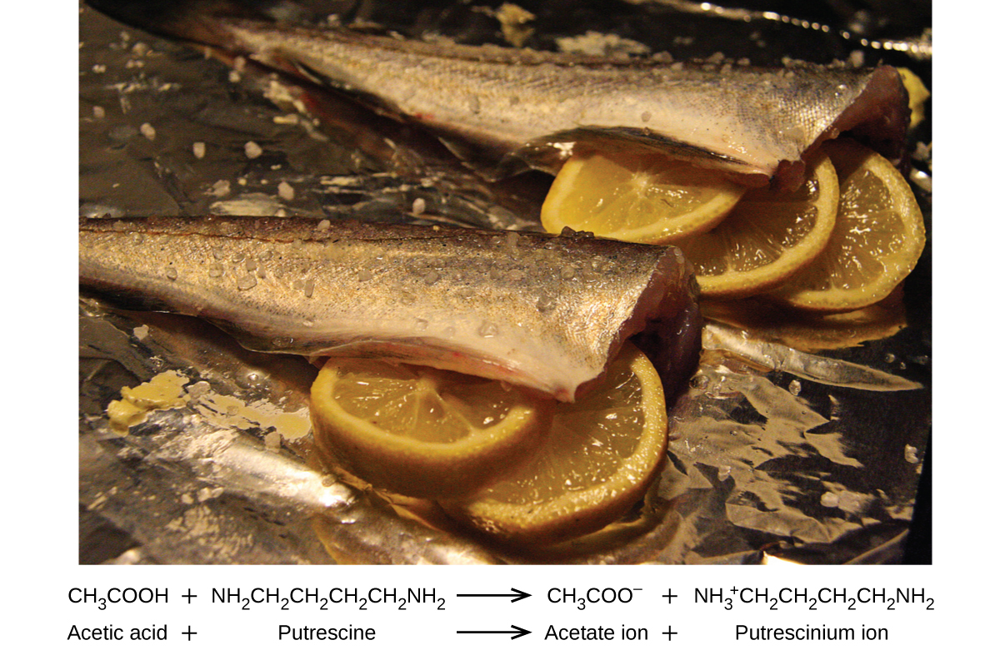

By the end of this section, you will be able to:
* Predict whether a salt solution will be acidic, basic, or neutral
* Calculate the concentrations of the various species in a salt solution
* Describe the process that causes solutions of certain metal ions to be acidic

As we have seen in the section on chemical reactions, when an acid and base are mixed, they undergo a neutralization reaction. The word “neutralization” seems to imply that a stoichiometrically equivalent solution of an acid and a base would be neutral. This is sometimes true, but the salts that are formed in these reactions may have acidic or basic properties of their own, as we shall now see.

### Acid-Base Neutralization

A solution is neutral when it contains equal concentrations of hydronium and hydroxide ions. When we mix solutions of an acid and a base, an acid-base neutralization reaction occurs. However, even if we mix stoichiometrically equivalent quantities, we may find that the resulting solution is not neutral. It could contain either an excess of hydronium ions or an excess of hydroxide ions because the nature of the salt formed determines whether the solution is acidic, neutral, or basic. The following four situations illustrate how solutions with various pH values can arise following a neutralization reaction using stoichiometrically equivalent quantities:

1.  A strong acid and a strong base, such as HCl(*aq*) and NaOH(*aq*) will react to form a neutral solution since the conjugate partners produced are of negligible strength (see [\[link\]](/m51118#CNX_Chem_14_03_Corresp)):
    * * *
    {: data-type="newline"}
    
    

    <math xmlns="http://www.w3.org/1998/Math/MathML"><mrow><mtext>HCl</mtext><mo stretchy="false">(</mo><mi>a</mi><mi>q</mi><mo stretchy="false">)</mo><mo>+</mo><mtext>NaOH</mtext><mo stretchy="false">(</mo><mi>a</mi><mi>q</mi><mo stretchy="false">)</mo><mspace width="0.2em" /><mo stretchy="false">⇌</mo><mspace width="0.2em" /><mtext>NaCl</mtext><mo stretchy="false">(</mo><mi>a</mi><mi>q</mi><mo stretchy="false">)</mo><mo>+</mo><msub><mtext>H</mtext><mn>2</mn></msub><mtext>O</mtext><mo stretchy="false">(</mo><mi>l</mi><mo stretchy="false">)</mo></mrow></math>
    

2.  A strong acid and a weak base yield a weakly acidic solution, not because of the strong acid involved, but because of the conjugate acid of the weak base.
3.  A weak acid and a strong base yield a weakly basic solution. A solution of a weak acid reacts with a solution of a strong base to form the conjugate base of the weak acid and the conjugate acid of the strong base. The conjugate acid of the strong base is a weaker acid than water and has no effect on the acidity of the resulting solution. However, the conjugate base of the weak acid is a weak base and ionizes slightly in water. This increases the amount of hydroxide ion in the solution produced in the reaction and renders it slightly basic.
4.  A weak acid plus a weak base can yield either an acidic, basic, or neutral solution. This is the most complex of the four types of reactions. When the conjugate acid and the conjugate base are of unequal strengths, the solution can be either acidic or basic, depending on the relative strengths of the two conjugates. Occasionally the weak acid and the weak base will have the *same* strength, so their respective conjugate base and acid will have the same strength, and the solution will be neutral. To predict whether a particular combination will be acidic, basic or neutral, tabulated *K* values of the conjugates must be compared.
{: data-number-style="arabic"}

Stomach Antacids

Our stomachs contain a solution of roughly 0.03 *M* HCl, which helps us digest the food we eat. The burning sensation associated with heartburn is a result of the acid of the stomach leaking through the muscular valve at the top of the stomach into the lower reaches of the esophagus. The lining of the esophagus is not protected from the corrosive effects of stomach acid the way the lining of the stomach is, and the results can be very painful. When we have heartburn, it feels better if we reduce the excess acid in the esophagus by taking an antacid. As you may have guessed, antacids are bases. One of the most common antacids is calcium carbonate, CaCO3. The reaction,

<math xmlns="http://www.w3.org/1998/Math/MathML"><mrow><msub><mrow><mtext>CaCO</mtext></mrow><mn>3</mn></msub><mo stretchy="false">(</mo><mi>s</mi><mo stretchy="false">)</mo><mo>+</mo><mn>2</mn><mtext>HCl</mtext><mo stretchy="false">(</mo><mi>a</mi><mi>q</mi><mo stretchy="false">)</mo><mspace width="0.2em" /><mo stretchy="false">⇌</mo><mspace width="0.2em" /><msub><mrow><mtext>CaCl</mtext></mrow><mn>2</mn></msub><mo stretchy="false">(</mo><mi>a</mi><mi>q</mi><mo stretchy="false">)</mo><mo>+</mo><msub><mtext>H</mtext><mn>2</mn></msub><mtext>O</mtext><mo stretchy="false">(</mo><mi>l</mi><mo stretchy="false">)</mo><mo>+</mo><msub><mrow><mtext>CO</mtext></mrow><mn>2</mn></msub><mo stretchy="false">(</mo><mi>g</mi><mo stretchy="false">)</mo></mrow></math>

not only neutralizes stomach acid, it also produces CO2(*g*), which may result in a satisfying belch.

Milk of Magnesia is a suspension of the sparingly soluble base magnesium hydroxide, Mg(OH)2. It works according to the reaction:

<math xmlns="http://www.w3.org/1998/Math/MathML"><mrow><mtext>Mg</mtext><msub><mrow><mo stretchy="false">(</mo><mtext>OH</mtext><mo stretchy="false">)</mo></mrow><mn>2</mn></msub><mo stretchy="false">(</mo><mi>s</mi><mo stretchy="false">)</mo><mspace width="0.2em" /><mo stretchy="false">⇌</mo><mspace width="0.2em" /><msup><mrow><mtext>Mg</mtext></mrow><mrow><mn>2+</mn></mrow></msup><mo stretchy="false">(</mo><mi>a</mi><mi>q</mi><mo stretchy="false">)</mo><mo>+</mo><mn>2</mn><msup><mrow><mtext>OH</mtext></mrow><mtext>−</mtext></msup><mo stretchy="false">(</mo><mi>a</mi><mi>q</mi><mo stretchy="false">)</mo></mrow></math>

The hydroxide ions generated in this equilibrium then go on to react with the hydronium ions from the stomach acid, so that :

<math xmlns="http://www.w3.org/1998/Math/MathML"><mrow><msub><mtext>H</mtext><mn>3</mn></msub><msup><mtext>O</mtext><mtext>+</mtext></msup><mo>+</mo><msup><mrow><mtext>OH</mtext></mrow><mtext>−</mtext></msup><mspace width="0.2em" /><mo stretchy="false">⇌</mo><mspace width="0.2em" /><mn>2</mn><msub><mtext>H</mtext><mn>2</mn></msub><mtext>O</mtext><mo stretchy="false">(</mo><mi>l</mi><mo stretchy="false">)</mo></mrow></math>

This reaction does not produce carbon dioxide, but magnesium-containing antacids can have a laxative effect.

Several antacids have aluminum hydroxide, Al(OH)3, as an active ingredient. The aluminum hydroxide tends to cause constipation, and some antacids use aluminum hydroxide in concert with magnesium hydroxide to balance the side effects of the two substances.

Culinary Aspects of Chemistry

Cooking is essentially synthetic chemistry that happens to be safe to eat. There are a number of examples of acid-base chemistry in the culinary world. One example is the use of baking soda, or sodium bicarbonate in baking. NaHCO3 is a base. When it reacts with an acid such as lemon juice, buttermilk, or sour cream in a batter, bubbles of carbon dioxide gas are formed from decomposition of the resulting carbonic acid, and the batter “rises.” Baking powder is a combination of sodium bicarbonate, and one or more acid salts that react when the two chemicals come in contact with water in the batter.

Many people like to put lemon juice or vinegar, both of which are acids, on cooked fish ([\[link\]](#CNX_Chem_14_03_FishLemon)). It turns out that fish have volatile amines (bases) in their systems, which are neutralized by the acids to yield involatile ammonium salts. This reduces the odor of the fish, and also adds a “sour” taste that we seem to enjoy.

{: #CNX_Chem_14_03_FishLemon}

Pickling is a method used to preserve vegetables using a naturally produced acidic environment. The vegetable, such as a cucumber, is placed in a sealed jar submerged in a brine solution. The brine solution favors the growth of beneficial bacteria and suppresses the growth of harmful bacteria. The beneficial bacteria feed on starches in the cucumber and produce lactic acid as a waste product in a process called fermentation. The lactic acid eventually increases the acidity of the brine to a level that kills any harmful bacteria, which require a basic environment. Without the harmful bacteria consuming the cucumbers they are able to last much longer than if they were unprotected. A byproduct of the pickling process changes the flavor of the vegetables with the acid making them taste sour.

### Salts of Weak Bases and Strong Acids

When we neutralize a weak base with a strong acid, the product is a salt containing the conjugate acid of the weak base. This conjugate acid is a weak acid. For example, ammonium chloride, NH4Cl, is a salt formed by the reaction of the weak base ammonia with the strong acid HCl:

<math xmlns="http://www.w3.org/1998/Math/MathML"><mrow><msub><mrow><mtext>NH</mtext></mrow><mn>3</mn></msub><mo stretchy="false">(</mo><mi>a</mi><mi>q</mi><mo stretchy="false">)</mo><mo>+</mo><mtext>HCl</mtext><mo stretchy="false">(</mo><mi>a</mi><mi>q</mi><mo stretchy="false">)</mo><mspace width="0.2em" /><mo stretchy="false">⟶</mo><mspace width="0.2em" /><msub><mrow><mtext>NH</mtext></mrow><mn>4</mn></msub><mtext>Cl</mtext><mo stretchy="false">(</mo><mi>a</mi><mi>q</mi><mo stretchy="false">)</mo></mrow></math>

A solution of this salt contains ammonium ions and chloride ions. The chloride ion has no effect on the acidity of the solution since HCl is a strong acid. Chloride is a very weak base and will not accept a proton to a measurable extent. However, the ammonium ion, the conjugate acid of ammonia, reacts with water and increases the hydronium ion concentration:

<math xmlns="http://www.w3.org/1998/Math/MathML"><mrow><msub><mrow><mtext>NH</mtext></mrow><mn>4</mn></msub><msup><mrow /><mtext>+</mtext></msup><mo stretchy="false">(</mo><mi>a</mi><mi>q</mi><mo stretchy="false">)</mo><mo>+</mo><msub><mtext>H</mtext><mn>2</mn></msub><mtext>O</mtext><mo stretchy="false">(</mo><mi>l</mi><mo stretchy="false">)</mo><mspace width="0.2em" /><mo stretchy="false">⇌</mo><mspace width="0.2em" /><msub><mtext>H</mtext><mn>3</mn></msub><msup><mtext>O</mtext><mtext>+</mtext></msup><mo stretchy="false">(</mo><mi>a</mi><mi>q</mi><mo stretchy="false">)</mo><mo>+</mo><msub><mrow><mtext>NH</mtext></mrow><mn>3</mn></msub><mo stretchy="false">(</mo><mi>a</mi><mi>q</mi><mo stretchy="false">)</mo></mrow></math>

The equilibrium equation for this reaction is simply the ionization constant. *K*a, for the acid <math xmlns="http://www.w3.org/1998/Math/MathML"><mrow><msub><mrow><mtext>NH</mtext></mrow><mn>4</mn></msub><msup><mrow /><mtext>+</mtext></msup><mo>:</mo></mrow></math>

<math xmlns="http://www.w3.org/1998/Math/MathML"><mrow><mfrac><mrow><mo stretchy="false">[</mo><msub><mtext>H</mtext><mn>3</mn></msub><msup><mtext>O</mtext><mtext>+</mtext></msup><mo stretchy="false">]</mo><mo stretchy="false">[</mo><msub><mrow><mtext>NH</mtext></mrow><mn>3</mn></msub><mo stretchy="false">]</mo></mrow><mrow><mo stretchy="false">[</mo><msub><mrow><mtext>NH</mtext></mrow><mn>4</mn></msub><msup><mrow /><mtext>+</mtext></msup><mo stretchy="false">]</mo></mrow></mfrac><mspace width="0.2em" /><mo>=</mo><msub><mi>K</mi><mtext>a</mtext></msub></mrow></math>

We will not find a value of *K*a for the ammonium ion in [Appendix H](/m51225){: .target-chapter}. However, it is not difficult to determine *K*a for <math xmlns="http://www.w3.org/1998/Math/MathML"><mrow><msub><mrow><mtext>NH</mtext></mrow><mn>4</mn></msub><msup><mrow /><mtext>+</mtext></msup></mrow></math>

 from the value of the ionization constant of water, *K*w, and *K*b, the ionization constant of its conjugate base, NH3, using the following relationship:

<math xmlns="http://www.w3.org/1998/Math/MathML"><mrow><msub><mi>K</mi><mtext>w</mtext></msub><mo>=</mo><msub><mi>K</mi><mtext>a</mtext></msub><mspace width="0.2em" /><mo>×</mo><mspace width="0.2em" /><msub><mi>K</mi><mtext>b</mtext></msub></mrow></math>

This relation holds for any base and its conjugate acid or for any acid and its conjugate base.

The pH of a Solution of a Salt of a Weak Base and a Strong Acid Aniline is an amine that is used to manufacture dyes. It is isolated as aniline hydrochloride, <math xmlns="http://www.w3.org/1998/Math/MathML"><mrow><mo stretchy="false">[</mo><msub><mtext>C</mtext><mn>6</mn></msub><msub><mtext>H</mtext><mn>5</mn></msub><msub><mrow><mtext>NH</mtext></mrow><mn>3</mn></msub><msup><mrow /><mtext>+</mtext></msup><mo stretchy="false">]</mo><mtext>Cl</mtext><mo>,</mo></mrow></math>

 a salt prepared by the reaction of the weak base aniline and hydrochloric acid. What is the pH of a 0.233 *M* solution of aniline hydrochloride?

<math xmlns="http://www.w3.org/1998/Math/MathML"><mrow><msub><mtext>C</mtext><mn>6</mn></msub><msub><mtext>H</mtext><mn>5</mn></msub><msub><mrow><mtext>NH</mtext></mrow><mn>3</mn></msub><msup><mrow /><mtext>+</mtext></msup><mo stretchy="false">(</mo><mi>a</mi><mi>q</mi><mo stretchy="false">)</mo><mo>+</mo><msub><mtext>H</mtext><mn>2</mn></msub><mtext>O</mtext><mo stretchy="false">(</mo><mi>l</mi><mo stretchy="false">)</mo><mspace width="0.2em" /><mo stretchy="false">⇌</mo><mspace width="0.2em" /><msub><mtext>H</mtext><mn>3</mn></msub><msup><mtext>O</mtext><mtext>+</mtext></msup><mo stretchy="false">(</mo><mi>a</mi><mi>q</mi><mo stretchy="false">)</mo><mo>+</mo><msub><mtext>C</mtext><mn>6</mn></msub><msub><mtext>H</mtext><mn>5</mn></msub><msub><mrow><mtext>NH</mtext></mrow><mn>2</mn></msub><mo stretchy="false">(</mo><mi>a</mi><mi>q</mi><mo stretchy="false">)</mo></mrow></math>

SolutionThe new step in this example is to determine *K*a for the <math xmlns="http://www.w3.org/1998/Math/MathML"><mrow><msub><mtext>C</mtext><mn>6</mn></msub><msub><mtext>H</mtext><mn>5</mn></msub><msub><mrow><mtext>NH</mtext></mrow><mn>3</mn></msub><msup><mrow /><mtext>+</mtext></msup></mrow></math>

 ion. The <math xmlns="http://www.w3.org/1998/Math/MathML"><mrow><msub><mtext>C</mtext><mn>6</mn></msub><msub><mtext>H</mtext><mn>5</mn></msub><msub><mrow><mtext>NH</mtext></mrow><mn>3</mn></msub><msup><mrow /><mtext>+</mtext></msup></mrow></math>

 ion is the conjugate acid of a weak base. The value of *K*a for this acid is not listed in [Appendix H](/m51225){: .target-chapter}, but we can determine it from the value of *K*b for aniline, C6H5NH2, which is given as 4.3 <math xmlns="http://www.w3.org/1998/Math/MathML"><mo>×</mo></math>

 10−10 ([\[link\]](/m51118#fs-idm84795184) and [Appendix I](/m51226){: .target-chapter}):

<math xmlns="http://www.w3.org/1998/Math/MathML"><mrow><msub><mi>K</mi><mtext>a</mtext></msub><mspace width="0.2em" /><mo stretchy="false">(</mo><mtext>for</mtext><mspace width="0.2em" /><msub><mtext>C</mtext><mn>6</mn></msub><msub><mtext>H</mtext><mn>5</mn></msub><msub><mrow><mtext>NH</mtext></mrow><mn>3</mn></msub><msup><mrow /><mtext>+</mtext></msup><mo stretchy="false">)</mo><mspace width="0.2em" /><mo>×</mo><mspace width="0.2em" /><msub><mi>K</mi><mtext>b</mtext></msub><mspace width="0.2em" /><mo stretchy="false">(</mo><mtext>for</mtext><mspace width="0.2em" /><msub><mtext>C</mtext><mn>6</mn></msub><msub><mtext>H</mtext><mn>5</mn></msub><msub><mrow><mtext>NH</mtext></mrow><mn>2</mn></msub><mo stretchy="false">)</mo><mo>=</mo><msub><mi>K</mi><mtext>w</mtext></msub><mo>=</mo><mn>1.0</mn><mspace width="0.2em" /><mo>×</mo><mspace width="0.2em" /><msup><mrow><mn>10</mn></mrow><mrow><mn>−14</mn></mrow></msup></mrow></math>

<math xmlns="http://www.w3.org/1998/Math/MathML"><mrow><msub><mi>K</mi><mtext>a</mtext></msub><mspace width="0.2em" /><mo stretchy="false">(</mo><mtext>for</mtext><mspace width="0.2em" /><msub><mtext>C</mtext><mn>6</mn></msub><msub><mtext>H</mtext><mn>5</mn></msub><msub><mrow><mtext>NH</mtext></mrow><mn>3</mn></msub><msup><mrow /><mtext>+</mtext></msup><mo stretchy="false">)</mo><mspace width="0.2em" /><mo>=</mo><mspace width="0.2em" /><mfrac><mrow><msub><mi>K</mi><mtext>w</mtext></msub></mrow><mrow><msub><mi>K</mi><mtext>b</mtext></msub><mspace width="0.2em" /><mo stretchy="false">(</mo><mtext>for</mtext><mspace width="0.2em" /><msub><mtext>C</mtext><mn>6</mn></msub><msub><mtext>H</mtext><mn>5</mn></msub><msub><mrow><mtext>NH</mtext></mrow><mn>2</mn></msub><mo stretchy="false">)</mo></mrow></mfrac><mspace width="0.2em" /><mo>=</mo><mspace width="0.2em" /><mfrac><mrow><mn>1.0</mn><mspace width="0.2em" /><mo>×</mo><mspace width="0.2em" /><msup><mrow><mn>10</mn></mrow><mrow><mn>−14</mn></mrow></msup></mrow><mrow><mn>4.3</mn><mspace width="0.2em" /><mo>×</mo><mspace width="0.2em" /><msup><mrow><mn>10</mn></mrow><mrow><mn>−10</mn></mrow></msup></mrow></mfrac><mspace width="0.2em" /><mo>=</mo><mn>2.3</mn><mspace width="0.2em" /><mo>×</mo><mspace width="0.2em" /><msup><mrow><mn>10</mn></mrow><mrow><mn>−5</mn></mrow></msup></mrow></math>

Now we have the ionization constant and the initial concentration of the weak acid, the information necessary to determine the equilibrium concentration of H3O+, and the pH:

With these steps we find \[H3O+\] = 2.3 <math xmlns="http://www.w3.org/1998/Math/MathML"><mo>×</mo></math>

 10−3 *M* and pH = 2.64

Check Your Learning(a) Do the calculations and show that the hydronium ion concentration for a 0.233-*M* solution of <math xmlns="http://www.w3.org/1998/Math/MathML"><mrow><msub><mtext>C</mtext><mn>6</mn></msub><msub><mtext>H</mtext><mn>5</mn></msub><msub><mrow><mtext>NH</mtext></mrow><mn>3</mn></msub><msup><mrow /><mtext>+</mtext></msup></mrow></math>

 is 2.3 <math xmlns="http://www.w3.org/1998/Math/MathML"><mo>×</mo></math>

 10−3 and the pH is 2.64.

(b) What is the hydronium ion concentration in a 0.100-*M* solution of ammonium nitrate, NH4NO3, a salt composed of the ions <math xmlns="http://www.w3.org/1998/Math/MathML"><mrow><msub><mrow><mtext>NH</mtext></mrow><mn>4</mn></msub><msup><mrow /><mtext>+</mtext></msup></mrow></math>

 and <math xmlns="http://www.w3.org/1998/Math/MathML"><mrow><msub><mrow><mtext>NO</mtext></mrow><mn>3</mn></msub><msup><mrow /><mtext>−</mtext></msup><mo>.</mo></mrow></math>

 Use the data in [\[link\]](/m51118#fs-idm84795184) to determine *K*b for the ammonium ion. Which is the stronger acid <math xmlns="http://www.w3.org/1998/Math/MathML"><mrow><msub><mtext>C</mtext><mn>6</mn></msub><msub><mtext>H</mtext><mn>5</mn></msub><msub><mrow><mtext>NH</mtext></mrow><mn>3</mn></msub><msup><mrow /><mtext>+</mtext></msup></mrow></math>

 or <math xmlns="http://www.w3.org/1998/Math/MathML"><mrow><msub><mrow><mtext>NH</mtext></mrow><mn>4</mn></msub><msup><mrow /><mtext>+</mtext></msup><mo>?</mo></mrow></math>

Answer:

(a) <math xmlns="http://www.w3.org/1998/Math/MathML"><mrow><msub><mi>K</mi><mi>a</mi></msub><mspace width="0.2em" /><mo stretchy="false">(</mo><mtext>for</mtext><mspace width="0.2em" /><msub><mrow><mtext>NH</mtext></mrow><mn>4</mn></msub><msup><mrow /><mtext>+</mtext></msup><mo stretchy="false">)</mo><mo>=</mo><mn>5.6</mn><mspace width="0.2em" /><mo>×</mo><mspace width="0.2em" /><msup><mrow><mn>10</mn></mrow><mrow><mn>−10</mn></mrow></msup><mo>,</mo></mrow></math>

 \[H3O+\] = 7.5 <math xmlns="http://www.w3.org/1998/Math/MathML"><mo>×</mo></math>

 10−6 *M*; (b) <math xmlns="http://www.w3.org/1998/Math/MathML"><mrow><msub><mtext>C</mtext><mn>6</mn></msub><msub><mtext>H</mtext><mn>5</mn></msub><msub><mrow><mtext>NH</mtext></mrow><mn>3</mn></msub><msup><mrow /><mtext>+</mtext></msup></mrow></math>

 is the stronger acid.

### Salts of Weak Acids and Strong Bases

When we neutralize a weak acid with a strong base, we get a salt that contains the conjugate base of the weak acid. This conjugate base is usually a weak base. For example, sodium acetate, NaCH3CO2, is a salt formed by the reaction of the weak acid acetic acid with the strong base sodium hydroxide:

<math xmlns="http://www.w3.org/1998/Math/MathML"><mrow><msub><mrow><mtext>CH</mtext></mrow><mn>3</mn></msub><msub><mrow><mtext>CO</mtext></mrow><mn>2</mn></msub><mtext>H</mtext><mo stretchy="false">(</mo><mi>a</mi><mi>q</mi><mo stretchy="false">)</mo><mo>+</mo><mtext>NaOH</mtext><mo stretchy="false">(</mo><mi>a</mi><mi>q</mi><mo stretchy="false">)</mo><mspace width="0.2em" /><mo stretchy="false">⟶</mo><mspace width="0.2em" /><msub><mrow><mtext>NaCH</mtext></mrow><mn>3</mn></msub><msub><mrow><mtext>CO</mtext></mrow><mn>2</mn></msub><mo stretchy="false">(</mo><mi>a</mi><mi>q</mi><mo stretchy="false">)</mo><mo>+</mo><msub><mtext>H</mtext><mn>2</mn></msub><mtext>O</mtext><mo stretchy="false">(</mo><mi>a</mi><mi>q</mi><mo stretchy="false">)</mo></mrow></math>

A solution of this salt contains sodium ions and acetate ions. The sodium ion has no effect on the acidity of the solution. However, the acetate ion, the conjugate base of acetic acid, reacts with water and increases the concentration of hydroxide ion:

<math xmlns="http://www.w3.org/1998/Math/MathML"><mrow><msub><mrow><mtext>CH</mtext></mrow><mn>3</mn></msub><msub><mrow><mtext>CO</mtext></mrow><mn>2</mn></msub><msup><mrow /><mtext>−</mtext></msup><mo stretchy="false">(</mo><mi>a</mi><mi>q</mi><mo stretchy="false">)</mo><mo>+</mo><msub><mtext>H</mtext><mn>2</mn></msub><mtext>O</mtext><mo stretchy="false">(</mo><mi>l</mi><mo stretchy="false">)</mo><mspace width="0.2em" /><mo stretchy="false">⇌</mo><mspace width="0.2em" /><msub><mrow><mtext>CH</mtext></mrow><mn>3</mn></msub><msub><mrow><mtext>CO</mtext></mrow><mn>2</mn></msub><mtext>H</mtext><mo stretchy="false">(</mo><mi>a</mi><mi>q</mi><mo stretchy="false">)</mo><mo>+</mo><msup><mrow><mtext>OH</mtext></mrow><mtext>−</mtext></msup><mo stretchy="false">(</mo><mi>a</mi><mi>q</mi><mo stretchy="false">)</mo></mrow></math>

The equilibrium equation for this reaction is the ionization constant, *K*b, for the base <math xmlns="http://www.w3.org/1998/Math/MathML"><mrow><msub><mrow><mtext>CH</mtext></mrow><mn>3</mn></msub><msub><mrow><mtext>CO</mtext></mrow><mn>2</mn></msub><msup><mrow /><mtext>−</mtext></msup><mo>.</mo></mrow></math>

 The value of *K*b can be calculated from the value of the ionization constant of water, *K*w, and *K*a, the ionization constant of the conjugate acid of the anion using the equation:

<math xmlns="http://www.w3.org/1998/Math/MathML"><mrow><msub><mi>K</mi><mtext>w</mtext></msub><mo>=</mo><msub><mi>K</mi><mtext>a</mtext></msub><mspace width="0.2em" /><mo>×</mo><mspace width="0.2em" /><msub><mi>K</mi><mtext>b</mtext></msub></mrow></math>

For the acetate ion and its conjugate acid we have:

<math xmlns="http://www.w3.org/1998/Math/MathML"><mrow><msub><mi>K</mi><mtext>b</mtext></msub><mspace width="0.2em" /><mo stretchy="false">(</mo><mtext>for</mtext><mspace width="0.2em" /><msub><mrow><mtext>CH</mtext></mrow><mn>3</mn></msub><msub><mrow><mtext>CO</mtext></mrow><mn>2</mn></msub><msup><mrow /><mtext>−</mtext></msup><mo stretchy="false">)</mo><mo>=</mo><mspace width="0.2em" /><mfrac><mrow><msub><mi>K</mi><mtext>w</mtext></msub></mrow><mrow><msub><mi>K</mi><mtext>a</mtext></msub><mspace width="0.2em" /><mo stretchy="false">(</mo><mtext>for</mtext><mspace width="0.2em" /><msub><mrow><mtext>CH</mtext></mrow><mn>3</mn></msub><msub><mrow><mtext>CO</mtext></mrow><mn>2</mn></msub><mtext>H</mtext><mo stretchy="false">)</mo></mrow></mfrac><mspace width="0.2em" /><mo>=</mo><mspace width="0.2em" /><mfrac><mrow><mn>1.0</mn><mspace width="0.2em" /><mo>×</mo><mspace width="0.2em" /><msup><mrow><mn>10</mn></mrow><mrow><mn>−14</mn></mrow></msup></mrow><mrow><mn>1.8</mn><mspace width="0.2em" /><mo>×</mo><mspace width="0.2em" /><msup><mrow><mn>10</mn></mrow><mrow><mn>−5</mn></mrow></msup></mrow></mfrac><mspace width="0.2em" /><mo>=</mo><mspace width="0.2em" /><mn>5.6</mn><mspace width="0.2em" /><mo>×</mo><mspace width="0.2em" /><msup><mrow><mn>10</mn></mrow><mrow><mn>−10</mn></mrow></msup></mrow></math>

Some handbooks do not report values of *K*b. They only report ionization constants for acids. If we want to determine a *K*b value using one of these handbooks, we must look up the value of *K*a for the conjugate acid and convert it to a *K*b value.

Equilibrium in a Solution of a Salt of a Weak Acid and a Strong Base Determine the acetic acid concentration in a solution with <math xmlns="http://www.w3.org/1998/Math/MathML"><mrow><mo stretchy="false">[</mo><msub><mrow><mtext>CH</mtext></mrow><mn>3</mn></msub><msub><mrow><mtext>CO</mtext></mrow><mn>2</mn></msub><msup><mrow /><mtext>−</mtext></msup><mo stretchy="false">]</mo><mo>=</mo><mn>0.050</mn><mspace width="0.2em" /><mi>M</mi></mrow></math>

 and \[OH−\] = 2.5 <math xmlns="http://www.w3.org/1998/Math/MathML"><mo>×</mo></math>

 10−6 *M* at equilibrium. The reaction is:

<math xmlns="http://www.w3.org/1998/Math/MathML"><mrow><msub><mrow><mtext>CH</mtext></mrow><mn>3</mn></msub><msub><mrow><mtext>CO</mtext></mrow><mn>2</mn></msub><msup><mrow /><mtext>−</mtext></msup><mo stretchy="false">(</mo><mi>a</mi><mi>q</mi><mo stretchy="false">)</mo><mo>+</mo><msub><mtext>H</mtext><mn>2</mn></msub><mtext>O</mtext><mo stretchy="false">(</mo><mi>l</mi><mo stretchy="false">)</mo><mspace width="0.2em" /><mo stretchy="false">⇌</mo><mspace width="0.2em" /><msub><mrow><mtext>CH</mtext></mrow><mn>3</mn></msub><msub><mrow><mtext>CO</mtext></mrow><mn>2</mn></msub><mtext>H</mtext><mo stretchy="false">(</mo><mi>a</mi><mi>q</mi><mo stretchy="false">)</mo><mo>+</mo><msup><mrow><mtext>OH</mtext></mrow><mtext>−</mtext></msup><mo stretchy="false">(</mo><mi>a</mi><mi>q</mi><mo stretchy="false">)</mo></mrow></math>

SolutionWe are given two of three equilibrium concentrations and asked to find the missing concentration. If we can find the equilibrium constant for the reaction, the process is straightforward.

The acetate ion behaves as a base in this reaction; hydroxide ions are a product. We determine *K*b as follows:

<math xmlns="http://www.w3.org/1998/Math/MathML"><mrow><msub><mi>K</mi><mtext>b</mtext></msub><mspace width="0.2em" /><mo stretchy="false">(</mo><mtext>for</mtext><mspace width="0.2em" /><msub><mrow><mtext>CH</mtext></mrow><mn>3</mn></msub><msub><mrow><mtext>CO</mtext></mrow><mn>2</mn></msub><msup><mrow /><mtext>−</mtext></msup><mo stretchy="false">)</mo><mspace width="0.2em" /><mo>=</mo><mspace width="0.2em" /><mfrac><mrow><msub><mi>K</mi><mtext>w</mtext></msub></mrow><mrow><msub><mi>K</mi><mtext>a</mtext></msub><mspace width="0.2em" /><mo stretchy="false">(</mo><mtext>for</mtext><mspace width="0.2em" /><msub><mrow><mtext>CH</mtext></mrow><mn>3</mn></msub><msub><mrow><mtext>CO</mtext></mrow><mn>2</mn></msub><mtext>H</mtext><mo stretchy="false">)</mo></mrow></mfrac><mspace width="0.2em" /><mo>=</mo><mspace width="0.2em" /><mfrac><mrow><mn>1.0</mn><mspace width="0.2em" /><mo>×</mo><mspace width="0.2em" /><msup><mrow><mn>10</mn></mrow><mrow><mn>−14</mn></mrow></msup></mrow><mrow><mn>1.8</mn><mspace width="0.2em" /><mo>×</mo><mspace width="0.2em" /><msup><mrow><mn>10</mn></mrow><mrow><mn>−5</mn></mrow></msup></mrow></mfrac><mspace width="0.2em" /><mo>=</mo><mn>5.6</mn><mspace width="0.2em" /><mo>×</mo><mspace width="0.2em" /><msup><mrow><mn>10</mn></mrow><mrow><mn>−10</mn></mrow></msup></mrow></math>

Now find the missing concentration:

<math xmlns="http://www.w3.org/1998/Math/MathML"><mrow><msub><mi>K</mi><mtext>b</mtext></msub><mo>=</mo><mspace width="0.2em" /><mfrac><mrow><mo stretchy="false">[</mo><msub><mrow><mtext>CH</mtext></mrow><mn>3</mn></msub><msub><mrow><mtext>CO</mtext></mrow><mn>2</mn></msub><mtext>H</mtext><mo stretchy="false">]</mo><mo stretchy="false">[</mo><msup><mrow><mtext>OH</mtext></mrow><mtext>−</mtext></msup><mo stretchy="false">]</mo></mrow><mrow><mo stretchy="false">[</mo><msub><mrow><mtext>CH</mtext></mrow><mn>3</mn></msub><msub><mrow><mtext>CO</mtext></mrow><mn>2</mn></msub><msup><mrow /><mtext>−</mtext></msup><mo stretchy="false">]</mo></mrow></mfrac><mspace width="0.2em" /><mo>=</mo><mn>5.6</mn><mspace width="0.2em" /><mo>×</mo><mspace width="0.2em" /><msup><mrow><mn>10</mn></mrow><mrow><mn>−10</mn></mrow></msup></mrow></math>

<math xmlns="http://www.w3.org/1998/Math/MathML"><mrow><mo>=</mo><mspace width="0.2em" /><mfrac><mrow><mo stretchy="false">[</mo><msub><mrow><mtext>CH</mtext></mrow><mn>3</mn></msub><msub><mrow><mtext>CO</mtext></mrow><mn>2</mn></msub><mtext>H</mtext><mo stretchy="false">]</mo><mo stretchy="false">(</mo><mn>2.5</mn><mspace width="0.2em" /><mo>×</mo><mspace width="0.2em" /><msup><mrow><mn>10</mn></mrow><mrow><mn>−6</mn></mrow></msup><mo stretchy="false">)</mo></mrow><mrow><mo stretchy="false">(</mo><mn>0.050</mn><mo stretchy="false">)</mo></mrow></mfrac><mspace width="0.2em" /><mo>=</mo><mn>5.6</mn><mspace width="0.2em" /><mo>×</mo><mspace width="0.2em" /><msup><mrow><mn>10</mn></mrow><mrow><mn>−10</mn></mrow></msup></mrow></math>

Solving this equation we get \[CH3CO2H\] = 1.1 <math xmlns="http://www.w3.org/1998/Math/MathML"><mo>×</mo></math>

 10−5 *M*.

Check Your LearningWhat is the pH of a 0.083-*M* solution of CN−? Use 4.9 <math xmlns="http://www.w3.org/1998/Math/MathML"><mo>×</mo></math>

 10−10 as *K*a for HCN. Hint: We will probably need to convert pOH to pH or find \[H3O+\] using \[OH−\] in the final stages of this problem.

Answer:

11\.11

### Equilibrium in a Solution of a Salt of a Weak Acid and a Weak Base

In a solution of a salt formed by the reaction of a weak acid and a weak base, to predict the pH, we must know both the *K*a of the weak acid and the *K*b of the weak base. If *K*a &gt; *K*b, the solution is acidic, and if *K*b &gt; *K*a, the solution is basic.

Determining the Acidic or Basic Nature of Salts Determine whether aqueous solutions of the following salts are acidic, basic, or neutral:

(a) KBr

(b) NaHCO3

(c) NH4Cl

(d) Na2HPO4

(e) NH4F

SolutionConsider each of the ions separately in terms of its effect on the pH of the solution, as shown here:

(a) The K+ cation and the Br− anion are both spectators, since they are the cation of a strong base (KOH) and the anion of a strong acid (HBr), respectively. The solution is neutral.

(b) The Na+ cation is a spectator, and will not affect the pH of the solution; while the <math xmlns="http://www.w3.org/1998/Math/MathML"><mrow><msub><mrow><mtext>HCO</mtext></mrow><mn>3</mn></msub><msup><mrow /><mtext>−</mtext></msup></mrow></math>

 anion is amphiprotic. The *K*a of <math xmlns="http://www.w3.org/1998/Math/MathML"><mrow><msub><mrow><mtext>HCO</mtext></mrow><mn>3</mn></msub><msup><mrow /><mtext>−</mtext></msup></mrow></math>

 is 4.7 <math xmlns="http://www.w3.org/1998/Math/MathML"><mo>×</mo></math>

 10−11,and its *K*b is <math xmlns="http://www.w3.org/1998/Math/MathML"><mrow><mfrac><mrow><mn>1.0</mn><mspace width="0.2em" /><mo>×</mo><mspace width="0.2em" /><msup><mrow><mn>10</mn></mrow><mrow><mn>−14</mn></mrow></msup></mrow><mrow><mn>4.3</mn><mspace width="0.2em" /><mo>×</mo><mspace width="0.2em" /><msup><mrow><mn>10</mn></mrow><mrow><mn>−7</mn></mrow></msup></mrow></mfrac><mspace width="0.2em" /><mo>=</mo><mspace width="0.2em" /><mn>2.3</mn><mspace width="0.2em" /><mo>×</mo><mspace width="0.2em" /><msup><mrow><mn>10</mn></mrow><mrow><mn>−8</mn></mrow></msup><mo>.</mo></mrow></math>

Since *K*b &gt;&gt; *K*a, the solution is basic.

(c) The <math xmlns="http://www.w3.org/1998/Math/MathML"><mrow><msub><mrow><mtext>NH</mtext></mrow><mn>4</mn></msub><msup><mrow /><mtext>+</mtext></msup></mrow></math>

 ion is acidic and the Cl− ion is a spectator. The solution will be acidic.

(d) The Na+ cation is a spectator, and will not affect the pH of the solution, while the <math xmlns="http://www.w3.org/1998/Math/MathML"><mrow><msub><mrow><mtext>HPO</mtext></mrow><mn>4</mn></msub><msup><mrow /><mtext>2−</mtext></msup></mrow></math>

 anion is amphiprotic. The *K*a of <math xmlns="http://www.w3.org/1998/Math/MathML"><mrow><msub><mrow><mtext>HPO</mtext></mrow><mn>4</mn></msub><msup><mrow /><mtext>2−</mtext></msup></mrow></math>

 is 4.2 <math xmlns="http://www.w3.org/1998/Math/MathML"><mo>×</mo></math>

 10−13,

and its *K*b is <math xmlns="http://www.w3.org/1998/Math/MathML"><mrow><mfrac><mrow><mn>1.0</mn><mspace width="0.2em" /><mo>×</mo><mspace width="0.2em" /><msup><mrow><mn>10</mn></mrow><mrow><mn>−14</mn></mrow></msup></mrow><mrow><mn>6.2</mn><mspace width="0.2em" /><mo>×</mo><mspace width="0.2em" /><msup><mrow><mn>10</mn></mrow><mrow><mn>−8</mn></mrow></msup></mrow></mfrac><mspace width="0.2em" /><mo>=</mo><mspace width="0.2em" /><mn>1.6</mn><mspace width="0.2em" /><mo>×</mo><mspace width="0.2em" /><msup><mrow><mn>10</mn></mrow><mrow><mn>−7</mn></mrow></msup><mo>.</mo></mrow></math>

 Because *K*b &gt;&gt; *K*a, the solution is basic.

(e) The <math xmlns="http://www.w3.org/1998/Math/MathML"><mrow><msub><mrow><mtext>NH</mtext></mrow><mn>4</mn></msub><msup><mrow /><mtext>+</mtext></msup></mrow></math>

 ion is listed as being acidic, and the F− ion is listed as a base, so we must directly compare the *K*a and the *K*b of the two ions. *K*a of <math xmlns="http://www.w3.org/1998/Math/MathML"><mrow><msub><mrow><mtext>NH</mtext></mrow><mn>4</mn></msub><msup><mrow /><mtext>+</mtext></msup></mrow></math>

 is 5.6 <math xmlns="http://www.w3.org/1998/Math/MathML"><mo>×</mo></math>

 10−10, which seems very small, yet the *K*b of F− is 1.4 <math xmlns="http://www.w3.org/1998/Math/MathML"><mo>×</mo></math>

 10−11, so the solution is acidic, since *K*a &gt; *K*b.

Check Your LearningDetermine whether aqueous solutions of the following salts are acidic, basic, or neutral:

(a) K2CO3

(b) CaCl2

(c) KH2PO4

(d) (NH4)2CO3

(e) AlBr3

Answer:

(a) basic; (b) neutral; (c) acidic; (d) basic; (e) acidic

### The Ionization of Hydrated Metal Ions

If we measure the pH of the solutions of a variety of metal ions we will find that these ions act as weak acids when in solution. The aluminum ion is an example. When aluminum nitrate dissolves in water, the aluminum ion reacts with water to give a hydrated aluminum ion, <math xmlns="http://www.w3.org/1998/Math/MathML"><mrow><mtext>Al</mtext><msub><mrow><mo stretchy="false">(</mo><msub><mtext>H</mtext><mn>2</mn></msub><mtext>O</mtext><mo stretchy="false">)</mo></mrow><mn>6</mn></msub><msup><mrow /><mrow><mn>3+</mn></mrow></msup><mo>,</mo></mrow></math>

 dissolved in bulk water. What this means is that the aluminum ion has the strongest interactions with the six closest water molecules (the so-called first solvation shell), even though it does interact with the other water molecules surrounding this <math xmlns="http://www.w3.org/1998/Math/MathML"><mrow><mtext>Al</mtext><msub><mrow><mo stretchy="false">(</mo><msub><mtext>H</mtext><mn>2</mn></msub><mtext>O</mtext><mo stretchy="false">)</mo></mrow><mn>6</mn></msub><msup><mrow /><mrow><mn>3+</mn></mrow></msup></mrow></math>

 cluster as well:

<math xmlns="http://www.w3.org/1998/Math/MathML"><mrow><mtext>Al</mtext><msub><mrow><mo stretchy="false">(</mo><msub><mrow><mtext>NO</mtext></mrow><mn>3</mn></msub><mo stretchy="false">)</mo></mrow><mn>3</mn></msub><mo stretchy="false">(</mo><mi>s</mi><mo stretchy="false">)</mo><mo>+</mo><mn>6</mn><msub><mtext>H</mtext><mn>2</mn></msub><mtext>O</mtext><mo stretchy="false">(</mo><mi>l</mi><mo stretchy="false">)</mo><mspace width="0.2em" /><mo stretchy="false">⟶</mo><mspace width="0.2em" /><mtext>Al</mtext><msub><mrow><mo stretchy="false">(</mo><msub><mtext>H</mtext><mn>2</mn></msub><mtext>O</mtext><mo stretchy="false">)</mo></mrow><mn>6</mn></msub><msup><mrow /><mrow><mn>3+</mn></mrow></msup><mo stretchy="false">(</mo><mi>a</mi><mi>q</mi><mo stretchy="false">)</mo><mo>+</mo><mn>3</mn><msub><mrow><mtext>NO</mtext></mrow><mn>3</mn></msub><msup><mrow /><mtext>−</mtext></msup><mo stretchy="false">(</mo><mi>a</mi><mi>q</mi><mo stretchy="false">)</mo></mrow></math>

We frequently see the formula of this ion simply as “Al3+(*aq*)”, without explicitly noting the six water molecules that are the closest ones to the aluminum ion and just describing the ion as being solvated in water (hydrated). This is similar to the simplification of the formula of the hydronium ion, H3O+ to H+. However, in this case, the hydrated aluminum ion is a weak acid ([\[link\]](#CNX_Chem_14_04_hydronium)) and donates a proton to a water molecule. Thus, the hydration becomes important and we may use formulas that show the extent of hydration:

<math xmlns="http://www.w3.org/1998/Math/MathML"><mrow><mtext>Al</mtext><msub><mrow><mo stretchy="false">(</mo><msub><mtext>H</mtext><mn>2</mn></msub><mtext>O</mtext><mo stretchy="false">)</mo></mrow><mn>6</mn></msub><msup><mrow /><mrow><mn>3+</mn></mrow></msup><mo stretchy="false">(</mo><mi>a</mi><mi>q</mi><mo stretchy="false">)</mo><mo>+</mo><msub><mtext>H</mtext><mn>2</mn></msub><mtext>O</mtext><mo stretchy="false">(</mo><mi>l</mi><mo stretchy="false">)</mo><mspace width="0.2em" /><mo stretchy="false">⇌</mo><mspace width="0.2em" /><msub><mtext>H</mtext><mn>3</mn></msub><msup><mtext>O</mtext><mtext>+</mtext></msup><mo stretchy="false">(</mo><mi>a</mi><mi>q</mi><mo stretchy="false">)</mo><mo>+</mo><mtext>Al</mtext><msub><mrow><mo stretchy="false">(</mo><msub><mtext>H</mtext><mn>2</mn></msub><mtext>O</mtext><mo stretchy="false">)</mo></mrow><mn>5</mn></msub><mo stretchy="false">(</mo><mtext>O</mtext><msup><mrow><mtext>H</mtext><mo stretchy="false">)</mo></mrow><mrow><mn>2+</mn></mrow></msup><mo stretchy="false">(</mo><mi>a</mi><mi>q</mi><mo stretchy="false">)</mo><mspace width="4em" /><msub><mi>K</mi><mtext>a</mtext></msub><mo>=</mo><mn>1.4</mn><mspace width="0.2em" /><mo>×</mo><mspace width="0.2em" /><msup><mrow><mn>10</mn></mrow><mrow><mn>−5</mn></mrow></msup></mrow></math>

As with other polyprotic acids, the hydrated aluminum ion ionizes in stages, as shown by:

<math xmlns="http://www.w3.org/1998/Math/MathML"><mrow><mtext>Al</mtext><msub><mrow><mrow><mo stretchy="false">(</mo><mrow><msub><mtext>H</mtext><mn>2</mn></msub><mtext>O</mtext></mrow><mo stretchy="false">)</mo></mrow></mrow><mn>6</mn></msub><msup><mrow /><mrow><mn>3+</mn></mrow></msup><mo stretchy="false">(</mo><mi>a</mi><mi>q</mi><mo stretchy="false">)</mo><mo>+</mo><msub><mtext>H</mtext><mn>2</mn></msub><mtext>O</mtext><mo stretchy="false">(</mo><mi>l</mi><mo stretchy="false">)</mo><mspace width="0.2em" /><mo stretchy="false">⇌</mo><mspace width="0.2em" /><msub><mtext>H</mtext><mn>3</mn></msub><msup><mtext>O</mtext><mtext>+</mtext></msup><mo stretchy="false">(</mo><mi>a</mi><mi>q</mi><mo stretchy="false">)</mo><mo>+</mo><mtext>Al</mtext><msub><mrow><mrow><mo stretchy="false">(</mo><mrow><msub><mtext>H</mtext><mn>2</mn></msub><mtext>O</mtext></mrow><mo stretchy="false">)</mo></mrow></mrow><mn>5</mn></msub><mo stretchy="false">(</mo><msup><mrow><mtext>O</mtext><mtext>H</mtext><mo stretchy="false">)</mo></mrow><mn>2+</mn></msup><mo stretchy="false">(</mo><mi>a</mi><mi>q</mi><mo stretchy="false">)</mo></mrow></math>

<math xmlns="http://www.w3.org/1998/Math/MathML"><mrow><mtext>Al</mtext><msub><mrow><mrow><mo stretchy="false">(</mo><mrow><msub><mtext>H</mtext><mn>2</mn></msub><mtext>O</mtext></mrow><mo stretchy="false">)</mo></mrow></mrow><mn>5</mn></msub><mo stretchy="false">(</mo><msup><mrow><mtext>OH</mtext><mo stretchy="false">)</mo></mrow><mn>2+</mn></msup><mo stretchy="false">(</mo><mi>a</mi><mi>q</mi><mo stretchy="false">)</mo><mo>+</mo><msub><mtext>H</mtext><mn>2</mn></msub><mtext>O</mtext><mo stretchy="false">(</mo><mi>l</mi><mo stretchy="false">)</mo><mspace width="0.2em" /><mo stretchy="false">⇌</mo><mspace width="0.2em" /><msub><mtext>H</mtext><mn>3</mn></msub><msup><mtext>O</mtext><mtext>+</mtext></msup><mo stretchy="false">(</mo><mi>a</mi><mi>q</mi><mo stretchy="false">)</mo><mo>+</mo><mtext>Al</mtext><msub><mrow><mrow><mo stretchy="false">(</mo><mrow><msub><mtext>H</mtext><mn>2</mn></msub><mtext>O</mtext></mrow><mo stretchy="false">)</mo></mrow></mrow><mn>4</mn></msub><mo stretchy="false">(</mo><msub><mrow><mtext>OH</mtext><mo stretchy="false">)</mo></mrow><mn>2</mn></msub><msup><mrow /><mtext>+</mtext></msup><mo stretchy="false">(</mo><mi>a</mi><mi>q</mi><mo stretchy="false">)</mo></mrow></math>

<math xmlns="http://www.w3.org/1998/Math/MathML"><mrow><mtext>Al</mtext><msub><mrow><mrow><mo stretchy="false">(</mo><mrow><msub><mtext>H</mtext><mn>2</mn></msub><mtext>O</mtext></mrow><mo stretchy="false">)</mo></mrow></mrow><mn>4</mn></msub><mo stretchy="false">(</mo><msub><mrow><mtext>OH</mtext><mo stretchy="false">)</mo></mrow><mn>2</mn></msub><msup><mrow /><mtext>+</mtext></msup><mo stretchy="false">(</mo><mi>a</mi><mi>q</mi><mo stretchy="false">)</mo><mo>+</mo><msub><mtext>H</mtext><mn>2</mn></msub><mtext>O</mtext><mo stretchy="false">(</mo><mi>l</mi><mo stretchy="false">)</mo><mspace width="0.2em" /><mo stretchy="false">⇌</mo><mspace width="0.2em" /><msub><mtext>H</mtext><mn>3</mn></msub><msup><mtext>O</mtext><mtext>+</mtext></msup><mo stretchy="false">(</mo><mi>a</mi><mi>q</mi><mo stretchy="false">)</mo><mo>+</mo><mtext>Al</mtext><msub><mrow><mrow><mo stretchy="false">(</mo><mrow><msub><mtext>H</mtext><mn>2</mn></msub><mtext>O</mtext></mrow><mo stretchy="false">)</mo></mrow></mrow><mn>3</mn></msub><mo stretchy="false">(</mo><msub><mrow><mtext>OH</mtext><mo stretchy="false">)</mo></mrow><mn>3</mn></msub><mo stretchy="false">(</mo><mi>a</mi><mi>q</mi><mo stretchy="false">)</mo></mrow></math>

Note that some of these aluminum species are exhibiting amphiprotic behavior, since they are acting as acids when they appear on the left side of the equilibrium expressions and as bases when they appear on the right side.

![A reaction is shown using ball and stick models. On the left, inside brackets with a superscript of 3 plus outside to the right is structure labeled &#x201C;\[ A l ( H subscript 2 O ) subscript 6 \] superscript 3 plus.&#x201D; Inside the brackets is s central grey atom to which 6 red atoms are bonded in an arrangement that distributes them evenly about the central grey atom. Each red atom has two smaller white atoms attached in a forked or bent arrangement. Outside the brackets to the right is a space-filling model that includes a red central sphere with two smaller white spheres attached in a bent arrangement. Beneath this structure is the label &#x201C;H subscript 2 O.&#x201D; A double sided arrow follows. Another set of brackets follows to the right of the arrows which have a superscript of two plus outside to the right. The structure inside the brackets is similar to that on the left, except a white atom is removed from the structure. The label below is also changed to &#x201C;\[ A l ( H subscript 2 O ) subscript 5 O H \] superscript 2 plus.&#x201D; To the right of this structure and outside the brackets is a space filling model with a central red sphere to which 3 smaller white spheres are attached. This structure is labeled &#x201C;H subscript 3 O superscript plus.&#x201D;](../resources/CNX_Chem_14_04_hydronium.jpg "When an aluminum ion reacts with water, the hydrated aluminum ion becomes a weak acid."){: #CNX_Chem_14_04_hydronium}

However, the ionization of a cation carrying more than one charge is usually not extensive beyond the first stage. Additional examples of the first stage in the ionization of hydrated metal ions are:

<math xmlns="http://www.w3.org/1998/Math/MathML"><mrow><mtext>Fe</mtext><msub><mrow><mrow><mo stretchy="false">(</mo><mrow><msub><mtext>H</mtext><mn>2</mn></msub><mtext>O</mtext></mrow><mo stretchy="false">)</mo></mrow></mrow><mn>6</mn></msub><msup><mrow /><mrow><mn>3+</mn></mrow></msup><mo stretchy="false">(</mo><mi>a</mi><mi>q</mi><mo stretchy="false">)</mo><mo>+</mo><msub><mtext>H</mtext><mn>2</mn></msub><mtext>O</mtext><mo stretchy="false">(</mo><mi>l</mi><mo stretchy="false">)</mo><mspace width="0.2em" /><mo stretchy="false">⇌</mo><mspace width="0.2em" /><msub><mtext>H</mtext><mn>3</mn></msub><msup><mtext>O</mtext><mtext>+</mtext></msup><mo stretchy="false">(</mo><mi>a</mi><mi>q</mi><mo stretchy="false">)</mo><mo>+</mo><mtext>Fe</mtext><msub><mrow><mrow><mo stretchy="false">(</mo><mrow><msub><mtext>H</mtext><mn>2</mn></msub><mtext>O</mtext></mrow><mo stretchy="false">)</mo></mrow></mrow><mn>5</mn></msub><mo stretchy="false">(</mo><msup><mrow><mtext>OH</mtext><mo stretchy="false">)</mo></mrow><mn>2+</mn></msup><mo stretchy="false">(</mo><mi>a</mi><mi>q</mi><mo stretchy="false">)</mo><mspace width="4em" /><msub><mi>K</mi><mtext>a</mtext></msub><mo>=</mo><mn>2.74</mn></mrow></math>

<math xmlns="http://www.w3.org/1998/Math/MathML"><mrow><mtext>Cu</mtext><msub><mrow><mrow><mo stretchy="false">(</mo><mrow><msub><mtext>H</mtext><mn>2</mn></msub><mtext>O</mtext></mrow><mo stretchy="false">)</mo></mrow></mrow><mn>6</mn></msub><msup><mrow /><mrow><mn>2+</mn></mrow></msup><mo stretchy="false">(</mo><mi>a</mi><mi>q</mi><mo stretchy="false">)</mo><mo>+</mo><msub><mtext>H</mtext><mn>2</mn></msub><mtext>O</mtext><mo stretchy="false">(</mo><mi>l</mi><mo stretchy="false">)</mo><mspace width="0.2em" /><mo stretchy="false">⇌</mo><mspace width="0.2em" /><msub><mtext>H</mtext><mn>3</mn></msub><msup><mtext>O</mtext><mtext>+</mtext></msup><mo stretchy="false">(</mo><mi>a</mi><mi>q</mi><mo stretchy="false">)</mo><mo>+</mo><mtext>Cu</mtext><msub><mrow><mrow><mo stretchy="false">(</mo><mrow><msub><mtext>H</mtext><mn>2</mn></msub><mtext>O</mtext></mrow><mo stretchy="false">)</mo></mrow></mrow><mn>5</mn></msub><mo stretchy="false">(</mo><msup><mrow><mtext>OH</mtext><mo stretchy="false">)</mo></mrow><mtext>+</mtext></msup><mo stretchy="false">(</mo><mi>a</mi><mi>q</mi><mo stretchy="false">)</mo><mspace width="4em" /><msub><mi>K</mi><mtext>a</mtext></msub><mo>=</mo><mo>~</mo><mn>6.3</mn></mrow></math>

<math xmlns="http://www.w3.org/1998/Math/MathML"><mrow><mtext>Zn</mtext><msub><mrow><mrow><mo stretchy="false">(</mo><mrow><msub><mtext>H</mtext><mn>2</mn></msub><mtext>O</mtext></mrow><mo stretchy="false">)</mo></mrow></mrow><mn>4</mn></msub><msup><mrow /><mrow><mn>2+</mn></mrow></msup><mo stretchy="false">(</mo><mi>a</mi><mi>q</mi><mo stretchy="false">)</mo><mo>+</mo><msub><mtext>H</mtext><mn>2</mn></msub><mtext>O</mtext><mo stretchy="false">(</mo><mi>l</mi><mo stretchy="false">)</mo><mspace width="0.2em" /><mo stretchy="false">⇌</mo><mspace width="0.2em" /><msub><mtext>H</mtext><mn>3</mn></msub><msup><mtext>O</mtext><mtext>+</mtext></msup><mo stretchy="false">(</mo><mi>a</mi><mi>q</mi><mo stretchy="false">)</mo><mo>+</mo><mtext>Zn</mtext><msub><mrow><mrow><mo stretchy="false">(</mo><mrow><msub><mtext>H</mtext><mn>2</mn></msub><mtext>O</mtext></mrow><mo stretchy="false">)</mo></mrow></mrow><mn>3</mn></msub><mo stretchy="false">(</mo><msup><mrow><mtext>OH</mtext><mo stretchy="false">)</mo></mrow><mtext>+</mtext></msup><mo stretchy="false">(</mo><mi>a</mi><mi>q</mi><mo stretchy="false">)</mo><mspace width="4em" /><msub><mi>K</mi><mtext>a</mtext></msub><mo>=</mo><mn>9.6</mn></mrow></math>

Hydrolysis of \[Al(H2O)6\]3+ Calculate the pH of a 0.10-*M* solution of aluminum chloride, which dissolves completely to give the hydrated aluminum ion <math xmlns="http://www.w3.org/1998/Math/MathML"><mrow><msup><mrow><mo stretchy="false">[</mo><mtext>Al</mtext><msub><mrow><mo stretchy="false">(</mo><msub><mtext>H</mtext><mn>2</mn></msub><mtext>O</mtext><mo stretchy="false">)</mo></mrow><mn>6</mn></msub><mo stretchy="false">]</mo></mrow><mrow><mn>3+</mn></mrow></msup></mrow></math>

 in solution.

SolutionIn spite of the unusual appearance of the acid, this is a typical acid ionization problem.

1.  *Determine the direction of change*. The equation for the reaction and *K*a are:
    * * *
    {: data-type="newline"}
    
    

    <math xmlns="http://www.w3.org/1998/Math/MathML"><mrow><mtext>Al</mtext><msub><mrow><mo stretchy="false">(</mo><msub><mtext>H</mtext><mn>2</mn></msub><mtext>O</mtext><mo stretchy="false">)</mo></mrow><mn>6</mn></msub><msup><mrow /><mrow><mn>3+</mn></mrow></msup><mo stretchy="false">(</mo><mi>a</mi><mi>q</mi><mo stretchy="false">)</mo><mo>+</mo><msub><mtext>H</mtext><mn>2</mn></msub><mtext>O</mtext><mo stretchy="false">(</mo><mi>l</mi><mo stretchy="false">)</mo><mspace width="0.2em" /><mo stretchy="false">⇌</mo><mspace width="0.2em" /><msub><mtext>H</mtext><mn>3</mn></msub><msup><mtext>O</mtext><mtext>+</mtext></msup><mo stretchy="false">(</mo><mi>a</mi><mi>q</mi><mo stretchy="false">)</mo><mo>+</mo><mtext>Al</mtext><msub><mrow><mo stretchy="false">(</mo><msub><mtext>H</mtext><mn>2</mn></msub><mtext>O</mtext><mo stretchy="false">)</mo></mrow><mn>5</mn></msub><mo stretchy="false">(</mo><msup><mrow><mtext>OH</mtext><mo stretchy="false">)</mo></mrow><mtext>2+</mtext></msup><mo stretchy="false">(</mo><mi>a</mi><mi>q</mi><mo stretchy="false">)</mo><mspace width="4em" /><msub><mi>K</mi><mtext>a</mtext></msub><mo>=</mo><mn>1.4</mn><mspace width="0.2em" /><mo>×</mo><mspace width="0.2em" /><msup><mrow><mn>10</mn></mrow><mrow><mn>−5</mn></mrow></msup></mrow></math>
    

    
    * * *
    {: data-type="newline"}
    
    The reaction shifts to the right to reach equilibrium.
2.  *Determine x and equilibrium concentrations.* Use the table:
    * * *
    {: data-type="newline"}
    
    

    ![This table has two main columns and four rows. The first row for the first column does not have a heading and then has the following in the first column: Initial concentration ( M ), Change ( M ), Equilibrium concentration ( M ). The second column has the header of &#x201C;A l ( H subscript 2 O ) subscript 6 superscript 3 positive sign plus H subscript 2 O equilibrium arrow H subscript 3 O superscript positive sign plus A l ( H subscript 2 O ) subscript 5 ( O H ) superscript 2 positive sign.&#x201D; Under the second column is a subgroup of four columns and three rows. The first column has the following: 0.10 (which appears in red), negative x, 0.10 minus x. The second column is blank. The third column has the following: approximately 0, x, x. The fourth column has the following: 0, x, x.](../resources/CNX_Chem_14_04_ICETable13_img.jpg)
    

3.  *Solve for x and the equilibrium concentrations*. Substituting the expressions for the equilibrium concentrations into the equation for the ionization constant yields:
    * * *
    {: data-type="newline"}
    
    

    <math xmlns="http://www.w3.org/1998/Math/MathML"><mrow><msub><mi>K</mi><mtext>a</mtext></msub><mo>=</mo><mspace width="0.2em" /><mfrac><mrow><mo stretchy="false">[</mo><msub><mtext>H</mtext><mn>3</mn></msub><msup><mtext>O</mtext><mtext>+</mtext></msup><mo stretchy="false">]</mo><mo stretchy="false">[</mo><mtext>Al</mtext><msub><mrow><mo stretchy="false">(</mo><msub><mtext>H</mtext><mn>2</mn></msub><mtext>O</mtext><mo stretchy="false">)</mo></mrow><mn>5</mn></msub><mo stretchy="false">(</mo><msup><mrow><mtext>OH</mtext><mo stretchy="false">)</mo></mrow><mn>2+</mn></msup><mo stretchy="false">]</mo></mrow><mrow><mo stretchy="false">[</mo><mtext>Al</mtext><msub><mrow><mo stretchy="false">(</mo><msub><mtext>H</mtext><mn>2</mn></msub><mtext>O</mtext><mo stretchy="false">)</mo></mrow><mn>6</mn></msub><msup><mrow /><mrow><mn>3+</mn></mrow></msup><mo stretchy="false">]</mo></mrow></mfrac></mrow></math>
    

    
    * * *
    {: data-type="newline"}
    
    

    <math xmlns="http://www.w3.org/1998/Math/MathML"><mrow><mo>=</mo><mspace width="0.2em" /><mfrac><mrow><mo stretchy="false">(</mo><mi>x</mi><mo stretchy="false">)</mo><mo stretchy="false">(</mo><mi>x</mi><mo stretchy="false">)</mo></mrow><mrow><mn>0.10</mn><mo>−</mo><mi>x</mi></mrow></mfrac><mspace width="0.2em" /><mo>=</mo><mn>1.4</mn><mspace width="0.2em" /><mo>×</mo><mspace width="0.2em" /><msup><mrow><mn>10</mn></mrow><mrow><mn>−5</mn></mrow></msup></mrow></math>
    

    
    * * *
    {: data-type="newline"}
    
    Solving this equation gives:
    * * *
    {: data-type="newline"}
    
    

    <math xmlns="http://www.w3.org/1998/Math/MathML"><mrow><mi>x</mi><mo>=</mo><mn>1.2</mn><mspace width="0.2em" /><mo>×</mo><mspace width="0.2em" /><msup><mrow><mn>10</mn></mrow><mrow><mn>−3</mn></mrow></msup><mspace width="0.2em" /><mi>M</mi></mrow></math>
    

    
    * * *
    {: data-type="newline"}
    
    From this we find:
    * * *
    {: data-type="newline"}
    
    

    <math xmlns="http://www.w3.org/1998/Math/MathML"><mrow><mo stretchy="false">[</mo><msub><mtext>H</mtext><mn>3</mn></msub><msup><mtext>O</mtext><mtext>+</mtext></msup><mo stretchy="false">]</mo><mo>=</mo><mn>0</mn><mo>+</mo><mi>x</mi><mo>=</mo><mn>1.2</mn><mspace width="0.2em" /><mo>×</mo><mspace width="0.2em" /><msup><mrow><mn>10</mn></mrow><mrow><mn>−3</mn></mrow></msup><mspace width="0.2em" /><mi>M</mi></mrow></math>
    

    
    * * *
    {: data-type="newline"}
    
    

    <math xmlns="http://www.w3.org/1998/Math/MathML"><mrow><mtext>pH</mtext><mo>=</mo><mtext>−log</mtext><mo stretchy="false">[</mo><msub><mtext>H</mtext><mn>3</mn></msub><msup><mtext>O</mtext><mtext>+</mtext></msup><mo stretchy="false">]</mo><mspace width="0.2em" /><mo>=</mo><mn>2.92</mn><mspace width="0.2em" /><mo stretchy="false">(</mo><mtext>an acidic solution</mtext><mo stretchy="false">)</mo></mrow></math>
    

4.  *Check the work*. The arithmetic checks; when 1.2
    <math xmlns="http://www.w3.org/1998/Math/MathML"><mo>×</mo></math>
    
    10−3 *M* is substituted for *x*, the result = *K*a.
{: data-number-style="arabic" .stepwise}

Check Your LearningWhat is <math xmlns="http://www.w3.org/1998/Math/MathML"><mrow><mo stretchy="false">[</mo><mtext>Al</mtext><msub><mrow><mo stretchy="false">(</mo><msub><mtext>H</mtext><mn>2</mn></msub><mtext>O</mtext><mo stretchy="false">)</mo></mrow><mn>5</mn></msub><mo stretchy="false">(</mo><msup><mrow><mtext>OH</mtext><mo stretchy="false">)</mo></mrow><mn>2+</mn></msup><mo stretchy="false">]</mo></mrow></math>

 in a 0.15-*M* solution of Al(NO3)3 that contains enough of the strong acid HNO3 to bring \[H3O+\] to 0.10 *M*?

Answer:

2\.1 <math xmlns="http://www.w3.org/1998/Math/MathML"><mo>×</mo></math>

 10−5 *M*

The constants for the different stages of ionization are not known for many metal ions, so we cannot calculate the extent of their ionization. However, practically all hydrated metal ions other than those of the alkali metals ionize to give acidic solutions. Ionization increases as the charge of the metal ion increases or as the size of the metal ion decreases.

### Key Concepts and Summary

The characteristic properties of aqueous solutions of Brønsted-Lowry acids are due to the presence of hydronium ions; those of aqueous solutions of Brønsted-Lowry bases are due to the presence of hydroxide ions. The neutralization that occurs when aqueous solutions of acids and bases are combined results from the reaction of the hydronium and hydroxide ions to form water. Some salts formed in neutralization reactions may make the product solutions slightly acidic or slightly basic.

Solutions that contain salts or hydrated metal ions have a pH that is determined by the extent of the hydrolysis of the ions in the solution. The pH of the solutions may be calculated using familiar equilibrium techniques, or it may be qualitatively determined to be acidic, basic, or neutral depending on the relative *K*a and *K*b of the ions involved.

### Chemistry End of Chapter Exercises

Determine whether aqueous solutions of the following salts are acidic, basic, or neutral:

(a) Al(NO3)3

(b) RbI

(c) KHCO2

(d) CH3NH3Br

Determine whether aqueous solutions of the following salts are acidic, basic, or neutral:

(a) FeCl3

(b) K2CO3

(c) NH4Br

(d) KClO4

(a) acidic; (b) basic; (c) acidic; (d) neutral

Novocaine, C13H21O2N2Cl, is the salt of the base procaine and hydrochloric acid. The ionization constant for procaine is 7 <math xmlns="http://www.w3.org/1998/Math/MathML"><mo>×</mo></math>

 10−6. Is a solution of novocaine acidic or basic? What are [H3O+], [OH−], and pH of a 2.0% solution by mass of novocaine, assuming that the density of the solution is 1.0 g/mL.

