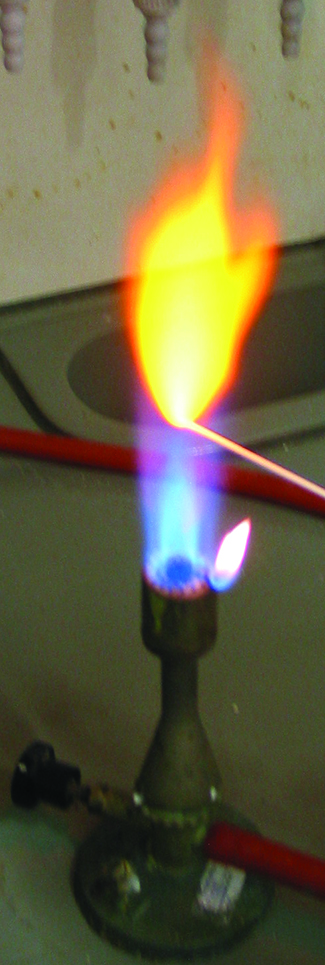
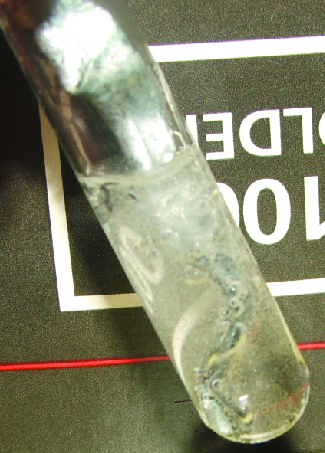

By the end of this section, you will be able to:
* Classify elements
* Make predictions about the periodicity properties of the representative elements

We begin this section by examining the behaviors of representative metals in relation to their positions in the periodic table. The primary focus of this section will be the application of periodicity to the representative metals.

It is possible to divide elements into groups according to their electron configurations. The **representative elements**{: data-type="term"} are elements where the *s* and *p* orbitals are filling. The transition elements are elements where the *d* orbitals (groups 3–11 on the periodic table) are filling, and the inner transition metals are the elements where the *f* orbitals are filling. The *d* orbitals fill with the elements in group 11; therefore, the elements in group 12 qualify as representative elements because the last electron enters an *s* orbital. Metals among the representative elements are the **representative metals**{: data-type="term"}. Metallic character results from an element’s ability to lose its outer valence electrons and results in high thermal and electrical conductivity, among other physical and chemical properties. There are 20 nonradioactive representative metals in groups 1, 2, 3, 12, 13, 14, and 15 of the periodic table (the elements shaded in yellow in [\[link\]](#CNX_Chem_18_01_PeriodicPU3)). The radioactive elements copernicium, flerovium, polonium, and livermorium are also metals but are beyond the scope of this chapter.

In addition to the representative metals, some of the representative elements are metalloids. A **metalloid**{: data-type="term"} is an element that has properties that are between those of metals and nonmetals; these elements are typically semiconductors.

The remaining representative elements are nonmetals. Unlike **metals**{: data-type="term"}, which typically form cations and ionic compounds (containing ionic bonds), nonmetals tend to form anions or molecular compounds. In general, the combination of a metal and a nonmetal produces a salt. A salt is an ionic compound consisting of cations and anions.

 ![The Periodic Table of Elements is shown. The 18 columns are labeled &#x201C;Group&#x201D; and the 7 rows are labeled &#x201C;Period.&#x201D; Below the table to the right is a box labeled &#x201C;Color Code&#x201D; with different colors for representative metals, transition and inner transition metals, radioactive elements, metalloids, and nonmetals, as well as solids, liquids, and gases. Each element will be described in this order: atomic number; name; symbol; whether it is a representative metal, transition and inner transition metal, radioactive element, metalloid, or nonmetal; whether it is a solid, liquid, or gas; and atomic mass. Beginning at the top left of the table, or period 1, group 1, is a box containing &#x201C;1; hydrogen; H; nonmetal; gas; and 1.008.&#x201D; There is only one other element box in period 1, group 18, which contains &#x201C;2; helium; H e; nonmetal; gas; and 4.003.&#x201D; Period 2, group 1 contains &#x201C;3; lithium; L i; representative metal; solid; and 6.94&#x201D; Group 2 contains &#x201C;4; beryllium; B e; representative metal; solid; and 9.012.&#x201D; Groups 3 through 12 are skipped and group 13 contains &#x201C;5; boron; B; metalloid; solid; 10.81.&#x201D; Group 14 contains &#x201C;6; carbon; C; nonmetal; solid; and 12.01.&#x201D; Group 15 contains &#x201C;7; nitrogen; N; nonmetal; gas; and 14.01.&#x201D; Group 16 contains &#x201C;8; oxygen; O; nonmetal; gas; and 16.00.&#x201D; Group 17 contains &#x201C;9; fluorine; F; nonmetal; gas; and 19.00.&#x201D; Group 18 contains &#x201C;10; neon; N e; nonmetal; gas; and 20.18.&#x201D; Period 3, group 1 contains &#x201C;11; sodium; N a; representative metal; solid; and 22.99.&#x201D; Group 2 contains &#x201C;12; magnesium; M g; representative metal; solid; and 24.31.&#x201D; Groups 3 through 12 are skipped again in period 3 and group 13 contains &#x201C;13; aluminum; A l; representative metal; solid; and 26.98.&#x201D; Group 14 contains &#x201C;14; silicon; S i; metalloid; solid; and 28.09.&#x201D; Group 15 contains &#x201C;15; phosphorous; P; nonmetal; solid; and 30.97.&#x201D; Group 16 contains &#x201C;16; sulfur; S; nonmetal; solid; and 32.06.&#x201D; Group 17 contains &#x201C;17; chlorine; C l; nonmetal; gas; and 35.45.&#x201D; Group 18 contains &#x201C;18; argon; A r; nonmetal; gas; and 39.95.&#x201D; Period 4, group 1 contains &#x201C;19; potassium; K; representative metal; solid; and 39.10.&#x201D; Group 2 contains &#x201C;20; calcium; C a; representative metal; solid; and 40.08.&#x201D; Group 3 contains &#x201C;21; scandium; S c; transition and inner transition metal; solid; and 44.96.&#x201D; Group 4 contains &#x201C;22; titanium; T i; transition and inner transition metal; solid; and 47.87.&#x201D; Group 5 contains &#x201C;23; vanadium; V; transition and inner transition metal; solid; and 50.94.&#x201D; Group 6 contains &#x201C;24; chromium; C r; transition and inner transition metal; solid; and 52.00.&#x201D; Group 7 contains &#x201C;25; manganese; M n; transition and inner transition metal; solid; and 54.94.&#x201D; Group 8 contains &#x201C;26; iron; F e; transition and inner transition metal; solid; and 55.85.&#x201D; Group 9 contains &#x201C;27; cobalt; C o; transition and inner transition metal; solid; and 58.93.&#x201D; Group 10 contains &#x201C;28; nickel; N i; transition and inner transition metal; solid; and 58.69.&#x201D; Group 11 contains &#x201C;29; copper; C u; transition and inner transition metal; solid; and 63.55.&#x201D; Group 12 contains &#x201C;30; zinc; Z n; transition and inner transition metal; solid; and 65.38.&#x201D; Group 13 contains &#x201C;31; gallium; G a; representative metal; solid; and 69.72.&#x201D; Group 14 contains &#x201C;32; germanium; G e; metalloid; solid; and 72.63.&#x201D; Group 15 contains &#x201C;33; arsenic; A s; metalloid; solid; and 74.92.&#x201D; Group 16 contains &#x201C;34; selenium; S e; nonmetal; solid; and 78.97.&#x201D; Group 17 contains &#x201C;35; bromine; B r; nonmetal; liquid; and 79.90.&#x201D; Group 18 contains &#x201C;36; krypton; K r; nonmetal; gas; and 83.80.&#x201D; Period 5, group 1 contains &#x201C;37; rubidium; R b; representative metal; solid; and 85.47.&#x201D; Group 2 contains &#x201C;38; strontium; S r; representative metal; solid; and 87.62.&#x201D; Group 3 contains &#x201C;39; yttrium; Y; transition and inner transition metal; solid; and 88.91.&#x201D; Group 4 contains &#x201C;40; zirconium; Z r; transition and inner transition metal; solid; and 91.22.&#x201D; Group 5 contains &#x201C;41; niobium; N b; transition and inner transition metal; solid; and 92.91.&#x201D; Group 6 contains &#x201C;42; molybdenum; M o; transition and inner transition metal; solid; and 95.95.&#x201D; Group 7 contains &#x201C;43; technetium; T c; radioactive element; solid; and 97.&#x201D; Group 8 contains &#x201C;44; ruthenium; R u; transition and inner transition metal; solid; and 101.1.&#x201D; Group 9 contains &#x201C;45; rhodium; R h; transition and inner transition metal; solid; and 102.9.&#x201D; Group 10 contains &#x201C;46; palladium; P d; transition and inner transition metal; solid; and 106.4.&#x201D; Group 11 contains &#x201C;47; silver; A g; transition and inner transition metal; solid; and 107.9.&#x201D; Group 12 contains &#x201C;48; cadmium; C d; transition and inner transition metal; solid; and 112.4.&#x201D; Group 13 contains &#x201C;49; indium; I n; representative metal; solid; and 114.8.&#x201D; Group 14 contains &#x201C;50; tin; S n; representative metal; solid; and 118.7.&#x201D; Group 15 contains &#x201C;51; antimony; S b; metalloid; solid; and 121.8.&#x201D; Group 16 contains &#x201C;52; tellurium; T e; metalloid; solid; and 127.6.&#x201D; Group 17 contains &#x201C;53; iodine; I; nonmetal; solid; and 126.9.&#x201D; Group 18 contains &#x201C;54; xenon; X e; nonmetal; gas; and 131.3.&#x201D; Period 6, group 1 contains &#x201C;55; cesium; C s; representative metal; solid; and 132.9.&#x201D; Group 2 contains &#x201C;56; barium; B a; representative metal; solid; and 137.3.&#x201D; Group 3 breaks the pattern. The box has a large arrow pointing to a row of elements below the table with atomic numbers ranging from 57-71. In sequential order by atomic number, the first box in this row contains &#x201C;57; lanthanum; L a; representative metal; solid; and 138.9.&#x201D; To its right, the next is &#x201C;58; cerium; C e; representative metal; solid; and 140.1.&#x201D; Next is &#x201C;59; praseodymium; P r; representative metal; solid; and 140.9.&#x201D; Next is &#x201C;60; neodymium; N d; representative metal; solid; and 144.2.&#x201D; Next is &#x201C;61; promethium; P m; radioactive element; solid; and 145.&#x201D; Next is &#x201C;62; samarium; S m; representative metal; solid; and 150.4.&#x201D; Next is &#x201C;63; europium; E u; representative metal; solid; and 152.0.&#x201D; Next is &#x201C;64; gadolinium; G d; representative metal; solid; and 157.3.&#x201D; Next is &#x201C;65; terbium; T b; representative metal; solid; and 158.9.&#x201D; Next is &#x201C;66; dysprosium; D y; representative metal; solid; and 162.5.&#x201D; Next is &#x201C;67; holmium; H o; representative metal; solid; and 164.9.&#x201D; Next is &#x201C;68; erbium; E r; representative metal; solid; and 167.3.&#x201D; Next is &#x201C;69; thulium; T m; representative metal; solid; and 168.9.&#x201D; Next is &#x201C;70; ytterbium; Y b; representative metal; solid; and 173.1.&#x201D; The last in this special row is &#x201C;71; lutetium; L u; representative metal; solid; and 175.0.&#x201D; Continuing in period 6, group 4 contains &#x201C;72; hafnium; H f; transition and inner transition metal; solid; and 178.5.&#x201D; Group 5 contains &#x201C;73; tantalum; T a; transition and inner transition metal; solid; and 180.9.&#x201D; Group 6 contains &#x201C;74; tungsten; W; transition and inner transition metal; solid; and 183.8.&#x201D; Group 7 contains &#x201C;75; rhenium; R e; transition and inner transition metal; solid; and 186.2.&#x201D; Group 8 contains &#x201C;76; osmium; O s; transition and inner transition metal; solid; and 190.2.&#x201D; Group 9 contains &#x201C;77; iridium; I r; transition and inner transition metal; solid; and 192.2.&#x201D; Group 10 contains &#x201C;78; platinum; P t; transition and inner transition metal; solid; and 195.1.&#x201D; Group 11 contains &#x201C;79; gold; A u; transition and inner transition metal; solid; and 197.0.&#x201D; Group 12 contains &#x201C;80; mercury; H g; transition and inner transition metal; liquid; and 200.6.&#x201D; Group 13 contains &#x201C;81; thallium; T l; representative metal; solid; and 204.4.&#x201D; Group 14 contains &#x201C;82; lead; P b; representative metal; solid; and 207.2.&#x201D; Group 15 contains &#x201C;83; bismuth; B i; representative metal; solid; and 209.0.&#x201D; Group 16 contains &#x201C;84; polonium; P o; radioactive element; solid; and 209.&#x201D; Group 17 contains &#x201C;85; astatine; A t; radioactive element; solid; and 210.&#x201D; Group 18 contains &#x201C;86; radon; R n; radioactive element; gas; and 222.&#x201D; Period 7, group 1 contains &#x201C;87; francium; F r; radioactive element; solid; and 223.&#x201D; Group 2 contains &#x201C;88; radium; R a; radioactive element; solid; and 226.&#x201D; Group 3 breaks the pattern much like what occurs in period 6. A large arrow points from the box in period 7, group 3 to a special row containing the elements with atomic numbers ranging from 89-103, just below the row which contains atomic numbers 57-71. In sequential order by atomic number, the first box in this row contains &#x201C;89; actinium; A c; radioactive element; solid; and 227.&#x201D; To its right, the next is &#x201C;90; thorium; T h; radioactive element; solid; and 232.0.&#x201D; Next is &#x201C;91; protactinium; P a; radioactive element; solid; and 231.0.&#x201D; Next is &#x201C;92; uranium; U; radioactive element; solid; and 238.0.&#x201D; Next is &#x201C;93; neptunium; N p; radioactive element; solid; and N p.&#x201D; Next is &#x201C;94; plutonium; P u; radioactive element; solid; and 244.&#x201D; Next is &#x201C;95; americium; A m; radioactive element; solid; and 243.&#x201D; Next is &#x201C;96; curium; C m; radioactive element; solid; and 247.&#x201D; Next is &#x201C;97; berkelium; B k; radioactive element; solid; and 247.&#x201D; Next is &#x201C;98; californium; C f; radioactive element; solid; and 251.&#x201D; Next is &#x201C;99; einsteinium; E s; radioactive element; solid; and 252.&#x201D; Next is &#x201C;100; fermium; F m; radioactive element; solid; and 257.&#x201D; Next is &#x201C;101; mendelevium; M d; radioactive element; solid; and 258.&#x201D; Next is &#x201C;102; nobelium; N o; radioactive element; solid; and 259.&#x201D; The last in this special row is &#x201C;103; lawrencium; L r; radioactive element; solid; and 262.&#x201D; Continuing in period 7, group 4 contains &#x201C;104; rutherfordium; R f; transition and inner transition metal; solid; and 267.&#x201D; Group 5 contains &#x201C;105; dubnium; D b; transition and inner transition metal; solid; and 270.&#x201D; Group 6 contains &#x201C;106; seaborgium; S g; transition and inner transition metal; solid; and 271.&#x201D; Group 7 contains &#x201C;107; bohrium; B h; transition and inner transition metal; solid; and 270.&#x201D; Group 8 contains &#x201C;108; hassium; H s; transition and inner transition metal; solid; and 277.&#x201D; Group 9 contains &#x201C;109; meitnerium; M t; radioactive element; solid; and 276.&#x201D; Group 10 contains &#x201C;110; darmstadtium; D s; radioactive element; solid; and 281.&#x201D; Group 11 contains &#x201C;111; roentgenium; R g; radioactive element; solid; and 282.&#x201D; Group 12 contains &#x201C;112; copernicium; C n; radioactive element; liquid; and 285.&#x201D; Group 13 contains &#x201C;113; ununtrium; U u t; radioactive element; solid; and 285.&#x201D; Group 14 contains &#x201C;114; flerovium; F l; radioactive element; solid; and 289.&#x201D; Group 15 contains &#x201C;115; ununpentium; U u p; radioactive element; solid; and 288.&#x201D; Group 16 contains &#x201C;116; livermorium; L v; radioactive element; solid; and 293.&#x201D; Group 17 contains &#x201C;117; ununseptium; U u s; radioactive; solid; and 294.&#x201D; Group 18 contains &#x201C;118; ununoctium; U u o; radioactive element; solid; and 294.&#x201D;](../resources/CNX_Chem_18_01_PeriodicPU3.jpg "The location of the representative metals is shown in the periodic table. Nonmetals are shown in green, metalloids in purple, and the transition metals and inner transition metals in blue."){: #CNX_Chem_18_01_PeriodicPU3}

Most of the representative metals do not occur naturally in an uncombined state because they readily react with water and oxygen in the air. However, it is possible to isolate elemental beryllium, magnesium, zinc, cadmium, mercury, aluminum, tin, and lead from their naturally occurring minerals and use them because they react very slowly with air. Part of the reason why these elements react slowly is that these elements react with air to form a protective coating. The formation of this protective coating is **passivation**{: data-type="term"}. The coating is a nonreactive film of oxide or some other compound. Elemental magnesium, aluminum, zinc, and tin are important in the fabrication of many familiar items, including wire, cookware, foil, and many household and personal objects. Although beryllium, cadmium, mercury, and lead are readily available, there are limitations in their use because of their toxicity.

# Group 1: The Alkali Metals

The alkali metals lithium, sodium, potassium, rubidium, cesium, and francium constitute group 1 of the periodic table. Although hydrogen is in group 1 (and also in group 17), it is a nonmetal and deserves separate consideration later in this chapter. The name alkali metal is in reference to the fact that these metals and their oxides react with water to form very basic (alkaline) solutions.

The properties of the alkali metals are similar to each other as expected for elements in the same family. The alkali metals have the largest atomic radii and the lowest first ionization energy in their periods. This combination makes it very easy to remove the single electron in the outermost (valence) shell of each. The easy loss of this valence electron means that these metals readily form stable cations with a charge of 1+. Their reactivity increases with increasing atomic number due to the ease of losing the lone valence electron (decreasing ionization energy). Since oxidation is so easy, the reverse, reduction, is difficult, which explains why it is hard to isolate the elements. The solid alkali metals are very soft; lithium, shown in [\[link\]](#CNX_Chem_18_01_LithiumRx), has the lowest density of any metal (0.5 g/cm3).

The alkali metals all react vigorously with water to form hydrogen gas and a basic solution of the metal hydroxide. This means they are easier to oxidize than is hydrogen. As an example, the reaction of lithium with water is:

<math xmlns="http://www.w3.org/1998/Math/MathML"><mrow><mtext>2Li</mtext><mo stretchy="false">(</mo><mi>s</mi><mo stretchy="false">)</mo><mo>+</mo><msub><mrow><mtext>2H</mtext></mrow><mn>2</mn></msub><mtext>O</mtext><mo stretchy="false">(</mo><mi>l</mi><mo stretchy="false">)</mo><mspace width="0.2em" /><mo stretchy="false">⟶</mo><mspace width="0.2em" /><mtext>2LiOH</mtext><mo stretchy="false">(</mo><mi>a</mi><mi>q</mi><mo stretchy="false">)</mo><mo>+</mo><msub><mtext>H</mtext><mn>2</mn></msub><mo stretchy="false">(</mo><mi>g</mi><mo stretchy="false">)</mo></mrow></math>

 {: #CNX_Chem_18_01_LithiumRx}

Alkali metals react directly with all the nonmetals (except the noble gases) to yield binary ionic compounds containing 1+ metal ions. These metals are so reactive that it is necessary to avoid contact with both moisture and oxygen in the air. Therefore, they are stored in sealed containers under mineral oil, as shown in [\[link\]](#CNX_Chem_18_01_AlkMetStor), to prevent contact with air and moisture. The pure metals never exist free (uncombined) in nature due to their high reactivity. In addition, this high reactivity makes it necessary to prepare the metals by electrolysis of alkali metal compounds.

 "){: #CNX_Chem_18_01_AlkMetStor}

Unlike many other metals, the reactivity and softness of the alkali metals make these metals unsuitable for structural applications. However, there are applications where the reactivity of the alkali metals is an advantage. For example, the production of metals such as titanium and zirconium relies, in part, on the ability of sodium to reduce compounds of these metals. The manufacture of many organic compounds, including certain dyes, drugs, and perfumes, utilizes reduction by lithium or sodium.

Sodium and its compounds impart a bright yellow color to a flame, as seen in [\[link\]](#CNX_Chem_18_01_NaFlame). Passing an electrical discharge through sodium vapor also produces this color. In both cases, this is an example of an emission spectrum as discussed in the chapter on electronic structure. Streetlights sometime employ sodium vapor lights because the sodium vapor penetrates fog better than most other light. This is because the fog does not scatter yellow light as much as it scatters white light. The other alkali metals and their salts also impart color to a flame. Lithium creates a bright, crimson color, whereas the others create a pale, violet color.

 {: #CNX_Chem_18_01_NaFlame}

  
This [video][1] demonstrates the reactions of the alkali metals with water.

# Group 2: The Alkaline Earth Metals

The **alkaline earth metals**{: data-type="term"} (beryllium, magnesium, calcium, strontium, barium, and radium) constitute group 2 of the periodic table. The name alkaline metal comes from the fact that the oxides of the heavier members of the group react with water to form alkaline solutions. The nuclear charge increases when going from group 1 to group 2. Because of this charge increase, the atoms of the alkaline earth metals are smaller and have higher first ionization energies than the alkali metals within the same period. The higher ionization energy makes the alkaline earth metals less reactive than the alkali metals; however, they are still very reactive elements. Their reactivity increases, as expected, with increasing size and decreasing ionization energy. In chemical reactions, these metals readily lose both valence electrons to form compounds in which they exhibit an oxidation state of 2+. Due to their high reactivity, it is common to produce the alkaline earth metals, like the alkali metals, by electrolysis. Even though the ionization energies are low, the two metals with the highest ionization energies (beryllium and magnesium) do form compounds that exhibit some covalent characters. Like the alkali metals, the heavier alkaline earth metals impart color to a flame. As in the case of the alkali metals, this is part of the emission spectrum of these elements. Calcium and strontium produce shades of red, whereas barium produces a green color.

Magnesium is a silver-white metal that is malleable and ductile at high temperatures. Passivation decreases the reactivity of magnesium metal. Upon exposure to air, a tightly adhering layer of magnesium oxycarbonate forms on the surface of the metal and inhibits further reaction. (The carbonate comes from the reaction of carbon dioxide in the atmosphere.) Magnesium is the lightest of the widely used structural metals, which is why most magnesium production is for lightweight alloys.

Magnesium (shown in [\[link\]](#CNX_Chem_18_01_CalciWater)), calcium, strontium, and barium react with water and air. At room temperature, barium shows the most vigorous reaction. The products of the reaction with water are hydrogen and the metal hydroxide. The formation of hydrogen gas indicates that the heavier alkaline earth metals are better reducing agents (more easily oxidized) than is hydrogen. As expected, these metals react with both acids and nonmetals to form ionic compounds. Unlike most salts of the alkali metals, many of the common salts of the alkaline earth metals are insoluble in water because of the high lattice energies of these compounds, containing a divalent metal ion.

 , warm water at pH 7, and the resulting solution with a pH greater than 7, as indicated by the pink color of the phenolphthalein indicator. (credit: modification of work by Sahar Atwa)"){: #CNX_Chem_18_01_CalciWater}

The potent reducing power of hot magnesium is useful in preparing some metals from their oxides. Indeed, magnesium’s affinity for oxygen is so great that burning magnesium reacts with carbon dioxide, producing elemental carbon:

<math xmlns="http://www.w3.org/1998/Math/MathML"><mrow><mtext>2Mg</mtext><mo stretchy="false">(</mo><mi>s</mi><mo stretchy="false">)</mo><mo>+</mo><msub><mrow><mtext>CO</mtext></mrow><mn>2</mn></msub><mo stretchy="false">(</mo><mi>g</mi><mo stretchy="false">)</mo><mspace width="0.2em" /><mo stretchy="false">⟶</mo><mspace width="0.2em" /><mtext>2MgO</mtext><mo stretchy="false">(</mo><mi>s</mi><mo stretchy="false">)</mo><mo>+</mo><mtext>C</mtext><mo stretchy="false">(</mo><mi>s</mi><mo stretchy="false">)</mo></mrow></math>

For this reason, a CO2 fire extinguisher will not extinguish a magnesium fire. Additionally, the brilliant white light emitted by burning magnesium makes it useful in flares and fireworks.

# Group 12

The elements in group 12 are transition elements; however, the last electron added is not a *d* electron, but an *s* electron. Since the last electron added is an *s* electron, these elements qualify as representative metals, or post-transition metals. The group 12 elements behave more like the alkaline earth metals than transition metals. Group 12 contains the four elements zinc, cadmium, mercury, and copernicium. Each of these elements has two electrons in its outer shell (*ns*2). When atoms of these metals form cations with a charge of 2+, where the two outer electrons are lost, they have pseudo-noble gas electron configurations. Mercury is sometimes an exception because it also exhibits an oxidation state of 1+ in compounds that contain a diatomic <math xmlns="http://www.w3.org/1998/Math/MathML"><mrow><msub><mrow><mtext>Hg</mtext></mrow><mn>2</mn></msub><msup><mrow /><mrow><mn>2+</mn></mrow></msup></mrow></math>

 ion. In their elemental forms and in compounds, cadmium and mercury are both toxic.

Zinc is the most reactive in group 12, and mercury is the least reactive. (This is the reverse of the reactivity trend of the metals of groups 1 and 2, in which reactivity increases down a group. The increase in reactivity with increasing atomic number only occurs for the metals in groups 1 and 2.) The decreasing reactivity is due to the formation of ions with a pseudo-noble gas configuration and to other factors that are beyond the scope of this discussion. The chemical behaviors of zinc and cadmium are quite similar to each other but differ from that of mercury.

Zinc and cadmium have lower reduction potentials than hydrogen, and, like the alkali metals and alkaline earth metals, they will produce hydrogen gas when they react with acids. The reaction of zinc with hydrochloric acid, shown in [\[link\]](#CNX_Chem_18_01_ZincHCl), is:

<math xmlns="http://www.w3.org/1998/Math/MathML"><mrow><mtext>Zn</mtext><mo stretchy="false">(</mo><mi>s</mi><mo stretchy="false">)</mo><mo>+</mo><msub><mrow><mtext>2H</mtext></mrow><mn>3</mn></msub><msup><mtext>O</mtext><mtext>+</mtext></msup><mo stretchy="false">(</mo><mi>a</mi><mi>q</mi><mo stretchy="false">)</mo><mo>+</mo><msup><mrow><mtext>2Cl</mtext></mrow><mtext>−</mtext></msup><mo stretchy="false">(</mo><mi>a</mi><mi>q</mi><mo stretchy="false">)</mo><mspace width="0.2em" /><mo stretchy="false">⟶</mo><mspace width="0.2em" /><msub><mtext>H</mtext><mn>2</mn></msub><mo stretchy="false">(</mo><mi>g</mi><mo stretchy="false">)</mo><mo>+</mo><msup><mrow><mtext>Zn</mtext></mrow><mrow><mn>2+</mn></mrow></msup><mo stretchy="false">(</mo><mi>a</mi><mi>q</mi><mo stretchy="false">)</mo><mo>+</mo><msup><mrow><mtext>2Cl</mtext></mrow><mtext>−</mtext></msup><mo stretchy="false">(</mo><mi>a</mi><mi>q</mi><mo stretchy="false">)</mo><mo>+</mo><msub><mrow><mtext>2H</mtext></mrow><mn>2</mn></msub><mtext>O</mtext><mo stretchy="false">(</mo><mi>l</mi><mo stretchy="false">)</mo></mrow></math>

 {: #CNX_Chem_18_01_ZincHCl}

Zinc is a silvery metal that quickly tarnishes to a blue-gray appearance. This change in color is due to an adherent coating of a basic carbonate, Zn2(OH)2CO3, which passivates the metal to inhibit further corrosion. Dry cell and alkaline batteries contain a zinc anode. Brass (Cu and Zn) and some bronze (Cu, Sn, and sometimes Zn) are important zinc alloys. About half of zinc production serves to protect iron and other metals from corrosion. This protection may take the form of a sacrificial anode (also known as a galvanic anode, which is a means of providing cathodic protection for various metals) or as a thin coating on the protected metal. Galvanized steel is steel with a protective coating of zinc.

Sacrificial Anodes

A sacrificial anode, or galvanic anode, is a means of providing cathodic protection of various metals. Cathodic protection refers to the prevention of corrosion by converting the corroding metal into a cathode. As a cathode, the metal resists corrosion, which is an oxidation process. Corrosion occurs at the sacrificial anode instead of at the cathode.

The construction of such a system begins with the attachment of a more active metal (more negative reduction potential) to the metal needing protection. Attachment may be direct or via a wire. To complete the circuit, a *salt bridge* is necessary. This salt bridge is often seawater or ground water. Once the circuit is complete, oxidation (corrosion) occurs at the anode and not the cathode.

The commonly used sacrificial anodes are magnesium, aluminum, and zinc. Magnesium has the most negative reduction potential of the three and serves best when the salt bridge is less efficient due to a low electrolyte concentration such as in freshwater. Zinc and aluminum work better in saltwater than does magnesium. Aluminum is lighter than zinc and has a higher capacity; however, an oxide coating may passivate the aluminum. In special cases, other materials are useful. For example, iron will protect copper.

Mercury is very different from zinc and cadmium. Mercury is the only metal that is liquid at 25 °C. Many metals dissolve in mercury, forming solutions called amalgams (see the feature on Amalgams), which are alloys of mercury with one or more other metals. Mercury, shown in [\[link\]](#CNX_Chem_18_01_MercuryRx), is a nonreactive element that is more difficult to oxidize than hydrogen. Thus, it does not displace hydrogen from acids; however, it will react with strong oxidizing acids, such as nitric acid:

<math xmlns="http://www.w3.org/1998/Math/MathML"><mrow><mtext>Hg</mtext><mo stretchy="false">(</mo><mi>l</mi><mo stretchy="false">)</mo><mo>+</mo><mtext>HCl</mtext><mo stretchy="false">(</mo><mi>a</mi><mi>q</mi><mo stretchy="false">)</mo><mspace width="0.2em" /><mo stretchy="false">⟶</mo><mspace width="0.2em" /><mtext>no reaction</mtext></mrow></math>

<math xmlns="http://www.w3.org/1998/Math/MathML"><mrow><mtext>3Hg</mtext><mo stretchy="false">(</mo><mi>l</mi><mo stretchy="false">)</mo><mo>+</mo><msub><mrow><mtext>8HNO</mtext></mrow><mn>3</mn></msub><mo stretchy="false">(</mo><mi>a</mi><mi>q</mi><mo stretchy="false">)</mo><mspace width="0.2em" /><mo stretchy="false">⟶</mo><mspace width="0.2em" /><mtext>3Hg</mtext><msub><mrow><mo stretchy="false">(</mo><msub><mrow><mtext>NO</mtext></mrow><mn>3</mn></msub><mo stretchy="false">)</mo></mrow><mn>2</mn></msub><mo stretchy="false">(</mo><mi>a</mi><mi>q</mi><mo stretchy="false">)</mo><mo>+</mo><msub><mrow><mtext>4H</mtext></mrow><mn>2</mn></msub><mtext>O</mtext><mo stretchy="false">(</mo><mi>l</mi><mo stretchy="false">)</mo><mo>+</mo><mtext>2NO</mtext><mo stretchy="false">(</mo><mi>g</mi><mo stretchy="false">)</mo></mrow></math>

The clear NO initially formed quickly undergoes further oxidation to the reddish brown NO2.

 , Hg + concentrated HCl, Hg + concentrated HNO3. (credit: Sahar Atwa)"){: #CNX_Chem_18_01_MercuryRx}

Most mercury compounds decompose when heated. Most mercury compounds contain mercury with a 2+-oxidation state. When there is a large excess of mercury, it is possible to form compounds containing the <math xmlns="http://www.w3.org/1998/Math/MathML"><mrow><msub><mrow><mtext>Hg</mtext></mrow><mn>2</mn></msub><msup><mrow /><mrow><mn>2+</mn></mrow></msup></mrow></math>

 ion. All mercury compounds are toxic, and it is necessary to exercise great care in their synthesis.

Amalgams

An amalgam is an alloy of mercury with one or more other metals. This is similar to considering steel to be an alloy of iron with other metals. Most metals will form an amalgam with mercury, with the main exceptions being iron, platinum, tungsten, and tantalum.

Due to toxicity issues with mercury, there has been a significant decrease in the use of amalgams. Historically, amalgams were important in electrolytic cells and in the extraction of gold. Amalgams of the alkali metals still find use because they are strong reducing agents and easier to handle than the pure alkali metals.

Prospectors had a problem when they found finely divided gold. They learned that adding mercury to their pans collected the gold into the mercury to form an amalgam for easier collection. Unfortunately, losses of small amounts of mercury over the years left many streams in California polluted with mercury.

Dentists use amalgams containing silver and other metals to fill cavities. There are several reasons to use an amalgam including low cost, ease of manipulation, and longevity compared to alternate materials. Dental amalgams are approximately 50% mercury by weight, which, in recent years, has become a concern due to the toxicity of mercury.

After reviewing the best available data, the Food and Drug Administration (FDA) considers amalgam-based fillings to be safe for adults and children over six years of age. Even with multiple fillings, the mercury levels in the patients remain far below the lowest levels associated with harm. Clinical studies have found no link between dental amalgams and health problems. Health issues may not be the same in cases of children under six or pregnant women. The FDA conclusions are in line with the opinions of the Environmental Protection Agency (EPA) and Centers for Disease Control (CDC). The only health consideration noted is that some people are allergic to the amalgam or one of its components.

# Group 13

Group 13 contains the metalloid boron and the metals aluminum, gallium, indium, and thallium. The lightest element, boron, is semiconducting, and its binary compounds tend to be covalent and not ionic. The remaining elements of the group are metals, but their oxides and hydroxides change characters. The oxides and hydroxides of aluminum and gallium exhibit both acidic and basic behaviors. A substance, such as these two, that will react with both acids and bases is amphoteric. This characteristic illustrates the combination of nonmetallic and metallic behaviors of these two elements. Indium and thallium oxides and hydroxides exhibit only basic behavior, in accordance with the clearly metallic character of these two elements. The melting point of gallium is unusually low (about 30 °C) and will melt in your hand.

Aluminum is amphoteric because it will react with both acids and bases. A typical reaction with an acid is:

<math xmlns="http://www.w3.org/1998/Math/MathML"><mrow><mtext>2Al</mtext><mo stretchy="false">(</mo><mi>s</mi><mo stretchy="false">)</mo><mo>+</mo><mtext>6HCl</mtext><mo stretchy="false">(</mo><mi>a</mi><mi>q</mi><mo stretchy="false">)</mo><mspace width="0.2em" /><mo stretchy="false">⟶</mo><mspace width="0.2em" /><msub><mrow><mtext>2AlCl</mtext></mrow><mn>3</mn></msub><mo stretchy="false">(</mo><mi>a</mi><mi>q</mi><mo stretchy="false">)</mo><mo>+</mo><msub><mrow><mtext>3H</mtext></mrow><mn>2</mn></msub><mo stretchy="false">(</mo><mi>g</mi><mo stretchy="false">)</mo></mrow></math>

The products of the reaction of aluminum with a base depend upon the reaction conditions, with the following being one possibility:

<math xmlns="http://www.w3.org/1998/Math/MathML"><mrow><mtext>2Al</mtext><mo stretchy="false">(</mo><mi>s</mi><mo stretchy="false">)</mo><mo>+</mo><mtext>2NaOH</mtext><mo stretchy="false">(</mo><mi>a</mi><mi>q</mi><mo stretchy="false">)</mo><mo>+</mo><msub><mrow><mtext>6H</mtext></mrow><mn>2</mn></msub><mtext>O</mtext><mo stretchy="false">(</mo><mi>l</mi><mo stretchy="false">)</mo><mspace width="0.2em" /><mo stretchy="false">⟶</mo><mspace width="0.2em" /><mtext>2Na</mtext><mrow><mo>[</mo> <mrow><mtext>Al</mtext><msub><mrow><mrow><mo>(</mo><mrow><mtext>OH</mtext></mrow><mo>)</mo></mrow></mrow><mn>4</mn></msub></mrow> <mo>]</mo></mrow><mo stretchy="false">(</mo><mi>a</mi><mi>q</mi><mo stretchy="false">)</mo><mo>+</mo><msub><mrow><mtext>3H</mtext></mrow><mn>2</mn></msub><mo stretchy="false">(</mo><mi>g</mi><mo stretchy="false">)</mo></mrow></math>

With both acids and bases, the reaction with aluminum generates hydrogen gas.

The group 13 elements have a valence shell electron configuration of *ns*2*np*1. Aluminum normally uses all of its valence electrons when it reacts, giving compounds in which it has an oxidation state of 3+. Although many of these compounds are covalent, others, such as AlF3 and Al2(SO4)3, are ionic. Aqueous solutions of aluminum salts contain the cation <math xmlns="http://www.w3.org/1998/Math/MathML"><mrow><msup><mrow><mrow><mo>[</mo> <mrow><mtext>Al</mtext><msub><mrow><mrow><mo>(</mo><mrow><msub><mtext>H</mtext><mn>2</mn></msub><mtext>O</mtext></mrow><mo>)</mo></mrow></mrow><mn>6</mn></msub></mrow> <mo>]</mo></mrow></mrow><mrow><mn>3+</mn></mrow></msup><mo>,</mo></mrow></math>

 abbreviated as Al3+(*aq*). Gallium, indium, and thallium also form ionic compounds containing M3+ ions. These three elements exhibit not only the expected oxidation state of 3+ from the three valence electrons but also an oxidation state (in this case, 1+) that is two below the expected value. This phenomenon, the inert pair effect, refers to the formation of a stable ion with an oxidation state two lower than expected for the group. The pair of electrons is the valence *s* orbital for those elements. In general, the inert pair effect is important for the lower *p*-block elements. In an aqueous solution, the Tl+(*aq*) ion is more stable than is Tl3+(*aq*). In general, these metals will react with air and water to form 3+ ions; however, thallium reacts to give thallium(I) derivatives. The metals of group 13 all react directly with nonmetals such as sulfur, phosphorus, and the halogens, forming binary compounds.

The metals of group 13 (Al, Ga, In, and Tl) are all reactive. However, passivation occurs as a tough, hard, thin film of the metal oxide forms upon exposure to air. Disruption of this film may counter the passivation, allowing the metal to react. One way to disrupt the film is to expose the passivated metal to mercury. Some of the metal dissolves in the mercury to form an amalgam, which sheds the protective oxide layer to expose the metal to further reaction. The formation of an amalgam allows the metal to react with air and water.

  
Although easily oxidized, the passivation of aluminum makes it very useful as a strong, lightweight building material. Because of the formation of an amalgam, mercury is corrosive to structural materials made of aluminum. This [video][2] demonstrates how the integrity of an aluminum beam can be destroyed by the addition of a small amount of elemental mercury.

The most important uses of aluminum are in the construction and transportation industries, and in the manufacture of aluminum cans and aluminum foil. These uses depend on the lightness, toughness, and strength of the metal, as well as its resistance to corrosion. Because aluminum is an excellent conductor of heat and resists corrosion, it is useful in the manufacture of cooking utensils.

Aluminum is a very good reducing agent and may replace other reducing agents in the isolation of certain metals from their oxides. Although more expensive than reduction by carbon, aluminum is important in the isolation of Mo, W, and Cr from their oxides.

# Group 14

The metallic members of group 14 are tin, lead, and flerovium. Carbon is a typical nonmetal. The remaining elements of the group, silicon and germanium, are examples of semimetals or metalloids. Tin and lead form the stable divalent cations, Sn2+ and Pb2+, with oxidation states two below the group oxidation state of 4+. The stability of this oxidation state is a consequence of the inert pair effect. Tin and lead also form covalent compounds with a formal 4+-oxidation state. For example, SnCl4 and PbCl4 are low-boiling covalent liquids.

  Tin(II) chloride is an ionic solid; (b) tin(IV) chloride is a covalent liquid."){: #CNX_Chem_18_01_TinChlorid}

Tin reacts readily with nonmetals and acids to form tin(II) compounds (indicating that it is more easily oxidized than hydrogen) and with nonmetals to form either tin(II) or tin(IV) compounds (shown in [\[link\]](#CNX_Chem_18_01_TinChlorid)), depending on the stoichiometry and reaction conditions. Lead is less reactive. It is only slightly easier to oxidize than hydrogen, and oxidation normally requires a hot concentrated acid.

Many of these elements exist as allotropes. **Allotropes**{: data-type="term"} are two or more forms of the same element in the same physical state with different chemical and physical properties. There are two common allotropes of tin. These allotropes are grey (brittle) tin and white tin. As with other allotropes, the difference between these forms of tin is in the arrangement of the atoms. White tin is stable above 13.2 °C and is malleable like other metals. At low temperatures, gray tin is the more stable form. Gray tin is brittle and tends to break down to a powder. Consequently, articles made of tin will disintegrate in cold weather, particularly if the cold spell is lengthy. The change progresses slowly from the spot of origin, and the gray tin that is first formed catalyzes further change. In a way, this effect is similar to the spread of an infection in a plant or animal body, leading people to call this process tin disease or tin pest.

The principal use of tin is in the coating of steel to form tin plate-sheet iron, which constitutes the tin in tin cans. Important tin alloys are bronze (Cu and Sn) and solder (Sn and Pb). Lead is important in the lead storage batteries in automobiles.

# Group 15

**Bismuth**{: data-type="term"}, the heaviest member of group 15, is a less reactive metal than the other representative metals. It readily gives up three of its five valence electrons to active nonmetals to form the tri-positive ion, Bi3+. It forms compounds with the group oxidation state of 5+ only when treated with strong oxidizing agents. The stability of the 3+-oxidation state is another example of the inert pair effect.

# Key Concepts and Summary

This section focuses on the periodicity of the representative elements. These are the elements where the electrons are entering the *s* and *p* orbitals. The representative elements occur in groups 1, 2, and 12–18. These elements are representative metals, metalloids, and nonmetals. The alkali metals (group 1) are very reactive, readily form ions with a charge of 1+ to form ionic compounds that are usually soluble in water, and react vigorously with water to form hydrogen gas and a basic solution of the metal hydroxide. The outermost electrons of the alkaline earth metals (group 2) are more difficult to remove than the outer electron of the alkali metals, leading to the group 2 metals being less reactive than those in group 1. These elements easily form compounds in which the metals exhibit an oxidation state of 2+. Zinc, cadmium, and mercury (group 12) commonly exhibit the group oxidation state of 2+ (although mercury also exhibits an oxidation state of 1+ in compounds that contain <math xmlns="http://www.w3.org/1998/Math/MathML"><mrow><msub><mrow><mtext>Hg</mtext></mrow><mn>2</mn></msub><msup><mrow /><mn>2+</mn></msup><mo stretchy="false">)</mo><mo>.</mo></mrow></math>

 Aluminum, gallium, indium, and thallium (group 13) are easier to oxidize than is hydrogen. Aluminum, gallium, and indium occur with an oxidation state 3+ (however, thallium also commonly occurs as the Tl+ ion). Tin and lead form stable divalent cations and covalent compounds in which the metals exhibit the 4+-oxidation state.

# Chemistry End of Chapter Exercises

How do alkali metals differ from alkaline earth metals in atomic structure and general properties?

The alkali metals all have a single *s* electron in their outermost shell. In contrast, the alkaline earth metals have a completed *s* subshell in their outermost shell. In general, the alkali metals react faster and are more reactive than the corresponding alkaline earth metals in the same period.

Why does the reactivity of the alkali metals decrease from cesium to lithium?

Predict the formulas for the nine compounds that may form when each species in column 1 of [[link]](#fs-idp283136) reacts with each species in column 2.* * *
{: data-type="newline"}

 | 1 | 2 |
{: valign="top"}|----------
| Na | I |
{: valign="top"}| Sr | Se |
{: valign="top"}| Al | O |
{: valign="top"}{: .medium .unnumbered summary="This table has two columns and four rows. The first column is labeled, &#x201C;1,&#x201D; and the second column is labeled, &#x201C;2.&#x201D; Under the first column are: N a, S r, and A l. Under the second column are: I, S e, and O." data-label=""}

* * *
{: data-type="newline"}

<math xmlns="http://www.w3.org/1998/Math/MathML"><mtable columnalign="left"><mtr><mtd><mtext>Na</mtext><mo>+</mo><msub><mtext>I</mtext><mn>2</mn></msub><mspace width="0.2em" /><mo stretchy="false">⟶</mo><mspace width="0.2em" /><mtext>2NaI</mtext></mtd></mtr><mtr><mtd><mtext>2Na</mtext><mo>+</mo><mtext>Se</mtext><mspace width="0.2em" /><mo stretchy="false">⟶</mo><mspace width="0.2em" /><msub><mtext>Na</mtext><mn>2</mn></msub><mtext>Se</mtext></mtd></mtr><mtr><mtd><mtext>2Na</mtext><mo>+</mo><msub><mtext>O</mtext><mn>2</mn></msub><mspace width="0.2em" /><mo stretchy="false">⟶</mo><mspace width="0.2em" /><msub><mtext>Na</mtext><mn>2</mn></msub><msub><mtext>O</mtext><mn>2</mn></msub></mtd></mtr></mtable></math>

* * *
{: data-type="newline"}

 <math xmlns="http://www.w3.org/1998/Math/MathML"><mtable columnalign="left"><mtr><mtd><mtext>Sr</mtext><mo>+</mo><msub><mtext>I</mtext><mn>2</mn></msub><mspace width="0.2em" /><mo stretchy="false">⟶</mo><mspace width="0.2em" /><msub><mtext>SrI</mtext><mn>2</mn></msub></mtd></mtr><mtr><mtd><mtext>Sr</mtext><mo>+</mo><mtext>Se</mtext><mspace width="0.2em" /><mo stretchy="false">⟶</mo><mspace width="0.2em" /><mtext>SeSe</mtext></mtd></mtr><mtr><mtd><mtext>2Sr</mtext><mo>+</mo><msub><mtext>O</mtext><mn>2</mn></msub><mspace width="0.2em" /><mo stretchy="false">⟶</mo><mspace width="0.2em" /><mtext>2SrO</mtext></mtd></mtr></mtable></math>

* * *
{: data-type="newline"}

 <math xmlns="http://www.w3.org/1998/Math/MathML"><mtable columnalign="left"><mtr><mtd><mtext>2Al</mtext><mo>+</mo><msub><mtext>3I</mtext><mn>2</mn></msub><mspace width="0.2em" /><mo stretchy="false">⟶</mo><mspace width="0.2em" /><msub><mtext>2AlI</mtext><mn>3</mn></msub></mtd></mtr><mtr><mtd><mtext>2Al</mtext><mo>+</mo><mtext>3Se</mtext><mspace width="0.2em" /><mo stretchy="false">⟶</mo><mspace width="0.2em" /><msub><mtext>Al</mtext><mn>2</mn></msub><msub><mtext>Se</mtext><mn>3</mn></msub></mtd></mtr><mtr><mtd><mtext>4Al</mtext><mo>+</mo><msub><mtext>3O</mtext><mn>2</mn></msub><mspace width="0.2em" /><mo stretchy="false">⟶</mo><mspace width="0.2em" /><msub><mtext>2Al</mtext><mn>2</mn></msub><msub><mtext>O</mtext><mn>3</mn></msub></mtd></mtr></mtable></math>

Predict the best choice in each of the following. You may wish to review the chapter on electronic structure for relevant examples.

(a) the most metallic of the elements Al, Be, and Ba

(b) the most covalent of the compounds NaCl, CaCl2, and BeCl2

(c) the lowest first ionization energy among the elements Rb, K, and Li

(d) the smallest among Al, Al+, and Al3+

(e) the largest among Cs+, Ba2+, and Xe

Sodium chloride and strontium chloride are both white solids. How could you distinguish one from the other?

The possible ways of distinguishing between the two include infrared spectroscopy by comparison of known compounds, a flame test that gives the characteristic yellow color for sodium (strontium has a red flame), or comparison of their solubilities in water. At 20 °C, NaCl dissolves to the extent of <math xmlns="http://www.w3.org/1998/Math/MathML"><mrow><mfrac><mrow><mtext>35.7 g</mtext></mrow><mrow><mtext>100 mL</mtext></mrow></mfrac></mrow></math>

 compared with <math xmlns="http://www.w3.org/1998/Math/MathML"><mrow><mfrac><mrow><mtext>53.8 g</mtext></mrow><mrow><mtext>100 mL</mtext></mrow></mfrac></mrow></math>

 for SrCl2. Heating to 100 °C provides an easy test, since the solubility of NaCl is <math xmlns="http://www.w3.org/1998/Math/MathML"><mrow><mfrac><mrow><mtext>39.12 g</mtext></mrow><mrow><mtext>100 mL</mtext></mrow></mfrac><mo>,</mo></mrow></math>

 but that of SrCl2 is <math xmlns="http://www.w3.org/1998/Math/MathML"><mrow><mfrac><mrow><mtext>100.8 g</mtext></mrow><mrow><mtext>100 mL</mtext></mrow></mfrac><mo>.</mo></mrow></math>

 Density determination on a solid is sometimes difficult, but there is enough difference (2.165 g/mL NaCl and 3.052 g/mL SrCl2) that this method would be viable and perhaps the easiest and least expensive test to perform.

The reaction of quicklime, CaO, with water produces slaked lime, Ca(OH)2, which is widely used in the construction industry to make mortar and plaster. The reaction of quicklime and water is highly exothermic:* * *
{: data-type="newline"}

 <math xmlns="http://www.w3.org/1998/Math/MathML"><mrow><mtext>CaO</mtext><mo stretchy="false">(</mo><mi>s</mi><mo stretchy="false">)</mo><mo>+</mo><msub><mtext>H</mtext><mn>2</mn></msub><mtext>O</mtext><mo stretchy="false">(</mo><mi>l</mi><mo stretchy="false">)</mo><mspace width="0.2em" /><mo stretchy="false">⟶</mo><mspace width="0.2em" /><mtext>Ca</mtext><msub><mrow><mo stretchy="false">(</mo><mtext>OH</mtext><mo stretchy="false">)</mo></mrow><mn>2</mn></msub><mo stretchy="false">(</mo><mi>s</mi><mo stretchy="false">)</mo><mspace width="3em" /><mtext>Δ</mtext><mi>H</mi><mo>=</mo><mtext>−350 kJ</mtext><mspace width="0.2em" /><msup><mrow><mtext>mol</mtext></mrow><mtext>−1</mtext></msup></mrow></math>

(a) What is the enthalpy of reaction per gram of quicklime that reacts?

(b) How much heat, in kilojoules, is associated with the production of 1 ton of slaked lime?

Write a balanced equation for the reaction of elemental strontium with each of the following:

(a) oxygen

(b) hydrogen bromide

(c) hydrogen

(d) phosphorus

(e) water

(a) <math xmlns="http://www.w3.org/1998/Math/MathML"><mrow><mtext>2Sr</mtext><mo stretchy="false">(</mo><mi>s</mi><mo stretchy="false">)</mo><mo>+</mo><msub><mtext>O</mtext><mn>2</mn></msub><mo stretchy="false">(</mo><mi>g</mi><mo stretchy="false">)</mo><mspace width="0.2em" /><mo stretchy="false">⟶</mo><mspace width="0.2em" /><mtext>2SrO</mtext><mo stretchy="false">(</mo><mi>s</mi><mo stretchy="false">)</mo><mo>;</mo></mrow></math>

 (b) <math xmlns="http://www.w3.org/1998/Math/MathML"><mrow><mtext>Sr</mtext><mo stretchy="false">(</mo><mi>s</mi><mo stretchy="false">)</mo><mo>+</mo><mtext>2HBr</mtext><mo stretchy="false">(</mo><mi>g</mi><mo stretchy="false">)</mo><mspace width="0.2em" /><mo stretchy="false">⟶</mo><mspace width="0.2em" /><msub><mrow><mtext>SrBr</mtext></mrow><mn>2</mn></msub><mo stretchy="false">(</mo><mi>s</mi><mo stretchy="false">)</mo><mo>+</mo><msub><mtext>H</mtext><mn>2</mn></msub><mo stretchy="false">(</mo><mi>g</mi><mo stretchy="false">)</mo><mo>;</mo></mrow></math>

 (c) <math xmlns="http://www.w3.org/1998/Math/MathML"><mrow><mtext>Sr</mtext><mo stretchy="false">(</mo><mi>s</mi><mo stretchy="false">)</mo><mo>+</mo><msub><mtext>H</mtext><mn>2</mn></msub><mo stretchy="false">(</mo><mi>g</mi><mo stretchy="false">)</mo><mspace width="0.2em" /><mo stretchy="false">⟶</mo><mspace width="0.2em" /><msub><mrow><mtext>SrH</mtext></mrow><mn>2</mn></msub><mo stretchy="false">(</mo><mi>s</mi><mo stretchy="false">)</mo><mo>;</mo></mrow></math>

 (d) <math xmlns="http://www.w3.org/1998/Math/MathML"><mrow><mtext>6Sr</mtext><mo stretchy="false">(</mo><mi>s</mi><mo stretchy="false">)</mo><mo>+</mo><msub><mtext>P</mtext><mn>4</mn></msub><mo stretchy="false">(</mo><mi>s</mi><mo stretchy="false">)</mo><mspace width="0.2em" /><mo stretchy="false">⟶</mo><mspace width="0.2em" /><msub><mrow><mtext>2Sr</mtext></mrow><mn>3</mn></msub><msub><mtext>P</mtext><mn>2</mn></msub><mo stretchy="false">(</mo><mi>s</mi><mo stretchy="false">)</mo><mo>;</mo></mrow></math>

 (e) <math xmlns="http://www.w3.org/1998/Math/MathML"><mrow><mtext>Sr</mtext><mo stretchy="false">(</mo><mi>s</mi><mo stretchy="false">)</mo><mo>+</mo><msub><mrow><mtext>2H</mtext></mrow><mn>2</mn></msub><mtext>O</mtext><mo stretchy="false">(</mo><mi>l</mi><mo stretchy="false">)</mo><mspace width="0.2em" /><mo stretchy="false">⟶</mo><mspace width="0.2em" /><mtext>Sr</mtext><msub><mrow><mo stretchy="false">(</mo><mtext>OH</mtext><mo stretchy="false">)</mo></mrow><mn>2</mn></msub><mo stretchy="false">(</mo><mi>a</mi><mi>q</mi><mo stretchy="false">)</mo><mo>+</mo><msub><mtext>H</mtext><mn>2</mn></msub><mo stretchy="false">(</mo><mi>g</mi><mo stretchy="false">)</mo></mrow></math>

How many moles of ionic species are present in 1.0 L of a solution marked 1.0 *M* mercury(I) nitrate?

What is the mass of fish, in kilograms, that one would have to consume to obtain a fatal dose of mercury, if the fish contains 30 parts per million of mercury by weight? (Assume that all the mercury from the fish ends up as mercury(II) chloride in the body and that a fatal dose is 0.20 g of HgCl2.) How many pounds of fish is this?

11 lb

The elements sodium, aluminum, and chlorine are in the same period.

(a) Which has the greatest electronegativity?

(b) Which of the atoms is smallest?

(c) Write the Lewis structure for the simplest covalent compound that can form between aluminum and chlorine.

(d) Will the oxide of each element be acidic, basic, or amphoteric?

Does metallic tin react with HCl?

Yes, tin reacts with hydrochloric acid to produce hydrogen gas.

What is tin pest, also known as tin disease?

Compare the nature of the bonds in PbCl2 to that of the bonds in PbCl4.

In PbCl2, the bonding is ionic, as indicated by its melting point of 501 °C. In PbCl4, the bonding is covalent, as evidenced by it being an unstable liquid at room temperature.

Is the reaction of rubidium with water more or less vigorous than that of sodium? How does the rate of reaction of magnesium compare?

## Glossary
{: data-type="glossary-title"}

alkaline earth metal
: any of the metals (beryllium, magnesium, calcium, strontium, barium, and radium) occupying group 2 of the periodic table; they are reactive, divalent metals that form basic oxides
{: .definition}

allotropes
: two or more forms of the same element, in the same physical state, with different chemical structures
{: .definition}

bismuth
: heaviest member of group 15; a less reactive metal than other representative metals
{: .definition}

metal
: atoms of the metallic elements of groups 1, 2, 12, 13, 14, 15, and 16, which form ionic compounds by losing electrons from their outer *s* or *p* orbitals
{: .definition}

metalloid
: element that has properties that are between those of metals and nonmetals; these elements are typically semiconductors
{: .definition}

passivation
: metals with a protective nonreactive film of oxide or other compound that creates a barrier for chemical reactions; physical or chemical removal of the passivating film allows the metals to demonstrate their expected chemical reactivity
{: .definition}

representative element
: element where the *s* and *p* orbitals are filling
{: .definition}

representative metal
: metal among the representative elements
{: .definition}

[1]: http://openstaxcollege.org/l/16alkalih2o
[2]: http://openstaxcollege.org/l/16aluminumhg
