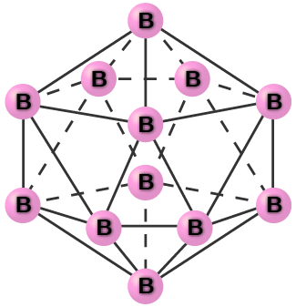
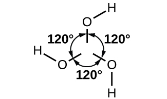
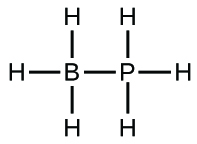
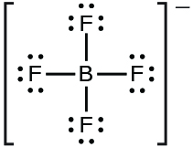
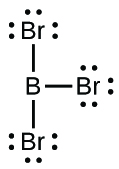
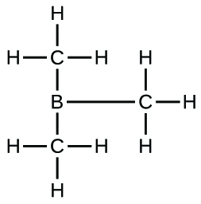
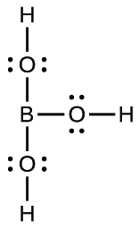

By the end of this section, you will be able to:
* Describe the general preparation, properties, and uses of the metalloids
* Describe the preparation, properties, and compounds of boron and silicon

A series of six elements called the metalloids separate the metals from the nonmetals in the periodic table. The metalloids are boron, silicon, germanium, arsenic, antimony, and tellurium. These elements look metallic; however, they do not conduct electricity as well as metals so they are semiconductors. They are semiconductors because their electrons are more tightly bound to their nuclei than are those of metallic conductors. Their chemical behavior falls between that of metals and nonmetals. For example, the pure metalloids form covalent crystals like the nonmetals, but like the metals, they generally do not form monatomic anions. This intermediate behavior is in part due to their intermediate electronegativity values. In this section, we will briefly discuss the chemical behavior of metalloids and deal with two of these elements—boron and silicon—in more detail.

The metalloid boron exhibits many similarities to its neighbor carbon and its diagonal neighbor silicon. All three elements form covalent compounds. However, boron has one distinct difference in that its 2*s*22*p*1 outer electron structure gives it one less valence electron than it has valence orbitals. Although boron exhibits an oxidation state of 3+ in most of its stable compounds, this electron deficiency provides boron with the ability to form other, sometimes fractional, oxidation states, which occur, for example, in the boron hydrides.

Silicon has the valence shell electron configuration 3*s*23*p*2, and it commonly forms tetrahedral structures in which it is *sp*3 hybridized with a formal oxidation state of 4+. The major differences between the chemistry of carbon and silicon result from the relative strength of the carbon-carbon bond, carbon’s ability to form stable bonds to itself, and the presence of the empty 3*d* valence-shell orbitals in silicon. Silicon’s empty *d* orbitals and boron’s empty *p* orbital enable tetrahedral silicon compounds and trigonal planar boron compounds to act as Lewis acids. Carbon, on the other hand, has no available valence shell orbitals; tetrahedral carbon compounds cannot act as Lewis acids. Germanium is very similar to silicon in its chemical behavior.

Arsenic and antimony generally form compounds in which an oxidation state of 3+ or 5+ is exhibited; however, arsenic can form arsenides with an oxidation state of 3−. These elements tarnish only slightly in dry air but readily oxidize when warmed.

Tellurium combines directly with most elements. The most stable tellurium compounds are the tellurides—salts of Te2− formed with active metals and lanthanides—and compounds with oxygen, fluorine, and chlorine, in which tellurium normally exhibits an oxidation state 2+ or 4+. Although tellurium(VI) compounds are known (for example, TeF6), there is a marked resistance to oxidation to this maximum group oxidation state.

### Structures of the Metalloids

Covalent bonding is the key to the crystal structures of the metalloids. In this regard, these elements resemble nonmetals in their behavior.

Elemental silicon, germanium, arsenic, antimony, and tellurium are lustrous, metallic-looking solids. Silicon and germanium crystallize with a diamond structure. Each atom within the crystal has covalent bonds to four neighboring atoms at the corners of a regular tetrahedron. Single crystals of silicon and germanium are giant, three-dimensional molecules. There are several allotropes of arsenic with the most stable being layer like and containing puckered sheets of arsenic atoms. Each arsenic atom forms covalent bonds to three other atoms within the sheet. The crystal structure of antimony is similar to that of arsenic, both shown in [\[link\]](#CNX_Chem_18_03_Structures). The structures of arsenic and antimony are similar to the structure of graphite, covered later in this chapter. Tellurium forms crystals that contain infinite spiral chains of tellurium atoms. Each atom in the chain bonds to two other atoms.

  
Explore a [cubic diamond][1] crystal structure.

  Arsenic and (b) antimony have a layered structure similar to that of (c) graphite, except that the layers are puckered rather than planar. (d) Elemental tellurium forms spiral chains."){: #CNX_Chem_18_03_Structures}

Pure crystalline boron is transparent. The crystals consist of icosahedra, as shown in [\[link\]](#CNX_Chem_18_03_BIcosahed), with a boron atom at each corner. In the most common form of boron, the icosahedra pack together in a manner similar to the cubic closest packing of spheres. All boron-boron bonds within each icosahedron are identical and are approximately 176 pm in length. In the different forms of boron, there are different arrangements and connections between the icosahedra.

 {: #CNX_Chem_18_03_BIcosahed}

The name silicon is derived from the Latin word for flint, *silex*. The metalloid silicon readily forms compounds containing Si-O-Si bonds, which are of prime importance in the mineral world. This bonding capability is in contrast to the nonmetal carbon, whose ability to form carbon-carbon bonds gives it prime importance in the plant and animal worlds.

### Occurrence, Preparation, and Compounds of Boron and Silicon

Boron constitutes less than 0.001% by weight of the earth’s crust. In nature, it only occurs in compounds with oxygen. Boron is widely distributed in volcanic regions as boric acid, B(OH)3, and in dry lake regions, including the desert areas of California, as borates and salts of boron oxyacids, such as borax, Na2B4O7⋅10H2O.

Elemental boron is chemically inert at room temperature, reacting with only fluorine and oxygen to form boron trifluoride, BF3, and boric oxide, B2O3, respectively. At higher temperatures, boron reacts with all nonmetals, except tellurium and the noble gases, and with nearly all metals; it oxidizes to B2O3 when heated with concentrated nitric or sulfuric acid. Boron does not react with nonoxidizing acids. Many boron compounds react readily with water to give boric acid, B(OH)3 (sometimes written as H3BO3).

Reduction of boric oxide with magnesium powder forms boron (95–98.5% pure) as a brown, amorphous powder:

<math xmlns="http://www.w3.org/1998/Math/MathML"><mrow><msub><mtext>B</mtext><mn>2</mn></msub><msub><mtext>O</mtext><mn>3</mn></msub><mo stretchy="false">(</mo><mi>s</mi><mo stretchy="false">)</mo><mo>+</mo><mtext>3Mg</mtext><mo stretchy="false">(</mo><mi>s</mi><mo stretchy="false">)</mo><mspace width="0.2em" /><mo stretchy="false">⟶</mo><mspace width="0.2em" /><mtext>2B</mtext><mo stretchy="false">(</mo><mi>s</mi><mo stretchy="false">)</mo><mo>+</mo><mtext>3MgO</mtext><mo stretchy="false">(</mo><mi>s</mi><mo stretchy="false">)</mo></mrow></math>

An **amorphous**{: data-type="term"} substance is a material that appears to be a solid, but does not have a long-range order like a true solid. Treatment with hydrochloric acid removes the magnesium oxide. Further purification of the boron begins with conversion of the impure boron into boron trichloride. The next step is to heat a mixture of boron trichloride and hydrogen:

<math xmlns="http://www.w3.org/1998/Math/MathML"><mrow><msub><mrow><mtext>2BCl</mtext></mrow><mn>3</mn></msub><mo stretchy="false">(</mo><mi>g</mi><mo stretchy="false">)</mo><mo>+</mo><msub><mrow><mtext>3H</mtext></mrow><mn>2</mn></msub><mo stretchy="false">(</mo><mi>g</mi><mo stretchy="false">)</mo><mspace width="0.2em" /><mover><mo>→</mo><mrow><mspace width="0.5em" /><mn>1500</mn><mspace width="0.2em" /><mtext>°C</mtext><mspace width="0.5em" /></mrow></mover><mspace width="0.2em" /><mtext>2B</mtext><mo stretchy="false">(</mo><mi>s</mi><mo stretchy="false">)</mo><mo>+</mo><mtext>6HCl</mtext><mo stretchy="false">(</mo><mi>g</mi><mo stretchy="false">)</mo><mspace width="3em" /><mtext>Δ</mtext><mi>H</mi><mtext>°</mtext><mo>=</mo><mtext>253.7 kJ</mtext></mrow></math>

Silicon makes up nearly one-fourth of the mass of the earth’s crust—second in abundance only to oxygen. The crust is composed almost entirely of minerals in which the silicon atoms are at the center of the silicon-oxygen tetrahedron, which connect in a variety of ways to produce, among other things, chains, layers, and three-dimensional frameworks. These minerals constitute the bulk of most common rocks, soil, and clays. In addition, materials such as bricks, ceramics, and glasses contain silicon compounds.

It is possible to produce silicon by the high-temperature reduction of silicon dioxide with strong reducing agents, such as carbon and magnesium:

<math xmlns="http://www.w3.org/1998/Math/MathML"><mtable columnalign="left"><mtr /><mtr /><mtr><mtd><msub><mtext>SiO</mtext><mn>2</mn></msub><mo stretchy="false">(</mo><mi>s</mi><mo stretchy="false">)</mo><mo>+</mo><mtext>2C</mtext><mo stretchy="false">(</mo><mi>s</mi><mo stretchy="false">)</mo><mspace width="0.2em" /><mover><mo>→</mo><mrow><mspace width="0.4em" /><mtext>Δ</mtext><mspace width="0.4em" /></mrow></mover><mspace width="0.2em" /><mtext>Si</mtext><mo stretchy="false">(</mo><mi>s</mi><mo stretchy="false">)</mo><mo>+</mo><mtext>2CO</mtext><mo stretchy="false">(</mo><mi>g</mi><mo stretchy="false">)</mo></mtd></mtr><mtr><mtd><msub><mtext>SiO</mtext><mn>2</mn></msub><mo stretchy="false">(</mo><mi>s</mi><mo stretchy="false">)</mo><mo>+</mo><mtext>2Mg</mtext><mo stretchy="false">(</mo><mi>s</mi><mo stretchy="false">)</mo><mspace width="0.2em" /><mover><mo>→</mo><mrow><mspace width="0.4em" /><mtext>Δ</mtext><mspace width="0.4em" /></mrow></mover><mspace width="0.2em" /><mtext>Si</mtext><mo stretchy="false">(</mo><mi>s</mi><mo stretchy="false">)</mo><mo>+</mo><mtext>2MgO</mtext><mo stretchy="false">(</mo><mi>s</mi><mo stretchy="false">)</mo></mtd></mtr></mtable></math>

Extremely pure silicon is necessary for the manufacture of semiconductor electronic devices. This process begins with the conversion of impure silicon into silicon tetrahalides, or silane (SiH4), followed by decomposition at high temperatures. Zone refining, illustrated in [\[link\]](#CNX_Chem_18_03_SiPurif), completes the purification. In this method, a rod of silicon is heated at one end by a heat source that produces a thin cross-section of molten silicon. Slowly lowering the rod through the heat source moves the molten zone from one end of the rod to other. As this thin, molten region moves, impurities in the silicon dissolve in the liquid silicon and move with the molten region. Ultimately, the impurities move to one end of the rod, which is then cut off.

 {: #CNX_Chem_18_03_SiPurif}

This highly purified silicon, containing no more than one part impurity per million parts of silicon, is the most important element in the computer industry. Pure silicon is necessary in semiconductor electronic devices such as transistors, computer chips, and solar cells.

Like some metals, passivation of silicon occurs due the formation of a very thin film of oxide (primarily silicon dioxide, SiO2). Silicon dioxide is soluble in hot aqueous base; thus, strong bases destroy the passivation. Removal of the passivation layer allows the base to dissolve the silicon, forming hydrogen gas and silicate anions. For example:

<math xmlns="http://www.w3.org/1998/Math/MathML"><mrow><mtext>Si</mtext><mo stretchy="false">(</mo><mi>s</mi><mo stretchy="false">)</mo><mo>+</mo><msup><mrow><mtext>4OH</mtext></mrow><mtext>−</mtext></msup><mo stretchy="false">(</mo><mi>a</mi><mi>q</mi><mo stretchy="false">)</mo><mspace width="0.2em" /><mo stretchy="false">⟶</mo><mspace width="0.2em" /><msub><mrow><mtext>SiO</mtext></mrow><mn>4</mn></msub><msup><mrow /><mrow><mn>4−</mn></mrow></msup><mo stretchy="false">(</mo><mi>a</mi><mi>q</mi><mo stretchy="false">)</mo><mo>+</mo><msub><mrow><mtext>2H</mtext></mrow><mn>2</mn></msub><mo stretchy="false">(</mo><mi>g</mi><mo stretchy="false">)</mo></mrow></math>

Silicon reacts with halogens at high temperatures, forming volatile tetrahalides, such as SiF4.

Unlike carbon, silicon does not readily form double or triple bonds. Silicon compounds of the general formula SiX4, where X is a highly electronegative group, can act as Lewis acids to form six-coordinate silicon. For example, silicon tetrafluoride, SiF4, reacts with sodium fluoride to yield Na2\[SiF6\], which contains the octahedral <math xmlns="http://www.w3.org/1998/Math/MathML"><mrow><msup><mrow><mrow><mo>[</mo> <mrow><msub><mrow><mtext>SiF</mtext></mrow><mn>6</mn></msub></mrow> <mo>]</mo></mrow></mrow><mrow><mn>2−</mn></mrow></msup></mrow></math>

 ion in which silicon is<em> sp</em>3*d*2 hybridized:

<math xmlns="http://www.w3.org/1998/Math/MathML"><mrow><mtext>2NaF</mtext><mo stretchy="false">(</mo><mi>s</mi><mo stretchy="false">)</mo><mo>+</mo><msub><mrow><mtext>SiF</mtext></mrow><mn>4</mn></msub><mo stretchy="false">(</mo><mi>g</mi><mo stretchy="false">)</mo><mspace width="0.2em" /><mo stretchy="false">⟶</mo><mspace width="0.2em" /><msub><mrow><mtext>Na</mtext></mrow><mn>2</mn></msub><msub><mrow><mtext>SiF</mtext></mrow><mn>6</mn></msub><mo stretchy="false">(</mo><mi>s</mi><mo stretchy="false">)</mo></mrow></math>

Antimony reacts readily with stoichiometric amounts of fluorine, chlorine, bromine, or iodine, yielding trihalides or, with excess fluorine or chlorine, forming the pentahalides SbF5 and SbCl5. Depending on the stoichiometry, it forms antimony(III) sulfide, Sb2S3, or antimony(V) sulfide when heated with sulfur. As expected, the metallic nature of the element is greater than that of arsenic, which lies immediately above it in group 15.

#### Boron and Silicon Halides

Boron trihalides—BF3, BCl3, BBr3, and BI3—can be prepared by the direct reaction of the elements. These nonpolar molecules contain boron with *sp*2 hybridization and a trigonal planar molecular geometry. The fluoride and chloride compounds are colorless gasses, the bromide is a liquid, and the iodide is a white crystalline solid.

Except for boron trifluoride, the boron trihalides readily hydrolyze in water to form boric acid and the corresponding hydrohalic acid. Boron trichloride reacts according to the equation:

<math xmlns="http://www.w3.org/1998/Math/MathML"><mrow><msub><mrow><mtext>BCl</mtext></mrow><mn>3</mn></msub><mo stretchy="false">(</mo><mi>g</mi><mo stretchy="false">)</mo><mo>+</mo><msub><mrow><mtext>3H</mtext></mrow><mn>2</mn></msub><mtext>O</mtext><mo stretchy="false">(</mo><mi>l</mi><mo stretchy="false">)</mo><mspace width="0.2em" /><mo stretchy="false">⟶</mo><mspace width="0.2em" /><mtext>B</mtext><msub><mrow><mtext>(OH)</mtext></mrow><mrow><mn>3</mn></mrow></msub><mo stretchy="false">(</mo><mi>a</mi><mi>q</mi><mo stretchy="false">)</mo><mo>+</mo><mtext>3HCl</mtext><mo stretchy="false">(</mo><mi>a</mi><mi>q</mi><mo stretchy="false">)</mo></mrow></math>

Boron trifluoride reacts with hydrofluoric acid, to yield a solution of fluoroboric acid, HBF4\:

<math xmlns="http://www.w3.org/1998/Math/MathML"><mrow><msub><mrow><mtext>BF</mtext></mrow><mn>3</mn></msub><mo stretchy="false">(</mo><mi>a</mi><mi>q</mi><mo stretchy="false">)</mo><mo>+</mo><mtext>HF</mtext><mo stretchy="false">(</mo><mi>a</mi><mi>q</mi><mo stretchy="false">)</mo><mo>+</mo><msub><mtext>H</mtext><mn>2</mn></msub><mtext>O</mtext><mo stretchy="false">(</mo><mi>l</mi><mo stretchy="false">)</mo><mspace width="0.2em" /><mo stretchy="false">⟶</mo><mspace width="0.2em" /><msub><mtext>H</mtext><mn>3</mn></msub><msup><mtext>O</mtext><mtext>+</mtext></msup><mo stretchy="false">(</mo><mi>a</mi><mi>q</mi><mo stretchy="false">)</mo><mo>+</mo><msub><mrow><mtext>BF</mtext></mrow><mn>4</mn></msub><msup><mrow /><mtext>−</mtext></msup><mo stretchy="false">(</mo><mi>a</mi><mi>q</mi><mo stretchy="false">)</mo></mrow></math>

In this reaction, the BF3 molecule acts as the Lewis acid (electron pair acceptor) and accepts a pair of electrons from a fluoride ion:

    All the tetrahalides of silicon, SiX4, have been prepared. Silicon tetrachloride can be prepared by direct chlorination at elevated temperatures or by heating silicon dioxide with chlorine and carbon:

<math xmlns="http://www.w3.org/1998/Math/MathML"><mrow><msub><mrow><mtext>SiO</mtext></mrow><mn>2</mn></msub><mo stretchy="false">(</mo><mi>s</mi><mo stretchy="false">)</mo><mo>+</mo><mtext>2C</mtext><mo stretchy="false">(</mo><mi>s</mi><mo stretchy="false">)</mo><mo>+</mo><msub><mrow><mtext>2Cl</mtext></mrow><mn>2</mn></msub><mo stretchy="false">(</mo><mi>g</mi><mo stretchy="false">)</mo><mspace width="0.2em" /><mover><mo>→</mo><mrow><mspace width="0.4em" /><mtext>Δ</mtext><mspace width="0.4em" /></mrow></mover><mspace width="0.2em" /><msub><mrow><mtext>SiCl</mtext></mrow><mn>4</mn></msub><mo stretchy="false">(</mo><mi>g</mi><mo stretchy="false">)</mo><mo>+</mo><mtext>2CO</mtext><mo stretchy="false">(</mo><mi>g</mi><mo stretchy="false">)</mo></mrow></math>

Silicon tetrachloride is a covalent tetrahedral molecule, which is a nonpolar, low-boiling (57 °C), colorless liquid.

It is possible to prepare silicon tetrafluoride by the reaction of silicon dioxide with hydrofluoric acid:

<math xmlns="http://www.w3.org/1998/Math/MathML"><mrow><msub><mrow><mtext>SiO</mtext></mrow><mn>2</mn></msub><mo stretchy="false">(</mo><mi>s</mi><mo stretchy="false">)</mo><mo>+</mo><mtext>4HF</mtext><mo stretchy="false">(</mo><mi>g</mi><mo stretchy="false">)</mo><mspace width="0.2em" /><mo stretchy="false">⟶</mo><mspace width="0.2em" /><msub><mrow><mtext>SiF</mtext></mrow><mn>4</mn></msub><mo stretchy="false">(</mo><mi>g</mi><mo stretchy="false">)</mo><mo>+</mo><msub><mrow><mtext>2H</mtext></mrow><mn>2</mn></msub><mtext>O</mtext><mo stretchy="false">(</mo><mi>l</mi><mo stretchy="false">)</mo><mspace width="5em" /><mtext>Δ</mtext><mi>H</mi><mtext>°</mtext><mo>=</mo><mtext>−191.2 kJ</mtext></mrow></math>

Hydrofluoric acid is the only common acid that will react with silicon dioxide or silicates. This reaction occurs because the silicon-fluorine bond is the only bond that silicon forms that is stronger than the silicon-oxygen bond. For this reason, it is possible to store all common acids, other than hydrofluoric acid, in glass containers.

Except for silicon tetrafluoride, silicon halides are extremely sensitive to water. Upon exposure to water, SiCl4 reacts rapidly with hydroxide groups, replacing all four chlorine atoms to produce unstable orthosilicic acid, Si(OH)4 or H4SiO4, which slowly decomposes into SiO2.

#### Boron and Silicon Oxides and Derivatives

Boron burns at 700 °C in oxygen, forming boric oxide, B2O3. Boric oxide is necessary for the production of heat-resistant borosilicate glass, like that shown in [\[link\]](#CNX_Chem_18_02_Glass) and certain optical glasses. Boric oxide dissolves in hot water to form boric acid, B(OH)3\:

<math xmlns="http://www.w3.org/1998/Math/MathML"><mrow><msub><mtext>B</mtext><mn>2</mn></msub><msub><mtext>O</mtext><mn>3</mn></msub><mo stretchy="false">(</mo><mi>s</mi><mo stretchy="false">)</mo><mo>+</mo><msub><mrow><mtext>3H</mtext></mrow><mn>2</mn></msub><mtext>O</mtext><mo stretchy="false">(</mo><mi>l</mi><mo stretchy="false">)</mo><mspace width="0.2em" /><mo stretchy="false">⟶</mo><mspace width="0.2em" /><mtext>2B</mtext><msub><mrow><mtext>(OH)</mtext></mrow><mrow><mn>3</mn></mrow></msub><mo stretchy="false">(</mo><mi>a</mi><mi>q</mi><mo stretchy="false">)</mo></mrow></math>

 "){: #CNX_Chem_18_02_Glass}

The boron atom in B(OH)3 is *sp*2 hybridized and is located at the center of an equilateral triangle with oxygen atoms at the corners. In solid B(OH)3, hydrogen bonding holds these triangular units together. Boric acid, shown in [\[link\]](#CNX_Chem_18_02_Boricacid_img), is a very weak acid that does not act as a proton donor but rather as a Lewis acid, accepting an unshared pair of electrons from the Lewis base OH−\:

<math xmlns="http://www.w3.org/1998/Math/MathML"><mrow><mtext>B</mtext><msub><mrow><mo stretchy="false">(</mo><mtext>OH</mtext><mo stretchy="false">)</mo></mrow><mn>3</mn></msub><mo stretchy="false">(</mo><mi>a</mi><mi>q</mi><mo stretchy="false">)</mo><mo>+</mo><msub><mrow><mtext>2H</mtext></mrow><mn>2</mn></msub><mtext>O</mtext><mo stretchy="false">(</mo><mi>l</mi><mo stretchy="false">)</mo><mspace width="0.2em" /><mo stretchy="false">⇌</mo><mspace width="0.2em" /><mtext>B</mtext><msub><mrow><mo stretchy="false">(</mo><mtext>OH</mtext><mo stretchy="false">)</mo></mrow><mn>4</mn></msub><msup><mrow /><mtext>−</mtext></msup><mo stretchy="false">(</mo><mi>a</mi><mi>q</mi><mo stretchy="false">)</mo><mo>+</mo><msub><mtext>H</mtext><mn>3</mn></msub><msup><mtext>O</mtext><mtext>+</mtext></msup><mo stretchy="false">(</mo><mi>a</mi><mi>q</mi><mo stretchy="false">)</mo><mspace width="5em" /><msub><mi>K</mi><mtext>a</mtext></msub><mo>=</mo><mn>5.8</mn><mspace width="0.2em" /><mo>×</mo><mspace width="0.2em" /><msup><mrow><mn>10</mn></mrow><mrow><mn>−10</mn></mrow></msup></mrow></math>

 {: #CNX_Chem_18_02_Boricacid_img}

Heating boric acid to 100 °C causes molecules of water to split out between pairs of adjacent –OH groups to form metaboric acid, HBO2. At about 150 °C, additional B-O-B linkages form, connecting the BO3 groups together with shared oxygen atoms to form tetraboric acid, H2B4O7. Complete water loss, at still higher temperatures, results in boric oxide.

**Borates**{: data-type="term"} are salts of the oxyacids of boron. Borates result from the reactions of a base with an oxyacid or from the fusion of boric acid or boric oxide with a metal oxide or hydroxide. Borate anions range from the simple trigonal planar <math xmlns="http://www.w3.org/1998/Math/MathML"><mrow><msub><mrow><mtext>BO</mtext></mrow><mn>3</mn></msub><msup><mrow /><mrow><mn>3−</mn></mrow></msup></mrow></math>

 ion to complex species containing chains and rings of three- and four-coordinated boron atoms. The structures of the anions found in CaB2O4, K\[B5O6(OH)4\]⋅2H2O (commonly written KB5O8⋅4H2O) and Na2\[B4O5(OH)4\]⋅8H2O (commonly written Na2B4O7⋅10H2O) are shown in [\[link\]](#CNX_Chem_18_03_BorateAnio). Commercially, the most important borate is borax, Na2\[B4O5(OH)4\]⋅8H2O, which is an important component of some laundry detergents. Most of the supply of borax comes directly from dry lakes, such as Searles Lake in California, or is prepared from kernite, Na2B4O7⋅4H2O.

 ![Three Lewis structures are shown and labeled, &#x201C;a,&#x201D; &#x201C;b,&#x201D; and &#x201C;c.&#x201D; Structure a shows a boron atom single bonded to two oxygen atoms. One oxygen atom has a negative charge, and the other is single bonded to a second boron atom. This boron atom is single bonded to oxygen atoms, just like the first, to create a repeating chain of these units. The first two boron atoms and their attached oxygen atoms are surrounded by a dotted-line box and labeled, &#x201C;B subscript 2 O subscript 4 superscript 2 negative sign unit.&#x201D; Structure b shows two hexagonal ring structures, attached together in the center by a boron atom. Each ring is made up of alternating boron and oxygen atoms, with four hydroxyl groups located at the outer upper and lower corners of the whole structure. Brackets and a superscripted negative sign surround the structure. Structure c shows an eight-sided ring structure made up of alternating boron and oxygen atoms. Each boron atom is attached to a hydroxyl group and an oxygen atom is single bonded to the first and third boron atoms. This oxygen atom is located in the center of the ring. The whole structure is surrounded by brackets and has a superscripted 2 negative sign.](../resources/CNX_Chem_18_03_BorateAnio.jpg "The borate anions are (a) CaB2O4, (b) KB5O8&#x22C5;4H2O, and (c) Na2B4O7&#x22C5;10H2O. The anion in CaB2O4 is an &#x201C;infinite&#x201D; chain."){: #CNX_Chem_18_03_BorateAnio}

Silicon dioxide, silica, occurs in both crystalline and amorphous forms. The usual crystalline form of silicon dioxide is quartz, a hard, brittle, clear, colorless solid. It is useful in many ways—for architectural decorations, semiprecious jewels, and frequency control in radio transmitters. Silica takes many crystalline forms, or **polymorphs**{: data-type="term"}, in nature. Trace amounts of Fe3+ in quartz give amethyst its characteristic purple color. The term *quartz* is also used for articles such as tubing and lenses that are manufactured from amorphous silica. Opal is a naturally occurring form of amorphous silica.

The contrast in structure and physical properties between silicon dioxide and carbon dioxide is interesting, as illustrated in [\[link\]](#CNX_Chem_18_03_CO2vsSiO2). Solid carbon dioxide (dry ice) contains single CO2 molecules with each of the two oxygen atoms attached to the carbon atom by double bonds. Very weak intermolecular forces hold the molecules together in the crystal. The volatility of dry ice reflect these weak forces between molecules. In contrast, silicon dioxide is a covalent network solid. In silicon dioxide, each silicon atom links to four oxygen atoms by single bonds directed toward the corners of a regular tetrahedron, and SiO4 tetrahedra share oxygen atoms. This arrangement gives a three dimensional, continuous, silicon-oxygen network. A quartz crystal is a macromolecule of silicon dioxide. The difference between these two compounds is the ability of the group 14 elements to form strong π bonds. Second-period elements, such as carbon, form very strong π bonds, which is why carbon dioxide forms small molecules with strong double bonds. Elements below the second period, such as silicon, do not form π bonds as readily as second-period elements, and when they do form, the π bonds are weaker than those formed by second-period elements. For this reason, silicon dioxide does not contain π bonds but only σ bonds.

 ![Two images and two photos are shown and labeled, &#x201C;a,&#x201D; and &#x201C;b.&#x201D; Image a shows a ball-and-stick model of a carbon atom single bonded to two oxygen atoms. The ball-and-stick model is labeled, &#x201C;C O subscript 2.&#x201D; Above this model is a photo of dry ice in a mason jar of a clear liquid. The dry ice is sublimating. The photo is labeled, &#x201C;dry ice.&#x201D; Image b shows four connected ring structures made up of alternating silicon and oxygen atoms that are single bonded to one another. The model is labeled, &#x201C;S i O subscript 2.&#x201D; Above the model is a photo labeled, &#x201C;quartz.&#x201D; It shows a solid crystal.](../resources/CNX_Chem_18_03_CO2vsSiO2.jpg "Because carbon tends to form double and triple bonds and silicon does not, (a) carbon dioxide is a discrete molecule with two C=O double bonds and (b) silicon dioxide is an infinite network of oxygen atoms bridging between silicon atoms with each silicon atom possessing four Si-O single bonds. (credit a photo: modification of work by Erica Gerdes; credit b photo: modification of work by Didier Descouens)"){: #CNX_Chem_18_03_CO2vsSiO2}

At 1600 °C, quartz melts to yield a viscous liquid. When the liquid cools, it does not crystallize readily but usually supercools and forms a glass, also called silica. The SiO4 tetrahedra in glassy silica have a random arrangement characteristic of supercooled liquids, and the glass has some very useful properties. Silica is highly transparent to both visible and ultraviolet light. For this reason, it is important in the manufacture of lamps that give radiation rich in ultraviolet light and in certain optical instruments that operate with ultraviolet light. The coefficient of expansion of silica glass is very low; therefore, rapid temperature changes do not cause it to fracture. CorningWare and other ceramic cookware contain amorphous silica.

**Silicates**{: data-type="term"} are salts containing anions composed of silicon and oxygen. In nearly all silicates, *sp*3-hybridized silicon atoms occur at the centers of tetrahedra with oxygen at the corners. There is a variation in the silicon-to-oxygen ratio that occurs because silicon-oxygen tetrahedra may exist as discrete, independent units or may share oxygen atoms at corners in a variety of ways. In addition, the presence of a variety of cations gives rise to the large number of silicate minerals.

Many ceramics are composed of silicates. By including small amounts of other compounds, it is possible to modify the physical properties of the silicate materials to produce ceramics with useful characteristics.

### Key Concepts and Summary

The elements boron, silicon, germanium, arsenic, antimony, and tellurium separate the metals from the nonmetals in the periodic table. These elements, called metalloids or sometimes semimetals, exhibit properties characteristic of both metals and nonmetals. The structures of these elements are similar in many ways to those of nonmetals, but the elements are electrical semiconductors.

### Chemistry End of Chapter Exercises

Give the hybridization of the metalloid and the molecular geometry for each of the following compounds or ions. You may wish to review the chapters on chemical bonding and advanced covalent bonding for relevant examples.

(a) GeH4

(b) SbF3

(c) Te(OH)6

(d) H2Te

(e) GeF2

(f) TeCl4

(g) <math xmlns="http://www.w3.org/1998/Math/MathML"><mrow><msub><mrow><mtext>SiF</mtext></mrow><mn>6</mn></msub><msup><mrow /><mrow><mn>2−</mn></mrow></msup></mrow></math>

(h) SbCl5

(i) TeF6

Write a Lewis structure for each of the following molecules or ions. You may wish to review the chapter on chemical bonding.

(a) H3BPH3

(b) <math xmlns="http://www.w3.org/1998/Math/MathML"><mrow><msub><mrow><mtext>BF</mtext></mrow><mn>4</mn></msub><msup><mrow /><mo>−</mo></msup></mrow></math>

(c) BBr3

(d) B(CH3)3

(e) B(OH)3

(a) H3BPH3:* * *
{: data-type="newline"}

  
;* * *
{: data-type="newline"}

 (b) <math xmlns="http://www.w3.org/1998/Math/MathML"><mrow><msub><mrow><mtext>BF</mtext></mrow><mn>4</mn></msub><msup><mrow /><mtext>−</mtext></msup><mo>:</mo></mrow></math>

* * *
{: data-type="newline"}

  
;* * *
{: data-type="newline"}

 (c) BBr3:* * *
{: data-type="newline"}

  
;* * *
{: data-type="newline"}

 (d) B(CH3)3:* * *
{: data-type="newline"}

  
;* * *
{: data-type="newline"}

 (e) B(OH)3:* * *
{: data-type="newline"}

  

Describe the hybridization of boron and the molecular structure about the boron in each of the following:

(a) H3BPH3

(b) <math xmlns="http://www.w3.org/1998/Math/MathML"><mrow><msub><mrow><mtext>BF</mtext></mrow><mn>4</mn></msub><msup><mrow /><mo>−</mo></msup></mrow></math>

(c) BBr3

(d) B(CH3)3

(e) B(OH)3

Using only the periodic table, write the complete electron configuration for silicon, including any empty orbitals in the valence shell. You may wish to review the chapter on electronic structure.

1*s*22*s*22*p*63*s*23*p*23*d*0.

Write a Lewis structure for each of the following molecules and ions:

(a) (CH3)3SiH

(b) <math xmlns="http://www.w3.org/1998/Math/MathML"><mrow><msub><mrow><mtext>SiO</mtext></mrow><mn>4</mn></msub><msup><mrow /><mrow><mn>4−</mn></mrow></msup></mrow></math>

(c) Si2H6

(d) Si(OH)4

(e) <math xmlns="http://www.w3.org/1998/Math/MathML"><mrow><msub><mrow><mtext>SiF</mtext></mrow><mn>6</mn></msub><msup><mrow /><mrow><mn>2−</mn></mrow></msup></mrow></math>

Describe the hybridization of silicon and the molecular structure of the following molecules and ions:

(a) (CH3)3SiH

(b) <math xmlns="http://www.w3.org/1998/Math/MathML"><mrow><msub><mrow><mtext>SiO</mtext></mrow><mn>4</mn></msub><msup><mrow /><mrow><mn>4−</mn></mrow></msup></mrow></math>

(c) Si2H6

(d) Si(OH)4

(e) <math xmlns="http://www.w3.org/1998/Math/MathML"><mrow><msub><mrow><mtext>SiF</mtext></mrow><mn>6</mn></msub><msup><mrow /><mrow><mn>2−</mn></mrow></msup></mrow></math>

(a) (CH3)3SiH: *sp*3 bonding about Si; the structure is tetrahedral; (b) <math xmlns="http://www.w3.org/1998/Math/MathML"><mrow><msub><mrow><mtext>SiO</mtext></mrow><mn>4</mn></msub><msup><mrow /><mtext>4−</mtext></msup><mo>:</mo></mrow></math>

 *sp*3 bonding about Si; the structure is tetrahedral; (c) Si2H6: *sp*3 bonding about each Si; the structure is linear along the Si-Si bond; (d) Si(OH)4: *sp*3 bonding about Si; the structure is tetrahedral; (e) <math xmlns="http://www.w3.org/1998/Math/MathML"><mrow><msub><mrow><mtext>SiF</mtext></mrow><mn>6</mn></msub><msup><mrow /><mtext>2−</mtext></msup><mo>:</mo></mrow></math>

 *sp*3*d*2 bonding about Si; the structure is octahedral

Describe the hybridization and the bonding of a silicon atom in elemental silicon.

Classify each of the following molecules as polar or nonpolar. You may wish to review the chapter on chemical bonding.

(a) SiH4

(b) Si2H6

(c) SiCl3H

(d) SiF4

(e) SiCl2F2

(a) nonpolar; (b) nonpolar; (c) polar; (d) nonpolar; (e) polar

Silicon reacts with sulfur at elevated temperatures. If 0.0923 g of silicon reacts with sulfur to give 0.3030 g of silicon sulfide, determine the empirical formula of silicon sulfide.

Name each of the following compounds:

(a) TeO2

(b) Sb2S3

(c) GeF4

(d) SiH4

(e) GeH4

(a) tellurium dioxide or tellurium(IV) oxide; (b) antimony(III) sulfide; (c) germanium(IV) fluoride; (d) silane or silicon(IV) hydride; (e) germanium(IV) hydride

Write a balanced equation for the reaction of elemental boron with each of the following (most of these reactions require high temperature):

(a) F2

(b) O2

(c) S

(d) Se

(e) Br2

Why is boron limited to a maximum coordination number of four in its compounds?

Boron has only *s* and *p* orbitals available, which can accommodate a maximum of four electron pairs. Unlike silicon, no *d* orbitals are available in boron.

Write a formula for each of the following compounds:

(a) silicon dioxide

(b) silicon tetraiodide

(c) silane

(d) silicon carbide

(e) magnesium silicide

From the data given in [Appendix I](/m51226){: .target-chapter} , determine the standard enthalpy change and the standard free energy change for each of the following reactions:

(a) <math xmlns="http://www.w3.org/1998/Math/MathML"><mrow><msub><mrow><mtext>BF</mtext></mrow><mn>3</mn></msub><mo stretchy="false">(</mo><mi>g</mi><mo stretchy="false">)</mo><mo>+</mo><msub><mrow><mtext>3H</mtext></mrow><mn>2</mn></msub><mtext>O</mtext><mo stretchy="false">(</mo><mi>l</mi><mo stretchy="false">)</mo><mspace width="0.2em" /><mo stretchy="false">⟶</mo><mspace width="0.2em" /><mtext>B</mtext><msub><mrow><mrow><mo>(</mo><mrow><mtext>OH</mtext></mrow><mo>)</mo></mrow></mrow><mn>3</mn></msub><mo stretchy="false">(</mo><mi>s</mi><mo stretchy="false">)</mo><mo>+</mo><mtext>3HF</mtext><mo stretchy="false">(</mo><mi>g</mi><mo stretchy="false">)</mo></mrow></math>

(b) <math xmlns="http://www.w3.org/1998/Math/MathML"><mrow><msub><mrow><mtext>BCl</mtext></mrow><mn>3</mn></msub><mo stretchy="false">(</mo><mi>g</mi><mo stretchy="false">)</mo><mo>+</mo><msub><mrow><mtext>3H</mtext></mrow><mn>2</mn></msub><mtext>O</mtext><mo stretchy="false">(</mo><mi>l</mi><mo stretchy="false">)</mo><mspace width="0.2em" /><mo stretchy="false">⟶</mo><mspace width="0.2em" /><mtext>B</mtext><msub><mrow><mrow><mo>(</mo><mrow><mtext>OH</mtext></mrow><mo>)</mo></mrow></mrow><mn>3</mn></msub><mo stretchy="false">(</mo><mi>s</mi><mo stretchy="false">)</mo><mo>+</mo><mtext>3HCl</mtext><mo stretchy="false">(</mo><mi>g</mi><mo stretchy="false">)</mo></mrow></math>

(c) <math xmlns="http://www.w3.org/1998/Math/MathML"><mrow><msub><mtext>B</mtext><mn>2</mn></msub><msub><mtext>H</mtext><mn>6</mn></msub><mo stretchy="false">(</mo><mi>g</mi><mo stretchy="false">)</mo><mo>+</mo><msub><mrow><mtext>6H</mtext></mrow><mn>2</mn></msub><mtext>O</mtext><mo stretchy="false">(</mo><mi>l</mi><mo stretchy="false">)</mo><mspace width="0.2em" /><mo stretchy="false">⟶</mo><mspace width="0.2em" /><mtext>2B</mtext><msub><mrow><mrow><mo>(</mo><mrow><mtext>OH</mtext></mrow><mo>)</mo></mrow></mrow><mn>3</mn></msub><mo stretchy="false">(</mo><mi>s</mi><mo stretchy="false">)</mo><mo>+</mo><msub><mrow><mtext>6H</mtext></mrow><mn>2</mn></msub><mo stretchy="false">(</mo><mi>g</mi><mo stretchy="false">)</mo></mrow></math>

(a) Δ*H*° = 87 kJ; Δ*G*° = 44 kJ; (b) Δ*H*° = −109.9 kJ; Δ*G°* = −154.7 kJ; (c) Δ*H*° = −510 kJ; Δ*G*° = −601.5 kJ

A hydride of silicon prepared by the reaction of Mg2Si with acid exerted a pressure of 306 torr at 26 °C in a bulb with a volume of 57.0 mL. If the mass of the hydride was 0.0861 g, what is its molecular mass? What is the molecular formula for the hydride?

Suppose you discovered a diamond completely encased in a silicate rock. How would you chemically free the diamond without harming it?

A mild solution of hydrofluoric acid would dissolve the silicate and would not harm the diamond.

### Glossary
{: data-type="glossary-title"}

amorphous
: solid material such as a glass that does not have a regular repeating component to its three-dimensional structure; a solid but not a crystal
^

borate
: compound containing boron-oxygen bonds, typically with clusters or chains as a part of the chemical structure
^

polymorph
: variation in crystalline structure that results in different physical properties for the resulting compound
^

silicate
: compound containing silicon-oxygen bonds, with silicate tetrahedra connected in rings, sheets, or three-dimensional networks, depending on the other elements involved in the formation of the compounds

[1]: http://openstax.org/l/16crystal
