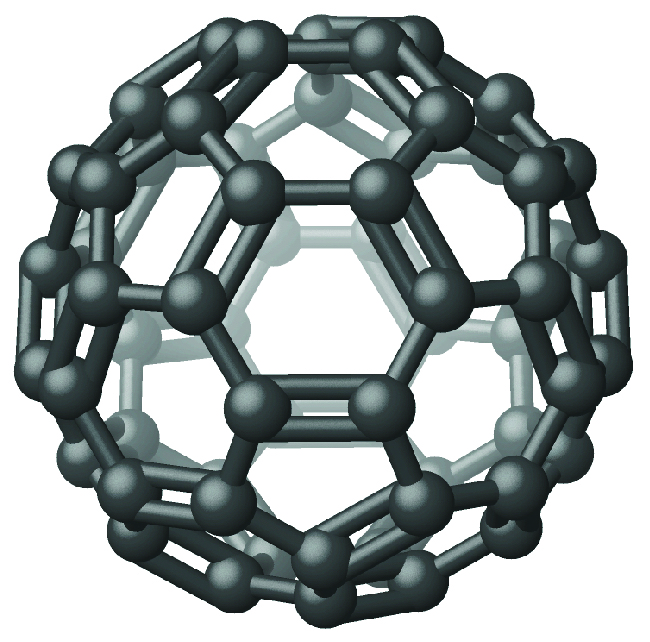

By the end of this section, you will be able to:
* Describe structure and properties of nonmetals

The nonmetals are elements located in the upper right portion of the periodic table. Their properties and behavior are quite different from those of metals on the left side. Under normal conditions, more than half of the nonmetals are gases, one is a liquid, and the rest include some of the softest and hardest of solids. The nonmetals exhibit a rich variety of chemical behaviors. They include the most reactive and least reactive of elements, and they form many different ionic and covalent compounds. This section presents an overview of the properties and chemical behaviors of the nonmetals, as well as the chemistry of specific elements. Many of these nonmetals are important in biological systems.

In many cases, trends in electronegativity enable us to predict the type of bonding and the physical states in compounds involving the nonmetals. We know that electronegativity decreases as we move down a given group and increases as we move from left to right across a period. The nonmetals have higher electronegativities than do metals, and compounds formed between metals and nonmetals are generally ionic in nature because of the large differences in electronegativity between them. The metals form cations, the nonmetals form anions, and the resulting compounds are solids under normal conditions. On the other hand, compounds formed between two or more nonmetals have small differences in electronegativity between the atoms, and covalent bonding—sharing of electrons—results. These substances tend to be molecular in nature and are gases, liquids, or volatile solids at room temperature and pressure.

In normal chemical processes, nonmetals do not form monatomic positive ions (cations) because their ionization energies are too high. All monatomic nonmetal ions are anions; examples include the chloride ion, Cl−, the nitride ion, N3−, and the selenide ion, Se2−.

The common oxidation states that the nonmetals exhibit in their ionic and covalent compounds are shown in [\[link\]](#CNX_Chem_18_04_OxStNonmts). Remember that an element exhibits a positive oxidation state when combined with a more electronegative element and that it exhibits a negative oxidation state when combined with a less electronegative element.

 ![Six columns of information are shown. The first column has three pieces of data: &#x201C;H,&#x201D; &#x201C;1 positive sign,&#x201D; and &#x201C;1 negative sign.&#x201D; The second column has four pieces of data: &#x201C;C,&#x201D; &#x201C;4 positive sign,&#x201D; the word, &#x201C;To,&#x201D; and, &#x201C;4 negative sign.&#x201D; The third column has eight pieces of data: &#x201C;N,&#x201D; &#x201C;5 positive sign,&#x201D; the word, &#x201C;To,&#x201D; &#x201C;3 negative sign,&#x201D; &#x201C;P, A s,&#x201D; &#x201C;5 positive sign,&#x201D; &#x201C;3 positive sign,&#x201D; and &#x201C;3 negative sign.&#x201D; The fourth column has seven pieces of data: &#x201C;O,&#x201D; &#x201C;1 negative sign,&#x201D; &#x201C;2 negative sign,&#x201D; &#x201C;S, S e,&#x201D; &#x201C;6 positive sign,&#x201D; &#x201C;4 positive sign,&#x201D; and &#x201C;2 negative sign.&#x201D; The fifth column has eight pieces of data: &#x201C;F,&#x201D; &#x201C;1 negative sign,&#x201D; &#x201C;C l, B r, I,&#x201D; &#x201C;7 positive sign,&#x201D; &#x201C;5 positive sign,&#x201D; &#x201C;3 positive sign,&#x201D; &#x201C;1 positive sign,&#x201D; and &#x201C;1 negative sign.&#x201D; The sixth column has five pieces of data: &#x201C;X e,&#x201D; &#x201C;8 positive sign,&#x201D; &#x201C;6 positive sign,&#x201D; &#x201C;4 positive sign,&#x201D; and &#x201C;2 positive sign.&#x201D;](../resources/CNX_Chem_18_04_OxStNonmts.jpg "Nonmetals exhibit these common oxidation states in ionic and covalent compounds."){: #CNX_Chem_18_04_OxStNonmts}

The first member of each nonmetal group exhibits different behaviors, in many respects, from the other group members. The reasons for this include smaller size, greater ionization energy, and (most important) the fact that the first member of each group has only four valence orbitals (one 2*s* and three 2*p*) available for bonding, whereas other group members have empty *d* orbitals in their valence shells, making possible five, six, or even more bonds around the central atom. For example, nitrogen forms only NF3, whereas phosphorus forms both PF3 and PF5.

Another difference between the first group member and subsequent members is the greater ability of the first member to form *π* bonds. This is primarily a function of the smaller size of the first member of each group, which allows better overlap of atomic orbitals. Nonmetals, other than the first member of each group, rarely form π bonds to nonmetals that are the first member of a group. For example, sulfur-oxygen π bonds are well known, whereas sulfur does not normally form stable π bonds to itself.

The variety of oxidation states displayed by most of the nonmetals means that many of their chemical reactions involve changes in oxidation state through oxidation-reduction reactions. There are five general aspects of the oxidation-reduction chemistry:

1.  Nonmetals oxidize most metals. The oxidation state of the metal becomes positive as it undergoes oxidation and that of the nonmetal becomes negative as it undergoes reduction. For example:
    * * *
    {: data-type="newline"}
    
    

    <math xmlns="http://www.w3.org/1998/Math/MathML"><mrow><mtable><mtr><mtd columnalign="left"><mrow><mtext>4Fe</mtext><mo stretchy="false">(</mo><mi>s</mi><mo stretchy="false">)</mo><mo>+</mo></mrow></mtd><mtd columnalign="left"><mrow><msub><mrow><mtext>3O</mtext></mrow><mn>2</mn></msub><mo stretchy="false">(</mo><mi>g</mi><mo stretchy="false">)</mo></mrow></mtd><mtd columnalign="left"><mo stretchy="false">⟶</mo></mtd><mtd columnalign="left"><mrow><msub><mrow><mtext>2Fe</mtext></mrow><mn>2</mn></msub><msub><mtext>O</mtext><mn>3</mn></msub><mo stretchy="false">(</mo><mi>s</mi><mo stretchy="false">)</mo></mrow></mtd></mtr><mtr><mtd columnalign="left"><mspace width="0.8em" /><mn>0</mn></mtd><mtd columnalign="left"><mspace width="0.6em" /><mn>0</mn></mtd><mtd /><mtd columnalign="left"><mrow><mn>+3</mn><mspace width="0.5em" /><mn>−2</mn></mrow></mtd></mtr></mtable></mrow></math>
    

2.  With the exception of nitrogen and carbon, which are poor oxidizing agents, a more electronegative nonmetal oxidizes a less electronegative nonmetal or the anion of the nonmetal:
    * * *
    {: data-type="newline"}
    
    

    <math xmlns="http://www.w3.org/1998/Math/MathML"><mrow><mtable><mtr><mtd columnalign="left"><mrow><mtext>S</mtext><mo stretchy="false">(</mo><mi>s</mi><mo stretchy="false">)</mo><mo>+</mo></mrow></mtd><mtd columnalign="left"><mrow><msub><mrow><mtext>O</mtext></mrow><mn>2</mn></msub><mo stretchy="false">(</mo><mi>g</mi><mo stretchy="false">)</mo></mrow></mtd><mtd columnalign="left"><mo stretchy="false">⟶</mo></mtd><mtd columnalign="left"><mrow><msub><mrow><mtext>2SO</mtext></mrow><mn>2</mn></msub><mo stretchy="false">(</mo><mi>s</mi><mo stretchy="false">)</mo></mrow></mtd></mtr><mtr><mtd columnalign="left"><mn>0</mn></mtd><mtd columnalign="left"><mspace width="0.2em" /><mn>0</mn></mtd><mtd /><mtd columnalign="left"><mrow><mn>+4</mn><mspace width="1em" /><mn>−2</mn></mrow></mtd></mtr></mtable></mrow></math>
    

    
    

    <math xmlns="http://www.w3.org/1998/Math/MathML"><mrow><mtable><mtr><mtd columnalign="left"><mrow><msub><mrow><mtext>Cl</mtext></mrow><mn>2</mn></msub><mo stretchy="false">(</mo><mi>g</mi><mo stretchy="false">)</mo><mo>+</mo></mrow></mtd><mtd columnalign="left"><mrow><msup><mrow><mtext>2I</mtext></mrow><mn>−</mn></msup><mo stretchy="false">(</mo><mi>a</mi><mi>q</mi><mo stretchy="false">)</mo></mrow></mtd><mtd columnalign="left"><mo stretchy="false">⟶</mo></mtd><mtd columnalign="left"><mrow><msub><mrow><mtext>I</mtext></mrow><mn>2</mn></msub><mo stretchy="false">(</mo><mi>s</mi><mo stretchy="false">)</mo><mo>+</mo><msup><mrow><mtext>2Cl</mtext></mrow><mn>−</mn></msup><mo stretchy="false">(</mo><mi>a</mi><mi>q</mi><mo stretchy="false">)</mo></mrow></mtd></mtr><mtr><mtd columnalign="left"><mspace width="0.2em" /><mn>0</mn></mtd><mtd /><mtd /><mtd columnalign="left"><mn>0</mn></mtd></mtr></mtable></mrow></math>
    

3.  Fluorine and oxygen are the strongest oxidizing agents within their respective groups; each oxidizes all the elements that lie below it in the group. Within any period, the strongest oxidizing agent is in group 17. A nonmetal often oxidizes an element that lies to its left in the same period. For example:
    * * *
    {: data-type="newline"}
    
    

    <math xmlns="http://www.w3.org/1998/Math/MathML"><mrow><mtable><mtr><mtd columnalign="left"><mrow><mtext>2As</mtext><mo stretchy="false">(</mo><mi>s</mi><mo stretchy="false">)</mo><mo>+</mo></mrow></mtd><mtd columnalign="left"><mrow><msub><mrow><mtext>3Br</mtext></mrow><mn>2</mn></msub><mo stretchy="false">(</mo><mi>l</mi><mo stretchy="false">)</mo></mrow></mtd><mtd columnalign="left"><mo stretchy="false">⟶</mo></mtd><mtd columnalign="left"><mrow><msub><mrow><mtext>2AsBr</mtext></mrow><mn>3</mn></msub><mo stretchy="false">(</mo><mi>s</mi><mo stretchy="false">)</mo></mrow></mtd></mtr><mtr><mtd columnalign="left"><mn>0</mn></mtd><mtd columnalign="left"><mn>0</mn></mtd><mtd /><mtd columnalign="left"><mrow><mn>+3</mn><mspace width="0.2em" /><mn>−1</mn></mrow></mtd></mtr></mtable></mrow></math>
    

4.  The stronger a nonmetal is as an oxidizing agent, the more difficult it is to oxidize the anion formed by the nonmetal. This means that the most stable negative ions are formed by elements at the top of the group or in group 17 of the period.
5.  Fluorine and oxygen are the strongest oxidizing elements known. Fluorine does not form compounds in which it exhibits positive oxidation states; oxygen exhibits a positive oxidation state only when combined with fluorine. For example:
    * * *
    {: data-type="newline"}
    
    

    <math xmlns="http://www.w3.org/1998/Math/MathML"><mrow><mtable><mtr><mtd columnalign="left"><mrow><msub><mrow><mtext>2F</mtext></mrow><mn>2</mn></msub><mo stretchy="false">(</mo><mi>g</mi><mo stretchy="false">)</mo><mo>+</mo></mrow></mtd><mtd columnalign="left"><mrow><msup><mrow><mtext>2OH</mtext></mrow><mn>−</mn></msup><mo stretchy="false">(</mo><mi>a</mi><mi>q</mi><mo stretchy="false">)</mo></mrow></mtd><mtd columnalign="left"><mo stretchy="false">⟶</mo></mtd><mtd columnalign="left"><mrow><msub><mrow><mtext>OF</mtext></mrow><mn>2</mn></msub><mo stretchy="false">(</mo><mi>g</mi><mo stretchy="false">)</mo><mo>+</mo><msup><mrow><mtext>2F</mtext></mrow><mn>−</mn></msup><mo stretchy="false">(</mo><mi>a</mi><mi>q</mi><mo stretchy="false">)</mo><mo>+</mo><msub><mrow><mtext>H</mtext></mrow><mn>2</mn></msub><mrow><mtext>O</mtext></mrow><mo stretchy="false">(</mo><mi>l</mi><mo stretchy="false">)</mo></mrow></mtd></mtr><mtr><mtd columnalign="left"><mn>0</mn></mtd><mtd /><mtd /><mtd columnalign="left"><mrow><mn>+2</mn><mspace width="2.5em" /><mn>−1</mn></mrow></mtd></mtr></mtable></mrow></math>
    

{: data-number-style="arabic"}

With the exception of most of the noble gases, all nonmetals form compounds with oxygen, yielding covalent oxides. Most of these oxides are acidic, that is, they react with water to form oxyacids. Recall from the acid-base chapter that an oxyacid is an acid consisting of hydrogen, oxygen, and some other element. Notable exceptions are carbon monoxide, CO, nitrous oxide, N2O, and nitric oxide, NO. There are three characteristics of these acidic oxides:

1.  Oxides such as SO2 and N2O5, in which the nonmetal exhibits one of its common oxidation states, are **acid anhydrides**{: data-type="term"} and react with water to form acids with no change in oxidation state. The product is an oxyacid. For example:
    * * *
    {: data-type="newline"}
    
    

    <math xmlns="http://www.w3.org/1998/Math/MathML"><mrow><msub><mrow><mtext>SO</mtext></mrow><mn>2</mn></msub><mo stretchy="false">(</mo><mi>g</mi><mo stretchy="false">)</mo><mo>+</mo><msub><mtext>H</mtext><mn>2</mn></msub><mtext>O</mtext><mo stretchy="false">(</mo><mi>l</mi><mo stretchy="false">)</mo><mspace width="0.2em" /><mo stretchy="false">⟶</mo><mspace width="0.2em" /><msub><mtext>H</mtext><mn>2</mn></msub><msub><mrow><mtext>SO</mtext></mrow><mn>3</mn></msub><mo stretchy="false">(</mo><mi>a</mi><mi>q</mi><mo stretchy="false">)</mo></mrow></math>
    

    
    

    <math xmlns="http://www.w3.org/1998/Math/MathML"><mrow><msub><mtext>N</mtext><mn>2</mn></msub><msub><mtext>O</mtext><mn>5</mn></msub><mo stretchy="false">(</mo><mi>s</mi><mo stretchy="false">)</mo><mo>+</mo><msub><mtext>H</mtext><mn>2</mn></msub><mtext>O</mtext><mo stretchy="false">(</mo><mi>l</mi><mo stretchy="false">)</mo><mspace width="0.2em" /><mo stretchy="false">⟶</mo><mspace width="0.2em" /><msub><mrow><mtext>2HNO</mtext></mrow><mn>3</mn></msub><mo stretchy="false">(</mo><mi>a</mi><mi>q</mi><mo stretchy="false">)</mo></mrow></math>
    

2.  Those oxides such as NO2 and ClO2, in which the nonmetal does not exhibit one of its common oxidation states, also react with water. In these reactions, the nonmetal is both oxidized and reduced. For example:
    * * *
    {: data-type="newline"}
    
    

    <math xmlns="http://www.w3.org/1998/Math/MathML"><mrow><mtable><mtr><mtd columnalign="left"><mrow><msub><mrow><mtext>3NO</mtext></mrow><mn>2</mn></msub><mo stretchy="false">(</mo><mi>g</mi><mo stretchy="false">)</mo><mo>+</mo></mrow></mtd><mtd columnalign="left"><mrow><msub><mrow><mtext>H</mtext></mrow><mn>2</mn></msub><mrow><mtext>O</mtext></mrow><mo stretchy="false">(</mo><mi>l</mi><mo stretchy="false">)</mo></mrow></mtd><mtd columnalign="left"><mo stretchy="false">⟶</mo></mtd><mtd columnalign="left"><mrow><msub><mrow><mtext>2HNO</mtext></mrow><mn>3</mn></msub><mo stretchy="false">(</mo><mi>a</mi><mi>q</mi><mo stretchy="false">)</mo><mo>+</mo></mrow></mtd><mtd columnalign="left"><mrow><mtext>NO</mtext></mrow><mo stretchy="false">(</mo><mi>g</mi><mo stretchy="false">)</mo></mtd></mtr><mtr><mtd columnalign="left"><mn>+4</mn></mtd><mtd /><mtd /><mtd columnalign="left"><mrow><mn>+5</mn></mrow></mtd><mtd columnalign="left"><mrow><mn>+2</mn></mrow></mtd></mtr></mtable></mrow></math>
    

    
    * * *
    {: data-type="newline"}
    
    Reactions in which the same element is both oxidized and reduced are called **disproportionation reactions**{: data-type="term"}.
3.  The acid strength increases as the electronegativity of the central atom increases. To learn more, see the discussion in the chapter on acid-base chemistry.
{: data-number-style="arabic"}

The binary hydrogen compounds of the nonmetals also exhibit an acidic behavior in water, although only HCl, HBr, and HI are strong acids. The acid strength of the nonmetal hydrogen compounds increases from left to right across a period and down a group. For example, ammonia, NH3, is a weaker acid than is water, H2O, which is weaker than is hydrogen fluoride, HF. Water, H2O, is also a weaker acid than is hydrogen sulfide, H2S, which is weaker than is hydrogen selenide, H2Se. Weaker acidic character implies greater basic character.

# Structures of the Nonmetals

The structures of the nonmetals differ dramatically from those of metals. Metals crystallize in closely packed arrays that do not contain molecules or covalent bonds. Nonmetal structures contain covalent bonds, and many nonmetals consist of individual molecules. The electrons in nonmetals are localized in covalent bonds, whereas in a metal, there is delocalization of the electrons throughout the solid.

The noble gases are all monatomic, whereas the other nonmetal gases—hydrogen, nitrogen, oxygen, fluorine, and chlorine—normally exist as the diatomic molecules H2, N2, O2, F2, and Cl2. The other halogens are also diatomic; Br2 is a liquid and I2 exists as a solid under normal conditions. The changes in state as one moves down the halogen family offer excellent examples of the increasing strength of intermolecular London forces with increasing molecular mass and increasing polarizability.

Oxygen has two allotropes: O2, dioxygen, and O3, ozone. Phosphorus has three common allotropes, commonly referred to by their colors: white, red, and black. Sulfur has several allotropes. There are also many carbon allotropes. Most people know of diamond, graphite, and charcoal, but fewer people know of the recent discovery of fullerenes, carbon nanotubes, and graphene.

Descriptions of the physical properties of three nonmetals that are characteristic of molecular solids follow.

# Carbon

Carbon occurs in the uncombined (elemental) state in many forms, such as diamond, graphite, charcoal, coke, carbon black, graphene, and fullerene.

Diamond, shown in [\[link\]](#CNX_Chem_18_04_Carbonform), is a very hard crystalline material that is colorless and transparent when pure. Each atom forms four single bonds to four other atoms at the corners of a tetrahedron (*sp*3 hybridization); this makes the diamond a giant molecule. Carbon-carbon single bonds are very strong, and, because they extend throughout the crystal to form a three-dimensional network, the crystals are very hard and have high melting points (~4400 °C).

 Diamond and (b) graphite are two forms of carbon. (c) In the crystal structure of diamond, the covalent bonds form three-dimensional tetrahedrons. (d) In the crystal structure of graphite, each planar layer is composed of six-membered rings. (credit a: modification of work by &#x201C;Fancy Diamonds&#x201D;/Flickr; credit b: modification of work from http://images-of-elements.com/carbon.php)"){: #CNX_Chem_18_04_Carbonform}

Graphite, also shown in [\[link\]](#CNX_Chem_18_04_Carbonform), is a soft, slippery, grayish-black solid that conducts electricity. These properties relate to its structure, which consists of layers of carbon atoms, with each atom surrounded by three other carbon atoms in a trigonal planar arrangement. Each carbon atom in graphite forms three σ bonds, one to each of its nearest neighbors, by means of *sp*2-hybrid orbitals. The unhybridized *p* orbital on each carbon atom will overlap unhybridized orbitals on adjacent carbon atoms in the same layer to form π bonds. Many resonance forms are necessary to describe the electronic structure of a graphite layer; [\[link\]](#CNX_Chem_18_04_unhyporbC) illustrates two of these forms.

 Carbon atoms in graphite have unhybridized p orbitals. Each p orbital is perpendicular to the plane of carbon atoms. (b) These are two of the many resonance forms of graphite necessary to describe its electronic structure as a resonance hybrid."){: #CNX_Chem_18_04_unhyporbC}

Atoms within a graphite layer are bonded together tightly by the σ and π bonds; however, the forces between layers are weak. London dispersion forces hold the layers together. To learn more, see the discussion of these weak forces in the chapter on liquids and solids. The weak forces between layers give graphite the soft, flaky character that makes it useful as the so-called “lead” in pencils and the slippery character that makes it useful as a lubricant. The loosely held electrons in the resonating π bonds can move throughout the solid and are responsible for the electrical conductivity of graphite.

Other forms of elemental carbon include carbon black, charcoal, and coke. Carbon black is an amorphous form of carbon prepared by the incomplete combustion of natural gas, CH4. It is possible to produce charcoal and coke by heating wood and coal, respectively, at high temperatures in the absence of air.

Recently, new forms of elemental carbon molecules have been identified in the soot generated by a smoky flame and in the vapor produced when graphite is heated to very high temperatures in a vacuum or in helium. One of these new forms, first isolated by Professor Richard **Smalley**{: data-type="term" .no-emphasis} and coworkers at Rice University, consists of icosahedral (soccer-ball-shaped) molecules that contain 60 carbon atoms, C60. This is buckminsterfullerene (often called bucky balls) after the architect Buckminster **Fuller**{: data-type="term" .no-emphasis}, who designed domed structures, which have a similar appearance ([\[link\]](#CNX_Chem_18_04_Buckyball)).

 {: #CNX_Chem_18_04_Buckyball}

Nanotubes and Graphene

Graphene and carbon nanotubes are two recently discovered allotropes of carbon. Both of the forms bear some relationship to graphite. Graphene is a single layer of graphite (one atom thick), as illustrated in [\[link\]](#CNX_Chem_18_04_Nanotube), whereas carbon nanotubes roll the layer into a small tube, as illustrated in [\[link\]](#CNX_Chem_18_04_Nanotube).

 Graphene and (b) carbon nanotubes are both allotropes of carbon."){: #CNX_Chem_18_04_Nanotube}

Graphene is a very strong, lightweight, and efficient conductor of heat and electricity discovered in 2003. As in graphite, the carbon atoms form a layer of six-membered rings with *sp*2-hybridized carbon atoms at the corners. Resonance stabilizes the system and leads to its conductivity. Unlike graphite, there is no stacking of the layers to give a three-dimensional structure. Andre **Geim**{: data-type="term" .no-emphasis} and Kostya **Novoselov**{: data-type="term" .no-emphasis} at the University of Manchester won the 2010 Nobel Prize in Physics for their pioneering work characterizing graphene.

The simplest procedure for preparing graphene is to use a piece of adhesive tape to remove a single layer of graphene from the surface of a piece of graphite. This method works because there are only weak London dispersion forces between the layers in graphite. Alternative methods are to deposit a single layer of carbon atoms on the surface of some other material (ruthenium, iridium, or copper) or to synthesize it at the surface of silicon carbide via the sublimation of silicon.

There currently are no commercial applications of graphene. However, its unusual properties, such as high electron mobility and thermal conductivity, should make it suitable for the manufacture of many advanced electronic devices and for thermal management applications.

Carbon nanotubes are carbon allotropes, which have a cylindrical structure. Like graphite and graphene, nanotubes consist of rings of *sp*2-hybridized carbon atoms. Unlike graphite and graphene, which occur in layers, the layers wrap into a tube and bond together to produce a stable structure. The walls of the tube may be one atom or multiple atoms thick.

Carbon nanotubes are extremely strong materials that are harder than diamond. Depending upon the shape of the nanotube, it may be a conductor or semiconductor. For some applications, the conducting form is preferable, whereas other applications utilize the semiconducting form.

The basis for the synthesis of carbon nanotubes is the generation of carbon atoms in a vacuum. It is possible to produce carbon atoms by an electrical discharge through graphite, vaporization of graphite with a laser, and the decomposition of a carbon compound.

The strength of carbon nanotubes will eventually lead to some of their most exciting applications, as a thread produced from several nanotubes will support enormous weight. However, the current applications only employ bulk nanotubes. The addition of nanotubes to polymers improves the mechanical, thermal, and electrical properties of the bulk material. There are currently nanotubes in some bicycle parts, skis, baseball bats, fishing rods, and surfboards.

# Phosphorus

The name *phosphorus* comes from the Greek words meaning *light bringing.* When phosphorus was first isolated, scientists noted that it glowed in the dark and burned when exposed to air. Phosphorus is the only member of its group that does not occur in the uncombined state in nature; it exists in many allotropic forms. We will consider two of those forms: white phosphorus and red phosphorus.

White phosphorus is a white, waxy solid that melts at 44.2 °C and boils at 280 °C. It is insoluble in water (in which it is stored—see [\[link\]](#CNX_Chem_18_04_Phosphorus)), is very soluble in carbon disulfide, and bursts into flame in air. As a solid, as a liquid, as a gas, and in solution, white phosphorus exists as P4 molecules with four phosphorus atoms at the corners of a regular tetrahedron, as illustrated in [\[link\]](#CNX_Chem_18_04_Phosphorus). Each phosphorus atom covalently bonds to the other three atoms in the molecule by single covalent bonds. White phosphorus is the most reactive allotrope and is very toxic.

  Because white phosphorus bursts into flame in air, it is stored in water. (b) The structure of white phosphorus consists of P4 molecules arranged in a tetrahedron. (c) Red phosphorus is much less reactive than is white phosphorus. (d) The structure of red phosphorus consists of networks of P4 tetrahedra joined by P-P single bonds. (credit a: modification of work from http://images-of-elements.com/phosphorus.php)"){: #CNX_Chem_18_04_Phosphorus}

Heating white phosphorus to 270–300 °C in the absence of air yields red phosphorus. Red phosphorus (shown in [\[link\]](#CNX_Chem_18_04_Phosphorus)) is denser, has a higher melting point (~600 °C), is much less reactive, is essentially nontoxic, and is easier and safer to handle than is white phosphorus. Its structure is highly polymeric and appears to contain three-dimensional networks of P4 tetrahedra joined by P-P single bonds. Red phosphorus is insoluble in solvents that dissolve white phosphorus. When red phosphorus is heated, P4 molecules sublime from the solid.

# Sulfur

The allotropy of sulfur is far greater and more complex than that of any other element. Sulfur is the brimstone referred to in the Bible and other places, and references to sulfur occur throughout recorded history—right up to the relatively recent discovery that it is a component of the atmospheres of Venus and of Io, a moon of Jupiter. The most common and most stable allotrope of sulfur is yellow, rhombic sulfur, so named because of the shape of its crystals. Rhombic sulfur is the form to which all other allotropes revert at room temperature. Crystals of rhombic sulfur melt at 113 °C. Cooling this liquid gives long needles of monoclinic sulfur. This form is stable from 96 °C to the melting point, 119 °C. At room temperature, it gradually reverts to the rhombic form.

Both rhombic sulfur and monoclinic sulfur contain S8 molecules in which atoms form eight-membered, puckered rings that resemble crowns, as illustrated in [\[link\]](#CNX_Chem_18_04_Sulfrchain). Each sulfur atom is bonded to each of its two neighbors in the ring by covalent S-S single bonds.

  individual S8 rings, (b) S8 chains formed when the rings open, (c) longer chains formed by adding sulfur atoms to S8 chains, and (d) part of the very long sulfur chains formed at higher temperatures."){: #CNX_Chem_18_04_Sulfrchain}

When rhombic sulfur melts, the straw-colored liquid is quite mobile; its viscosity is low because S8 molecules are essentially spherical and offer relatively little resistance as they move past each other. As the temperature rises, S-S bonds in the rings break, and polymeric chains of sulfur atoms result. These chains combine end to end, forming still longer chains that tangle with one another. The liquid gradually darkens in color and becomes so viscous that finally (at about 230 °C) it does not pour easily. The dangling atoms at the ends of the chains of sulfur atoms are responsible for the dark red color because their electronic structure differs from those of sulfur atoms that have bonds to two adjacent sulfur atoms. This causes them to absorb light differently and results in a different visible color. Cooling the liquid rapidly produces a rubberlike amorphous mass, called plastic sulfur.

Sulfur boils at 445 °C and forms a vapor consisting of S2, S6, and S8 molecules; at about 1000 °C, the vapor density corresponds to the formula S2, which is a paramagnetic molecule like O2 with a similar electronic structure and a weak sulfur-sulfur double bond.

As seen in this discussion, an important feature of the structural behavior of the nonmetals is that the elements usually occur with eight electrons in their valence shells. If necessary, the elements form enough covalent bonds to supplement the electrons already present to possess an octet. For example, members of group 15 have five valence electrons and require only three additional electrons to fill their valence shells. These elements form three covalent bonds in their free state: triple bonds in the N2 molecule or single bonds to three different atoms in arsenic and phosphorus. The elements of group 16 require only two additional electrons. Oxygen forms a double bond in the O2 molecule, and sulfur, selenium, and tellurium form two single bonds in various rings and chains. The halogens form diatomic molecules in which each atom is involved in only one bond. This provides the electron required necessary to complete the octet on the halogen atom. The noble gases do not form covalent bonds to other noble gas atoms because they already have a filled outer shell.

# Key Concepts and Summary

Nonmetals have structures that are very different from those of the metals, primarily because they have greater electronegativity and electrons that are more tightly bound to individual atoms. Most nonmetal oxides are acid anhydrides, meaning that they react with water to form acidic solutions. Molecular structures are common for most of the nonmetals, and several have multiple allotropes with varying physical properties.

# Chemistry End of Chapter Exercises

Carbon forms a number of allotropes, two of which are graphite and diamond. Silicon has a diamond structure. Why is there no allotrope of silicon with a graphite structure?

Nitrogen in the atmosphere exists as very stable diatomic molecules. Why does phosphorus form less stable P4 molecules instead of P2 molecules?

In the N2 molecule, the nitrogen atoms have an σ bond and two π bonds holding the two atoms together. The presence of three strong bonds makes N2 a very stable molecule. Phosphorus is a third-period element, and as such, does not form π bonds efficiently; therefore, it must fulfill its bonding requirement by forming three σ bonds.

Write balanced chemical equations for the reaction of the following acid anhydrides with water:

(a) SO3

(b) N2O3

(c) Cl2O7

(d) P4O10

(e) NO2

Determine the oxidation number of each element in each of the following compounds:

(a) HCN

(b) OF2

(c) AsCl3

(a) H = 1+, C = 2+, and N = 3−; (b) O = 2+ and F = 1−; (c) As = 3+ and Cl = 1−

Determine the oxidation state of sulfur in each of the following:

(a) SO3

(b) SO2

(c) <math xmlns="http://www.w3.org/1998/Math/MathML"><mrow><msub><mrow><mtext>SO</mtext></mrow><mn>3</mn></msub><msup><mrow /><mrow><mn>2−</mn></mrow></msup></mrow></math>

Arrange the following in order of increasing electronegativity: F; Cl; O; and S.

S &lt; Cl &lt; O &lt; F

Why does white phosphorus consist of tetrahedral P4 molecules while nitrogen consists of diatomic N2 molecules?

## Glossary
{: data-type="glossary-title"}

acid anhydride
: compound that reacts with water to form an acid or acidic solution
{: .definition}

disproportionation reaction
: chemical reaction where a single reactant is simultaneously reduced and oxidized; it is both the reducing agent and the oxidizing agent
{: .definition}

