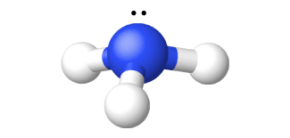

By the end of this section, you will be able to:
* Describe the properties, preparation, and compounds of hydrogen

Hydrogen is the most abundant element in the universe. The sun and other stars are composed largely of hydrogen. Astronomers estimate that 90% of the atoms in the universe are hydrogen atoms. Hydrogen is a component of more compounds than any other element. Water is the most abundant compound of hydrogen found on earth. Hydrogen is an important part of petroleum, many minerals, cellulose and starch, sugar, fats, oils, alcohols, acids, and thousands of other substances.

At ordinary temperatures, hydrogen is a colorless, odorless, tasteless, and nonpoisonous gas consisting of the diatomic molecule H2. Hydrogen is composed of three isotopes, and unlike other elements, these isotopes have different names and chemical symbols: protium, 1H, deuterium, 2H (or “D”), and tritium 3H (or “T”). In a naturally occurring sample of hydrogen, there is one atom of deuterium for every 7000 H atoms and one atom of radioactive tritium for every 1018 H atoms. The chemical properties of the different isotopes are very similar because they have identical electron structures, but they differ in some physical properties because of their differing atomic masses. Elemental deuterium and tritium have lower vapor pressure than ordinary hydrogen. Consequently, when liquid hydrogen evaporates, the heavier isotopes are concentrated in the last portions to evaporate. Electrolysis of heavy water, D2O, yields deuterium. Most tritium originates from nuclear reactions.

### Preparation of Hydrogen

Elemental hydrogen must be prepared from compounds by breaking chemical bonds. The most common methods of preparing hydrogen follow.

#### From Steam and Carbon or Hydrocarbons

Water is the cheapest and most abundant source of hydrogen. Passing steam over coke (an impure form of elemental carbon) at 1000 °C produces a mixture of carbon monoxide and hydrogen known as water gas:

<math xmlns="http://www.w3.org/1998/Math/MathML"><mrow><mtable><mtr><mtd><mrow><mtext>C</mtext><mo stretchy="false">(</mo><mi>s</mi><mo stretchy="false">)</mo><mo>+</mo><msub><mtext>H</mtext><mn>2</mn></msub><mtext>O</mtext><mo stretchy="false">(</mo><mi>g</mi><mo stretchy="false">)</mo><mspace width="0.2em" /><mover><mo>→</mo><mrow><mspace width="0.5em" /><mn>1000</mn><mspace width="0.2em" /><mtext>°C</mtext><mspace width="0.5em" /></mrow></mover></mrow></mtd><mtd><mtext>CO</mtext><mo stretchy="false">(</mo><mi>g</mi><mo stretchy="false">)</mo><mo>+</mo><msub><mtext>H</mtext><mn>2</mn></msub><mo stretchy="false">(</mo><mi>g</mi><mo stretchy="false">)</mo></mtd></mtr><mtr><mtd /><mtd columnalign="center"><mrow><mtext>water gas</mtext></mrow></mtd></mtr></mtable></mrow></math>

Water gas is as an industrial fuel. It is possible to produce additional hydrogen by mixing the water gas with steam in the presence of a catalyst to convert the CO to CO2. This reaction is the water gas shift reaction.

It is also possible to prepare a mixture of hydrogen and carbon monoxide by passing hydrocarbons from natural gas or petroleum and steam over a nickel-based catalyst. Propane is an example of a hydrocarbon reactant:

<math xmlns="http://www.w3.org/1998/Math/MathML"><mrow><msub><mtext>C</mtext><mn>3</mn></msub><msub><mtext>H</mtext><mn>8</mn></msub><mo stretchy="false">(</mo><mi>g</mi><mo stretchy="false">)</mo><mo>+</mo><mn>3</mn><msub><mtext>H</mtext><mn>2</mn></msub><mtext>O</mtext><mo stretchy="false">(</mo><mi>g</mi><mo stretchy="false">)</mo><mspace width="0.2em" /><munderover><mo>→</mo><mrow><mspace width="0.4em" /><mtext>catalyst</mtext><mspace width="0.2em" /></mrow><mrow><mn>900</mn><mspace width="0.2em" /><mtext>°C</mtext></mrow></munderover><mspace width="0.2em" /><mtext>3CO</mtext><mo stretchy="false">(</mo><mi>g</mi><mo stretchy="false">)</mo><mo>+</mo><mn>7</mn><msub><mtext>H</mtext><mn>2</mn></msub><mo stretchy="false">(</mo><mi>g</mi><mo stretchy="false">)</mo></mrow></math>

#### Electrolysis

Hydrogen forms when direct current electricity passes through water containing an electrolyte such as H2SO4, as illustrated in [\[link\]](#CNX_Chem_18_05_Electrolys). Bubbles of hydrogen form at the cathode, and oxygen evolves at the anode. The net reaction is:

<math xmlns="http://www.w3.org/1998/Math/MathML"><mrow><msub><mrow><mtext>2H</mtext></mrow><mn>2</mn></msub><mtext>O</mtext><mo stretchy="false">(</mo><mi>l</mi><mo stretchy="false">)</mo><mo>+</mo><mtext>electrical energy</mtext><mspace width="0.2em" /><mo stretchy="false">⟶</mo><mspace width="0.2em" /><msub><mrow><mtext>2H</mtext></mrow><mn>2</mn></msub><mo stretchy="false">(</mo><mi>g</mi><mo stretchy="false">)</mo><mo>+</mo><msub><mtext>O</mtext><mn>2</mn></msub><mo stretchy="false">(</mo><mi>g</mi><mo stretchy="false">)</mo></mrow></math>

 ![A diagram shows a beaker that contains a liquid, a battery submerged in the liquid, and two test tubes. The battery has the positive and negative terminals labeled. The liquid is connected by a right-facing arrow to an image of two molecules made up of one red atom and two white atoms. It is labeled, &#x201C;Water,&#x201D; and, &#x201C;2 H subscript 2 O ( l ).&#x201D; The left test tube above the negative sign is connected by a right-facing arrow to an image of two pairs of white atoms. The image is labeled, &#x201C;Hydrogen,&#x201D; and, &#x201C;2 H subscript 2 ( g ).&#x201D; The right test tube above the positive sign is connected by a right-facing arrow to an image of a pair of red atoms. The image is labeled, &#x201C;Oxygen,&#x201D; and, &#x201C;O subscript 2 ( g ).&#x201D;](../resources/CNX_Chem_18_05_Electrolys.jpg "The electrolysis of water produces hydrogen and oxygen. Because there are twice as many hydrogen atoms as oxygen atoms and both elements are diatomic, there is twice the volume of hydrogen produced at the cathode as there is oxygen produced at the anode."){: #CNX_Chem_18_05_Electrolys}

#### Reaction of Metals with Acids

This is the most convenient laboratory method of producing hydrogen. Metals with lower reduction potentials reduce the hydrogen ion in dilute acids to produce hydrogen gas and metal salts. For example, as shown in [\[link\]](#CNX_Chem_18_05_IronHCl), iron in dilute hydrochloric acid produces hydrogen gas and iron(II) chloride:

<math xmlns="http://www.w3.org/1998/Math/MathML"><mrow><mtext>Fe</mtext><mo stretchy="false">(</mo><mi>s</mi><mo stretchy="false">)</mo><mo>+</mo><msub><mrow><mtext>2H</mtext></mrow><mn>3</mn></msub><msup><mtext>O</mtext><mtext>+</mtext></msup><mo stretchy="false">(</mo><mi>a</mi><mi>q</mi><mo stretchy="false">)</mo><mo>+</mo><msup><mrow><mtext>2Cl</mtext></mrow><mtext>−</mtext></msup><mo stretchy="false">(</mo><mi>a</mi><mi>q</mi><mo stretchy="false">)</mo><mspace width="0.2em" /><mo stretchy="false">⟶</mo><mspace width="0.2em" /><msup><mrow><mtext>Fe</mtext></mrow><mrow><mn>2+</mn></mrow></msup><mo stretchy="false">(</mo><mi>a</mi><mi>q</mi><mo stretchy="false">)</mo><mo>+</mo><msup><mrow><mtext>2Cl</mtext></mrow><mtext>−</mtext></msup><mo stretchy="false">(</mo><mi>a</mi><mi>q</mi><mo stretchy="false">)</mo><mo>+</mo><msub><mtext>H</mtext><mn>2</mn></msub><mo stretchy="false">(</mo><mi>g</mi><mo stretchy="false">)</mo><mo>+</mo><msub><mrow><mtext>2H</mtext></mrow><mn>2</mn></msub><mtext>O</mtext><mo stretchy="false">(</mo><mi>l</mi><mo stretchy="false">)</mo></mrow></math>

 "){: #CNX_Chem_18_05_IronHCl}

#### Reaction of Ionic Metal Hydrides with Water

It is possible to produce hydrogen from the reaction of hydrides of the active metals, which contain the very strongly basic H− anion, with water:

<math xmlns="http://www.w3.org/1998/Math/MathML"><mrow><msub><mrow><mtext>CaH</mtext></mrow><mn>2</mn></msub><mo stretchy="false">(</mo><mi>s</mi><mo stretchy="false">)</mo><mo>+</mo><msub><mrow><mtext>2H</mtext></mrow><mn>2</mn></msub><mtext>O</mtext><mo stretchy="false">(</mo><mi>l</mi><mo stretchy="false">)</mo><mspace width="0.2em" /><mo stretchy="false">⟶</mo><mspace width="0.2em" /><msup><mrow><mtext>Ca</mtext></mrow><mrow><mn>2+</mn></mrow></msup><mo stretchy="false">(</mo><mi>a</mi><mi>q</mi><mo stretchy="false">)</mo><mo>+</mo><msup><mrow><mtext>2OH</mtext></mrow><mtext>−</mtext></msup><mo stretchy="false">(</mo><mi>a</mi><mi>q</mi><mo stretchy="false">)</mo><mo>+</mo><msub><mrow><mtext>2H</mtext></mrow><mn>2</mn></msub><mo stretchy="false">(</mo><mi>g</mi><mo stretchy="false">)</mo></mrow></math>

Metal hydrides are expensive but convenient sources of hydrogen, especially where space and weight are important factors. They are important in the inflation of life jackets, life rafts, and military balloons.

### Reactions

Under normal conditions, hydrogen is relatively inactive chemically, but when heated, it enters into many chemical reactions.

Two thirds of the world’s hydrogen production is devoted to the manufacture of ammonia, which is a fertilizer and used in the manufacture of nitric acid. Large quantities of hydrogen are also important in the process of **hydrogenation**{: data-type="term"}, discussed in the chapter on organic chemistry.

It is possible to use hydrogen as a nonpolluting fuel. The reaction of hydrogen with oxygen is a very exothermic reaction, releasing 286 kJ of energy per mole of water formed. Hydrogen burns without explosion under controlled conditions. The oxygen-hydrogen torch, because of the high heat of combustion of hydrogen, can achieve temperatures up to 2800 °C. The hot flame of this torch is useful in cutting thick sheets of many metals. Liquid hydrogen is also an important rocket fuel ([\[link\]](#CNX_Chem_18_05_LiqHliqO)).

 "){: #CNX_Chem_18_05_LiqHliqO}

An uncombined hydrogen atom consists of a nucleus and one valence electron in the 1*s* orbital. The *n* = 1 valence shell has a capacity for two electrons, and hydrogen can rightfully occupy two locations in the periodic table. It is possible to consider hydrogen a group 1 element because hydrogen can lose an electron to form the cation, H+. It is also possible to consider hydrogen to be a group 17 element because it needs only one electron to fill its valence orbital to form a hydride ion, H−, or it can share an electron to form a single, covalent bond. In reality, hydrogen is a unique element that almost deserves its own location in the periodic table.

#### Reactions with Elements

When heated, hydrogen reacts with the metals of group 1 and with Ca, Sr, and Ba (the more active metals in group 2). The compounds formed are crystalline, ionic hydrides that contain the hydride anion, H−, a strong reducing agent and a strong base, which reacts vigorously with water and other acids to form hydrogen gas.

The reactions of hydrogen with nonmetals generally produce *acidic* hydrogen compounds with hydrogen in the 1+ oxidation state. The reactions become more exothermic and vigorous as the electronegativity of the nonmetal increases. Hydrogen reacts with nitrogen and sulfur only when heated, but it reacts explosively with fluorine (forming HF) and, under some conditions, with chlorine (forming HCl). A mixture of hydrogen and oxygen explodes if ignited. Because of the explosive nature of the reaction, it is necessary to exercise caution when handling hydrogen (or any other combustible gas) to avoid the formation of an explosive mixture in a confined space. Although most hydrides of the nonmetals are acidic, ammonia and phosphine (PH3) are very, very weak acids and generally function as bases. There is a summary of these reactions of hydrogen with the elements in [\[link\]](#fs-idp87200896).

<table summary="This table has two columns and seven rows. The first row is a header row and it labels each column, &#x201C;General Equation&#x201D; and &#x201C;Comments.&#x201D; Under the &#x201C;General Equation&#x201D; column are the following equations: M H or M H subscript 2 yields M O H or M ( O H ) subscript 2 plus H subscript 2; H subscript 2 plus C yields ( no reaction ); 2 H subscript 2 plus N subscript 2 yields 2 N H subscript 3; 2 H subscript 2 plus O subscript 2 yields 2 H subscript 2 O; H subscript 2 plus S yields H subscript 2 S; and H subscript 2 plus X subscript 2 yields 2 H X. Under the &#x201C;Comments&#x201D; column are the following: &#x201C;ionic hydrides with group 1 and C a, S r, and B a,&#x201D; nothing, &#x201C;requires high pressure and temperature; low yield,&#x201D; &#x201C;exothermic and potentially explosive,&#x201D; &#x201C;requires heating; low yield,&#x201D; and &#x201C;X equals F, C l, B r, and I; explosive with F subscript 2; low yield with I subscript 2.&#x201D;" class="span-all"><thead>
<tr>
<th colspan="2" data-align="center">Chemical Reactions of Hydrogen with Other Elements</th>
</tr>
<tr valign="top">
<th data-align="left">General Equation</th>
<th data-align="left">Comments</th>
</tr>
</thead><tbody>
<tr valign="top">
<td data-align="left"><math xmlns="http://www.w3.org/1998/Math/MathML"><mrow><msub><mrow><mtext>MH or MH</mtext></mrow><mn>2</mn></msub><mspace width="0.2em" /><mo stretchy="false">⟶</mo><mspace width="0.2em" /><mtext>MOH or M</mtext><msub><mrow><mo stretchy="false">(</mo><mtext>OH</mtext><mo stretchy="false">)</mo></mrow><mn>2</mn></msub><mo>+</mo><msub><mtext>H</mtext><mn>2</mn></msub></mrow></math></td>
<td data-align="left">ionic hydrides with group 1 and Ca, Sr, and Ba</td>
</tr>
<tr valign="top">
<td data-align="left"><math xmlns="http://www.w3.org/1998/Math/MathML"><mrow><msub><mtext>H</mtext><mn>2</mn></msub><mo>+</mo><mtext>C</mtext><mspace width="0.2em" /><mo stretchy="false">⟶</mo><mspace width="0.2em" /><mrow><mtext>(no reaction)</mtext></mrow></mrow></math></td>
<td data-align="left" />
</tr>
<tr valign="top">
<td data-align="left"><math xmlns="http://www.w3.org/1998/Math/MathML"><mrow><msub><mrow><mtext>3H</mtext></mrow><mn>2</mn></msub><mo>+</mo><msub><mtext>N</mtext><mn>2</mn></msub><mspace width="0.2em" /><mo stretchy="false">⟶</mo><mspace width="0.2em" /><msub><mrow><mtext>2NH</mtext></mrow><mn>3</mn></msub></mrow></math></td>
<td data-align="left">requires high pressure and temperature; low yield</td>
</tr>
<tr valign="top">
<td data-align="left"><math xmlns="http://www.w3.org/1998/Math/MathML"><mrow><msub><mrow><mtext>2H</mtext></mrow><mn>2</mn></msub><mo>+</mo><msub><mtext>O</mtext><mn>2</mn></msub><mspace width="0.2em" /><mo stretchy="false">⟶</mo><mspace width="0.2em" /><msub><mrow><mtext>2H</mtext></mrow><mn>2</mn></msub><mtext>O</mtext></mrow></math></td>
<td data-align="left">exothermic and potentially explosive</td>
</tr>
<tr valign="top">
<td data-align="left"><math xmlns="http://www.w3.org/1998/Math/MathML"><mrow><msub><mtext>H</mtext><mn>2</mn></msub><mo>+</mo><mtext>S</mtext><mspace width="0.2em" /><mo stretchy="false">⟶</mo><mspace width="0.2em" /><msub><mtext>H</mtext><mn>2</mn></msub><mtext>S</mtext></mrow></math></td>
<td data-align="left">requires heating; low yield</td>
</tr>
<tr valign="top">
<td data-align="left"><math xmlns="http://www.w3.org/1998/Math/MathML"><mrow><msub><mtext>H</mtext><mn>2</mn></msub><mo>+</mo><msub><mtext>X</mtext><mn>2</mn></msub><mspace width="0.2em" /><mo stretchy="false">⟶</mo><mspace width="0.2em" /><mtext>2HX</mtext></mrow></math></td>
<td data-align="left">X = F, Cl, Br, and I; explosive with F2; low yield with I2</td>
</tr>
</tbody></table>

#### Reaction with Compounds

Hydrogen reduces the heated oxides of many metals, with the formation of the metal and water vapor. For example, passing hydrogen over heated CuO forms copper and water.

Hydrogen may also reduce the metal ions in some metal oxides to lower oxidation states:

<math xmlns="http://www.w3.org/1998/Math/MathML"><mrow><msub><mtext>H</mtext><mn>2</mn></msub><mo stretchy="false">(</mo><mi>g</mi><mo stretchy="false">)</mo><mspace width="0.2em" /><mo>+</mo><mspace width="0.2em" /><msub><mrow><mtext>MnO</mtext></mrow><mn>2</mn></msub><mo stretchy="false">(</mo><mi>s</mi><mo stretchy="false">)</mo><mspace width="0.2em" /><mover><mo>→</mo><mrow><mspace width="0.4em" /><mtext>Δ</mtext><mspace width="0.4em" /></mrow></mover><mspace width="0.2em" /><mtext>MnO</mtext><mo stretchy="false">(</mo><mi>s</mi><mo stretchy="false">)</mo><mo>+</mo><msub><mtext>H</mtext><mn>2</mn></msub><mtext>O</mtext><mo stretchy="false">(</mo><mi>g</mi><mo stretchy="false">)</mo></mrow></math>

### Hydrogen Compounds

Other than the noble gases, each of the nonmetals forms compounds with hydrogen. For brevity, we will discuss only a few hydrogen compounds of the nonmetals here.

#### Nitrogen Hydrogen Compounds

Ammonia, NH3, forms naturally when any nitrogen-containing organic material decomposes in the absence of air. The laboratory preparation of ammonia is by the reaction of an ammonium salt with a strong base such as sodium hydroxide. The acid-base reaction with the weakly acidic ammonium ion gives ammonia, illustrated in [\[link\]](#CNX_Chem_18_05_Ammonia). Ammonia also forms when ionic nitrides react with water. The nitride ion is a much stronger base than the hydroxide ion:

<math xmlns="http://www.w3.org/1998/Math/MathML"><mrow><msub><mrow><mtext>Mg</mtext></mrow><mn>3</mn></msub><msub><mtext>N</mtext><mn>2</mn></msub><mo stretchy="false">(</mo><mi>s</mi><mo stretchy="false">)</mo><mspace width="0.2em" /><mo>+</mo><mspace width="0.2em" /><msub><mrow><mtext>6H</mtext></mrow><mn>2</mn></msub><mtext>O</mtext><mo stretchy="false">(</mo><mi>l</mi><mo stretchy="false">)</mo><mspace width="0.2em" /><mo stretchy="false">⟶</mo><mspace width="0.2em" /><mtext>3Mg</mtext><msub><mrow><mo stretchy="false">(</mo><mtext>OH</mtext><mo stretchy="false">)</mo></mrow><mn>2</mn></msub><mo stretchy="false">(</mo><mi>s</mi><mo stretchy="false">)</mo><mo>+</mo><msub><mrow><mtext>2NH</mtext></mrow><mn>3</mn></msub><mo stretchy="false">(</mo><mi>g</mi><mo stretchy="false">)</mo></mrow></math>

The commercial production of ammonia is by the direct combination of the elements in the **Haber process**{: data-type="term"}\:

<math xmlns="http://www.w3.org/1998/Math/MathML"><mrow><msub><mtext>N</mtext><mn>2</mn></msub><mo stretchy="false">(</mo><mi>g</mi><mo stretchy="false">)</mo><mo>+</mo><msub><mrow><mtext>3H</mtext></mrow><mn>2</mn></msub><mo stretchy="false">(</mo><mi>g</mi><mo stretchy="false">)</mo><mover><mtext>⇌</mtext><mrow><mspace width="0.2em" /><mtext>catalyst</mtext><mspace width="0.2em" /></mrow></mover><msub><mrow><mtext>2NH</mtext></mrow><mn>3</mn></msub><mo stretchy="false">(</mo><mi>g</mi><mo stretchy="false">)</mo><mspace width="5em" /><mtext>Δ</mtext><mi>H</mi><mtext>°</mtext><mo>=</mo><mtext>−92 kJ</mtext></mrow></math>

 {: #CNX_Chem_18_05_Ammonia}

Ammonia is a colorless gas with a sharp, pungent odor. Smelling salts utilize this powerful odor. Gaseous ammonia readily liquefies to give a colorless liquid that boils at −33 °C. Due to intermolecular hydrogen bonding, the enthalpy of vaporization of liquid ammonia is higher than that of any other liquid except water, so ammonia is useful as a refrigerant. Ammonia is quite soluble in water (658 L at STP dissolves in 1 L H2O).

The chemical properties of ammonia are as follows:

1.  Ammonia acts as a Brønsted base, as discussed in the chapter on acid-base chemistry. The ammonium ion is similar in size to the potassium ion; compounds of the two ions exhibit many similarities in their structures and solubilities.
2.  Ammonia can display acidic behavior, although it is a much weaker acid than water. Like other acids, ammonia reacts with metals, although it is so weak that high temperatures are necessary. Hydrogen and (depending on the stoichiometry) amides (salts of
    <math xmlns="http://www.w3.org/1998/Math/MathML"><mrow><msub><mrow><mtext>NH</mtext></mrow><mn>2</mn></msub><msup><mrow /><mtext>−</mtext></msup><mo stretchy="false">)</mo><mo>,</mo></mrow></math>
    
    imides (salts of NH2−), or nitrides (salts of N3−) form.
3.  The nitrogen atom in ammonia has its lowest possible oxidation state (3−) and thus is not susceptible to reduction. However, it can be oxidized. Ammonia burns in air, giving NO and water. Hot ammonia and the ammonium ion are active reducing agents. Of particular interest are the oxidations of ammonium ion by nitrite ion,
    <math xmlns="http://www.w3.org/1998/Math/MathML"><mrow><msub><mrow><mtext>NO</mtext></mrow><mn>2</mn></msub><msup><mrow /><mtext>−</mtext></msup><mo>,</mo></mrow></math>
    
    to yield pure nitrogen and by nitrate ion to yield nitrous oxide, N2O.
4.  There are a number of compounds that we can consider derivatives of ammonia through the replacement of one or more hydrogen atoms with some other atom or group of atoms. Inorganic derivations include chloramine, NH2Cl, and hydrazine, N2H4\:
{: type="1"}

  ![Three Lewis structures are pictured and labeled, &#x201C;a,&#x201D; &#x201C;b,&#x201D; and &#x201C;c.&#x201D; Structure a shows a nitrogen atom with one lone pair of electrons single bonded to three hydrogen atoms. The structure is labeled &#x201C;ammonia.&#x201D; Structure b shows a nitrogen atom with one lone pair of electrons single bonded to two hydrogen atoms and a chlorine atom with three lone pairs of electrons. The structure is labeled &#x201C;chloramine.&#x201D; Structure c shows two nitrogen atoms, each with one lone pair of electrons, single bonded to one another and each single bonded to two hydrogen atoms. The structure is labeled &#x201C;hydrazine.&#x201D;](../resources/CNX_Chem_18_05_AmmonDeriv_img.jpg)  Chloramine, NH2Cl, results from the reaction of sodium hypochlorite, NaOCl, with ammonia in basic solution. In the presence of a large excess of ammonia at low temperature, the chloramine reacts further to produce hydrazine, N2H4\:

<math xmlns="http://www.w3.org/1998/Math/MathML"><mrow><msub><mrow><mtext>NH</mtext></mrow><mn>3</mn></msub><mo stretchy="false">(</mo><mi>a</mi><mi>q</mi><mo stretchy="false">)</mo><mo>+</mo><msup><mrow><mtext>OCl</mtext></mrow><mtext>−</mtext></msup><mo stretchy="false">(</mo><mi>a</mi><mi>q</mi><mo stretchy="false">)</mo><mspace width="0.2em" /><mo stretchy="false">⟶</mo><mspace width="0.2em" /><msub><mrow><mtext>NH</mtext></mrow><mn>2</mn></msub><mtext>Cl</mtext><mo stretchy="false">(</mo><mi>a</mi><mi>q</mi><mo stretchy="false">)</mo><mo>+</mo><msup><mrow><mtext>OH</mtext></mrow><mtext>−</mtext></msup><mo stretchy="false">(</mo><mi>a</mi><mi>q</mi><mo stretchy="false">)</mo></mrow></math>

<math xmlns="http://www.w3.org/1998/Math/MathML"><mrow><msub><mrow><mtext>NH</mtext></mrow><mn>2</mn></msub><mtext>Cl</mtext><mo stretchy="false">(</mo><mi>a</mi><mi>q</mi><mo stretchy="false">)</mo><mo>+</mo><msub><mrow><mtext>NH</mtext></mrow><mn>3</mn></msub><mo stretchy="false">(</mo><mi>a</mi><mi>q</mi><mo stretchy="false">)</mo><mo>+</mo><msup><mrow><mtext>OH</mtext></mrow><mtext>−</mtext></msup><mo stretchy="false">(</mo><mi>a</mi><mi>q</mi><mo stretchy="false">)</mo><mspace width="0.2em" /><mo stretchy="false">⟶</mo><mspace width="0.2em" /><msub><mtext>N</mtext><mn>2</mn></msub><msub><mtext>H</mtext><mn>4</mn></msub><mo stretchy="false">(</mo><mi>a</mi><mi>q</mi><mo stretchy="false">)</mo><mo>+</mo><msup><mrow><mtext>Cl</mtext></mrow><mtext>−</mtext></msup><mo stretchy="false">(</mo><mi>a</mi><mi>q</mi><mo stretchy="false">)</mo><mo>+</mo><msub><mtext>H</mtext><mn>2</mn></msub><mtext>O</mtext><mo stretchy="false">(</mo><mi>l</mi><mo stretchy="false">)</mo></mrow></math>

Anhydrous hydrazine is relatively stable in spite of its positive free energy of formation:

<math xmlns="http://www.w3.org/1998/Math/MathML"><mrow><msub><mtext>N</mtext><mn>2</mn></msub><mo stretchy="false">(</mo><mi>g</mi><mo stretchy="false">)</mo><mo>+</mo><msub><mrow><mtext>2H</mtext></mrow><mn>2</mn></msub><mo stretchy="false">(</mo><mi>g</mi><mo stretchy="false">)</mo><mspace width="0.2em" /><mo stretchy="false">⟶</mo><mspace width="0.2em" /><msub><mtext>N</mtext><mn>2</mn></msub><msub><mtext>H</mtext><mn>4</mn></msub><mo stretchy="false">(</mo><mi>l</mi><mo stretchy="false">)</mo><mspace width="5em" /><msubsup><mrow><mtext>Δ</mtext><mi>G</mi></mrow><mtext>f</mtext><mo>°</mo></msubsup><mo>=</mo><mn>149.2</mn><mspace width="0.2em" /><mtext>kJ</mtext><mspace width="0.2em" /><msup><mrow><mtext>mol</mtext></mrow><mrow><mo>−</mo><mn>1</mn></mrow></msup></mrow></math>

Hydrazine is a fuming, colorless liquid that has some physical properties remarkably similar to those of H2O (it melts at 2 °C, boils at 113.5 °C, and has a density at 25 °C of 1.00 g/mL). It burns rapidly and completely in air with substantial evolution of heat:

<math xmlns="http://www.w3.org/1998/Math/MathML"><mrow><msub><mtext>N</mtext><mn>2</mn></msub><msub><mtext>H</mtext><mn>4</mn></msub><mo stretchy="false">(</mo><mi>l</mi><mo stretchy="false">)</mo><mo>+</mo><msub><mtext>O</mtext><mn>2</mn></msub><mo stretchy="false">(</mo><mi>g</mi><mo stretchy="false">)</mo><mspace width="0.2em" /><mo stretchy="false">⟶</mo><mspace width="0.2em" /><msub><mtext>N</mtext><mn>2</mn></msub><mo stretchy="false">(</mo><mi>g</mi><mo stretchy="false">)</mo><mo>+</mo><msub><mrow><mtext>2H</mtext></mrow><mn>2</mn></msub><mtext>O</mtext><mo stretchy="false">(</mo><mi>l</mi><mo stretchy="false">)</mo><mspace width="5em" /><mtext>Δ</mtext><mi>H</mi><mtext>°</mtext><mo>=</mo><mn>−621.5</mn><mspace width="0.2em" /><mtext>kJ</mtext><mspace width="0.2em" /><msup><mrow><mtext>mol</mtext></mrow><mrow><mo>−</mo><mn>1</mn></mrow></msup></mrow></math>

Like ammonia, hydrazine is both a Brønsted base and a Lewis base, although it is weaker than ammonia. It reacts with strong acids and forms two series of salts that contain the <math xmlns="http://www.w3.org/1998/Math/MathML"><mrow><msub><mtext>N</mtext><mn>2</mn></msub><msub><mtext>H</mtext><mn>5</mn></msub><msup><mrow /><mo>+</mo></msup></mrow></math>

 and <math xmlns="http://www.w3.org/1998/Math/MathML"><mrow><msub><mtext>N</mtext><mn>2</mn></msub><msub><mtext>H</mtext><mn>6</mn></msub><msup><mrow /><mrow><mn>2+</mn></mrow></msup></mrow></math>

 ions, respectively. Some rockets use hydrazine as a fuel.

#### Phosphorus Hydrogen Compounds

The most important hydride of phosphorus is phosphine, PH3, a gaseous analog of ammonia in terms of both formula and structure. Unlike ammonia, it is not possible to form phosphine by direct union of the elements. There are two methods for the preparation of phosphine. One method is by the action of an acid on an ionic phosphide. The other method is the disproportionation of white phosphorus with hot concentrated base to produce phosphine and the hydrogen phosphite ion:

<math xmlns="http://www.w3.org/1998/Math/MathML"><mrow><mtext>AlP</mtext><mo stretchy="false">(</mo><mi>s</mi><mo stretchy="false">)</mo><mo>+</mo><msub><mrow><mtext>3H</mtext></mrow><mn>3</mn></msub><msup><mtext>O</mtext><mtext>+</mtext></msup><mo stretchy="false">(</mo><mi>a</mi><mi>q</mi><mo stretchy="false">)</mo><mspace width="0.2em" /><mo stretchy="false">⟶</mo><mspace width="0.2em" /><msub><mrow><mtext>PH</mtext></mrow><mn>3</mn></msub><mo stretchy="false">(</mo><mi>g</mi><mo stretchy="false">)</mo><mo>+</mo><msup><mrow><mtext>Al</mtext></mrow><mrow><mn>3+</mn></mrow></msup><mo stretchy="false">(</mo><mi>a</mi><mi>q</mi><mo stretchy="false">)</mo><mo>+</mo><msub><mrow><mtext>3H</mtext></mrow><mn>2</mn></msub><mtext>O</mtext><mo stretchy="false">(</mo><mi>l</mi><mo stretchy="false">)</mo></mrow></math>

<math xmlns="http://www.w3.org/1998/Math/MathML"><mrow><msub><mtext>P</mtext><mn>4</mn></msub><mo stretchy="false">(</mo><mi>s</mi><mo stretchy="false">)</mo><mo>+</mo><msup><mrow><mtext>4OH</mtext></mrow><mtext>−</mtext></msup><mo stretchy="false">(</mo><mi>a</mi><mi>q</mi><mo stretchy="false">)</mo><mo>+</mo><msub><mrow><mtext>2H</mtext></mrow><mn>2</mn></msub><mtext>O</mtext><mo stretchy="false">(</mo><mi>l</mi><mo stretchy="false">)</mo><mspace width="0.2em" /><mo stretchy="false">⟶</mo><mspace width="0.2em" /><msub><mrow><mtext>2HPO</mtext></mrow><mn>3</mn></msub><msup><mrow /><mrow><mn>2−</mn></mrow></msup><mo stretchy="false">(</mo><mi>a</mi><mi>q</mi><mo stretchy="false">)</mo><mo>+</mo><msub><mrow><mtext>2PH</mtext></mrow><mn>3</mn></msub><mo stretchy="false">(</mo><mi>g</mi><mo stretchy="false">)</mo></mrow></math>

Phosphine is a colorless, very poisonous gas, which has an odor like that of decaying fish. Heat easily decomposes phosphine <math xmlns="http://www.w3.org/1998/Math/MathML"><mrow><mo stretchy="false">(</mo><msub><mrow><mtext>4PH</mtext></mrow><mn>3</mn></msub><mspace width="0.2em" /><mo stretchy="false">⟶</mo><mspace width="0.2em" /><msub><mtext>P</mtext><mn>4</mn></msub><mo>+</mo><msub><mrow><mtext>6H</mtext></mrow><mn>2</mn></msub><mo stretchy="false">)</mo><mo>,</mo></mrow></math>

 and the compound burns in air. The major uses of phosphine are as a fumigant for grains and in semiconductor processing. Like ammonia, gaseous phosphine unites with gaseous hydrogen halides, forming phosphonium compounds like PH4Cl and PH4I. Phosphine is a much weaker base than ammonia; therefore, these compounds decompose in water, and the insoluble PH3 escapes from solution.

#### Sulfur Hydrogen Compounds

Hydrogen sulfide, H2S, is a colorless gas that is responsible for the offensive odor of rotten eggs and of many hot springs. Hydrogen sulfide is as toxic as hydrogen cyanide; therefore, it is necessary to exercise great care in handling it. Hydrogen sulfide is particularly deceptive because it paralyzes the olfactory nerves; after a short exposure, one does not smell it.

The production of hydrogen sulfide by the direct reaction of the elements (H2 + S) is unsatisfactory because the yield is low. A more effective preparation method is the reaction of a metal sulfide with a dilute acid. For example:

<math xmlns="http://www.w3.org/1998/Math/MathML"><mrow><mtext>FeS</mtext><mo stretchy="false">(</mo><mi>s</mi><mo stretchy="false">)</mo><mo>+</mo><msub><mrow><mtext>2H</mtext></mrow><mn>3</mn></msub><msup><mtext>O</mtext><mtext>+</mtext></msup><mo stretchy="false">(</mo><mi>a</mi><mi>q</mi><mo stretchy="false">)</mo><mspace width="0.2em" /><mo stretchy="false">⟶</mo><mspace width="0.2em" /><msup><mrow><mtext>Fe</mtext></mrow><mrow><mn>2+</mn></mrow></msup><mo stretchy="false">(</mo><mi>a</mi><mi>q</mi><mo stretchy="false">)</mo><mo>+</mo><msub><mtext>H</mtext><mn>2</mn></msub><mtext>S</mtext><mo stretchy="false">(</mo><mi>g</mi><mo stretchy="false">)</mo><mo>+</mo><msub><mrow><mtext>2H</mtext></mrow><mn>2</mn></msub><mtext>O</mtext><mo stretchy="false">(</mo><mi>l</mi><mo stretchy="false">)</mo></mrow></math>

It is easy to oxidize the sulfur in metal sulfides and in hydrogen sulfide, making metal sulfides and H2S good reducing agents. In acidic solutions, hydrogen sulfide reduces Fe3+ to Fe2+, <math xmlns="http://www.w3.org/1998/Math/MathML"><mrow><msub><mrow><mtext>MnO</mtext></mrow><mn>4</mn></msub><msup><mrow /><mo>−</mo></msup></mrow></math>

 to Mn2+, <math xmlns="http://www.w3.org/1998/Math/MathML"><mrow><msub><mrow><mtext>Cr</mtext></mrow><mn>2</mn></msub><msub><mtext>O</mtext><mn>7</mn></msub><msup><mrow /><mrow><mn>2−</mn></mrow></msup></mrow></math>

 to Cr3+, and HNO3 to NO2. The sulfur in H2S usually oxidizes to elemental sulfur, unless a large excess of the oxidizing agent is present. In which case, the sulfide may oxidize to <math xmlns="http://www.w3.org/1998/Math/MathML"><mrow><msub><mrow><mtext>SO</mtext></mrow><mn>3</mn></msub><msup><mrow /><mrow><mn>2−</mn></mrow></msup></mrow></math>

 or <math xmlns="http://www.w3.org/1998/Math/MathML"><mrow><msub><mrow><mtext>SO</mtext></mrow><mn>4</mn></msub><msup><mrow /><mrow><mn>2−</mn></mrow></msup></mrow></math>

 (or to SO2 or SO3 in the absence of water):

<math xmlns="http://www.w3.org/1998/Math/MathML"><mrow><msub><mrow><mtext>2H</mtext></mrow><mn>2</mn></msub><mtext>S</mtext><mo stretchy="false">(</mo><mi>g</mi><mo stretchy="false">)</mo><mo>+</mo><msub><mtext>O</mtext><mn>2</mn></msub><mo stretchy="false">(</mo><mi>g</mi><mo stretchy="false">)</mo><mspace width="0.2em" /><mo stretchy="false">⟶</mo><mspace width="0.2em" /><mtext>2S</mtext><mo stretchy="false">(</mo><mi>s</mi><mo stretchy="false">)</mo><mo>+</mo><msub><mrow><mtext>2H</mtext></mrow><mn>2</mn></msub><mtext>O</mtext><mo stretchy="false">(</mo><mi>l</mi><mo stretchy="false">)</mo></mrow></math>

This oxidation process leads to the removal of the hydrogen sulfide found in many sources of natural gas. The deposits of sulfur in volcanic regions may be the result of the oxidation of H2S present in volcanic gases.

Hydrogen sulfide is a weak diprotic acid that dissolves in water to form hydrosulfuric acid. The acid ionizes in two stages, yielding hydrogen sulfide ions, HS−, in the first stage and sulfide ions, S2−, in the second. Since hydrogen sulfide is a weak acid, aqueous solutions of soluble sulfides and hydrogen sulfides are basic:

<math xmlns="http://www.w3.org/1998/Math/MathML"><mrow><msup><mtext>S</mtext><mrow><mn>2−</mn></mrow></msup><mo stretchy="false">(</mo><mi>a</mi><mi>q</mi><mo stretchy="false">)</mo><mo>+</mo><msub><mtext>H</mtext><mn>2</mn></msub><mtext>O</mtext><mo stretchy="false">(</mo><mi>l</mi><mo stretchy="false">)</mo><mspace width="0.2em" /><mo stretchy="false">⇌</mo><mspace width="0.2em" /><msup><mrow><mtext>HS</mtext></mrow><mtext>−</mtext></msup><mo stretchy="false">(</mo><mi>a</mi><mi>q</mi><mo stretchy="false">)</mo><mo>+</mo><msup><mrow><mtext>OH</mtext></mrow><mtext>−</mtext></msup><mo stretchy="false">(</mo><mi>a</mi><mi>q</mi><mo stretchy="false">)</mo></mrow></math>

<math xmlns="http://www.w3.org/1998/Math/MathML"><mrow><msup><mrow><mtext>HS</mtext></mrow><mtext>−</mtext></msup><mo stretchy="false">(</mo><mi>a</mi><mi>q</mi><mo stretchy="false">)</mo><mo>+</mo><msub><mtext>H</mtext><mn>2</mn></msub><mtext>O</mtext><mo stretchy="false">(</mo><mi>l</mi><mo stretchy="false">)</mo><mspace width="0.2em" /><mo stretchy="false">⇌</mo><mspace width="0.2em" /><msub><mtext>H</mtext><mn>2</mn></msub><mtext>S</mtext><mo stretchy="false">(</mo><mi>g</mi><mo stretchy="false">)</mo><mo>+</mo><msup><mrow><mtext>OH</mtext></mrow><mtext>−</mtext></msup><mo stretchy="false">(</mo><mi>a</mi><mi>q</mi><mo stretchy="false">)</mo></mrow></math>

#### Halogen Hydrogen Compounds

Binary compounds containing only hydrogen and a halogen are **hydrogen halides**{: data-type="term"}. At room temperature, the pure hydrogen halides HF, HCl, HBr, and HI are gases.

In general, it is possible to prepare the halides by the general techniques used to prepare other acids. Fluorine, chlorine, and bromine react directly with hydrogen to form the respective hydrogen halide. This is a commercially important reaction for preparing hydrogen chloride and hydrogen bromide.

The acid-base reaction between a nonvolatile strong acid and a metal halide will yield a hydrogen halide. The escape of the gaseous hydrogen halide drives the reaction to completion. For example, the usual method of preparing hydrogen fluoride is by heating a mixture of calcium fluoride, CaF2, and concentrated sulfuric acid:

<math xmlns="http://www.w3.org/1998/Math/MathML"><mrow><msub><mrow><mtext>CaF</mtext></mrow><mn>2</mn></msub><mo stretchy="false">(</mo><mi>s</mi><mo stretchy="false">)</mo><mo>+</mo><msub><mtext>H</mtext><mn>2</mn></msub><msub><mrow><mtext>SO</mtext></mrow><mn>4</mn></msub><mo stretchy="false">(</mo><mi>a</mi><mi>q</mi><mo stretchy="false">)</mo><mspace width="0.2em" /><mo stretchy="false">⟶</mo><mspace width="0.2em" /><msub><mrow><mtext>CaSO</mtext></mrow><mn>4</mn></msub><mo stretchy="false">(</mo><mi>s</mi><mo stretchy="false">)</mo><mo>+</mo><mtext>2HF</mtext><mo stretchy="false">(</mo><mi>g</mi><mo stretchy="false">)</mo></mrow></math>

Gaseous hydrogen fluoride is also a by-product in the preparation of phosphate fertilizers by the reaction of fluoroapatite, Ca5(PO4)3F, with sulfuric acid. The reaction of concentrated sulfuric acid with a chloride salt produces hydrogen chloride both commercially and in the laboratory.

In most cases, sodium chloride is the chloride of choice because it is the least expensive chloride. Hydrogen bromide and hydrogen iodide cannot be prepared using sulfuric acid because this acid is an oxidizing agent capable of oxidizing both bromide and iodide. However, it is possible to prepare both hydrogen bromide and hydrogen iodide using an acid such as phosphoric acid because it is a weaker oxidizing agent. For example:

<math xmlns="http://www.w3.org/1998/Math/MathML"><mrow><msub><mtext>H</mtext><mn>3</mn></msub><msub><mrow><mtext>PO</mtext></mrow><mn>4</mn></msub><mo stretchy="false">(</mo><mi>l</mi><mo stretchy="false">)</mo><mo>+</mo><msup><mrow><mtext>Br</mtext></mrow><mtext>−</mtext></msup><mo stretchy="false">(</mo><mi>a</mi><mi>q</mi><mo stretchy="false">)</mo><mspace width="0.2em" /><mo stretchy="false">⟶</mo><mspace width="0.2em" /><mtext>HBr</mtext><mo stretchy="false">(</mo><mi>g</mi><mo stretchy="false">)</mo><mo>+</mo><msub><mtext>H</mtext><mn>2</mn></msub><msub><mrow><mtext>PO</mtext></mrow><mn>4</mn></msub><msup><mrow /><mtext>−</mtext></msup><mo stretchy="false">(</mo><mi>a</mi><mi>q</mi><mo stretchy="false">)</mo></mrow></math>

All of the hydrogen halides are very soluble in water, forming hydrohalic acids. With the exception of hydrogen fluoride, which has a strong hydrogen-fluoride bond, they are strong acids. Reactions of hydrohalic acids with metals, metal hydroxides, oxides, or carbonates produce salts of the halides. Most chloride salts are soluble in water. AgCl, PbCl2, and Hg2Cl2 are the commonly encountered exceptions.

The halide ions give the substances the properties associated with X−(*aq*). The heavier halide ions (Cl−, Br−, and I−) can act as reducing agents, and the lighter halogens or other oxidizing agents will oxidize them:

<math xmlns="http://www.w3.org/1998/Math/MathML"><mrow><msub><mrow><mtext>Cl</mtext></mrow><mn>2</mn></msub><mo stretchy="false">(</mo><mi>a</mi><mi>q</mi><mo stretchy="false">)</mo><mo>+</mo><msup><mrow><mtext>2e</mtext></mrow><mo>−</mo></msup><mspace width="0.2em" /><mo stretchy="false">⟶</mo><mspace width="0.2em" /><msup><mrow><mtext>2Cl</mtext></mrow><mtext>−</mtext></msup><mo stretchy="false">(</mo><mi>a</mi><mi>q</mi><mo stretchy="false">)</mo><mspace width="5em" /><mi>E</mi><mtext>°</mtext><mo>=</mo><mn>1.36</mn><mspace width="0.2em" /><mtext>V</mtext></mrow></math>

<math xmlns="http://www.w3.org/1998/Math/MathML"><mrow><msub><mrow><mtext>Br</mtext></mrow><mn>2</mn></msub><mo stretchy="false">(</mo><mi>a</mi><mi>q</mi><mo stretchy="false">)</mo><mo>+</mo><msup><mrow><mtext>2e</mtext></mrow><mo>−</mo></msup><mspace width="0.2em" /><mo stretchy="false">⟶</mo><mspace width="0.2em" /><msup><mrow><mtext>2Br</mtext></mrow><mtext>−</mtext></msup><mo stretchy="false">(</mo><mi>a</mi><mi>q</mi><mo stretchy="false">)</mo><mspace width="5em" /><mi>E</mi><mtext>°</mtext><mo>=</mo><mn>1.09</mn><mspace width="0.2em" /><mtext>V</mtext></mrow></math>

<math xmlns="http://www.w3.org/1998/Math/MathML"><mrow><msub><mtext>I</mtext><mn>2</mn></msub><mo stretchy="false">(</mo><mi>a</mi><mi>q</mi><mo stretchy="false">)</mo><mo>+</mo><msup><mrow><mtext>2e</mtext></mrow><mo>−</mo></msup><mspace width="0.2em" /><mo stretchy="false">⟶</mo><mspace width="0.2em" /><msup><mrow><mtext>2I</mtext></mrow><mtext>−</mtext></msup><mo stretchy="false">(</mo><mi>a</mi><mi>q</mi><mo stretchy="false">)</mo><mspace width="5em" /><mi>E</mi><mtext>°</mtext><mo>=</mo><mn>0.54</mn><mspace width="0.2em" /><mtext>V</mtext></mrow></math>

For example, bromine oxidizes iodine:

<math xmlns="http://www.w3.org/1998/Math/MathML"><mrow><msub><mrow><mtext>Br</mtext></mrow><mn>2</mn></msub><mo stretchy="false">(</mo><mi>a</mi><mi>q</mi><mo stretchy="false">)</mo><mo>+</mo><mtext>2HI</mtext><mo stretchy="false">(</mo><mi>a</mi><mi>q</mi><mo stretchy="false">)</mo><mspace width="0.2em" /><mo stretchy="false">⟶</mo><mspace width="0.2em" /><mtext>2HBr</mtext><mo stretchy="false">(</mo><mi>a</mi><mi>q</mi><mo stretchy="false">)</mo><mo>+</mo><msub><mtext>I</mtext><mn>2</mn></msub><mo stretchy="false">(</mo><mi>a</mi><mi>q</mi><mo stretchy="false">)</mo><mspace width="5em" /><mi>E</mi><mtext>°</mtext><mo>=</mo><mn>0.55</mn><mspace width="0.2em" /><mtext>V</mtext></mrow></math>

Hydrofluoric acid is unique in its reactions with sand (silicon dioxide) and with glass, which is a mixture of silicates:

<math xmlns="http://www.w3.org/1998/Math/MathML"><mrow><msub><mrow><mtext>SiO</mtext></mrow><mn>2</mn></msub><mo stretchy="false">(</mo><mi>s</mi><mo stretchy="false">)</mo><mo>+</mo><mtext>4HF</mtext><mo stretchy="false">(</mo><mi>a</mi><mi>q</mi><mo stretchy="false">)</mo><mspace width="0.2em" /><mo stretchy="false">⟶</mo><mspace width="0.2em" /><msub><mrow><mtext>SiF</mtext></mrow><mn>4</mn></msub><mo stretchy="false">(</mo><mi>g</mi><mo stretchy="false">)</mo><mo>+</mo><msub><mrow><mtext>2H</mtext></mrow><mn>2</mn></msub><mtext>O</mtext><mo stretchy="false">(</mo><mi>l</mi><mo stretchy="false">)</mo></mrow></math>

<math xmlns="http://www.w3.org/1998/Math/MathML"><mrow><msub><mrow><mtext>CaSiO</mtext></mrow><mn>3</mn></msub><mo stretchy="false">(</mo><mi>s</mi><mo stretchy="false">)</mo><mo>+</mo><mtext>6HF</mtext><mo stretchy="false">(</mo><mi>a</mi><mi>q</mi><mo stretchy="false">)</mo><mspace width="0.2em" /><mo stretchy="false">⟶</mo><mspace width="0.2em" /><msub><mrow><mtext>CaF</mtext></mrow><mn>2</mn></msub><mo stretchy="false">(</mo><mi>s</mi><mo stretchy="false">)</mo><mo>+</mo><msub><mrow><mtext>SiF</mtext></mrow><mn>4</mn></msub><mo stretchy="false">(</mo><mi>g</mi><mo stretchy="false">)</mo><mo>+</mo><msub><mrow><mtext>3H</mtext></mrow><mn>2</mn></msub><mtext>O</mtext><mo stretchy="false">(</mo><mi>l</mi><mo stretchy="false">)</mo></mrow></math>

The volatile silicon tetrafluoride escapes from these reactions. Because hydrogen fluoride attacks glass, it can frost or etch glass and is used to etch markings on thermometers, burets, and other glassware.

The largest use for hydrogen fluoride is in production of hydrochlorofluorocarbons for refrigerants, in plastics, and in propellants. The second largest use is in the manufacture of cryolite, Na3AlF6, which is important in the production of aluminum. The acid is also important in the production of other inorganic fluorides (such as BF3), which serve as catalysts in the industrial synthesis of certain organic compounds.

Hydrochloric acid is relatively inexpensive. It is an important and versatile acid in industry and is important for the manufacture of metal chlorides, dyes, glue, glucose, and various other chemicals. A considerable amount is also important for the activation of oil wells and as pickle liquor—an acid used to remove oxide coating from iron or steel that is to be galvanized, tinned, or enameled. The amounts of hydrobromic acid and hydroiodic acid used commercially are insignificant by comparison.

### Key Concepts and Summary

Hydrogen is the most abundant element in the universe and its chemistry is truly unique. Although it has some chemical reactivity that is similar to that of the alkali metals, hydrogen has many of the same chemical properties of a nonmetal with a relatively low electronegativity. It forms ionic hydrides with active metals, covalent compounds in which it has an oxidation state of 1− with less electronegative elements, and covalent compounds in which it has an oxidation state of 1+ with more electronegative nonmetals. It reacts explosively with oxygen, fluorine, and chlorine, less readily with bromine, and much less readily with iodine, sulfur, and nitrogen. Hydrogen reduces the oxides of metals with lower reduction potentials than chromium to form the metal and water. The hydrogen halides are all acidic when dissolved in water.

### Chemistry End of Chapter Exercises

Why does hydrogen not exhibit an oxidation state of 1− when bonded to nonmetals?

The electronegativity of the nonmetals is greater than that of hydrogen. Thus, the negative charge is better represented on the nonmetal, which has the greater tendency to attract electrons in the bond to itself.

The reaction of calcium hydride, CaH2, with water can be characterized as a Lewis acid-base reaction:* * *
{: data-type="newline"}

 <math xmlns="http://www.w3.org/1998/Math/MathML"><mrow><msub><mrow><mtext>CaH</mtext></mrow><mn>2</mn></msub><mo stretchy="false">(</mo><mi>s</mi><mo stretchy="false">)</mo><mo>+</mo><msub><mrow><mtext>2H</mtext></mrow><mn>2</mn></msub><mtext>O</mtext><mo stretchy="false">(</mo><mi>l</mi><mo stretchy="false">)</mo><mspace width="0.2em" /><mo stretchy="false">⟶</mo><mspace width="0.2em" /><mtext>Ca</mtext><msub><mrow><mo stretchy="false">(</mo><mtext>OH</mtext><mo stretchy="false">)</mo></mrow><mn>2</mn></msub><mo stretchy="false">(</mo><mi>a</mi><mi>q</mi><mo stretchy="false">)</mo><mo>+</mo><msub><mrow><mtext>2H</mtext></mrow><mn>2</mn></msub><mo stretchy="false">(</mo><mi>g</mi><mo stretchy="false">)</mo></mrow></math>

Identify the Lewis acid and the Lewis base among the reactants. The reaction is also an oxidation-reduction reaction. Identify the oxidizing agent, the reducing agent, and the changes in oxidation number that occur in the reaction.

In drawing Lewis structures, we learn that a hydrogen atom forms only one bond in a covalent compound. Why?

Hydrogen has only one orbital with which to bond to other atoms. Consequently, only one two-electron bond can form.

What mass of CaH2 is necessary to react with water to provide enough hydrogen gas to fill a balloon at 20 °C and 0.8 atm pressure with a volume of 4.5 L? The balanced equation is:* * *
{: data-type="newline"}

 <math xmlns="http://www.w3.org/1998/Math/MathML"><mrow><msub><mrow><mtext>CaH</mtext></mrow><mn>2</mn></msub><mo stretchy="false">(</mo><mi>s</mi><mo stretchy="false">)</mo><mo>+</mo><msub><mrow><mtext>2H</mtext></mrow><mn>2</mn></msub><mtext>O</mtext><mo stretchy="false">(</mo><mi>l</mi><mo stretchy="false">)</mo><mspace width="0.2em" /><mo stretchy="false">⟶</mo><mspace width="0.2em" /><mtext>Ca</mtext><msub><mrow><mo stretchy="false">(</mo><mtext>OH</mtext><mo stretchy="false">)</mo></mrow><mn>2</mn></msub><mo stretchy="false">(</mo><mi>a</mi><mi>q</mi><mo stretchy="false">)</mo><mo>+</mo><msub><mrow><mtext>2H</mtext></mrow><mn>2</mn></msub><mo stretchy="false">(</mo><mi>g</mi><mo stretchy="false">)</mo></mrow></math>

What mass of hydrogen gas results from the reaction of 8.5 g of KH with water?* * *
{: data-type="newline"}

 <math xmlns="http://www.w3.org/1998/Math/MathML"><mrow><mtext>KH</mtext><mo>+</mo><msub><mtext>H</mtext><mn>2</mn></msub><mtext>O</mtext><mspace width="0.2em" /><mo stretchy="false">⟶</mo><mspace width="0.2em" /><mtext>KOH</mtext><mo>+</mo><msub><mtext>H</mtext><mn>2</mn></msub></mrow></math>

0\.43 g H2

### Glossary
{: data-type="glossary-title"}

Haber process
: main industrial process used to produce ammonia from nitrogen and hydrogen; involves the use of an iron catalyst and elevated temperatures and pressures
^

hydrogen halide
: binary compound formed between hydrogen and the halogens: HF, HCl, HBr, and HI
^

hydrogenation
: addition of hydrogen (H2) to reduce a compound

