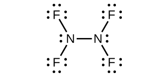

By the end of this section, you will be able to:
* Describe the properties, preparation, and uses of nitrogen

Most pure nitrogen comes from the fractional distillation of liquid air. The atmosphere consists of 78% nitrogen by volume. This means there are more than 20 million tons of nitrogen over every square mile of the earth’s surface. Nitrogen is a component of proteins and of the genetic material (DNA/RNA) of all plants and animals.

Under ordinary conditions, nitrogen is a colorless, odorless, and tasteless gas. It boils at 77 K and freezes at 63 K. Liquid nitrogen is a useful coolant because it is inexpensive and has a low boiling point. Nitrogen is very unreactive because of the very strong triple bond between the nitrogen atoms. The only common reactions at room temperature occur with lithium to form Li3N, with certain transition metal complexes, and with hydrogen or oxygen in nitrogen-fixing bacteria. The general lack of reactivity of nitrogen makes the remarkable ability of some bacteria to synthesize nitrogen compounds using atmospheric nitrogen gas as the source one of the most exciting chemical events on our planet. This process is one type of **nitrogen fixation**{: data-type="term"}. In this case, nitrogen fixation is the process where organisms convert atmospheric nitrogen into biologically useful chemicals. Nitrogen fixation also occurs when lightning passes through air, causing molecular nitrogen to react with oxygen to form nitrogen oxides, which are then carried down to the soil.

Nitrogen Fixation

All living organisms require nitrogen compounds for survival. Unfortunately, most of these organisms cannot absorb nitrogen from its most abundant source—the atmosphere. Atmospheric nitrogen consists of N2 molecules, which are very unreactive due to the strong nitrogen-nitrogen triple bond. However, a few organisms can overcome this problem through a process known as nitrogen fixation, illustrated in [\[link\]](#CNX_Chem_18_07_Nitrogen).

![A flow chart is shown. A cow, grass, and a tree are shown in the center of the diagram. Downward-facing arrows lead from them to the phrase, &#x201C;Decomposers ( aerobic and anaerobic bacteria and fungi ).&#x201D; A downward-facing arrow leads to a space-filing model with one blue atom bonded to four white atoms. The model is labeled, &#x201C;Ammonium ( N H subscript 4 ).&#x201D; A right-facing arrow leads from this molecule to another molecule that is composed of a blue atom bonded to two red atoms. The model is labeled, &#x201C;Nitrites ( N O subscript 2 superscript negative sign ).&#x201D; Below this arrow is a picture of a circle with two rod-shaped structures. It is labeled, &#x201C;Nitrifying bacteria.&#x201D; Above the nitrites label is an upward-facing arrow leading to a blue atom single-bonded to three red atoms. The model is labeled, &#x201C;Nitrates ( N O subscript 3 superscript negative sign ).&#x201D; Next to this arrow is a picture of a circle with two rod-shaped structures labeled, &#x201C;Nitrifying bacteria.&#x201D; The nitrates label has a double-headed, upward-facing arrow that leads to two pictures: one of the roots of the tree which is labeled, &#x201C;Assimilation,&#x201D; and one leading to a picture of a circle with four oval-shaped structures labeled, &#x201C;Denitrifying bacteria.&#x201D; A left-facing arrow leads from this bacteria to a molecule made up of two atoms triple-bonded together and labeled, &#x201C;Atmospheric nitrogen ( N subscript 2 ).&#x201D; This molecule is connected to a downward-facing, double-headed arrow that leads to an image showing yellow filaments on a black background and a picture of a circle with four rod-shaped structures labeled, &#x201C;Nitrogen-fixing soil bacteria.&#x201D; An arrow leads from a picture of a plant&#x2019;s roots to the yellow filaments and then to a photo of a circle with four oval-shaped structures labeled, &#x201C;Nitrogen-fixing bacteria in root nodules.&#x201D;](../resources/CNX_Chem_18_07_Nitrogen.jpg "All living organisms require nitrogen. A few microorganisms are able to process atmospheric nitrogen using nitrogen fixation. (credit &#x201C;roots&#x201D;: modification of work by the United States Department of Agriculture; credit &#x201C;root nodules&#x201D;: modification of work by Louisa Howard)"){: #CNX_Chem_18_07_Nitrogen}

Nitrogen fixation is the process where organisms convert atmospheric nitrogen into biologically useful chemicals. To date, the only known kind of biological organisms capable of nitrogen fixation are microorganisms. These organisms employ enzymes called nitrogenases, which contain iron and molybdenum. Many of these microorganisms live in a symbiotic relationship with plants, with the best-known example being the presence of rhizobia in the root nodules of legumes.

Large volumes of atmospheric nitrogen are necessary for making ammonia—the principal starting material used for preparation of large quantities of other nitrogen-containing compounds. Most other uses for elemental nitrogen depend on its inactivity. It is helpful when a chemical process requires an inert atmosphere. Canned foods and luncheon meats cannot oxidize in a pure nitrogen atmosphere, so they retain a better flavor and color, and spoil less rapidly, when sealed in nitrogen instead of air. This technology allows fresh produce to be available year-round, regardless of growing season.

There are compounds with nitrogen in all of its oxidation states from 3− to 5+. Much of the chemistry of nitrogen involves oxidation-reduction reactions. Some active metals (such as alkali metals and alkaline earth metals) can reduce nitrogen to form metal nitrides. In the remainder of this section, we will examine nitrogen-oxygen chemistry.

There are well-characterized nitrogen oxides in which nitrogen exhibits each of its positive oxidation numbers from 1+ to 5+. When ammonium nitrate is carefully heated, nitrous oxide (dinitrogen oxide) and water vapor form. Stronger heating generates nitrogen gas, oxygen gas, and water vapor. No one should ever attempt this reaction—it can be very explosive. In 1947, there was a major ammonium nitrate explosion in Texas City, Texas, and, in 2013, there was another major explosion in West, Texas. In the last 100 years, there were nearly 30 similar disasters worldwide, resulting in the loss of numerous lives. In this oxidation-reduction reaction, the nitrogen in the nitrate ion oxidizes the nitrogen in the ammonium ion. Nitrous oxide, shown in [\[link\]](#CNX_Chem_18_07_molecreso), is a colorless gas possessing a mild, pleasing odor and a sweet taste. It finds application as an anesthetic for minor operations, especially in dentistry, under the name “laughing gas.”

 ![A space-filling model of a molecule shows two blue atoms labeled &#x201C;N&#x201D; bonded to one another and to one red atom labeled &#x201C;O.&#x201D; Two Lewis structures are also shown and connected by a double-headed arrow. The left image shows a nitrogen atom with two lone pairs of electrons double bonded to a second nitrogen atom. The second nitrogen atom is double-bonded to an oxygen atom that has two lone pairs of electrons. The right image shows a nitrogen atom with a lone pair of electrons double bonded to a second nitrogen atom. The second nitrogen atom is single bonded to an oxygen atom that has three lone pairs of electrons.](../resources/CNX_Chem_18_07_molecreso.jpg "Nitrous oxide, N2O, is an anesthetic that has these molecular (left) and resonance (right) structures."){: #CNX_Chem_18_07_molecreso}

Low yields of nitric oxide, NO, form when heating nitrogen and oxygen together. NO also forms when lightning passes through air during thunderstorms. Burning ammonia is the commercial method of preparing nitric oxide. In the laboratory, the reduction of nitric acid is the best method for preparing nitric oxide. When copper reacts with dilute nitric acid, nitric oxide is the principal reduction product:

<math xmlns="http://www.w3.org/1998/Math/MathML"><mrow><mtext>3Cu</mtext><mo stretchy="false">(</mo><mi>s</mi><mo stretchy="false">)</mo><mo>+</mo><msub><mrow><mtext>8HNO</mtext></mrow><mn>3</mn></msub><mo stretchy="false">(</mo><mi>a</mi><mi>q</mi><mo stretchy="false">)</mo><mspace width="0.2em" /><mo stretchy="false">⟶</mo><mspace width="0.2em" /><mtext>2NO</mtext><mo stretchy="false">(</mo><mi>g</mi><mo stretchy="false">)</mo><mo>+</mo><mtext>3Cu</mtext><msub><mrow><mo stretchy="false">(</mo><msub><mrow><mtext>NO</mtext></mrow><mn>3</mn></msub><mo stretchy="false">)</mo></mrow><mn>2</mn></msub><mo stretchy="false">(</mo><mi>a</mi><mi>q</mi><mo stretchy="false">)</mo><mo>+</mo><msub><mrow><mtext>4H</mtext></mrow><mn>2</mn></msub><mtext>O</mtext><mo stretchy="false">(</mo><mi>l</mi><mo stretchy="false">)</mo></mrow></math>

Gaseous nitric oxide is the most thermally stable of the nitrogen oxides and is the simplest known thermally stable molecule with an unpaired electron. It is one of the air pollutants generated by internal combustion engines, resulting from the reaction of atmospheric nitrogen and oxygen during the combustion process.

At room temperature, nitric oxide is a colorless gas consisting of diatomic molecules. As is often the case with molecules that contain an unpaired electron, two molecules combine to form a dimer by pairing their unpaired electrons to form a bond. Liquid and solid NO both contain N2O2 dimers, like that shown in [\[link\]](#CNX_Chem_18_07_N2O2). Most substances with unpaired electrons exhibit color by absorbing visible light; however, NO is colorless because the absorption of light is not in the visible region of the spectrum.

 {: #CNX_Chem_18_07_N2O2}

Cooling a mixture of equal parts nitric oxide and nitrogen dioxide to −21 °C produces dinitrogen trioxide, a blue liquid consisting of N2O3 molecules (shown in [\[link\]](#CNX_Chem_18_07_molecreso2)). Dinitrogen trioxide exists only in the liquid and solid states. When heated, it reverts to a mixture of NO and NO2.

 ![A space-filling model of a molecule shows two blue atoms labeled, &#x201C;N,&#x201D; bonded to one another and to three red atoms labeled, &#x201C;O.&#x201D; Two Lewis structures are also shown and connected by a double-headed arrow. The left image shows two nitrogen atoms that are single bonded to one another. The left nitrogen is double bonded to an oxygen atom that has two lone pairs of electrons and single bonded to an oxygen with three lone pairs of electrons. The right nitrogen has one lone pair of electrons and is double bonded to an oxygen atom with two lone pairs of electrons. The right image shows two nitrogen atoms that are single bonded to one another. The right nitrogen is double bonded to an oxygen atom that has two lone pairs of electrons and single bonded to an oxygen atom with three lone pairs of electrons. The right nitrogen has one lone pair of electrons and is double bonded to an oxygen atom with two lone pairs of electrons.](../resources/CNX_Chem_18_07_molecreso2.jpg "Dinitrogen trioxide, N2O3, only exists in liquid or solid states and has these molecular (left) and resonance (right) structures."){: #CNX_Chem_18_07_molecreso2}

It is possible to prepare nitrogen dioxide in the laboratory by heating the nitrate of a heavy metal, or by the reduction of concentrated nitric acid with copper metal, as shown in [\[link\]](#CNX_Chem_18_07_CuHNO32NO2). Commercially, it is possible to prepare nitrogen dioxide by oxidizing nitric oxide with air.

 2 and brown fumes of NO2. (credit: modification of work by Mark Ott)"){: #CNX_Chem_18_07_CuHNO32NO2}

The nitrogen dioxide molecule (illustrated in [\[link\]](#CNX_Chem_18_07_N2O4)) contains an unpaired electron, which is responsible for its color and paramagnetism. It is also responsible for the dimerization of NO2. At low pressures or at high temperatures, nitrogen dioxide has a deep brown color that is due to the presence of the NO2 molecule. At low temperatures, the color almost entirely disappears as dinitrogen tetraoxide, N2O4, forms. At room temperature, an equilibrium exists:

<math xmlns="http://www.w3.org/1998/Math/MathML"><mrow><msub><mrow><mtext>2NO</mtext></mrow><mn>2</mn></msub><mo stretchy="false">(</mo><mi>g</mi><mo stretchy="false">)</mo><mspace width="0.2em" /><mo stretchy="false">⇌</mo><mspace width="0.2em" /><msub><mtext>N</mtext><mn>2</mn></msub><msub><mtext>O</mtext><mn>4</mn></msub><mo stretchy="false">(</mo><mi>g</mi><mo stretchy="false">)</mo><mspace width="5em" /><msub><mi>K</mi><mi>P</mi></msub><mo>=</mo><mn>6.86</mn></mrow></math>

 ![Two space-filling models and two Lewis structures are shown. The left space-filling model shows a blue atom labeled, &#x201C;N,&#x201D; bonded to two red atoms labeled, &#x201C;O,&#x201D; while the right space-filling model shows two blue atoms labeled, &#x201C;N,&#x201D; each bonded to two red atoms labeled, &#x201C;O.&#x201D; The left Lewis structure shows a nitrogen atom with one lone electron single bonded to an oxygen atom with three lone pairs of electrons. The nitrogen atom is also double bonded to an oxygen atom with two lone pairs of electrons. The right structure, which is connected by a double-headed arrow to the first, is a diagram showing a similar Lewis structure, but the position of the double bond and the number of electron pairs on the oxygen atoms have switched.](../resources/CNX_Chem_18_07_N2O4.jpg "The molecular and resonance structures for nitrogen dioxide (NO2, left) and dinitrogen tetraoxide (N2O4, right) are shown."){: #CNX_Chem_18_07_N2O4}

Dinitrogen pentaoxide, N2O5 (illustrated in [\[link\]](#CNX_Chem_18_07_N2O5)), is a white solid that is formed by the dehydration of nitric acid by phosphorus(V) oxide (tetraphosphorus decoxide):

<math xmlns="http://www.w3.org/1998/Math/MathML"><mrow><msub><mtext>P</mtext><mn>4</mn></msub><msub><mtext>O</mtext><mrow><mn>10</mn></mrow></msub><mo stretchy="false">(</mo><mi>s</mi><mo stretchy="false">)</mo><mo>+</mo><msub><mrow><mtext>4HNO</mtext></mrow><mn>3</mn></msub><mo stretchy="false">(</mo><mi>l</mi><mo stretchy="false">)</mo><mspace width="0.2em" /><mo stretchy="false">⟶</mo><mspace width="0.2em" /><msub><mrow><mtext>4HPO</mtext></mrow><mn>3</mn></msub><mo stretchy="false">(</mo><mi>s</mi><mo stretchy="false">)</mo><mo>+</mo><msub><mrow><mtext>2N</mtext></mrow><mn>2</mn></msub><msub><mtext>O</mtext><mn>5</mn></msub><mo stretchy="false">(</mo><mi>s</mi><mo stretchy="false">)</mo></mrow></math>

It is unstable above room temperature, decomposing to N2O4 and O2.

 ![A space-filling model and a Lewis structure are shown. The space-filling model shows two blue atoms labeled, &#x201C;N,&#x201D; each bonded to two red atoms labeled, &#x201C;O,&#x201D; with another red atom labeled, &#x201C;O,&#x201D; in between them. The Lewis structure shows a nitrogen atom single bonded to an oxygen atom with three lone pairs of electrons in a downward position and double bonded to an oxygen atom with two lone pairs of electrons in an upward position. This nitrogen is single bonded to an oxygen atom with two lone pairs of electrons. The oxygen atom is single bonded to another nitrogen atom which is single bonded to another oxygen atom with three lone pairs of electrons in an upward position. The second nitrogen atom is also double bonded to an oxygen atom with two lone pairs of electrons in a downward position.](../resources/CNX_Chem_18_07_N2O5.jpg "This image shows the molecular structure and one resonance structure of a molecule of dinitrogen pentaoxide, N2O5."){: #CNX_Chem_18_07_N2O5}

The oxides of nitrogen(III), nitrogen(IV), and nitrogen(V) react with water and form nitrogen-containing oxyacids. Nitrogen(III) oxide, N2O3, is the anhydride of nitrous acid; HNO2 forms when N2O3 reacts with water. There are no stable oxyacids containing nitrogen with an oxidation state of 4+; therefore, nitrogen(IV) oxide, NO2, disproportionates in one of two ways when it reacts with water. In cold water, a mixture of HNO2 and HNO3 forms. At higher temperatures, HNO3 and NO will form. Nitrogen(V) oxide, N2O5, is the anhydride of nitric acid; HNO3 is produced when N2O5 reacts with water:

<math xmlns="http://www.w3.org/1998/Math/MathML"><mrow><msub><mtext>N</mtext><mn>2</mn></msub><msub><mtext>O</mtext><mn>5</mn></msub><mo stretchy="false">(</mo><mi>s</mi><mo stretchy="false">)</mo><mo>+</mo><msub><mtext>H</mtext><mn>2</mn></msub><mtext>O</mtext><mo stretchy="false">(</mo><mi>l</mi><mo stretchy="false">)</mo><mspace width="0.2em" /><mo stretchy="false">⟶</mo><mspace width="0.2em" /><msub><mrow><mtext>2HNO</mtext></mrow><mn>3</mn></msub><mo stretchy="false">(</mo><mi>a</mi><mi>q</mi><mo stretchy="false">)</mo></mrow></math>

The nitrogen oxides exhibit extensive oxidation-reduction behavior. Nitrous oxide resembles oxygen in its behavior when heated with combustible substances. N2O is a strong oxidizing agent that decomposes when heated to form nitrogen and oxygen. Because one-third of the gas liberated is oxygen, nitrous oxide supports combustion better than air (one-fifth oxygen). A glowing splinter bursts into flame when thrust into a bottle of this gas. Nitric oxide acts both as an oxidizing agent and as a reducing agent. For example:

<math xmlns="http://www.w3.org/1998/Math/MathML"><mrow><mtext>oxidizing agent:</mtext><mspace width="0.2em" /><msub><mtext>P</mtext><mrow><mn>4</mn></mrow></msub><mo stretchy="false">(</mo><mi>s</mi><mo stretchy="false">)</mo><mo>+</mo><mtext>6NO</mtext><mo stretchy="false">(</mo><mi>g</mi><mo stretchy="false">)</mo><mspace width="0.2em" /><mo stretchy="false">⟶</mo><mspace width="0.2em" /><msub><mtext>P</mtext><mn>4</mn></msub><msub><mtext>O</mtext><mn>6</mn></msub><mo stretchy="false">(</mo><mi>s</mi><mo stretchy="false">)</mo><mo>+</mo><msub><mrow><mtext>3N</mtext></mrow><mn>2</mn></msub><mo stretchy="false">(</mo><mi>g</mi><mo stretchy="false">)</mo></mrow></math>

<math xmlns="http://www.w3.org/1998/Math/MathML"><mrow><mtext>reducing agent:</mtext><mspace width="0.2em" /><msub><mtext>Cl</mtext><mrow><mn>2</mn></mrow></msub><mo stretchy="false">(</mo><mi>g</mi><mo stretchy="false">)</mo><mo>+</mo><mtext>2NO</mtext><mo stretchy="false">(</mo><mi>g</mi><mo stretchy="false">)</mo><mspace width="0.2em" /><mo stretchy="false">⟶</mo><mspace width="0.2em" /><mtext>2ClNO</mtext><mo stretchy="false">(</mo><mi>g</mi><mo stretchy="false">)</mo></mrow></math>

Nitrogen dioxide (or dinitrogen tetraoxide) is a good oxidizing agent. For example:

<math xmlns="http://www.w3.org/1998/Math/MathML"><mrow><msub><mrow><mtext>NO</mtext></mrow><mn>2</mn></msub><mo stretchy="false">(</mo><mi>g</mi><mo stretchy="false">)</mo><mo>+</mo><mtext>CO</mtext><mo stretchy="false">(</mo><mi>g</mi><mo stretchy="false">)</mo><mspace width="0.2em" /><mo stretchy="false">⟶</mo><mspace width="0.2em" /><mtext>NO</mtext><mo stretchy="false">(</mo><mi>g</mi><mo stretchy="false">)</mo><mo>+</mo><msub><mrow><mtext>CO</mtext></mrow><mn>2</mn></msub><mo stretchy="false">(</mo><mi>g</mi><mo stretchy="false">)</mo></mrow></math>

<math xmlns="http://www.w3.org/1998/Math/MathML"><mrow><msub><mrow><mtext>NO</mtext></mrow><mn>2</mn></msub><mo stretchy="false">(</mo><mi>g</mi><mo stretchy="false">)</mo><mo>+</mo><mtext>2HCl</mtext><mo stretchy="false">(</mo><mi>a</mi><mi>q</mi><mo stretchy="false">)</mo><mspace width="0.2em" /><mo stretchy="false">⟶</mo><mspace width="0.2em" /><mtext>NO</mtext><mo stretchy="false">(</mo><mi>g</mi><mo stretchy="false">)</mo><mo>+</mo><msub><mrow><mtext>Cl</mtext></mrow><mn>2</mn></msub><mo stretchy="false">(</mo><mi>g</mi><mo stretchy="false">)</mo><mo>+</mo><msub><mtext>H</mtext><mn>2</mn></msub><mtext>O</mtext><mo stretchy="false">(</mo><mi>l</mi><mo stretchy="false">)</mo></mrow></math>

# Key Concepts and Summary

Nitrogen exhibits oxidation states ranging from 3− to 5+. Because of the stability of the N≡N triple bond, it requires a great deal of energy to make compounds from molecular nitrogen. Active metals such as the alkali metals and alkaline earth metals can reduce nitrogen to form metal nitrides. Nitrogen oxides and nitrogen hydrides are also important substances.

# Chemistry End of Chapter Exercises

Write the Lewis structures for each of the following:

(a) NH2−

(b) N2F4

(c) <math xmlns="http://www.w3.org/1998/Math/MathML"><mrow><msub><mrow><mtext>NH</mtext></mrow><mn>2</mn></msub><msup><mrow /><mo>−</mo></msup></mrow></math>

(d) NF3

(e) <math xmlns="http://www.w3.org/1998/Math/MathML"><mrow><msub><mrow><mtext>N</mtext></mrow><mn>3</mn></msub><msup><mrow /><mo>−</mo></msup></mrow></math>

(a) NH2−:* * *
{: data-type="newline"}

   ;* * *
{: data-type="newline"}

 (b) N2F4:* * *
{: data-type="newline"}

   ;* * *
{: data-type="newline"}

 (c) <math xmlns="http://www.w3.org/1998/Math/MathML"><mrow><msub><mrow><mtext>NH</mtext></mrow><mn>2</mn></msub><msup><mrow /><mtext>−</mtext></msup><mo>:</mo></mrow></math>

* * *
{: data-type="newline"}

   ;* * *
{: data-type="newline"}

 (d) NF3:* * *
{: data-type="newline"}

   ;* * *
{: data-type="newline"}

 (e) <math xmlns="http://www.w3.org/1998/Math/MathML"><mrow><msub><mrow><mtext>N</mtext></mrow><mn>3</mn></msub><msup><mrow /><mtext>−</mtext></msup><mo>:</mo></mrow></math>

* * *
{: data-type="newline"}

  ![Three Lewis structures are shown and connected by double-headed arrows in between. The left structure shows a nitrogen atom with a lone pair of electrons triple bonded to a second nitrogen which is single bonded to a third nitrogen. The third nitrogen has three lone pairs of electrons. The entire structure is surrounded by brackets, and outside and superscript to the brackets is a negative sign. The middle structure shows a nitrogen atom with three lone pair of electrons single bonded to a second nitrogen which is triple bonded to a third nitrogen. The third nitrogen which has one lone pair of electrons. The entire structure is surrounded by brackets, and outside and superscript to the brackets is a negative sign. The right structure shows a nitrogen atom with two lone pairs of electrons double bonded to a second nitrogen which is double bonded to a third nitrogen. The third nitrogen atom has two lone pairs of electrons. The entire structure is surrounded by brackets, and outside and superscript to the brackets is a negative sign.](../resources/CNX_Chem_18_07_Exercise1e_img.jpg) 

For each of the following, indicate the hybridization of the nitrogen atom (for <math xmlns="http://www.w3.org/1998/Math/MathML"><mrow><msub><mrow><mtext>N</mtext></mrow><mn>3</mn></msub><msup><mrow /><mtext>−</mtext></msup><mo>,</mo></mrow></math>

 the central nitrogen).

(a) N2F4

(b) <math xmlns="http://www.w3.org/1998/Math/MathML"><mrow><msub><mrow><mtext>NH</mtext></mrow><mn>2</mn></msub><msup><mrow /><mo>−</mo></msup></mrow></math>

(c) NF3

(d) <math xmlns="http://www.w3.org/1998/Math/MathML"><mrow><msub><mrow><mtext>N</mtext></mrow><mn>3</mn></msub><msup><mrow /><mo>−</mo></msup></mrow></math>

Explain how ammonia can function both as a Brønsted base and as a Lewis base.

Ammonia acts as a Brønsted base because it readily accepts protons and as a Lewis base in that it has an electron pair to donate.* * *
{: data-type="newline"}

 Brønsted base: <math xmlns="http://www.w3.org/1998/Math/MathML"><mrow><msub><mrow><mtext>NH</mtext></mrow><mn>3</mn></msub><mo>+</mo><msub><mtext>H</mtext><mn>3</mn></msub><msup><mtext>O</mtext><mo>+</mo></msup><mspace width="0.2em" /><mo stretchy="false">⟶</mo><mspace width="0.2em" /><msub><mrow><mtext>NH</mtext></mrow><mn>4</mn></msub><msup><mrow /><mo>+</mo></msup><mo>+</mo><msub><mtext>H</mtext><mn>2</mn></msub><mtext>O</mtext></mrow></math>

* * *
{: data-type="newline"}

 Lewis base: <math xmlns="http://www.w3.org/1998/Math/MathML"><mrow><msub><mrow><mtext>2NH</mtext></mrow><mn>3</mn></msub><mo>+</mo><msup><mrow><mtext>Ag</mtext></mrow><mo>+</mo></msup><mspace width="0.2em" /><mo stretchy="false">⟶</mo><mspace width="0.2em" /><msup><mrow><msub><mrow><mtext>[H</mtext></mrow><mn>3</mn></msub><mtext>N</mtext><mo>−</mo><mtext>Ag</mtext><mo>−</mo><msub><mrow><mtext>NH</mtext></mrow><mn>3</mn></msub><mo stretchy="false">]</mo></mrow><mo>+</mo></msup></mrow></math>

Determine the oxidation state of nitrogen in each of the following. You may wish to review the chapter on chemical bonding for relevant examples.

(a) NCl3

(b) ClNO

(c) N2O5

(d) N2O3

(e) <math xmlns="http://www.w3.org/1998/Math/MathML"><mrow><msub><mrow><mtext>NO</mtext></mrow><mn>2</mn></msub><msup><mrow /><mo>−</mo></msup></mrow></math>

(f) N2O4

(g) N2O

(h) <math xmlns="http://www.w3.org/1998/Math/MathML"><mrow><msub><mrow><mtext>NO</mtext></mrow><mn>3</mn></msub><msup><mrow /><mo>−</mo></msup></mrow></math>

(i) HNO2

(j) HNO3

For each of the following, draw the Lewis structure, predict the ONO bond angle, and give the hybridization of the nitrogen. You may wish to review the chapters on chemical bonding and advanced theories of covalent bonding for relevant examples.

(a) NO2

(b) <math xmlns="http://www.w3.org/1998/Math/MathML"><mrow><msub><mrow><mtext>NO</mtext></mrow><mn>2</mn></msub><msup><mrow /><mo>−</mo></msup></mrow></math>

(c) <math xmlns="http://www.w3.org/1998/Math/MathML"><mrow><msub><mrow><mtext>NO</mtext></mrow><mn>2</mn></msub><msup><mrow /><mo>+</mo></msup></mrow></math>

(a) NO2:* * *
{: data-type="newline"}

   * * *
{: data-type="newline"}

 Nitrogen is *sp*2 hybridized. The molecule has a bent geometry with an ONO bond angle of approximately 120°.* * *
{: data-type="newline"}

 (b) <math xmlns="http://www.w3.org/1998/Math/MathML"><mrow><msub><mrow><mtext>NO</mtext></mrow><mn>2</mn></msub><msup><mrow /><mtext>−</mtext></msup><mo>:</mo></mrow></math>

* * *
{: data-type="newline"}

   * * *
{: data-type="newline"}

 Nitrogen is *sp*2 hybridized. The molecule has a bent geometry with an ONO bond angle slightly less than 120°.* * *
{: data-type="newline"}

 (c) <math xmlns="http://www.w3.org/1998/Math/MathML"><mrow><msub><mrow><mtext>NO</mtext></mrow><mn>2</mn></msub><msup><mrow /><mtext>+</mtext></msup><mo>:</mo></mrow></math>

* * *
{: data-type="newline"}

   * * *
{: data-type="newline"}

 Nitrogen is *sp* hybridized. The molecule has a linear geometry with an ONO bond angle of 180°.

How many grams of gaseous ammonia will the reaction of 3.0 g hydrogen gas and 3.0 g of nitrogen gas produce?

Although PF5 and AsF5 are stable, nitrogen does not form NF5 molecules. Explain this difference among members of the same group.

Nitrogen cannot form a NF5 molecule because it does not have *d* orbitals to bond with the additional two fluorine atoms.

The equivalence point for the titration of a 25.00-mL sample of CsOH solution with 0.1062 *M* HNO3 is at 35.27 mL. What is the concentration of the CsOH solution?

