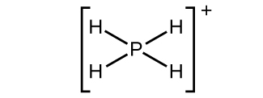
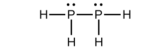
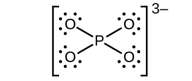
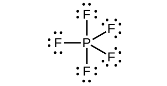
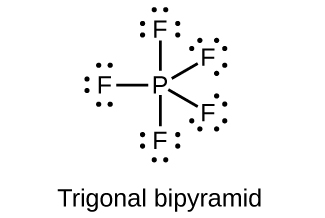

By the end of this section, you will be able to:
* Describe the properties, preparation, and uses of phosphorus

The industrial preparation of phosphorus is by heating calcium phosphate, obtained from phosphate rock, with sand and coke:

<math xmlns="http://www.w3.org/1998/Math/MathML"><mrow><msub><mrow><mtext>2Ca</mtext></mrow><mn>3</mn></msub><msub><mrow><mo stretchy="false">(</mo><msub><mrow><mtext>PO</mtext></mrow><mn>4</mn></msub><mo stretchy="false">)</mo></mrow><mn>2</mn></msub><mo stretchy="false">(</mo><mi>s</mi><mo stretchy="false">)</mo><mo>+</mo><msub><mrow><mtext>6SiO</mtext></mrow><mn>2</mn></msub><mo stretchy="false">(</mo><mi>s</mi><mo stretchy="false">)</mo><mo>+</mo><mtext>10C</mtext><mo stretchy="false">(</mo><mi>s</mi><mo stretchy="false">)</mo><mspace width="0.2em" /><mover><mo>→</mo><mrow><mspace width="0.4em" /><mtext>Δ</mtext><mspace width="0.4em" /></mrow></mover><mspace width="0.2em" /><msub><mrow><mtext>6CaSiO</mtext></mrow><mn>3</mn></msub><mo stretchy="false">(</mo><mi>l</mi><mo stretchy="false">)</mo><mo>+</mo><mtext>10CO</mtext><mo stretchy="false">(</mo><mi>g</mi><mo stretchy="false">)</mo><mo>+</mo><msub><mtext>P</mtext><mn>4</mn></msub><mo stretchy="false">(</mo><mi>g</mi><mo stretchy="false">)</mo></mrow></math>

The phosphorus distills out of the furnace and is condensed into a solid or burned to form P4O10. The preparation of many other phosphorus compounds begins with P4O10. The acids and phosphates are useful as fertilizers and in the chemical industry. Other uses are in the manufacture of special alloys such as ferrophosphorus and phosphor bronze. Phosphorus is important in making pesticides, matches, and some plastics. Phosphorus is an active nonmetal. In compounds, phosphorus usually occurs in oxidation states of 3−, 3+, and 5+. Phosphorus exhibits oxidation numbers that are unusual for a group 15 element in compounds that contain phosphorus-phosphorus bonds; examples include diphosphorus tetrahydride, H2P-PH2, and tetraphosphorus trisulfide, P4S3, illustrated in [\[link\]](#CNX_Chem_18_08_P4S3).

 {: #CNX_Chem_18_08_P4S3}

### Phosphorus Oxygen Compounds

Phosphorus forms two common oxides, phosphorus(III) oxide (or tetraphosphorus hexaoxide), P4O6, and phosphorus(V) oxide (or tetraphosphorus decaoxide), P4O10, both shown in [\[link\]](#CNX_Chem_18_08_P4O6P4O10). Phosphorus(III) oxide is a white crystalline solid with a garlic-like odor. Its vapor is very poisonous. It oxidizes slowly in air and inflames when heated to 70 °C, forming P4O10. Phosphorus(III) oxide dissolves slowly in cold water to form phosphorous acid, H3PO3.

 ![Two ball-and-stick models are shown. In the left model, three orange atoms labeled, &#x201C;P,&#x201D; are single bonded to red atoms labeled, &#x201C;O,&#x201D; in an alternating, six-sided ring structure. Each of the orange atoms are also single bonded to another red atom, which are in turn single bonded to a single orange atom. The right model shows three orange atoms labeled, &#x201C;P,&#x201D; single bonded to red atoms labeled, &#x201C;O,&#x201D; in an alternating, six-sided ring structure. Each of the orange atoms are also single bonded to two more red atoms, one in an upward position and one facing the outside of the molecule. The upward red atoms are single bonded to a single orange atom which is single bonded to a final red atom.](../resources/CNX_Chem_18_08_P4O6P4O10.jpg "This image shows the molecular structures of P4O6 (left) and P4O10 (right)."){: #CNX_Chem_18_08_P4O6P4O10}

Phosphorus(V) oxide, P4O10, is a white powder that is prepared by burning phosphorus in excess oxygen. Its enthalpy of formation is very high (−2984 kJ), and it is quite stable and a very poor oxidizing agent. Dropping P4O10 into water produces a hissing sound, heat, and orthophosphoric acid:

<math xmlns="http://www.w3.org/1998/Math/MathML"><mrow><msub><mtext>P</mtext><mn>4</mn></msub><msub><mtext>O</mtext><mrow><mn>10</mn></mrow></msub><mo stretchy="false">(</mo><mi>s</mi><mo stretchy="false">)</mo><mo>+</mo><msub><mrow><mtext>6H</mtext></mrow><mn>2</mn></msub><mtext>O</mtext><mo stretchy="false">(</mo><mi>l</mi><mo stretchy="false">)</mo><mspace width="0.2em" /><mo stretchy="false">⟶</mo><mspace width="0.2em" /><msub><mrow><mtext>4H</mtext></mrow><mn>3</mn></msub><msub><mrow><mtext>PO</mtext></mrow><mn>4</mn></msub><mo stretchy="false">(</mo><mi>a</mi><mi>q</mi><mo stretchy="false">)</mo></mrow></math>

Because of its great affinity for water, phosphorus(V) oxide is an excellent drying agent for gases and solvents, and for removing water from many compounds.

### Phosphorus Halogen Compounds

Phosphorus will react directly with the halogens, forming trihalides, PX3, and pentahalides, PX5. The trihalides are much more stable than the corresponding nitrogen trihalides; nitrogen pentahalides do not form because of nitrogen’s inability to form more than four bonds.

The chlorides PCl3 and PCl5, both shown in [\[link\]](#CNX_Chem_18_08_PCl3PCl5), are the most important halides of phosphorus. Phosphorus trichloride is a colorless liquid that is prepared by passing chlorine over molten phosphorus. Phosphorus pentachloride is an off-white solid that is prepared by oxidizing the trichloride with excess chlorine. The pentachloride sublimes when warmed and forms an equilibrium with the trichloride and chlorine when heated.

  and PCl5 (right) in the gas phase."){: #CNX_Chem_18_08_PCl3PCl5}

Like most other nonmetal halides, both phosphorus chlorides react with an excess of water and yield hydrogen chloride and an oxyacid: PCl3 yields phosphorous acid H3PO3 and PCl5 yields phosphoric acid, H3PO4.

The pentahalides of phosphorus are Lewis acids because of the empty valence *d* orbitals of phosphorus. These compounds readily react with halide ions (Lewis bases) to give the anion <math xmlns="http://www.w3.org/1998/Math/MathML"><mrow><msub><mrow><mtext>PX</mtext></mrow><mn>6</mn></msub><msup><mrow /><mtext>−</mtext></msup><mo>.</mo></mrow></math>

 Whereas phosphorus pentafluoride is a molecular compound in all states, X-ray studies show that solid phosphorus pentachloride is an ionic compound, <math xmlns="http://www.w3.org/1998/Math/MathML"><mrow><msub><mrow><mo stretchy="false">[</mo><mtext>PCl</mtext></mrow><mn>4</mn></msub><msup><mrow /><mtext>+</mtext></msup><mo stretchy="false">]</mo><mo stretchy="false">[</mo><msub><mrow><mtext>PCl</mtext></mrow><mn>6</mn></msub><msup><mrow /><mtext>−</mtext></msup><mo stretchy="false">]</mo><mo>,</mo></mrow></math>

 as are phosphorus pentabromide, <math xmlns="http://www.w3.org/1998/Math/MathML"><mrow><msub><mrow><mo stretchy="false">[</mo><mtext>PBr</mtext></mrow><mn>4</mn></msub><msup><mrow /><mtext>+</mtext></msup><mo stretchy="false">]</mo></mrow></math>

\[Br−\], and phosphorus pentaiodide, <math xmlns="http://www.w3.org/1998/Math/MathML"><mrow><msub><mrow><mo stretchy="false">[</mo><mtext>PI</mtext></mrow><mn>4</mn></msub><msup><mrow /><mtext>+</mtext></msup><mo stretchy="false">]</mo></mrow></math>

\[I−\].

### Key Concepts and Summary

Phosphorus (group 15) commonly exhibits oxidation states of 3− with active metals and of 3+ and 5+ with more electronegative nonmetals. The halogens and oxygen will oxidize phosphorus. The oxides are phosphorus(V) oxide, P4O10, and phosphorus(III) oxide, P4O6. The two common methods for preparing orthophosphoric acid, H3PO4, are either the reaction of a phosphate with sulfuric acid or the reaction of water with phosphorus(V) oxide. Orthophosphoric acid is a triprotic acid that forms three types of salts.

### Chemistry End of Chapter Exercises

Write the Lewis structure for each of the following. You may wish to review the chapter on chemical bonding and molecular geometry.

(a) PH3

(b) <math xmlns="http://www.w3.org/1998/Math/MathML"><mrow><msub><mrow><mtext>PH</mtext></mrow><mn>4</mn></msub><msup><mrow /><mo>+</mo></msup></mrow></math>

(c) P2H4

(d) <math xmlns="http://www.w3.org/1998/Math/MathML"><mrow><msub><mrow><mtext>PO</mtext></mrow><mn>4</mn></msub><msup><mrow /><mrow><mn>3−</mn></mrow></msup></mrow></math>

(e) PF5

(a)* * *
{: data-type="newline"}

  
;* * *
{: data-type="newline"}

 (b)* * *
{: data-type="newline"}

  
;* * *
{: data-type="newline"}

 (c)* * *
{: data-type="newline"}

  
;* * *
{: data-type="newline"}

 (d)* * *
{: data-type="newline"}

  
;* * *
{: data-type="newline"}

 (e)* * *
{: data-type="newline"}

  

Describe the molecular structure of each of the following molecules or ions listed. You may wish to review the chapter on chemical bonding and molecular geometry.

(a) PH3

(b) <math xmlns="http://www.w3.org/1998/Math/MathML"><mrow><msub><mrow><mtext>PH</mtext></mrow><mn>4</mn></msub><msup><mrow /><mo>+</mo></msup></mrow></math>

(c) P2H4

(d) <math xmlns="http://www.w3.org/1998/Math/MathML"><mrow><msub><mrow><mtext>PO</mtext></mrow><mn>4</mn></msub><msup><mrow /><mrow><mn>3−</mn></mrow></msup></mrow></math>

Complete and balance each of the following chemical equations. (In some cases, there may be more than one correct answer.)

(a) <math xmlns="http://www.w3.org/1998/Math/MathML"><mrow><msub><mtext>P</mtext><mn>4</mn></msub><mo>+</mo><mtext>Al</mtext><mspace width="0.2em" /><mo stretchy="false">⟶</mo></mrow></math>

(b) <math xmlns="http://www.w3.org/1998/Math/MathML"><mrow><msub><mtext>P</mtext><mn>4</mn></msub><mo>+</mo><mtext>Na</mtext><mspace width="0.2em" /><mo stretchy="false">⟶</mo></mrow></math>

(c) <math xmlns="http://www.w3.org/1998/Math/MathML"><mrow><msub><mtext>P</mtext><mn>4</mn></msub><mo>+</mo><msub><mtext>F</mtext><mn>2</mn></msub><mspace width="0.2em" /><mo stretchy="false">⟶</mo></mrow></math>

(d) <math xmlns="http://www.w3.org/1998/Math/MathML"><mrow><msub><mtext>P</mtext><mn>4</mn></msub><mo>+</mo><msub><mtext>Cl</mtext><mn>2</mn></msub><mspace width="0.2em" /><mo stretchy="false">⟶</mo></mrow></math>

(e) <math xmlns="http://www.w3.org/1998/Math/MathML"><mrow><msub><mtext>P</mtext><mn>4</mn></msub><mo>+</mo><msub><mtext>O</mtext><mn>2</mn></msub><mspace width="0.2em" /><mo stretchy="false">⟶</mo></mrow></math>

(f) <math xmlns="http://www.w3.org/1998/Math/MathML"><mrow><msub><mtext>P</mtext><mn>4</mn></msub><msub><mtext>O</mtext><mn>6</mn></msub><mo>+</mo><msub><mtext>O</mtext><mn>2</mn></msub><mspace width="0.2em" /><mo stretchy="false">⟶</mo></mrow></math>

(a) <math xmlns="http://www.w3.org/1998/Math/MathML"><mrow><msub><mtext>P</mtext><mn>4</mn></msub><mo stretchy="false">(</mo><mi>s</mi><mo stretchy="false">)</mo><mo>+</mo><mtext>4Al</mtext><mo stretchy="false">(</mo><mi>s</mi><mo stretchy="false">)</mo><mspace width="0.2em" /><mo stretchy="false">⟶</mo><mspace width="0.2em" /><mtext>4AlP</mtext><mo stretchy="false">(</mo><mi>s</mi><mo stretchy="false">)</mo><mo>;</mo></mrow></math>

 (b) <math xmlns="http://www.w3.org/1998/Math/MathML"><mrow><msub><mtext>P</mtext><mn>4</mn></msub><mo stretchy="false">(</mo><mi>s</mi><mo stretchy="false">)</mo><mo>+</mo><mtext>12Na</mtext><mo stretchy="false">(</mo><mi>s</mi><mo stretchy="false">)</mo><mspace width="0.2em" /><mo stretchy="false">⟶</mo><mspace width="0.2em" /><msub><mrow><mtext>4Na</mtext></mrow><mn>3</mn></msub><mtext>P</mtext><mo stretchy="false">(</mo><mi>s</mi><mo stretchy="false">)</mo><mo>;</mo></mrow></math>

 (c) <math xmlns="http://www.w3.org/1998/Math/MathML"><mrow><msub><mtext>P</mtext><mn>4</mn></msub><mo stretchy="false">(</mo><mi>s</mi><mo stretchy="false">)</mo><mo>+</mo><msub><mrow><mtext>10F</mtext></mrow><mn>2</mn></msub><mo stretchy="false">(</mo><mi>g</mi><mo stretchy="false">)</mo><mspace width="0.2em" /><mo stretchy="false">⟶</mo><mspace width="0.2em" /><msub><mrow><mtext>4PF</mtext></mrow><mn>5</mn></msub><mo stretchy="false">(</mo><mi>l</mi><mo stretchy="false">)</mo><mo>;</mo></mrow></math>

 (d) <math xmlns="http://www.w3.org/1998/Math/MathML"><mrow><msub><mtext>P</mtext><mn>4</mn></msub><mo stretchy="false">(</mo><mi>s</mi><mo stretchy="false">)</mo><mo>+</mo><msub><mrow><mtext>6Cl</mtext></mrow><mn>2</mn></msub><mo stretchy="false">(</mo><mi>g</mi><mo stretchy="false">)</mo><mspace width="0.2em" /><mo stretchy="false">⟶</mo><mspace width="0.2em" /><msub><mrow><mtext>4PCl</mtext></mrow><mn>3</mn></msub><mo stretchy="false">(</mo><mi>l</mi><mo stretchy="false">)</mo></mrow></math>

 or <math xmlns="http://www.w3.org/1998/Math/MathML"><mrow><msub><mtext>P</mtext><mn>4</mn></msub><mo stretchy="false">(</mo><mi>s</mi><mo stretchy="false">)</mo><mo>+</mo><msub><mrow><mtext>10Cl</mtext></mrow><mn>2</mn></msub><mo stretchy="false">(</mo><mi>g</mi><mo stretchy="false">)</mo><mspace width="0.2em" /><mo stretchy="false">⟶</mo><mspace width="0.2em" /><msub><mrow><mtext>4PCl</mtext></mrow><mn>5</mn></msub><mo stretchy="false">(</mo><mi>l</mi><mo stretchy="false">)</mo><mo>;</mo></mrow></math>

 (e) <math xmlns="http://www.w3.org/1998/Math/MathML"><mrow><msub><mtext>P</mtext><mn>4</mn></msub><mo stretchy="false">(</mo><mi>s</mi><mo stretchy="false">)</mo><mo>+</mo><msub><mrow><mtext>3O</mtext></mrow><mn>2</mn></msub><mo stretchy="false">(</mo><mi>g</mi><mo stretchy="false">)</mo><mspace width="0.2em" /><mo stretchy="false">⟶</mo><mspace width="0.2em" /><msub><mtext>P</mtext><mn>4</mn></msub><msub><mtext>O</mtext><mn>6</mn></msub><mo stretchy="false">(</mo><mi>s</mi><mo stretchy="false">)</mo></mrow></math>

 or <math xmlns="http://www.w3.org/1998/Math/MathML"><mrow><msub><mtext>P</mtext><mn>4</mn></msub><mo stretchy="false">(</mo><mi>s</mi><mo stretchy="false">)</mo><mo>+</mo><msub><mrow><mtext>5O</mtext></mrow><mn>2</mn></msub><mo stretchy="false">(</mo><mi>g</mi><mo stretchy="false">)</mo><mspace width="0.2em" /><mo stretchy="false">⟶</mo><mspace width="0.2em" /><msub><mtext>P</mtext><mn>4</mn></msub><msub><mtext>O</mtext><mrow><mn>10</mn></mrow></msub><mo stretchy="false">(</mo><mi>s</mi><mo stretchy="false">)</mo><mo>;</mo></mrow></math>

 (f) <math xmlns="http://www.w3.org/1998/Math/MathML"><mrow><msub><mtext>P</mtext><mn>4</mn></msub><msub><mtext>O</mtext><mn>6</mn></msub><mo stretchy="false">(</mo><mi>s</mi><mo stretchy="false">)</mo><mo>+</mo><msub><mrow><mtext>2O</mtext></mrow><mn>2</mn></msub><mo stretchy="false">(</mo><mi>g</mi><mo stretchy="false">)</mo><mspace width="0.2em" /><mo stretchy="false">⟶</mo><mspace width="0.2em" /><msub><mtext>P</mtext><mn>4</mn></msub><msub><mtext>O</mtext><mrow><mn>10</mn></mrow></msub><mo stretchy="false">(</mo><mi>s</mi><mo stretchy="false">)</mo></mrow></math>

Describe the hybridization of phosphorus in each of the following compounds: P4O10, P4O6, PH4I (an ionic compound), PBr3, H3PO4, H3PO3, PH3, and P2H4. You may wish to review the chapter on advanced theories of covalent bonding.

What volume of 0.200 *M* NaOH is necessary to neutralize the solution produced by dissolving 2.00 g of PCl3 is an excess of water? Note that when H3PO3 is titrated under these conditions, only one proton of the acid molecule reacts.

291 mL

How much POCl3 can form from 25.0 g of PCl5 and the appropriate amount of H2O?

How many tons of Ca3(PO4)2 are necessary to prepare 5.0 tons of phosphorus if the yield is 90%?

28 tons

Write equations showing the stepwise ionization of phosphorous acid.

Draw the Lewis structures and describe the geometry for the following:

(a) <math xmlns="http://www.w3.org/1998/Math/MathML"><mrow><msub><mrow><mtext>PF</mtext></mrow><mn>4</mn></msub><msup><mrow /><mo>+</mo></msup></mrow></math>

(b) PF5

(c) <math xmlns="http://www.w3.org/1998/Math/MathML"><mrow><msub><mrow><mtext>PF</mtext></mrow><mn>6</mn></msub><msup><mrow /><mo>−</mo></msup></mrow></math>

(d) POF3

(a)* * *
{: data-type="newline"}

  
;* * *
{: data-type="newline"}

 (b)* * *
{: data-type="newline"}

  
;* * *
{: data-type="newline"}

 (c)* * *
{: data-type="newline"}

  
;* * *
{: data-type="newline"}

 (d)* * *
{: data-type="newline"}

  

Why does phosphorous acid form only two series of salts, even though the molecule contains three hydrogen atoms?

Assign an oxidation state to phosphorus in each of the following:

(a) NaH2PO3

(b) PF5

(c) P4O6

(d) K3PO4

(e) Na3P

(f) Na4P2O7

(a) P = 3+; (b) P = 5+; (c) P = 3+; (d) P = 5+; (e) P = 3−; (f) P = 5+

Phosphoric acid, one of the acids used in some cola drinks, is produced by the reaction of phosphorus(V) oxide, an acidic oxide, with water. Phosphorus(V) oxide is prepared by the combustion of phosphorus.

(a) Write the empirical formula of phosphorus(V) oxide.

(b) What is the molecular formula of phosphorus(V) oxide if the molar mass is about 280.

(c) Write balanced equations for the production of phosphorus(V) oxide and phosphoric acid.

(d) Determine the mass of phosphorus required to make 1.00 <math xmlns="http://www.w3.org/1998/Math/MathML"><mrow><mo>×</mo></mrow></math>

 104 kg of phosphoric acid, assuming a yield of 98.85%.

