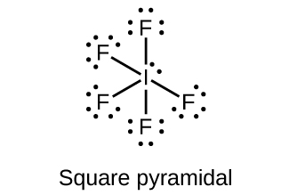
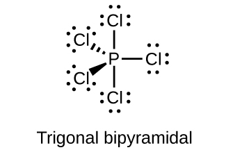
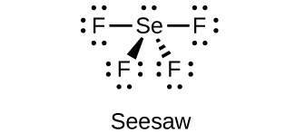
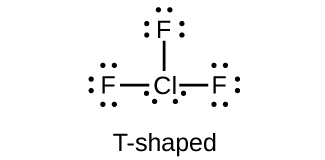

By the end of this section, you will be able to:
* Describe the preparation, properties, and uses of halogens
* Describe the properties, preparation, and uses of halogen compounds

The elements in group 17 are the halogens. These are the elements fluorine, chlorine, bromine, iodine, and astatine. These elements are too reactive to occur freely in nature, but their compounds are widely distributed. Chlorides are the most abundant; although fluorides, bromides, and iodides are less common, they are reasonably available. In this section, we will examine the occurrence, preparation, and properties of halogens. Next, we will examine halogen compounds with the representative metals followed by an examination of the interhalogens. This section will conclude with some applications of halogens.

### Occurrence and Preparation

All of the halogens occur in seawater as halide ions. The concentration of the chloride ion is 0.54 *M*; that of the other halides is less than 10–4 *M*. Fluoride also occurs in minerals such as CaF2, Ca(PO4)3F, and Na3AlF6. Chloride also occurs in the Great Salt Lake and the Dead Sea, and in extensive salt beds that contain NaCl, KCl, or MgCl2. Part of the chlorine in your body is present as hydrochloric acid, which is a component of stomach acid. Bromine compounds occur in the Dead Sea and underground brines. Iodine compounds are found in small quantities in Chile saltpeter, underground brines, and sea kelp. Iodine is essential to the function of the thyroid gland.

The best sources of halogens (except iodine) are halide salts. It is possible to oxidize the halide ions to free diatomic halogen molecules by various methods, depending on the ease of oxidation of the halide ion. Fluoride is the most difficult to oxidize, whereas iodide is the easiest.

The major method for preparing fluorine is electrolytic oxidation. The most common electrolysis procedure is to use a molten mixture of potassium hydrogen fluoride, KHF2, and anhydrous hydrogen fluoride. Electrolysis causes HF to decompose, forming fluorine gas at the anode and hydrogen at the cathode. It is necessary to keep the two gases separated to prevent their explosive recombination to reform hydrogen fluoride.

Most commercial chlorine comes from the electrolysis of the chloride ion in aqueous solutions of sodium chloride; this is the chlor-alkali process discussed previously. Chlorine is also a product of the electrolytic production of metals such as sodium, calcium, and magnesium from their fused chlorides. It is also possible to prepare chlorine by the chemical oxidation of the chloride ion in acid solution with strong oxidizing agents such as manganese dioxide (MnO2) or sodium dichromate (Na2Cr2O7). The reaction with manganese dioxide is:

<math xmlns="http://www.w3.org/1998/Math/MathML"><mrow><msub><mrow><mtext>MnO</mtext></mrow><mn>2</mn></msub><mo stretchy="false">(</mo><mi>s</mi><mo stretchy="false">)</mo><mo>+</mo><mn>2</mn><msup><mrow><mtext>Cl</mtext></mrow><mtext>−</mtext></msup><mo stretchy="false">(</mo><mi>a</mi><mi>q</mi><mo stretchy="false">)</mo><mo>+</mo><mn>4</mn><msub><mtext>H</mtext><mn>3</mn></msub><msup><mtext>O</mtext><mtext>+</mtext></msup><mo stretchy="false">(</mo><mi>a</mi><mi>q</mi><mo stretchy="false">)</mo><mspace width="0.2em" /><mo stretchy="false">⟶</mo><mspace width="0.2em" /><msup><mrow><mtext>Mn</mtext></mrow><mrow><mn>2+</mn></mrow></msup><mo stretchy="false">(</mo><mi>a</mi><mi>q</mi><mo stretchy="false">)</mo><mo>+</mo><msub><mrow><mtext>Cl</mtext></mrow><mn>2</mn></msub><mo stretchy="false">(</mo><mi>g</mi><mo stretchy="false">)</mo><mo>+</mo><mn>6</mn><msub><mtext>H</mtext><mn>2</mn></msub><mtext>O</mtext><mo stretchy="false">(</mo><mi>l</mi><mo stretchy="false">)</mo></mrow></math>

The commercial preparation of bromine involves the oxidation of bromide ion by chlorine:

<math xmlns="http://www.w3.org/1998/Math/MathML"><mrow><mn>2</mn><msup><mrow><mtext>Br</mtext></mrow><mtext>−</mtext></msup><mo stretchy="false">(</mo><mi>a</mi><mi>q</mi><mo stretchy="false">)</mo><mo>+</mo><msub><mrow><mtext>Cl</mtext></mrow><mn>2</mn></msub><mo stretchy="false">(</mo><mi>g</mi><mo stretchy="false">)</mo><mspace width="0.2em" /><mo stretchy="false">⟶</mo><mspace width="0.2em" /><msub><mrow><mtext>Br</mtext></mrow><mn>2</mn></msub><mo stretchy="false">(</mo><mi>l</mi><mo stretchy="false">)</mo><mo>+</mo><mn>2</mn><msup><mrow><mtext>Cl</mtext></mrow><mtext>−</mtext></msup><mo stretchy="false">(</mo><mi>a</mi><mi>q</mi><mo stretchy="false">)</mo></mrow></math>

Chlorine is a stronger oxidizing agent than bromine. This method is important for the production of essentially all domestic bromine.

Some iodine comes from the oxidation of iodine chloride, ICl, or iodic acid, HlO3. The commercial preparation of iodine utilizes the reduction of sodium iodate, NaIO3, an impurity in deposits of Chile saltpeter, with sodium hydrogen sulfite:

<math xmlns="http://www.w3.org/1998/Math/MathML"><mrow><mn>2</mn><msub><mrow><mtext>IO</mtext></mrow><mn>3</mn></msub><msup><mrow /><mtext>−</mtext></msup><mo stretchy="false">(</mo><mi>a</mi><mi>q</mi><mo stretchy="false">)</mo><mo>+</mo><mn>5</mn><msub><mrow><mtext>HSO</mtext></mrow><mn>3</mn></msub><msup><mrow /><mtext>−</mtext></msup><mo stretchy="false">(</mo><mi>a</mi><mi>q</mi><mo stretchy="false">)</mo><mspace width="0.2em" /><mo stretchy="false">⟶</mo><mspace width="0.2em" /><mn>3</mn><msub><mrow><mtext>HSO</mtext></mrow><mn>4</mn></msub><msup><mrow /><mtext>−</mtext></msup><mo stretchy="false">(</mo><mi>a</mi><mi>q</mi><mo stretchy="false">)</mo><mo>+</mo><mn>2</mn><msub><mrow><mtext>SO</mtext></mrow><mn>4</mn></msub><msup><mrow /><mrow><mn>2−</mn></mrow></msup><mo stretchy="false">(</mo><mi>a</mi><mi>q</mi><mo stretchy="false">)</mo><mo>+</mo><msub><mtext>H</mtext><mn>2</mn></msub><mtext>O</mtext><mo stretchy="false">(</mo><mi>l</mi><mo stretchy="false">)</mo><mo>+</mo><msub><mtext>I</mtext><mn>2</mn></msub><mo stretchy="false">(</mo><mi>s</mi><mo stretchy="false">)</mo></mrow></math>

### Properties of the Halogens

Fluorine is a pale yellow gas, chlorine is a greenish-yellow gas, bromine is a deep reddish-brown liquid, and iodine is a grayish-black crystalline solid. Liquid bromine has a high vapor pressure, and the reddish vapor is readily visible in [\[link\]](#CNX_Chem_18_11_Gases). Iodine crystals have a noticeable vapor pressure. When gently heated, these crystals sublime and form a beautiful deep violet vapor.

 , gaseous bromine is deep orange (center), and gaseous iodine is purple (right). (Fluorine is so reactive that it is too dangerous to handle.) (credit: Sahar Atwa)"){: #CNX_Chem_18_11_Gases}

Bromine is only slightly soluble in water, but it is miscible in all proportions in less polar (or nonpolar) solvents such as chloroform, carbon tetrachloride, and carbon disulfide, forming solutions that vary from yellow to reddish-brown, depending on the concentration.

Iodine is soluble in chloroform, carbon tetrachloride, carbon disulfide, and many hydrocarbons, giving violet solutions of I2 molecules. Iodine dissolves only slightly in water, giving brown solutions. It is quite soluble in aqueous solutions of iodides, with which it forms brown solutions. These brown solutions result because iodine molecules have empty valence *d* orbitals and can act as weak Lewis acids towards the iodide ion. The equation for the reversible reaction of iodine (Lewis acid) with the iodide ion (Lewis base) to form triiodide ion, <math xmlns="http://www.w3.org/1998/Math/MathML"><mrow><msub><mtext>I</mtext><mn>3</mn></msub><msup><mrow /><mtext>−</mtext></msup><mo>,</mo></mrow></math>

 is:

<math xmlns="http://www.w3.org/1998/Math/MathML"><mrow><msub><mtext>I</mtext><mn>2</mn></msub><mo stretchy="false">(</mo><mi>s</mi><mo stretchy="false">)</mo><mo>+</mo><msup><mtext>I</mtext><mtext>−</mtext></msup><mo stretchy="false">(</mo><mi>a</mi><mi>q</mi><mo stretchy="false">)</mo><mspace width="0.2em" /><mo stretchy="false">⟶</mo><mspace width="0.2em" /><msub><mtext>I</mtext><mn>3</mn></msub><msup><mrow /><mtext>−</mtext></msup><mo stretchy="false">(</mo><mi>a</mi><mi>q</mi><mo stretchy="false">)</mo></mrow></math>

The easier it is to oxidize the halide ion, the more difficult it is for the halogen to act as an oxidizing agent. Fluorine generally oxidizes an element to its highest oxidation state, whereas the heavier halogens may not. For example, when excess fluorine reacts with sulfur, SF6 forms. Chlorine gives SCl2 and bromine, S2Br2. Iodine does not react with sulfur.

Fluorine is the most powerful oxidizing agent of the known elements. It spontaneously oxidizes most other elements; therefore, the reverse reaction, the oxidation of fluorides, is very difficult to accomplish. Fluorine reacts directly and forms binary fluorides with all of the elements except the lighter noble gases (He, Ne, and Ar). Fluorine is such a strong oxidizing agent that many substances ignite on contact with it. Drops of water inflame in fluorine and form O2, OF2, H2O2, O3, and HF. Wood and asbestos ignite and burn in fluorine gas. Most hot metals burn vigorously in fluorine. However, it is possible to handle fluorine in copper, iron, or nickel containers because an adherent film of the fluoride salt passivates their surfaces. Fluorine is the only element that reacts directly with the noble gas xenon.

Although it is a strong oxidizing agent, chlorine is less active than fluorine. Mixing chlorine and hydrogen in the dark makes the reaction between them to be imperceptibly slow. Exposure of the mixture to light causes the two to react explosively. Chlorine is also less active towards metals than fluorine, and oxidation reactions usually require higher temperatures. Molten sodium ignites in chlorine. Chlorine attacks most nonmetals (C, N2, and O2 are notable exceptions), forming covalent molecular compounds. Chlorine generally reacts with compounds that contain only carbon and hydrogen (hydrocarbons) by adding to multiple bonds or by substitution.

In cold water, chlorine undergoes a disproportionation reaction:

<math xmlns="http://www.w3.org/1998/Math/MathML"><mrow><msub><mrow><mtext>Cl</mtext></mrow><mn>2</mn></msub><mo stretchy="false">(</mo><mi>a</mi><mi>q</mi><mo stretchy="false">)</mo><mo>+</mo><mn>2</mn><msub><mtext>H</mtext><mn>2</mn></msub><mtext>O</mtext><mo stretchy="false">(</mo><mi>l</mi><mo stretchy="false">)</mo><mspace width="0.2em" /><mo stretchy="false">⟶</mo><mspace width="0.2em" /><mtext>HOCl</mtext><mo stretchy="false">(</mo><mi>a</mi><mi>q</mi><mo stretchy="false">)</mo><mo>+</mo><msub><mtext>H</mtext><mn>3</mn></msub><msup><mtext>O</mtext><mtext>+</mtext></msup><mo stretchy="false">(</mo><mi>a</mi><mi>q</mi><mo stretchy="false">)</mo><mo>+</mo><msup><mrow><mtext>Cl</mtext></mrow><mtext>−</mtext></msup><mo stretchy="false">(</mo><mi>a</mi><mi>q</mi><mo stretchy="false">)</mo></mrow></math>

Half the chlorine atoms oxidize to the 1+ oxidation state (hypochlorous acid), and the other half reduce to the 1− oxidation state (chloride ion). This disproportionation is incomplete, so chlorine water is an equilibrium mixture of chlorine molecules, hypochlorous acid molecules, hydronium ions, and chloride ions. When exposed to light, this solution undergoes a photochemical decomposition:

<math xmlns="http://www.w3.org/1998/Math/MathML"><mrow><mtext>2HOCl</mtext><mo stretchy="false">(</mo><mi>a</mi><mi>q</mi><mo stretchy="false">)</mo><mo>+</mo><mn>2</mn><msub><mtext>H</mtext><mn>2</mn></msub><mtext>O</mtext><mo stretchy="false">(</mo><mi>l</mi><mo stretchy="false">)</mo><mspace width="0.2em" /><mover><mo>→</mo><mrow><mspace width="0.5em" /><mtext>sunlight</mtext><mspace width="0.5em" /></mrow></mover><mspace width="0.2em" /><mn>2</mn><msub><mtext>H</mtext><mn>3</mn></msub><msup><mtext>O</mtext><mtext>+</mtext></msup><mo stretchy="false">(</mo><mi>a</mi><mi>q</mi><mo stretchy="false">)</mo><mo>+</mo><mn>2</mn><msup><mrow><mtext>Cl</mtext></mrow><mtext>−</mtext></msup><mo stretchy="false">(</mo><mi>a</mi><mi>q</mi><mo stretchy="false">)</mo><mo>+</mo><msub><mtext>O</mtext><mn>2</mn></msub><mo stretchy="false">(</mo><mi>g</mi><mo stretchy="false">)</mo></mrow></math>

The nonmetal chlorine is more electronegative than any other element except fluorine, oxygen, and nitrogen. In general, very electronegative elements are good oxidizing agents; therefore, we would expect elemental chlorine to oxidize all of the other elements except for these three (and the nonreactive noble gases). Its oxidizing property, in fact, is responsible for its principal use. For example, phosphorus(V) chloride, an important intermediate in the preparation of insecticides and chemical weapons, is manufactured by oxidizing the phosphorus with chlorine:

<math xmlns="http://www.w3.org/1998/Math/MathML"><mrow><msub><mtext>P</mtext><mn>4</mn></msub><mo stretchy="false">(</mo><mi>s</mi><mo stretchy="false">)</mo><mo>+</mo><mn>10</mn><msub><mrow><mtext>Cl</mtext></mrow><mn>2</mn></msub><mo stretchy="false">(</mo><mi>g</mi><mo stretchy="false">)</mo><mspace width="0.2em" /><mo stretchy="false">⟶</mo><mspace width="0.2em" /><mn>4</mn><msub><mrow><mtext>PCl</mtext></mrow><mn>5</mn></msub><mo stretchy="false">(</mo><mi>l</mi><mo stretchy="false">)</mo></mrow></math>

A great deal of chlorine is also used to oxidize, and thus to destroy, organic or biological materials in water purification and in bleaching.

The chemical properties of bromine are similar to those of chlorine, although bromine is the weaker oxidizing agent and its reactivity is less than that of chlorine.

Iodine is the least reactive of the halogens. It is the weakest oxidizing agent, and the iodide ion is the most easily oxidized halide ion. Iodine reacts with metals, but heating is often required. It does not oxidize other halide ions.

Compared with the other halogens, iodine reacts only slightly with water. Traces of iodine in water react with a mixture of starch and iodide ion, forming a deep blue color. This reaction is a very sensitive test for the presence of iodine in water.

### Halides of the Representative Metals

Thousands of salts of the representative metals have been prepared. The binary halides are an important subclass of salts. A salt is an ionic compound composed of cations and anions, other than hydroxide or oxide ions. In general, it is possible to prepare these salts from the metals or from oxides, hydroxides, or carbonates. We will illustrate the general types of reactions for preparing salts through reactions used to prepare binary halides.

The binary compounds of a metal with the halogens are the **halides**{: data-type="term"}. Most binary halides are ionic. However, mercury, the elements of group 13 with oxidation states of 3+, tin(IV), and lead(IV) form covalent binary halides.

The direct reaction of a metal and a halogen produce the halide of the metal. Examples of these oxidation-reduction reactions include:

<math xmlns="http://www.w3.org/1998/Math/MathML"><mrow><mtext>Cd</mtext><mo stretchy="false">(</mo><mi>s</mi><mo stretchy="false">)</mo><mo>+</mo><msub><mrow><mtext>Cl</mtext></mrow><mn>2</mn></msub><mo stretchy="false">(</mo><mi>g</mi><mo stretchy="false">)</mo><mspace width="0.2em" /><mo stretchy="false">⟶</mo><mspace width="0.2em" /><msub><mrow><mtext>CdCl</mtext></mrow><mn>2</mn></msub><mo stretchy="false">(</mo><mi>s</mi><mo stretchy="false">)</mo></mrow></math>

<math xmlns="http://www.w3.org/1998/Math/MathML"><mrow><mtext>2Ga</mtext><mo stretchy="false">(</mo><mi>l</mi><mo stretchy="false">)</mo><mo>+</mo><mn>3</mn><msub><mrow><mtext>Br</mtext></mrow><mn>2</mn></msub><mo stretchy="false">(</mo><mi>l</mi><mo stretchy="false">)</mo><mspace width="0.2em" /><mo stretchy="false">⟶</mo><mspace width="0.2em" /><mn>2</mn><msub><mrow><mtext>GaBr</mtext></mrow><mn>3</mn></msub><mo stretchy="false">(</mo><mi>s</mi><mo stretchy="false">)</mo></mrow></math>

  
Reactions of the alkali metals with elemental halogens are very exothermic and often quite violent. Under controlled conditions, they provide exciting demonstrations for budding students of chemistry. You can view the [initial heating][1] of the sodium that removes the coating of sodium hydroxide, sodium peroxide, and residual mineral oil to expose the reactive surface. The reaction with chlorine gas then proceeds very nicely.

If a metal can exhibit two oxidation states, it may be necessary to control the stoichiometry in order to obtain the halide with the lower oxidation state. For example, preparation of tin(II) chloride requires a 1:1 ratio of Sn to Cl2, whereas preparation of tin(IV) chloride requires a 1:2 ratio:

<math xmlns="http://www.w3.org/1998/Math/MathML"><mrow><mtext>Sn</mtext><mo stretchy="false">(</mo><mi>s</mi><mo stretchy="false">)</mo><mo>+</mo><msub><mrow><mtext>Cl</mtext></mrow><mn>2</mn></msub><mo stretchy="false">(</mo><mi>g</mi><mo stretchy="false">)</mo><mspace width="0.2em" /><mo stretchy="false">⟶</mo><mspace width="0.2em" /><msub><mrow><mtext>SnCl</mtext></mrow><mn>2</mn></msub><mo stretchy="false">(</mo><mi>s</mi><mo stretchy="false">)</mo></mrow></math>

<math xmlns="http://www.w3.org/1998/Math/MathML"><mrow><mtext>Sn</mtext><mo stretchy="false">(</mo><mi>s</mi><mo stretchy="false">)</mo><mo>+</mo><mn>2</mn><msub><mrow><mtext>Cl</mtext></mrow><mn>2</mn></msub><mo stretchy="false">(</mo><mi>g</mi><mo stretchy="false">)</mo><mspace width="0.2em" /><mo stretchy="false">⟶</mo><mspace width="0.2em" /><msub><mrow><mtext>SnCl</mtext></mrow><mn>4</mn></msub><mo stretchy="false">(</mo><mi>l</mi><mo stretchy="false">)</mo></mrow></math>

The active representative metals—those that are easier to oxidize than hydrogen—react with gaseous hydrogen halides to produce metal halides and hydrogen. The reaction of zinc with hydrogen fluoride is:

<math xmlns="http://www.w3.org/1998/Math/MathML"><mrow><mtext>Zn</mtext><mo stretchy="false">(</mo><mi>s</mi><mo stretchy="false">)</mo><mo>+</mo><mtext>2HF</mtext><mo stretchy="false">(</mo><mi>g</mi><mo stretchy="false">)</mo><mspace width="0.2em" /><mo stretchy="false">⟶</mo><mspace width="0.2em" /><msub><mrow><mtext>ZnF</mtext></mrow><mn>2</mn></msub><mo stretchy="false">(</mo><mi>s</mi><mo stretchy="false">)</mo><mo>+</mo><msub><mtext>H</mtext><mn>2</mn></msub><mo stretchy="false">(</mo><mi>g</mi><mo stretchy="false">)</mo></mrow></math>

The active representative metals also react with solutions of hydrogen halides to form hydrogen and solutions of the corresponding halides. Examples of such reactions include:

<math xmlns="http://www.w3.org/1998/Math/MathML"><mrow><mtext>Cd</mtext><mo stretchy="false">(</mo><mi>s</mi><mo stretchy="false">)</mo><mo>+</mo><mtext>2HBr</mtext><mo stretchy="false">(</mo><mi>a</mi><mi>q</mi><mo stretchy="false">)</mo><mspace width="0.2em" /><mo stretchy="false">⟶</mo><mspace width="0.2em" /><msub><mrow><mtext>CdBr</mtext></mrow><mn>2</mn></msub><mo stretchy="false">(</mo><mi>a</mi><mi>q</mi><mo stretchy="false">)</mo><mo>+</mo><msub><mtext>H</mtext><mn>2</mn></msub><mo stretchy="false">(</mo><mi>g</mi><mo stretchy="false">)</mo></mrow></math>

<math xmlns="http://www.w3.org/1998/Math/MathML"><mrow><mtext>Sn</mtext><mo stretchy="false">(</mo><mi>s</mi><mo stretchy="false">)</mo><mo>+</mo><mtext>2HI</mtext><mo stretchy="false">(</mo><mi>a</mi><mi>q</mi><mo stretchy="false">)</mo><mspace width="0.2em" /><mo stretchy="false">⟶</mo><mspace width="0.2em" /><msub><mrow><mtext>SnI</mtext></mrow><mn>2</mn></msub><mo stretchy="false">(</mo><mi>a</mi><mi>q</mi><mo stretchy="false">)</mo><mo>+</mo><msub><mtext>H</mtext><mn>2</mn></msub><mo stretchy="false">(</mo><mi>g</mi><mo stretchy="false">)</mo></mrow></math>

Hydroxides, carbonates, and some oxides react with solutions of the hydrogen halides to form solutions of halide salts. It is possible to prepare additional salts by the reaction of these hydroxides, carbonates, and oxides with aqueous solution of other acids:

<math xmlns="http://www.w3.org/1998/Math/MathML"><mrow><msub><mrow><mtext>CaCo</mtext></mrow><mn>3</mn></msub><mo stretchy="false">(</mo><mi>s</mi><mo stretchy="false">)</mo><mo>+</mo><mtext>2HCl</mtext><mo stretchy="false">(</mo><mi>a</mi><mi>q</mi><mo stretchy="false">)</mo><mspace width="0.2em" /><mo stretchy="false">⟶</mo><mspace width="0.2em" /><msub><mrow><mtext>CaCl</mtext></mrow><mn>2</mn></msub><mo stretchy="false">(</mo><mi>a</mi><mi>q</mi><mo stretchy="false">)</mo><mo>+</mo><msub><mrow><mtext>CO</mtext></mrow><mn>2</mn></msub><mo stretchy="false">(</mo><mi>g</mi><mo stretchy="false">)</mo><mo>+</mo><msub><mtext>H</mtext><mn>2</mn></msub><mtext>O</mtext><mo stretchy="false">(</mo><mi>l</mi><mo stretchy="false">)</mo></mrow></math>

<math xmlns="http://www.w3.org/1998/Math/MathML"><mrow><mtext>TlOH</mtext><mo stretchy="false">(</mo><mi>a</mi><mi>q</mi><mo stretchy="false">)</mo><mo>+</mo><mtext>HF</mtext><mo stretchy="false">(</mo><mi>a</mi><mi>q</mi><mo stretchy="false">)</mo><mspace width="0.2em" /><mo stretchy="false">⟶</mo><mspace width="0.2em" /><mtext>TlF</mtext><mo stretchy="false">(</mo><mi>a</mi><mi>q</mi><mo stretchy="false">)</mo><mo>+</mo><msub><mtext>H</mtext><mn>2</mn></msub><mtext>O</mtext><mo stretchy="false">(</mo><mi>l</mi><mo stretchy="false">)</mo></mrow></math>

A few halides and many of the other salts of the representative metals are insoluble. It is possible to prepare these soluble salts by metathesis reactions that occur when solutions of soluble salts are mixed (see [\[link\]](#CNX_Chem_18_11_PercipHgI2)). Metathesis reactions are examined in the chapter on the stoichiometry of chemical reactions.

 2 are mixed. (credit: Sahar Atwa)"){: #CNX_Chem_18_11_PercipHgI2}

Several halides occur in large quantities in nature. The ocean and underground brines contain many halides. For example, magnesium chloride in the ocean is the source of magnesium ions used in the production of magnesium. Large underground deposits of sodium chloride, like the salt mine shown in [\[link\]](#CNX_Chem_18_11_SaltMine), occur in many parts of the world. These deposits serve as the source of sodium and chlorine in almost all other compounds containing these elements. The chlor-alkali process is one example.

 "){: #CNX_Chem_18_11_SaltMine}

### Interhalogens

Compounds formed from two or more different halogens are **interhalogens**{: data-type="term"}. Interhalogen molecules consist of one atom of the heavier halogen bonded by single bonds to an odd number of atoms of the lighter halogen. The structures of IF3, IF5, and IF7 are illustrated in [\[link\]](#CNX_Chem_18_11_IF3IF5IF7). Formulas for other interhalogens, each of which comes from the reaction of the respective halogens, are in [\[link\]](#fs-idm73111648).

 ![Three ball-and-stick models are shown. The left structure, labeled, &#x201C;I F subscript 3,&#x201D; shows a purple atom labeled, &#x201C;I,&#x201D; bonded to three green atoms labeled, &#x201C;F,&#x201D; and with two lone pairs of electrons. The middle structure, labeled, &#x201C;I F subscript 5,&#x201D; shows a purple atom labeled, &#x201C;I,&#x201D; bonded to five green atoms labeled, &#x201C;F,&#x201D; and with one lone pair of electrons. The right image, labeled, &#x201C;I F subscript 7,&#x201D; shows a purple atom labeled, &#x201C;I,&#x201D; bonded to seven green atoms labeled, &#x201C;F.&#x201D;](../resources/CNX_Chem_18_11_IF3IF5IF7.jpg "The structure of IF3 is T-shaped (left), IF5 is square pyramidal (center), and IF7 is pentagonal bipyramidal (right)."){: #CNX_Chem_18_11_IF3IF5IF7}

Note from [\[link\]](#fs-idm73111648) that fluorine is able to oxidize iodine to its maximum oxidation state, 7+, whereas bromine and chlorine, which are more difficult to oxidize, achieve only the 5+-oxidation state. A 7+-oxidation state is the limit for the halogens. Because smaller halogens are grouped about a larger one, the maximum number of smaller atoms possible increases as the radius of the larger atom increases. Many of these compounds are unstable, and most are extremely reactive. The interhalogens react like their component halides; halogen fluorides, for example, are stronger oxidizing agents than are halogen chlorides.

The ionic polyhalides of the alkali metals, such as KI3, KICl2, KICl4, CsIBr2, and CsBrCl2, which contain an anion composed of at least three halogen atoms, are closely related to the interhalogens. As seen previously, the formation of the polyhalide anion <math xmlns="http://www.w3.org/1998/Math/MathML"><mrow><msub><mtext>I</mtext><mrow><mn>3</mn></mrow></msub><msup><mrow /><mrow><mo>−</mo></mrow></msup></mrow></math>

 is responsible for the solubility of iodine in aqueous solutions containing an iodide ion.

<table summary="This table has four columns and seven rows. The first row is a header row, and it labels each column, &#x201C;Y X,&#x201D; &#x201C;Y X subscript 3,&#x201D; &#x201C;Y X subscript 5,&#x201D; &#x201C;Y X subscript 7.&#x201D; Under the &#x201C;Y X&#x201D; column are the following: C l F ( g ); B r F ( g ); B r C l ( g ); I F ( s ); I C l ( l ); I B r ( s ). Under the &#x201C;Y X subscript 3&#x201D; column are the following: C l F subscript 3 ( g ); B r F subscript 3 ( l ); a blank row; I F subscript 3 ( s ); I C l subscript 3 ( s ); and another blank row. Under the column &#x201C;Y X subscript 5,&#x201D; are the following: C l F subscript 5 ( g ); B r F subscript 5 ( l ); a blank row; I F subscript 5 ( l ); and two blank rows. Under the column &#x201C;Y X subscript 7,&#x201D; are three blank rows; I F subscript 7 ( g ); and two blank rows." class="span-all"><thead>
<tr>
<th colspan="4" data-align="center">Interhalogens</th>
</tr>
<tr valign="top">
<th data-align="left">YX</th>
<th data-align="left">YX3</th>
<th data-align="left">YX5</th>
<th data-align="left">YX7</th>
</tr>
</thead><tbody>
<tr valign="top">
<td data-align="left">ClF(<em>g</em>)</td>
<td data-align="left">ClF3(<em>g</em>)</td>
<td data-align="left">ClF5(<em>g</em>)</td>
<td data-align="left" />
</tr>
<tr valign="top">
<td data-align="left">BrF(<em>g</em>)</td>
<td data-align="left">BrF3(<em>l</em>)</td>
<td data-align="left">BrF5(<em>l</em>)</td>
<td data-align="left" />
</tr>
<tr valign="top">
<td data-align="left">BrCl(<em>g</em>)</td>
<td data-align="left" />
<td data-align="left" />
<td data-align="left" />
</tr>
<tr valign="top">
<td data-align="left">IF(<em>s</em>)</td>
<td data-align="left">IF3(<em>s</em>)</td>
<td data-align="left">IF5(<em>l</em>)</td>
<td data-align="left">IF7(<em>g</em>)</td>
</tr>
<tr valign="top">
<td data-align="left">ICl(<em>l</em>)</td>
<td data-align="left">ICl3(<em>s</em>)</td>
<td data-align="left" />
<td data-align="left" />
</tr>
<tr valign="top">
<td data-align="left">IBr(<em>s</em>)</td>
<td data-align="left" />
<td data-align="left" />
<td data-align="left" />
</tr>
</tbody></table>

### Applications

The fluoride ion and fluorine compounds have many important uses. Compounds of carbon, hydrogen, and fluorine are replacing Freons (compounds of carbon, chlorine, and fluorine) as refrigerants. Teflon is a polymer composed of –CF2CF2– units. Fluoride ion is added to water supplies and to some toothpastes as SnF2 or NaF to fight tooth decay. Fluoride partially converts teeth from Ca5(PO4)3(OH) into Ca5(PO4)3F.

Chlorine is important to bleach wood pulp and cotton cloth. The chlorine reacts with water to form hypochlorous acid, which oxidizes colored substances to colorless ones. Large quantities of chlorine are important in chlorinating hydrocarbons (replacing hydrogen with chlorine) to produce compounds such as tetrachloride (CCl4), chloroform (CHCl3), and ethyl chloride (C2H5Cl), and in the production of polyvinyl chloride (PVC) and other polymers. Chlorine is also important to kill the bacteria in community water supplies.

Bromine is important in the production of certain dyes, and sodium and potassium bromides are used as sedatives. At one time, light-sensitive silver bromide was a component of photographic film.

Iodine in alcohol solution with potassium iodide is an antiseptic (tincture of iodine). Iodide salts are essential for the proper functioning of the thyroid gland; an iodine deficiency may lead to the development of a goiter. Iodized table salt contains 0.023% potassium iodide. Silver iodide is useful in the seeding of clouds to induce rain; it was important in the production of photographic film and iodoform, CHI3, is an antiseptic.

### Key Concepts and Summary

The halogens form halides with less electronegative elements. Halides of the metals vary from ionic to covalent; halides of nonmetals are covalent. Interhalogens form by the combination of two or more different halogens.

All of the representative metals react directly with elemental halogens or with solutions of the hydrohalic acids (HF, HCl, HBr, and HI) to produce representative metal halides. Other laboratory preparations involve the addition of aqueous hydrohalic acids to compounds that contain such basic anions, such as hydroxides, oxides, or carbonates.

### Chemistry End of Chapter Exercises

What does it mean to say that mercury(II) halides are weak electrolytes?

Why is SnCl4 not classified as a salt?

SnCl4 is not a salt because it is covalently bonded. A salt must have ionic bonds.

The following reactions are all similar to those of the industrial chemicals. Complete and balance the equations for these reactions:

(a) reaction of a weak base and a strong acid* * *
{: data-type="newline"}

 <math xmlns="http://www.w3.org/1998/Math/MathML"><mrow><msub><mrow><mtext>NH</mtext></mrow><mn>3</mn></msub><mo>+</mo><msub><mrow><mtext>HClO</mtext></mrow><mn>4</mn></msub><mspace width="0.2em" /><mo stretchy="false">⟶</mo></mrow></math>

(b) preparation of a soluble silver salt for silver plating* * *
{: data-type="newline"}

 <math xmlns="http://www.w3.org/1998/Math/MathML"><mrow><msub><mrow><mtext>Ag</mtext></mrow><mn>2</mn></msub><msub><mrow><mtext>CO</mtext></mrow><mn>3</mn></msub><mo>+</mo><msub><mrow><mtext>HNO</mtext></mrow><mn>3</mn></msub><mspace width="0.2em" /><mo stretchy="false">⟶</mo></mrow></math>

(c) preparation of strontium hydroxide by electrolysis of a solution of strontium chloride* * *
{: data-type="newline"}

 <math xmlns="http://www.w3.org/1998/Math/MathML"><mrow><msub><mrow><mtext>SrCl</mtext></mrow><mn>2</mn></msub><mo stretchy="false">(</mo><mi>a</mi><mi>q</mi><mo stretchy="false">)</mo><mo>+</mo><msub><mtext>H</mtext><mn>2</mn></msub><mtext>O</mtext><mo stretchy="false">(</mo><mi>l</mi><mo stretchy="false">)</mo><mspace width="0.2em" /><mover><mo>→</mo><mrow><mspace width="0.5em" /><mtext>electrolysis</mtext><mspace width="0.5em" /></mrow></mover></mrow></math>

Which is the stronger acid, HClO3 or HBrO3? Why?

In oxyacids with similar formulas, the acid strength increases as the electronegativity of the central atom increases. HClO3 is stronger than HBrO3; Cl is more electronegative than Br.

What is the hybridization of iodine in IF3 and IF5?

Predict the molecular geometries and draw Lewis structures for each of the following. You may wish to review the chapter on chemical bonding and molecular geometry.

(a) IF5

(b) <math xmlns="http://www.w3.org/1998/Math/MathML"><mrow><msub><mtext>I</mtext><mn>3</mn></msub><msup><mrow /><mo>−</mo></msup></mrow></math>

(c) PCl5

(d) SeF4

(e) ClF3

(a)* * *
{: data-type="newline"}

  
;* * *
{: data-type="newline"}

 (b)* * *
{: data-type="newline"}

  
;* * *
{: data-type="newline"}

 (c)* * *
{: data-type="newline"}

  
;* * *
{: data-type="newline"}

 (d)* * *
{: data-type="newline"}

  
;* * *
{: data-type="newline"}

 (e)* * *
{: data-type="newline"}

  

Which halogen has the highest ionization energy? Is this what you would predict based on what you have learned about periodic properties?

Name each of the following compounds:

(a) BrF3

(b) NaBrO3

(c) PBr5

(d) NaClO4

(e) KClO

(a) bromine trifluoride; (b) sodium bromate; (c) phosphorus pentabromide; (d) sodium perchlorate; (e) potassium hypochlorite

Explain why, at room temperature, fluorine and chlorine are gases, bromine is a liquid, and iodine is a solid.

What is the oxidation state of the halogen in each of the following?

(a) H5IO6

(b) <math xmlns="http://www.w3.org/1998/Math/MathML"><mrow><msub><mrow><mtext>IO</mtext></mrow><mn>4</mn></msub><msup><mrow /><mo>−</mo></msup></mrow></math>

(c) ClO2

(d) ICl3

(e) F2

(a) I: 7+; (b) I: 7+; (c) Cl: 4+; (d) I: 3+; Cl: 1−; (e) F: 0

Physiological saline concentration—that is, the sodium chloride concentration in our bodies—is approximately 0.16 *M*. A saline solution for contact lenses is prepared to match the physiological concentration. If you purchase 25 mL of contact lens saline solution, how many grams of sodium chloride have you bought?

[1]: http://openstaxcollege.org/l/16sodium
