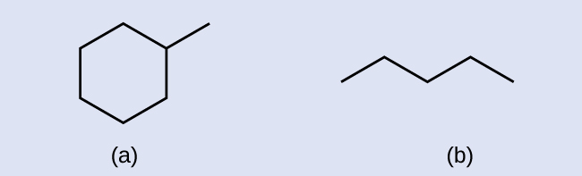
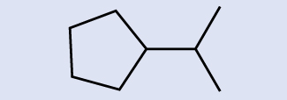
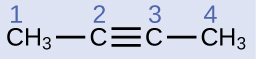
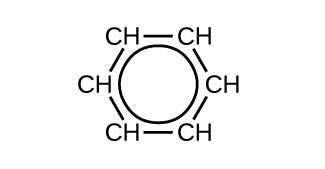
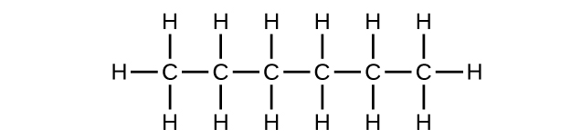

By the end of this section, you will be able to:
* Explain the importance of hydrocarbons and the reason for their diversity
* Name saturated and unsaturated hydrocarbons, and molecules derived from them
* Describe the reactions characteristic of saturated and unsaturated hydrocarbons
* Identify structural and geometric isomers of hydrocarbons

The largest database[1](#footnote1){: data-type="footnote-link"} of organic compounds lists about 10 million substances, which include compounds originating from living organisms and those synthesized by chemists. The number of potential organic compounds has been estimated[2](#footnote2){: data-type="footnote-link"} at 1060—an astronomically high number. The existence of so many organic molecules is a consequence of the ability of carbon atoms to form up to four strong bonds to other carbon atoms, resulting in chains and rings of many different sizes, shapes, and complexities.

The simplest **organic compounds**{: data-type="term"} contain only the elements carbon and hydrogen, and are called hydrocarbons. Even though they are composed of only two types of atoms, there is a wide variety of hydrocarbons because they may consist of varying lengths of chains, branched chains, and rings of carbon atoms, or combinations of these structures. In addition, hydrocarbons may differ in the types of carbon-carbon bonds present in their molecules. Many hydrocarbons are found in plants, animals, and their fossils; other hydrocarbons have been prepared in the laboratory. We use hydrocarbons every day, mainly as fuels, such as natural gas, acetylene, propane, butane, and the principal components of gasoline, diesel fuel, and heating oil. The familiar plastics polyethylene, polypropylene, and polystyrene are also hydrocarbons. We can distinguish several types of hydrocarbons by differences in the bonding between carbon atoms. This leads to differences in geometries and in the hybridization of the carbon orbitals.

### Alkanes

**Alkanes**{: data-type="term"}, or **saturated hydrocarbons**{: data-type="term"}, contain only single covalent bonds between carbon atoms. Each of the carbon atoms in an alkane has *sp*3 hybrid orbitals and is bonded to four other atoms, each of which is either carbon or hydrogen. The Lewis structures and models of methane, ethane, and pentane are illustrated in [\[link\]](#CNX_Chem_20_01_alkanes). Carbon chains are usually drawn as straight lines in Lewis structures, but one has to remember that Lewis structures are not intended to indicate the geometry of molecules. Notice that the carbon atoms in the structural models (the ball-and-stick and space-filling models) of the pentane molecule do not lie in a straight line. Because of the *sp*3 hybridization, the bond angles in carbon chains are close to 109.5°, giving such chains in an alkane a zigzag shape.

The structures of alkanes and other organic molecules may also be represented in a less detailed manner by condensed structural formulas (or simply, *condensed formulas*). Instead of the usual format for chemical formulas in which each element symbol appears just once, a condensed formula is written to suggest the bonding in the molecule. These formulas have the appearance of a Lewis structure from which most or all of the bond symbols have been removed. Condensed structural formulas for ethane and pentane are shown at the bottom of [\[link\]](#CNX_Chem_20_01_alkanes), and several additional examples are provided in the exercises at the end of this chapter.

 ![The figure illustrates four ways to represent molecules for molecules of methane, ethane, and pentane. In the first row of the figure, Lewis structural formulas show element symbols and bonds between atoms. Methane has a central C atom with four H atoms bonded to it. Ethane has a C atom with three H atoms bonded to it. The C atom is also bonded to another C atom with three H atoms bonded to it. Pentane has a C atom with three H atoms bonded to it. The C atom is bonded to another C atom with two H atoms bonded to it. The C atom is bonded to another C atom with two H atoms bonded to it. The C atom is bonded to another C atom with two H atoms bonded to it. The C atom is bonded to another C atom with three H atoms bonded to it. In the second row, ball-and-stick models are shown. In these representations, bonds are represented with sticks, and elements are represented with balls. Carbon atoms are black and hydrogen atoms are white in this image. In the third row, space-filling models are shown. In these models, atoms are enlarged and pushed together, without sticks to represent bonds. The molecule names and structural formulas are provided in the fourth row. Methane is named and represented with a condensed structural formula as C H subscript 4. Ethane is named and represented with two structural formulas C H subscript 3 C H subscript 3 and C subscript 2 H subscript 6. Pentane is named and represented as both C H subscript 3 C H subscript 2 C H subscript 2 C H subscript 2 C H subscript 3 and C subscript 5 H subscript 12.](../resources/CNX_Chem_20_01_alkanes.jpg "Pictured are the Lewis structures, ball-and-stick models, and space-filling models for molecules of methane, ethane, and pentane."){: #CNX_Chem_20_01_alkanes}

A common method used by organic chemists to simplify the drawings of larger molecules is to use a **skeletal structure**{: data-type="term"} (also called a line-angle structure). In this type of structure, carbon atoms are not symbolized with a C, but represented by each end of a line or bend in a line. Hydrogen atoms are not drawn if they are attached to a carbon. Other atoms besides carbon and hydrogen are represented by their elemental symbols. [\[link\]](#CNX_Chem_20_01_LineStruct1) shows three different ways to draw the same structure.

 ![In this figure, a hydrocarbon molecule is shown in three ways. First, an expanded formula shows all individual carbon atoms, hydrogen atoms, and bonds in a branched hydrocarbon molecule. An initial C atom is bonded to three H atoms. The C atom is bonded to another C atom in the chain. This second C atom is bonded to one H atom and another C atom above the chain. The C atom bonded above the second C atom in the chain is bonded to three H atoms. The second C atom in the chain is bonded to a third C atom in the chain. This third C atom is bonded to on H atom and another C atom below the chain. This C atom is bonded to two H atoms and another C atom below the chain. This second C atom below the chain is bonded to three H atoms. The third C atom in the chain is bonded to a fourth C atom in the chain. The fourth C atom is bonded to two H atoms and a fifth C atom. The fifth C atom is bonded to two H atoms and a sixth C atom. The sixth C atom is bonded to three H atoms. Second, a condensed formula shows each carbon atom of the molecule in clusters with the hydrogen atoms bonded to it, leaving C H, C H subscript 2, and C H subscript 3 groups with bonds between them. The structure shows a C H subscript 3 group bonded to a C H group. The C H group is bonded above to a C H subscript 3 group. The C H group is also bonded to another C H group. This C H group is bonded to a C H subscript 2 group below and a C H subscript 3 group below that. This C H group is also bonded to a C H subscript 2 group which is bonded to another C H subscript 2 group. This C H subscript 2 group is bonded to a final C H subscript 2 group. The final structure in the figure is a skeletal structure which includes only line segments arranged to indicate the structure of the molecule.](../resources/CNX_Chem_20_01_LineStruct1.jpg "The same structure can be represented three different ways: an expanded formula, a condensed formula, and a skeletal structure."){: #CNX_Chem_20_01_LineStruct1}

Drawing Skeletal Structures Draw the skeletal structures for these two molecules:

  
Solution Each carbon atom is converted into the end of a line or the place where lines intersect. All hydrogen atoms attached to the carbon atoms are left out of the structure (although we still need to recognize they are there):

  
Check Your Learning Draw the skeletal structures for these two molecules:

  

Answer:

* * *
{: data-type="newline"}

  

Interpreting Skeletal Structures Identify the chemical formula of the molecule represented here:

  
Solution There are eight places where lines intersect or end, meaning that there are eight carbon atoms in the molecule. Since we know that carbon atoms tend to make four bonds, each carbon atom will have the number of hydrogen atoms that are required for four bonds. This compound contains 16 hydrogen atoms for a molecular formula of C8H16.

Location of the hydrogen atoms:

  
Check Your Learning Identify the chemical formula of the molecule represented here:

  

Answer:

C9H20

All alkanes are composed of carbon and hydrogen atoms, and have similar bonds, structures, and formulas; noncyclic alkanes all have a formula of CnH2n+2. The number of carbon atoms present in an alkane has no limit. Greater numbers of atoms in the molecules will lead to stronger intermolecular attractions (dispersion forces) and correspondingly different physical properties of the molecules. Properties such as melting point and boiling point ([\[link\]](#fs-idp53743808)) usually change smoothly and predictably as the number of carbon and hydrogen atoms in the molecules change.

<table summary="This table shows molecular formulas, melting points in degrees Celsius, boiling points in degrees Celsius, phases at S T P, and numbers of structural isomers for twelve alkanes. Methane, C H subscript 4 has a melting point of &#x2013;182.5, a boiling point of &#x2013;161.5, is a gas at S T P, and has 1 structural isomer. Ethane, C subscript 2 H subscript 6, has a melting point of &#x2013;183.3, a boiling point of &#x2013;88.6, is a gas at S T P, and has 1 structural isomer. Propane, C subscript 3 H subscript 8, has a melting point of &#x2013;187.7, a boiling point of &#x2013;42.1, is a gas at S T P, and has 1 structural isomer. Butane, C subscript 4 H subscript 10, has a melting point of &#x2013;138.3, a boiling point of &#x2013;0.5, is a gas at S T P, and has 2 structural isomers. Pentane, C subscript 5 H subscript 12, has a melting point of &#x2013;129.7, a boiling point of 36.1, is a liquid at S T P, and has 3 structural isomers. Hexane, C subscript 6 H subscript 14, has a melting point of &#x2013;95.3, a boiling point of 68.7, is a liquid at S T P, and has 5 structural isomers. Heptane, C subscript 7 H subscript 16, has a melting point of &#x2013;90.6, a boiling point of 98.4, is a liquid at S T P, and has 9 structural isomers. Octane, C subscript 8 H subscript 18, has a melting point of &#x2013;56.8, a boiling point of 125.7, is a liquid at S T P, and has 18 structural isomers. Nonane, C subscript 9 H subscript 20, has a melting point of &#x2013;53.6, a boiling point of 150.8, is a liquid at S T P, and has 35 structural isomers. Decane, C subscript 10 H subscript 22, has a melting point of &#x2013;29.7, a boiling point of 174.0, is a liquid at S T P, and has 75 structural isomers. Tetradecane, C subscript 14 H subscript 30, has a melting point of 5.9, a boiling point of 253.5, is a solid at S T P, and has 1858 structural isomers. Octadectane, C subscript 18 H subscript 38, has a melting point of 28.2, a boiling point of 316.1, is a solid at S T P, and has 60,523 structural isomers." class="span-all"><thead>
<tr valign="top">
<th colspan="6">Properties of Some Alkanes<a data-type="footnote-link" href="#footnote3">3</a></th>
</tr>
<tr valign="top">
<th data-align="left">Alkane</th>
<th data-align="left">Molecular Formula</th>
<th data-align="left">Melting Point (°C)</th>
<th data-align="left">Boiling Point (°C)</th>
<th data-align="left">Phase at STP<a data-type="footnote-link" href="#footnote4">4</a></th>
<th data-align="left">Number of Structural Isomers</th>
</tr>
</thead><tbody>
<tr valign="top">
<td data-align="left">methane</td>
<td data-align="left">CH4</td>
<td data-align="left">–182.5</td>
<td data-align="left">–161.5</td>
<td data-align="left">gas</td>
<td data-align="left">1</td>
</tr>
<tr valign="top">
<td data-align="left">ethane</td>
<td data-align="left">C2H6</td>
<td data-align="left">–183.3</td>
<td data-align="left">–88.6</td>
<td data-align="left">gas</td>
<td data-align="left">1</td>
</tr>
<tr valign="top">
<td data-align="left">propane</td>
<td data-align="left">C3H8</td>
<td data-align="left">–187.7</td>
<td data-align="left">–42.1</td>
<td data-align="left">gas</td>
<td data-align="left">1</td>
</tr>
<tr valign="top">
<td data-align="left">butane</td>
<td data-align="left">C4H10</td>
<td data-align="left">–138.3</td>
<td data-align="left">–0.5</td>
<td data-align="left">gas</td>
<td data-align="left">2</td>
</tr>
<tr valign="top">
<td data-align="left">pentane</td>
<td data-align="left">C5H12</td>
<td data-align="left">–129.7</td>
<td data-align="left">36.1</td>
<td data-align="left">liquid</td>
<td data-align="left">3</td>
</tr>
<tr valign="top">
<td data-align="left">hexane</td>
<td data-align="left">C6H14</td>
<td data-align="left">–95.3</td>
<td data-align="left">68.7</td>
<td data-align="left">liquid</td>
<td data-align="left">5</td>
</tr>
<tr valign="top">
<td data-align="left">heptane</td>
<td data-align="left">C7H16</td>
<td data-align="left">–90.6</td>
<td data-align="left">98.4</td>
<td data-align="left">liquid</td>
<td data-align="left">9</td>
</tr>
<tr valign="top">
<td data-align="left">octane</td>
<td data-align="left">C8H18</td>
<td data-align="left">–56.8</td>
<td data-align="left">125.7</td>
<td data-align="left">liquid</td>
<td data-align="left">18</td>
</tr>
<tr valign="top">
<td data-align="left">nonane</td>
<td data-align="left">C9H20</td>
<td data-align="left">–53.6</td>
<td data-align="left">150.8</td>
<td data-align="left">liquid</td>
<td data-align="left">35</td>
</tr>
<tr valign="top">
<td data-align="left">decane</td>
<td data-align="left">C10H22</td>
<td data-align="left">–29.7</td>
<td data-align="left">174.0</td>
<td data-align="left">liquid</td>
<td data-align="left">75</td>
</tr>
<tr valign="top">
<td data-align="left">tetradecane</td>
<td data-align="left">C14H30</td>
<td data-align="left">5.9</td>
<td data-align="left">253.5</td>
<td data-align="left">solid</td>
<td data-align="left">1858</td>
</tr>
<tr valign="top">
<td data-align="left">octadecane</td>
<td data-align="left">C18H38</td>
<td data-align="left">28.2</td>
<td data-align="left">316.1</td>
<td data-align="left">solid</td>
<td data-align="left">60,523</td>
</tr>
</tbody></table>

Hydrocarbons with the same formula, including alkanes, can have different structures. For example, two alkanes have the formula C4H10\: They are called *n*-butane and 2-methylpropane (or isobutane), and have the following Lewis structures:

  ![The figure illustrates three ways to represent molecules of n dash butane and 2 dash methlylpropane. In the first row of the figure, Lewis structural formulas show element symbols and bonds between atoms. The n dash butane molecule shows 4 carbon atoms represented by the letter C bonded in a straight horizontal chain with hydrogen atoms represented by the letter H bonded above and below all carbon atoms. H atoms are bonded at the ends to the left and right of the left-most and right-most C atoms. In the second row, ball-and-stick models are shown. In these representations, bonds are represented with sticks, and elements are represented with balls. Carbon atoms are black and hydrogen atoms are white in this image. In the third row, space-filling models are shown. In these models, atoms are enlarged and pushed together, without sticks to represent bonds. The molecule names are provided in the fourth row.](../resources/CNX_Chem_20_01_butaneIsom_img.jpg)  The compounds *n*-butane and 2-methylpropane are structural isomers (the term constitutional isomers is also commonly used). Constitutional isomers have the same molecular formula but different spatial arrangements of the atoms in their molecules. The *n*-butane molecule contains an *unbranched chain*, meaning that no carbon atom is bonded to more than two other carbon atoms. We use the term *normal*, or the prefix *n*, to refer to a chain of carbon atoms without branching. The compound 2–methylpropane has a branched chain (the carbon atom in the center of the Lewis structure is bonded to three other carbon atoms)

Identifying isomers from Lewis structures is not as easy as it looks. Lewis structures that look different may actually represent the same isomers. For example, the three structures in [\[link\]](#CNX_Chem_20_01_butane_img) all represent the same molecule, *n*-butane, and hence are not different isomers. They are identical because each contains an unbranched chain of four carbon atoms.

 ![The figure illustrates three ways to represent molecules of n dash butane. In the first row of the figure, Lewis structural formulas show carbon and hydrogen element symbols and bonds between the atoms. The first structure in this row shows three of the linked C atoms in a horizontal row with a single C atom bonded above the left-most carbon. The left-most C atom has two H atoms bonded to it. The C atom bonded above the left-most C atom has three H atoms bonded to it. The C atom bonded to the right of the left-most C atom has two H atoms bonded to it. The right-most C atom has three H atoms bonded to it. The C atoms and the bonds connecting all the C atoms are red. The second structure in the row similarly shows the row of three linked C atoms with a single C atom bonded below the C atom to the left. The left-most C atom has two H atoms bonded to it. The C atom bonded below the left-most C atom has three H atoms bonded to it. The C atom bonded to the right of the left-most C atom has two H atoms bonded to it. The right-most atom has three H atoms bonded to it. All the C atoms and the bonds between them are red. The third structure has two C atoms bonded in a row with a third C atom bonded above the left C atom and the fourth C atom bonded below the right C atom. The C atom bonded above the left C atom has three H atoms bonded to it. The left C atom has two H atoms bonded to it. The right C atom has two H atoms bonded to it. The C atom bonded below the right C atom has three H atoms bonded to it. All the C atoms and the bonds between them are red. In the second row, ball-and-stick models for the structures are shown. In these representations, bonds are represented with sticks, and elements are represented with balls. Carbon atoms are black and hydrogen atoms are white in this image. In the third row, space-filling models are shown. In these models, atoms are enlarged and pushed together, without sticks to represent bonds.](../resources/CNX_Chem_20_01_butane_img.jpg "These three representations of the structure of n-butane are not isomers because they all contain the same arrangement of atoms and bonds."){: #CNX_Chem_20_01_butane_img}

### The Basics of Organic Nomenclature: Naming Alkanes

The International Union of Pure and Applied Chemistry (**IUPAC**{: data-type="term" .no-emphasis}) has devised a system of nomenclature that begins with the names of the alkanes and can be adjusted from there to account for more complicated structures. The nomenclature for alkanes is based on two rules:

1.  To name an alkane, first identify the longest chain of carbon atoms in its structure. A two-carbon chain is called ethane; a three-carbon chain, propane; and a four-carbon chain, butane. Longer chains are named as follows: pentane (five-carbon chain), hexane (6), heptane (7), octane (8), nonane (9), and decane (10). These prefixes can be seen in the names of the alkanes described in [\[link\]](#fs-idp53743808).
2.  Add prefixes to the name of the longest chain to indicate the positions and names of **substituents**{: data-type="term"}. Substituents are branches or functional groups that replace hydrogen atoms on a chain. The position of a substituent or branch is identified by the number of the carbon atom it is bonded to in the chain. We number the carbon atoms in the chain by counting from the end of the chain nearest the substituents. Multiple substituents are named individually and placed in alphabetical order at the front of the name.
{: type="1"}

  ![This figure shows structural formulas for propane, 2 dash chloropropane, 2 dash methylpropane, 2 comma 4 dash difluorohexane, and 1 dash bromo dash 3 dash chlorohexane. In each of the structures, the carbon atoms are in a row with bonded halogen atoms and a methyl group bonded below the figures. Propane is listed as simply C H subscript 3 C H subscript 2 C H subscript 3, with the numbers 1, 2, and 3 appearing above the carbon atoms from left to right. 2 dash chloropropane similarly shows C H subscript 3 C H C H subscript 3, with the numbers 1, 2, and 3 appearing above the carbon atoms from left to right. A C l atom is bonded below carbon 2. The C l atom is red. 2 dash methylpropane similarly shows C H subscript 3 C H C H subscript 3, with the numbers 3, 2, and 1 appearing above the carbon atoms from left to right. A C H subscript 3 group is bonded beneath carbon 2 and is red. 2 comma 4 dash difluorohexane similarly shows C H subscript 3 C H subscript 2 C H C H subscript 2 C H C H subscript 3, with the numbers 6, 5, 4, 3, 2, and 1 appearing above the carbon atoms from left to right. F atoms are bonded to carbons 4 and 2 at the bottom of the structure and are red. 1 dash bromo dash 3 dash chlorohexane similarly shows C H subscript 2 C H subscript 2 C H C H subscript 2 C H subscript 2 C H subscript 3, with numbers 1, 2, 3, 4, 5, and 6 appearing above the carbon atoms from left to right. B r is bonded below carbon 1 and C l is bonded below carbon 3. Both B r and C l are red.](../resources/CNX_Chem_20_01_substitu_img.jpg)  When more than one substituent is present, either on the same carbon atom or on different carbon atoms, the substituents are listed alphabetically. Because the carbon atom numbering begins at the end closest to a substituent, the longest chain of carbon atoms is numbered in such a way as to produce the lowest number for the substituents. The ending *-o* replaces *-ide* at the end of the name of an electronegative substituent (in ionic compounds, the negatively charged ion ends with *-ide* like chloride; in organic compounds, such atoms are treated as substituents and the *-o* ending is used). The number of substituents of the same type is indicated by the prefixes *di-* (two), *tri-* (three), *tetra-* (four), and so on (for example, *difluoro-* indicates two fluoride substituents).

Naming Halogen-substituted Alkanes Name the molecule whose structure is shown here:

  
Solution

  
The four-carbon chain is numbered from the end with the chlorine atom. This puts the substituents on positions 1 and 2 (numbering from the other end would put the substituents on positions 3 and 4). Four carbon atoms means that the base name of this compound will be butane. The bromine at position 2 will be described by adding 2-bromo-; this will come at the beginning of the name, since bromo- comes before chloro- alphabetically. The chlorine at position 1 will be described by adding 1-chloro-, resulting in the name of the molecule being 2-bromo-1-chlorobutane.

Check Your Learning Name the following molecule:

  

Answer:

3,3-dibromo-2-iodopentane

We call a substituent that contains one less hydrogen than the corresponding alkane an alkyl group. The name of an **alkyl group**{: data-type="term"} is obtained by dropping the suffix *-ane* of the alkane name and adding *-yl*\:

  ![In this figure, methane is named and represented as C with four H atoms bonded above, below, to the left, and to the right of the C. The methyl group is shown, which appears like methane without the right most H. A dash remains at the location where the H was formerly bonded. Ethane is named and represented with two centrally bonded C atoms to which six H atoms are bonded; two above and below each of the two C atoms and to the left and right ends of the linked C atoms. The ethyl group appears as a similar structure with the right-most H atom removed. A dash remains at the location where the H atom was formerly bonded.](../resources/CNX_Chem_20_01_alkyl_img.jpg)  The open bonds in the methyl and ethyl groups indicate that these alkyl groups are bonded to another atom.

Naming Substituted Alkanes Name the molecule whose structure is shown here:

  
SolutionThe longest carbon chain runs horizontally across the page and contains six carbon atoms (this makes the base of the name hexane, but we will also need to incorporate the name of the branch). In this case, we want to number from right to left (as shown by the blue numbers) so the branch is connected to carbon 3 (imagine the numbers from left to right—this would put the branch on carbon 4, violating our rules). The branch attached to position 3 of our chain contains two carbon atoms (numbered in red)—so we take our name for two carbons *eth-* and attach *-yl* at the end to signify we are describing a branch. Putting all the pieces together, this molecule is 3-ethylhexane.

Check Your Learning Name the following molecule:

 ![This figure shows a C atom bonded to three H atoms and another C atom. This C atom is bonded to two H atoms and third C atom. The third C atom is bonded to two H atoms and a fourth C atom. The fourth C atom is bonded to two H atoms and a fifth C atom. This C atom is bonded to an H atom, a sixth C atom in the chain, and another C atom which appears to branch off the chain. The C atom in the branch is bonded to two H atoms and another C atom. This C atom is bonded to two H atoms and another C atom. This third C atom appears to the left of the second and is bonded to three H atoms. The sixth C atom in the chain is bonded to two H atoms and a seventh C atom. The seventh C atom is bonded to two H atoms and an eighth C atom. The eighth C atom is bonded to three H atoms.](../resources/CNX_Chem_20_01_octane2_img.jpg) 

Answer:

4-propyloctane

Some hydrocarbons can form more than one type of alkyl group when the hydrogen atoms that would be removed have different “environments” in the molecule. This diversity of possible alkyl groups can be identified in the following way: The four hydrogen atoms in a methane molecule are equivalent; they all have the same environment. They are equivalent because each is bonded to a carbon atom (the same carbon atom) that is bonded to three hydrogen atoms. (It may be easier to see the equivalency in the ball and stick models in [\[link\]](#CNX_Chem_20_01_alkanes). Removal of any one of the four hydrogen atoms from methane forms a methyl group. Likewise, the six hydrogen atoms in ethane are equivalent ([\[link\]](#CNX_Chem_20_01_alkanes)) and removing any one of these hydrogen atoms produces an ethyl group. Each of the six hydrogen atoms is bonded to a carbon atom that is bonded to two other hydrogen atoms and a carbon atom. However, in both propane and 2–methylpropane, there are hydrogen atoms in two different environments, distinguished by the adjacent atoms or groups of atoms:

  ![In this figure, propane is shown as a chain of three bonded C atoms. Eight H atoms are shown with three bonded to the first C atom, two to the middle C atom, and three to the third C atom. The H atoms bonded to the middle C atom are purple. 2 dash methylpropane is also shown, which similarly has a chain of three bonded C atoms. In this structure, A C atom is bonded beneath the middle C atom of the chain. Ten H atoms are shown with three bonded to the first C atom, one to the middle C atom, three to the third C atom, and three to the C atom also bonded to the middle C atom. The H atom bonded to the middle C atom is green.](../resources/CNX_Chem_20_01_propane_img.jpg)  Each of the six equivalent hydrogen atoms of the first type in propane and each of the nine equivalent hydrogen atoms of that type in 2-methylpropane (all shown in black) are bonded to a carbon atom that is bonded to only one other carbon atom. The two purple hydrogen atoms in propane are of a second type. They differ from the six hydrogen atoms of the first type in that they are bonded to a carbon atom bonded to two other carbon atoms. The green hydrogen atom in 2-methylpropane differs from the other nine hydrogen atoms in that molecule and from the purple hydrogen atoms in propane. The green hydrogen atom in 2-methylpropane is bonded to a carbon atom bonded to three other carbon atoms. Two different alkyl groups can be formed from each of these molecules, depending on which hydrogen atom is removed. The names and structures of these and several other alkyl groups are listed in [\[link\]](#CNX_Chem_20_01_alkyls).

 ![This table provides a listing of alkyl groups and corresponding structures. Methyl is shown as C H subscript 3 followed by a dash. Ethyl is shown as C H subscript 3 C H subscript 2 followed by a dash. n dash propyl is shown as C H subscript 3 C H subscript 2 C H subscript 2 followed by a dash. Isopropyl is shown as C H subscript 3 C H C H subscript 3 with a dash extending upward from the middle C. n dash butyl is shown as C H subscript 3 C H subscript 2 C H subscript 2 C H subscript 2 followed by a dash. sec dash butyl is shown as C H subscript 3 C H subscript 2 C H C H subscript 3 with a dash extending upward from the third C counting left to right. Isobutyl is shown as C H subscript 3 C H C H subscript 2 with a dash extending to the right. There is a C H subscript 3 bonded to the middle C. tert dash butyl is shown as C H subscript 3 C C H subscript 3 with a C H subscript 3 group bonded below the middle C and a dash extending upward from the central C.](../resources/CNX_Chem_20_01_alkyls.jpg "This listing gives the names and formulas for various alkyl groups formed by the removal of hydrogen atoms from different locations."){: #CNX_Chem_20_01_alkyls}

Note that alkyl groups do not exist as stable independent entities. They are always a part of some larger molecule. The location of an alkyl group on a hydrocarbon chain is indicated in the same way as any other substituent:

  ![This figure shows structures of 3 dash ethylheptane, 2 comma 2 comma 4 dash trimethylpentane, and 4 dash isopropylheptane. The 3 dash ethylheptane structure shows C H subscript 3 C H subscript 2 C H subscript 2 C H subscript 2 C H C H subscript 2 C H subscript 3. Under the C atom labeled 3, is a bond to C H subscript 2 C H subscript 3 which appears in red. The C atoms are labeled 7, 6, 5, 4, 3, 2, and 1 from left to right. The 2 comma 2 comma 4 dash trimethylpentane structure shows C H subscript 3 C bonded to C H subscript 2 C H C H subscript 3. The C atoms are labeled 1, 2, 3, 4, and 5 from left to right. The C atom labeled 2 has a C H subscript 3 bonded above it and below it. The C H subscript 3 groups both appear in red. The C atom labeled 4 has a bond above it to C H subscript 3. The C H subscript 3 group appears in red. The 4 dash isopropylheptane structure shows C H subscript 3 C H subscript 2 C H subscript 2 C H C H subscript 2 C H subscript 2 C H subscript 3. From the fourth C counting from left to right, there is a C H group bonded above. Bonded up and to the right and and up to the left of this C H group are C H subscript 3 groups.](../resources/CNX_Chem_20_01_alklnm_img.jpg)  Alkanes are relatively stable molecules, but heat or light will activate reactions that involve the breaking of C–H or C–C single bonds. Combustion is one such reaction:

<math xmlns="http://www.w3.org/1998/Math/MathML"><mrow><msub><mrow><mtext>CH</mtext></mrow><mn>4</mn></msub><mo stretchy="false">(</mo><mi>g</mi><mo stretchy="false">)</mo><mo>+</mo><mn>2</mn><msub><mtext>O</mtext><mn>2</mn></msub><mo stretchy="false">(</mo><mi>g</mi><mo stretchy="false">)</mo><mspace width="0.2em" /><mo stretchy="false">⟶</mo><mspace width="0.2em" /><msub><mrow><mtext>CO</mtext></mrow><mn>2</mn></msub><mo stretchy="false">(</mo><mi>g</mi><mo stretchy="false">)</mo><mo>+</mo><mn>2</mn><msub><mtext>H</mtext><mn>2</mn></msub><mtext>O</mtext><mrow><mo>(</mo><mtext>g</mtext><mo>)</mo></mrow></mrow></math>

Alkanes burn in the presence of oxygen, a highly exothermic oxidation-reduction reaction that produces carbon dioxide and water. As a consequence, alkanes are excellent fuels. For example, methane, CH4, is the principal component of natural gas. Butane, C4H10, used in camping stoves and lighters is an alkane. Gasoline is a liquid mixture of continuous- and branched-chain alkanes, each containing from five to nine carbon atoms, plus various additives to improve its performance as a fuel. Kerosene, diesel oil, and fuel oil are primarily mixtures of alkanes with higher molecular masses. The main source of these liquid alkane fuels is crude oil, a complex mixture that is separated by fractional distillation. Fractional distillation takes advantage of differences in the boiling points of the components of the mixture (see [\[link\]](#CNX_Chem_20_01_FracDistil)). You may recall that boiling point is a function of intermolecular interactions, which was discussed in the chapter on solutions and colloids.

 ![This figure contains a photo of a refinery, showing large columnar structures. A diagram of a fractional distillation column is also shown. Near the bottom of the column, an arrow pointing into the column from the left shows a point of entry for heated crude oil. The column contains several layers at which different components are removed. At the very bottom, residue materials are removed through a pipe as indicated by an arrow out of the column. At each successive level, different materials are removed through pipes proceeding from the bottom to the top of the column. In order from bottom to top, these materials are fuel oil, followed by diesel oil, kerosene, naptha, gasoline, and refinery gas at the very top. To the right of the column diagram, a double sided arrow is shown that is blue at the top and gradually changes color to red moving downward. The blue top of the arrow is labeled, &#x201C;Small molecules: low boiling point, very volatile, flows easily, ignites easily.&#x201D; The red bottom of the arrow is labeled, &#x201C;Large molecules: high boiling point, not very volatile, does not flow easily, does not ignite easily.&#x201D;](../resources/CNX_Chem_20_01_FracDistil.jpg "In a column for the fractional distillation of crude oil, oil heated to about 425 &#xB0;C in the furnace vaporizes when it enters the base of the tower. The vapors rise through bubble caps in a series of trays in the tower. As the vapors gradually cool, fractions of higher, then of lower, boiling points condense to liquids and are drawn off. (credit left: modification of work by Luigi Chiesa)"){: #CNX_Chem_20_01_FracDistil}

In a **substitution reaction**{: data-type="term"}, another typical reaction of alkanes, one or more of the alkane’s hydrogen atoms is replaced with a different atom or group of atoms. No carbon-carbon bonds are broken in these reactions, and the hybridization of the carbon atoms does not change. For example, the reaction between ethane and molecular chlorine depicted here is a substitution reaction:

  ![This diagram illustrates the reaction of ethane and C l subscript 2 to form chloroethane. In this reaction, the structural formula of ethane is shown with two C atoms bonded together and three H atoms bonded to each C atom. The H atom on the far right is red. Ethane is added to C l bonded to C l, followed by an arrow that points right. The arrow is labeled, &#x201C;Heat or light.&#x201D; To the right, the chloroethane molecule is shown with two C atoms bonded together. The left C atom has three H atoms bonded to it, but the right C atom has two H atoms bonded above and below it along with a C l atom. The C l atom appears in red with 3 pairs of electron dots at the right end of the molecule. This is followed by a plus sign, which in turn is followed in red by H bonded to C l. Three pairs of electron dots are present above, to the right, and below the C l.](../resources/CNX_Chem_20_01_ethylChlor_img.jpg)  The C–Cl portion of the chloroethane molecule is an example of a **functional group**{: data-type="term"}, the part or moiety of a molecule that imparts a specific chemical reactivity. The types of functional groups present in an organic molecule are major determinants of its chemical properties and are used as a means of classifying organic compounds as detailed in the remaining sections of this chapter.

  
Want more practice naming alkanes? Watch this brief [video tutorial][1] to review the nomenclature process.

### Alkenes

Organic compounds that contain one or more double or triple bonds between carbon atoms are described as unsaturated. You have likely heard of unsaturated fats. These are complex organic molecules with long chains of carbon atoms, which contain at least one double bond between carbon atoms. Unsaturated hydrocarbon molecules that contain one or more double bonds are called **alkenes**{: data-type="term"}. Carbon atoms linked by a double bond are bound together by two bonds, one σ bond and one π bond. Double and triple bonds give rise to a different geometry around the carbon atom that participates in them, leading to important differences in molecular shape and properties. The differing geometries are responsible for the different properties of unsaturated versus saturated fats.

Ethene, C2H4, is the simplest alkene. Each carbon atom in ethene, commonly called ethylene, has a trigonal planar structure. The second member of the series is propene (propylene) ([\[link\]](#CNX_Chem_20_01_Propene1)); the butene isomers follow in the series. Four carbon atoms in the chain of butene allows for the formation of isomers based on the position of the double bond, as well as a new form of isomerism.

 ![Lewis structural formulas show carbon and hydrogen element symbols and bonds between the atoms. The first structure in this row shows two bonded C atoms with a double bond between them. Each C atom has two H atoms bonded to it as well. The second structure in the row shows three bonded C atoms with a double bond up and to the right between the first and second C atoms moving left to right across the chain, and a single bond down and to the right between the second and third C atom. The first C atom has two H atoms bonded to it, the second C atom has one H atom bonded to it, and the third C atom has three H atoms bonded to it. The third structure shows four bonded C atoms with one bonded up and to the right to a C atom, down and to the right to a C atom, and double bonded up and to the right to a C atom. The first C atom, moving from left to right, has three H atoms bonded to it. The second C atom has two H atoms bonded to it. The third C atom has one H atom bonded to it, and the fourth C atom has two H atoms bonded to it. In the second row, ball-and-stick models for the structures are shown. In these representations, single bonds are represented with sticks, double bonds are represented with two parallel sticks, and elements are represented with balls. Carbon atoms are black and hydrogen atoms are white in this image. In the third row, space-filling models are shown. In these models, atoms are enlarged and pushed together, without sticks to represent bonds. In the final row, names are provided. The molecule with the double bond between two C atoms is named ethene. The molecule with the double bond between the first and second C atoms in the chain of three is named propene. The molecule with the double bond between the carbon atoms in the chain of four is named 1 dash butene.](../resources/CNX_Chem_20_01_propene1.jpg "Expanded structures, ball-and-stick structures, and space-filling models for the alkenes ethene, propene, and 1-butene are shown."){: #CNX_Chem_20_01_Propene1}

Ethylene (the common industrial name for ethene) is a basic raw material in the production of polyethylene and other important compounds. Over 135 million tons of ethylene were produced worldwide in 2010 for use in the polymer, petrochemical, and plastic industries. Ethylene is produced industrially in a process called cracking, in which the long hydrocarbon chains in a petroleum mixture are broken into smaller molecules.

Recycling Plastics

Polymers (from Greek words *poly* meaning “many” and *mer* meaning “parts”) are large molecules made up of repeating units, referred to as monomers. Polymers can be natural (starch is a polymer of sugar residues and proteins are polymers of amino acids) or synthetic \[like polyethylene, polyvinyl chloride (PVC), and polystyrene\]. The variety of structures of polymers translates into a broad range of properties and uses that make them integral parts of our everyday lives. Adding functional groups to the structure of a polymer can result in significantly different properties (see the discussion about Kevlar later in this chapter).

An example of a polymerization reaction is shown in [\[link\]](#CNX_Chem_20_01_Monomer). The monomer ethylene (C2H4) is a gas at room temperature, but when polymerized, using a transition metal catalyst, it is transformed into a solid material made up of long chains of –CH2– units called polyethylene. Polyethylene is a commodity plastic used primarily for packaging (bags and films).

![This diagram has three rows, showing ethylene reacting to form polyethylene. In the first row, Lewis structural formulas show three molecules of ethylene being added together, which are each composed of two doubly bonded C atoms, each with two bonded H atoms. Ellipses, or three dots, are present before and after the molecule structures, which in turn are followed by an arrow pointing right. On the right side of the arrow, the ellipses or dots again appear to the left of a dash that connects to a chain of 7 C atoms, each with H atoms connected above and below. A dash appears at the end of the chain, which in turn is followed by ellipses or dots. The reaction diagram is repeated in the second row using ball-and-stick models for the structures. In these representations, single bonds are represented with sticks, double bonds are represented with two parallel sticks, and elements are represented with balls. Carbon atoms are black and hydrogen atoms are white in this image. In the third row, space-filling models are shown. In these models, atoms are enlarged spheres which are pushed together, without sticks to represent bonds.](../resources/CNX_Chem_20_01_monomer.jpg "The reaction for the polymerization of ethylene to polyethylene is shown."){: #CNX_Chem_20_01_Monomer}

Polyethylene is a member of one subset of synthetic polymers classified as plastics. Plastics are synthetic organic solids that can be molded; they are typically organic polymers with high molecular masses. Most of the monomers that go into common plastics (ethylene, propylene, vinyl chloride, styrene, and ethylene terephthalate) are derived from petrochemicals and are not very biodegradable, making them candidate materials for recycling. Recycling plastics helps minimize the need for using more of the petrochemical supplies and also minimizes the environmental damage caused by throwing away these nonbiodegradable materials.

Plastic recycling is the process of recovering waste, scrap, or used plastics, and reprocessing the material into useful products. For example, polyethylene terephthalate (soft drink bottles) can be melted down and used for plastic furniture, in carpets, or for other applications. Other plastics, like polyethylene (bags) and polypropylene (cups, plastic food containers), can be recycled or reprocessed to be used again. Many areas of the country have recycling programs that focus on one or more of the commodity plastics that have been assigned a recycling code (see [\[link\]](#CNX_Chem_20_01_Recycle)). These operations have been in effect since the 1970s and have made the production of some plastics among the most efficient industrial operations today.

![This table shows recycling symbols, names, and uses of various types of plastics. Symbols are shown with three arrows in a triangular shape surrounding a number. Number 1 is labeled P E T E. The related plastic, polyethylene terephthalate (P E T E), is used in soda bottles and oven-ready food trays. Number 2 is labeled H D P E. The related plastic is high-density polyethylene (H D P E), which is used in bottles for milk and dishwashing liquids. Number 3 is labeled V. The related plastic is polyvinyl chloride or (P V C). This plastic is used in food trays, plastic wrap, and bottles for mineral water and shampoo. Number 4 is labeled L D P E. This plastic is low density polyethylene (L D P E). It is used in shopping bags and garbage bags. Number 5 is labeled P P. The related plastic is polypropylene (P P). It is used in margarine tubs and microwaveable food trays. Number 6 is labeled P S. The related plastic is polystyrene (P S). It is used in yogurt tubs, foam meat trays, egg cartons, vending cups, plastic cutlery, and packaging for electronics and toys. Number 7 is labeled other for any other plastics. Items in this category include those plastic materials that do not fit any other category. Melamine used in plastic plates and cups is an example.](../resources/CNX_Chem_20_01_recycle.jpg "Each type of recyclable plastic is imprinted with a code for easy identification."){: #CNX_Chem_20_01_Recycle}

The name of an alkene is derived from the name of the alkane with the same number of carbon atoms. The presence of the double bond is signified by replacing the suffix *-ane* with the suffix *-ene*.** The location of the double bond** is identified by naming the smaller of the numbers of the carbon atoms participating in the double bond:

  ![Four structural formulas and names are shown. The first shows two red C atoms connected by a red double bond illustrated with two parallel line segments. H atoms are bonded above and below to the left of the left-most C atom. Two more H atoms are similarly bonded to the right of the C atom on the right. Beneath this structure the name ethene and alternate name ethylene are shown. The second shows three C atoms bonded together with a red double bond between the red first and second C atoms moving left to right across the three-carbon chain. H atoms are bonded above and below to the left of the C atom to the left. A single H is bonded above the middle C atom. Three more H atoms are bonded above, below, and to the right of the third C atom. Beneath this structure the name propene and alternate name propylene is shown. The third shows four C atoms bonded together, numbered one through four moving left to right with a red double bond between the red first and second carbon in the chain. H atoms are bonded above and below to the left of the C atom to the left. A single H is bonded above the second C atom. H atoms are bonded above and below the third C atom. Three more H atoms are bonded above, below, and to the right of the fourth C atom. Beneath this structure the name 1 dash butene is shown. The fourth shows four C atoms bonded together, numbered one through four moving left to right with a red double bond between the red second and third C atoms in the chain. H atoms are bonded above, below, and to the left of the left-most C atom. A single H atom is bonded above the second C atom. A single H atom is bonded above the third C atom. Three more H atoms are bonded above, below, and to the right of the fourth C atom. Beneath this structure the name 2 dash butene is shown.](../resources/CNX_Chem_20_01_alkenes_img.jpg)  #### Isomers of Alkenes

Molecules of 1-butene and 2-butene are structural isomers; the arrangement of the atoms in these two molecules differs. As an example of arrangement differences, the first carbon atom in 1-butene is bonded to two hydrogen atoms; the first carbon atom in 2-butene is bonded to three hydrogen atoms.

The compound 2-butene and some other alkenes also form a second type of isomer called a geometric isomer. In a set of geometric isomers, the same types of atoms are attached to each other in the same order, but the geometries of the two molecules differ. Geometric isomers of alkenes differ in the orientation of the groups on either side of a <math xmlns="http://www.w3.org/1998/Math/MathML"><mrow><mtext>C</mtext><mo>=</mo><mtext>C</mtext></mrow></math>

 bond.

Carbon atoms are free to rotate around a single bond but not around a double bond; a double bond is rigid. This makes it possible to have two isomers of 2-butene, one with both methyl groups on the same side of the double bond and one with the methyl groups on opposite sides. When structures of butene are drawn with 120° bond angles around the *sp*2-hybridized carbon atoms participating in the double bond, the isomers are apparent. The 2-butene isomer in which the two methyl groups are on the same side is called a *cis*-isomer; the one in which the two methyl groups are on opposite sides is called a *trans*-isomer ([\[link\]](#CNX_Chem_20_01_geoIsomers_img)). The different geometries produce different physical properties, such as boiling point, that may make separation of the isomers possible:

 ![The figure illustrates three ways to represent isomers of butene. In the first row of the figure, Lewis structural formulas show carbon and hydrogen element symbols and bonds between the atoms. The first structure in this row shows a C atom with a double bond to another C atom which is bonded down and to the right to C H subscript 2 which, in turn, is bonded to C H subscript 3. The first C atom, moving from left to right, has two H atoms bonded to it and the second C atom has one H atom bonded to it. The second structure in the row shows a C atom with a double bond to another C atom. The first C atom is bonded to an H atom up and to the left and C H subscript 3 down and to the left. The second C atom is bonded to an H atom up and to the right and C H subscript 3 down and to the right. Both C H subscript 3 structures appear in red. The third structure shows a C atom with a double bond to another C atom. The first C atom from the left is bonded up to a the left to C H subscript 3 which appears and red. It is also bonded down and to the left to an H atom. The second C atom is bonded up and to the right to an H atom and down and to the left to C H subscript 3 which appears in red. In the second row, ball-and-stick models for the structures are shown. In these representations, single bonds are represented with sticks, double bonds are represented with two parallel sticks, and elements are represented with balls. C atoms are black and H atoms are white in this image. In the third row, space-filling models are shown. In these models, atoms are enlarged and pushed together, without sticks to represent bonds. In the final row, names are provided. The molecule with the double bond between the first and second carbons is named 1 dash butene. The two molecules with the double bond between the second and third carbon atoms is called 2 dash butene. The first model, which has both C H subscript 3 groups beneath the double bond is called the cis isomer. The second which has the C H subscript 3 groups on opposite sides of the double bond is named the trans isomer.](../resources/CNX_Chem_20_01_geoIsomers_img.jpg "These molecular models show the structural and geometric isomers of butene."){: #CNX_Chem_20_01_geoIsomers_img}

Alkenes are much more reactive than alkanes because the <math xmlns="http://www.w3.org/1998/Math/MathML"><mrow><mtext>C</mtext><mo>=</mo><mtext>C</mtext></mrow></math>

 moiety is a reactive functional group. A π bond, being a weaker bond, is disrupted much more easily than a σ bond. Thus, alkenes undergo a characteristic reaction in which the π bond is broken and replaced by two σ bonds. This reaction is called an **addition reaction**{: data-type="term"}. The hybridization of the carbon atoms in the double bond in an alkene changes from *sp*2 to *sp*3 during an addition reaction. For example, halogens add to the double bond in an alkene instead of replacing hydrogen, as occurs in an alkane:

 ![This diagram illustrates the reaction of ethene and C l subscript 2 to form 1 comma 2 dash dichloroethane. In this reaction, the structural formula of ethane is shown. It has a double bond between the two C atoms with two H atoms bonded to each C atom plus C l bonded to C l. This is shown on to the left of an arrow. The two C atoms and the double bond between them are shown in red. To the right of the arrow, the 1 comma 2 dash dichloroethane molecule is shown. It has only single bonds and each C atom has a C l with three pairs of electron dots bonded beneath it. The C and C l atoms, single bond between them, and electron pairs are shown in red. Each C atom also has two H atoms bonded to it.](../resources/CNX_Chem_20_01_halogen_img.jpg)  

Alkene Reactivity and Naming Provide the IUPAC names for the reactant and product of the halogenation reaction shown here:

  
Solution The reactant is a five-carbon chain that contains a carbon-carbon double bond, so the base name will be pentene. We begin counting at the end of the chain closest to the double bond—in this case, from the left—the double bond spans carbons 2 and 3, so the name becomes 2-pentene. Since there are two carbon-containing groups attached to the two carbon atoms in the double bond—and they are on the same side of the double bond—this molecule is the *cis-*isomer, making the name of the starting alkene *cis*-2-pentene. The product of the halogenation reaction will have two chlorine atoms attached to the carbon atoms that were a part of the carbon-carbon double bond:

  
This molecule is now a substituted alkane and will be named as such. The base of the name will be pentane. We will count from the end that numbers the carbon atoms where the chlorine atoms are attached as 2 and 3, making the name of the product 2,3-dichloropentane.

Check Your Learning Provide names for the reactant and product of the reaction shown:

 ![This shows a C atom bonded to three H atoms and another C atom. This second C atom is bonded to two H atoms and a third C atom. This third C atom is bonded to one H atom and also forms a double bond with a fourth C atom. This fourth C atom is bonded to one H atom and a fifth C atom. This fifth C atom is bonded to two H atoms and a sixth C atom. This sixth C atom is bonded to three H atoms. There is a plus sign followed by a C l atom bonded to another C l atom. There is a reaction arrow. no products are shown.](../resources/CNX_Chem_20_01_ReactProd1_img.jpg) 

Answer:

reactant: cis-3-hexene product: 3,4-dichlorohexane

### Alkynes

Hydrocarbon molecules with one or more triple bonds are called **alkynes**{: data-type="term"}; they make up another series of unsaturated hydrocarbons. Two carbon atoms joined by a triple bond are bound together by one σ bond and two π bonds. The *sp*-hybridized carbons involved in the triple bond have bond angles of 180°, giving these types of bonds a linear, rod-like shape.

The simplest member of the alkyne series is ethyne, C2H2, commonly called acetylene. The Lewis structure for ethyne, a linear molecule, is:

    The IUPAC nomenclature for alkynes is similar to that for alkenes except that the suffix *-yne* is used to indicate a triple bond in the chain. For example, <math xmlns="http://www.w3.org/1998/Math/MathML"><mrow><msub><mrow><mtext>CH</mtext></mrow><mn>3</mn></msub><msub><mrow><mtext>CH</mtext></mrow><mn>2</mn></msub><mtext>C</mtext><mo>≡</mo><mtext>CH</mtext></mrow></math>

 is called 1-butyne.

Structure of Alkynes Describe the geometry and hybridization of the carbon atoms in the following molecule:

  
Solution Carbon atoms 1 and 4 have four single bonds and are thus tetrahedral with *sp*3 hybridization. Carbon atoms 2 and 3 are involved in the triple bond, so they have linear geometries and would be classified as *sp* hybrids.

Check Your Learning Identify the hybridization and bond angles at the carbon atoms in the molecule shown:

  

Answer:

carbon 1: *sp*, 180°; carbon 2: *sp*, 180°; carbon 3: *sp*2, 120°; carbon 4: *sp*2, 120°; carbon 5: *sp*3, 109.5°

Chemically, the alkynes are similar to the alkenes. Since the <math xmlns="http://www.w3.org/1998/Math/MathML"><mrow><mtext>C</mtext><mo>≡</mo><mtext>C</mtext></mrow></math>

 functional group has two π bonds, alkynes typically react even more readily, and react with twice as much reagent in addition reactions. The reaction of acetylene with bromine is a typical example:

  ![This diagram illustrates the reaction of ethyne and two molecules of B r subscript 2 to form 1 comma 1 comma 2 comma 2 dash tetrabromoethane. In this reaction, the structural formula of ethyne, an H atom bonded to a red C atom with a red triple bond to another red C atom bonded to a black H atom, plus B r bonded to B r plus B r bonded to B r is shown to the left of an arrow. On the right, the form 1 comma 1 comma 2 comma 2 dash tetrabromoethane molecule is shown. It has an H atom bonded to a C atom which is bonded to another C atom which is bonded to an H atom. Each C atom is bonded above and below to a B r atom. Each B r atom has three pairs of electron dots. The C and B r atoms, single bond between them, and electron pairs are shown in red.](../resources/CNX_Chem_20_01_acetylene_img.jpg)  Acetylene and the other alkynes also burn readily. An acetylene torch takes advantage of the high heat of combustion for acetylene.

### Aromatic Hydrocarbons

Benzene, C6H6, is the simplest member of a large family of hydrocarbons, called **aromatic hydrocarbons**{: data-type="term"}. These compounds contain ring structures and exhibit bonding that must be described using the resonance hybrid concept of valence bond theory or the delocalization concept of molecular orbital theory. (To review these concepts, refer to the earlier chapters on chemical bonding). The resonance structures for benzene, C6H6, are:

  ![This structural formula shows a six carbon hydrocarbon ring. On the left side there are six C atoms. The C atom on top and to the left forms a single bond to the C atom on the top and to the right. The C atom has a double bond to another C atom which has a single bond to a C atom. That C atom has a double bond to another C atom which has a single bond to a C atom. That C atom forms a double bond with another C atom. Each C atom has a single bond to an H atom. There is a double sided arrow and the structure on the right is almost identical to the structure on the left. The structure on the right shows double bonds where the structure on the left showed single bonds. The structure on the right shows single bonds where the stucture on the left showed double bonds.](../resources/CNX_Chem_20_01_aromatic_img.jpg)  Valence bond theory describes the benzene molecule and other planar aromatic hydrocarbon molecules as hexagonal rings of *sp*2-hybridized carbon atoms with the unhybridized *p* orbital of each carbon atom perpendicular to the plane of the ring. Three valence electrons in the *sp*2 hybrid orbitals of each carbon atom and the valence electron of each hydrogen atom form the framework of σ bonds in the benzene molecule. The fourth valence electron of each carbon atom is shared with an adjacent carbon atom in their unhybridized *p* orbitals to yield the π bonds. Benzene does not, however, exhibit the characteristics typical of an alkene. Each of the six bonds between its carbon atoms is equivalent and exhibits properties that are intermediate between those of a C–C single bond and a <math xmlns="http://www.w3.org/1998/Math/MathML"><mrow><mtext>C</mtext><mo>=</mo><mtext>C</mtext></mrow></math>

 double bond. To represent this unique bonding, structural formulas for benzene and its derivatives are typically drawn with single bonds between the carbon atoms and a circle within the ring as shown in [\[link\]](#CNX_Chem_20_01_benzene).

 {: #CNX_Chem_20_01_benzene}

There are many derivatives of benzene. The hydrogen atoms can be replaced by many different substituents. Aromatic compounds more readily undergo substitution reactions than addition reactions; replacement of one of the hydrogen atoms with another substituent will leave the delocalized double bonds intact. The following are typical examples of substituted benzene derivatives:

  ![Three structural formulas are shown. The first is labeled toluene. This molecule has a six carbon hydrocarbon ring in which five of the C atoms are each bonded to only one H atom. At the upper right of the ring, the C atom that does not have a bonded H atom has a red C H subscript 3 group attached. A circle is at the center of the ring. The second is labeled xylene. This molecule has a six carbon hydrocarbon ring in which four of the C atoms are each bonded to only one H atom. At the upper right and right of the ring, the two C atoms that do not have bonded H atoms have C H subscript 3 groups attached. These C H subscript 3 groups appear in red. A circle is at the center of the ring. The third is labeled styrene. This molecule has a six carbon hydrocarbon ring in which five of the carbon atoms are each bonded to only one H atom. At the upper right of the ring, the carbon that does not have a bonded H atom has a red C H double bond C H subscript 2 group attached. A circle is at the center of the ring.](../resources/CNX_Chem_20_01_subbenzene_img.jpg)  Toluene and xylene are important solvents and raw materials in the chemical industry. Styrene is used to produce the polymer polystyrene.

Structure of Aromatic Hydrocarbons One possible isomer created by a substitution reaction that replaces a hydrogen atom attached to the aromatic ring of toluene with a chlorine atom is shown here. Draw two other possible isomers in which the chlorine atom replaces a different hydrogen atom attached to the aromatic ring:

 ![Two structural formulas are shown. The first has a six carbon hydrocarbon ring in which four of the carbon atoms are each bonded to only one H atom. At the upper right of the ring, the carbon that does not have a bonded H atom has a C H subscript 3 group attached. The C to the lower right has a C l atom attached. A circle is at the center of the ring. The second molecule has a hexagon with a circle inside. From a vertex of the hexagon at the upper right a C H subscript 3 group is attached. From the vertex at the lower right, a C l atom is attached.](../resources/CNX_Chem_20_01_AromatIso1_img.jpg) 
Solution Since the six-carbon ring with alternating double bonds is necessary for the molecule to be classified as aromatic, appropriate isomers can be produced only by changing the positions of the chloro-substituent relative to the methyl-substituent:

 ![Two pairs of structural formulas are shown. The first has a six carbon hydrocarbon ring in which four of the C atoms are each bonded to only one H atom. At the upper right of the ring, the C atom that does not have a bonded H atom has a C H subscript 3 group attached. The C atom to the right has a C l atom attached. A circle is at the center of the ring. The second molecule in the first pair has a hexagon with a circle inside. From a vertex of the hexagon at the upper right a C H subscript 3 group is attached. From the vertex at the right, a C l atom is attached. The second pair first shows a six carbon hydrocarbon ring in which four of the C atoms are each bonded to only one H atom. A C l atom is attached to the left-most C atom and a C H subscript 3 group is attached to the right-most C atom. A circle is at the center of the ring. The second molecule in the pair has a hexagon with a circle inside. A C H subscript 3 group is attached to a vertex on the right side of the hexagon and to a vertex on the left side, a C l atom is bonded.](../resources/CNX_Chem_20_01_AromatIso2_img.jpg) 
Check Your Learning Draw three isomers of a six-membered aromatic ring compound substituted with two bromines.

Answer:

 ![Three pairs of structural formulas are shown. The first has a six carbon hydrocarbon ring in which four of the C atoms are each bonded to only one H atom. At the upper right and right of the ring, the two C atoms that do not have bonded H atoms have one B r atom bonded each. A circle is at the center of the ring. Beneath this structure, a similar structure is shown which has a hexagon with a circle inside. From vertices of the hexagon at the upper right and right single B r atoms are attached. The second has a six carbon hydrocarbon ring in which four of the C atoms are each bonded to only one H atom. At the upper right and lower right of the ring, the two C atoms that do not have bonded H atoms have a single B r atom bonded each. A circle is at the center of the ring. Beneath this structure, a similar structure is shown which has a hexagon with a circle inside. From vertices of the hexagon at the upper right and lower right single B r atoms are attached. The third has a six carbon hydrocarbon ring in which four of the C atoms are each bonded to only one H atom. At the upper right and lower left of the ring, the two C atoms that do not have bonded H atoms have B r atoms bonded. A circle is at the center of the ring. Beneath this structure, a similar structure is shown which has a hexagon with a circle inside. From vertices of the hexagon at the upper right and lower left, single B r atoms are attached.](../resources/CNX_Chem_20_01_AromatIso3_img.jpg) 

### Key Concepts and Summary

Strong, stable bonds between carbon atoms produce complex molecules containing chains, branches, and rings. The chemistry of these compounds is called organic chemistry. Hydrocarbons are organic compounds composed of only carbon and hydrogen. The alkanes are saturated hydrocarbons—that is, hydrocarbons that contain only single bonds. Alkenes contain one or more carbon-carbon double bonds. Alkynes contain one or more carbon-carbon triple bonds. Aromatic hydrocarbons contain ring structures with delocalized π electron systems.

### Chemistry End of Chapter Exercises

Write the chemical formula and Lewis structure of the following, each of which contains five carbon atoms:

(a) an alkane

(b) an alkene

(c) an alkyne

There are several sets of answers; one is:* * *
{: data-type="newline"}

 (a) C5H12* * *
{: data-type="newline"}

  
;* * *
{: data-type="newline"}

 (b) C5H10* * *
{: data-type="newline"}

 ![A chain of five C atoms is shown. The first C atom (from left to right) forms a single bond with the second C atom. The second C atom forms a single bond with the third C atom. The third C atom forms a double bond with the fourth C atom. The fourth C atom forms a single bond to the fifth C atom. The first C atom (from left to right) as three H atoms bonded to it. The second C atom has two H atoms bonded to it. The third C atom has one H atom bonded to it. The fourth C atom has one H atom bonded to it. The fifth C atom as three H atoms bonded to it.](../resources/CNX_Chem_20_01_ex1_1b_img.jpg) 
;* * *
{: data-type="newline"}

 (c) C5H8* * *
{: data-type="newline"}

  

What is the difference between the hybridization of carbon atoms’ valence orbitals in saturated and unsaturated hydrocarbons?

On a microscopic level, how does the reaction of bromine with a saturated hydrocarbon differ from its reaction with an unsaturated hydrocarbon? How are they similar?

Both reactions result in bromine being incorporated into the structure of the product. The difference is the way in which that incorporation takes place. In the saturated hydrocarbon, an existing C–H bond is broken, and a bond between the C and the Br can then be formed. In the unsaturated hydrocarbon, the only bond broken in the hydrocarbon is the π bond whose electrons can be used to form a bond to one of the bromine atoms in Br2 (the electrons from the Br–Br bond form the other C–Br bond on the other carbon that was part of the π bond in the starting unsaturated hydrocarbon).

On a microscopic level, how does the reaction of bromine with an alkene differ from its reaction with an alkyne? How are they similar?

Explain why unbranched alkenes can form geometric isomers while unbranched alkanes cannot. Does this explanation involve the macroscopic domain or the microscopic domain?

Unbranched alkanes have free rotation about the C–C bonds, yielding all orientations of the substituents about these bonds equivalent, interchangeable by rotation. In the unbranched alkenes, the inability to rotate about the <math xmlns="http://www.w3.org/1998/Math/MathML"><mrow><mtext>C</mtext><mo>=</mo><mtext>C</mtext></mrow></math>

 bond results in fixed (unchanging) substituent orientations, thus permitting different isomers. Since these concepts pertain to phenomena at the molecular level, this explanation involves the microscopic domain.

Explain why these two molecules are not isomers:* * *
{: data-type="newline"}

 ![Two structural formulas are shown. In the first, a chain of six carbon atoms with a single double bond between carbons two and three counting right to left across the molecule is shown with twelve total H atoms bonded. H atoms are bonded at each end of the molecule as well as above. H atoms are also bonded below all C atoms except those involved in the double bond. In the second structure, a hydrocarbon chain of five C atoms connected by single bonds is shown. A single C with three attached H atoms is bonded beneath the second carbon counting right to left across the molecule.](../resources/CNX_Chem_20_01_notiso1_img.jpg) 

Explain why these two molecules are not isomers:* * *
{: data-type="newline"}

 ![Two structural formulas are shown. In the first, a horizontal hydrocarbon chain consisting of six singly bonded C atoms is shown. Each C atom has an H atom bonded above and below it. The two C atoms on either end of the chain each have a third H atom bonded to them. In the second structure, a horizontal hydrocarbon chain composed of five C atoms connected by single bonds is shown with a sixth C atom singly bonded beneath the right-most C atom. The first C atom (from left to right) has three H atoms bonded to it. The second C atom has two H atoms bonded to it. The third C atom has two H atoms bonded to it. The fourth C atom has two H atoms bonded to it. The fifth C atom has two H atoms bonded to it. The C atom bonded below the fifth C atom has three H atoms bonded to it.](../resources/CNX_Chem_20_01_notiso2_img.jpg) 

They are the same compound because each is a saturated hydrocarbon containing an unbranched chain of six carbon atoms.

How does the carbon-atom hybridization change when polyethylene is prepared from ethylene?

Write the Lewis structure and molecular formula for each of the following hydrocarbons:

(a) hexane

(b) 3-methylpentane

(c) *cis*-3-hexene

(d) 4-methyl-1-pentene

(e) 3-hexyne

(f) 4-methyl-2-pentyne

(a) C6H14* * *
{: data-type="newline"}

  
;* * *
{: data-type="newline"}

 (b) C6H14* * *
{: data-type="newline"}

 ![This figure shows five C atoms bonded together with a sixth C atom bonded below the chain. The first C atom (from left to right) has three H atoms bonded to it and is also bonded to another C atom. The second C atom has two H atoms bonded above and below it and is also bonded to another C atom. The third C atom has an H atom bonded above it and a C atom bonded below it. The C atom bonded below the third C atom in the chain has three H atoms bonded to it. The third C atom is also bonded to another C atom. The fourth C atom in the chain has two H atoms bonded above and below it and is bonded to another C atom. The fifth C atom has three H atoms bonded to it.](../resources/CNX_Chem_20_01_hexane_b_img.jpg) 
;* * *
{: data-type="newline"}

 (c) C6H12* * *
{: data-type="newline"}

 ![This figure shows a C atom with three H atoms bonded to it. This C atom is bonded to another C atom with two H atoms bonded above and below it. The second C atom is also bonded to another C atom down and to the right. This C atom is bonded to one H atom and has a double bond to a fourth C atom. The fourth C atom is also bonded to one H atom. The fourth C atom has a bond up and to the right to another C atom. This C atom has two H atoms bonded above and below it. This C atom also bonds to another C atom which is bonded to three H atoms.](../resources/CNX_Chem_20_01_hexane_c_img.jpg) 
;* * *
{: data-type="newline"}

 (d) C6H12* * *
{: data-type="newline"}

 ![This figure shows a hydrocarbon chain with a length of five C atoms. The first C atom (from left to right) is bonded to two H atoms and also forms a double bond with the second C atom. The second C atom is bonded to one H atom above it and is also bonded to a third C atom. The third C atom is bonded to two H atoms and also bonded to a fourth C atom. The fourth C atom is bonded to one H atom above it and a C atom below it. The C atom bonded to the fourth C atom in the chain has three H atoms bonded to it. The fourth C atom is also bonded to a fifth C atom which is bonded to three H atoms.](../resources/CNX_Chem_20_01_hexane_d_img.jpg) 
;* * *
{: data-type="newline"}

 (e) C6H10* * *
{: data-type="newline"}

  
;* * *
{: data-type="newline"}

 (f) C6H10* * *
{: data-type="newline"}

 ![This figure shows a hydrocarbon chain with a length of five C atoms. The first C atom (from left to right) has three H atoms bonded to it. It is also bonded to a second C atom. The second C atom forms a triple bond to a third C atom. The third C atom forms a single bond with a fourth C atom. The fourth C atom has an H atom bonded above it and a C atom bonded below it. The C atom bonded below the fourth C atom has three H atoms bonded to it. The fourth C atom is bonded to a fifth C atom. The fifth C atom has three H atoms bonded to it.](../resources/CNX_Chem_20_01_hexane_f_img.jpg) 

Write the chemical formula, condensed formula, and Lewis structure for each of the following hydrocarbons:

(a) heptane

(b) 3-methylhexane

(c) *trans*-3-heptene

(d) 4-methyl-1-hexene

(e) 2-heptyne

(f) 3,4-dimethyl-1-pentyne

Give the complete IUPAC name for each of the following compounds:

(a) CH3CH2CBr2CH3

(b) (CH3)3CCl

(c)* * *
{: data-type="newline"}

  
(d) <math xmlns="http://www.w3.org/1998/Math/MathML"><mrow><msub><mrow><mtext>CH</mtext></mrow><mn>3</mn></msub><msub><mrow><mtext>CH</mtext></mrow><mn>2</mn></msub><mtext>C</mtext><mo>≡</mo><msub><mrow><mtext>CH CH</mtext></mrow><mn>3</mn></msub><msub><mrow><mtext>CH</mtext></mrow><mn>2</mn></msub><mtext>C</mtext><mo>≡</mo><mtext>CH</mtext></mrow></math>

(e)* * *
{: data-type="newline"}

  
(f)* * *
{: data-type="newline"}

  
(g) <math xmlns="http://www.w3.org/1998/Math/MathML"><mrow><msub><mrow><mrow><mo>(</mo><mrow><msub><mrow><mtext>CH</mtext></mrow><mn>3</mn></msub></mrow><mo>)</mo></mrow></mrow><mn>2</mn></msub><msub><mrow><mtext>CHCH</mtext></mrow><mn>2</mn></msub><mtext>CH</mtext><mo>=</mo><msub><mrow><mtext>CH</mtext></mrow><mn>2</mn></msub></mrow></math>

(a) 2,2-dibromobutane; (b) 2-chloro-2-methylpropane; (c) 2-methylbutane; (d) 1-butyne; (e) 4-fluoro-4-methyl-1-octyne; (f) *trans*-1-chloropropene; (g) 5-methyl-1-pentene

Give the complete IUPAC name for each of the following compounds:

(a) (CH3)2CHF

(b) CH3CHClCHClCH3

(c)* * *
{: data-type="newline"}

  
(d) <math xmlns="http://www.w3.org/1998/Math/MathML"><mrow><msub><mrow><mtext>CH</mtext></mrow><mn>3</mn></msub><msub><mrow><mtext>CH</mtext></mrow><mn>2</mn></msub><mtext>CH</mtext><mo>=</mo><msub><mrow><mtext>CHCH</mtext></mrow><mn>3</mn></msub></mrow></math>

(e)* * *
{: data-type="newline"}

  
(f) <math xmlns="http://www.w3.org/1998/Math/MathML"><mrow><msub><mrow><mrow><mo>(</mo><mrow><msub><mrow><mtext>CH</mtext></mrow><mn>3</mn></msub></mrow><mo>)</mo></mrow></mrow><mn>3</mn></msub><msub><mrow><mtext>CCH</mtext></mrow><mn>2</mn></msub><mtext>C</mtext><mo>≡</mo><mtext>CH</mtext></mrow></math>

Butane is used as a fuel in disposable lighters. Write the Lewis structure for each isomer of butane.

 ![Two structures are shown. The first includes a chain of four singly bonded C atoms. Each C atom has two H atoms bonded above and below it. The two C atoms at either end of the chain each have a third H atom bonded to it. The molecule is named n dash butane. The second includes a chain of three singly bonded C atoms with a C atom bonded above the middle C atom in the chain. The first C atom (from left to right) has three H atoms bonded to it. The second C atom has one H atom bonded below it and a C atom bonded above it. The C atom bonded above the middle C atom has three H atoms bonded to it. The third C atom in the chain has three H atoms bonded to it. This molecule is named 2 dash methylpropane.](../resources/CNX_Chem_20_01_ex1_14_img.jpg) 

Write Lewis structures and name the five structural isomers of hexane.

Write Lewis structures for the *cis–trans* isomers of <math xmlns="http://www.w3.org/1998/Math/MathML"><mrow><msub><mrow><mtext>CH</mtext></mrow><mn>3</mn></msub><mtext>CH</mtext><mo>=</mo><mtext>CHCl.</mtext></mrow></math>

 ![This figure includes two structural formulas. The first structure shows two double bounded C atoms with C l bonded to the upper right, C H subscript 3 bonded to the upper left, and H atoms attached to the lower right and lower left in the structure. This structure is labeled cis dash. The second structure shows two double bounded carbon atoms with C l attached to the lower right, C H subscript 3 attached to the upper left, and H atoms attached to the upper right and lower left in the structure. This structure is labeled trans dash.](../resources/CNX_Chem_20_01_ex1_16_img.jpg) 

Write structures for the three isomers of the aromatic hydrocarbon xylene, C6H4(CH3)2.

Isooctane is the common name of the isomer of C8H18 used as the standard of 100 for the gasoline octane rating:* * *
{: data-type="newline"}

  
(a) What is the IUPAC name for the compound?

(b) Name the other isomers that contain a five-carbon chain with three methyl substituents.

(a) 2,2,4-trimethylpentane; (b) 2,2,3-trimethylpentane, 2,3,4-trimethylpentane, and 2,3,3-trimethylpentane:* * *
{: data-type="newline"}

 ![Three hydrocarbon molecular structures are shown. The first has C H subscript 3 bonded up and to the right to a C atom. The C atom is bonded down and to the right to C H. C H is bonded up and to the right to C H subscript 2. C H subscript 2 is bonded down and to the right to C H subscript 3. The lone C atom is bonded to two C H subscript 3 groups. The C in the C H group is bonded to a C H subscript 3 group. The second structure shows C H subscript 3 bonded up and to the right to C H which is bonded down and to the right to C H. C H is bonded up and to the right to another C H which is bonded down and to the right to C H subscript 3. The initial C atom is bonded to a C H subscript 3 group. The second C atom is bonded to a C H subscript 3 group. The third C atom is bonded to a C H subscript 3 group. The third structure shows C H subscript 3 bonded up and to the right to C H which is bonded down and to the right to C. C is bonded up and to the right to C H subscript 2 which is bonded down and to the right to C H subscript 3. The second C atom is bonded to a C H subscript 3 group. The third C atom is bonded to two C H subscript 3 groups.](../resources/CNX_Chem_20_01_ex1_18b_img.jpg) 

Write Lewis structures and IUPAC names for the alkyne isomers of C4H6.

Write Lewis structures and IUPAC names for all isomers of C4H9Cl.

 ![Four structural formulas are provided. The first has a hydrocarbon chain with a length of four C atom. All bonds are single. Nine H atoms are attached and a single C l atom is attached at the far right end of the structure which is labeled 1 dash chlorobutane. The second has a hydrocarbon chain with a length four C atoms. All bonds are single. Nine H atoms are attached and a single C l atom is attached above the second carbon counting left to right. This structure is labeled 2 dash chlorobutane. The third has a hydrocarbon chain with a length of three C atoms. All bonds are single. A single C l atom is bonded beneath the middle C atom and a C H subscript 3 group is also bonded above the middle C atom. Six H atoms are attached, and the structure is labeled 2 dash chloro dash 2 dash methylpropane. The fourth structure has a hydrocarbon chain with a length of three C atoms. All bonds are single. A single C l atom is bonded beneath the first C atom (from left to right) and a C H subscript 3 group is bonded above the middle C atom. Six H atoms are attached, and the structure is labeled 1 dash chloro dash 2 dash methylpropane.](../resources/CNX_Chem_20_01_ex1_20_img.jpg) 

Name and write the structures of all isomers of the propyl and butyl alkyl groups.

Write the structures for all the isomers of the –C5H11 alkyl group.

In the following, the carbon backbone and the appropriate number of hydrogen atoms are shown in condensed form:* * *
{: data-type="newline"}

 ![Eight structures are shown. The first includes C H subscript 3 bonded to C H subscript 2 bonded to C H subscript 2 bonded to C H subscript 2 bonded to C H subscript 2 with a bond. The second shows C H subscript 3 bonded to C H subscript 2 bonded to C H subscript 2 bonded to C H bonded to C H subscript 3. There is a bond above the fourth C atom (from left to right). The third shows C H subscript 3 bonded to C H subscript 2 bonded to C H bonded to C H subscript 2 bonded to C H subscript 3. There is a bond above the third C atom (from left to right). The five remaining examples involve branching. The fourth structure shows C H subscript 3 bonded to C bonded to C. The second C atom (from left to right) has a bond above it and a bond to an H atom below it. The third C is bonded to two C H subscript 3 groups as well as an H atom. The fifth shows a bond leading to a C H subscript 2 group which is bonded to a C atom. This C atom is bonded to three C H subscript 3 groups. The sixth shows a bond and then C H subscript 2 bonded to C H subscript 2 bonded to C H. The C H is bonded to two C H subscript 3 groups. The seventh shows C H subscript 3 bonded to C H subscript 2 bonded to C with a bond. The C is also bonded to two C H subscript 3 groups. The final structure shows C H subscript 3 bonded to C H subscript 2 bonded to C H. The C H is bonded to a C H subscript 2 group with a bond and a C H subscript 3 group.](../resources/CNX_Chem_20_01_ex1_21_img.jpg) 

Write Lewis structures and describe the molecular geometry at each carbon atom in the following compounds:

(a) *cis*-3-hexene

(b) *cis*-1-chloro-2-bromoethene

(c) 2-pentyne

(d) *trans*-*6*-ethyl-7-methyl-2-octene

Benzene is one of the compounds used as an octane enhancer in unleaded gasoline. It is manufactured by the catalytic conversion of acetylene to benzene:* * *
{: data-type="newline"}

 <math xmlns="http://www.w3.org/1998/Math/MathML"><mrow><mn>3</mn><msub><mtext>C</mtext><mn>2</mn></msub><msub><mtext>H</mtext><mn>2</mn></msub><mspace width="0.2em" /><mo stretchy="false">⟶</mo><mspace width="0.2em" /><msub><mtext>C</mtext><mn>6</mn></msub><msub><mtext>H</mtext><mn>6</mn></msub></mrow></math>

Draw Lewis structures for these compounds, with resonance structures as appropriate, and determine the hybridization of the carbon atoms in each.

  
In acetylene, the bonding uses *sp* hybrids on carbon atoms and *s* orbitals on hydrogen atoms. In benzene, the carbon atoms are *sp*2 hybridized.

Teflon is prepared by the polymerization of tetrafluoroethylene. Write the equation that describes the polymerization using Lewis symbols.

Write two complete, balanced equations for each of the following reactions, one using condensed formulas and one using Lewis structures.

(a) 1 mol of 1-butyne reacts with 2 mol of iodine.

(b) Pentane is burned in air.

(a) <math xmlns="http://www.w3.org/1998/Math/MathML"><mrow><mtext>CH</mtext><mo>≡</mo><msub><mrow><mtext>CCH</mtext></mrow><mn>2</mn></msub><msub><mrow><mtext>CH</mtext></mrow><mn>3</mn></msub><mo>+</mo><mn>2</mn><msub><mtext>I</mtext><mn>2</mn></msub><mspace width="0.2em" /><mo stretchy="false">⟶</mo><mspace width="0.2em" /><msub><mrow><mtext>CHI</mtext></mrow><mn>2</mn></msub><msub><mrow><mtext>CI</mtext></mrow><mn>2</mn></msub><msub><mrow><mtext>CH</mtext></mrow><mn>2</mn></msub><msub><mrow><mtext>CH</mtext></mrow><mn>3</mn></msub></mrow></math>

* * *
{: data-type="newline"}

 ![A reaction is shown. On the left, a four carbon hydrocarbon chain is shown with a triple bond between C atoms 1 and 2 moving left to right across the molecule. The first C is bonded to one H atom. The second C atom bonds with the third C atom. The third C atom is bonded to two H atoms and a fourth C atom. The fourth C atom is bonded to three H atoms. A plus sign is shown followed by 2 I dash I, which is followed by a reaction arrow, then a four C atom hydrocarbon chain with I atoms bonded above and below C atoms 1 and 2 from left to right. The first C atom is bonded to one H. The third C atom is bonded to two H atoms. The fourth C atom is bonded to three H atoms.](../resources/CNX_Chem_20_04_reaction1b_img.jpg) 
;* * *
{: data-type="newline"}

 (b) <math xmlns="http://www.w3.org/1998/Math/MathML"><mrow><msub><mrow><mtext>CH</mtext></mrow><mn>3</mn></msub><msub><mrow><mtext>CH</mtext></mrow><mn>2</mn></msub><msub><mrow><mtext>CH</mtext></mrow><mn>2</mn></msub><msub><mrow><mtext>CH</mtext></mrow><mn>2</mn></msub><msub><mrow><mtext>CH</mtext></mrow><mn>3</mn></msub><mo>+</mo><mn>8</mn><msub><mtext>O</mtext><mn>2</mn></msub><mspace width="0.2em" /><mo stretchy="false">⟶</mo><mspace width="0.2em" /><mn>5</mn><msub><mrow><mtext>CO</mtext></mrow><mn>2</mn></msub><mo>+</mo><msub><mrow><mtext>6H</mtext></mrow><mn>2</mn></msub><mtext>O</mtext></mrow></math>

* * *
{: data-type="newline"}

  

Write two complete, balanced equations for each of the following reactions, one using condensed formulas and one using Lewis structures.

(a) 2-butene reacts with chlorine.

(b) benzene burns in air.

What mass of 2-bromopropane could be prepared from 25.5 g of propene? Assume a 100% yield of product.

65\.2 g

Acetylene is a very weak acid; however, it will react with moist silver(I) oxide and form water and a compound composed of silver and carbon. Addition of a solution of HCl to a 0.2352-g sample of the compound of silver and carbon produced acetylene and 0.2822 g of AgCl.

(a) What is the empirical formula of the compound of silver and carbon?

(b) The production of acetylene on addition of HCl to the compound of silver and carbon suggests that the carbon is present as the acetylide ion, <math xmlns="http://www.w3.org/1998/Math/MathML"><mrow><msub><mrow><mtext>C</mtext></mrow><mn>2</mn></msub><msup><mrow /><mrow><mn>2−</mn></mrow></msup></mrow></math>

. Write the formula of the compound showing the acetylide ion.

Ethylene can be produced by the pyrolysis of ethane:* * *
{: data-type="newline"}

 <math xmlns="http://www.w3.org/1998/Math/MathML"><mrow><msub><mtext>C</mtext><mn>2</mn></msub><msub><mtext>H</mtext><mn>6</mn></msub><mspace width="0.2em" /><mo stretchy="false">⟶</mo><mspace width="0.2em" /><msub><mtext>C</mtext><mn>2</mn></msub><msub><mtext>H</mtext><mn>4</mn></msub><mo>+</mo><msub><mtext>H</mtext><mn>2</mn></msub></mrow></math>

How many kilograms of ethylene is produced by the pyrolysis of 1.000 <math xmlns="http://www.w3.org/1998/Math/MathML"><mo>×</mo></math>

 103 kg of ethane, assuming a 100.0% yield?

9\.328 <math xmlns="http://www.w3.org/1998/Math/MathML"><mo>×</mo></math>

 102 kg

### Footnotes
{: data-type="footnote-refs-title"}

* {: data-type="footnote-ref" #footnote1} [1](#footnote-ref1){: data-type="footnote-ref-link"} This is the Beilstein database, now available through the Reaxys site (www.elsevier.com/online-tools/reaxys).
* {: data-type="footnote-ref" #footnote2} [2](#footnote-ref2){: data-type="footnote-ref-link"} Peplow, Mark. “Organic Synthesis: The Robo-Chemist,” *Nature* 512 (2014): 20–2.
* {: data-type="footnote-ref" #footnote3} [3](#footnote-ref3){: data-type="footnote-ref-link"} Physical properties for C4H10 and heavier molecules are those of the *normal isomer*, *n*-butane, *n*-pentane, etc.
* {: data-type="footnote-ref" #footnote4} [4](#footnote-ref4){: data-type="footnote-ref-link"} STP indicates a temperature of 0 °C and a pressure of 1 atm.
{: data-list-type="bulleted" data-bullet-style="none"}

### Glossary
{: data-type="glossary-title"}

addition reaction
: reaction in which a double carbon-carbon bond forms a single carbon-carbon bond by the addition of a reactant. Typical reaction for an alkene.
^

alkane
: molecule consisting of only carbon and hydrogen atoms connected by single (σ) bonds
^

alkene
: molecule consisting of carbon and hydrogen containing at least one carbon-carbon double bond
^

alkyl group
: substituent, consisting of an alkane missing one hydrogen atom, attached to a larger structure
^

alkyne
: molecule consisting of carbon and hydrogen containing at least one carbon-carbon triple bond
^

aromatic hydrocarbon
: cyclic molecule consisting of carbon and hydrogen with delocalized alternating carbon-carbon single and double bonds, resulting in enhanced stability
^

functional group
: part of an organic molecule that imparts a specific chemical reactivity to the molecule
^

organic compound
: natural or synthetic compound that contains carbon
^

saturated hydrocarbon
: molecule containing carbon and hydrogen that has only single bonds between carbon atoms
^

skeletal structure
: shorthand method of drawing organic molecules in which carbon atoms are represented by the ends of lines and bends in between lines, and hydrogen atoms attached to the carbon atoms are not shown (but are understood to be present by the context of the structure)
^

substituent
: branch or functional group that replaces hydrogen atoms in a larger hydrocarbon chain
^

substitution reaction
: reaction in which one atom replaces another in a molecule

[1]: http://openstax.org/l/16alkanes
