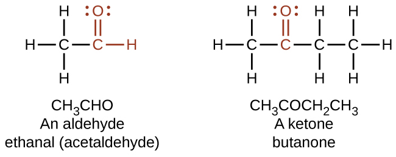
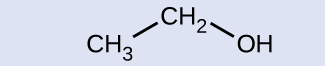

By the end of this section, you will be able to:
* Describe the structure and properties of aldehydes, ketones, carboxylic acids and esters

Another class of organic molecules contains a carbon atom connected to an oxygen atom by a double bond, commonly called a carbonyl group. The trigonal planar carbon in the carbonyl group can attach to two other substituents leading to several subfamilies (aldehydes, ketones, carboxylic acids and esters) described in this section.

### Aldehydes and Ketones

Both **aldehydes**{: data-type="term"} and **ketones**{: data-type="term"} contain a **carbonyl group**{: data-type="term"}, a functional group with a carbon-oxygen double bond. The names for aldehyde and ketone compounds are derived using similar nomenclature rules as for alkanes and alcohols, and include the class-identifying suffixes *-al* and *-one*, respectively:

    In an aldehyde, the carbonyl group is bonded to at least one hydrogen atom. In a ketone, the carbonyl group is bonded to two carbon atoms:

  ![Five structures are shown. The first is a C atom with an R group bonded to the left and an H atom to the right. An O atom is double bonded above the C atom. This structure is labeled, &#x201C;Functional group of an aldehyde.&#x201D; The second structure shows a C atom with R groups bonded to the left and right. An O atom is double bonded above the C atom. This structure is labeled, &#x201C;Functional group of a ketone.&#x201D; The third structure looks exactly like the functional group of a ketone. The fourth structure is labeled C H subscript 3 C H O. It is also labeled, &#x201C;An aldehyde,&#x201D; and &#x201C;ethanal (acetaldehyde).&#x201D; This structure has a C atom to which 3 H atoms are bonded above, below, and to the left. In red to the right of this C atom, a C atom is attached which has an O atom double bonded above and an H atom bonded to the right. The O atom as two sets of electron dots. The fifth structure is labeled C H subscript 3 C O C H subscript 2 C H subscript 3. It is also labeled, &#x201C;A ketone,&#x201D; and &#x201C;butanone.&#x201D; This structure has a C atom to which 3 H atoms are bonded above, below, and to the left. To the right of this in red is a C atom to which an O atom is double bonded above. The O atom has two sets of electron dots. Attached to the right of this red C atom in black is a two carbon atom chain with H atoms attached above, below, and to the right.](../resources/CNX_Chem_20_03_aldehyde_img.jpg)     As text, an aldehyde group is represented as –CHO; a ketone is represented as –C(O)– or –CO–.

In both aldehydes and ketones, the geometry around the carbon atom in the carbonyl group is trigonal planar; the carbon atom exhibits *sp*2 hybridization. Two of the *sp*2 orbitals on the carbon atom in the carbonyl group are used to form σ bonds to the other carbon or hydrogen atoms in a molecule. The remaining *sp*2 hybrid orbital forms a σ bond to the oxygen atom. The unhybridized *p* orbital on the carbon atom in the carbonyl group overlaps a *p* orbital on the oxygen atom to form the π bond in the double bond.

Like the <math xmlns="http://www.w3.org/1998/Math/MathML"><mrow><mtext>C</mtext><mo>=</mo><mtext>O</mtext></mrow></math>

 bond in carbon dioxide, the <math xmlns="http://www.w3.org/1998/Math/MathML"><mrow><mtext>C</mtext><mo>=</mo><mtext>O</mtext></mrow></math>

 bond of a carbonyl group is polar (recall that oxygen is significantly more electronegative than carbon, and the shared electrons are pulled toward the oxygen atom and away from the carbon atom). Many of the reactions of aldehydes and ketones start with the reaction between a Lewis base and the carbon atom at the positive end of the polar <math xmlns="http://www.w3.org/1998/Math/MathML"><mrow><mtext>C</mtext><mo>=</mo><mtext>O</mtext></mrow></math>

 bond to yield an unstable intermediate that subsequently undergoes one or more structural rearrangements to form the final product ([\[link\]](#CNX_Chem_20_03_COgeom_img)).

 ![This structure shows a central C atom to which an O atom is double bonded above. To the lower left, R superscript 1 is bonded and to the lower right, R superscript 2 is bonded. A Greek lowercase delta superscript plus appears to the left of the C and just above the bond with R superscript 1. Similarly, a Greek lowercase delta superscript negative sign appears to the left of the O atom. An arc is drawn from the double bond that links the C atom and the O atom to the bond that links the C atom to the R superscript 2 group. This arc is labeled approximately 120 degrees.](../resources/CNX_Chem_20_03_COgeom_img.jpg "The carbonyl group is polar, and the geometry of the bonds around the central carbon is trigonal planar."){: #CNX_Chem_20_03_COgeom_img}

The importance of molecular structure in the reactivity of organic compounds is illustrated by the reactions that produce aldehydes and ketones. We can prepare a carbonyl group by oxidation of an alcohol—for organic molecules, oxidation of a carbon atom is said to occur when a carbon-hydrogen bond is replaced by a carbon-oxygen bond. The reverse reaction—replacing a carbon-oxygen bond by a carbon-hydrogen bond—is a reduction of that carbon atom. Recall that oxygen is generally assigned a –2 oxidation number unless it is elemental or attached to a fluorine. Hydrogen is generally assigned an oxidation number of +1 unless it is attached to a metal. Since carbon does not have a specific rule, its oxidation number is determined algebraically by factoring the atoms it is attached to and the overall charge of the molecule or ion. In general, a carbon atom attached to an oxygen atom will have a more positive oxidation number and a carbon atom attached to a hydrogen atom will have a more negative oxidation number. This should fit nicely with your understanding of the polarity of C–O and C–H bonds. The other reagents and possible products of these reactions are beyond the scope of this chapter, so we will focus only on the changes to the carbon atoms:

  ![A reaction is shown. On the left appears an alcohol and on the right, a carbonyl group. Above the reaction arrow appears the word &#x201C;oxidation.&#x201D; The alcohol is represented as a C atom with dashes to the left and below, an H atom bonded above, and an O atom bonded to an H atom in red connected to the right. The O atom has two sets of electron dots. The carbonyl group is indicated in red with a C atom to which an O atom is double bonded above. Dashes appear left and right of the C atom in black. The O atom has two sets of electron dots.](../resources/CNX_Chem_20_03_oxidation_img.jpg)  

Oxidation and Reduction in Organic Chemistry Methane represents the completely reduced form of an organic molecule that contains one carbon atom. Sequentially replacing each of the carbon-hydrogen bonds with a carbon-oxygen bond would lead to an alcohol, then an aldehyde, then a carboxylic acid (discussed later), and, finally, carbon dioxide:

<math xmlns="http://www.w3.org/1998/Math/MathML"><mrow><msub><mrow><mtext>CH</mtext></mrow><mn>4</mn></msub><mspace width="0.2em" /><mo stretchy="false">⟶</mo><mspace width="0.2em" /><msub><mrow><mtext>CH</mtext></mrow><mn>3</mn></msub><mtext>OH</mtext><mspace width="0.2em" /><mo stretchy="false">⟶</mo><mspace width="0.2em" /><msub><mrow><mtext>CH</mtext></mrow><mn>2</mn></msub><mtext>O</mtext><mspace width="0.2em" /><mo stretchy="false">⟶</mo><mspace width="0.2em" /><msub><mrow><mtext>HCO</mtext></mrow><mn>2</mn></msub><mtext>H</mtext><mspace width="0.2em" /><mo stretchy="false">⟶</mo><mspace width="0.2em" /><msub><mrow><mtext>CO</mtext></mrow><mn>2</mn></msub></mrow></math>

What are the oxidation numbers for the carbon atoms in the molecules shown here?

Solution In this example, we can calculate the oxidation number (review the chapter on oxidation-reduction reactions if necessary) for the carbon atom in each case (note how this would become difficult for larger molecules with additional carbon atoms and hydrogen atoms, which is why organic chemists use the definition dealing with replacing C–H bonds with C–O bonds described). For CH4, the carbon atom carries a –4 oxidation number (the hydrogen atoms are assigned oxidation numbers of +1 and the carbon atom balances that by having an oxidation number of –4). For the alcohol (in this case, methanol), the carbon atom has an oxidation number of –2 (the oxygen atom is assigned –2, the four hydrogen atoms each are assigned +1, and the carbon atom balances the sum by having an oxidation number of –2; note that compared to the carbon atom in CH4, this carbon atom has lost two electrons so it was oxidized); for the aldehyde, the carbon atom’s oxidation number is 0 (–2 for the oxygen atom and +1 for each hydrogen atom already balances to 0, so the oxidation number for the carbon atom is 0); for the carboxylic acid, the carbon atom’s oxidation number is +2 (two oxygen atoms each at –2 and two hydrogen atoms at +1); and for carbon dioxide, the carbon atom’s oxidation number is +4 (here, the carbon atom needs to balance the –4 sum from the two oxygen atoms).

Check Your Learning Indicate whether the marked carbon atoms in the three molecules here are oxidized or reduced relative to the marked carbon atom in ethanol:

  
There is no need to calculate oxidation states in this case; instead, just compare the types of atoms bonded to the marked carbon atoms:

 ![Three molecular structures are shown, each with a red central C atom. In a, a C H subscript 3 group is bonded to the lower left, an H atom is bonded above, and H subscript 2 appears to the right of the central C atom. In b, an O atom is double bonded above the central C atom, a C H subscript 3 group is bonded to the lower left, and an H atom is bonded to the lower right. In c, an O atom is double bonded above the central C atom, a C H subscript 3 group is bonded to the lower left, and an O H group is bonded to the lower right.](../resources/CNX_Chem_20_03_OxiRedu_img.jpg) 

Answer:

(a) reduced (bond to oxygen atom replaced by bond to hydrogen atom); (b) oxidized (one bond to hydrogen atom replaced by one bond to oxygen atom); (c) oxidized (2 bonds to hydrogen atoms have been replaced by bonds to an oxygen atom)

Aldehydes are commonly prepared by the oxidation of alcohols whose –OH functional group is located on the carbon atom at the end of the chain of carbon atoms in the alcohol:

    Alcohols that have their –OH groups in the middle of the chain are necessary to synthesize a ketone, which requires the carbonyl group to be bonded to two other carbon atoms:

    An alcohol with its –OH group bonded to a carbon atom that is bonded to no or one other carbon atom will form an aldehyde. An alcohol with its –OH group attached to two other carbon atoms will form a ketone. If three carbons are attached to the carbon bonded to the –OH, the molecule will not have a C–H bond to be replaced, so it will not be susceptible to oxidation.

Formaldehyde, an aldehyde with the formula HCHO, is a colorless gas with a pungent and irritating odor. It is sold in an aqueous solution called formalin, which contains about 37% formaldehyde by weight. Formaldehyde causes coagulation of proteins, so it kills bacteria (and any other living organism) and stops many of the biological processes that cause tissue to decay. Thus, formaldehyde is used for preserving tissue specimens and embalming bodies. It is also used to sterilize soil or other materials. Formaldehyde is used in the manufacture of Bakelite, a hard plastic having high chemical and electrical resistance.

Dimethyl ketone, CH3COCH3, commonly called acetone, is the simplest ketone. It is made commercially by fermenting corn or molasses, or by oxidation of 2-propanol. Acetone is a colorless liquid. Among its many uses are as a solvent for lacquer (including fingernail polish), cellulose acetate, cellulose nitrate, acetylene, plastics, and varnishes; as a paint and varnish remover; and as a solvent in the manufacture of pharmaceuticals and chemicals.

### Carboxylic Acids and Esters

The odor of vinegar is caused by the presence of acetic acid, a carboxylic acid, in the vinegar. The odor of ripe bananas and many other fruits is due to the presence of esters, compounds that can be prepared by the reaction of a carboxylic acid with an alcohol. Because esters do not have hydrogen bonds between molecules, they have lower vapor pressures than the alcohols and carboxylic acids from which they are derived (see [\[link\]](#CNX_Chem_20_03_CarboxEst1_img)).

 ![There are nine structures represented in this figure. The first is labeled, &#x201C;raspberry,&#x201D; and, &#x201C;iso-butyl formate.&#x201D; It shows an H atom with a line going up and to the right which then goes down and to the right. It goes up and to the right again and down and to the right and up and to the right. At the first peak is a double bond to an O atom. At the first trough is an O atom. At the second trough, there is a line going straight down. The second is labeled, &#x201C;apple,&#x201D; and, &#x201C;butyl acetate.&#x201D; There is a line that goes up and to the right, down and to the right, up and to the right, and down and to the right. At the second peak is a double bond to an O atom. At the end, on the right is O C H subscript 3. The third is labeled, &#x201C;pineapple,&#x201D; and, &#x201C;ethyl butyrate.&#x201D; It is a line that goes up and to the right, down and to the right, up and to the right, down and to the right, up and to the right, and down and to the right. At the second peak is a double bond to an O atom and at the second trough is an O atom. The fourth is labeled, &#x201C;rum,&#x201D; and &#x201C;propyl isobutyrate.&#x201D; It shows a line that goes down and to the right, up and to the right, down and to the right, up and to the right, down and to the right and up and to the right. The first complete peak has a double bond to an O atom and the second trough has an O atom. The fifth is labeled, &#x201C;peach,&#x201D; and &#x201C;benzyl acetate.&#x201D; It shows a line that goes up and to the right, down and to the right, up and to the right and down and to the right. This line connects to a hexagon with a circle inside it. The first peak has a double bond to an O atom and the first trough has an O atom. The sixth is labeled, &#x201C;orange,&#x201D; and, &#x201C;octyl acetate.&#x201D; It shows a line that goes up and to the right and down and to the right and up and to the right and down and to the right and up and to the right and down and to the right and up and to the right and down and to the right and up and to the right and down and to the right. The first peak has a double bond to an O atom and the first complete trough has and an O atom. The seventh is labeled, &#x201C;wintergreen,&#x201D; and &#x201C;methyl salicylate.&#x201D; It shows a hexagon with a circle inside of it. On the right, is a bond down and to the right to an O H group. On the right is a bond to a line that goes up and to the right and down and two the right and up and to the right. At the first peak is a double bond to an O atom, the next trough shows and O atom and at the end of the line is a C H subscript 3 group. The eighth is labeled, &#x201C;honey,&#x201D; and &#x201C;methyl phenylacetate.&#x201D; It shows a hexagon with a circle inside of it. It shows it connecting to a line on the right that goes down and to the right then up and to the right and down and to the right and up and to the right. At the first peak that is not part of the hexagon is a double bond to an O atom. At the last trough is an O atom. The ninth is labeled, &#x201C;strawberry,&#x201D; and &#x201C;ethyl methylphenylglycidate.&#x201D; This shows a hexagon with a circle inside of it. On the right, it connects to a line that goes up and to the right and down and to the right and up and to the right and down and to the right and up and to the right and down and to the right. At the first peak is a line that extends above and below. Below, it connects to an O atom. At the next trough, the line extends down and to the left to the same O atom. At the next peak is a double bond to an O atom and at the next trough is an O atom.](../resources/CNX_Chem_20_03_CarboxEst1_img.jpg "Esters are responsible for the odors associated with various plants and their fruits."){: #CNX_Chem_20_03_CarboxEst1_img}

Both **carboxylic acids**{: data-type="term"} and **esters**{: data-type="term"} contain a carbonyl group with a second oxygen atom bonded to the carbon atom in the carbonyl group by a single bond. In a carboxylic acid, the second oxygen atom also bonds to a hydrogen atom. In an ester, the second oxygen atom bonds to another carbon atom. The names for carboxylic acids and esters include prefixes that denote the lengths of the carbon chains in the molecules and are derived following nomenclature rules similar to those for inorganic acids and salts (see these examples):

  ![Two structures are shown. The first structure is labeled, &#x201C;ethanoic acid,&#x201D; and, &#x201C;acetic acid.&#x201D; This structure indicates a C atom to which H atoms are bonded above, below and to the left. To the right of this in red is a bonded group comprised of a C atom to which an O atom is double bonded above. To the right of the red C atom, an O atom is bonded which has an H atom bonded to its right. Both O atoms have two sets of electron dots. The second structure is labeled, &#x201C;methyl ethanoate,&#x201D; and, &#x201C;methyl acetate.&#x201D; This structure indicates a C atom to which H atoms are bonded above, below and to the left. In red, bonded to the right is a C atom with a double bonded O atom above and a single bonded O atom to the right. To the right of this last O atom in black is another C atom to which H atoms are bonded above, below and to the right. Both O atoms have two pairs of electron dots.](../resources/CNX_Chem_20_03_CarboxEst2_img.jpg)  The functional groups for an acid and for an ester are shown in red in these formulas.

The hydrogen atom in the functional group of a carboxylic acid will react with a base to form an ionic salt:

  ![A chemical reaction is shown. On the left, a structure of propionic acid is indicated. This structure includes a 2 carbon hydrocarbon group on the left end in black. Above, below, and to the left, H atoms are bonded. This group is bonded to a red group comprised of a C atom to which an O atom is double bonded above. To the right of the red C atom, an O atom is connected with a single bond. To the right of the O atom, an H atom is bonded. To the right of this structure appears a plus and N a O H. Following the reaction arrow, the propionate ion is shown. This structure is in brackets. Appearing inside the brackets, is a 2 carbon hydrocarbon group on the left end. Above, below, and to the left, H atoms are bonded. To the right of this group, a group in red is attached comprised of a C atom to which an O atom is double bonded above and a second O atom is single bonded to the right. Outside the brackets appears a superscript minus symbol. This is followed by a plus sign, N a superscript plus another plus sign and H subscript 2 O. The singly bonded O atom in the propionate ion structure has 3 pairs of electron dots. All other O atoms have two pairs of electron dots.](../resources/CNX_Chem_20_03_carboxylic_img.jpg)  Carboxylic acids are weak acids (see the chapter on acids and bases), meaning they are not 100% ionized in water. Generally only about 1% of the molecules of a carboxylic acid dissolved in water are ionized at any given time. The remaining molecules are undissociated in solution.

We prepare carboxylic acids by the oxidation of aldehydes or alcohols whose –OH functional group is located on the carbon atom at the end of the chain of carbon atoms in the alcohol:

  ![A chemical reaction with two arrows is shown. On the left, an alcohol, indicated with a C atom to which an R group is bonded to the left, H atoms are bonded above and below, and in red, a single bonded O atom with an H atom bonded to the right is shown. Following the first reaction arrow, an aldehyde is shown. This structure is represented with an R group bonded to a red C atom to which an H atom is bonded above and to the right, and an O atom is double bonded below and to the right. Appearing to the right of the second arrow, is a carboxylic acid comprised of an R group bonded to a C atom to which, in red, an O atom is single bonded with an H atom bonded to its right side. A red O is double bonded below and to the right. All O atoms have two pairs of electron dots.](../resources/CNX_Chem_20_03_oxtoacid_img.jpg)  Esters are produced by the reaction of acids with alcohols. For example, the ester ethyl acetate, CH3CO2CH2CH3, is formed when acetic acid reacts with ethanol:

  ![A chemical reaction is shown. On the left, a C H subscript 3 group bonded to a red C atom. The C atom forms a double bond with an O atom which is also in red. The C atom is also bonded to an O atom which is bonded to an H atom, also in red. A plus sign is shown, which is followed by H O C H subscript 2 C H subscript 3. The H O group is in red. Following a reaction arrow, a C H subscript 3 group is shown which is bonded to a red C atom with a double bonded O atom and a single bonded O. To the right of this single bonded O atom, a C H subscript 2 C H subscript 3 group is attached and shown in black. This structure is followed by a plus sign and H subscript 2 O. The O atoms in the first structure on the left and the structure following the reaction arrow have two pairs of electron dots.](../resources/CNX_Chem_20_03_esterform_img.jpg)  The simplest carboxylic acid is formic acid, HCO2H, known since 1670. Its name comes from the Latin word *formicus*, **which means “ant”; it was first isolated by the distillation of red ants. It is partially responsible for the pain and irritation of ant and wasp stings, and is responsible for a characteristic odor of ants that can be sometimes detected in their nests.

Acetic acid, CH3CO2H, constitutes 3–6% vinegar. Cider vinegar is produced by allowing apple juice to ferment without oxygen present. Yeast cells present in the juice carry out the fermentation reactions. The fermentation reactions change the sugar present in the juice to ethanol, then to acetic acid. Pure acetic acid has a penetrating odor and produces painful burns. It is an excellent solvent for many organic and some inorganic compounds, and it is essential in the production of cellulose acetate, a component of many synthetic fibers such as rayon.

The distinctive and attractive odors and flavors of many flowers, perfumes, and ripe fruits are due to the presence of one or more esters ([\[link\]](#CNX_Chem_20_03_strawberry)). Among the most important of the natural esters are fats (such as lard, tallow, and butter) and oils (such as linseed, cottonseed, and olive oils), which are esters of the trihydroxyl alcohol glycerine, C3H5(OH)3, with large carboxylic acids, such as palmitic acid, CH3(CH2)14CO2H, stearic acid, CH3(CH2)16CO2H, and oleic acid, <math xmlns="http://www.w3.org/1998/Math/MathML"><mrow><msub><mrow><mtext>CH</mtext></mrow><mn>3</mn></msub><mo stretchy="false">(</mo><msub><mrow><mtext>C</mtext><msub><mrow><mtext>H</mtext></mrow><mn>2</mn></msub><mo stretchy="false">)</mo></mrow><mn>7</mn></msub><mtext>CH</mtext><mo>=</mo><mtext>CH</mtext><msub><mrow><mo stretchy="false">(</mo><msub><mrow><mtext>CH</mtext></mrow><mn>2</mn></msub><mo stretchy="false">)</mo></mrow><mn>7</mn></msub><mtext>C</mtext><msub><mrow><mtext>O</mtext></mrow><mn>2</mn></msub><mtext>H.</mtext></mrow></math>

 Oleic acid is an unsaturated acid; it contains a <math xmlns="http://www.w3.org/1998/Math/MathML"><mrow><mtext>C</mtext><mo>=</mo><mtext>C</mtext></mrow></math>

 double bond. Palmitic and stearic acids are saturated acids that contain no double or triple bonds.

  have been identified in strawberries. (credit: Rebecca Siegel)"){: #CNX_Chem_20_03_strawberry}

### Key Concepts and Summary

Functional groups related to the carbonyl group include the –CHO group of an aldehyde, the –CO– group of a ketone, the –CO2H group of a carboxylic acid, and the –CO2R group of an ester. The carbonyl group, a carbon-oxygen double bond, is the key structure in these classes of organic molecules: Aldehydes contain at least one hydrogen atom attached to the carbonyl carbon atom, ketones contain two carbon groups attached to the carbonyl carbon atom, carboxylic acids contain a hydroxyl group attached to the carbonyl carbon atom, and esters contain an oxygen atom attached to another carbon group connected to the carbonyl carbon atom. All of these compounds contain oxidized carbon atoms relative to the carbon atom of an alcohol group.

### Chemistry End of Chapter Exercises

Order the following molecules from least to most oxidized, based on the marked carbon atom:* * *
{: data-type="newline"}

 ![Structure a shows a C H subscript 3 group bonded up and to the right to a C H group which is bonded down and to the left to a C H subscript 3 group. Above the C H group is bonded an O H group. The C in the C H group is red. Structure b shows a C H subscript 3 group bonded up and to the right to a C H subscript 2 group which is bonded down and to the right to a C H subscript 3 group. The C in the C H subscript 2 group is red. Structure c shows a C H subscript 3 group bonded up and to the right to a red C atom. This C atom forms a double bond with an O atom above it. The C atom also forms a bond with a C H subscript 3 group down and to the right.](../resources/CNX_Chem_20_03_OxiOrder_img.jpg) 

Predict the products of oxidizing the molecules shown in this problem. In each case, identify the product that will result from the minimal increase in oxidation state for the highlighted carbon atom:

(a)* * *
{: data-type="newline"}

  
(b)* * *
{: data-type="newline"}

  
(c)* * *
{: data-type="newline"}

  

(a)* * *
{: data-type="newline"}

  
;* * *
{: data-type="newline"}

 (b)* * *
{: data-type="newline"}

  
;* * *
{: data-type="newline"}

 (c)* * *
{: data-type="newline"}

  

Predict the products of reducing the following molecules. In each case, identify the product that will result from the minimal decrease in oxidation state for the highlighted carbon atom:

(a)* * *
{: data-type="newline"}

  
(b)* * *
{: data-type="newline"}

  
(c)* * *
{: data-type="newline"}

  

Explain why it is not possible to prepare a ketone that contains only two carbon atoms.

A ketone contains a group bonded to two additional carbon atoms; thus, a minimum of three carbon atoms are needed.

How does hybridization of the substituted carbon atom change when an alcohol is converted into an aldehyde? An aldehyde to a carboxylic acid?

Fatty acids are carboxylic acids that have long hydrocarbon chains attached to a carboxylate group. How does a saturated fatty acid differ from an unsaturated fatty acid? How are they similar?

Since they are both carboxylic acids, they each contain the –COOH functional group and its characteristics. The difference is the hydrocarbon chain in a saturated fatty acid contains no double or triple bonds, whereas the hydrocarbon chain in an unsaturated fatty acid contains one or more multiple bonds.

Write a condensed structural formula, such as CH3CH3, and describe the molecular geometry at each carbon atom.

(a) propene

(b) 1-butanol

(c) ethyl propyl ether

(d) *cis*-4-bromo-2-heptene

(e) 2,2,3-trimethylhexane

(f) formaldehyde

Write a condensed structural formula, such as CH3CH3, and describe the molecular geometry at each carbon atom.

(a) 2-propanol

(b) acetone

(c) dimethyl ether

(d) acetic acid

(e) 3-methyl-1-hexene

(a) CH3CH(OH)CH3: all carbons are tetrahedral; (b) <math xmlns="http://www.w3.org/1998/Math/MathML"><mrow><msub><mrow><mtext>CH</mtext></mrow><mn>3</mn></msub><mtext>C</mtext><mtext>O</mtext><msub><mrow><mtext>CH</mtext></mrow><mn>3</mn></msub><mtext>:</mtext></mrow></math>

 the end carbons are tetrahedral and the central carbon is trigonal planar; (c) CH3OCH3: all are tetrahedral; (d) CH3COOH: the methyl carbon is tetrahedral and the acid carbon is trigonal planar; (e) CH3CH2CH2CH(CH3)CHCH2: all are tetrahedral except the right-most two carbons, which are trigonal planar

The foul odor of rancid butter is caused by butyric acid, CH3CH2CH2CO2H.

(a) Draw the Lewis structure and determine the oxidation number and hybridization for each carbon atom in the molecule.

(b) The esters formed from butyric acid are pleasant-smelling compounds found in fruits and used in perfumes. Draw the Lewis structure for the ester formed from the reaction of butyric acid with 2-propanol.

Write the two-resonance structures for the acetate ion.

 ![A structure shows in brackets a C atom with H atoms bonded above, below, and to the left, and a C atom bonded to the right. This second C atom has an O atom double bonded above and to the right and a second O atom single bonded below and to the right. Outside the brackets to the right appears a superscript minus sign. This is followed by a double headed arrow. To the right of this arrow in brackets is a C atom with H atoms bonded above, below, and to the left, and a C atom bonded to the right. This second C atom has an O atom single bonded above and to the right and a second O atom double bonded below and to the right. Outside the brackets to the right appears a superscript minus symbol. Double bonded O atoms have two pairs of electron dots and single bonded O atoms have 3 pairs of electron dots.](../resources/CNX_Chem_20_03_acetate_img.jpg) 

Write two complete, balanced equations for each of the following reactions, one using condensed formulas and one using Lewis structures:

(a) ethanol reacts with propionic acid

(b) benzoic acid, C6H5CO2H, is added to a solution of sodium hydroxide

Write two complete balanced equations for each of the following reactions, one using condensed formulas and one using Lewis structures.

(a) 1-butanol reacts with acetic acid

(b) propionic acid is poured onto solid calcium carbonate

(a) <math xmlns="http://www.w3.org/1998/Math/MathML"><mrow><msub><mrow><mtext>CH</mtext></mrow><mn>3</mn></msub><msub><mrow><mtext>CH</mtext></mrow><mn>2</mn></msub><msub><mrow><mtext>CH</mtext></mrow><mn>2</mn></msub><msub><mrow><mtext>CH</mtext></mrow><mn>2</mn></msub><msub><mrow><mtext>OH</mtext><mo>+</mo><mtext>CH</mtext></mrow><mn>3</mn></msub><mtext>C</mtext><mrow><mo>(</mo><mtext>O</mtext><mo>)</mo></mrow><mtext>OH</mtext><mspace width="0.2em" /><mspace width="0.2em" /><mo stretchy="false">⟶</mo><mspace width="0.2em" /><mspace width="0.2em" /><msub><mrow><mtext>CH</mtext></mrow><mn>3</mn></msub><mtext>C</mtext><mrow><mo>(</mo><mtext>O</mtext><mo>)</mo></mrow><msub><mrow><mtext>OCH</mtext></mrow><mn>2</mn></msub><msub><mrow><mtext>CH</mtext></mrow><mn>2</mn></msub><msub><mrow><mtext>CH</mtext></mrow><mn>2</mn></msub><msub><mrow><mtext>CH</mtext></mrow><mn>3</mn></msub><mo>+</mo><msub><mrow><mtext>H</mtext></mrow><mn>2</mn></msub><mtext>O:</mtext></mrow></math>

* * *
{: data-type="newline"}

 ![A reaction is shown. The first molecular structure shows a C atom bonded to three H atoms and another C atom. This second C atom is bonded to two H atoms and a third C atom. This third C atom is bonded to two H atoms and a fourth C atom. This C atom is bonded to two H atoms and an O atom. The O atom is bonded to an H atom. The O atom has two pairs of electrons dots. There is a plus sign. The next molecular structure shows a C atom bonded to three H atoms and another C atom. This C atom forms a double bond with an O atom and a single bond with another O atom. The O atom forms a bond with an H atom. Both O atoms have two pairs of electron dots. There is a reaction arrow that points right. The next molecular structure shows a C atom bonded to three H atoms and another C atom. This second C atom forms a double bond with an O atom and a single bond with another O atom. This second O atom is bonded to a C atom which is bonded to two H atoms and another C atom. This C atom is bonded to two H atoms and another C. This C atom is bonded to two H atoms and another C atom. The C atom is bonded to three H atoms. The O atoms have two pairs of electron dots. There is a plus sign. The final molecular structure shows an O atom bonded to two H atoms. The O atom has two pairs of electron dots.](../resources/CNX_Chem_20_04_react2b_img.jpg) 
;* * *
{: data-type="newline"}

 (b) <math xmlns="http://www.w3.org/1998/Math/MathML"><mrow><mn>2</mn><msub><mrow><mtext>CH</mtext></mrow><mn>3</mn></msub><msub><mrow><mtext>CH</mtext></mrow><mn>2</mn></msub><mtext>COOH</mtext><mo>+</mo><msub><mrow><mtext>CaCO</mtext></mrow><mn>3</mn></msub><mspace width="0.2em" /><mo stretchy="false">⟶</mo><mspace width="0.2em" /><msub><mrow><mrow><mo>(</mo><mrow><msub><mrow><mtext>CH</mtext></mrow><mn>3</mn></msub><msub><mrow><mtext>CH</mtext></mrow><mn>2</mn></msub><mtext>COO</mtext></mrow><mo>)</mo></mrow></mrow><mn>2</mn></msub><mtext>Ca</mtext><mo>+</mo><msub><mrow><mtext>CO</mtext></mrow><mn>2</mn></msub><mo>+</mo><msub><mtext>H</mtext><mn>2</mn></msub><mtext>O:</mtext></mrow></math>

* * *
{: data-type="newline"}

 ![A reaction is shown. There is a 2 in front of the first molecular structure. This first structure shows a C atom bonded to three H atoms and another C atom. This second C atom is bonded to two H atoms and a third C atom. This third C atom forms a double bond with an O atom and a single bond with another O atom. This second O atom forms a single bond with an H atom. Both O atoms have two pairs of electron dots. There is a plus sign and C a superscript 2 plus sign. Beside the C a superscript 2 plus sign is a set of brackets. Inside the brackets is a central C atom bonded to three O atoms. Two O atoms have three pairs of electron dots, and one O atom has two pairs of electron dots. A 2 minus sign appears as a superscript to the brackets. There is an arrow pointing right. There is a 2 and a set of brackets. Inside the brackets is a C atom bonded to three H atoms and another C atom. This C atom is bonded to two H atoms and a third C atom. This C atom is bonded to two O atoms. One O atom has two pairs of electron dots, and one O atom has three pairs of electron dots. Outside the brackets a minus sign appears as a superscript. C a superscript 2+ also appears beside the brackets. There is a plus sign. The next molecular structure shows a C atom that forms two sets of double bonds with two O atoms. Each O atom has two pairs of electron dots. There is a plus sign. The final molecular structure shows an O atom bonded to two H atoms. The O atom has two pairs of electron dots.](../resources/CNX_Chem_20_04_react2c_img.jpg) 

Yields in organic reactions are sometimes low. What is the percent yield of a process that produces 13.0 g of ethyl acetate from 10.0 g of CH3CO2H?

Alcohols A, B, and C all have the composition C4H10O. Molecules of alcohol A contain a branched carbon chain and can be oxidized to an aldehyde; molecules of alcohol B contain a linear carbon chain and can be oxidized to a ketone; and molecules of alcohol C can be oxidized to neither an aldehyde nor a ketone. Write the Lewis structures of these molecules.

 ![This figure shows three molecular structures labeled compound A, compound B, and compound C. In A, a C atom is shown bonded the three H atoms and a second C atom. This C atom is bonded to one H atom. Up and to the right it is bonded to another C atom which is bonded to three H atoms. Down and to the left it is bonded to another C atom which is bonded to two H atoms and an O atom. The O atom is bonded to an H atom. The O atom has two pairs of electron dots. In B, a C atom is bonded to three H atoms and another C atom. This second C atom is bonded to an H atom and an O atom. The O atom has two pairs of electron dots and is bonded to an H atom. The second C atom is bonded to third C atom which is bonded to two H atoms. The third C atom is bonded to a fourth C atom which is bonded to three H atoms. In C, a C atom is bonded to three H atoms and another C atom. This C atom is bonded above to another C atom which is bonded to three H atoms, and below to a C atom which is bonded to three H atoms. It is also bonded to an O atom which is bonded to an H atom. The O atom has two pairs of electron dots.](../resources/CNX_Chem_20_03_alcoholABC_img.jpg) 

### Glossary
{: data-type="glossary-title"}

aldehyde
: organic compound containing a carbonyl group bonded to two hydrogen atoms or a hydrogen atom and a carbon substituent
^

carbonyl group
: carbon atom double bonded to an oxygen atom
^

carboxylic acid
: organic compound containing a carbonyl group with an attached hydroxyl group
^

ester
: organic compound containing a carbonyl group with an attached oxygen atom that is bonded to a carbon substituent
^

ketone
: organic compound containing a carbonyl group with two carbon substituents attached to it

