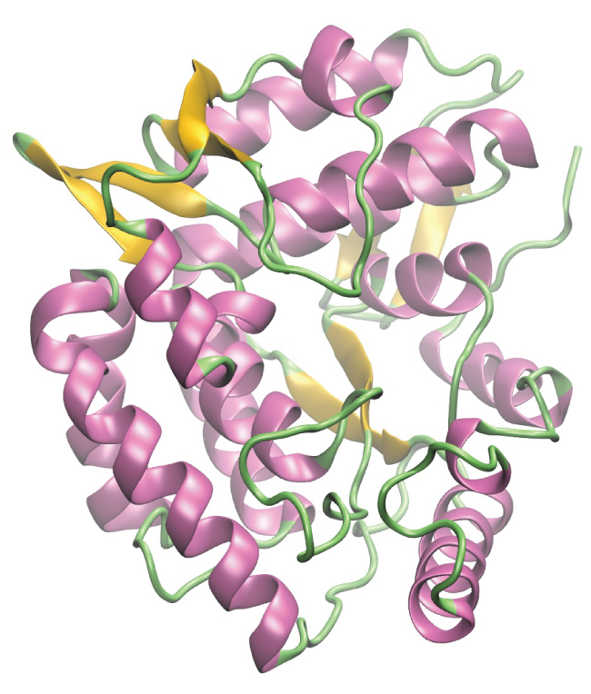

By the end of this section, you will be able to:
* Describe the structure and properties of an amine
* Describe the structure and properties of an amide

**Amines**{: data-type="term"} are molecules that contain carbon-nitrogen bonds. The nitrogen atom in an amine has a lone pair of electrons and three bonds to other atoms, either carbon or hydrogen. Various nomenclatures are used to derive names for amines, but all involve the class-identifying suffix *–ine* as illustrated here for a few simple examples:

  ![Three structures are shown, each with a red, central N atom which has a pair of electron dots indicated in red above the N atoms. The first structure is labeled methyl amine. To the left of the N, a C H subscript 3 group is bonded. H atoms are bonded to the right and bottom of the central N atom. The second structure is labeled dimethyl amine. This structure has C H subscript 3 groups bonded to the left and right of the N atom and a single H atom is bonded below. The third structure is labeled trimethyl amine, which has C H subscript 3 groups bonded to the left, right, and below the central N atom.](../resources/CNX_Chem_20_04_amines_img.jpg)  In some amines, the nitrogen atom replaces a carbon atom in an aromatic hydrocarbon. Pyridine ([\[link\]](#CNX_Chem_20_04_pyridine_img)) is one such heterocyclic amine. A heterocyclic compound contains atoms of two or more different elements in its ring structure.

 {: #CNX_Chem_20_04_pyridine_img}

DNA in Forensics and Paternity

The genetic material for all living things is a polymer of four different molecules, which are themselves a combination of three subunits. The genetic information, the code for developing an organism, is contained in the specific sequence of the four molecules, similar to the way the letters of the alphabet can be sequenced to form words that convey information. The information in a DNA sequence is used to form two other types of polymers, one of which are proteins. The proteins interact to form a specific type of organism with individual characteristics.

A genetic molecule is called DNA, which stands for deoxyribonucleic acid. The four molecules that make up DNA are called nucleotides. Each nucleotide consists of a single- or double-ringed molecule containing nitrogen, carbon, oxygen, and hydrogen called a nitrogenous base. Each base is bonded to a five-carbon sugar called deoxyribose. The sugar is in turn bonded to a phosphate group <math xmlns="http://www.w3.org/1998/Math/MathML"><mrow><mo stretchy="false">(</mo><msub><mrow><mtext>−PO</mtext></mrow><mn>4</mn></msub><msup><mrow /><mrow><mtext>3−</mtext></mrow></msup><mo stretchy="false">)</mo></mrow></math>

 When new DNA is made, a polymerization reaction occurs that binds the phosphate group of one nucleotide to the sugar group of a second nucleotide. The nitrogenous bases of each nucleotide stick out from this sugar-phosphate backbone. DNA is actually formed from two such polymers coiled around each other and held together by hydrogen bonds between the nitrogenous bases. Thus, the two backbones are on the outside of the coiled pair of strands, and the bases are on the inside. The shape of the two strands wound around each other is called a double helix (see [\[link\]](#CNX_Chem_20_04_DNA)).

It probably makes sense that the sequence of nucleotides in the DNA of a cat differs from those of a dog. But it is also true that the sequences of the DNA in the cells of two individual pugs differ. Likewise, the sequences of DNA in you and a sibling differ (unless your sibling is an identical twin), as do those between you and an unrelated individual. However, the DNA sequences of two related individuals are more similar than the sequences of two unrelated individuals, and these similarities in sequence can be observed in various ways. This is the principle behind DNA fingerprinting, which is a method used to determine whether two DNA samples came from related (or the same) individuals or unrelated individuals.

![Diagram a shows DNA as a double helix composed of the nitrogenous bases adenine, thymine, guanine, and cytosine paired up along a sugar-phosphate backbone. The helix has labeled 3 prime and 5 prime directions or ends. In diagram b, the molecular level arrangement of the bases connected by hydrogen bonding within the sugar-phosphate backbone is shown. Adenine is shown with hydrogen bonding to thymine and similarly the linkage via hydrogen bonding between cytosine and guanine is shown. Again, 3 prime and 5 prime directional information is provided. In diagram c, the bonding between a nitrogenous base, sugar, and phosphate is shown.](../resources/CNX_Chem_20_04_DNA.jpg "DNA is an organic molecule and the genetic material for all living organisms. (a) DNA is a double helix consisting of two single DNA strands hydrogen bonded together at each nitrogenous base. (b) This detail shows the hydrogen bonding (dotted lines) between nitrogenous bases on each DNA strand and the way in which each nucleotide is joined to the next, forming a backbone of sugars and phosphate groups along each strand. (c) This detail shows the structure of one of the four nucleotides that makes up the DNA polymer. Each nucleotide consists of a nitrogenous base (a double-ring molecule, in this case), a five-carbon sugar (deoxyribose), and a phosphate group."){: #CNX_Chem_20_04_DNA}

Using similarities in sequences, technicians can determine whether a man is the father of a child (the identity of the mother is rarely in doubt, except in the case of an adopted child and a potential birth mother). Likewise, forensic geneticists can determine whether a crime scene sample of human tissue, such as blood or skin cells, contains DNA that matches exactly the DNA of a suspect.

  
Watch this [video animation][1] of how DNA is packaged for a visual lesson in its structure.

Like ammonia, amines are weak bases due to the lone pair of electrons on their nitrogen atoms:

  ![Two reactions are shown. In the first, ammonia reacts with H superscript plus. An unshared pair of electron dots sits above the N atom. To the left, right, and bottom, H atoms are bonded. This is followed by a plus symbol and an H atom with a superscript plus symbol. To the right of the reaction arrow, ammonium ion is shown in brackets with a superscript plus symbol outside. Inside the brackets, the N atom is shown with H atoms bonded on all four sides. In a very similar second reaction, methyl amine reacts with H superscript plus to yield methyl ammonium ion. The methyl amine structure is like ammonia except a C H subscript 3 group is attached in place of the left most H atom in the structure. Similarly, the resulting methyl ammonium ion is represented in brackets with a superscript plus symbol appearing outside. Inside, the structure is similar to that of methyl amine except that an H atom appears at the top of the N atom where the unshared electron pair was previously shown.](../resources/CNX_Chem_20_04_ammonia_img.jpg)  The basicity of an amine’s nitrogen atom plays an important role in much of the compound’s chemistry. Amine functional groups are found in a wide variety of compounds, including natural and synthetic dyes, polymers, vitamins, and medications such as penicillin and codeine. They are also found in many molecules essential to life, such as amino acids, hormones, neurotransmitters, and DNA.

Addictive Alkaloids

Since ancient times, plants have been used for medicinal purposes. One class of substances, called *alkaloids*, found in many of these plants has been isolated and found to contain cyclic molecules with an amine functional group. These amines are bases. They can react with H3O+ in a dilute acid to form an ammonium salt, and this property is used to extract them from the plant:

<math xmlns="http://www.w3.org/1998/Math/MathML"><mrow><msub><mtext>R</mtext><mn>3</mn></msub><mtext>N</mtext><mo>+</mo><msub><mtext>H</mtext><mn>3</mn></msub><msup><mtext>O</mtext><mo>+</mo></msup><mo>+</mo><msup><mrow><mtext>Cl</mtext></mrow><mo>−</mo></msup><mo stretchy="false">⟶</mo><mspace width="0.2em" /><mrow><mo>[</mo><mrow><msub><mtext>R</mtext><mn>3</mn></msub><msup><mrow><mtext>NH</mtext></mrow><mo>+</mo></msup></mrow><mo>]</mo></mrow><mspace width="0.2em" /><msup><mrow><mtext>Cl</mtext></mrow><mo>−</mo></msup><mo>+</mo><msub><mtext>H</mtext><mn>2</mn></msub><mtext>O</mtext></mrow></math>

The name alkaloid means “like an alkali.” Thus, an alkaloid reacts with acid. The free compound can be recovered after extraction by reaction with a base:

<math xmlns="http://www.w3.org/1998/Math/MathML"><mrow><mrow><mo>[</mo><mrow><msub><mtext>R</mtext><mn>3</mn></msub><msup><mrow><mtext>NH</mtext></mrow><mo>+</mo></msup></mrow><mo>]</mo></mrow><mspace width="0.2em" /><msup><mrow><mtext>Cl</mtext></mrow><mo>−</mo></msup><mo>+</mo><msup><mrow><mtext>OH</mtext></mrow><mo>−</mo></msup><mo stretchy="false">⟶</mo><mspace width="0.2em" /><msub><mtext>R</mtext><mn>3</mn></msub><mtext>N</mtext><mo>+</mo><msub><mtext>H</mtext><mn>2</mn></msub><mtext>O</mtext><mo>+</mo><msup><mrow><mtext>Cl</mtext></mrow><mo>−</mo></msup></mrow></math>

The structures of many naturally occurring alkaloids have profound physiological and psychotropic effects in humans. Examples of these drugs include nicotine, morphine, codeine, and heroin. The plant produces these substances, collectively called secondary plant compounds, as chemical defenses against the numerous pests that attempt to feed on the plant:

  
In these diagrams, as is common in representing structures of large organic compounds, carbon atoms in the rings and the hydrogen atoms bonded to them have been omitted for clarity. The solid wedges indicate bonds that extend out of the page. The dashed wedges indicate bonds that extend into the page. Notice that small changes to a part of the molecule change the properties of morphine, codeine, and heroin. Morphine, a strong narcotic used to relieve pain, contains two hydroxyl functional groups, located at the bottom of the molecule in this structural formula. Changing one of these hydroxyl groups to a methyl ether group forms codeine, a less potent drug used as a local anesthetic. If both hydroxyl groups are converted to esters of acetic acid, the powerfully addictive drug heroin results ([\[link\]](#CNX_Chem_20_04_poppies)).

"){: #CNX_Chem_20_04_poppies}

**Amides**{: data-type="term"} are molecules that contain nitrogen atoms connected to the carbon atom of a carbonyl group. Like amines, various nomenclature rules may be used to name amides, but all include use of the class-specific suffix *-amide*\:

  ![This figure shows three structures. Two examples are provided. The basic structure has an H atom or R group bonded to a C atom which is double bonded to an O atom. The O atom as two sets of electron dots. The C atom is bonded to an N atom which in turn is bonded to two R groups or two H atoms. The N atom as one set of electron dots. The next structure includes acetamide, which has C H subscript 3 bonded to a C atom with a doubly bonded O atom. The second C atom is also bonded to N H subscript 2. Hexanamide has a hydrocarbon chain of length 6 involving all single bonds. The condensed structure is shown here. To the sixth C atom at the right end of the chain, an O atom is double bonded and an N H subscript 2 group is single bonded.](../resources/CNX_Chem_20_04_amide1_img.jpg)  Amides can be produced when carboxylic acids react with amines or ammonia in a process called amidation. A water molecule is eliminated from the reaction, and the amide is formed from the remaining pieces of the carboxylic acid and the amine (note the similarity to formation of an ester from a carboxylic acid and an alcohol discussed in the previous section):

  ![A chemical reaction is shown between a carboxylic acid and amine to form an amide and water. Structures are shown. The carboxylic acid is shown as a C H subscript 3 group bonded to a C H subscript 2 group bonded to a C atom with a double bonded O atom above and an O H group bonded to the right. There is a plus sign. The amine is shown as an N atom with two H atoms bonded to the bottom and left sides. A C H subscript 3 group is bonded to the right side of the N atom. To the right of an arrow, an amide is shown as a C H subscript 3 group bonded to a C H subscript 2 group bonded to a C atom which is double bonded to an O atom above and an N with an H atom bonded below. The N atom is bonded to a C H subscript 3 group. The final product indicated after a plus sign is water, H subscript 2 O.](../resources/CNX_Chem_20_04_amide2_img.jpg)  The reaction between amines and carboxylic acids to form amides is biologically important. It is through this reaction that amino acids (molecules containing both amine and carboxylic acid substituents) link together in a polymer to form proteins.

Proteins and Enzymes

Proteins are large biological molecules made up of long chains of smaller molecules called amino acids. Organisms rely on proteins for a variety of functions—proteins transport molecules across cell membranes, replicate DNA, and catalyze metabolic reactions, to name only a few of their functions. The properties of proteins are functions of the combination of amino acids that compose them and can vary greatly. Interactions between amino acid sequences in the chains of proteins result in the folding of the chain into specific, three-dimensional structures that determine the protein’s activity.

Amino acids are organic molecules that contain an amine functional group (–NH2), a carboxylic acid functional group (–COOH), and a side chain (that is specific to each individual amino acid). Most living things build proteins from the same 20 different amino acids. Amino acids connect by the formation of a peptide bond, which is a covalent bond formed between two amino acids when the carboxylic acid group of one amino acid reacts with the amine group of the other amino acid. The formation of the bond results in the production of a molecule of water (in general, reactions that result in the production of water when two other molecules combine are referred to as condensation reactions). The resulting bond—between the carbonyl group carbon atom and the amine nitrogen atom is called a peptide link or peptide bond. Since each of the original amino acids has an unreacted group (one has an unreacted amine and the other an unreacted carboxylic acid), more peptide bonds can form to other amino acids, extending the structure. ([\[link\]](#CNX_Chem_20_04_peptide)) A chain of connected amino acids is called a polypeptide. Proteins contain at least one long polypeptide chain.

![This figure shows two amino acid molecules. These molecules have two singly bonded carbon atoms to which an amino group is bonded on the left and the C atom to the right is a component of a carboxyl group. The C atom at the center has an R group bonded below and an H atom bonded above. The amino acid at the top left has an amino group identified and enclosed in a green dashed rectangle. This group is comprised of an N atom with two bonded H atoms. The amino acid at the right has a carboxyl group identified in a green dashed rectangle. This group has a C atom to which an O H group and a doubly bonded O atom are bonded. The amino acid to the left has the O H group to the lower right in red. The amino acid on the right has an H atom that is bonded to the N atom in red. An arrow points downward and is labeled condensation reaction. A curved arrow extends down and to the right off of the downward arrow, pointing to H subscript 2 O, which is in red. A single, larger molecule appears beneath the downward arrow. At the locations of the red O H group and H atom, the amino acid molecules are bonded together. This bond is labeled as a peptide bond and the larger molecule formed is labeled as a polypeptide chain.](../resources/CNX_Chem_20_04_peptide.jpg "This condensation reaction forms a dipeptide from two amino acids and leads to the formation of water."){: #CNX_Chem_20_04_peptide}

Enzymes are large biological molecules, mostly composed of proteins, which are responsible for the thousands of metabolic processes that occur in living organisms. Enzymes are highly specific catalysts; they speed up the rates of certain reactions. Enzymes function by lowering the activation energy of the reaction they are catalyzing, which can dramatically increase the rate of the reaction. Most reactions catalyzed by enzymes have rates that are millions of times faster than the noncatalyzed version. Like all catalysts, enzymes are not consumed during the reactions that they catalyze. Enzymes do differ from other catalysts in how specific they are for their substrates (the molecules that an enzyme will convert into a different product). Each enzyme is only capable of speeding up one or a few very specific reactions or types of reactions. Since the function of enzymes is so specific, the lack or malfunctioning of an enzyme can lead to serious health consequences. One disease that is the result of an enzyme malfunction is phenylketonuria. In this disease, the enzyme that catalyzes the first step in the degradation of the amino acid phenylalanine is not functional ([\[link\]](#CNX_Chem_20_04_PhenylH_img)). Untreated, this can lead to an accumulation of phenylalanine, which can lead to intellectual disabilities.

{: #CNX_Chem_20_04_PhenylH_img}

Kevlar

Kevlar ([\[link\]](#CNX_Chem_20_04_kevlar1)) is a synthetic polymer made from two monomers 1,4-phenylene-diamine and terephthaloyl chloride (Kevlar is a registered trademark of DuPont). Kevlar’s first commercial use was as a replacement for steel in racing tires. Kevlar is typically spun into ropes or fibers. The material has a high tensile strength-to-weight ratio (it is about 5 times stronger than an equal weight of steel), making it useful for many applications from bicycle tires to sails to body armor.

![A structural formula is shown for the polymer Kevlar. The structure appears inside brackets which have single dashes extending from them at the left and right ends. Outside the lower right corner of the brackets, an italicized n appears. The structure inside the brackets includes a C atom forming a double bond with an O atom and a bond with a benzene ring. The benzene ring forms a bond with another C atom which has a double bond with an O atom. The C atom is bonded to an N atom. The N atom is bonded to an H atom and a benzene ring. The benzene ring bonds with another N atom which is also bonded to an H atom.](../resources/CNX_Chem_20_04_kevlar1.jpg "This illustration shows the formula for polymeric Kevlar."){: #CNX_Chem_20_04_kevlar1}

The material owes much of its strength to hydrogen bonds between polymer chains (refer back to the chapter on intermolecular interactions). These bonds form between the carbonyl group oxygen atom (which has a partial negative charge due to oxygen’s electronegativity) on one monomer and the partially positively charged hydrogen atom in the N–H bond of an adjacent monomer in the polymer structure (see dashed line in [\[link\]](#CNX_Chem_20_04_kevpoly)). There is additional strength derived from the interaction between the unhybridized *p* orbitals in the six-membered rings, called aromatic stacking.

{: #CNX_Chem_20_04_kevpoly}

Kevlar may be best known as a component of body armor, combat helmets, and face masks. Since the 1980s, the US military has used Kevlar as a component of the PASGT (personal armor system for ground troops) helmet and vest. Kevlar is also used to protect armored fighting vehicles and aircraft carriers. Civilian applications include protective gear for emergency service personnel such as body armor for police officers and heat-resistant clothing for fire fighters. Kevlar based clothing is considerably lighter and thinner than equivalent gear made from other materials ([\[link\]](#CNX_Chem_20_04_kevlar2)).

 These soldiers are sorting through pieces of a Kevlar helmet that helped absorb a grenade blast. Kevlar is also used to make (b) canoes and (c) marine mooring lines. (credit a: modification of work by &#x201C;Cla68&#x201D;/Wikimedia Commons; credit b: modification of work by &#x201C;OakleyOriginals&#x201D;/Flickr; credit c: modification of work by Casey H. Kyhl)"){: #CNX_Chem_20_04_kevlar2}

In addition to its better-known uses, Kevlar is also often used in cryogenics for its very low thermal conductivity (along with its high strength). Kevlar maintains its high strength when cooled to the temperature of liquid nitrogen (–196 °C).

The table here summarizes the structures discussed in this chapter:

 <span data-type="media" data-alt="This table provides compound names, structures with functional groups in red, and examples that include formulas, structural formulas, ball-and-stick models, and names. Compound names include alkene, alkyne, alcohol, ether, aldehyde, ketone, carboxylic acid, ester, amine, and amide. Alkenes have a double bond. A formula is C subscript 2 H subscript 4 which is named ethene. The ball-and-stick model shows two black balls forming a double bond and each is bonded to two white balls. Alkynes have a triple bond. A formula is C subscript 2 H subscript 2 which is named ethyne. The ball-and-stick model shows two black balls with a triple bond between them each bonded to one white ball. Alcohols have an O H group. The O has two pairs of electron dots. A formula is C H subscript 3 C H subscript 2 O H which is named ethanol. The ball-and-stick model shows two black balls and one red ball bonded to each other with a single bond. There are four white balls visible. Ethers have an O atom in the structure between two R groups. The O atom has two sets of electron dots. A formula is ( C subscript 2 H subscript 5 ) subscript 2 O which is named ethanal. The ball-and-stick model shows two black balls bonded to a red ball which is bonded to two more black balls. All bonds are single. There are five white balls visible. Aldehydes have a C atom to which a double bonded O and an H and an R are included in the structure. The O atom has two sets of electron dots. A formula is C H subscript 3 C H O which is named Ethanal. The ball-and-stick model shows two black bonds bonded to two red balls. The ball-and-stick model shows two black balls bonded with a single bond and the second black ball forms a double bond with a red ball. There are three white balls visible. Ketones show a C atom to which a double bonded O is attached. The left side of the C atom is bonded to R and the right side is bonded to R prime. The O atom as two sets of electron dots. The formula is C H subscript 3 C O C H subscript 2 C H subscript 3 and is named methyl ethyl ketone. The ball-and-stick models shows four black balls all forming single bonds with each other. The second black ball forms a double bond with a red ball. There are five white balls visible. Carboxylic acids have a C to which a double bonded O and an O H are included in the structure. Each O atom has two sets of electron dots. A formula is C H subscript 3 C O O H which is named ethanoic or acetic acid. The ball-and-stick model shows two black balls and one red ball forming single bonds with each other. The second black ball also forms a double bond with another red ball. Three white balls are visible. Esters have a C atom which forms a double bond with an O atom and single bond with another O atom which has an attached hydrocarbon group in the structure. Each O atom has two sets of electron dots. A formula is C H subscript 3 C O subscript 2 C H subscript 2 C H subscript 3 which is named ethyl acetate. The ball-and-stick model shows two black balls, a red ball, and two more black balls forming single bonds with each other. The second black ball forms a double bond with another red ball. There are five white balls visible. Amines have an N atom in the structure to which three hydrocarbon groups, two hydrocarbon groups and one H atom, or one hydrocarbon group and two H atoms may be bonded. Each n has a single set of electron dots. A formula is C subscript 2 H subscript 5 N H subscript 2 which is named ethylamine. The ball-and-stick model shows two black balls and one blue ball forming single bonds with each other. There are five white balls visible. Amides have a C to which a double bonded O and single N incorporated in a structure between two hydrocarbon groups. One hydrocarbon group is bonded to the C, the other to the N. Amides can also have a H atom bonded to the N. The O atom as two sets of electron dots, and the N atom has one set. A formula is C H subscript 3 C O N H subscript 2 which is named ethanamide or acetamide. The ball-and-stick model shows two black balls and one blue ball forming single bonds with each other. The second black ball forms a double bond with one red ball. There are four white balls visible."> ![This table provides compound names, structures with functional groups in red, and examples that include formulas, structural formulas, ball-and-stick models, and names. Compound names include alkene, alkyne, alcohol, ether, aldehyde, ketone, carboxylic acid, ester, amine, and amide. Alkenes have a double bond. A formula is C subscript 2 H subscript 4 which is named ethene. The ball-and-stick model shows two black balls forming a double bond and each is bonded to two white balls. Alkynes have a triple bond. A formula is C subscript 2 H subscript 2 which is named ethyne. The ball-and-stick model shows two black balls with a triple bond between them each bonded to one white ball. Alcohols have an O H group. The O has two pairs of electron dots. A formula is C H subscript 3 C H subscript 2 O H which is named ethanol. The ball-and-stick model shows two black balls and one red ball bonded to each other with a single bond. There are four white balls visible. Ethers have an O atom in the structure between two R groups. The O atom has two sets of electron dots. A formula is ( C subscript 2 H subscript 5 ) subscript 2 O which is named ethanal. The ball-and-stick model shows two black balls bonded to a red ball which is bonded to two more black balls. All bonds are single. There are five white balls visible. Aldehydes have a C atom to which a double bonded O and an H and an R are included in the structure. The O atom has two sets of electron dots. A formula is C H subscript 3 C H O which is named Ethanal. The ball-and-stick model shows two black bonds bonded to two red balls. The ball-and-stick model shows two black balls bonded with a single bond and the second black ball forms a double bond with a red ball. There are three white balls visible. Ketones show a C atom to which a double bonded O is attached. The left side of the C atom is bonded to R and the right side is bonded to R prime. The O atom as two sets of electron dots. The formula is C H subscript 3 C O C H subscript 2 C H subscript 3 and is named methyl ethyl ketone. The ball-and-stick models shows four black balls all forming single bonds with each other. The second black ball forms a double bond with a red ball. There are five white balls visible. Carboxylic acids have a C to which a double bonded O and an O H are included in the structure. Each O atom has two sets of electron dots. A formula is C H subscript 3 C O O H which is named ethanoic or acetic acid. The ball-and-stick model shows two black balls and one red ball forming single bonds with each other. The second black ball also forms a double bond with another red ball. Three white balls are visible. Esters have a C atom which forms a double bond with an O atom and single bond with another O atom which has an attached hydrocarbon group in the structure. Each O atom has two sets of electron dots. A formula is C H subscript 3 C O subscript 2 C H subscript 2 C H subscript 3 which is named ethyl acetate. The ball-and-stick model shows two black balls, a red ball, and two more black balls forming single bonds with each other. The second black ball forms a double bond with another red ball. There are five white balls visible. Amines have an N atom in the structure to which three hydrocarbon groups, two hydrocarbon groups and one H atom, or one hydrocarbon group and two H atoms may be bonded. Each n has a single set of electron dots. A formula is C subscript 2 H subscript 5 N H subscript 2 which is named ethylamine. The ball-and-stick model shows two black balls and one blue ball forming single bonds with each other. There are five white balls visible. Amides have a C to which a double bonded O and single N incorporated in a structure between two hydrocarbon groups. One hydrocarbon group is bonded to the C, the other to the N. Amides can also have a H atom bonded to the N. The O atom as two sets of electron dots, and the N atom has one set. A formula is C H subscript 3 C O N H subscript 2 which is named ethanamide or acetamide. The ball-and-stick model shows two black balls and one blue ball forming single bonds with each other. The second black ball forms a double bond with one red ball. There are four white balls visible.](../resources/CNX_Chem_20_02_FunctGroup_img.jpg)  ### Key Concepts and Summary

The addition of nitrogen into an organic framework leads to two families of molecules. Compounds containing a nitrogen atom bonded in a hydrocarbon framework are classified as amines. Compounds that have a nitrogen atom bonded to one side of a carbonyl group are classified as amides. Amines are a basic functional group. Amines and carboxylic acids can combine in a condensation reaction to form amides.

### Chemistry End of Chapter Exercises

Write the Lewis structures of both isomers with the formula C2H7N.

What is the molecular structure about the nitrogen atom in trimethyl amine and in the trimethyl ammonium ion, (CH3)3NH+? What is the hybridization of the nitrogen atom in trimethyl amine and in the trimethyl ammonium ion?

Trimethyl amine: trigonal pyramidal, *sp*3; trimethyl ammonium ion: tetrahedral, *sp*3

Write the two resonance structures for the pyridinium ion, C5H5NH+.

Draw Lewis structures for pyridine and its conjugate acid, the pyridinium ion, C5H5NH+. What are the geometries and hybridizations about the nitrogen atoms in pyridine and in the pyridinium ion?

 ![Two structures are shown, one for pyridine, which is trigonal planar and is labeled s p superscript 2. The second is for the pyridium ion, which is also trigonal planar and is labeled s p superscript 2. Both structures include a hexagonal ring composed of 5 C atoms and 1 N atom which is shown at the top of each structure. In both rings, double bonds alternate and single H atoms extend outward from each C atom. The only structural difference between the two structures involves the unshared electron pair on the N atom in pyridine. This is replaced by a bonded H atom in the pyridium ion which is represented in brackets with a superscript plus symbol outside the brackets.](../resources/CNX_Chem_20_04_pyridinium_img.jpg) 

Write the Lewis structures of all isomers with the formula C3H7ON that contain an amide linkage.

Write two complete balanced equations for the following reaction, one using condensed formulas and one using Lewis structures.

Methyl amine is added to a solution of HCl.

<math xmlns="http://www.w3.org/1998/Math/MathML"><mrow><msub><mrow><mtext>CH</mtext></mrow><mn>3</mn></msub><msub><mrow><mtext>NH</mtext></mrow><mn>2</mn></msub><mo>+</mo><msub><mtext>H</mtext><mn>3</mn></msub><msup><mtext>O</mtext><mo>+</mo></msup><mspace width="0.2em" /><mo stretchy="false">⟶</mo><mspace width="0.2em" /><msub><mrow><mtext>CH</mtext></mrow><mn>3</mn></msub><msub><mrow><mtext>NH</mtext></mrow><mn>3</mn></msub><msup><mrow /><mo>+</mo></msup><mo>+</mo><msub><mtext>H</mtext><mn>2</mn></msub><mtext>O</mtext></mrow></math>

* * *
{: data-type="newline"}

 ![A reaction is shown. The first structure shown on the left shows a C atom with H atoms bonded above, below, and to the left. To the right, an N atom is bonded which has an unshared pair of electrons above it and H atoms bonded to its right and below. This structure is followed by a plus sign. A structure follows in brackets which includes an O atom with H atoms bonded above, to the left, and below. A single unshared electron pair is shown on the O atom. Outside the brackets is a superscript plus sign. This is followed by a plus sign and C l surrounded by 4 pairs of electron dots and a superscript minus sign. Following a reaction arrow is another structure in brackets. This structure shows a C atom with H atoms bonded above, below, and to the left. To the right, an N atom is bonded which has H atoms bonded above, below, and to the right. Outside the brackets is a superscript plus sign. This is followed by C l surrounded by 4 pairs of electron dots and superscript minus. This is followed by another plus sign and an H atom which forms a single bond to an O atom to which a second H atom is bonded above. The O atom has two sets of electron dots.](../resources/CNX_Chem_20_04_reaction1f_img.jpg) 

Write two complete, balanced equations for each of the following reactions, one using condensed formulas and one using Lewis structures.

Ethylammonium chloride is added to a solution of sodium hydroxide.

Identify any carbon atoms that change hybridization and the change in hybridization during the reactions in [[link]](/m51191#fs-idp49893888).

CH3<u data-effect="underline">C</u>H = <u data-effect="underline">C</u>HCH3(*sp*2) + Cl <math xmlns="http://www.w3.org/1998/Math/MathML"><mo stretchy="false">⟶</mo></math>

 CH3<u data-effect="underline">C</u>H(Cl)H(Cl)CH3(*sp*3); * * *
{: data-type="newline"}

 2<u data-effect="underline">C</u>6H6(*sp*2) + 15O2 <math xmlns="http://www.w3.org/1998/Math/MathML"><mo stretchy="false">⟶</mo></math>

 12<u data-effect="underline">C</u>O2(*sp*) + 6H2O

Identify any carbon atoms that change hybridization and the change in hybridization during the reactions in [[link]](/m51192#fs-idm1615328).

Identify any carbon atoms that change hybridization and the change in hybridization during the reactions in [[link]](/m51193#fs-idp40990752).

the carbon in CO32−, initially at *sp*2, changes hybridization to *sp* in CO2

### Glossary
{: data-type="glossary-title"}

amine
: organic molecule in which a nitrogen atom is bonded to one or more alkyl group
^

amide
: organic molecule that features a nitrogen atom connected to the carbon atom in a carbonyl group

[1]: http://openstaxcollege.org/l/16dnapackaging
