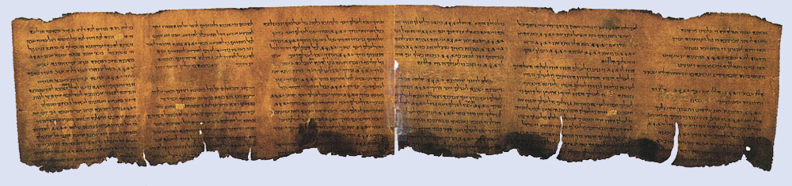

By the end of this section, you will be able to:
* Recognize common modes of radioactive decay
* Identify common particles and energies involved in nuclear decay reactions
* Write and balance nuclear decay equations
* Calculate kinetic parameters for decay processes, including half-life
* Describe common radiometric dating techniques

Following the somewhat serendipitous discovery of radioactivity by Becquerel, many prominent scientists began to investigate this new, intriguing phenomenon. Among them were Marie Curie (the first woman to win a Nobel Prize, and the only person to win two Nobel Prizes in different sciences—chemistry and physics), who was the first to coin the term “radioactivity,” and Ernest Rutherford (of gold foil experiment fame), who investigated and named three of the most common types of radiation. During the beginning of the twentieth century, many radioactive substances were discovered, the properties of radiation were investigated and quantified, and a solid understanding of radiation and nuclear decay was developed.

The spontaneous change of an unstable nuclide into another is **radioactive decay**{: data-type="term"}. The unstable nuclide is called the **parent nuclide**{: data-type="term"}; the nuclide that results from the decay is known as the **daughter nuclide**{: data-type="term"}. The daughter nuclide may be stable, or it may decay itself. The radiation produced during radioactive decay is such that the daughter nuclide lies closer to the band of stability than the parent nuclide, so the location of a nuclide relative to the band of stability can serve as a guide to the kind of decay it will undergo ([\[link\]](#CNX_Chem_21_03_Reaction1)).

 ![A diagram shows two spheres composed of many smaller white and green spheres connected by a right-facing arrow with another, down-facing arrow coming off of it. The left sphere, labeled &#x201C;Parent nucleus uranium dash 238&#x201D; has two white and two green spheres that are near one another and are outlined in red. These two green and two white spheres are shown near the tip of the down-facing arrow and labeled &#x201C;alpha particle.&#x201D; The right sphere, labeled &#x201C;Daughter nucleus radon dash 234,&#x201D; looks the same as the left, but has a space for four smaller spheres outlined with a red dotted line.](../resources/CNX_Chem_21_03_Reaction1.jpg "A nucleus of uranium-238 (the parent nuclide) undergoes &#x3B1; decay to form thorium-234 (the daughter nuclide). The alpha particle removes two protons (green) and two neutrons (gray) from the uranium-238 nucleus."){: #CNX_Chem_21_03_Reaction1}

  
Although the radioactive decay of a nucleus is too small to see with the naked eye, we can indirectly view radioactive decay in an environment called a cloud chamber. Click [here][1] to learn about cloud chambers and to view an interesting Cloud Chamber Demonstration from the Jefferson Lab.

### Types of Radioactive Decay

Ernest Rutherford’s experiments involving the interaction of radiation with a magnetic or electric field ([\[link\]](#CNX_Chem_21_03_Radiation)) helped him determine that one type of radiation consisted of positively charged and relatively massive α particles; a second type was made up of negatively charged and much less massive β particles; and a third was uncharged electromagnetic waves, γ rays. We now know that α particles are high-energy helium nuclei, β particles are high-energy electrons, and γ radiation compose high-energy electromagnetic radiation. We classify different types of radioactive decay by the radiation produced.

 ![A diagram is shown. A gray box on the left side of the diagram labeled &#x201C;Lead block&#x201D; has a chamber hollowed out in the center in which a sample labeled &#x201C;Radioactive substance&#x201D; is placed. A blue beam is coming from the sample, out of the block, and passing through two horizontally placed plates that are labeled &#x201C;Electrically charged plates.&#x201D; The top plate is labeled with a positive sign while the bottom plate is labeled with a negative sign. The beam is shown to break into three beams as it passes in between the plates; in order from top to bottom, they are red, labeled &#x201C;beta rays,&#x201D; purple labeled &#x201C;gamma rays&#x201D; and green labeled &#x201C;alpha rays.&#x201D; The beams are shown to hit a vertical plate labeled &#x201C;Photographic plate&#x201D; on the far right side of the diagram.](../resources/CNX_Chem_21_03_Radiation.jpg "Alpha particles, which are attracted to the negative plate and deflected by a relatively small amount, must be positively charged and relatively massive. Beta particles, which are attracted to the positive plate and deflected a relatively large amount, must be negatively charged and relatively light. Gamma rays, which are unaffected by the electric field, must be uncharged."){: #CNX_Chem_21_03_Radiation}

**Alpha (α) decay**{: data-type="term"} is the emission of an α particle from the nucleus. For example, polonium-210 undergoes α decay:

<math xmlns="http://www.w3.org/1998/Math/MathML"><mrow><msubsup><mrow /><mrow><mspace width="0.5em" /><mn>84</mn></mrow><mn>210</mn></msubsup><mtext>Po</mtext> <mspace width="0.2em" /><mo stretchy="false">⟶</mo><mspace width="0.2em" /> <msubsup><mrow /><mrow><mn>2</mn></mrow><mn>4</mn></msubsup><mtext>He</mtext> <mo>+</mo> <msubsup><mrow /><mrow><mspace width="0.5em" /><mn>82</mn></mrow><mn>206</mn></msubsup><mtext>Pb</mtext> <mspace width="3em" /><mtext>or</mtext><mspace width="3em" /> <msubsup><mrow /><mrow><mspace width="0.5em" /><mn>84</mn></mrow><mn>210</mn></msubsup><mtext>Po</mtext> <mspace width="0.2em" /><mo stretchy="false">⟶</mo><mspace width="0.2em" /><mrow> <msubsup><mrow /><mrow><mn>2</mn></mrow><mn>4</mn></msubsup><mtext>α</mtext> </mrow><mo>+</mo> <msubsup><mrow /><mrow><mspace width="0.5em" /><mn>82</mn></mrow><mn>206</mn></msubsup><mtext>Pb</mtext> </mrow></math>

Alpha decay occurs primarily in heavy nuclei (A &gt; 200, Z &gt; 83). Because the loss of an α particle gives a daughter nuclide with a mass number four units smaller and an atomic number two units smaller than those of the parent nuclide, the daughter nuclide has a larger n:p ratio than the parent nuclide. If the parent nuclide undergoing α decay lies below the band of stability (refer to [\[link\]](/m51196#CNX_Chem_21_01_BandStable)), the daughter nuclide will lie closer to the band.

**Beta (β) decay**{: data-type="term"} is the emission of an electron from a nucleus. Iodine-131 is an example of a nuclide that undergoes β decay:

<math xmlns="http://www.w3.org/1998/Math/MathML"><mrow> <msubsup><mrow /><mrow><mspace width="0.5em" /><mn>53</mn></mrow><mn>131</mn></msubsup><mtext>I</mtext> <mspace width="0.2em" /><mo stretchy="false">⟶</mo><mspace width="0.2em" /><mrow> <msubsup><mrow /><mn>-1</mn><mrow><mspace width="0.5em" /><mn>0</mn></mrow></msubsup><mtext>e</mtext> </mrow><mo>+</mo> <msubsup><mrow /><mrow><mspace width="0.5em" /><mn>54</mn></mrow><mn>131</mn></msubsup><mtext>Xe</mtext> <mspace width="3em" /><mtext>or</mtext><mspace width="3em" /> <msubsup><mrow /><mrow><mspace width="0.5em" /><mn>53</mn></mrow><mn>131</mn></msubsup><mtext>I</mtext> <mspace width="0.2em" /><mo stretchy="false">⟶</mo><mspace width="0.2em" /> <msubsup><mrow /><mn>-1</mn><mrow><mspace width="0.5em" /><mn>0</mn></mrow></msubsup><mtext>β</mtext> <mo>+</mo> <msubsup><mrow /><mrow><mspace width="0.5em" /><mn>54</mn></mrow><mn>131</mn></msubsup><mtext>Xe</mtext> </mrow></math>

Beta decay, which can be thought of as the conversion of a neutron into a proton and a β particle, is observed in nuclides with a large n:p ratio. The beta particle (electron) emitted is from the atomic nucleus and is not one of the electrons surrounding the nucleus. Such nuclei lie above the band of stability. Emission of an electron does not change the mass number of the nuclide but does increase the number of its protons and decrease the number of its neutrons. Consequently, the n:p ratio is decreased, and the daughter nuclide lies closer to the band of stability than did the parent nuclide.

**Gamma emission (γ emission)**{: data-type="term"} is observed when a nuclide is formed in an excited state and then decays to its ground state with the emission of a γ ray, a quantum of high-energy electromagnetic radiation. The presence of a nucleus in an excited state is often indicated by an asterisk (\*). Cobalt-60 emits γ radiation and is used in many applications including cancer treatment:

<math xmlns="http://www.w3.org/1998/Math/MathML"><mrow><mrow> <msubsup><mrow /><mrow><mn>27</mn></mrow><mn>60</mn></msubsup><mtext>Co*</mtext> </mrow><mspace width="0.2em" /><mo stretchy="false">⟶</mo><mspace width="0.2em" /><mrow> <msubsup><mrow /><mrow><mn>0</mn></mrow><mn>0</mn></msubsup><mtext>γ</mtext> </mrow><mo>+</mo> <msubsup><mrow /><mrow><mn>27</mn></mrow><mn>60</mn></msubsup><mtext>Co</mtext> </mrow></math>

There is no change in mass number or atomic number during the emission of a γ ray unless the γ emission accompanies one of the other modes of decay.

**Positron emission (β+ decay**{: data-type="term"}) is the emission of a positron from the nucleus. Oxygen-15 is an example of a nuclide that undergoes positron emission:

<math xmlns="http://www.w3.org/1998/Math/MathML"><mrow> <msubsup><mrow /><mrow><mspace width="0.5em" /><mn>8</mn></mrow><mn>15</mn></msubsup><mtext>O</mtext> <mspace width="0.2em" /><mo stretchy="false">⟶</mo><mspace width="0.2em" /><mrow> <msubsup><mrow /><mn>+1</mn><mrow><mspace width="0.5em" /><mn>0</mn></mrow></msubsup><mtext>e</mtext> </mrow><mo>+</mo> <msubsup><mrow /><mrow><mspace width="0.5em" /><mn>7</mn></mrow><mn>15</mn></msubsup><mtext>N</mtext> <mspace width="3em" /><mtext>or</mtext><mspace width="3em" /> <msubsup><mrow /><mrow><mspace width="0.5em" /><mn>8</mn></mrow><mn>15</mn></msubsup><mtext>O</mtext> <mspace width="0.2em" /><mo stretchy="false">⟶</mo><mspace width="0.2em" /><mrow> <msubsup><mrow /><mn>+1</mn><mrow><mspace width="0.5em" /><mn>0</mn></mrow></msubsup><mtext>β</mtext> </mrow><mo>+</mo> <msubsup><mrow /><mrow><mspace width="0.5em" /><mn>7</mn></mrow><mn>15</mn></msubsup><mtext>N</mtext> </mrow></math>

Positron emission is observed for nuclides in which the n:p ratio is low. These nuclides lie below the band of stability. Positron decay is the conversion of a proton into a neutron with the emission of a positron. The n:p ratio increases, and the daughter nuclide lies closer to the band of stability than did the parent nuclide.

**Electron capture**{: data-type="term"} occurs when one of the inner electrons in an atom is captured by the atom’s nucleus. For example, potassium-40 undergoes electron capture:

<math xmlns="http://www.w3.org/1998/Math/MathML"><mrow> <msubsup><mrow /><mrow><mn>19</mn></mrow><mn>40</mn></msubsup><mtext>K</mtext> <mo>+</mo><mrow> <msubsup><mrow /><mn>-1</mn><mrow><mspace width="0.5em" /><mn>0</mn></mrow></msubsup><mtext>e</mtext> </mrow><mspace width="0.2em" /><mo stretchy="false">⟶</mo><mspace width="0.2em" /> <msubsup><mrow /><mrow><mn>18</mn></mrow><mn>40</mn></msubsup><mtext>Ar</mtext> </mrow></math>

Electron capture occurs when an inner shell electron combines with a proton and is converted into a neutron. The loss of an inner shell electron leaves a vacancy that will be filled by one of the outer electrons. As the outer electron drops into the vacancy, it will emit energy. In most cases, the energy emitted will be in the form of an X-ray. Like positron emission, electron capture occurs for “proton-rich” nuclei that lie below the band of stability. Electron capture has the same effect on the nucleus as does positron emission: The atomic number is decreased by one and the mass number does not change. This increases the n:p ratio, and the daughter nuclide lies closer to the band of stability than did the parent nuclide. Whether electron capture or positron emission occurs is difficult to predict. The choice is primarily due to kinetic factors, with the one requiring the smaller activation energy being the one more likely to occur.

[\[link\]](#CNX_Chem_21_03_RadioDecay) summarizes these types of decay, along with their equations and changes in atomic and mass numbers.

 ![This table has four columns and six rows. The first row is a header row and it labels each column: &#x201C;Type,&#x201D; &#x201C;Nuclear equation,&#x201D; &#x201C;Representation,&#x201D; and &#x201C;Change in mass / atomic numbers.&#x201D; Under the &#x201C;Type&#x201D; column are the following: &#x201C;Alpha decay,&#x201D; &#x201C;Beta decay,&#x201D; &#x201C;Gamma decay,&#x201D; &#x201C;Positron emission,&#x201D; and &#x201C;Electron capture.&#x201D; Under the &#x201C;Nuclear equation&#x201D; column are several equations. Each begins with superscript A stacked over subscript Z X. There is a large gap of space and then the following equations: &#x201C;superscript 4 stacked over subscript 2 He plus superscript A minus 4 stacked over subscript Z minus 2 Y,&#x201D; &#x201C;superscript 0 stacked over subscript negative 1 e plus superscript A stacked over subscript Z plus 1 Y,&#x201D; &#x201C;superscript 0 stacked over subscript 0 lowercase gamma plus superscript A stacked over subscript Z Y,&#x201D; &#x201C;superscript 0 stacked over subscript positive 1 e plus superscript A stacked over subscript Y minus 1 Y,&#x201D; and &#x201C;superscript 0 stacked over subscript negative 1 e plus superscript A stacked over subscript Y minus 1 Y.&#x201D; Under the &#x201C;Representation&#x201D; column are the five diagrams. The first shows a cluster of green and white spheres. A section of the cluster containing two white and two green spheres is outlined. There is a right-facing arrow pointing to a similar cluster as previously described, but the outlined section is missing. From the arrow another arrow branches off and points downward. The small cluster to two white spheres and two green spheres appear at the end of the arrow. The next diagram shows the same cluster of white and green spheres. One white sphere is outlined. There is a right-facing arrow to a similar cluster, but the white sphere is missing. Another arrow branches off the main arrow and a red sphere with a negative sign appears at the end. The next diagram shows the same cluster of white and green spheres. The whole sphere is outlined and labeled, &#x201C;excited nuclear state.&#x201D; There is a right-facing arrow that points to the same cluster. No spheres are missing. Off the main arrow is another arrow which points to a purple squiggle arrow which in turn points to a lowercase gamma. The next diagram shows the same cluster of white and green spheres. One green sphere is outlined. There is a right-facing arrow to a similar cluster, but the green sphere is missing. Another arrow branches off the main arrow and a red sphere with a positive sign appears at the end. The next diagram shows the same cluster of white and green spheres. One green sphere is outlined. There is a right-facing arrow to a similar cluster, but the green sphere is missing. Two other arrows branch off the main arrow. The first shows a gold sphere with a negative sign joining with the right-facing arrow. The secon points to a blue squiggle arrow labeled, &#x201C;X-ray.&#x201D; Under the &#x201C;Change in mass / atomic numbers&#x201D; column are the following: &#x201C;A: decrease by 4, Z: decrease by 2,&#x201D; &#x201C;A: unchanged, Z: increased by 1,&#x201D; &#x201C;A: unchanged, Z: unchanged,&#x201D; &#x201C;A: unchanged, Z: unchanged,&#x201D; &#x201C;A: unchanged, Z: decrease by 1,&#x201D; and &#x201C;A: unchanged, Z: decrease by 1.&#x201D;](../resources/CNX_Chem_21_03_RadioDecay.jpg "This table summarizes the type, nuclear equation, representation, and any changes in the mass or atomic numbers for various types of decay."){: #CNX_Chem_21_03_RadioDecay}

PET Scan

Positron emission tomography (PET) scans use radiation to diagnose and track health conditions and monitor medical treatments by revealing how parts of a patient’s body function ([\[link\]](#CNX_Chem_21_03_PETScan)). To perform a PET scan, a positron-emitting radioisotope is produced in a cyclotron and then attached to a substance that is used by the part of the body being investigated. This “tagged” compound, or radiotracer, is then put into the patient (injected via IV or breathed in as a gas), and how it is used by the tissue reveals how that organ or other area of the body functions.

![Three pictures are shown and labeled &#x201C;a,&#x201D; &#x201C;b&#x201D; and &#x201C;c.&#x201D; Picture a shows a machine with a round opening connected to an examination table. Picture b is a medical scan of the top of a person&#x2019;s head and shows large patches of yellow and red and smaller patches of blue, green and purple highlighting. Picture c also shows a medical scan of the top of a person&#x2019;s head, but this image is mostly colored in blue and purple with very small patches of red and yellow.](../resources/CNX_Chem_21_03_PETScan.jpg "A PET scanner (a) uses radiation to provide an image of how part of a patient&#x2019;s body functions. The scans it produces can be used to image a healthy brain (b) or can be used for diagnosing medical conditions such as Alzheimer&#x2019;s disease (c). (credit a: modification of work by Jens Maus)"){: #CNX_Chem_21_03_PETScan}

For example, F-18 is produced by proton bombardment of 18O <math xmlns="http://www.w3.org/1998/Math/MathML"><mrow><mo stretchy="false">(</mo> <msubsup><mrow /><mrow><mspace width="0.5em" /><mn>8</mn></mrow><mn>18</mn></msubsup><mtext>O</mtext> <mo>+</mo> <msubsup><mrow /><mrow><mn>1</mn></mrow><mn>1</mn></msubsup><mtext>p</mtext> <mspace width="0.2em" /><mo stretchy="false">⟶</mo><mspace width="0.2em" /> <msubsup><mrow /><mrow><mspace width="0.5em" /><mn>9</mn></mrow><mn>18</mn></msubsup><mtext>F</mtext> <mo>+</mo> <msubsup><mrow /><mrow><mn>0</mn></mrow><mn>1</mn></msubsup><mtext>n</mtext> <mo stretchy="false">)</mo></mrow></math>

 and incorporated into a glucose analog called fludeoxyglucose (FDG). How FDG is used by the body provides critical diagnostic information; for example, since cancers use glucose differently than normal tissues, FDG can reveal cancers. The 18F emits positrons that interact with nearby electrons, producing a burst of gamma radiation. This energy is detected by the scanner and converted into a detailed, three-dimensional, color image that shows how that part of the patient’s body functions. Different levels of gamma radiation produce different amounts of brightness and colors in the image, which can then be interpreted by a radiologist to reveal what is going on. PET scans can detect heart damage and heart disease, help diagnose Alzheimer’s disease, indicate the part of a brain that is affected by epilepsy, reveal cancer, show what stage it is, and how much it has spread, and whether treatments are effective. Unlike magnetic resonance imaging and X-rays, which only show how something looks, the big advantage of PET scans is that they show how something functions. PET scans are now usually performed in conjunction with a computed tomography scan.

### Radioactive Decay Series

The naturally occurring radioactive isotopes of the heaviest elements fall into chains of successive disintegrations, or decays, and all the species in one chain constitute a radioactive family, or **radioactive decay series**{: data-type="term"}. Three of these series include most of the naturally radioactive elements of the periodic table. They are the uranium series, the actinide series, and the thorium series. The neptunium series is a fourth series, which is no longer significant on the earth because of the short half-lives of the species involved. Each series is characterized by a parent (first member) that has a long half-life and a series of daughter nuclides that ultimately lead to a stable end-product—that is, a nuclide on the band of stability ([\[link\]](#CNX_Chem_21_03_DecayS)). In all three series, the end-product is a stable isotope of lead. The neptunium series, previously thought to terminate with bismuth-209, terminates with thallium-205.

 ![A graph is shown where the x-axis is labeled &#x201C;Number of neutrons, open parenthesis, n, close parenthesis&#x201D; and has values of 122 to 148 in increments of 2. The y-axis is labeled &#x201C;Atomic number&#x201D; and has values of 80 to 92 in increments of 1. Two types of arrows are used in this graph to connect the points. Green arrows are labeled as &#x201C;alpha decay&#x201D; while red arrows are labeled &#x201C;beta decay.&#x201D; Beginning at the point &#x201C;92, 146&#x201D; that is labeled &#x201C;superscript 238, U,&#x201D; a green arrow connects this point to the second point &#x201C;90, 144&#x201D; which is labeled &#x201C;superscript 234, T h.&#x201D; A red arrow connect this to the third point &#x201C;91, 143&#x201D; which is labeled &#x201C;superscript 234, P a&#x201D; which is connected to the fourth point &#x201C;92, 142&#x201D; by a red arrow and which is labeled &#x201C;superscript 234, U.&#x201D; A green arrow leads to the next point, &#x201C;90, 140&#x201D; which is labeled &#x201C;superscript 230, T h&#x201D; and is connected by a green arrow to the sixth point, &#x201C;88, 138&#x201D; which is labeled &#x201C;superscript 226, R a&#x201D; that is in turn connected by a green arrow to the seventh point &#x201C;86, 136&#x201D; which is labeled &#x201C;superscript 222, Ra.&#x201D; The eighth point, at &#x201C;84, 134&#x201D; is labeled &#x201C;superscript 218, P o&#x201D; and has green arrows leading to it and away from it to the ninth point &#x201C;82, 132&#x201D; which is labeled &#x201C;superscript 214, Pb&#x201D; which is connected by a red arrow to the tenth point, &#x201C;83, 131&#x201D; which is labeled &#x201C;superscript 214, B i.&#x201D; A red arrow leads to the eleventh point &#x201C;84, 130&#x201D; which is labeled &#x201C;superscript 214, P o&#x201D; and a green arrow leads to the twelvth point &#x201C;82, 128&#x201D; which is labeled &#x201C;superscript 210, P b.&#x201D; A red arrow leads to the thirteenth point &#x201C;83, 127&#x201D; which is labeled &#x201C;superscript 210, B i&#x201D; and a red arrow leads to the fourteenth point &#x201C;84, 126&#x201D; which is labeled &#x201C;superscript 210, P o.&#x201D; The final point is labeled &#x201C;82, 124&#x201D; and &#x201C;superscript 206, P b.&#x201D;](../resources/CNX_Chem_21_03_DecayS.jpg "Uranium-238 undergoes a radioactive decay series consisting of 14 separate steps before producing stable lead-206. This series consists of eight &#x3B1; decays and six &#x3B2; decays."){: #CNX_Chem_21_03_DecayS}

### Radioactive Half-Lives

Radioactive decay follows first-order kinetics. Since first-order reactions have already been covered in detail in the kinetics chapter, we will now apply those concepts to nuclear decay reactions. Each radioactive nuclide has a characteristic, constant **half-life**{: data-type="term"} (*t*1/2), the time required for half of the atoms in a sample to decay. An isotope’s half-life allows us to determine how long a sample of a useful isotope will be available, and how long a sample of an undesirable or dangerous isotope must be stored before it decays to a low-enough radiation level that is no longer a problem.

For example, cobalt-60, an isotope that emits gamma rays used to treat cancer, has a half-life of 5.27 years ([\[link\]](#CNX_Chem_21_03_HalfLife)). In a given cobalt-60 source, since half of the <math xmlns="http://www.w3.org/1998/Math/MathML"><mrow> <msubsup><mrow /><mrow><mn>27</mn></mrow><mn>60</mn></msubsup><mtext>Co</mtext> </mrow></math>

 nuclei decay every 5.27 years, both the amount of material and the intensity of the radiation emitted is cut in half every 5.27 years. (Note that for a given substance, the intensity of radiation that it produces is directly proportional to the rate of decay of the substance and the amount of the substance.) This is as expected for a process following first-order kinetics. Thus, a cobalt-60 source that is used for cancer treatment must be replaced regularly to continue to be effective.

![A graph, titled &#x201C;C o dash 60 Decay,&#x201D; is shown where the x-axis is labeled &#x201C;C o dash 60 remaining, open parenthesis, percent sign, close parenthesis&#x201D; and has values of 0 to 100 in increments of 25. The y-axis is labeled &#x201C;Number of half dash lives&#x201D; and has values of 0 to 5 in increments of 1. The first point, at &#x201C;0, 100&#x201D; has a circle filled with tiny dots drawn near it labeled &#x201C;10 g.&#x201D; The second point, at &#x201C;1, 50&#x201D; has a smaller circle filled with tiny dots drawn near it labeled &#x201C;5 g.&#x201D; The third point, at &#x201C;2, 25&#x201D; has a small circle filled with tiny dots drawn near it labeled &#x201C;2.5 g.&#x201D; The fourth point, at &#x201C;3, 12.5&#x201D; has a very small circle filled with tiny dots drawn near it labeled &#x201C;1.25 g.&#x201D; The last point, at &#x201C;4, 6.35&#x201D; has a tiny circle filled with tiny dots drawn near it labeled.&#x201D;625 g.&#x201D;](../resources/CNX_Chem_21_03_HalfLife.jpg "For cobalt-60, which has a half-life of 5.27 years, 50% remains after 5.27 years (one half-life), 25% remains after 10.54 years (two half-lives), 12.5% remains after 15.81 years (three half-lives), and so on."){: #CNX_Chem_21_03_HalfLife}

Since nuclear decay follows first-order kinetics, we can adapt the mathematical relationships used for first-order chemical reactions. We generally substitute the number of nuclei, *N*, for the concentration. If the rate is stated in nuclear decays per second, we refer to it as the activity of the radioactive sample. The rate for radioactive decay is:

decay rate = *λN* with *λ* = the decay constant for the particular radioisotope

The decay constant, *λ*, which is the same as a rate constant discussed in the kinetics chapter. It is possible to express the decay constant in terms of the half-life, *t*1/2\:

<math xmlns="http://www.w3.org/1998/Math/MathML"><mrow><mi>λ</mi><mo>=</mo><mspace width="0.2em" /><mfrac><mrow><mtext>ln 2</mtext></mrow><mrow><msub><mi>t</mi><mrow><mn>1</mn><mtext>/</mtext><mn>2</mn></mrow></msub></mrow></mfrac><mspace width="0.2em" /><mo>=</mo><mspace width="0.2em" /><mfrac><mrow><mn>0.693</mn></mrow><mrow><msub><mi>t</mi><mrow><mn>1</mn><mtext>/</mtext><mn>2</mn></mrow></msub></mrow></mfrac><mspace width="3em" /><mtext>or</mtext><mspace width="3em" /><msub><mi>t</mi><mrow><mn>1</mn><mtext>/</mtext><mn>2</mn></mrow></msub><mo>=</mo><mspace width="0.2em" /><mfrac><mrow><mtext>ln 2</mtext></mrow><mi>λ</mi></mfrac><mspace width="0.2em" /><mo>=</mo><mspace width="0.2em" /><mfrac><mrow><mn>0.693</mn></mrow><mi>λ</mi></mfrac><mspace width="0.2em" /></mrow></math>

The first-order equations relating amount, *N*, and time are:

<math xmlns="http://www.w3.org/1998/Math/MathML"><mrow><msub><mi>N</mi><mi>t</mi></msub><mo>=</mo><msub><mi>N</mi><mn>0</mn></msub><msup><mi>e</mi><mrow><mo>−</mo><mi>k</mi><mi>t</mi></mrow></msup><mspace width="3em" /><mtext>or</mtext><mspace width="3em" /><mi>t</mi><mo>=</mo><mo>−</mo><mfrac><mn>1</mn><mi>λ</mi></mfrac><mspace width="0.2em" /><mtext>ln</mtext><mspace width="0.2em" /><mrow><mo>(</mo><mrow><mfrac><mrow><msub><mi>N</mi><mi>t</mi></msub></mrow><mrow><msub><mi>N</mi><mn>0</mn></msub></mrow></mfrac><mspace width="0.2em" /></mrow><mo>)</mo></mrow></mrow></math>

where *N*0 is the initial number of nuclei or moles of the isotope, and *Nt* is the number of nuclei/moles remaining at time *t*. [\[link\]](#fs-idp79391408) applies these calculations to find the rates of radioactive decay for specific nuclides.

Rates of Radioactive Decay<math xmlns="http://www.w3.org/1998/Math/MathML"><mrow> <msubsup><mrow /><mrow><mn>27</mn></mrow><mn>60</mn></msubsup><mtext>Co</mtext> </mrow></math>

 decays with a half-life of 5.27 years to produce <math xmlns="http://www.w3.org/1998/Math/MathML"><mrow> <msubsup><mrow /><mrow><mn>28</mn></mrow><mn>60</mn></msubsup><mtext>Ni</mtext> <mo>.</mo></mrow></math>

(a) What is the decay constant for the radioactive disintegration of cobalt-60?

(b) Calculate the fraction of a sample of the <math xmlns="http://www.w3.org/1998/Math/MathML"><mrow> <msubsup><mrow /><mrow><mn>27</mn></mrow><mn>60</mn></msubsup><mtext>Co</mtext> </mrow></math>

 isotope that will remain after 15 years.

(c) How long does it take for a sample of <math xmlns="http://www.w3.org/1998/Math/MathML"><mrow> <msubsup><mrow /><mrow><mn>27</mn></mrow><mn>60</mn></msubsup><mtext>Co</mtext> </mrow></math>

 to disintegrate to the extent that only 2.0% of the original amount remains?

Solution (a) The value of the rate constant is given by:

<math xmlns="http://www.w3.org/1998/Math/MathML"><mrow><mi>λ</mi><mo>=</mo><mspace width="0.2em" /><mfrac><mrow><mtext>ln 2</mtext></mrow><mrow><msub><mi>t</mi><mrow><mn>1</mn><mtext>/</mtext><mn>2</mn></mrow></msub></mrow></mfrac><mspace width="0.2em" /><mo>=</mo><mspace width="0.2em" /><mfrac><mrow><mn>0.693</mn></mrow><mrow><mn>5.27</mn><mspace width="0.2em" /><mtext>y</mtext></mrow></mfrac><mspace width="0.2em" /><mo>=</mo><mn>0.132</mn><mspace width="0.2em" /><msup><mtext>y</mtext><mrow><mn>−1</mn></mrow></msup></mrow></math>

(b) The fraction of <math xmlns="http://www.w3.org/1998/Math/MathML"><mrow> <msubsup><mrow /><mrow><mn>27</mn></mrow><mn>60</mn></msubsup><mtext>Co</mtext> </mrow></math>

 that is left after time *t* is given by <math xmlns="http://www.w3.org/1998/Math/MathML"><mrow><mspace width="0.2em" /><mfrac><mrow><msub><mi>N</mi><mi>t</mi></msub></mrow><mrow><msub><mi>N</mi><mn>0</mn></msub></mrow></mfrac><mo>.</mo></mrow></math>

 Rearranging the first-order relationship *Nt* = *N*0*e*–*λt* to solve for this ratio yields:

<math xmlns="http://www.w3.org/1998/Math/MathML"><mrow><mspace width="0.2em" /><mfrac><mrow><msub><mi>N</mi><mi>t</mi></msub></mrow><mrow><msub><mi>N</mi><mn>0</mn></msub></mrow></mfrac><mspace width="0.2em" /><mo>=</mo><msup><mi>e</mi><mrow><mo>−</mo><mi>λ</mi><mi>t</mi></mrow></msup><mo>=</mo><msup><mi>e</mi><mrow><mo>−</mo><mrow><mo>(</mo><mrow><mn>0.132</mn><mtext>/y</mtext></mrow><mo>)</mo></mrow><mrow><mo>(</mo><mrow><mn>15.0</mn><mtext>/y</mtext></mrow><mo>)</mo></mrow></mrow></msup><mo>=</mo><mn>0.138</mn></mrow></math>

The fraction of <math xmlns="http://www.w3.org/1998/Math/MathML"><mrow> <msubsup><mrow /><mrow><mn>27</mn></mrow><mn>60</mn></msubsup><mtext>Co</mtext> </mrow></math>

 that will remain after 15.0 years is 0.138. Or put another way, 13.8% of the <math xmlns="http://www.w3.org/1998/Math/MathML"><mrow> <msubsup><mrow /><mrow><mn>27</mn></mrow><mn>60</mn></msubsup><mtext>Co</mtext> </mrow></math>

 originally present will remain after 15 years.

(c) 2.00% of the original amount of <math xmlns="http://www.w3.org/1998/Math/MathML"><mrow> <msubsup><mrow /><mrow><mn>27</mn></mrow><mn>60</mn></msubsup><mtext>Co</mtext> </mrow></math>

 is equal to 0.0200 <math xmlns="http://www.w3.org/1998/Math/MathML"><mo>×</mo></math>

 *N*0. Substituting this into the equation for time for first-order kinetics, we have:

<math xmlns="http://www.w3.org/1998/Math/MathML"><mrow><mi>t</mi><mo>=</mo><mo>−</mo><mfrac><mn>1</mn><mi>λ</mi></mfrac><mspace width="0.2em" /><mtext>ln</mtext><mspace width="0.2em" /><mrow><mo>(</mo><mrow><mfrac><mrow><msub><mi>N</mi><mi>t</mi></msub></mrow><mrow><msub><mi>N</mi><mn>0</mn></msub></mrow></mfrac><mspace width="0.2em" /></mrow><mo>)</mo></mrow><mspace width="0.2em" /><mo>=</mo><mspace width="0.2em" /><mo>−</mo><mfrac><mn>1</mn><mrow><mn>0.132</mn><mspace width="0.2em" /><msup><mrow><mtext>y</mtext></mrow><mrow><mn>−1</mn></mrow></msup></mrow></mfrac><mspace width="0.2em" /><mtext>ln</mtext><mspace width="0.2em" /><mrow><mo>(</mo><mrow><mfrac><mrow><mn>0.0200</mn><mspace width="0.2em" /><mo>×</mo><mspace width="0.2em" /><msub><mi>N</mi><mn>0</mn></msub></mrow><mrow><msub><mi>N</mi><mn>0</mn></msub></mrow></mfrac><mspace width="0.2em" /></mrow><mo>)</mo></mrow><mspace width="0.2em" /><mo>=</mo><mn>29.6</mn><mspace width="0.2em" /><mtext>y</mtext></mrow></math>

Check Your LearningRadon-222, <math xmlns="http://www.w3.org/1998/Math/MathML"><mrow> <msubsup><mrow /><mrow><mspace width="0.5em" /><mn>86</mn></mrow><mn>222</mn></msubsup><mtext>Rn</mtext> <mo>,</mo></mrow></math>

 has a half-life of 3.823 days. How long will it take a sample of radon-222 with a mass of 0.750 g to decay into other elements, leaving only 0.100 g of radon-222?

Answer:

11\.1 days

Because each nuclide has a specific number of nucleons, a particular balance of repulsion and attraction, and its own degree of stability, the half-lives of radioactive nuclides vary widely. For example: the half-life of <math xmlns="http://www.w3.org/1998/Math/MathML"><mrow> <msubsup><mrow /><mrow><mspace width="0.5em" /><mn>83</mn></mrow><mn>209</mn></msubsup><mtext>Bi</mtext> </mrow></math>

 is 1.9 <math xmlns="http://www.w3.org/1998/Math/MathML"><mo>×</mo></math>

 1019 years; <math xmlns="http://www.w3.org/1998/Math/MathML"><mrow> <msubsup><mrow /><mrow><mspace width="0.5em" /><mn>94</mn></mrow><mn>239</mn></msubsup><mtext>Ra</mtext> </mrow></math>

 is 24,000 years; <math xmlns="http://www.w3.org/1998/Math/MathML"><mrow> <msubsup><mrow /><mrow><mspace width="0.5em" /><mn>86</mn></mrow><mn>222</mn></msubsup><mtext>Rn</mtext></mrow></math>

 is 3.82 days; and element-111 (Rg for roentgenium) is 1.5 <math xmlns="http://www.w3.org/1998/Math/MathML"><mo>×</mo></math>

 10–3 seconds. The half-lives of a number of radioactive isotopes important to medicine are shown in [\[link\]](#fs-idp14399952), and others are listed in [Appendix M](/m51233){: .target-chapter}.

<table summary="This table has four columns and six rows. The first row is a header row, and it labels each column: &#x201C;Type,&#x201D; &#x201C;Decay Mode,&#x201D; &#x201C;Half-life,&#x201D; and &#x201C;Uses.&#x201D; Under the &#x201C;Type&#x201D; column are the following: &#x201C;F - 18,&#x201D; &#x201C;C o - 60,&#x201D; &#x201C;T c - 99 m,&#x201D; &#x201C;I &#x2013; 131,&#x201D; and &#x201C;T l - 201.&#x201D; Under the &#x201C;Decay Mode&#x201D; column are the following: &#x201C;lowercase beta superscript positive sign decay,&#x201D; &#x201C;lowercase beta decay, lowercase gamma decay,&#x201D; &#x201C;lowercase gamma decay,&#x201D; &#x201C;lowercase beta decay,&#x201D; and &#x201C;electron capture.&#x201D; Under the &#x201C;Half-life&#x201D; column are the following: 110. Minutes, 5.27 years, 8.01 hours, 8.02 days, and 73 hours. Under the &#x201C;Uses&#x201D; column are the following: PET scans; concern treatment; scans of brain, lung heart bone, etc.; thyroid scans and treatment; heart and arteries scans and cardiac stress tests." class="span-all"><thead>
<tr valign="middle">
<th colspan="4" data-align="center">Half-lives of Radioactive Isotopes Important to Medicine</th>
</tr>
<tr valign="middle">
<th data-align="left">Type<a data-type="footnote-link" href="#footnote1">1</a></th>
<th data-align="left">Decay Mode</th>
<th data-align="left">Half-Life</th>
<th data-align="left">Uses</th>
</tr>
</thead><tbody>
<tr valign="middle">
<td data-align="left">F-18</td>
<td data-align="left">β+ decay</td>
<td data-align="left">110. minutes</td>
<td data-align="left">PET scans</td>
</tr>
<tr valign="middle">
<td data-align="left">Co-60</td>
<td data-align="left">β decay, γ decay</td>
<td data-align="left">5.27 years</td>
<td data-align="left">cancer treatment</td>
</tr>
<tr valign="middle">
<td data-align="left">Tc-99m</td>
<td data-align="left">γ decay</td>
<td data-align="left">8.01 hours</td>
<td data-align="left">scans of brain, lung, heart, bone</td>
</tr>
<tr valign="middle">
<td data-align="left">I-131</td>
<td data-align="left">β decay</td>
<td data-align="left">8.02 days</td>
<td data-align="left">thyroid scans and treatment</td>
</tr>
<tr valign="middle">
<td data-align="left">Tl-201</td>
<td data-align="left">electron capture</td>
<td data-align="left">73 hours</td>
<td data-align="left">heart and arteries scans; cardiac stress tests</td>
</tr>
</tbody></table>

### Radiometric Dating

Several radioisotopes have half-lives and other properties that make them useful for purposes of “dating” the origin of objects such as archaeological artifacts, formerly living organisms, or geological formations. This process is **radiometric dating**{: data-type="term"} and has been responsible for many breakthrough scientific discoveries about the geological history of the earth, the evolution of life, and the history of human civilization. We will explore some of the most common types of radioactive dating and how the particular isotopes work for each type.

#### Radioactive Dating Using Carbon-14

The radioactivity of carbon-14 provides a method for dating objects that were a part of a living organism. This method of radiometric dating, which is also called **radiocarbon dating**{: data-type="term"} or carbon-14 dating, is accurate for dating carbon-containing substances that are up to about 30,000 years old, and can provide reasonably accurate dates up to a maximum of about 50,000 years old.

Naturally occurring carbon consists of three isotopes: <math xmlns="http://www.w3.org/1998/Math/MathML"><mrow> <msubsup><mrow /><mrow><mspace width="0.5em" /><mn>6</mn></mrow><mn>12</mn></msubsup><mtext>C</mtext> <mtext>,</mtext></mrow></math>

 which constitutes about 99% of the carbon on earth; <math xmlns="http://www.w3.org/1998/Math/MathML"><mrow> <msubsup><mrow /><mrow><mspace width="0.5em" /><mn>6</mn></mrow><mn>13</mn></msubsup><mtext>C</mtext> <mtext>,</mtext></mrow></math>

 about 1% of the total; and trace amounts of <math xmlns="http://www.w3.org/1998/Math/MathML"><mrow> <msubsup><mrow /><mrow><mspace width="0.5em" /><mn>6</mn></mrow><mn>14</mn></msubsup><mtext>C</mtext> <mo>.</mo></mrow></math>

 Carbon-14 forms in the upper atmosphere by the reaction of nitrogen atoms with neutrons from cosmic rays in space:

<math xmlns="http://www.w3.org/1998/Math/MathML"><mrow> <msubsup><mrow /><mrow><mspace width="0.5em" /><mn>7</mn></mrow><mn>14</mn></msubsup><mtext>N</mtext> <mo>+</mo> <msubsup><mrow /><mrow><mn>0</mn></mrow><mn>1</mn></msubsup><mtext>n</mtext> <mspace width="0.2em" /><mo stretchy="false">⟶</mo><mspace width="0.2em" /> <msubsup><mrow /><mrow><mspace width="0.5em" /><mn>6</mn></mrow><mn>14</mn></msubsup><mtext>C</mtext> <mo>+</mo> <msubsup><mrow /><mrow><mn>1</mn></mrow><mn>1</mn></msubsup><mtext>H</mtext> </mrow></math>

All isotopes of carbon react with oxygen to produce CO2 molecules. The ratio of <math xmlns="http://www.w3.org/1998/Math/MathML"><mrow> <msubsup><mrow /><mrow><mspace width="0.5em" /><mn>6</mn></mrow><mn>14</mn></msubsup><mtext>C</mtext> <msub><mtext>O</mtext><mn>2</mn></msub></mrow></math>

 to <math xmlns="http://www.w3.org/1998/Math/MathML"><mrow> <msubsup><mrow /><mrow><mspace width="0.5em" /><mn>6</mn></mrow><mn>12</mn></msubsup><mtext>C</mtext> <msub><mtext>O</mtext><mn>2</mn></msub></mrow></math>

 depends on the ratio of <math xmlns="http://www.w3.org/1998/Math/MathML"><mrow> <msubsup><mrow /><mrow><mspace width="0.5em" /><mn>6</mn></mrow><mn>14</mn></msubsup><mtext>C</mtext> <mtext>O</mtext></mrow></math>

 to <math xmlns="http://www.w3.org/1998/Math/MathML"><mrow> <msubsup><mrow /><mrow><mspace width="0.5em" /><mn>6</mn></mrow><mn>12</mn></msubsup><mtext>C</mtext> <mtext>O</mtext></mrow></math>

 in the atmosphere. The natural abundance of <math xmlns="http://www.w3.org/1998/Math/MathML"><mrow> <msubsup><mrow /><mrow><mspace width="0.5em" /><mn>6</mn></mrow><mn>14</mn></msubsup><mtext>C</mtext> <mtext>O</mtext></mrow></math>

 in the atmosphere is approximately 1 part per trillion; until recently, this has generally been constant over time, as seen is gas samples found trapped in ice. The incorporation of <math xmlns="http://www.w3.org/1998/Math/MathML"><mrow> <msubsup><mrow /><mrow><mspace width="0.5em" /><mn>6</mn></mrow><mn>14</mn></msubsup><mtext>C</mtext> <msubsup><mrow /><mrow><mspace width="0.5em" /><mn>6</mn></mrow><mn>14</mn></msubsup><mtext>C</mtext> <msub><mtext>O</mtext><mn>2</mn></msub></mrow></math>

 and <math xmlns="http://www.w3.org/1998/Math/MathML"><mrow> <msubsup><mrow /><mrow><mspace width="0.5em" /><mn>6</mn></mrow><mn>12</mn></msubsup><mtext>C</mtext> <msub><mtext>O</mtext><mn>2</mn></msub></mrow></math>

 into plants is a regular part of the photosynthesis process, which means that the <math xmlns="http://www.w3.org/1998/Math/MathML"><mrow> <msubsup><mrow /><mrow><mspace width="0.5em" /><mn>6</mn></mrow><mn>14</mn></msubsup><mtext>C</mtext> <mtext>:</mtext><mspace width="0.2em" /> <msubsup><mrow /><mrow><mspace width="0.5em" /><mn>6</mn></mrow><mn>12</mn></msubsup><mtext>C</mtext> </mrow></math>

 ratio found in a living plant is the same as the <math xmlns="http://www.w3.org/1998/Math/MathML"><mrow> <msubsup><mrow /><mrow><mspace width="0.5em" /><mn>6</mn></mrow><mn>14</mn></msubsup><mtext>C</mtext> <mtext>:</mtext><mspace width="0.2em" /> <msubsup><mrow /><mrow><mspace width="0.5em" /><mn>6</mn></mrow><mn>12</mn></msubsup><mtext>C</mtext> </mrow></math>

 ratio in the atmosphere. But when the plant dies, it no longer traps carbon through photosynthesis. Because <math xmlns="http://www.w3.org/1998/Math/MathML"><mrow> <msubsup><mrow /><mrow><mspace width="0.5em" /><mn>6</mn></mrow><mn>12</mn></msubsup><mtext>C</mtext> </mrow></math>

 is a stable isotope and does not undergo radioactive decay, its concentration in the plant does not change. However, carbon-14 decays by β emission with a half-life of 5730 years:

<math xmlns="http://www.w3.org/1998/Math/MathML"><mrow> <msubsup><mrow /><mrow><mspace width="0.5em" /><mn>6</mn></mrow><mn>14</mn></msubsup><mtext>C</mtext> <mspace width="0.2em" /><mo stretchy="false">⟶</mo><mspace width="0.2em" /> <msubsup><mrow /><mrow><mspace width="0.5em" /><mn>7</mn></mrow><mn>12</mn></msubsup><mtext>N</mtext> <mo>+</mo><mrow> <msubsup><mrow /><mn>-1</mn><mrow><mspace width="0.5em" /><mn>0</mn></mrow></msubsup><mtext>e</mtext> </mrow></mrow></math>

Thus, the <math xmlns="http://www.w3.org/1998/Math/MathML"><mrow> <msubsup><mrow /><mrow><mspace width="0.5em" /><mn>6</mn></mrow><mn>14</mn></msubsup><mtext>C</mtext> <mtext>:</mtext><mspace width="0.2em" /> <msubsup><mrow /><mrow><mspace width="0.5em" /><mn>6</mn></mrow><mn>12</mn></msubsup><mtext>C</mtext> </mrow></math>

 ratio gradually decreases after the plant dies. The decrease in the ratio with time provides a measure of the time that has elapsed since the death of the plant (or other organism that ate the plant). [\[link\]](#CNX_Chem_21_03_CarbonDate) visually depicts this process.

![A diagram shows a cow standing on the ground next to a tree. In the upper left of the diagram, where the sky is represented, a single white sphere is shown and is connected by a downward-facing arrow to a larger sphere composed of green and white spheres that is labeled &#x201C;superscript 14, subscript 7, N.&#x201D; This structure is connected to three other structures by a right-facing arrow. Each of the three it points to are composed of green and white spheres and all have arrows pointing from them to the ground. The first of these is labeled &#x201C;Trace, superscript 14, subscript 6, C,&#x201D; the second is labeled &#x201C;1 percent, superscript 13, subscript 6, C&#x201D; and the last is labeled &#x201C;99 percent, superscript 12, subscript 6, C.&#x201D; Two downward-facing arrows that merge into one arrow lead from the cow and tree to the ground and are labeled &#x201C;organism dies&#x201D; and &#x201C;superscript 14, subscript 6, C, decay begins.&#x201D; A right-facing arrow labeled on top as &#x201C;Decay&#x201D; and on bottom as &#x201C;Time&#x201D; leads from this to a label of &#x201C;superscript 14, subscript 6, C, backslash, superscript 12, subscript 6, C, ratio decreased.&#x201D; Near the top of the tree is a downward facing arrow with the label &#x201C;superscript 14, subscript 6, C, backslash, superscript 12, subscript 6, C, ratio is constant in living organisms&#x201D; that leads to the last of the lower statements.](../resources/CNX_Chem_21_03_CarbonDate.jpg "Along with stable carbon-12, radioactive carbon-14 is taken in by plants and animals, and remains at a constant level within them while they are alive. After death, the C-14 decays and the C-14:C-12 ratio in the remains decreases. Comparing this ratio to the C-14:C-12 ratio in living organisms allows us to determine how long ago the organism lived (and died)."){: #CNX_Chem_21_03_CarbonDate}

For example, with the half-life of <math xmlns="http://www.w3.org/1998/Math/MathML"><mrow> <msubsup><mrow /><mrow><mspace width="0.5em" /><mn>6</mn></mrow><mn>14</mn></msubsup><mtext>C</mtext> </mrow></math>

 being 5730 years, if the <math xmlns="http://www.w3.org/1998/Math/MathML"><mrow> <msubsup><mrow /><mrow><mspace width="0.5em" /><mn>6</mn></mrow><mn>14</mn></msubsup><mtext>C</mtext> <mtext>:</mtext><mspace width="0.2em" /> <msubsup><mrow /><mrow><mspace width="0.5em" /><mn>6</mn></mrow><mn>12</mn></msubsup><mtext>C</mtext> </mrow></math>

 ratio in a wooden object found in an archaeological dig is half what it is in a living tree, this indicates that the wooden object is 5730 years old. Highly accurate determinations of <math xmlns="http://www.w3.org/1998/Math/MathML"><mrow> <msubsup><mrow /><mrow><mspace width="0.5em" /><mn>6</mn></mrow><mn>14</mn></msubsup><mtext>C</mtext> <mtext>:</mtext><mspace width="0.2em" /> <msubsup><mrow /><mrow><mspace width="0.5em" /><mn>6</mn></mrow><mn>12</mn></msubsup><mtext>C</mtext> </mrow></math>

 ratios can be obtained from very small samples (as little as a milligram) by the use of a mass spectrometer.

  
Visit this [website][2] to perform simulations of radiometric dating.

Radiocarbon Dating A tiny piece of paper (produced from formerly living plant matter) taken from the Dead Sea Scrolls has an activity of 10.8 disintegrations per minute per gram of carbon. If the initial C-14 activity was 13.6 disintegrations/min/g of C, estimate the age of the Dead Sea Scrolls.

Solution The rate of decay (number of disintegrations/minute/gram of carbon) is proportional to the amount of radioactive C-14 left in the paper, so we can substitute the rates for the amounts, *N*, in the relationship:

<math xmlns="http://www.w3.org/1998/Math/MathML"><mrow><mi>t</mi><mo>=</mo><mo>−</mo><mfrac><mn>1</mn><mi>λ</mi></mfrac><mspace width="0.2em" /><mtext>ln</mtext><mspace width="0.2em" /><mrow><mo>(</mo><mrow><mfrac><mrow><msub><mi>N</mi><mi>t</mi></msub></mrow><mrow><msub><mi>N</mi><mn>0</mn></msub></mrow></mfrac><mspace width="0.2em" /></mrow><mo>)</mo></mrow><mspace width="0.2em" /><mo stretchy="false">⟶</mo><mspace width="0.2em" /><mi>t</mi><mo>=</mo><mo>−</mo><mfrac><mn>1</mn><mi>λ</mi></mfrac><mspace width="0.2em" /><mtext>ln</mtext><mspace width="0.2em" /><mrow><mo>(</mo><mrow><mfrac><mrow><msub><mrow><mtext>Rate</mtext></mrow><mi>t</mi></msub></mrow><mrow><msub><mrow><mtext>Rate</mtext></mrow><mn>0</mn></msub></mrow></mfrac><mspace width="0.2em" /></mrow><mo>)</mo></mrow></mrow></math>

where the subscript 0 represents the time when the plants were cut to make the paper, and the subscript *t* represents the current time.

The decay constant can be determined from the half-life of C-14, 5730 years:

<math xmlns="http://www.w3.org/1998/Math/MathML"><mrow><mi>λ</mi><mo>=</mo><mspace width="0.2em" /><mfrac><mrow><mtext>ln 2</mtext></mrow><mrow><msub><mi>t</mi><mrow><mn>1</mn><mtext>/</mtext><mn>2</mn></mrow></msub></mrow></mfrac><mspace width="0.2em" /><mo>=</mo><mspace width="0.2em" /><mfrac><mrow><mn>0.693</mn></mrow><mrow><mtext>5730 y</mtext></mrow></mfrac><mspace width="0.2em" /><mo>=</mo><mspace width="0.2em" /><mn>1.21</mn><mspace width="0.2em" /><mo>×</mo><mspace width="0.2em" /><msup><mrow><mn>10</mn></mrow><mrow><mn>−4</mn></mrow></msup><mspace width="0.2em" /><msup><mtext>y</mtext><mrow><mn>−1</mn></mrow></msup></mrow></math>

Substituting and solving, we have:

<math xmlns="http://www.w3.org/1998/Math/MathML"><mrow><mi>t</mi><mo>=</mo><mo>−</mo><mfrac><mn>1</mn><mi>λ</mi></mfrac><mspace width="0.2em" /><mtext>ln</mtext><mspace width="0.2em" /><mrow><mo>(</mo><mrow><mspace width="0.2em" /><mfrac><mrow><msub><mrow><mtext>Rate</mtext></mrow><mi>t</mi></msub></mrow><mrow><msub><mrow><mtext>Rate</mtext></mrow><mn>0</mn></msub></mrow></mfrac><mspace width="0.2em" /></mrow><mo>)</mo></mrow><mspace width="0.2em" /><mo>=</mo><mspace width="0.2em" /><mo>−</mo><mfrac><mn>1</mn><mrow><mn>1.21</mn><mspace width="0.2em" /><mo>×</mo><mspace width="0.2em" /><msup><mrow><mn>10</mn></mrow><mrow><mn>−4</mn></mrow></msup><mspace width="0.2em" /><msup><mtext>y</mtext><mrow><mn>−1</mn></mrow></msup></mrow></mfrac><mspace width="0.2em" /><mtext>ln</mtext><mspace width="0.2em" /><mrow><mo>(</mo><mrow><mspace width="0.2em" /><mfrac><mrow><mn>10.8</mn><mspace width="0.2em" /><mtext>dis/min/g C</mtext></mrow><mrow><mn>13.6</mn><mspace width="0.2em" /><mtext>dis/min/g C</mtext></mrow></mfrac><mspace width="0.2em" /></mrow><mo>)</mo></mrow><mspace width="0.2em" /><mo>=</mo><mspace width="0.2em" /><mtext>1910 y</mtext></mrow></math>

Therefore, the Dead Sea Scrolls are approximately 1900 years old ([\[link\]](#CNX_Chem_21_03_DSScrolls)).

{: #CNX_Chem_21_03_DSScrolls}

Check Your Learning More accurate dates of the reigns of ancient Egyptian pharaohs have been determined recently using plants that were preserved in their tombs. Samples of seeds and plant matter from King Tutankhamun’s tomb have a C-14 decay rate of 9.07 disintegrations/min/g of C. How long ago did King Tut’s reign come to an end?

Answer:

about 3350 years ago, or approximately 1340 BC

There have been some significant, well-documented changes to the <math xmlns="http://www.w3.org/1998/Math/MathML"><mrow> <msubsup><mrow /><mrow><mspace width="0.5em" /><mn>6</mn></mrow><mn>14</mn></msubsup><mtext>C</mtext> <mtext>:</mtext><mspace width="0.2em" /> <msubsup><mrow /><mrow><mspace width="0.5em" /><mn>6</mn></mrow><mn>12</mn></msubsup><mtext>C</mtext> </mrow></math>

 ratio. The accuracy of a straightforward application of this technique depends on the <math xmlns="http://www.w3.org/1998/Math/MathML"><mrow> <msubsup><mrow /><mrow><mspace width="0.5em" /><mn>6</mn></mrow><mn>14</mn></msubsup><mtext>C</mtext> <mtext>:</mtext><mspace width="0.2em" /> <msubsup><mrow /><mrow><mspace width="0.5em" /><mn>6</mn></mrow><mn>12</mn></msubsup><mtext>C</mtext> </mrow></math>

 ratio in a living plant being the same now as it was in an earlier era, but this is not always valid. Due to the increasing accumulation of CO2 molecules (largely <math xmlns="http://www.w3.org/1998/Math/MathML"><mrow> <msubsup><mrow /><mrow><mspace width="0.5em" /><mn>6</mn></mrow><mn>12</mn></msubsup><mtext>C</mtext> <msub><mtext>O</mtext><mn>2</mn></msub><mo>)</mo></mrow></math>

 in the atmosphere caused by combustion of fossil fuels (in which essentially all of the <math xmlns="http://www.w3.org/1998/Math/MathML"><mrow> <msubsup><mrow /><mrow><mspace width="0.5em" /><mn>6</mn></mrow><mn>14</mn></msubsup><mtext>C</mtext> </mrow></math>

 has decayed), the ratio of <math xmlns="http://www.w3.org/1998/Math/MathML"><mrow> <msubsup><mrow /><mrow><mspace width="0.5em" /><mn>6</mn></mrow><mn>14</mn></msubsup><mtext>C</mtext> <mtext>:</mtext><mspace width="0.2em" /> <msubsup><mrow /><mrow><mspace width="0.5em" /><mn>6</mn></mrow><mn>12</mn></msubsup><mtext>C</mtext> </mrow></math>

 in the atmosphere may be changing. This manmade increase in <math xmlns="http://www.w3.org/1998/Math/MathML"><mrow> <msubsup><mrow /><mrow><mspace width="0.5em" /><mn>6</mn></mrow><mn>12</mn></msubsup><mtext>C</mtext> <msub><mtext>O</mtext><mn>2</mn></msub></mrow></math>

 in the atmosphere causes the <math xmlns="http://www.w3.org/1998/Math/MathML"><mrow> <msubsup><mrow /><mrow><mspace width="0.5em" /><mn>6</mn></mrow><mn>14</mn></msubsup><mtext>C</mtext> <mtext>:</mtext><mspace width="0.2em" /> <msubsup><mrow /><mrow><mspace width="0.5em" /><mn>6</mn></mrow><mn>12</mn></msubsup><mtext>C</mtext> </mrow></math>

 ratio to decrease, and this in turn affects the ratio in currently living organisms on the earth. Fortunately, however, we can use other data, such as tree dating via examination of annual growth rings, to calculate correction factors. With these correction factors, accurate dates can be determined. In general, radioactive dating only works for about 10 half-lives; therefore, the limit for carbon-14 dating is about 57,000 years.

#### Radioactive Dating Using Nuclides Other than Carbon-14

Radioactive dating can also use other radioactive nuclides with longer half-lives to date older events. For example, uranium-238 (which decays in a series of steps into lead-206) can be used for establishing the age of rocks (and the approximate age of the oldest rocks on earth). Since U-238 has a half-life of 4.5 billion years, it takes that amount of time for half of the original U-238 to decay into Pb-206. In a sample of rock that does not contain appreciable amounts of Pb-208, the most abundant isotope of lead, we can assume that lead was not present when the rock was formed. Therefore, by measuring and analyzing the ratio of U-238:Pb-206, we can determine the age of the rock. This assumes that all of the lead-206 present came from the decay of uranium-238. If there is additional lead-206 present, which is indicated by the presence of other lead isotopes in the sample, it is necessary to make an adjustment. Potassium-argon dating uses a similar method. K-40 decays by positron emission and electron capture to form Ar-40 with a half-life of 1.25 billion years. If a rock sample is crushed and the amount of Ar-40 gas that escapes is measured, determination of the Ar-40:K-40 ratio yields the age of the rock. Other methods, such as rubidium-strontium dating (Rb-87 decays into Sr-87 with a half-life of 48.8 billion years), operate on the same principle. To estimate the lower limit for the earth’s age, scientists determine the age of various rocks and minerals, making the assumption that the earth is older than the oldest rocks and minerals in its crust. As of 2014, the oldest known rocks on earth are the Jack Hills zircons from Australia, found by uranium-lead dating to be almost 4.4 billion years old.

Radioactive Dating of Rocks An igneous rock contains 9.58 <math xmlns="http://www.w3.org/1998/Math/MathML"><mo>×</mo></math>

 10–5 g of U-238 and 2.51 <math xmlns="http://www.w3.org/1998/Math/MathML"><mo>×</mo></math>

 10–5 g of Pb-206, and much, much smaller amounts of Pb-208. Determine the approximate time at which the rock formed.

Solution The sample of rock contains very little Pb-208, the most common isotope of lead, so we can safely assume that all the Pb-206 in the rock was produced by the radioactive decay of U-238. When the rock formed, it contained all of the U-238 currently in it, plus some U-238 that has since undergone radioactive decay.

The amount of U-238 currently in the rock is:

<math xmlns="http://www.w3.org/1998/Math/MathML"><mrow><mn>9.58</mn><mspace width="0.2em" /><mo>×</mo><mspace width="0.2em" /><msup><mrow><mn>10</mn></mrow><mrow><mn>−5</mn></mrow></msup><mspace width="0.2em" /><menclose notation="horizontalstrike"><mrow><mtext>g U</mtext></mrow></menclose><mspace width="0.2em" /><mo>×</mo><mspace width="0.2em" /><mrow><mo>(</mo><mrow><mspace width="0.2em" /><mfrac><mrow><mtext>1 mol U</mtext></mrow><mrow><mn>238</mn><mspace width="0.2em" /><menclose notation="horizontalstrike"><mrow><mtext>g U</mtext></mrow></menclose></mrow></mfrac><mspace width="0.2em" /></mrow><mo>)</mo></mrow><mspace width="0.2em" /><mo>=</mo><mspace width="0.2em" /><mn>4.03</mn><mspace width="0.2em" /><mo>×</mo><mspace width="0.2em" /><msup><mrow><mn>10</mn></mrow><mrow><mn>−7</mn></mrow></msup><mspace width="0.2em" /><mtext>mol U</mtext></mrow></math>

Because when one mole of U-238 decays, it produces one mole of Pb-206, the amount of U-238 that has undergone radioactive decay since the rock was formed is:

<math xmlns="http://www.w3.org/1998/Math/MathML"><mrow><mn>2.51</mn><mspace width="0.2em" /><mo>×</mo><mspace width="0.2em" /><msup><mrow><mn>10</mn></mrow><mrow><mn>−5</mn></mrow></msup><mspace width="0.2em" /><menclose notation="horizontalstrike"><mrow><mtext>g Pb</mtext></mrow></menclose><mspace width="0.2em" /><mo>×</mo><mspace width="0.2em" /><mrow><mo>(</mo><mrow><mspace width="0.2em" /><mfrac><mrow><mn>1</mn><mspace width="0.2em" /><menclose notation="horizontalstrike"><mrow><mtext>mol Pb</mtext></mrow></menclose></mrow><mrow><mn>206</mn><mspace width="0.2em" /><menclose notation="horizontalstrike"><mrow><mtext>g Pb</mtext></mrow></menclose></mrow></mfrac><mspace width="0.2em" /></mrow><mo>)</mo></mrow><mspace width="0.2em" /><mo>×</mo><mspace width="0.2em" /><mrow><mo>(</mo><mrow><mspace width="0.2em" /><mfrac><mrow><mtext>1 mol U</mtext></mrow><mrow><mn>1</mn><mspace width="0.2em" /><menclose notation="horizontalstrike"><mrow><mtext>mol Pb</mtext></mrow></menclose></mrow></mfrac><mspace width="0.2em" /></mrow><mo>)</mo></mrow><mspace width="0.2em" /><mo>=</mo><mspace width="0.2em" /><mn>1.22</mn><mspace width="0.2em" /><mo>×</mo><mspace width="0.2em" /><msup><mrow><mn>10</mn></mrow><mrow><mn>−7</mn></mrow></msup><mspace width="0.2em" /><mtext>mol U</mtext></mrow></math>

The total amount of U-238 originally present in the rock is therefore:

<math xmlns="http://www.w3.org/1998/Math/MathML"><mrow><mn>4.03</mn><mspace width="0.2em" /><mo>×</mo><mspace width="0.2em" /><msup><mrow><mn>10</mn></mrow><mrow><mn>−7</mn></mrow></msup><mspace width="0.2em" /><mtext>mol</mtext><mo>+</mo><mn>1.22</mn><mspace width="0.2em" /><mo>×</mo><mspace width="0.2em" /><msup><mrow><mn>10</mn></mrow><mrow><mn>−7</mn></mrow></msup><mspace width="0.2em" /><mtext>mol</mtext><mspace width="0.2em" /><mo>=</mo><mspace width="0.2em" /><mn>5.25</mn><mspace width="0.2em" /><mo>×</mo><mspace width="0.2em" /><msup><mrow><mn>10</mn></mrow><mrow><mn>−7</mn></mrow></msup><mspace width="0.2em" /><mtext>mol U</mtext></mrow></math>

The amount of time that has passed since the formation of the rock is given by:

<math xmlns="http://www.w3.org/1998/Math/MathML"><mrow><mi>t</mi><mo>=</mo><mspace width="0.2em" /><mo>−</mo><mfrac><mn>1</mn><mi>λ</mi></mfrac><mspace width="0.2em" /><mtext>ln</mtext><mspace width="0.2em" /><mrow><mo>(</mo><mrow><mspace width="0.2em" /><mfrac><mrow><msub><mi>N</mi><mi>t</mi></msub></mrow><mrow><msub><mi>N</mi><mn>0</mn></msub></mrow></mfrac><mspace width="0.2em" /></mrow><mo>)</mo></mrow></mrow></math>

with *N*0 representing the original amount of U-238 and *Nt* representing the present amount of U-238.

U-238 decays into Pb-206 with a half-life of 4.5 <math xmlns="http://www.w3.org/1998/Math/MathML"><mo>×</mo></math>

 109 y, so the decay constant *λ* is:

<math xmlns="http://www.w3.org/1998/Math/MathML"><mrow><mi>λ</mi><mspace width="0.2em" /><mo>=</mo><mspace width="0.2em" /><mfrac><mrow><mtext>ln 2</mtext></mrow><mrow><msub><mi>t</mi><mrow><mn>1</mn><mtext>/</mtext><mn>2</mn></mrow></msub></mrow></mfrac><mspace width="0.2em" /><mo>=</mo><mspace width="0.2em" /><mfrac><mrow><mn>0.693</mn></mrow><mrow><mn>4.5</mn><mspace width="0.2em" /><mo>×</mo><mspace width="0.2em" /><msup><mrow><mn>10</mn></mrow><mn>9</mn></msup><mspace width="0.2em" /><mtext>y</mtext></mrow></mfrac><mspace width="0.2em" /><mo>=</mo><mspace width="0.2em" /><mn>1.54</mn><mspace width="0.2em" /><mo>×</mo><mspace width="0.2em" /><msup><mrow><mn>10</mn></mrow><mrow><mn>−10</mn></mrow></msup><mspace width="0.2em" /><msup><mtext>y</mtext><mrow><mn>−1</mn></mrow></msup></mrow></math>

Substituting and solving, we have:

<math xmlns="http://www.w3.org/1998/Math/MathML"><mrow><mi>t</mi><mo>=</mo><mspace width="0.2em" /><mo>−</mo><mfrac><mn>1</mn><mrow><mn>1.54</mn><mspace width="0.2em" /><mo>×</mo><mspace width="0.2em" /><msup><mrow><mn>10</mn></mrow><mrow><mn>−10</mn></mrow></msup><mspace width="0.2em" /><msup><mtext>y</mtext><mrow><mn>−1</mn></mrow></msup></mrow></mfrac><mspace width="0.2em" /><mtext>ln</mtext><mspace width="0.2em" /><mrow><mo>(</mo><mrow><mfrac><mrow><mn>4.03</mn><mspace width="0.2em" /><mo>×</mo><mspace width="0.2em" /><msup><mrow><mn>10</mn></mrow><mrow><mn>−7</mn></mrow></msup><mspace width="0.2em" /><menclose notation="horizontalstrike"><mrow><mtext>mol U</mtext></mrow></menclose></mrow><mrow><mn>5.25</mn><mspace width="0.2em" /><mo>×</mo><mspace width="0.2em" /><msup><mrow><mn>10</mn></mrow><mrow><mn>−7</mn></mrow></msup><mspace width="0.2em" /><menclose notation="horizontalstrike"><mrow><mtext>mol U</mtext></mrow></menclose></mrow></mfrac><mspace width="0.2em" /></mrow><mo>)</mo></mrow><mspace width="0.2em" /><mo>=</mo><mspace width="0.2em" /><mn>1.7</mn><mspace width="0.2em" /><mo>×</mo><mspace width="0.2em" /><msup><mrow><mn>10</mn></mrow><mn>9</mn></msup><mspace width="0.2em" /><mtext>y</mtext></mrow></math>

Therefore, the rock is approximately 1.7 billion years old.

Check Your Learning A sample of rock contains 6.14 <math xmlns="http://www.w3.org/1998/Math/MathML"><mo>×</mo></math>

 10–4 g of Rb-87 and 3.51 <math xmlns="http://www.w3.org/1998/Math/MathML"><mo>×</mo></math>

 10–5 g of Sr-87. Calculate the age of the rock. (The half-life of the β decay of Rb-87 is 4.7 <math xmlns="http://www.w3.org/1998/Math/MathML"><mo>×</mo></math>

 1010 y.)

Answer:

3\.7 <math xmlns="http://www.w3.org/1998/Math/MathML"><mo>×</mo></math>

 109 y

### Key Concepts and Summary

Nuclei that have unstable n:p ratios undergo spontaneous radioactive decay. The most common types of radioactivity are α decay, β decay, γ emission, positron emission, and electron capture. Nuclear reactions also often involve γ rays, and some nuclei decay by electron capture. Each of these modes of decay leads to the formation of a new nucleus with a more stable n:p ratio. Some substances undergo radioactive decay series, proceeding through multiple decays before ending in a stable isotope. All nuclear decay processes follow first-order kinetics, and each radioisotope has its own characteristic half-life, the time that is required for half of its atoms to decay. Because of the large differences in stability among nuclides, there is a very wide range of half-lives of radioactive substances. Many of these substances have found useful applications in medical diagnosis and treatment, determining the age of archaeological and geological objects, and more.

### Key Equations

* decay rate = *λN*
* <math xmlns="http://www.w3.org/1998/Math/MathML"><mrow><msub><mi>t</mi><mrow><mn>1</mn><mtext>/</mtext><mn>2</mn></mrow></msub><mspace width="0.2em" /><mo>=</mo><mspace width="0.2em" /><mfrac><mrow><mtext>ln 2</mtext></mrow><mi>λ</mi></mfrac><mspace width="0.2em" /><mo>=</mo><mspace width="0.2em" /><mfrac><mrow><mn>0.693</mn></mrow><mi>λ</mi></mfrac><mspace width="0.2em" /></mrow></math>
{: data-bullet-style="bullet"}

### Chemistry End of Chapter Exercises

What are the types of radiation emitted by the nuclei of radioactive elements?

α (helium nuclei), β (electrons), β+ (positrons), and η (neutrons) may be emitted from a radioactive element, all of which are particles; γ rays also may be emitted.

What changes occur to the atomic number and mass of a nucleus during each of the following decay scenarios?

(a) an α particle is emitted

(b) a β particle is emitted

(c) γ radiation is emitted

(d) a positron is emitted

(e) an electron is captured

What is the change in the nucleus that results from the following decay scenarios?

(a) emission of a β particle

(b) emission of a β+ particle

(c) capture of an electron

(a) conversion of a neutron to a proton: <math xmlns="http://www.w3.org/1998/Math/MathML"><mrow> <msubsup><mrow /><mrow><mn>0</mn></mrow><mn>1</mn></msubsup><mtext>n</mtext> <mspace width="0.2em" /><mo stretchy="false">⟶</mo><mspace width="0.2em" /> <msubsup><mrow /><mrow><mn>1</mn></mrow><mn>1</mn></msubsup><mtext>p</mtext> <mo>+</mo> <msubsup><mrow /><mn>+1</mn><mrow><mspace width="0.5em" /><mn>0</mn></mrow></msubsup><mtext>e</mtext> <mo>;</mo></mrow></math>

 (b) conversion of a proton to a neutron; the positron has the same mass as an electron and the same magnitude of positive charge as the electron has negative charge; when the n:p ratio of a nucleus is too low, a proton is converted into a neutron with the emission of a positron: <math xmlns="http://www.w3.org/1998/Math/MathML"><mrow> <msubsup><mrow /><mrow><mn>1</mn></mrow><mn>1</mn></msubsup><mtext>p</mtext> <mspace width="0.2em" /><mo stretchy="false">⟶</mo><mspace width="0.2em" /> <msubsup><mrow /><mrow><mn>0</mn></mrow><mn>1</mn></msubsup><mtext>n</mtext> <mo>+</mo> <msubsup><mrow /><mn>+1</mn><mrow><mspace width="0.5em" /><mn>0</mn></mrow></msubsup><mtext>e</mtext> <mo>;</mo></mrow></math>

 (c) In a proton-rich nucleus, an inner atomic electron can be absorbed. In simplest form, this changes a proton into a neutron: <math xmlns="http://www.w3.org/1998/Math/MathML"><mrow> <msubsup><mrow /><mrow><mn>1</mn></mrow><mn>1</mn></msubsup><mtext>p</mtext> <mo>+</mo><mrow> <msubsup><mrow /><mn>-1</mn><mrow><mspace width="0.5em" /><mn>0</mn></mrow></msubsup><mtext>e</mtext> </mrow><mspace width="0.2em" /><mo stretchy="false">⟶</mo><mspace width="0.2em" /> <msubsup><mrow /><mrow><mn>0</mn></mrow><mn>1</mn></msubsup><mtext>p</mtext> </mrow></math>

Many nuclides with atomic numbers greater than 83 decay by processes such as electron emission. Explain the observation that the emissions from these unstable nuclides also normally include α particles.

Why is electron capture accompanied by the emission of an X-ray?

The electron pulled into the nucleus was most likely found in the 1*s* orbital. As an electron falls from a higher energy level to replace it, the difference in the energy of the replacement electron in its two energy levels is given off as an X-ray.

Explain, in terms of [[link]](/m51196#CNX_Chem_21_01_BandStable), how unstable heavy nuclides (atomic number &gt; 83) may decompose to form nuclides of greater stability (a) if they are below the band of stability and (b) if they are above the band of stability.

Which of the following nuclei is most likely to decay by positron emission? Explain your choice.

(a) chromium-53

(b) manganese-51

(c) iron-59

Manganese-51 is most likely to decay by positron emission. The n:p ratio for Cr-53 is <math xmlns="http://www.w3.org/1998/Math/MathML"><mrow><mspace width="0.2em" /><mfrac><mrow><mn>29</mn></mrow><mrow><mn>24</mn></mrow></mfrac><mspace width="0.2em" /></mrow></math>

 = 1.21; for Mn-51, it is <math xmlns="http://www.w3.org/1998/Math/MathML"><mrow><mspace width="0.2em" /><mfrac><mrow><mn>26</mn></mrow><mrow><mn>25</mn></mrow></mfrac><mspace width="0.2em" /></mrow></math>

 = 1.04; for Fe-59, it is <math xmlns="http://www.w3.org/1998/Math/MathML"><mrow><mspace width="0.2em" /><mfrac><mrow><mn>33</mn></mrow><mrow><mn>26</mn></mrow></mfrac><mspace width="0.2em" /></mrow></math>

 = 1.27. Positron decay occurs when the n:p ratio is low. Mn-51 has the lowest n:p ratio and therefore is most likely to decay by positron emission. Besides, <math xmlns="http://www.w3.org/1998/Math/MathML"><mrow> <msubsup><mrow /><mrow><mn>24</mn></mrow><mn>53</mn></msubsup><mtext>Cr</mtext> </mrow></math>

 is a stable isotope, and <math xmlns="http://www.w3.org/1998/Math/MathML"><mrow> <msubsup><mrow /><mrow><mn>26</mn></mrow><mn>59</mn></msubsup><mtext>Fe</mtext> </mrow></math>

 decays by beta emission.

The following nuclei do not lie in the band of stability. How would they be expected to decay? Explain your answer.

(a) <math xmlns="http://www.w3.org/1998/Math/MathML"><mrow> <msubsup><mrow /><mrow><mn>15</mn></mrow><mn>34</mn></msubsup><mtext>P</mtext> </mrow></math>

(b) <math xmlns="http://www.w3.org/1998/Math/MathML"><mrow> <msubsup><mrow /><mrow><mspace width="0.5em" /><mn>92</mn></mrow><mn>239</mn></msubsup><mtext>U</mtext> </mrow></math>

(c) <math xmlns="http://www.w3.org/1998/Math/MathML"><mrow> <msubsup><mrow /><mrow><mn>20</mn></mrow><mn>38</mn></msubsup><mtext>Ca</mtext> </mrow></math>

(d) <math xmlns="http://www.w3.org/1998/Math/MathML"><mrow> <msubsup><mrow /><mrow><mn>1</mn></mrow><mn>3</mn></msubsup><mtext>H</mtext> </mrow></math>

(e) <math xmlns="http://www.w3.org/1998/Math/MathML"><mrow> <msubsup><mrow /><mrow><mspace width="0.5em" /><mn>94</mn></mrow><mn>245</mn></msubsup><mtext>Pu</mtext> </mrow></math>

The following nuclei do not lie in the band of stability. How would they be expected to decay?

(a) <math xmlns="http://www.w3.org/1998/Math/MathML"><mrow> <msubsup><mrow /><mrow><mn>15</mn></mrow><mn>28</mn></msubsup><mtext>P</mtext> </mrow></math>

(b) <math xmlns="http://www.w3.org/1998/Math/MathML"><mrow> <msubsup><mrow /><mrow><mspace width="0.5em" /><mn>92</mn></mrow><mn>235</mn></msubsup><mtext>U</mtext> </mrow></math>

(c) <math xmlns="http://www.w3.org/1998/Math/MathML"><mrow> <msubsup><mrow /><mrow><mn>20</mn></mrow><mn>37</mn></msubsup><mtext>Ca</mtext> </mrow></math>

(d) <math xmlns="http://www.w3.org/1998/Math/MathML"><mrow> <msubsup><mrow /><mrow><mn>3</mn></mrow><mn>9</mn></msubsup><mtext>L</mtext> <mtext>i</mtext></mrow></math>

(e) <math xmlns="http://www.w3.org/1998/Math/MathML"><mrow> <msubsup><mrow /><mrow><mspace width="0.5em" /><mn>96</mn></mrow><mn>245</mn></msubsup><mtext>Cm</mtext> </mrow></math>

(a) β decay; (b) α decay; (c) positron emission; (d) β decay; (e) α decay

Predict by what mode(s) of spontaneous radioactive decay each of the following unstable isotopes might proceed:

(a) <math xmlns="http://www.w3.org/1998/Math/MathML"><mrow> <msubsup><mrow /><mrow><mn>2</mn></mrow><mn>6</mn></msubsup><mtext>H</mtext> <mtext>e</mtext></mrow></math>

(b) <math xmlns="http://www.w3.org/1998/Math/MathML"><mrow> <msubsup><mrow /><mrow><mn>30</mn></mrow><mn>60</mn></msubsup><mtext>Zn</mtext> </mrow></math>

(c) <math xmlns="http://www.w3.org/1998/Math/MathML"><mrow> <msubsup><mrow /><mrow><mspace width="0.5em" /><mn>91</mn></mrow><mn>235</mn></msubsup><mtext>Pa</mtext> </mrow></math>

(d) <math xmlns="http://www.w3.org/1998/Math/MathML"><mrow> <msubsup><mrow /><mrow><mspace width="0.5em" /><mn>94</mn></mrow><mn>241</mn></msubsup><mtext>Np</mtext> </mrow></math>

(e) 18F

(f) 129Ba

(g) 237Pu

Write a nuclear reaction for each step in the formation of <math xmlns="http://www.w3.org/1998/Math/MathML"><mrow> <msubsup><mrow /><mrow><mspace width="0.5em" /><mn>84</mn></mrow><mn>218</mn></msubsup><mtext>Po</mtext> </mrow></math>

 from <math xmlns="http://www.w3.org/1998/Math/MathML"><mrow> <msubsup><mrow /><mrow><mspace width="0.5em" /><mn>98</mn></mrow><mn>238</mn></msubsup><mtext>U</mtext> <mo>,</mo></mrow></math>

 which proceeds by a series of decay reactions involving the step-wise emission of α, β, β, α, α, α particles, in that order.

<math xmlns="http://www.w3.org/1998/Math/MathML"><mrow> <msubsup><mrow /><mrow><mspace width="0.5em" /><mn>92</mn></mrow><mn>238</mn></msubsup><mtext>U</mtext> <mspace width="0.2em" /><mo stretchy="false">⟶</mo><mspace width="0.2em" /> <msubsup><mrow /><mrow><mspace width="0.5em" /><mn>90</mn></mrow><mn>234</mn></msubsup><mtext>Th</mtext> <mo>+</mo> <msubsup><mrow /><mrow><mn>2</mn></mrow><mn>4</mn></msubsup><mtext>He</mtext> <mo>;</mo></mrow></math>

 <math xmlns="http://www.w3.org/1998/Math/MathML"><mrow> <msubsup><mrow /><mrow><mspace width="0.5em" /><mn>90</mn></mrow><mn>234</mn></msubsup><mtext>Th</mtext> <mspace width="0.2em" /><mo stretchy="false">⟶</mo><mspace width="0.2em" /> <msubsup><mrow /><mrow><mspace width="0.5em" /><mn>91</mn></mrow><mn>234</mn></msubsup><mtext>Pa</mtext> <mo>+</mo><mrow> <msubsup><mrow /><mn>-1</mn><mrow><mspace width="0.5em" /><mn>0</mn></mrow></msubsup><mtext>e</mtext> </mrow><mo>;</mo></mrow></math>

 <math xmlns="http://www.w3.org/1998/Math/MathML"><mrow> <msubsup><mrow /><mrow><mspace width="0.5em" /><mn>91</mn></mrow><mn>234</mn></msubsup><mtext>Pa</mtext> <mspace width="0.2em" /><mo stretchy="false">⟶</mo><mspace width="0.2em" /> <msubsup><mrow /><mrow><mspace width="0.5em" /><mn>92</mn></mrow><mn>234</mn></msubsup><mtext>U</mtext> <mo>+</mo><mrow> <msubsup><mrow /><mn>-1</mn><mrow><mspace width="0.5em" /><mn>0</mn></mrow></msubsup><mtext>e</mtext> </mrow><mo>;</mo></mrow></math>

 <math xmlns="http://www.w3.org/1998/Math/MathML"><mrow> <msubsup><mrow /><mrow><mspace width="0.5em" /><mn>92</mn></mrow><mn>234</mn></msubsup><mtext>U</mtext> <mspace width="0.2em" /><mo stretchy="false">⟶</mo><mspace width="0.2em" /> <msubsup><mrow /><mrow><mspace width="0.5em" /><mn>90</mn></mrow><mn>230</mn></msubsup><mtext>Th</mtext> <mo>+</mo> <msubsup><mrow /><mrow><mn>2</mn></mrow><mn>4</mn></msubsup><mtext>He</mtext> </mrow></math>

 <math xmlns="http://www.w3.org/1998/Math/MathML"><mrow> <msubsup><mrow /><mrow><mspace width="0.5em" /><mn>90</mn></mrow><mn>230</mn></msubsup><mtext>Th</mtext> <mspace width="0.2em" /><mo stretchy="false">⟶</mo><mspace width="0.2em" /> <msubsup><mrow /><mrow><mspace width="0.5em" /><mn>88</mn></mrow><mn>226</mn></msubsup><mtext>Ra</mtext> <mo>+</mo> <msubsup><mrow /><mrow><mn>2</mn></mrow><mn>4</mn></msubsup><mtext>He</mtext> </mrow></math>

 <math xmlns="http://www.w3.org/1998/Math/MathML"><mrow> <msubsup><mrow /><mrow><mspace width="0.5em" /><mn>88</mn></mrow><mn>226</mn></msubsup><mtext>Ra</mtext> <mspace width="0.2em" /><mo stretchy="false">⟶</mo><mspace width="0.2em" /> <msubsup><mrow /><mrow><mspace width="0.5em" /><mn>86</mn></mrow><mn>222</mn></msubsup><mtext>Rn</mtext> <mo>+</mo> <msubsup><mrow /><mrow><mn>2</mn></mrow><mn>4</mn></msubsup><mtext>He</mtext> <mo>;</mo></mrow></math>

 <math xmlns="http://www.w3.org/1998/Math/MathML"><mrow> <msubsup><mrow /><mrow><mspace width="0.5em" /><mn>86</mn></mrow><mn>222</mn></msubsup><mtext>Rn</mtext> <mspace width="0.2em" /><mo stretchy="false">⟶</mo><mspace width="0.2em" /> <msubsup><mrow /><mrow><mspace width="0.5em" /><mn>84</mn></mrow><mn>218</mn></msubsup><mtext>Po</mtext> <mo>+</mo> <msubsup><mrow /><mrow><mn>2</mn></mrow><mn>4</mn></msubsup><mtext>He</mtext> </mrow></math>

Write a nuclear reaction for each step in the formation of <math xmlns="http://www.w3.org/1998/Math/MathML"><mrow> <msubsup><mrow /><mrow><mspace width="0.5em" /><mn>82</mn></mrow><mn>208</mn></msubsup><mtext>Pb</mtext> </mrow></math>

 from <math xmlns="http://www.w3.org/1998/Math/MathML"><mrow> <msubsup><mrow /><mrow><mspace width="0.5em" /><mn>90</mn></mrow><mn>228</mn></msubsup><mtext>T</mtext> <mtext>h,</mtext></mrow></math>

 which proceeds by a series of decay reactions involving the step-wise emission of α, α, α, α, β, β, α particles, in that order.

Define the term half-life and illustrate it with an example.

Half-life is the time required for half the atoms in a sample to decay. Example (answers may vary): For C-14, the half-life is 5770 years. A 10-g sample of C-14 would contain 5 g of C-14 after 5770 years; a 0.20-g sample of C-14 would contain 0.10 g after 5770 years.

A 1.00 <math xmlns="http://www.w3.org/1998/Math/MathML"><mo>×</mo></math>

 10–6-g sample of nobelium, <math xmlns="http://www.w3.org/1998/Math/MathML"><mrow> <msubsup><mrow /><mrow><mn>102</mn></mrow><mn>254</mn></msubsup><mtext>No</mtext> <mo>,</mo></mrow></math>

 has a half-life of 55 seconds after it is formed. What is the percentage of <math xmlns="http://www.w3.org/1998/Math/MathML"><mrow> <msubsup><mrow /><mrow><mn>102</mn></mrow><mn>254</mn></msubsup><mtext>No</mtext> </mrow></math>

 remaining at the following times?

(a) 5.0 min after it forms

(b) 1.0 h after it forms

239Pu is a nuclear waste byproduct with a half-life of 24,000 y. What fraction of the 239Pu present today will be present in 1000 y?

<math xmlns="http://www.w3.org/1998/Math/MathML"><mrow><msup><mrow><mrow><mo>(</mo><mrow><mspace width="0.2em" /><mfrac><mn>1</mn><mn>2</mn></mfrac><mspace width="0.2em" /></mrow><mo>)</mo></mrow></mrow><mrow><mn>0.04</mn></mrow></msup><mspace width="0.2em" /><mo>=</mo><mspace width="0.2em" /><mn>0.973</mn></mrow></math>

 or 97.3%

The isotope 208Tl undergoes β decay with a half-life of 3.1 min.

(a) What isotope is produced by the decay?

(b) How long will it take for 99.0% of a sample of pure 208Tl to decay?

(c) What percentage of a sample of pure 208Tl remains un-decayed after 1.0 h?

If 1.000 g of <math xmlns="http://www.w3.org/1998/Math/MathML"><mrow> <msubsup><mrow /><mrow><mspace width="0.5em" /><mn>88</mn></mrow><mn>226</mn></msubsup><mtext>Ra</mtext> </mrow></math>

 produces 0.0001 mL of the gas <math xmlns="http://www.w3.org/1998/Math/MathML"><mrow> <msubsup><mrow /><mrow><mspace width="0.5em" /><mn>86</mn></mrow><mn>222</mn></msubsup><mtext>Rn</mtext> </mrow></math>

 at STP (standard temperature and pressure) in 24 h, what is the half-life of 226Ra in years?

2 <math xmlns="http://www.w3.org/1998/Math/MathML"><mo>×</mo></math>

 103 y

The isotope <math xmlns="http://www.w3.org/1998/Math/MathML"><mrow> <msubsup><mrow /><mrow><mn>38</mn></mrow><mn>90</mn></msubsup><mtext>Sr</mtext> </mrow></math>

 is one of the extremely hazardous species in the residues from nuclear power generation. The strontium in a 0.500-g sample diminishes to 0.393 g in 10.0 y. Calculate the half-life.

Technetium-99 is often used for assessing heart, liver, and lung damage because certain technetium compounds are absorbed by damaged tissues. It has a half-life of 6.0 h. Calculate the rate constant for the decay of <math xmlns="http://www.w3.org/1998/Math/MathML"><mrow> <msubsup><mrow /><mrow><mn>43</mn></mrow><mn>99</mn></msubsup><mtext>Tc</mtext> <mo>.</mo></mrow></math>

0\.12 h–1

What is the age of mummified primate skin that contains 8.25% of the original quantity of 14C?

A sample of rock was found to contain 8.23 mg of rubidium-87 and 0.47 mg of strontium-87.

(a) Calculate the age of the rock if the half-life of the decay of rubidium by β emission is 4.7 <math xmlns="http://www.w3.org/1998/Math/MathML"><mo>×</mo></math>

 1010 y.

(b) If some <math xmlns="http://www.w3.org/1998/Math/MathML"><mrow> <msubsup><mrow /><mrow><mn>38</mn></mrow><mn>87</mn></msubsup><mtext>Sr</mtext> </mrow></math>

 was initially present in the rock, would the rock be younger, older, or the same age as the age calculated in (a)? Explain your answer.

(a) 3.8 billion years;* * *
{: data-type="newline"}

 (b) The rock would be younger than the age calculated in part (a). If Sr was originally in the rock, the amount produced by radioactive decay would equal the present amount minus the initial amount. As this amount would be smaller than the amount used to calculate the age of the rock and the age is proportional to the amount of Sr, the rock would be younger.

A laboratory investigation shows that a sample of uranium ore contains 5.37 mg of <math xmlns="http://www.w3.org/1998/Math/MathML"><mrow> <msubsup><mrow /><mrow><mspace width="0.5em" /><mn>92</mn></mrow><mn>238</mn></msubsup><mtext>U</mtext> </mrow></math>

 and 2.52 mg of <math xmlns="http://www.w3.org/1998/Math/MathML"><mrow> <msubsup><mrow /><mrow><mspace width="0.5em" /><mn>82</mn></mrow><mn>206</mn></msubsup><mtext>Pb</mtext> <mo>.</mo></mrow></math>

 Calculate the age of the ore. The half-life of <math xmlns="http://www.w3.org/1998/Math/MathML"><mrow> <msubsup><mrow /><mrow><mspace width="0.5em" /><mn>92</mn></mrow><mn>238</mn></msubsup><mtext>U</mtext> </mrow></math>

 is 4.5 <math xmlns="http://www.w3.org/1998/Math/MathML"><mo>×</mo></math>

 109 yr.

Plutonium was detected in trace amounts in natural uranium deposits by Glenn Seaborg and his associates in 1941. They proposed that the source of this 239Pu was the capture of neutrons by 238U nuclei. Why is this plutonium not likely to have been trapped at the time the solar system formed 4.7 <math xmlns="http://www.w3.org/1998/Math/MathML"><mo>×</mo></math>

 109 years ago?

*c* = 0; This shows that no Pu-239 could remain since the formation of the earth. Consequently, the plutonium now present could not have been formed with the uranium.

A <math xmlns="http://www.w3.org/1998/Math/MathML"> <msubsup><mrow /><mrow><mn>4</mn></mrow><mn>7</mn></msubsup><mtext>Be</mtext> </math>

 atom (mass = 7.0169 amu) decays into a <math xmlns="http://www.w3.org/1998/Math/MathML"><mrow> <msubsup><mrow /><mrow><mn>3</mn></mrow><mn>7</mn></msubsup><mtext>L</mtext> <mtext>i</mtext></mrow></math>

 atom (mass = 7.0160 amu) by electron capture. How much energy (in millions of electron volts, MeV) is produced by this reaction?

A <math xmlns="http://www.w3.org/1998/Math/MathML"><mrow> <msubsup><mrow /><mrow><mn>5</mn></mrow><mn>8</mn></msubsup><mtext>B</mtext> </mrow></math>

 atom (mass = 8.0246 amu) decays into a <math xmlns="http://www.w3.org/1998/Math/MathML"><mrow> <msubsup><mrow /><mrow><mn>4</mn></mrow><mn>8</mn></msubsup><mtext>B</mtext> </mrow></math>

 atom (mass = 8.0053 amu) by loss of a β+ particle (mass = 0.00055 amu) or by electron capture. How much energy (in millions of electron volts) is produced by this reaction?

17\.5 MeV

Isotopes such as 26Al (half-life: 7.2 <math xmlns="http://www.w3.org/1998/Math/MathML"><mo>×</mo></math>

 105 years) are believed to have been present in our solar system as it formed, but have since decayed and are now called extinct nuclides.

(a) 26Al decays by β+ emission or electron capture. Write the equations for these two nuclear transformations.

(b) The earth was formed about 4.7 <math xmlns="http://www.w3.org/1998/Math/MathML"><mo>×</mo></math>

 109 (4.7 billion) years ago. How old was the earth when 99.999999% of the 26Al originally present had decayed?

Write a balanced equation for each of the following nuclear reactions:

(a) bismuth-212 decays into polonium-212

(b) beryllium-8 and a positron are produced by the decay of an unstable nucleus

(c) neptunium-239 forms from the reaction of uranium-238 with a neutron and then spontaneously converts into plutonium-239

(d) strontium-90 decays into yttrium-90

(a) <math xmlns="http://www.w3.org/1998/Math/MathML"><mrow> <msubsup><mrow /><mrow><mspace width="0.5em" /><mn>83</mn></mrow><mn>212</mn></msubsup><mtext>Bi</mtext> <mspace width="0.2em" /><mo stretchy="false">⟶</mo><mspace width="0.2em" /> <msubsup><mrow /><mrow><mspace width="0.5em" /><mn>84</mn></mrow><mn>212</mn></msubsup><mtext>Po</mtext> <mo>+</mo><mrow> <msubsup><mrow /><mn>-1</mn><mrow><mspace width="0.5em" /><mn>0</mn></mrow></msubsup><mtext>e</mtext> </mrow><mo>;</mo></mrow></math>

 (b) <math xmlns="http://www.w3.org/1998/Math/MathML"><mrow> <msubsup><mrow /><mrow><mn>5</mn></mrow><mn>8</mn></msubsup><mtext>B</mtext> <mspace width="0.2em" /><mo stretchy="false">⟶</mo><mspace width="0.2em" /> <msubsup><mrow /><mrow><mn>4</mn></mrow><mn>8</mn></msubsup><mtext>B</mtext> <mtext>e</mtext><mo>+</mo><mrow> <msubsup><mrow /><mn>-1</mn><mrow><mspace width="0.5em" /><mn>0</mn></mrow></msubsup><mtext>e</mtext> </mrow><mo>;</mo></mrow></math>

 (c) <math xmlns="http://www.w3.org/1998/Math/MathML"><mrow> <msubsup><mrow /><mrow><mspace width="0.5em" /><mn>92</mn></mrow><mn>238</mn></msubsup><mtext>U</mtext> <mo>+</mo> <msubsup><mrow /><mrow><mn>0</mn></mrow><mn>1</mn></msubsup><mtext>n</mtext> <mspace width="0.2em" /><mo stretchy="false">⟶</mo><mspace width="0.2em" /> <msubsup><mrow /><mrow><mspace width="0.5em" /><mn>93</mn></mrow><mn>239</mn></msubsup><mtext>Np</mtext> <mo>+</mo><mrow> <msubsup><mrow /><mn>-1</mn><mrow><mspace width="0.5em" /><mn>0</mn></mrow></msubsup><mtext>N</mtext> </mrow><mtext>p</mtext><mo>,</mo></mrow></math>

 <math xmlns="http://www.w3.org/1998/Math/MathML"><mrow> <msubsup><mrow /><mrow><mspace width="0.5em" /><mn>93</mn></mrow><mn>239</mn></msubsup><mtext>Np</mtext> <mspace width="0.2em" /><mo stretchy="false">⟶</mo><mspace width="0.2em" /> <msubsup><mrow /><mrow><mspace width="0.5em" /><mn>94</mn></mrow><mn>239</mn></msubsup><mtext>Pu</mtext> <mo>+</mo><mrow> <msubsup><mrow /><mn>-1</mn><mrow><mspace width="0.5em" /><mn>0</mn></mrow></msubsup><mtext>e</mtext> </mrow><mo>;</mo></mrow></math>

 (d) <math xmlns="http://www.w3.org/1998/Math/MathML"><mrow> <msubsup><mrow /><mrow><mn>38</mn></mrow><mn>90</mn></msubsup><mtext>Sr</mtext> <mspace width="0.2em" /><mo stretchy="false">⟶</mo><mspace width="0.2em" /> <msubsup><mrow /><mrow><mn>39</mn></mrow><mn>90</mn></msubsup><mtext>Y</mtext> <mo>+</mo><mrow> <msubsup><mrow /><mn>-1</mn><mrow><mspace width="0.5em" /><mn>0</mn></mrow></msubsup><mtext>e</mtext> </mrow></mrow></math>

Write a balanced equation for each of the following nuclear reactions:

(a) mercury-180 decays into platinum-176

(b) zirconium-90 and an electron are produced by the decay of an unstable nucleus

(c) thorium-232 decays and produces an alpha particle and a radium-228 nucleus, which decays into actinium-228 by beta decay

(d) neon-19 decays into fluorine-19

### Footnotes
{: data-type="footnote-refs-title"}

* {: data-type="footnote-ref" #footnote1} [1](#footnote-ref1){: data-type="footnote-ref-link"} The “m” in Tc-99m stands for “metastable,” indicating that this is an unstable, high-energy state of Tc-99. Metastable isotopes emit γ radiation to rid themselves of excess energy and become (more) stable.
{: data-list-type="bulleted" data-bullet-style="none"}

### Glossary
{: data-type="glossary-title"}

alpha (α) decay
: loss of an alpha particle during radioactive decay
^

beta (β) decay
: breakdown of a neutron into a proton, which remains in the nucleus, and an electron, which is emitted as a beta particle
^

daughter nuclide
: nuclide produced by the radioactive decay of another nuclide; may be stable or may decay further
^

electron capture
: combination of a core electron with a proton to yield a neutron within the nucleus
^

gamma (γ) emission
: decay of an excited-state nuclide accompanied by emission of a gamma ray
^

half-life (*t*1/2)
: time required for half of the atoms in a radioactive sample to decay
^

parent nuclide
: unstable nuclide that changes spontaneously into another (daughter) nuclide
^

positron emission
: (also, β+ decay) conversion of a proton into a neutron, which remains in the nucleus, and a positron, which is emitted
^

radioactive decay
: spontaneous decay of an unstable nuclide into another nuclide
^

radioactive decay series
: chains of successive disintegrations (radioactive decays) that ultimately lead to a stable end-product
^

radiocarbon dating
: highly accurate means of dating objects 30,000–50,000 years old that were derived from once-living matter; achieved by calculating the ratio of
  <math xmlns="http://www.w3.org/1998/Math/MathML"><mrow> <msubsup><mrow /><mrow><mspace width="0.5em" /><mn>6</mn></mrow><mn>14</mn></msubsup><mtext>C</mtext> <mtext>:</mtext><mspace width="0.2em" /> <msubsup><mrow /><mrow><mspace width="0.5em" /><mn>6</mn></mrow><mn>12</mn></msubsup><mtext>C</mtext> </mrow></math>
  
  in the object vs. the ratio of
  <math xmlns="http://www.w3.org/1998/Math/MathML"><mrow> <msubsup><mrow /><mrow><mspace width="0.5em" /><mn>6</mn></mrow><mn>14</mn></msubsup><mtext>C</mtext> <mtext>:</mtext><mspace width="0.2em" /> <msubsup><mrow /><mrow><mspace width="0.5em" /><mn>6</mn></mrow><mn>12</mn></msubsup><mtext>C</mtext> </mrow></math>
  
  in the present-day atmosphere
^

radiometric dating
: use of radioisotopes and their properties to date the formation of objects such as archeological artifacts, formerly living organisms, or geological formations

[1]: http://openstaxcollege.org/l/16cloudchamb
[2]: http://openstaxcollege.org/l/16phetradiom
