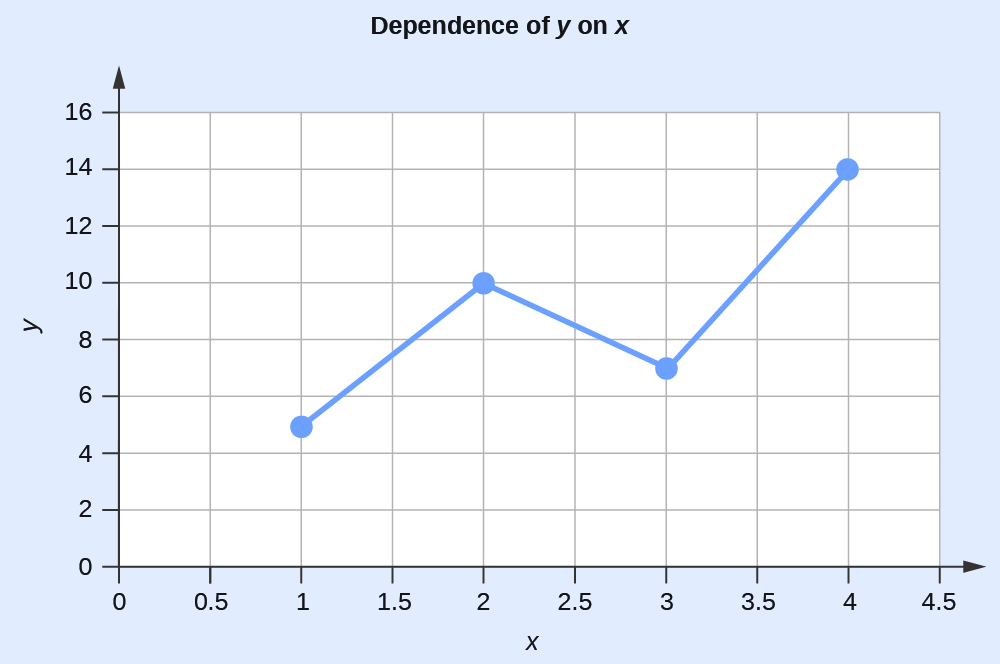
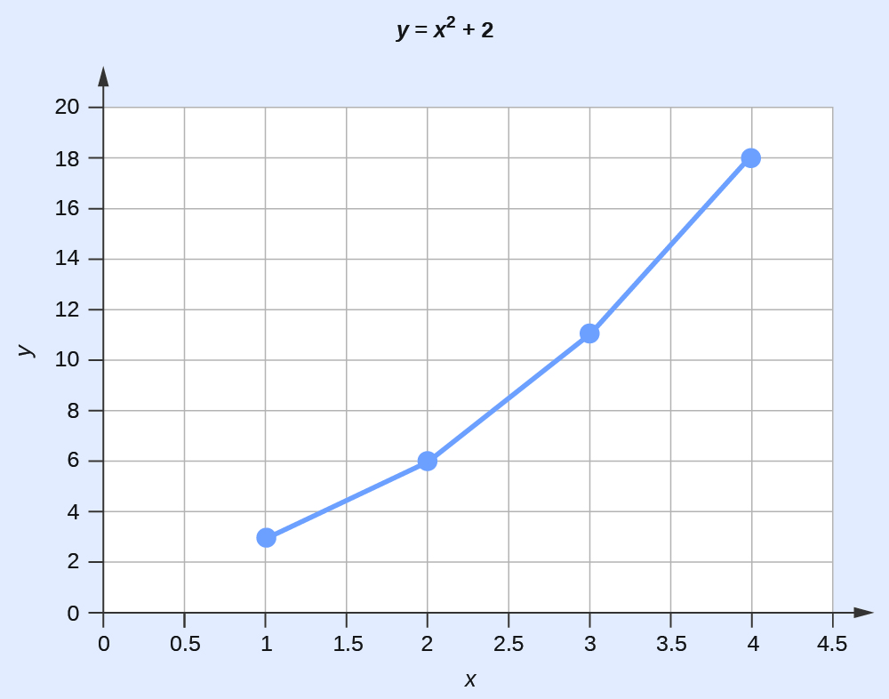

# Exponential Arithmetic

Exponential notation is used to express very large and very small numbers as a product of two numbers. The first number of the product, the *digit term*, is usually a number not less than 1 and not greater than 10. The second number of the product, the *exponential term*, is written as 10 with an exponent. Some examples of exponential notation are:

<math xmlns="http://www.w3.org/1998/Math/MathML"><mrow><mtable><mtr><mtd columnalign="right"><mrow><mn>1000</mn></mrow></mtd><mtd><mo>=</mo></mtd><mtd columnalign="left"><mrow><mn>1</mn><mspace width="0.2em" /><mo>×</mo><mspace width="0.2em" /><msup><mrow><mn>10</mn></mrow><mn>3</mn></msup></mrow></mtd></mtr><mtr><mtd columnalign="right"><mrow><mn>100</mn></mrow></mtd><mtd><mo>=</mo></mtd><mtd columnalign="left"><mrow><mn>1</mn><mspace width="0.2em" /><mo>×</mo><mspace width="0.2em" /><msup><mrow><mn>10</mn></mrow><mn>2</mn></msup></mrow></mtd></mtr><mtr><mtd columnalign="right"><mrow><mn>10</mn></mrow></mtd><mtd><mo>=</mo></mtd><mtd columnalign="left"><mrow><mn>1</mn><mspace width="0.2em" /><mo>×</mo><mspace width="0.2em" /><msup><mrow><mn>10</mn></mrow><mn>1</mn></msup></mrow></mtd></mtr><mtr><mtd columnalign="right"><mn>1</mn></mtd><mtd><mo>=</mo></mtd><mtd columnalign="left"><mrow><mn>1</mn><mspace width="0.2em" /><mo>×</mo><mspace width="0.2em" /><msup><mrow><mn>10</mn></mrow><mn>0</mn></msup></mrow></mtd></mtr><mtr><mtd columnalign="right"><mrow><mn>0.1</mn></mrow></mtd><mtd><mo>=</mo></mtd><mtd columnalign="left"><mrow><mn>1</mn><mspace width="0.2em" /><mo>×</mo><mspace width="0.2em" /><msup><mrow><mn>10</mn></mrow><mrow><mn>−1</mn></mrow></msup></mrow></mtd></mtr><mtr><mtd columnalign="right"><mrow><mn>0.001</mn></mrow></mtd><mtd><mo>=</mo></mtd><mtd columnalign="left"><mrow><mn>1</mn><mspace width="0.2em" /><mo>×</mo><mspace width="0.2em" /><msup><mrow><mn>10</mn></mrow><mrow><mn>−2</mn></mrow></msup></mrow></mtd></mtr><mtr><mtd columnalign="right"><mrow><mn>2386</mn></mrow></mtd><mtd><mo>=</mo></mtd><mtd columnalign="left"><mrow><mn>2.386</mn><mspace width="0.2em" /><mo>×</mo><mspace width="0.2em" /><mn>1000</mn><mo>=</mo><mn>2.386</mn><mspace width="0.2em" /><mo>×</mo><mspace width="0.2em" /><msup><mrow><mn>10</mn></mrow><mn>3</mn></msup></mrow></mtd></mtr><mtr><mtd columnalign="right"><mrow><mn>0.123</mn></mrow></mtd><mtd><mo>=</mo></mtd><mtd columnalign="left"><mrow><mn>1.23</mn><mspace width="0.2em" /><mo>×</mo><mspace width="0.2em" /><mn>0.1</mn><mo>=</mo><mn>1.23</mn><mspace width="0.2em" /><mo>×</mo><mspace width="0.2em" /><msup><mrow><mn>10</mn></mrow><mrow><mn>−1</mn></mrow></msup></mrow></mtd></mtr></mtable></mrow></math>

The power (exponent) of 10 is equal to the number of places the decimal is shifted to give the digit number. The exponential method is particularly useful notation for every large and very small numbers. For example, 1,230,000,000 = 1.23 <math xmlns="http://www.w3.org/1998/Math/MathML"><mrow><mo>×</mo></mrow></math>

 109, and 0.00000000036 <math xmlns="http://www.w3.org/1998/Math/MathML"><mrow><mo>×</mo></mrow></math>

 10−10.

## Addition of Exponentials   {#eip-963}

Convert all numbers to the same power of 10, add the digit terms of the numbers, and if appropriate, convert the digit term back to a number between 1 and 10 by adjusting the exponential term.

Adding Exponentials Add 5.00 <math xmlns="http://www.w3.org/1998/Math/MathML"><mrow><mo>×</mo></mrow></math>

 10−5 and 3.00 <math xmlns="http://www.w3.org/1998/Math/MathML"><mrow><mo>×</mo></mrow></math>

 10−3.

Solution

<math xmlns="http://www.w3.org/1998/Math/MathML"><mtable><mtr><mtd columnalign="right"><mrow><mn>3.00</mn><mspace width="0.2em" /><mo>×</mo><mspace width="0.2em" /><msup><mrow><mn>100</mn></mrow><mrow><mn>−3</mn></mrow></msup></mrow></mtd><mtd><mo>=</mo></mtd><mtd columnalign="left"><mrow><mn>300</mn><mspace width="0.2em" /><mo>×</mo><mspace width="0.2em" /><msup><mrow><mn>10</mn></mrow><mrow><mn>−5</mn></mrow></msup></mrow></mtd></mtr><mtr><mtd columnalign="right"><mrow><mo stretchy="false">(</mo><mn>5.00</mn><mspace width="0.2em" /><mo>×</mo><mspace width="0.2em" /><msup><mrow><mn>10</mn></mrow><mrow><mn>−5</mn></mrow></msup><mo stretchy="false">)</mo><mo>+</mo><mo stretchy="false">(</mo><mn>300</mn><mspace width="0.2em" /><mo>×</mo><mspace width="0.2em" /><msup><mrow><mn>10</mn></mrow><mrow><mn>−5</mn></mrow></msup><mo stretchy="false">)</mo></mrow></mtd><mtd><mo>=</mo></mtd><mtd columnalign="left"><mrow><mn>305</mn><mspace width="0.2em" /><mo>×</mo><mspace width="0.2em" /><msup><mrow><mn>10</mn></mrow><mrow><mn>−5</mn></mrow></msup><mo>=</mo><mn>3.05</mn><mspace width="0.2em" /><mo>×</mo><mspace width="0.2em" /><msup><mrow><mn>10</mn></mrow><mrow><mn>−3</mn></mrow></msup></mrow></mtd></mtr></mtable></math>

## Subtraction of Exponentials

Convert all numbers to the same power of 10, take the difference of the digit terms, and if appropriate, convert the digit term back to a number between 1 and 10 by adjusting the exponential term.

Subtracting Exponentials Subtract 4.0 <math xmlns="http://www.w3.org/1998/Math/MathML"><mrow><mo>×</mo></mrow></math>

 10−7 from 5.0 <math xmlns="http://www.w3.org/1998/Math/MathML"><mrow><mo>×</mo></mrow></math>

 10−6.

Solution

<math xmlns="http://www.w3.org/1998/Math/MathML"><mtable columnalign="left"><mtr /><mtr><mtd><mn>4.0</mn><mspace width="0.2em" /><mo>×</mo><mspace width="0.2em" /><msup><mn>10</mn><mrow><mn>−7</mn></mrow></msup><mo>=</mo><mn>0.40</mn><mspace width="0.2em" /><mo>×</mo><mspace width="0.2em" /><msup><mn>10</mn><mrow><mn>−6</mn></mrow></msup></mtd></mtr><mtr><mtd><mo stretchy="false">(</mo><mn>5.0</mn><mspace width="0.2em" /><mo>×</mo><mspace width="0.2em" /><msup><mn>10</mn><mrow><mn>−6</mn></mrow></msup><mo stretchy="false">)</mo><mo>−</mo><mo stretchy="false">(</mo><mn>0.40</mn><mspace width="0.2em" /><mo>×</mo><mspace width="0.2em" /><msup><mn>10</mn><mrow><mn>−6</mn></mrow></msup><mo stretchy="false">)</mo><mo>=</mo><mn>4.6</mn><mspace width="0.2em" /><mo>×</mo><mspace width="0.2em" /><msup><mn>10</mn><mrow><mn>−6</mn></mrow></msup></mtd></mtr></mtable></math>

## Multiplication of Exponentials

Multiply the digit terms in the usual way and add the exponents of the exponential terms.

Multiplying Exponentials Multiply 4.2 <math xmlns="http://www.w3.org/1998/Math/MathML"><mrow><mo>×</mo></mrow></math>

 10−8 by 2.0 <math xmlns="http://www.w3.org/1998/Math/MathML"><mrow><mo>×</mo></mrow></math>

 103.

Solution

<math xmlns="http://www.w3.org/1998/Math/MathML"><mo stretchy="false">(</mo><mn>4.2</mn><mspace width="0.2em" /><mo>×</mo><mspace width="0.2em" /><msup><mn>10</mn><mrow><mn>−8</mn></mrow></msup><mo stretchy="false">)</mo><mspace width="0.2em" /><mo>×</mo><mspace width="0.2em" /><mo stretchy="false">(</mo><mn>2.0</mn><mspace width="0.2em" /><mo>×</mo><mspace width="0.2em" /><msup><mn>10</mn><mn>3</mn></msup><mo stretchy="false">)</mo><mo>=</mo><mo stretchy="false">(</mo><mn>4.2</mn><mspace width="0.2em" /><mo>×</mo><mspace width="0.2em" /><mn>2.0</mn><mo stretchy="false">)</mo><mspace width="0.2em" /><mo>×</mo><mspace width="0.2em" /><msup><mn>10</mn><mrow><mo stretchy="false">(</mo><mn>−8</mn><mo stretchy="false">)</mo><mo>+</mo><mo stretchy="false">(</mo><mn>+3</mn><mo stretchy="false">)</mo></mrow></msup><mo>=</mo><mn>8.4</mn><mspace width="0.2em" /><mo>×</mo><mspace width="0.2em" /><msup><mn>10</mn><mrow><mn>−5</mn></mrow></msup></math>

## Division of Exponentials

Divide the digit term of the numerator by the digit term of the denominator and subtract the exponents of the exponential terms.

Dividing Exponentials Divide 3.6 <math xmlns="http://www.w3.org/1998/Math/MathML"><mrow><mo>×</mo></mrow></math>

 105 by 6.0 <math xmlns="http://www.w3.org/1998/Math/MathML"><mrow><mo>×</mo></mrow></math>

 10−4.

Solution

<math xmlns="http://www.w3.org/1998/Math/MathML"><mfrac><mrow><mn>3.6</mn><mspace width="0.2em" /><mo>×</mo><mspace width="0.2em" /><msup><mrow><mn>10</mn></mrow><mrow><mn>−5</mn></mrow></msup></mrow><mrow><mn>6.0</mn><mspace width="0.2em" /><mo>×</mo><mspace width="0.2em" /><msup><mrow><mn>10</mn></mrow><mrow><mn>−4</mn></mrow></msup></mrow></mfrac><mspace width="0.2em" /><mo>=</mo><mrow><mo>(</mo><mrow><mfrac><mrow><mn>3.6</mn></mrow><mrow><mn>6.0</mn></mrow></mfrac></mrow><mo>)</mo></mrow><mspace width="0.4em" /><mo>×</mo><mspace width="0.2em" /><msup><mn>10</mn><mrow><mo stretchy="false">(</mo><mn>−5</mn><mo stretchy="false">)</mo><mo>−</mo><mo stretchy="false">(</mo><mn>−4</mn><mo stretchy="false">)</mo></mrow></msup><mo>=</mo><mn>0.60</mn><mspace width="0.2em" /><mo>×</mo><mspace width="0.2em" /><msup><mn>10</mn><mrow><mn>−1</mn></mrow></msup><mo>=</mo><mn>6.0</mn><mspace width="0.2em" /><mo>×</mo><mspace width="0.2em" /><msup><mn>10</mn><mrow><mn>−2</mn></mrow></msup></math>

## Squaring of Exponentials

Square the digit term in the usual way and multiply the exponent of the exponential term by 2.

Squaring Exponentials Square the number 4.0 <math xmlns="http://www.w3.org/1998/Math/MathML"><mrow><mo>×</mo></mrow></math>

 10−6.

Solution

<math xmlns="http://www.w3.org/1998/Math/MathML"><mrow><msup><mrow><mo stretchy="false">(</mo><mn>4.0</mn><mspace width="0.2em" /><mo>×</mo><mspace width="0.2em" /><msup><mrow><mn>10</mn></mrow><mrow><mn>−6</mn></mrow></msup><mo stretchy="false">)</mo></mrow><mn>2</mn></msup><mo>=</mo><mn>4</mn><mspace width="0.2em" /><mo>×</mo><mspace width="0.2em" /><mn>4</mn><mspace width="0.2em" /><mo>×</mo><mspace width="0.2em" /><msup><mrow><mn>10</mn></mrow><mrow><mn>2</mn><mspace width="0.2em" /><mo>×</mo><mspace width="0.2em" /><mo stretchy="false">(</mo><mn>−6</mn><mo stretchy="false">)</mo></mrow></msup><mo>=</mo><mn>16</mn><mspace width="0.2em" /><mo>×</mo><mspace width="0.2em" /><msup><mrow><mn>10</mn></mrow><mrow><mn>−12</mn></mrow></msup><mo>=</mo><mn>1.6</mn><mspace width="0.2em" /><mo>×</mo><mspace width="0.2em" /><msup><mrow><mn>10</mn></mrow><mrow><mn>−11</mn></mrow></msup></mrow></math>

## Cubing of Exponentials

Cube the digit term in the usual way and multiply the exponent of the exponential term by 3.

Cubing Exponentials Cube the number 2 <math xmlns="http://www.w3.org/1998/Math/MathML"><mrow><mo>×</mo></mrow></math>

 104.

Solution

<math xmlns="http://www.w3.org/1998/Math/MathML"><mrow><msup><mrow><mo stretchy="false">(</mo><mn>2</mn><mspace width="0.2em" /><mo>×</mo><mspace width="0.2em" /><msup><mrow><mn>10</mn></mrow><mn>4</mn></msup><mo stretchy="false">)</mo></mrow><mn>3</mn></msup><mo>=</mo><mn>2</mn><mspace width="0.2em" /><mo>×</mo><mspace width="0.2em" /><mn>2</mn><mspace width="0.2em" /><mo>×</mo><mspace width="0.2em" /><mn>2</mn><mspace width="0.2em" /><mo>×</mo><mspace width="0.2em" /><msup><mrow><mn>10</mn></mrow><mrow><mn>3</mn><mspace width="0.2em" /><mo>×</mo><mspace width="0.2em" /><mn>4</mn></mrow></msup><mo>=</mo><mn>8</mn><mspace width="0.2em" /><mo>×</mo><mspace width="0.2em" /><msup><mrow><mn>10</mn></mrow><mrow><mn>12</mn></mrow></msup></mrow></math>

## Taking Square Roots of Exponentials

If necessary, decrease or increase the exponential term so that the power of 10 is evenly divisible by 2. Extract the square root of the digit term and divide the exponential term by 2.

Finding the Square Root of Exponentials Find the square root of 1.6 <math xmlns="http://www.w3.org/1998/Math/MathML"><mrow><mo>×</mo></mrow></math>

 10−7.

Solution

<math xmlns="http://www.w3.org/1998/Math/MathML"><mrow><mtable><mtr><mtd columnalign="right"><mrow><mn>1.6</mn><mspace width="0.2em" /><mo>×</mo><mspace width="0.2em" /><msup><mrow><mn>10</mn></mrow><mrow><mn>−7</mn></mrow></msup></mrow></mtd><mtd><mo>=</mo></mtd><mtd columnalign="left"><mrow><mn>16</mn><mspace width="0.2em" /><mo>×</mo><mspace width="0.2em" /><msup><mrow><mn>10</mn></mrow><mrow><mn>−8</mn></mrow></msup></mrow></mtd></mtr><mtr><mtd columnalign="right"><mrow><msqrt><mrow><mn>16</mn><mspace width="0.2em" /><mo>×</mo><mspace width="0.2em" /><msup><mrow><mn>10</mn></mrow><mrow><mn>−8</mn></mrow></msup></mrow></msqrt><mo>=</mo><msqrt><mrow><mn>16</mn></mrow></msqrt><mspace width="0.2em" /><mo>×</mo><mspace width="0.2em" /><msqrt><mrow><msup><mrow><mn>10</mn></mrow><mrow><mn>−8</mn></mrow></msup></mrow></msqrt></mrow></mtd><mtd columnalign="left"><mo>=</mo></mtd><mtd columnalign="left"><mrow><msqrt><mrow><mn>16</mn></mrow></msqrt><mspace width="0.2em" /><mo>×</mo><mspace width="0.2em" /><msup><mrow><mn>10</mn></mrow><mrow><mo>−</mo><mspace width="0.2em" /><mfrac><mn>8</mn><mn>2</mn></mfrac></mrow></msup><mspace width="0.2em" /><mo>=</mo><mn>4.0</mn><mspace width="0.2em" /><mo>×</mo><mspace width="0.2em" /><msup><mrow><mn>10</mn></mrow><mrow><mn>−4</mn></mrow></msup></mrow></mtd></mtr></mtable></mrow></math>

# Significant Figures

A beekeeper reports that he has 525,341 bees. The last three figures of the number are obviously inaccurate, for during the time the keeper was counting the bees, some of them died and others hatched; this makes it quite difficult to determine the exact number of bees. It would have been more accurate if the beekeeper had reported the number 525,000. In other words, the last three figures are not significant, except to set the position of the decimal point. Their exact values have no meaning useful in this situation. In reporting any information as numbers, use only as many significant figures as the accuracy of the measurement warrants.

The importance of significant figures lies in their application to fundamental computation. In addition and subtraction, the sum or difference should contain as many digits to the right of the decimal as that in the least certain of the numbers used in the computation (indicated by underscoring in the following example).

Addition and Subtraction with Significant Figures Add 4.383 g and 0.0023 g.

Solution

<math xmlns="http://www.w3.org/1998/Math/MathML"><mrow><mfrac><mtable columnalign="left"><mtr><mtd><mrow /></mtd></mtr><mtr><mtd><mn>4.38</mn><mspace width="-0.15em" /><munder accentunder="true"><mn>3</mn><mo stretchy="true">\_</mo></munder><mspace width="0.2em" /><mtext>g</mtext></mtd></mtr><mtr><mtd><mn>0.002</mn><mspace width="-0.15em" /><munder accentunder="true"><mn>3</mn><mo stretchy="true">\_</mo></munder><mspace width="0.2em" /><mtext>g</mtext></mtd></mtr></mtable><mrow><mn>4.38</mn><mspace width="-0.15em" /><munder accentunder="true"><mn>5</mn><mo stretchy="true">\_</mo></munder><mspace width="0.2em" /><mtext>g</mtext><mspace width="0.2em" /><mspace width="0.2em" /><mspace width="0.2em" /></mrow></mfrac></mrow></math>

In multiplication and division, the product or quotient should contain no more digits than that in the factor containing the least number of significant figures.

Multiplication and Division with Significant Figures Multiply 0.6238 by 6.6.

Solution

<math xmlns="http://www.w3.org/1998/Math/MathML"><mrow><mn>0.623</mn><mspace width="-0.1em" /><munder accentunder="true"><mn>8</mn><mo stretchy="true">\_</mo></munder><mspace width="0.2em" /><mo>×</mo><mspace width="0.2em" /><mn>6.</mn><mspace width="-0.1em" /><munder accentunder="true"><mn>6</mn><mo stretchy="true">\_</mo></munder><mo>=</mo><mn>4.</mn><mspace width="-0.1em" /><munder accentunder="true"><mn>1</mn><mo stretchy="true">\_</mo></munder></mrow></math>

When rounding numbers, increase the retained digit by 1 if it is followed by a number larger than 5 (“round up”). Do not change the retained digit if the digits that follow are less than 5 (“round down”). If the retained digit is followed by 5, round up if the retained digit is odd, or round down if it is even (after rounding, the retained digit will thus always be even).

# The Use of Logarithms and Exponential Numbers

The common logarithm of a number (log) is the power to which 10 must be raised to equal that number. For example, the common logarithm of 100 is 2, because 10 must be raised to the second power to equal 100. Additional examples follow.

<table summary="A table titled &#x201C;Logarithms and Exponential Numbers&#x201D; has three columns titled &#x201C;Number,&#x201D; &#x201C;Number Expressed Exponentially,&#x201D; and &#x201C;Common Logarithm.&#x201D; The number 1000 is expressed exponentially as 10 superscript 3 and has a common logarithm of 3. The number 10 is expressed exponentially as 10 superscript 1 and has a common logarithm of 1. The number 1 is expressed exponentially as 10 superscript 0 and has a common logarithm of 0. The number 0.1 is expressed exponentially as 10 superscript negative 1 and has a common logarithm of negative 1. The number 0.001 is expressed exponentially as 10 superscript negative 3 and has a common logarithm of negative 3." class="span-all"><thead>
<tr>
<th colspan="3">Logarithms and Exponential Numbers</th>
</tr>
<tr valign="top">
<th>Number</th>
<th>Number Expressed Exponentially</th>
<th>Common Logarithm</th>
</tr>
</thead><tbody>
<tr valign="top">
<td>1000</td>
<td>103</td>
<td>3</td>
</tr>
<tr valign="top">
<td>10</td>
<td>101</td>
<td>1</td>
</tr>
<tr valign="top">
<td>1</td>
<td>100</td>
<td>0</td>
</tr>
<tr valign="top">
<td>0.1</td>
<td>10−1</td>
<td>−1</td>
</tr>
<tr valign="top">
<td>0.001</td>
<td>10−3</td>
<td>−3</td>
</tr>
</tbody></table>

What is the common logarithm of 60? Because 60 lies between 10 and 100, which have logarithms of 1 and 2, respectively, the logarithm of 60 is 1.7782; that is,

<math xmlns="http://www.w3.org/1998/Math/MathML"><mrow><mtext>60</mtext><mo>=</mo><msup><mrow><mtext>10</mtext></mrow><mrow><mtext>1</mtext><mtext>.7782</mtext></mrow></msup></mrow></math>

The common logarithm of a number less than 1 has a negative value. The logarithm of 0.03918 is −1.4069, or

<math xmlns="http://www.w3.org/1998/Math/MathML"><mrow><mn>0.03918</mn><mspace width="0.2em" /><mo>=</mo><mspace width="0.2em" /><msup><mrow><mn>10</mn></mrow><mrow><mo>−</mo><mn>1.4069</mn></mrow></msup><mspace width="0.2em" /><mo>=</mo><mspace width="0.2em" /><mfrac><mn>1</mn><mrow><msup><mrow><mn>10</mn></mrow><mrow><mn>1.4069</mn></mrow></msup></mrow></mfrac></mrow></math>

To obtain the common logarithm of a number, use the *log* button on your calculator. To calculate a number from its logarithm, take the inverse log of the logarithm, or calculate 10*x* (where *x* is the logarithm of the number).

The natural logarithm of a number (ln) is the power to which *e* must be raised to equal the number; *e* is the constant 2.7182818. For example, the natural logarithm of 10 is 2.303; that is,

<math xmlns="http://www.w3.org/1998/Math/MathML"><mrow><mtext>10</mtext><mo>=</mo><msup><mi>e</mi><mrow><mtext>2</mtext><mtext>.303</mtext></mrow></msup><mo>=</mo><mtext>2</mtext><msup><mrow><mtext>.7182818</mtext></mrow><mrow><mtext>2</mtext><mtext>.303</mtext></mrow></msup></mrow></math>

To obtain the natural logarithm of a number, use the *ln* button on your calculator. To calculate a number from its natural logarithm, enter the natural logarithm and take the inverse ln of the natural logarithm, or calculate *ex* (where *x* is the natural logarithm of the number).

Logarithms are exponents; thus, operations involving logarithms follow the same rules as operations involving exponents.

1.  The logarithm of a product of two numbers is the sum of the logarithms of the two numbers.
    

    <math xmlns="http://www.w3.org/1998/Math/MathML"><mrow><mtext>log</mtext><mspace width="0.2em" /><mi>x</mi><mi>y</mi><mo>=</mo><mtext>log</mtext><mspace width="0.2em" /><mi>x</mi><mo>+</mo><mtext>log</mtext><mspace width="0.2em" /><mi>y</mi><mo>,</mo><mspace width="0.2em" /><mtext>and ln</mtext><mspace width="0.2em" /><mi>x</mi><mi>y</mi><mo>=</mo><mtext>ln</mtext><mspace width="0.2em" /><mi>x</mi><mo>+</mo><mtext>ln</mtext><mspace width="0.2em" /><mi>y</mi></mrow></math>
    

2.  The logarithm of the number resulting from the division of two numbers is the difference between the logarithms of the two numbers.
    

    <math xmlns="http://www.w3.org/1998/Math/MathML"><mrow><mtext>log</mtext><mspace width="0.2em" /><mfrac><mi>x</mi><mi>y</mi></mfrac><mspace width="0.2em" /><mo>=</mo><mtext>log</mtext><mspace width="0.2em" /><mi>x</mi><mo>−</mo><mtext>log</mtext><mspace width="0.2em" /><mi>y</mi><mo>,</mo><mspace width="0.2em" /><mtext>and ln</mtext><mspace width="0.2em" /><mfrac><mi>x</mi><mi>y</mi></mfrac><mspace width="0.2em" /><mo>=</mo><mtext>ln</mtext><mspace width="0.2em" /><mi>x</mi><mo>−</mo><mtext>ln</mtext><mspace width="0.2em" /><mi>y</mi></mrow></math>
    

3.  The logarithm of a number raised to an exponent is the product of the exponent and the logarithm of the number.
    

    <math xmlns="http://www.w3.org/1998/Math/MathML"><mrow><mtext>log</mtext><mspace width="0.2em" /><msup><mi>x</mi><mi>n</mi></msup><mo>=</mo><mi>n</mi><mtext>log</mtext><mspace width="0.2em" /><mi>x</mi><mspace width="0.2em" /><mtext>and ln</mtext><mspace width="0.2em" /><msup><mi>x</mi><mi>n</mi></msup><mo>=</mo><mi>n</mi><mtext>ln</mtext><mspace width="0.2em" /><mi>x</mi></mrow></math>
    

{: data-number-style="arabic"}

# The Solution of Quadratic Equations

Mathematical functions of this form are known as second-order polynomials or, more commonly, quadratic functions.

<math xmlns="http://www.w3.org/1998/Math/MathML"><mrow><mi>a</mi><msup><mi>x</mi><mtext>2</mtext></msup><mo>+</mo><mi>b</mi><mi>x</mi><mo>+</mo><mi>c</mi><mo>=</mo><mtext>0</mtext></mrow></math>

The solution or roots for any quadratic equation can be calculated using the following formula:

<math xmlns="http://www.w3.org/1998/Math/MathML"><mrow><mi>x</mi><mo>=</mo><mspace width="0.2em" /><mfrac><mrow><mo>−</mo><mi>b</mi><mo>±</mo><msqrt><mrow><msup><mi>b</mi><mtext>2</mtext></msup><mo>−</mo><mtext>4</mtext><mi>a</mi><mi>c</mi></mrow></msqrt></mrow><mrow><mtext>2</mtext><mi>a</mi></mrow></mfrac></mrow></math>

Solving Quadratic Equations Solve the quadratic equation 3*x*2 + 13*x* − 10 = 0.

Solution Substituting the values *a* = 3, *b* = 13, *c* = −10 in the formula, we obtain

<math xmlns="http://www.w3.org/1998/Math/MathML"><mrow><mi>x</mi><mo>=</mo><mspace width="0.2em" /><mfrac><mrow><mo>−</mo><mn>13</mn><mo>±</mo><msqrt><mrow><msup><mrow><mo stretchy="false">(</mo><mn>13</mn><mo stretchy="false">)</mo></mrow><mn>2</mn></msup><mo>−</mo><mn>4</mn><mspace width="0.2em" /><mo>×</mo><mspace width="0.2em" /><mn>3</mn><mspace width="0.2em" /><mo>×</mo><mspace width="0.2em" /><mo stretchy="false">(</mo><mn>−10</mn><mo stretchy="false">)</mo></mrow></msqrt></mrow><mrow><mn>2</mn><mspace width="0.2em" /><mo>×</mo><mspace width="0.2em" /><mn>3</mn></mrow></mfrac></mrow></math>

<math xmlns="http://www.w3.org/1998/Math/MathML"><mrow><mi>x</mi><mo>=</mo><mspace width="0.2em" /><mfrac><mrow><mo>−</mo><mn>13</mn><mo>±</mo><msqrt><mrow><mn>169</mn><mo>+</mo><mn>120</mn></mrow></msqrt></mrow><mn>6</mn></mfrac><mspace width="0.2em" /><mo>=</mo><mspace width="0.2em" /><mfrac><mrow><mn>13</mn><mo>±</mo><msqrt><mrow><mn>289</mn></mrow></msqrt></mrow><mn>6</mn></mfrac><mspace width="0.2em" /><mo>=</mo><mspace width="0.2em" /><mfrac><mrow><mo>−</mo><mn>13</mn><mo>±</mo><mn>17</mn></mrow><mn>6</mn></mfrac></mrow></math>

The two roots are therefore

<math xmlns="http://www.w3.org/1998/Math/MathML"><mrow><mi>x</mi><mo>=</mo><mspace width="0.2em" /><mfrac><mrow><mo>−</mo><mn>13</mn><mo>+</mo><mn>17</mn></mrow><mn>6</mn></mfrac><mspace width="0.5em" /><mtext>and</mtext><mspace width="0.5em" /><mi>x</mi><mo>=</mo><mspace width="0.2em" /><mfrac><mrow><mo>−</mo><mn>13</mn><mo>−</mo><mn>17</mn></mrow><mn>6</mn></mfrac><mspace width="0.2em" /><mo>=</mo><mn>−5</mn></mrow></math>

Quadratic equations constructed on physical data always have real roots, and of these real roots, often only those having positive values are of any significance.

# Two-Dimensional (*x*-*y*) Graphing

The relationship between any two properties of a system can be represented graphically by a two-dimensional data plot. Such a graph has two axes: a horizontal one corresponding to the independent variable, or the variable whose value is being controlled (*x*), and a vertical axis corresponding to the dependent variable, or the variable whose value is being observed or measured (*y*).

When the value of *y* is changing as a function of *x* (that is, different values of *x* correspond to different values of *y*), a graph of this change can be plotted or sketched. The graph can be produced by using specific values for (*x*,*y*) data pairs.

Graphing the Dependence of *y* on *x*

| *x* | *y* |
{: valign="top"}|----------
| 1 | 5 |
{: valign="top"}| 2 | 10 |
{: valign="top"}| 3 | 7 |
{: valign="top"}| 4 | 14 |
{: valign="top"}{: .medium .unnumbered summary="A table has two columns labeled x and y. In the first row, the value of x is 1, and the value of y is 5. In the second row, the value of x is 2, and the value of y is 10. In the third row, the value of x is 3, and the value of y is 7. In the fourth row, the value of x is 4, and the value of y is 14." data-label=""}

This table contains the following points: (1,5), (2,10), (3,7), and (4,14). Each of these points can be plotted on a graph and connected to produce a graphical representation of the dependence of *y* on *x*.

  

If the function that describes the dependence of *y* on *x* is known, it may be used to compute x,y data pairs that may subsequently be plotted.

Plotting Data Pairs If we know that *y* = *x*2 + 2, we can produce a table of a few (*x*,*y*) values and then plot the line based on the data shown here.

| *x* | *y* = *x*2 + 2 |
{: valign="top"}|----------
| 1 | 3 |
{: valign="top"}| 2 | 6 |
{: valign="top"}| 3 | 11 |
{: valign="top"}| 4 | 18 |
{: valign="top"}{: .medium .unnumbered summary="A table has two columns: the first is labeled x, and the second is labeled y equals x superscript 2 plus 2. In the first row, the value of x is 1, and the value of y equals x superscript 2 plus 2 is 3. In the second row, the value of x is 2, and the value of y equals x superscript 2 plus 2 is 6. In the third row, the value of x is 3, and the value of y equals x superscript 2 plus 2 is 11. In the fourth row, the value of x is 4, and the value of y equals x superscript 2 plus 2 is 18." data-label=""}

  

