<table summary="This table has four columns and twenty-two rows. The columns are labeled, &#x201C;Acid,&#x201D; &#x201C;Formula,&#x201D; &#x201C;K subscript a at twenty-five degrees Celsius,&#x201D; and &#x201C;Lewis Structure.&#x201D; The first acid listed is acetic and its formula is C H subscript 3 C O subscript 2 H. The last H in the formula is red. The K subscript a at twenty-five degrees Celsius is 1.8 times ten superscript negative five. The Lewis structure is also shown. It has two C atoms. The first C atom forms single bonds to three hydrogen atoms at 90 degree angles. The first C atom also forms a single bond with the second C atom. The second C atom forms a double bond with an O atom, which has four valence electrons, and forms a single bond with another O atom with four valence electrons. The second O atom also forms a single bond with an H atom. All H atoms are colored red. The second acid is arsenic. There are three formulas listed for arsenic. The first is H subscript 3 A s O subscript 4. The H subscript 3 is red. For this formula the K subscript a at twenty-five degrees Celsius is 5.5 times ten superscript negative three. The second formula is H subscript 2 A s O subscript 4 superscript negative sign. The H subscript 2 is red. For this formula the K subscript a at twenty-five degrees Celsius is 1.7 times ten superscript negative seven. The third formula is H A s O subscript 4 superscript 2 negative sign. The H is red. For this formula, the K subscript a at twenty-five is 5.1 times ten superscript negative 12. The Lewis structure is given and is the same for both formulas. There is an A s atom in the center which forms three single bonds to three O H groups where each O atom has four valence electron. A s also forms a double bond with an O atom which has four valence electrons. All H atoms are colored red. The next acid is arsenous. The formula is H subscript 3 A s O subscript 3. The H subscript 3 is red. The K subscript a at twenty-five degrees Celsius is 5.1 times ten superscript negative ten. The Lewis Structure for arsenous is also given. It has an A s atom with two valence electrons at the center. The A s atom forms a single bond with an O atom with four valence electrons, and the O atom forms a single bond with an H atom. The A s atom also forms another single bond with an O atom with four valence electrons, which also forms a single bond with an H atom. The A s atom also forms a third single bond with another O atom with four valence electrons which forms a single bond with an H atom. All H atoms are colored red. The next acid is boric. The formula is H subscript 3 B O 3. H subscript 3 is red. The K subscript a at twenty-five degrees Celsius is 5.4 times ten superscript negative ten. The Lewis structure is also given. There is a B atom which forms three separate single bonds with three different O atoms. Each O atom forms a single bond with an H atom. All H atoms are red. The next acid is carbonic acid. There are two formulas given for carbonic acid. The first is H subscript 2 C O subscript 3. The H subscript 2 is red. The K subscript a at twenty-five degrees Celsius is 4.3 times ten superscript negative seven. The second formula is H C O subscript 3 superscript negative sign. The H is red. The K subscript a at twenty-five degrees Celsius is 5.6 times ten superscript negative 11. The Lewis structure is also given and is the same for both formulas. It has a C atom which forms a double bond with an O atom with four valence electrons. The C atom also forms a single bond with an O H group, where the O atom has two valence electrons. The C atom also forms another single bond with another O H group, where the O atom has two valence electrons. All of the H atoms are colored red. The next acid is cyanic. The formula is H C N O, and the H is red. The K subscript a at twenty-five degrees Celsius is 2 time ten superscript negative four. The Lewis structure is also given. A C atom forms a double bond with an O atom with four valence electrons. It also forms a double bond with an N atom which has two valence electrons. The N atom also forms a single bond with an H atom. The H atom is colored red. The next acid is formic. The formula is H C O subscript 2 H. The second H is colored red. The K subscript a at twenty-five degrees Celsius is 1.8 time ten superscript negative four. The Lewis structure is also given. A C H group forms a single bond with an O H group where the O has four valence electrons. The C H group also forms a single bond with an O atom with four valence electrons. The next acid is hydrazoic. The formula is H N subscript 3. The H is red. The K subscript a at twenty-five degrees Celsius is 2.5 time ten superscript negative 5. The Lewis structure is also given. There is an N atom with two valence electrons that forms a single bond with an H atom. The N atom also forms a single bond with another N atom, and that N atom forms a triple bond with another N atom with two valence electrons. This yields an N atom with two valence electrons which forms a single bond with an H atom. The N atom also forms a double bond with another N atom, which forms a double bond with another N atom with four valence electrons. All H atoms are red. The next acid is hydrocyanic. The formula is H C N. The H is colored red. The K subscript a at twenty-five degrees Celsius is 4.9 time ten superscript negative ten. There is no Lewis structure given. The next acid is hydrofluoric. The formula is H F. The H is colored red. The K subscript a at twenty-five degrees Celsius is 3.5 time ten superscript negative 4. There is no Lewis structure given. The next acid is hydrogen peroxide. The formula is H subscript 2 O subscript 2. The H subscript 2 is red The K subscript a at twenty-five degrees Celsius is 2.4 time ten superscript negative 12. The Lewis structure is given. There is an H atom which forms a single bond with an O atom with four valence electrons which forms a single bond with another O atom with four valence electrons which forms a single bond with another H atom. The H atoms are red. The next acid is hydrogen selenide. There are two formulas given. The first is H subscript 2 S e. The H subscript 2 is red. The K subscript a at twenty-five degrees Celsius is 1.29 time ten superscript negative four. The second formula is H S  e superscript negative sign. The H is red. the K subscript a at twenty-five degrees Celsius is one times ten superscript negative twelve. There is no Lewis structure given for hydrogen selenide. The next acid is hydrogen sulfate ion. The formula is H S O subscript 4 superscript negative sign. The H is red. The K subscript a at twenty-five degrees Celsius is 1.2 times ten superscript negative 2. The Lewis structure is given. An S atom forms a double bond with an O atom with four valence electrons. It also forms a second double bond with another O atom with four valence electrons. The S atom also forms a single bond with an O atom with six valence electrons, and it forms a single bond with an O atom which forms a single bond with an H atom. The H atom is red. The next acid is hydrogen sulfide. There are two formulas given. The first is H subscript 2 S. The H subscript 2 is red. The K subscript a at twenty-five degrees Celsius is 8.9 times ten superscript negative eight. The second formula is H S superscript negative sign. The K subscript a at twenty-five degrees Celsius is 1.0 times ten superscript negative 19. There is no Lewis structure given. The next acid is hydrogen telluride. There are two formulas given. The first is H subscript 2 T e. The H subscript 2 is red. The K subscript a at twenty-five degrees Celsius is 2.3 times ten superscript negative 3. The second formula is H T e superscript negative sign. The H is red. The K subscript a at twenty-five degrees Celsius is 1.6 times ten superscript negative eleven. There is no Lewis structure given. The next acid is hypobromous. The formula is H B r O. The H is red. The K subscript a at twenty-five degrees Celsius is 1.6 times ten superscript negative nine. There is no Lewis structure given. The next acid is hypochlorous. The formula is H C l O. The H is red. The K subscript a at twenty-five degrees Celsius is 2.9 times ten superscript negative 8. There is no Lewis structure given. The next acid is nitrous. The formula is H N O subscript 2. The H is red. The K subscript a at twenty-five degrees Celsius is 4.6 times ten superscript negative four. The Lewis structure is given. An N atom with two valence electrons forms a single bond with an O atom with four valence electrons. The N atom also forms a single bond with an O H group where the O has four valence electrons. The H atom is red. The next acid is oxalic. There are two formulas given. The first is H subscript 2 C subscript 2 O subscript 4. The H subscript 2 is red. The K subscript a at twenty-five degrees Celsius is 6.0 times ten superscript negative two. The second formula is H C subscript 2 O subscript 4 superscript negative sign. The H is red. The K subscript a at twenty-five degrees Celsius is 6.1 times ten superscript negative five. The Lewis structure is given and is the same for both formulas. An H atom forms a single bond with an O atom which has four valence electrons. the O atom forms a single bond with a C atom. The C atom forms a single bond with another O atom with four valence electrons. The C atom also forms a single with another C atom. The second C atom forms a single bond with an O atom with four valence electrons. The C atom also forms a second single bond with an O atom with four valence electrons. The O atom forms a single bond with an H atom. The H atoms are red. The next acid is phosphoric. There are three formulas given. The first is H subscript 3 P O subscript 4. The H subscript 3 is red. The K subscript a at twenty-five degrees Celsius is 7.5 times ten superscript negative 3. The second formula is H subscript 2 P O subscript 4 superscript negative sign. The H subscript 2 is red. The K subscript a at twenty-five degrees Celsius is 6.2 time ten superscript negative eight. The third formula given is H P O subscript 4 superscript two negative. The K subscript a at twenty-five degrees Celsius is 4.2 times ten superscript negative 13. The H is red. The Lewis structure is given and is the same for all three formulas. A P atom forms a single bond with an O atom with four valence electrons. The O atom forms a single bond with an H atom. The P atom also forms a double bond with an O atom with four valence electrons. The P atom forms a single bond with an O atom with four valence electrons. The O atom forms a single bond with an H atom. The P atom also forms another single bond with another O atom with four valence electrons. The O atom also forms a single bond with an H atom. The H atoms are red. The next acid is phosphorous. There are two formulas given. The first is H subscript 3 P O subscript 3. The H subscript 3 is red. The K subscript a at twenty-five degrees Celsius is five time ten superscript negative two. The second formula is H subscript 2 P O subscript 3 superscript negative sign. The H subscript 2 is red. The K subscript a at twenty-five degrees Celsius is 2.0 times ten superscript negative 7. The Lewis structure is given and is the same for both formulas. A P atom with two valence electrons forms three separate single bonds with three O H groups. The O atoms in all three O H groups each have four valence electrons. The H atoms are red. The last acid in the table is sulfurous. There are two formulas given. The first is H subscript 2 S O subscript 3. The H subscript 2 is red. The K subscript a at twenty-five degrees Celsius is 1.6 times ten superscript negative two. The second formula is H S O subscript 3 superscript negative sign. The H is red. The K subscript a at twenty-five degrees Celsius is 6.4 times ten superscript negative 8. The Lewis structure is given and is the same for both formulas. The S atom has two valence electrons and forms a single bond with an O atom with four valence electrons. The S atom also forms a single bond with an O H group. The O atom has four valence electrons. The S atom also forms another single bond with another O H group. The O atom has four valence electrons." class="span-all"><thead>
<tr valign="middle">
<th colspan="4">Ionization Constants of Weak Acids</th>
</tr>
<tr valign="middle">
<th>Acid</th>
<th>Formula</th>
<th><em>Ka</em> at 25 °C</th>
<th>Lewis Structure</th>
</tr>
</thead><tbody>
<tr valign="middle">
<td>acetic</td>
<td>CH3CO2<strong class="emphasis-one">H</strong></td>
<td>1.8 <math xmlns="http://www.w3.org/1998/Math/MathML"><mo>×</mo></math> 10−5</td>
<td>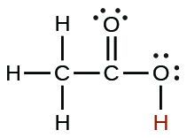</td>
</tr>

<tr valign="middle">
<td rowspan="3">arsenic</td>
<td><strong class="emphasis-one">H3</strong>AsO4</td>
<td>5.5 <math xmlns="http://www.w3.org/1998/Math/MathML"><mo>×</mo></math> 10−3</td>
<td rowspan="3">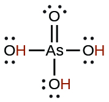</td>
</tr>

<tr valign="middle">
<td>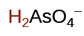</td>
<td>1.7 <math xmlns="http://www.w3.org/1998/Math/MathML"><mo>×</mo></math> 10−7</td>
</tr>

<tr valign="middle">
<td>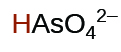</td>
<td>5.1 <math xmlns="http://www.w3.org/1998/Math/MathML"><mo>×</mo></math> 10−12</td>
</tr>

<tr valign="middle">
<td>arsenous</td>
<td><strong class="emphasis-one">H3</strong>AsO3</td>
<td>5.1 <math xmlns="http://www.w3.org/1998/Math/MathML"><mo>×</mo></math> 10−10</td>
<td>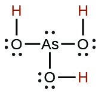</td>
</tr>

<tr valign="middle">
<td>boric</td>
<td><strong class="emphasis-one">H3</strong>BO3</td>
<td>5.4 <math xmlns="http://www.w3.org/1998/Math/MathML"><mo>×</mo></math> 10−10</td>
<td>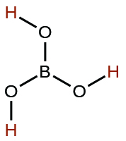</td>
</tr>

<tr valign="middle">
<td rowspan="2">carbonic</td>
<td><strong class="emphasis-one">H2</strong>CO3</td>
<td>4.3 <math xmlns="http://www.w3.org/1998/Math/MathML"><mo>×</mo></math> 10−7</td>
<td rowspan="2">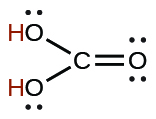</td>
</tr>

<tr valign="middle">
<td>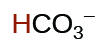</td>
<td>5.6 <math xmlns="http://www.w3.org/1998/Math/MathML"><mo>×</mo></math> 10−11</td>
</tr>

<tr valign="middle">
<td>cyanic</td>
<td><strong class="emphasis-one">H</strong>CNO</td>
<td>2 <math xmlns="http://www.w3.org/1998/Math/MathML"><mo>×</mo></math> 10−4</td>
<td>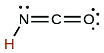</td>
</tr>

<tr valign="middle">
<td>formic</td>
<td>HCO2<strong class="emphasis-one">H</strong></td>
<td>1.8 <math xmlns="http://www.w3.org/1998/Math/MathML"><mo>×</mo></math> 10−4</td>
<td>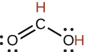</td>
</tr>

<tr valign="middle">
<td>hydrazoic</td>
<td><strong class="emphasis-one">H</strong>N3</td>
<td>2.5 <math xmlns="http://www.w3.org/1998/Math/MathML"><mo>×</mo></math> 10−5</td>
<td>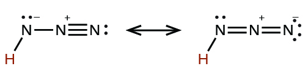</td>
</tr>

<tr valign="middle">
<td>hydrocyanic</td>
<td><strong class="emphasis-one">H</strong>CN</td>
<td>4.9 <math xmlns="http://www.w3.org/1998/Math/MathML"><mo>×</mo></math> 10−10</td>
<td />
</tr>
<tr valign="middle">
<td>hydrofluoric</td>
<td><strong class="emphasis-one">H</strong>F</td>
<td>3.5 <math xmlns="http://www.w3.org/1998/Math/MathML"><mo>×</mo></math> 10−4</td>
<td />
</tr>

<tr valign="middle">
<td>hydrogen peroxide</td>
<td><strong class="emphasis-one">H2</strong>O2</td>
<td>2.4 <math xmlns="http://www.w3.org/1998/Math/MathML"><mo>×</mo></math> 10−12</td>
<td>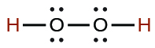</td>
</tr>

<tr valign="middle">
<td rowspan="2">hydrogen selenide</td>
<td><strong class="emphasis-one">H2</strong>Se</td>
<td>1.29 <math xmlns="http://www.w3.org/1998/Math/MathML"><mo>×</mo></math> 10−4</td>
<td />
</tr>

<tr valign="middle">
<td><strong class="emphasis-one">H</strong>Se–</td>
<td>1 <math xmlns="http://www.w3.org/1998/Math/MathML"><mo>×</mo></math> 10−12</td>
<td />
</tr>

<tr valign="middle">
<td>hydrogen sulfate ion</td>
<td>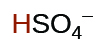</td>
<td>1.2 <math xmlns="http://www.w3.org/1998/Math/MathML"><mo>×</mo></math> 10−2</td>
<td>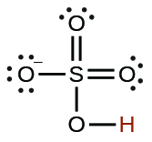</td>
</tr>

<tr valign="middle">
<td rowspan="2">hydrogen sulfide</td>
<td><strong class="emphasis-one">H2</strong>S</td>
<td>8.9 <math xmlns="http://www.w3.org/1998/Math/MathML"><mo>×</mo></math> 10−8</td>
<td />
</tr>

<tr valign="middle">
<td><strong class="emphasis-one">H</strong>S–</td>
<td>1.0 <math xmlns="http://www.w3.org/1998/Math/MathML"><mo>×</mo></math> 10−19</td>
<td />
</tr>

<tr valign="middle">
<td rowspan="2">hydrogen telluride</td>
<td><strong class="emphasis-one">H2</strong>Te</td>
<td>2.3 <math xmlns="http://www.w3.org/1998/Math/MathML"><mo>×</mo></math> 10−3</td>
<td />
</tr>

<tr valign="middle">
<td><strong class="emphasis-one">H</strong>Te–</td>
<td>1.6 <math xmlns="http://www.w3.org/1998/Math/MathML"><mo>×</mo></math> 10−11</td>
<td />
</tr>

<tr valign="middle">
<td>hypobromous</td>
<td><strong class="emphasis-one">H</strong>BrO</td>
<td>2.8 <math xmlns="http://www.w3.org/1998/Math/MathML"><mo>×</mo></math> 10−9</td>
<td />
</tr>

<tr valign="middle">
<td>hypochlorous</td>
<td><strong class="emphasis-one">H</strong>ClO</td>
<td>2.9 <math xmlns="http://www.w3.org/1998/Math/MathML"><mo>×</mo></math> 10−8</td>
<td />
</tr>

<tr valign="middle">
<td>nitrous</td>
<td><strong class="emphasis-one">H</strong>NO2</td>
<td>4.6 <math xmlns="http://www.w3.org/1998/Math/MathML"><mo>×</mo></math> 10−4</td>
<td>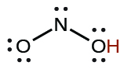</td>
</tr>

<tr valign="middle">
<td rowspan="2">oxalic</td>
<td><strong class="emphasis-one">H2</strong>C2O4</td>
<td>6.0 <math xmlns="http://www.w3.org/1998/Math/MathML"><mo>×</mo></math> 10−2</td>
<td rowspan="2">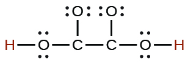</td>
</tr>

<tr valign="middle">
<td>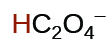</td>
<td>6.1 <math xmlns="http://www.w3.org/1998/Math/MathML"><mo>×</mo></math> 10−5</td>
</tr>

<tr valign="middle">
<td rowspan="3">phosphoric</td>
<td><strong class="emphasis-one">H3</strong>PO4</td>
<td>7.5 <math xmlns="http://www.w3.org/1998/Math/MathML"><mo>×</mo></math> 10−3</td>
<td rowspan="3">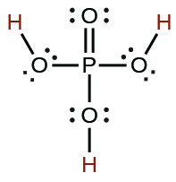</td>
</tr>

<tr valign="middle">
<td>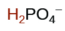</td>
<td>6.2 <math xmlns="http://www.w3.org/1998/Math/MathML"><mo>×</mo></math> 10−8</td>
</tr>

<tr valign="middle">
<td>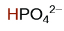</td>
<td>4.2 <math xmlns="http://www.w3.org/1998/Math/MathML"><mo>×</mo></math> 10−13</td>
</tr>

<tr valign="middle">
<td rowspan="2">phosphorous</td>
<td><strong class="emphasis-one">H3</strong>PO3</td>
<td>5 <math xmlns="http://www.w3.org/1998/Math/MathML"><mo>×</mo></math> 10−2</td>
<td rowspan="2">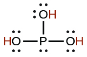</td>
</tr>

<tr valign="middle">
<td>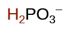</td>
<td>2.0 <math xmlns="http://www.w3.org/1998/Math/MathML"><mo>×</mo></math> 10−7</td>
</tr>

<tr valign="middle">
<td rowspan="2">sulfurous</td>
<td><strong class="emphasis-one">H2</strong>SO3</td>
<td>1.6 <math xmlns="http://www.w3.org/1998/Math/MathML"><mo>×</mo></math> 10−2</td>
<td rowspan="2">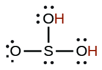</td>
</tr>

<tr valign="middle">
<td>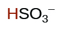</td>
<td>6.4 <math xmlns="http://www.w3.org/1998/Math/MathML"><mo>×</mo></math> 10−8
</td>
</tr>

</tbody></table>

