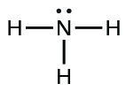
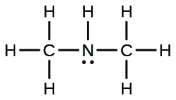
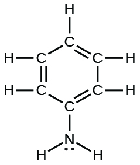
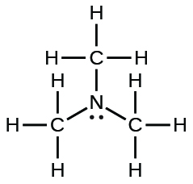

<table summary="A table of three columns is titled &#x201C;Ionization Constants of Weak Bases.&#x201D; From left to right, the column headings are &#x201C;Base, Lewis Structure, and K subscript b at 25 degrees Celsius. From left to right the first row contains &#x201C;ammonia,&#x201D; an image of its Lewis Structure, and 1.8 times ten to the negative fifth power. The Lewis Structure is the letter N with two side by side dots above it. A line connected to the letter H stems from the left, right, and bottom of the central N. The second row contains &#x201C;dimethylamine,&#x201D; an image of its Lewis Structure, and 5.9 times ten to the negative fourth power. The Lewis Structure is the letter N with two side by side dots below it. A line connects upward to the letter H. Lines from the left and right of the central N connect to a C on both sides. Each C has an H connected above, below, and to the exterior of the structure. The third row contains &#x201C;methylamine,&#x201D; an image of its Lewis Structure, and 4.4 times ten to the negative fourth power. The Lewis Structure is the letter N with two side by side dots above it. Two lines stem from this N and connect to an H to the right and below. A line stems from the left of the N connecting to the letter C. This C has an H connected above, below, and to the left. The fourth row contains &#x201C;phenylamine (aniline),&#x201D; an image of its Lewis Structure, and 4.3 times ten to the negative tenth power. The Lewis Structure is the letter N with two side by side dots below it. Two lines stem diagonally from the bottom of the N connecting to an H to the left and another to the right. A line stems upward from the N connecting to a C which is the lowest corner of a hexagon with the letter C at each of its 6 corners. The bottom-most C has 1 line connecting it to the next C to the left, and two lines connecting it to the C to its right. The 6 sides of the hexagon repeat this pattern, alternating single and double lines. Excluding the Bottom-most C, every other C has a line connecting it to an H extending outward from the center of the hexagon. The fifth row contains &#x201C;trimethylamine,&#x201D; an image of its Lewis Structure, and 6.3 times ten to the negative fifth power. The Lewis Structure is a Central N with two dots below it and lines stemming from the top, the left, and the right each connecting to a separate letter C. Each C has three lines connecting to a unique letter H for each line." class="span-all"><thead>
<tr valign="middle">
<th colspan="3" data-align="center">Ionization Constants of Weak Bases</th>
</tr>
<tr valign="middle">
<th data-align="left">Base</th>
<th data-align="left">Lewis Structure</th>
<th data-align="left"><em>K</em>b at 25 °C</th>
</tr>
</thead><tbody>
<tr valign="middle">
<td data-align="left">ammonia</td>
<td data-align="left"></td>
<td data-align="left">1.8 <math xmlns="http://www.w3.org/1998/Math/MathML"><mo>×</mo></math> 10−5</td>
</tr>
<tr valign="middle">
<td data-align="left">dimethylamine</td>
<td data-align="left">

</td>
<td data-align="left">5.9 <math xmlns="http://www.w3.org/1998/Math/MathML"><mo>×</mo></math> 10−4</td>
</tr>
<tr valign="middle">
<td data-align="left">methylamine</td>
<td data-align="left"></td>
<td data-align="left">4.4 <math xmlns="http://www.w3.org/1998/Math/MathML"><mo>×</mo></math> 10−4</td>
</tr>
<tr valign="middle">
<td data-align="left">phenylamine (aniline)</td>
<td data-align="left">

</td>
<td data-align="left">4.3 <math xmlns="http://www.w3.org/1998/Math/MathML"><mo>×</mo></math> 10−10</td>
</tr>
<tr valign="middle">
<td data-align="left">trimethylamine</td>
<td data-align="left"></td>
<td data-align="left">6.3 <math xmlns="http://www.w3.org/1998/Math/MathML"><mo>×</mo></math> 10−5</td>
</tr>
</tbody></table>

