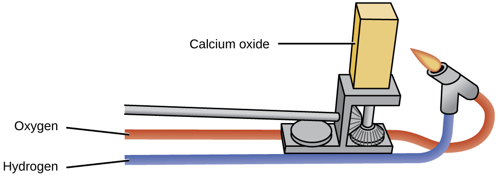
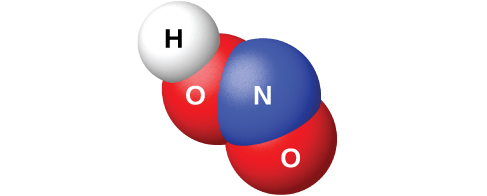
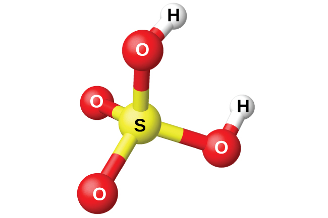

By the end of this section, you will be able to:
* Describe the properties, preparation, and compounds of oxygen
* Describe the preparation, properties, and uses of some representative metal oxides, peroxides, and hydroxides

Oxygen is the most abundant element on the earth’s crust. The earth’s surface is composed of the crust, atmosphere, and hydrosphere. About 50% of the mass of the earth’s crust consists of oxygen (combined with other elements, principally silicon). Oxygen occurs as O2 molecules and, to a limited extent, as O3 (ozone) molecules in air. It forms about 20% of the mass of the air. About 89% of water by mass consists of combined oxygen. In combination with carbon, hydrogen, and nitrogen, oxygen is a large part of plants and animals.

Oxygen is a colorless, odorless, and tasteless gas at ordinary temperatures. It is slightly denser than air. Although it is only slightly soluble in water (49 mL of gas dissolves in 1 L at STP), oxygen’s solubility is very important to aquatic life.

Most of the oxygen isolated commercially comes from air and the remainder from the electrolysis of water. The separation of oxygen from air begins with cooling and compressing the air until it liquefies. As liquid air warms, oxygen with its higher boiling point (90 K) separates from nitrogen, which has a lower boiling point (77 K). It is possible to separate the other components of air at the same time based on differences in their boiling points.

Oxygen is essential in combustion processes such as the burning of fuels. Plants and animals use the oxygen from the air in respiration. The administration of oxygen-enriched air is an important medical practice when a patient is receiving an inadequate supply of oxygen because of shock, pneumonia, or some other illness.

The chemical industry employs oxygen for oxidizing many substances. A significant amount of oxygen produced commercially is important in the removal of carbon from iron during steel production. Large quantities of pure oxygen are also necessary in metal fabrication and in the cutting and welding of metals with oxyhydrogen and oxyacetylene torches.

Liquid oxygen is important to the space industry. It is an oxidizing agent in rocket engines. It is also the source of gaseous oxygen for life support in space.

As we know, oxygen is very important to life. The energy required for the maintenance of normal body functions in human beings and in other organisms comes from the slow oxidation of chemical compounds. Oxygen is the final oxidizing agent in these reactions. In humans, oxygen passes from the lungs into the blood, where it combines with hemoglobin, producing oxyhemoglobin. In this form, blood transports the oxygen to tissues, where it is transferred to the tissues. The ultimate products are carbon dioxide and water. The blood carries the carbon dioxide through the veins to the lungs, where the blood releases the carbon dioxide and collects another supply of oxygen. Digestion and assimilation of food regenerate the materials consumed by oxidation in the body; the energy liberated is the same as if the food burned outside the body.

Green plants continually replenish the oxygen in the atmosphere by a process called **photosynthesis**{: data-type="term"}. The products of photosynthesis may vary, but, in general, the process converts carbon dioxide and water into glucose (a sugar) and oxygen using the energy of light:

<math xmlns="http://www.w3.org/1998/Math/MathML"><mrow><mtable columnalign="left"><mtr columnalign="left"><mtd columnalign="left"><mrow><mn>6</mn><msub><mrow><mtext>CO</mtext></mrow><mn>2</mn></msub><mo stretchy="false">(</mo><mi>g</mi><mo stretchy="false">)</mo><mo>+</mo></mrow></mtd><mtd columnalign="left"><mrow><mn>6</mn><msub><mtext>H</mtext><mn>2</mn></msub><mtext>O</mtext><mo stretchy="false">(</mo><mi>l</mi><mo stretchy="false">)</mo></mrow></mtd><mtd columnalign="left"><mrow><munderover><mo>→</mo><mrow><mtext>light</mtext></mrow><mrow><mspace width="0.4em" /><mtext>chlorophyll</mtext><mspace width="0.4em" /></mrow></munderover></mrow><mspace width="0.2em" /></mtd><mtd columnalign="left"><mrow><msub><mtext>C</mtext><mn>6</mn></msub><msub><mtext>H</mtext><mrow><mn>12</mn></mrow></msub><msub><mtext>O</mtext><mn>6</mn></msub><mo stretchy="false">(</mo><mi>a</mi><mi>q</mi><mo stretchy="false">)</mo><mo>+</mo></mrow></mtd><mtd columnalign="left"><mrow><mn>6</mn><msub><mtext>O</mtext><mn>2</mn></msub><mo stretchy="false">(</mo><mi>g</mi><mo stretchy="false">)</mo></mrow></mtd></mtr><mtr columnalign="left"><mtd columnalign="left"><mrow><mtext>carbon</mtext></mrow></mtd><mtd columnalign="left"><mrow><mtext>water</mtext></mrow></mtd><mtd columnalign="left"><mrow /></mtd><mtd columnalign="left"><mrow><mtext>glucose</mtext></mrow></mtd><mtd columnalign="left"><mrow><mtext>oxygen</mtext></mrow></mtd></mtr><mtr columnalign="left"><mtd columnalign="left"><mrow><mtext>dioxide</mtext></mrow></mtd><mtd columnalign="left"><mrow /></mtd><mtd columnalign="left"><mrow /></mtd><mtd columnalign="left"><mrow /></mtd><mtd columnalign="left"><mrow /></mtd></mtr></mtable></mrow></math>

Thus, the oxygen that became carbon dioxide and water by the metabolic processes in plants and animals returns to the atmosphere by photosynthesis.

When dry oxygen is passed between two electrically charged plates, **ozone**{: data-type="term"} (O3, illustrated in [\[link\]](#CNX_Chem_18_09_Ozone)), an allotrope of oxygen possessing a distinctive odor, forms. The formation of ozone from oxygen is an endothermic reaction, in which the energy comes from an electrical discharge, heat, or ultraviolet light:

<math xmlns="http://www.w3.org/1998/Math/MathML"><mrow><mn>3</mn><msub><mtext>O</mtext><mn>2</mn></msub><mo stretchy="false">(</mo><mi>g</mi><mo stretchy="false">)</mo><mspace width="0.2em" /><mover><mo>→</mo><mrow><mspace width="0.5em" /><mtext>electric discharge</mtext><mspace width="0.5em" /></mrow></mover><mspace width="0.2em" /><mn>2</mn><msub><mtext>O</mtext><mn>3</mn></msub><mo stretchy="false">(</mo><mi>g</mi><mo stretchy="false">)</mo><mspace width="5em" /><mtext>Δ</mtext><mi>H</mi><mtext>°</mtext><mo>=</mo><mtext>287 kJ</mtext></mrow></math>

The sharp odor associated with sparking electrical equipment is due, in part, to ozone.

  molecule and the resonance structures necessary to describe its bonding."){: #CNX_Chem_18_09_Ozone}

Ozone forms naturally in the upper atmosphere by the action of ultraviolet light from the sun on the oxygen there. Most atmospheric ozone occurs in the stratosphere, a layer of the atmosphere extending from about 10 to 50 kilometers above the earth’s surface. This ozone acts as a barrier to harmful ultraviolet light from the sun by absorbing it via a chemical decomposition reaction:

<math xmlns="http://www.w3.org/1998/Math/MathML"><mrow><msub><mtext>O</mtext><mn>3</mn></msub><mo stretchy="false">(</mo><mi>g</mi><mo stretchy="false">)</mo><mspace width="0.2em" /><mover><mo>→</mo><mrow><mspace width="0.7em" /><mtext>ultraviolet light</mtext><mspace width="0.7em" /></mrow></mover><mspace width="0.2em" /><mtext>O</mtext><mo stretchy="false">(</mo><mi>g</mi><mo stretchy="false">)</mo><mo>+</mo><msub><mtext>O</mtext><mn>2</mn></msub><mo stretchy="false">(</mo><mi>g</mi><mo stretchy="false">)</mo></mrow></math>

The reactive oxygen atoms recombine with molecular oxygen to complete the ozone cycle. The presence of stratospheric ozone decreases the frequency of skin cancer and other damaging effects of ultraviolet radiation. It has been clearly demonstrated that chlorofluorocarbons, CFCs (known commercially as Freons), which were present as aerosol propellants in spray cans and as refrigerants, caused depletion of ozone in the stratosphere. This occurred because ultraviolet light also causes CFCs to decompose, producing atomic chlorine. The chlorine atoms react with ozone molecules, resulting in a net removal of O3 molecules from stratosphere. This process is explored in detail in our coverage of chemical kinetics. There is a worldwide effort to reduce the amount of CFCs used commercially, and the ozone hole is already beginning to decrease in size as atmospheric concentrations of atomic chlorine decrease. While ozone in the stratosphere helps protect us, ozone in the troposphere is a problem. This ozone is a toxic component of photochemical smog.

The uses of ozone depend on its reactivity with other substances. It can be used as a bleaching agent for oils, waxes, fabrics, and starch: It oxidizes the colored compounds in these substances to colorless compounds. It is an alternative to chlorine as a disinfectant for water.

# Reactions

Elemental oxygen is a strong oxidizing agent. It reacts with most other elements and many compounds.

## Reaction with Elements

Oxygen reacts directly at room temperature or at elevated temperatures with all other elements except the noble gases, the halogens, and few second- and third-row transition metals of low reactivity (those with higher reduction potentials than copper). Rust is an example of the reaction of oxygen with iron. The more active metals form peroxides or superoxides. Less active metals and the nonmetals give oxides. Two examples of these reactions are:

<math xmlns="http://www.w3.org/1998/Math/MathML"><mrow><mtext>2Mg</mtext><mo stretchy="false">(</mo><mi>s</mi><mo stretchy="false">)</mo><mo>+</mo><msub><mtext>O</mtext><mn>2</mn></msub><mo stretchy="false">(</mo><mi>g</mi><mo stretchy="false">)</mo><mspace width="0.2em" /><mo stretchy="false">⟶</mo><mspace width="0.2em" /><mtext>2MgO</mtext><mo stretchy="false">(</mo><mi>s</mi><mo stretchy="false">)</mo></mrow></math>

<math xmlns="http://www.w3.org/1998/Math/MathML"><mrow><msub><mtext>P</mtext><mn>4</mn></msub><mo stretchy="false">(</mo><mi>s</mi><mo stretchy="false">)</mo><mo>+</mo><mn>5</mn><msub><mtext>O</mtext><mn>2</mn></msub><mo stretchy="false">(</mo><mi>g</mi><mo stretchy="false">)</mo><mspace width="0.2em" /><mo stretchy="false">⟶</mo><mspace width="0.2em" /><msub><mtext>P</mtext><mn>4</mn></msub><msub><mtext>O</mtext><mrow><mn>10</mn></mrow></msub><mo stretchy="false">(</mo><mi>s</mi><mo stretchy="false">)</mo></mrow></math>

The oxides of halogens, at least one of the noble gases, and metals with higher reduction potentials than copper do not form by the direct action of the elements with oxygen.

## Reaction with Compounds

Elemental oxygen also reacts with some compounds. If it is possible to oxidize any of the elements in a given compound, further oxidation by oxygen can occur. For example, hydrogen sulfide, H2S, contains sulfur with an oxidation state of 2−. Because the sulfur does not exhibit its maximum oxidation state, we would expect H2S to react with oxygen. It does, yielding water and sulfur dioxide. The reaction is:

<math xmlns="http://www.w3.org/1998/Math/MathML"><mrow><mn>2</mn><msub><mtext>H</mtext><mn>2</mn></msub><mtext>S</mtext><mo stretchy="false">(</mo><mi>g</mi><mo stretchy="false">)</mo><mo>+</mo><mn>3</mn><msub><mtext>O</mtext><mn>2</mn></msub><mo stretchy="false">(</mo><mi>g</mi><mo stretchy="false">)</mo><mspace width="0.2em" /><mo stretchy="false">⟶</mo><mspace width="0.2em" /><mn>2</mn><msub><mtext>H</mtext><mn>2</mn></msub><mtext>O</mtext><mo stretchy="false">(</mo><mi>l</mi><mo stretchy="false">)</mo><mo>+</mo><mn>2</mn><msub><mrow><mtext>SO</mtext></mrow><mn>2</mn></msub><mo stretchy="false">(</mo><mi>g</mi><mo stretchy="false">)</mo></mrow></math>

It is also possible to oxidize oxides such as CO and P4O6 that contain an element with a lower oxidation state. The ease with which elemental oxygen picks up electrons is mirrored by the difficulty of removing electrons from oxygen in most oxides. Of the elements, only the very reactive fluorine can oxidize oxides to form oxygen gas.

# Oxides, Peroxides, and Hydroxides

Compounds of the representative metals with oxygen fall into three categories: (1) **oxides**{: data-type="term"}, containing oxide ions, O2−; (2) **peroxides**{: data-type="term"}, containing peroxides ions, <math xmlns="http://www.w3.org/1998/Math/MathML"><mrow><msub><mtext>O</mtext><mn>2</mn></msub><msup><mrow /><mrow><mn>2−</mn></mrow></msup><mo>,</mo></mrow></math>

 with oxygen-oxygen covalent single bonds and a very limited number of **superoxides**{: data-type="term"}, containing superoxide ions, <math xmlns="http://www.w3.org/1998/Math/MathML"><mrow><msub><mtext>O</mtext><mn>2</mn></msub><msup><mrow /><mtext>−</mtext></msup><mo>,</mo></mrow></math>

 with oxygen-oxygen covalent bonds that have a bond order of <math xmlns="http://www.w3.org/1998/Math/MathML"><mrow><mn>1</mn><mspace width="0.2em" /><mfrac><mn>1</mn><mn>2</mn></mfrac><mo>,</mo></mrow></math>

 In addition, there are (3) **hydroxides**{: data-type="term"}, containing hydroxide ions, OH−. All representative metals form oxides. Some of the metals of group 2 also form peroxides, MO2, and the metals of group 1 also form peroxides, M2O2, and superoxides, MO2.

## Oxides

It is possible to produce the oxides of most representative metals by heating the corresponding hydroxides (forming the oxide and gaseous water) or carbonates (forming the oxide and gaseous CO2). Equations for example reactions are:

<math xmlns="http://www.w3.org/1998/Math/MathML"><mrow><mtext>2Al</mtext><msub><mrow><mo stretchy="false">(</mo><mtext>OH</mtext><mo stretchy="false">)</mo></mrow><mn>3</mn></msub><mo stretchy="false">(</mo><mi>s</mi><mo stretchy="false">)</mo><mspace width="0.2em" /><mover><mo>→</mo><mrow><mspace width="0.4em" /><mtext>Δ</mtext><mspace width="0.4em" /></mrow></mover><mspace width="0.2em" /><msub><mrow><mtext>Al</mtext></mrow><mn>2</mn></msub><msub><mtext>O</mtext><mn>3</mn></msub><mo stretchy="false">(</mo><mi>s</mi><mo stretchy="false">)</mo><mo>+</mo><mn>3</mn><msub><mtext>H</mtext><mn>2</mn></msub><mtext>O</mtext><mo stretchy="false">(</mo><mi>g</mi><mo stretchy="false">)</mo></mrow></math>

<math xmlns="http://www.w3.org/1998/Math/MathML"><mrow><msub><mrow><mtext>CaCO</mtext></mrow><mn>3</mn></msub><mo stretchy="false">(</mo><mi>s</mi><mo stretchy="false">)</mo><mspace width="0.2em" /><mover><mo>→</mo><mrow><mspace width="0.4em" /><mtext>Δ</mtext><mspace width="0.4em" /></mrow></mover><mspace width="0.2em" /><mtext>CaO</mtext><mo stretchy="false">(</mo><mi>s</mi><mo stretchy="false">)</mo><mo>+</mo><msub><mrow><mtext>CO</mtext></mrow><mn>2</mn></msub><mo stretchy="false">(</mo><mi>g</mi><mo stretchy="false">)</mo></mrow></math>

However, alkali metal salts generally are very stable and do not decompose easily when heated. Alkali metal oxides result from the oxidation-reduction reactions created by heating nitrates or hydroxides with the metals. Equations for sample reactions are:

<math xmlns="http://www.w3.org/1998/Math/MathML"><mrow><mn>2</mn><msub><mrow><mtext>KNO</mtext></mrow><mn>3</mn></msub><mo stretchy="false">(</mo><mi>s</mi><mo stretchy="false">)</mo><mo>+</mo><mtext>10K</mtext><mo stretchy="false">(</mo><mi>s</mi><mo stretchy="false">)</mo><mspace width="0.2em" /><mover><mo>→</mo><mrow><mspace width="0.4em" /><mtext>Δ</mtext><mspace width="0.4em" /></mrow></mover><mspace width="0.2em" /><mn>6</mn><msub><mtext>K</mtext><mn>2</mn></msub><mtext>O</mtext><mo stretchy="false">(</mo><mi>s</mi><mo stretchy="false">)</mo><mo>+</mo><msub><mtext>N</mtext><mn>2</mn></msub><mo stretchy="false">(</mo><mi>g</mi><mo stretchy="false">)</mo></mrow></math>

<math xmlns="http://www.w3.org/1998/Math/MathML"><mrow><mtext>2LiOH</mtext><mo stretchy="false">(</mo><mi>s</mi><mo stretchy="false">)</mo><mo>+</mo><mtext>2Li</mtext><mo stretchy="false">(</mo><mi>s</mi><mo stretchy="false">)</mo><mspace width="0.2em" /><mover><mo>→</mo><mrow><mspace width="0.4em" /><mtext>Δ</mtext><mspace width="0.4em" /></mrow></mover><mspace width="0.2em" /><mn>2</mn><msub><mrow><mtext>Li</mtext></mrow><mn>2</mn></msub><mtext>O</mtext><mo stretchy="false">(</mo><mi>s</mi><mo stretchy="false">)</mo><mo>+</mo><msub><mtext>H</mtext><mn>2</mn></msub><mo stretchy="false">(</mo><mi>g</mi><mo stretchy="false">)</mo></mrow></math>

With the exception of mercury(II) oxide, it is possible to produce the oxides of the metals of groups 2–15 by burning the corresponding metal in air. The heaviest member of each group, the member for which the inert pair effect is most pronounced, forms an oxide in which the oxidation state of the metal ion is two less than the group oxidation state (inert pair effect). Thus, Tl2O, PbO, and Bi2O3 form when burning thallium, lead, and bismuth, respectively. The oxides of the lighter members of each group exhibit the group oxidation state. For example, SnO2 forms from burning tin. Mercury(II) oxide, HgO, forms slowly when mercury is warmed below 500 °C; it decomposes at higher temperatures.

Burning the members of groups 1 and 2 in air is not a suitable way to form the oxides of these elements. These metals are reactive enough to combine with nitrogen in the air, so they form mixtures of oxides and ionic nitrides. Several also form peroxides or superoxides when heated in air.

Ionic oxides all contain the oxide ion, a very powerful hydrogen ion acceptor. With the exception of the very insoluble aluminum oxide, Al2O3, tin(IV), SnO2, and lead(IV), PbO2, the oxides of the representative metals react with acids to form salts. Some equations for these reactions are:

<math xmlns="http://www.w3.org/1998/Math/MathML"><mrow><msub><mrow><mtext>Na</mtext></mrow><mn>2</mn></msub><mtext>O</mtext><mo>+</mo><mn>2</mn><msub><mrow><mtext>HNO</mtext></mrow><mn>3</mn></msub><mo stretchy="false">(</mo><mi>a</mi><mi>q</mi><mo stretchy="false">)</mo><mspace width="0.2em" /><mo stretchy="false">⟶</mo><mspace width="0.2em" /><mn>2</mn><msub><mrow><mtext>NaNO</mtext></mrow><mn>3</mn></msub><mo stretchy="false">(</mo><mi>a</mi><mi>q</mi><mo stretchy="false">)</mo><mo>+</mo><msub><mtext>H</mtext><mn>2</mn></msub><mtext>O</mtext><mo stretchy="false">(</mo><mi>l</mi><mo stretchy="false">)</mo></mrow></math>

<math xmlns="http://www.w3.org/1998/Math/MathML"><mrow><mtext>CaO</mtext><mo stretchy="false">(</mo><mi>s</mi><mo stretchy="false">)</mo><mo>+</mo><mtext>2HCL</mtext><mo stretchy="false">(</mo><mi>a</mi><mi>q</mi><mo stretchy="false">)</mo><mspace width="0.2em" /><mo stretchy="false">⟶</mo><mspace width="0.2em" /><msub><mrow><mtext>CaCl</mtext></mrow><mn>2</mn></msub><mo stretchy="false">(</mo><mi>a</mi><mi>q</mi><mo stretchy="false">)</mo><mo>+</mo><msub><mtext>H</mtext><mn>2</mn></msub><mtext>O</mtext><mo stretchy="false">(</mo><mi>l</mi><mo stretchy="false">)</mo></mrow></math>

<math xmlns="http://www.w3.org/1998/Math/MathML"><mrow><mtext>SnO</mtext><mo stretchy="false">(</mo><mi>s</mi><mo stretchy="false">)</mo><mo>+</mo><mn>2</mn><msub><mrow><mtext>HClO</mtext></mrow><mn>4</mn></msub><mo stretchy="false">(</mo><mi>a</mi><mi>q</mi><mo stretchy="false">)</mo><mspace width="0.2em" /><mo stretchy="false">⟶</mo><mspace width="0.2em" /><mtext>Sn</mtext><msub><mrow><mo stretchy="false">(</mo><msub><mrow><mtext>ClO</mtext></mrow><mn>4</mn></msub><mo stretchy="false">)</mo></mrow><mn>2</mn></msub><mo stretchy="false">(</mo><mi>a</mi><mi>q</mi><mo stretchy="false">)</mo><mo>+</mo><msub><mtext>H</mtext><mn>2</mn></msub><mtext>O</mtext><mo stretchy="false">(</mo><mi>l</mi><mo stretchy="false">)</mo></mrow></math>

The oxides of the metals of groups 1 and 2 and of thallium(I) oxide react with water and form hydroxides. Examples of such reactions are:

<math xmlns="http://www.w3.org/1998/Math/MathML"><mrow><msub><mrow><mtext>Na</mtext></mrow><mn>2</mn></msub><mtext>O</mtext><mo stretchy="false">(</mo><mi>s</mi><mo stretchy="false">)</mo><mo>+</mo><msub><mtext>H</mtext><mn>2</mn></msub><mtext>O</mtext><mo stretchy="false">(</mo><mi>l</mi><mo stretchy="false">)</mo><mspace width="0.2em" /><mo stretchy="false">⟶</mo><mspace width="0.2em" /><mtext>NaOH</mtext><mo stretchy="false">(</mo><mi>a</mi><mi>q</mi><mo stretchy="false">)</mo></mrow></math>

<math xmlns="http://www.w3.org/1998/Math/MathML"><mrow><mtext>CaO</mtext><mo stretchy="false">(</mo><mi>s</mi><mo stretchy="false">)</mo><mo>+</mo><msub><mtext>H</mtext><mn>2</mn></msub><mtext>O</mtext><mo stretchy="false">(</mo><mi>l</mi><mo stretchy="false">)</mo><mspace width="0.2em" /><mo stretchy="false">⟶</mo><mspace width="0.2em" /><mtext>Ca</mtext><msub><mrow><mo stretchy="false">(</mo><mtext>OH</mtext><mo stretchy="false">)</mo></mrow><mn>2</mn></msub><mo stretchy="false">(</mo><mi>a</mi><mi>q</mi><mo stretchy="false">)</mo></mrow></math>

<math xmlns="http://www.w3.org/1998/Math/MathML"><mrow><msub><mrow><mtext>Tl</mtext></mrow><mn>2</mn></msub><mtext>O</mtext><mo stretchy="false">(</mo><mi>s</mi><mo stretchy="false">)</mo><mo>+</mo><msub><mtext>H</mtext><mn>2</mn></msub><mtext>O</mtext><mo stretchy="false">(</mo><mi>a</mi><mi>q</mi><mo stretchy="false">)</mo><mspace width="0.2em" /><mo stretchy="false">⟶</mo><mspace width="0.2em" /><mtext>2TlOH</mtext><mo stretchy="false">(</mo><mi>a</mi><mi>q</mi><mo stretchy="false">)</mo></mrow></math>

The oxides of the alkali metals have little industrial utility, unlike magnesium oxide, calcium oxide, and aluminum oxide. Magnesium oxide is important in making firebrick, crucibles, furnace linings, and thermal insulation—applications that require chemical and thermal stability. Calcium oxide, sometimes called *quicklime* or lime in the industrial market, is very reactive, and its principal uses reflect its reactivity. Pure calcium oxide emits an intense white light when heated to a high temperature (as illustrated in [\[link\]](#CNX_Chem_18_09_Limelight)). Blocks of calcium oxide heated by gas flames were the stage lights in theaters before electricity was available. This is the source of the phrase “in the limelight.”

 {: #CNX_Chem_18_09_Limelight}

Calcium oxide and calcium hydroxide are inexpensive bases used extensively in chemical processing, although most of the useful products prepared from them do not contain calcium. Calcium oxide, CaO, is made by heating calcium carbonate, CaCO3, which is widely and inexpensively available as limestone or oyster shells:

<math xmlns="http://www.w3.org/1998/Math/MathML"><mrow><msub><mrow><mtext>CaCO</mtext></mrow><mn>3</mn></msub><mo stretchy="false">(</mo><mi>s</mi><mo stretchy="false">)</mo><mspace width="0.2em" /><mo stretchy="false">⟶</mo><mspace width="0.2em" /><mtext>CaO</mtext><mo stretchy="false">(</mo><mi>s</mi><mo stretchy="false">)</mo><mo>+</mo><msub><mrow><mtext>CO</mtext></mrow><mn>2</mn></msub><mo stretchy="false">(</mo><mi>g</mi><mo stretchy="false">)</mo></mrow></math>

Although this decomposition reaction is reversible, it is possible to obtain a 100% yield of CaO by allowing the CO2 to escape. It is possible to prepare calcium hydroxide by the familiar acid-base reaction of a soluble metal oxide with water:

<math xmlns="http://www.w3.org/1998/Math/MathML"><mrow><mtext>CaO</mtext><mo stretchy="false">(</mo><mi>s</mi><mo stretchy="false">)</mo><mo>+</mo><msub><mtext>H</mtext><mn>2</mn></msub><mtext>O</mtext><mo stretchy="false">(</mo><mi>l</mi><mo stretchy="false">)</mo><mspace width="0.2em" /><mo stretchy="false">⟶</mo><mspace width="0.2em" /><mtext>Ca</mtext><msub><mrow><mo stretchy="false">(</mo><mtext>OH</mtext><mo stretchy="false">)</mo></mrow><mn>2</mn></msub><mo stretchy="false">(</mo><mi>s</mi><mo stretchy="false">)</mo></mrow></math>

Both CaO and Ca(OH)2 are useful as bases; they accept protons and neutralize acids.

Alumina (Al2O3) occurs in nature as the mineral corundum, a very hard substance used as an abrasive for grinding and polishing. Corundum is important to the jewelry trade as ruby and sapphire. The color of ruby is due to the presence of a small amount of chromium; other impurities produce the wide variety of colors possible for sapphires. Artificial rubies and sapphires are now manufactured by melting aluminum oxide (melting point = 2050 °C) with small amounts of oxides to produce the desired colors and cooling the melt in such a way as to produce large crystals. Ruby lasers use synthetic ruby crystals.

Zinc oxide, ZnO, was a useful white paint pigment; however, pollutants tend to discolor the compound. The compound is also important in the manufacture of automobile tires and other rubber goods, and in the preparation of medicinal ointments. For example, zinc-oxide-based sunscreens, as shown in [\[link\]](#CNX_Chem_18_09_Sunblock), help prevent sunburn. The zinc oxide in these sunscreens is present in the form of very small grains known as nanoparticles. Lead dioxide is a constituent of charged lead storage batteries. Lead(IV) tends to revert to the more stable lead(II) ion by gaining two electrons, so lead dioxide is a powerful oxidizing agent.

 "){: #CNX_Chem_18_09_Sunblock}

## Peroxides and Superoxides

Peroxides and superoxides are strong oxidizers and are important in chemical processes. Hydrogen peroxide, H2O2, prepared from metal peroxides, is an important bleach and disinfectant. Peroxides and superoxides form when the metal or metal oxides of groups 1 and 2 react with pure oxygen at elevated temperatures. Sodium peroxide and the peroxides of calcium, strontium, and barium form by heating the corresponding metal or metal oxide in pure oxygen:

<math xmlns="http://www.w3.org/1998/Math/MathML"><mrow><mtext>2Na</mtext><mo stretchy="false">(</mo><mi>s</mi><mo stretchy="false">)</mo><mo>+</mo><msub><mtext>O</mtext><mn>2</mn></msub><mo stretchy="false">(</mo><mi>g</mi><mo stretchy="false">)</mo><mspace width="0.2em" /><mover><mo>→</mo><mrow><mspace width="0.4em" /><mtext>Δ</mtext><mspace width="0.4em" /></mrow></mover><mspace width="0.2em" /><msub><mrow><mtext>Na</mtext></mrow><mn>2</mn></msub><msub><mtext>O</mtext><mn>2</mn></msub><mo stretchy="false">(</mo><mi>s</mi><mo stretchy="false">)</mo></mrow></math>

<math xmlns="http://www.w3.org/1998/Math/MathML"><mrow><mn>2</mn><msub><mrow><mtext>Na</mtext></mrow><mn>2</mn></msub><mtext>O</mtext><mo stretchy="false">(</mo><mi>s</mi><mo stretchy="false">)</mo><mo>+</mo><msub><mtext>O</mtext><mn>2</mn></msub><mo stretchy="false">(</mo><mi>g</mi><mo stretchy="false">)</mo><mspace width="0.2em" /><mover><mo>→</mo><mrow><mspace width="0.4em" /><mtext>Δ</mtext><mspace width="0.4em" /></mrow></mover><mspace width="0.2em" /><mn>2</mn><msub><mrow><mtext>Na</mtext></mrow><mn>2</mn></msub><msub><mtext>O</mtext><mn>2</mn></msub><mo stretchy="false">(</mo><mi>s</mi><mo stretchy="false">)</mo></mrow></math>

<math xmlns="http://www.w3.org/1998/Math/MathML"><mrow><mtext>2SrO</mtext><mo stretchy="false">(</mo><mi>s</mi><mo stretchy="false">)</mo><mo>+</mo><msub><mtext>O</mtext><mn>2</mn></msub><mo stretchy="false">(</mo><mi>g</mi><mo stretchy="false">)</mo><mspace width="0.2em" /><mover><mo>→</mo><mrow><mspace width="0.4em" /><mtext>Δ</mtext><mspace width="0.4em" /></mrow></mover><mspace width="0.2em" /><mn>2</mn><msub><mrow><mtext>SrO</mtext></mrow><mn>2</mn></msub><mo stretchy="false">(</mo><mi>s</mi><mo stretchy="false">)</mo></mrow></math>

The peroxides of potassium, rubidium, and cesium can be prepared by heating the metal or its oxide in a carefully controlled amount of oxygen:

<math xmlns="http://www.w3.org/1998/Math/MathML"><mrow><mtext>2K</mtext><mo stretchy="false">(</mo><mi>s</mi><mo stretchy="false">)</mo><mo>+</mo><msub><mtext>O</mtext><mn>2</mn></msub><mo stretchy="false">(</mo><mi>g</mi><mo stretchy="false">)</mo><mspace width="0.2em" /><mo stretchy="false">⟶</mo><mspace width="0.2em" /><msub><mtext>K</mtext><mn>2</mn></msub><msub><mtext>O</mtext><mn>2</mn></msub><mo stretchy="false">(</mo><mi>s</mi><mo stretchy="false">)</mo><mspace width="5em" /><mo stretchy="false">(</mo><mn>2</mn><mspace width="0.2em" /><mtext>mol K per mol</mtext><mspace width="0.2em" /><msub><mtext>O</mtext><mn>2</mn></msub><mo stretchy="false">)</mo></mrow></math>

With an excess of oxygen, the superoxides KO2, RbO2, and CsO2 form. For example:

<math xmlns="http://www.w3.org/1998/Math/MathML"><mrow><mtext>K</mtext><mo stretchy="false">(</mo><mi>s</mi><mo stretchy="false">)</mo><mo>+</mo><msub><mtext>O</mtext><mn>2</mn></msub><mo stretchy="false">(</mo><mi>g</mi><mo stretchy="false">)</mo><mspace width="0.2em" /><mo stretchy="false">⟶</mo><mspace width="0.2em" /><msub><mrow><mtext>KO</mtext></mrow><mn>2</mn></msub><mo stretchy="false">(</mo><mi>s</mi><mo stretchy="false">)</mo><mspace width="5em" /><mo stretchy="false">(</mo><mn>1</mn><mspace width="0.2em" /><mtext>mol K per mol</mtext><mspace width="0.2em" /><msub><mtext>O</mtext><mn>2</mn></msub><mo stretchy="false">)</mo></mrow></math>

The stability of the peroxides and superoxides of the alkali metals increases as the size of the cation increases.

## Hydroxides

Hydroxides are compounds that contain the OH− ion. It is possible to prepare these compounds by two general types of reactions. Soluble metal hydroxides can be produced by the reaction of the metal or metal oxide with water. Insoluble metal hydroxides form when a solution of a soluble salt of the metal combines with a solution containing hydroxide ions.

With the exception of beryllium and magnesium, the metals of groups 1 and 2 react with water to form hydroxides and hydrogen gas. Examples of such reactions include:

<math xmlns="http://www.w3.org/1998/Math/MathML"><mrow><mtext>2Li</mtext><mo stretchy="false">(</mo><mi>s</mi><mo stretchy="false">)</mo><mo>+</mo><mn>2</mn><msub><mtext>H</mtext><mn>2</mn></msub><mtext>O</mtext><mo stretchy="false">(</mo><mi>l</mi><mo stretchy="false">)</mo><mspace width="0.2em" /><mo stretchy="false">⟶</mo><mspace width="0.2em" /><mtext>2LiOH</mtext><mo stretchy="false">(</mo><mi>a</mi><mi>q</mi><mo stretchy="false">)</mo><mo>+</mo><msub><mtext>H</mtext><mn>2</mn></msub><mo stretchy="false">(</mo><mi>g</mi><mo stretchy="false">)</mo></mrow></math>

<math xmlns="http://www.w3.org/1998/Math/MathML"><mrow><mtext>Ca</mtext><mo stretchy="false">(</mo><mi>s</mi><mo stretchy="false">)</mo><mo>+</mo><mn>2</mn><msub><mtext>H</mtext><mn>2</mn></msub><mtext>O</mtext><mo stretchy="false">(</mo><mi>l</mi><mo stretchy="false">)</mo><mspace width="0.2em" /><mo stretchy="false">⟶</mo><mspace width="0.2em" /><mtext>Ca</mtext><msub><mrow><mo stretchy="false">(</mo><mtext>OH</mtext><mo stretchy="false">)</mo></mrow><mn>2</mn></msub><mo stretchy="false">(</mo><mi>a</mi><mi>q</mi><mo stretchy="false">)</mo><mo>+</mo><msub><mtext>H</mtext><mn>2</mn></msub><mo stretchy="false">(</mo><mi>g</mi><mo stretchy="false">)</mo></mrow></math>

However, these reactions can be violent and dangerous; therefore, it is preferable to produce soluble metal hydroxides by the reaction of the respective oxide with water:

<math xmlns="http://www.w3.org/1998/Math/MathML"><mrow><msub><mrow><mtext>Li</mtext></mrow><mn>2</mn></msub><mtext>O</mtext><mo stretchy="false">(</mo><mi>s</mi><mo stretchy="false">)</mo><mo>+</mo><msub><mtext>H</mtext><mn>2</mn></msub><mtext>O</mtext><mo stretchy="false">(</mo><mi>l</mi><mo stretchy="false">)</mo><mspace width="0.2em" /><mo stretchy="false">⟶</mo><mspace width="0.2em" /><mtext>2LiOH</mtext><mo stretchy="false">(</mo><mi>a</mi><mi>q</mi><mo stretchy="false">)</mo></mrow></math>

<math xmlns="http://www.w3.org/1998/Math/MathML"><mrow><mtext>CaO</mtext><mo stretchy="false">(</mo><mi>s</mi><mo stretchy="false">)</mo><mo>+</mo><msub><mtext>H</mtext><mn>2</mn></msub><mtext>O</mtext><mo stretchy="false">(</mo><mi>l</mi><mo stretchy="false">)</mo><mspace width="0.2em" /><mo stretchy="false">⟶</mo><mspace width="0.2em" /><mtext>Ca</mtext><msub><mrow><mo stretchy="false">(</mo><mtext>OH</mtext><mo stretchy="false">)</mo></mrow><mn>2</mn></msub><mo stretchy="false">(</mo><mi>a</mi><mi>q</mi><mo stretchy="false">)</mo></mrow></math>

Most metal oxides are **base anhydrides**{: data-type="term"}. This is obvious for the soluble oxides because they form metal hydroxides. Most other metal oxides are insoluble and do not form hydroxides in water; however, they are still base anhydrides because they will react with acids.

It is possible to prepare the insoluble hydroxides of beryllium, magnesium, and other representative metals by the addition of sodium hydroxide to a solution of a salt of the respective metal. The net ionic equations for the reactions involving a magnesium salt, an aluminum salt, and a zinc salt are:

<math xmlns="http://www.w3.org/1998/Math/MathML"><mrow><msup><mrow><mtext>Mg</mtext></mrow><mrow><mn>2+</mn></mrow></msup><mo stretchy="false">(</mo><mi>a</mi><mi>q</mi><mo stretchy="false">)</mo><mo>+</mo><mn>2</mn><msup><mrow><mtext>OH</mtext></mrow><mtext>−</mtext></msup><mo stretchy="false">(</mo><mi>a</mi><mi>q</mi><mo stretchy="false">)</mo><mspace width="0.2em" /><mo stretchy="false">⟶</mo><mspace width="0.2em" /><mtext>Mg</mtext><msub><mrow><mo stretchy="false">(</mo><mtext>OH</mtext><mo stretchy="false">)</mo></mrow><mn>2</mn></msub><mo stretchy="false">(</mo><mi>s</mi><mo stretchy="false">)</mo></mrow></math>

<math xmlns="http://www.w3.org/1998/Math/MathML"><mrow><msup><mrow><mtext>Al</mtext></mrow><mrow><mn>3+</mn></mrow></msup><mo stretchy="false">(</mo><mi>a</mi><mi>q</mi><mo stretchy="false">)</mo><mo>+</mo><mn>3</mn><msup><mrow><mtext>OH</mtext></mrow><mtext>−</mtext></msup><mo stretchy="false">(</mo><mi>a</mi><mi>q</mi><mo stretchy="false">)</mo><mspace width="0.2em" /><mo stretchy="false">⟶</mo><mspace width="0.2em" /><mtext>Al</mtext><msub><mrow><mo stretchy="false">(</mo><mtext>OH</mtext><mo stretchy="false">)</mo></mrow><mn>3</mn></msub><mo stretchy="false">(</mo><mi>s</mi><mo stretchy="false">)</mo></mrow></math>

<math xmlns="http://www.w3.org/1998/Math/MathML"><mrow><msup><mrow><mtext>Zn</mtext></mrow><mrow><mn>2+</mn></mrow></msup><mo stretchy="false">(</mo><mi>a</mi><mi>q</mi><mo stretchy="false">)</mo><mo>+</mo><mn>2</mn><msup><mrow><mtext>OH</mtext></mrow><mtext>−</mtext></msup><mo stretchy="false">(</mo><mi>a</mi><mi>q</mi><mo stretchy="false">)</mo><mspace width="0.2em" /><mo stretchy="false">⟶</mo><mspace width="0.2em" /><mtext>Zn</mtext><msub><mrow><mo stretchy="false">(</mo><mtext>OH</mtext><mo stretchy="false">)</mo></mrow><mn>2</mn></msub><mo stretchy="false">(</mo><mi>s</mi><mo stretchy="false">)</mo></mrow></math>

An excess of hydroxide must be avoided when preparing aluminum, gallium, zinc, and tin(II) hydroxides, or the hydroxides will dissolve with the formation of the corresponding complex ions: <math xmlns="http://www.w3.org/1998/Math/MathML"><mrow><msub><mtext>Al(OH)</mtext><mrow><mn>4</mn></mrow></msub><msup><mrow /><mtext>−</mtext></msup><mo>,</mo></mrow></math>

 <math xmlns="http://www.w3.org/1998/Math/MathML"><mrow><msub><mtext>Ga(OH)</mtext><mrow><mn>4</mn></mrow></msub><msup><mrow /><mtext>−</mtext></msup><mo>,</mo></mrow></math>

 <math xmlns="http://www.w3.org/1998/Math/MathML"><mrow><msub><mtext>Zn(OH)</mtext><mrow><mn>4</mn></mrow></msub><msup><mrow /><mrow><mn>2−</mn></mrow></msup><mo>,</mo></mrow></math>

 and <math xmlns="http://www.w3.org/1998/Math/MathML"><mrow><msub><mtext>Sn(OH)</mtext><mrow><mn>3</mn></mrow></msub><msup><mrow /><mtext>−</mtext></msup></mrow></math>

 (see [\[link\]](#CNX_Chem_18_09_ZnHydroxid)). The important aspect of complex ions for this chapter is that they form by a Lewis acid-base reaction with the metal being the Lewis acid.

  Mixing solutions of NaOH and Zn(NO3)2 produces a white precipitate of Zn(OH)2. (b) Addition of an excess of NaOH results in dissolution of the precipitate. (credit: modification of work by Mark Ott)"){: #CNX_Chem_18_09_ZnHydroxid}

Industry uses large quantities of sodium hydroxide as a cheap, strong base. Sodium chloride is the starting material for the production of NaOH because NaCl is a less expensive starting material than the oxide. Sodium hydroxide is among the top 10 chemicals in production in the United States, and this production was almost entirely by electrolysis of solutions of sodium chloride. This process is the **chlor-alkali process**{: data-type="term"}, and it is the primary method for producing chlorine.

Sodium hydroxide is an ionic compound and melts without decomposition. It is very soluble in water, giving off a great deal of heat and forming very basic solutions: 40 grams of sodium hydroxide dissolves in only 60 grams of water at 25 °C. Sodium hydroxide is employed in the production of other sodium compounds and is used to neutralize acidic solutions during the production of other chemicals such as petrochemicals and polymers.

Many of the applications of hydroxides are for the neutralization of acids (such as the antacid shown in [\[link\]](#CNX_Chem_18_09_CaOH2)) and for the preparation of oxides by thermal decomposition. An aqueous suspension of magnesium hydroxide constitutes the antacid milk of magnesia. Because of its ready availability (from the reaction of water with calcium oxide prepared by the decomposition of limestone, CaCO3), low cost, and activity, calcium hydroxide is used extensively in commercial applications needing a cheap, strong base. The reaction of hydroxides with appropriate acids is also used to prepare salts.

 "){: #CNX_Chem_18_09_CaOH2}

The Chlor-Alkali Process

Although they are very different chemically, there is a link between chlorine and sodium hydroxide because there is an important electrochemical process that produces the two chemicals simultaneously. The process known as the chlor-alkali process, utilizes sodium chloride, which occurs in large deposits in many parts of the world. This is an electrochemical process to oxidize chloride ion to chlorine and generate sodium hydroxide.

Passing a direct current of electricity through a solution of NaCl causes the chloride ions to migrate to the positive electrode where oxidation to gaseous chlorine occurs when the ion gives up an electron to the electrode:

<math xmlns="http://www.w3.org/1998/Math/MathML"><mrow><mn>2</mn><msup><mrow><mtext>Cl</mtext></mrow><mtext>−</mtext></msup><mo stretchy="false">(</mo><mi>a</mi><mi>q</mi><mo stretchy="false">)</mo><mspace width="0.2em" /><mo stretchy="false">⟶</mo><mspace width="0.2em" /><msub><mrow><mtext>Cl</mtext></mrow><mn>2</mn></msub><mo stretchy="false">(</mo><mi>g</mi><mo stretchy="false">)</mo><mo>+</mo><mn>2</mn><msup><mtext>e</mtext><mo>−</mo></msup><mspace width="5em" /><mtext>(at the positive electrode)</mtext></mrow></math>

The electrons produced travel through the outside electrical circuit to the negative electrode. Although the positive sodium ions migrate toward this negative electrode, metallic sodium does not form because sodium ions are too difficult to reduce under the conditions used. (Recall that metallic sodium is active enough to react with water and hence, even if produced, would immediately react with water to produce sodium ions again.) Instead, water molecules pick up electrons from the electrode and undergo reduction to form hydrogen gas and hydroxide ions:

<math xmlns="http://www.w3.org/1998/Math/MathML"><mrow><mn>2</mn><msub><mtext>H</mtext><mn>2</mn></msub><mtext>O</mtext><mo stretchy="false">(</mo><mi>l</mi><mo stretchy="false">)</mo><mo>+</mo><mn>2</mn><msup><mtext>e</mtext><mo>−</mo></msup><mspace width="0.2em" /><mtext>(from the negative electrode)</mtext><mspace width="0.2em" /><mo stretchy="false">⟶</mo><mspace width="0.2em" /><msub><mtext>H</mtext><mn>2</mn></msub><mo stretchy="false">(</mo><mi>g</mi><mo stretchy="false">)</mo><mo>+</mo><mn>2</mn><msup><mrow><mtext>OH</mtext></mrow><mtext>−</mtext></msup><mo stretchy="false">(</mo><mi>a</mi><mi>q</mi><mo stretchy="false">)</mo></mrow></math>

The overall result is the conversion of the aqueous solution of NaCl to an aqueous solution of NaOH, gaseous Cl2, and gaseous H2\:

<math xmlns="http://www.w3.org/1998/Math/MathML"><mrow><mn>2</mn><msup><mrow><mtext>Na</mtext></mrow><mtext>+</mtext></msup><mo stretchy="false">(</mo><mi>a</mi><mi>q</mi><mo stretchy="false">)</mo><mo>+</mo><mn>2</mn><msup><mrow><mtext>Cl</mtext></mrow><mtext>−</mtext></msup><mo stretchy="false">(</mo><mi>a</mi><mi>q</mi><mo stretchy="false">)</mo><mo>+</mo><mn>2</mn><msub><mtext>H</mtext><mn>2</mn></msub><mtext>O</mtext><mo stretchy="false">(</mo><mi>l</mi><mo stretchy="false">)</mo><mspace width="0.2em" /><mover><mo>→</mo><mrow><mspace width="0.5em" /><mtext>electrolysis</mtext><mspace width="0.5em" /></mrow></mover><mspace width="0.2em" /><mn>2</mn><msup><mrow><mtext>Na</mtext></mrow><mtext>+</mtext></msup><mo stretchy="false">(</mo><mi>a</mi><mi>q</mi><mo stretchy="false">)</mo><mo>+</mo><mn>2</mn><msup><mrow><mtext>OH</mtext></mrow><mtext>−</mtext></msup><mo stretchy="false">(</mo><mi>a</mi><mi>q</mi><mo stretchy="false">)</mo><mo>+</mo><msub><mrow><mtext>Cl</mtext></mrow><mn>2</mn></msub><mo stretchy="false">(</mo><mi>g</mi><mo stretchy="false">)</mo><mo>+</mo><msub><mtext>H</mtext><mn>2</mn></msub><mo stretchy="false">(</mo><mi>g</mi><mo stretchy="false">)</mo></mrow></math>

# Nonmetal Oxygen Compounds

Most nonmetals react with oxygen to form nonmetal oxides. Depending on the available oxidation states for the element, a variety of oxides might form. Fluorine will combine with oxygen to form fluorides such as OF2, where the oxygen has a 2+-oxidation state.

## Sulfur Oxygen Compounds

The two common oxides of sulfur are sulfur dioxide, SO2, and sulfur trioxide, SO3. The odor of burning sulfur comes from sulfur dioxide. Sulfur dioxide, shown in [\[link\]](#CNX_Chem_18_09_Sulfrdiox), occurs in volcanic gases and in the atmosphere near industrial plants that burn fuel containing sulfur compounds.

 ![A ball-and-stick model shows a yellow atom labeled, &#x201C;S,&#x201D; bonded on either side to a red atom labeled, &#x201C;O.&#x201D; A pair of Lewis structures are shown connected by a double-headed arrow. The left Lewis structure shows a sulfur atom with one lone pair of electrons double bonded on the left to an oxygen atom with two lone pairs of electrons and single bonded on the right to an oxygen atom with three lone pairs of electrons. The right Lewis structure is a mirror image of the structure on the left.](../resources/CNX_Chem_18_09_Sulfrdiox.jpg "This image shows the molecular structure (left) and resonance forms (right) of sulfur dioxide."){: #CNX_Chem_18_09_Sulfrdiox}

Commercial production of sulfur dioxide is from either burning sulfur or roasting sulfide ores such as ZnS, FeS2, and Cu2S in air. (Roasting, which forms the metal oxide, is the first step in the separation of many metals from their ores.) A convenient method for preparing sulfur dioxide in the laboratory is by the action of a strong acid on either sulfite salts containing the <math xmlns="http://www.w3.org/1998/Math/MathML"><mrow><msub><mrow><mtext>SO</mtext></mrow><mn>3</mn></msub><msup><mrow /><mrow><mn>2−</mn></mrow></msup></mrow></math>

 ion or hydrogen sulfite salts containing <math xmlns="http://www.w3.org/1998/Math/MathML"><mrow><msub><mrow><mtext>HSO</mtext></mrow><mn>3</mn></msub><msup><mrow /><mtext>−</mtext></msup><mo>.</mo></mrow></math>

 Sulfurous acid, H2SO3, forms first, but quickly decomposes into sulfur dioxide and water. Sulfur dioxide also forms when many reducing agents react with hot, concentrated sulfuric acid. Sulfur trioxide forms slowly when heating sulfur dioxide and oxygen together, and the reaction is exothermic:

<math xmlns="http://www.w3.org/1998/Math/MathML"><mrow><mn>2</mn><msub><mrow><mtext>SO</mtext></mrow><mn>2</mn></msub><mo stretchy="false">(</mo><mi>g</mi><mo stretchy="false">)</mo><mo>+</mo><msub><mtext>O</mtext><mn>2</mn></msub><mo stretchy="false">(</mo><mi>g</mi><mo stretchy="false">)</mo><mspace width="0.2em" /><mo stretchy="false">⟶</mo><mspace width="0.2em" /><mn>2</mn><msub><mrow><mtext>SO</mtext></mrow><mn>3</mn></msub><mo stretchy="false">(</mo><mi>g</mi><mo stretchy="false">)</mo><mspace width="5em" /><mtext>Δ</mtext><mi>H</mi><mtext>°</mtext><mo>=</mo><mn>−197.8</mn><mspace width="0.2em" /><mtext>kJ</mtext></mrow></math>

Sulfur dioxide is a gas at room temperature, and the SO2 molecule is bent. Sulfur trioxide melts at 17 °C and boils at 43 °C. In the vapor state, its molecules are single SO3 units (shown in [\[link\]](#CNX_Chem_18_09_Sulfrtriox)), but in the solid state, SO3 exists in several polymeric forms.

 ![A ball-and-stick model shows a yellow atom labeled, &#x201C;S,&#x201D; bonded to three red atoms labeled, &#x201C;O.&#x201D; Three Lewis structures are shown connected by double-headed arrows. The left Lewis structure shows a sulfur atom single bonded on the lower left and right to oxygen atoms with three lone pairs of electrons each. The sulfur atom is also double bonded above to an oxygen atom with two lone pairs of electrons. The middle and right Lewis structures are the same as the left, but show the double bonded oxygen in the lower left and lower right positions, respectively.](../resources/CNX_Chem_18_09_Sulfrtriox.jpg "This image shows the structure (top) of sulfur trioxide in the gas phase and its resonance forms (bottom)."){: #CNX_Chem_18_09_Sulfrtriox}

The sulfur oxides react as Lewis acids with many oxides and hydroxides in Lewis acid-base reactions, with the formation of **sulfites**{: data-type="term"} or **hydrogen sulfites**{: data-type="term"}, and **sulfates**{: data-type="term"} or **hydrogen sulfates**{: data-type="term"}, respectively.

## Halogen Oxygen Compounds

The halogens do not react directly with oxygen, but it is possible to prepare binary oxygen-halogen compounds by the reactions of the halogens with oxygen-containing compounds. Oxygen compounds with chlorine, bromine, and iodine are oxides because oxygen is the more electronegative element in these compounds. On the other hand, fluorine compounds with oxygen are fluorides because fluorine is the more electronegative element.

As a class, the oxides are extremely reactive and unstable, and their chemistry has little practical importance. Dichlorine oxide, formally called dichlorine monoxide, and chlorine dioxide, both shown in [\[link\]](#CNX_Chem_18_09_Cl2OClO2), are the only commercially important compounds. They are important as bleaching agents (for use with pulp and flour) and for water treatment.

  Cl2O and (b) ClO2 molecules."){: #CNX_Chem_18_09_Cl2OClO2}

# Nonmetal Oxyacids and Their Salts

Nonmetal oxides form acids when allowed to react with water; these are acid anhydrides. The resulting oxyanions can form salts with various metal ions.

# Nitrogen Oxyacids and Salts

Nitrogen pentaoxide, N2O5, and NO2 react with water to form nitric acid, HNO3. Alchemists, as early as the eighth century, knew nitric acid (shown in [\[link\]](#CNX_Chem_18_09_HNO3)) as *aqua fortis* (meaning \"strong water\"). The acid was useful in the separation of gold from silver because it dissolves silver but not gold. Traces of nitric acid occur in the atmosphere after thunderstorms, and its salts are widely distributed in nature. There are tremendous deposits of Chile saltpeter, NaNO3, in the desert region near the boundary of Chile and Peru. Bengal saltpeter, KNO3, occurs in India and in other countries of the Far East.

 ![A space filling model shows a blue atom labeled, &#x201C;N,&#x201D; bonded on three sides to red atoms labeled, &#x201C;O.&#x201D; One of the red atoms is bonded to a white atom labeled, &#x201C;H.&#x201D; A pair of Lewis structures is shown connected by a double-headed arrow. The left Lewis structure shows an oxygen atom with two lone pairs of electrons single bonded on the left to a hydrogen atom and on the right to a nitrogen atom. The nitrogen atom is in turn single bonded to an oxygen atom with three lone pairs of electrons in an upward position and double bonded to an oxygen atom with two lone pairs of electrons in a downward position. The right Lewis structure is the same as the left, but the double bonded oxygen is in the upward position and the single bonded oxygen is in the lower position in relation to the nitrogen atom.](../resources/CNX_Chem_18_09_HNO3.jpg "This image shows the molecular structure (left) of nitric acid, HNO3 and its resonance forms (right)."){: #CNX_Chem_18_09_HNO3}

In the laboratory, it is possible to produce nitric acid by heating a nitrate salt (such as sodium or potassium nitrate) with concentrated sulfuric acid:

<math xmlns="http://www.w3.org/1998/Math/MathML"><mrow><msub><mrow><mtext>NaNO</mtext></mrow><mn>3</mn></msub><mo stretchy="false">(</mo><mi>s</mi><mo stretchy="false">)</mo><mo>+</mo><msub><mtext>H</mtext><mn>2</mn></msub><msub><mrow><mtext>SO</mtext></mrow><mn>4</mn></msub><mo stretchy="false">(</mo><mi>l</mi><mo stretchy="false">)</mo><mspace width="0.2em" /><mover><mo>→</mo><mrow><mspace width="0.4em" /><mtext>Δ</mtext><mspace width="0.4em" /></mrow></mover><mspace width="0.2em" /><msub><mrow><mtext>NaHSO</mtext></mrow><mn>4</mn></msub><mo stretchy="false">(</mo><mi>s</mi><mo stretchy="false">)</mo><mo>+</mo><msub><mrow><mtext>HNO</mtext></mrow><mn>3</mn></msub><mo stretchy="false">(</mo><mi>g</mi><mo stretchy="false">)</mo></mrow></math>

The **Ostwald process**{: data-type="term"} is the commercial method for producing nitric acid. This process involves the oxidation of ammonia to nitric oxide, NO; oxidation of nitric oxide to nitrogen dioxide, NO2; and further oxidation and hydration of nitrogen dioxide to form nitric acid:

<math xmlns="http://www.w3.org/1998/Math/MathML"><mrow><mn>4</mn><msub><mrow><mtext>NH</mtext></mrow><mn>3</mn></msub><mo stretchy="false">(</mo><mi>g</mi><mo stretchy="false">)</mo><mo>+</mo><mn>5</mn><msub><mtext>O</mtext><mn>2</mn></msub><mo stretchy="false">(</mo><mi>g</mi><mo stretchy="false">)</mo><mspace width="0.2em" /><mo stretchy="false">⟶</mo><mspace width="0.2em" /><mtext>4NO</mtext><mo stretchy="false">(</mo><mi>g</mi><mo stretchy="false">)</mo><mo>+</mo><mn>6</mn><msub><mtext>H</mtext><mn>2</mn></msub><mtext>O</mtext><mo stretchy="false">(</mo><mi>g</mi><mo stretchy="false">)</mo></mrow></math>

<math xmlns="http://www.w3.org/1998/Math/MathML"><mrow><mtext>2NO</mtext><mo stretchy="false">(</mo><mi>g</mi><mo stretchy="false">)</mo><mo>+</mo><msub><mtext>O</mtext><mn>2</mn></msub><mo stretchy="false">(</mo><mi>g</mi><mo stretchy="false">)</mo><mspace width="0.2em" /><mo stretchy="false">⟶</mo><mspace width="0.2em" /><mn>2</mn><msub><mrow><mtext>NO</mtext></mrow><mn>2</mn></msub><mo stretchy="false">(</mo><mi>g</mi><mo stretchy="false">)</mo></mrow></math>

<math xmlns="http://www.w3.org/1998/Math/MathML"><mrow><mn>3</mn><msub><mrow><mtext>NO</mtext></mrow><mn>2</mn></msub><mo stretchy="false">(</mo><mi>g</mi><mo stretchy="false">)</mo><mo>+</mo><msub><mtext>H</mtext><mn>2</mn></msub><mtext>O</mtext><mo stretchy="false">(</mo><mi>l</mi><mo stretchy="false">)</mo><mspace width="0.2em" /><mo stretchy="false">⟶</mo><mspace width="0.2em" /><mn>2</mn><msub><mrow><mtext>HNO</mtext></mrow><mn>3</mn></msub><mo stretchy="false">(</mo><mi>a</mi><mi>q</mi><mo stretchy="false">)</mo><mo>+</mo><mtext>NO</mtext><mo stretchy="false">(</mo><mi>g</mi><mo stretchy="false">)</mo></mrow></math>

Or

<math xmlns="http://www.w3.org/1998/Math/MathML"><mrow><mn>4</mn><msub><mrow><mtext>NO</mtext></mrow><mn>2</mn></msub><mo stretchy="false">(</mo><mi>g</mi><mo stretchy="false">)</mo><mo>+</mo><msub><mtext>O</mtext><mn>2</mn></msub><mo stretchy="false">(</mo><mi>g</mi><mo stretchy="false">)</mo><mo>+</mo><mn>2</mn><msub><mtext>H</mtext><mn>2</mn></msub><mtext>O</mtext><mo stretchy="false">(</mo><mi>g</mi><mo stretchy="false">)</mo><mspace width="0.2em" /><mo stretchy="false">⟶</mo><mspace width="0.2em" /><mn>4</mn><msub><mrow><mtext>HNO</mtext></mrow><mn>3</mn></msub><mo stretchy="false">(</mo><mi>l</mi><mo stretchy="false">)</mo></mrow></math>

Pure nitric acid is a colorless liquid. However, it is often yellow or brown in color because NO2 forms as the acid decomposes. Nitric acid is stable in aqueous solution; solutions containing 68% of the acid are commercially available concentrated nitric acid. It is both a strong oxidizing agent and a strong acid.

The action of nitric acid on a metal rarely produces H2 (by reduction of H+) in more than small amounts. Instead, the reduction of nitrogen occurs. The products formed depend on the concentration of the acid, the activity of the metal, and the temperature. Normally, a mixture of nitrates, nitrogen oxides, and various reduction products form. Less active metals such as copper, silver, and lead reduce concentrated nitric acid primarily to nitrogen dioxide. The reaction of dilute nitric acid with copper produces NO. In each case, the nitrate salts of the metals crystallize upon evaporation of the resultant solutions.

Nonmetallic elements, such as sulfur, carbon, iodine, and phosphorus, undergo oxidation by concentrated nitric acid to their oxides or oxyacids, with the formation of NO2\:

<math xmlns="http://www.w3.org/1998/Math/MathML"><mrow><mtext>S</mtext><mo stretchy="false">(</mo><mi>s</mi><mo stretchy="false">)</mo><mo>+</mo><mn>6</mn><msub><mrow><mtext>HNO</mtext></mrow><mn>3</mn></msub><mo stretchy="false">(</mo><mi>a</mi><mi>q</mi><mo stretchy="false">)</mo><mspace width="0.2em" /><mo stretchy="false">⟶</mo><mspace width="0.2em" /><msub><mtext>H</mtext><mn>2</mn></msub><msub><mrow><mtext>SO</mtext></mrow><mn>4</mn></msub><mo stretchy="false">(</mo><mi>a</mi><mi>q</mi><mo stretchy="false">)</mo><mo>+</mo><mn>6</mn><msub><mrow><mtext>NO</mtext></mrow><mn>2</mn></msub><mo stretchy="false">(</mo><mi>g</mi><mo stretchy="false">)</mo><mo>+</mo><mn>2</mn><msub><mtext>H</mtext><mn>2</mn></msub><mtext>O</mtext><mo stretchy="false">(</mo><mi>l</mi><mo stretchy="false">)</mo></mrow></math>

<math xmlns="http://www.w3.org/1998/Math/MathML"><mrow><mtext>C</mtext><mo stretchy="false">(</mo><mi>s</mi><mo stretchy="false">)</mo><mo>+</mo><mn>4</mn><msub><mrow><mtext>HNO</mtext></mrow><mn>3</mn></msub><mo stretchy="false">(</mo><mi>a</mi><mi>q</mi><mo stretchy="false">)</mo><mspace width="0.2em" /><mo stretchy="false">⟶</mo><mspace width="0.2em" /><msub><mrow><mtext>CO</mtext></mrow><mn>2</mn></msub><mo stretchy="false">(</mo><mi>g</mi><mo stretchy="false">)</mo><mo>+</mo><mn>4</mn><msub><mrow><mtext>NO</mtext></mrow><mn>2</mn></msub><mo stretchy="false">(</mo><mi>g</mi><mo stretchy="false">)</mo><mo>+</mo><mn>2</mn><msub><mtext>H</mtext><mn>2</mn></msub><mtext>O</mtext><mo stretchy="false">(</mo><mi>l</mi><mo stretchy="false">)</mo></mrow></math>

Nitric acid oxidizes many compounds; for example, concentrated nitric acid readily oxidizes hydrochloric acid to chlorine and chlorine dioxide. A mixture of one part concentrated nitric acid and three parts concentrated hydrochloric acid (called *aqua regia*, which means royal water) reacts vigorously with metals. This mixture is particularly useful in dissolving gold, platinum, and other metals that are more difficult to oxidize than hydrogen. A simplified equation to represent the action of *aqua regia* on gold is:

<math xmlns="http://www.w3.org/1998/Math/MathML"><mrow><mtext>Au</mtext><mo stretchy="false">(</mo><mi>s</mi><mo stretchy="false">)</mo><mo>+</mo><mtext>4HCl</mtext><mo stretchy="false">(</mo><mi>a</mi><mi>q</mi><mo stretchy="false">)</mo><mo>+</mo><mn>3</mn><msub><mrow><mtext>HNO</mtext></mrow><mn>3</mn></msub><mo stretchy="false">(</mo><mi>a</mi><mi>q</mi><mo stretchy="false">)</mo><mspace width="0.2em" /><mo stretchy="false">⟶</mo><mspace width="0.2em" /><msub><mrow><mtext>HAuCl</mtext></mrow><mn>4</mn></msub><mo stretchy="false">(</mo><mi>a</mi><mi>q</mi><mo stretchy="false">)</mo><mo>+</mo><mn>3</mn><msub><mrow><mtext>NO</mtext></mrow><mn>2</mn></msub><mo stretchy="false">(</mo><mi>g</mi><mo stretchy="false">)</mo><mo>+</mo><mn>3</mn><msub><mtext>H</mtext><mn>2</mn></msub><mtext>O</mtext><mo stretchy="false">(</mo><mi>l</mi><mo stretchy="false">)</mo></mrow></math>

  
Although gold is generally unreactive, you can watch a [video][1] of the complex mixture of compounds present in *aqua regia* dissolving it into solution.

**Nitrates**{: data-type="term"}, salts of nitric acid, form when metals, oxides, hydroxides, or carbonates react with nitric acid. Most nitrates are soluble in water; indeed, one of the significant uses of nitric acid is to prepare soluble metal nitrates.

Nitric acid finds extensive use in the laboratory and in chemical industries as a strong acid and strong oxidizing agent. It is important in the manufacture of explosives, dyes, plastics, and drugs. Salts of nitric acid (nitrates) are valuable as fertilizers. Gunpowder is a mixture of potassium nitrate, sulfur, and charcoal.

The reaction of N2O3 with water gives a pale blue solution of nitrous acid, HNO2. However, HNO2 (shown in [\[link\]](#CNX_Chem_18_09_NitrosAcid)) is easier to prepare by the addition of an acid to a solution of nitrite; nitrous acid is a weak acid, so the nitrite ion is basic in aqueous solution:

<math xmlns="http://www.w3.org/1998/Math/MathML"><mrow><msub><mrow><mtext>NO</mtext></mrow><mn>2</mn></msub><msup><mrow /><mtext>−</mtext></msup><mo stretchy="false">(</mo><mi>a</mi><mi>q</mi><mo stretchy="false">)</mo><mo>+</mo><msub><mtext>H</mtext><mn>3</mn></msub><msup><mtext>O</mtext><mtext>+</mtext></msup><mo stretchy="false">(</mo><mi>a</mi><mi>q</mi><mo stretchy="false">)</mo><mspace width="0.2em" /><mo stretchy="false">⟶</mo><mspace width="0.2em" /><msub><mrow><mtext>HNO</mtext></mrow><mn>2</mn></msub><mo stretchy="false">(</mo><mi>a</mi><mi>q</mi><mo stretchy="false">)</mo><mo>+</mo><msub><mtext>H</mtext><mn>2</mn></msub><mtext>O</mtext><mo stretchy="false">(</mo><mi>l</mi><mo stretchy="false">)</mo></mrow></math>

Nitrous acid is very unstable and exists only in solution. It disproportionates slowly at room temperature (rapidly when heated) into nitric acid and nitric oxide. Nitrous acid is an active oxidizing agent with strong reducing agents, and strong oxidizing agents oxidize it to nitric acid.

 {: #CNX_Chem_18_09_NitrosAcid}

Sodium nitrite, NaNO2, is an additive to meats such as hot dogs and cold cuts. The nitrite ion has two functions. It limits the growth of bacteria that can cause food poisoning, and it prolongs the meat’s retention of its red color. The addition of sodium nitrite to meat products is controversial because nitrous acid reacts with certain organic compounds to form a class of compounds known as nitrosamines. Nitrosamines produce cancer in laboratory animals. This has prompted the FDA to limit the amount of NaNO2 in foods.

The nitrites are much more stable than the acid, but nitrites, like nitrates, can explode. Nitrites, like nitrates, are also soluble in water (AgNO2 is only slightly soluble).

# Phosphorus Oxyacids and Salts

Pure orthophosphoric acid, H3PO4 (shown in [\[link\]](#CNX_Chem_18_09_Phosphate)), forms colorless, deliquescent crystals that melt at 42 °C. The common name of this compound is phosphoric acid, and is commercially available as a viscous 82% solution known as syrupy phosphoric acid. One use of phosphoric acid is as an additive to many soft drinks.

One commercial method of preparing orthophosphoric acid is to treat calcium phosphate rock with concentrated sulfuric acid:

<math xmlns="http://www.w3.org/1998/Math/MathML"><mrow><msub><mrow><mtext>Ca</mtext></mrow><mn>3</mn></msub><msub><mrow><mo stretchy="false">(</mo><msub><mrow><mtext>PO</mtext></mrow><mn>4</mn></msub><mo stretchy="false">)</mo></mrow><mn>2</mn></msub><mo stretchy="false">(</mo><mi>s</mi><mo stretchy="false">)</mo><mo>+</mo><mn>3</mn><msub><mtext>H</mtext><mn>2</mn></msub><msub><mrow><mtext>SO</mtext></mrow><mn>4</mn></msub><mo stretchy="false">(</mo><mi>a</mi><mi>q</mi><mo stretchy="false">)</mo><mspace width="0.2em" /><mo stretchy="false">⟶</mo><mspace width="0.2em" /><mn>2</mn><msub><mtext>H</mtext><mn>3</mn></msub><msub><mrow><mtext>PO</mtext></mrow><mn>4</mn></msub><mo stretchy="false">(</mo><mi>a</mi><mi>q</mi><mo stretchy="false">)</mo><mo>+</mo><mn>3</mn><msub><mrow><mtext>CaSO</mtext></mrow><mn>4</mn></msub><mo stretchy="false">(</mo><mi>s</mi><mo stretchy="false">)</mo></mrow></math>

  and Lewis structure (right)."){: #CNX_Chem_18_09_Phosphate}

Dilution of the products with water, followed by filtration to remove calcium sulfate, gives a dilute acid solution contaminated with calcium dihydrogen phosphate, Ca(H2PO4)2, and other compounds associated with calcium phosphate rock. It is possible to prepare pure orthophosphoric acid by dissolving P4O10 in water.

The action of water on P4O6, PCl3, PBr3, or PI3 forms phosphorous acid, H3PO3 (shown in [\[link\]](#CNX_Chem_18_09_PhosphAcid)). The best method for preparing pure phosphorous acid is by hydrolyzing phosphorus trichloride:

<math xmlns="http://www.w3.org/1998/Math/MathML"><mrow><msub><mrow><mtext>PCl</mtext></mrow><mn>3</mn></msub><mo stretchy="false">(</mo><mi>l</mi><mo stretchy="false">)</mo><mo>+</mo><mn>3</mn><msub><mtext>H</mtext><mn>2</mn></msub><mtext>O</mtext><mo stretchy="false">(</mo><mi>l</mi><mo stretchy="false">)</mo><mspace width="0.2em" /><mo stretchy="false">⟶</mo><mspace width="0.2em" /><msub><mtext>H</mtext><mn>3</mn></msub><msub><mrow><mtext>PO</mtext></mrow><mn>3</mn></msub><mo stretchy="false">(</mo><mi>a</mi><mi>q</mi><mo stretchy="false">)</mo><mo>+</mo><mtext>3HCl</mtext><mo stretchy="false">(</mo><mi>g</mi><mo stretchy="false">)</mo></mrow></math>

Heating the resulting solution expels the hydrogen chloride and leads to the evaporation of water. When sufficient water evaporates, white crystals of phosphorous acid will appear upon cooling. The crystals are deliquescent, very soluble in water, and have an odor like that of garlic. The solid melts at 70.1 °C and decomposes at about 200 °C by disproportionation into phosphine and orthophosphoric acid:

<math xmlns="http://www.w3.org/1998/Math/MathML"><mrow><mn>4</mn><msub><mtext>H</mtext><mn>3</mn></msub><msub><mrow><mtext>PO</mtext></mrow><mn>3</mn></msub><mo stretchy="false">(</mo><mi>l</mi><mo stretchy="false">)</mo><mspace width="0.2em" /><mo stretchy="false">⟶</mo><mspace width="0.2em" /><msub><mrow><mtext>PH</mtext></mrow><mn>3</mn></msub><mo stretchy="false">(</mo><mi>g</mi><mo stretchy="false">)</mo><mo>+</mo><mn>3</mn><msub><mtext>H</mtext><mn>3</mn></msub><msub><mrow><mtext>PO</mtext></mrow><mn>4</mn></msub><mo stretchy="false">(</mo><mi>l</mi><mo stretchy="false">)</mo></mrow></math>

 ![A space filling model shows an orange atom labeled, &#x201C;P,&#x201D; bonded on three sides to red atoms labeled, &#x201C;O,&#x201D; and on the other side to a white atom labeled, &#x201C;H.&#x201D; Two of the red atoms are bonded to white atoms labeled, &#x201C;H.&#x201D; A Lewis structure is also shown in which a phosphorus atom is single bonded to a hydrogen atom and three oxygen atoms, two of which have two lone pairs of electrons and single bonds to hydrogen atoms, and one of which has three lone pairs of electrons.](../resources/CNX_Chem_18_09_PhosphAcid.jpg "In a molecule of phosphorous acid, H3PO3, only the two hydrogen atoms bonded to an oxygen atom are acidic."){: #CNX_Chem_18_09_PhosphAcid}

Phosphorous acid forms only two series of salts, which contain the dihydrogen phosphite ion, <math xmlns="http://www.w3.org/1998/Math/MathML"><mrow><msub><mtext>H</mtext><mn>2</mn></msub><msub><mrow><mtext>PO</mtext></mrow><mn>3</mn></msub><msup><mrow /><mtext>−</mtext></msup><mo>,</mo></mrow></math>

 or the hydrogen phosphate ion, <math xmlns="http://www.w3.org/1998/Math/MathML"><mrow><msub><mrow><mtext>HPO</mtext></mrow><mn>3</mn></msub><msup><mrow /><mrow><mn>2−</mn></mrow></msup><mo>,</mo></mrow></math>

 respectively. It is not possible to replace the third atom of hydrogen because it is not very acidic, as it is not easy to ionize the P-H bond.

# Sulfur Oxyacids and Salts

The preparation of sulfuric acid, H2SO4 (shown in [\[link\]](#CNX_Chem_18_09_SulfrAcid)), begins with the oxidation of sulfur to sulfur trioxide and then converting the trioxide to sulfuric acid. Pure sulfuric acid is a colorless, oily liquid that freezes at 10.5 °C. It fumes when heated because the acid decomposes to water and sulfur trioxide. The heating process causes the loss of more sulfur trioxide than water, until reaching a concentration of 98.33% acid. Acid of this concentration boils at 338 °C without further change in concentration (a constant boiling solution) and is commercially concentrated H2SO4. The amount of sulfuric acid used in industry exceeds that of any other manufactured compound.

 {: #CNX_Chem_18_09_SulfrAcid}

The strong affinity of concentrated sulfuric acid for water makes it a good dehydrating agent. It is possible to dry gases and immiscible liquids that do not react with the acid by passing them through the acid.

Sulfuric acid is a strong diprotic acid that ionizes in two stages. In aqueous solution, the first stage is essentially complete. The secondary ionization is not nearly so complete, and <math xmlns="http://www.w3.org/1998/Math/MathML"><mrow><msub><mrow><mtext>HSO</mtext></mrow><mn>4</mn></msub><msup><mrow /><mo>−</mo></msup></mrow></math>

 is a moderately strong acid (about 25% ionized in solution of a <math xmlns="http://www.w3.org/1998/Math/MathML"><mrow><msub><mrow><mtext>HSO</mtext></mrow><mn>4</mn></msub><msup><mrow /><mtext>−</mtext></msup></mrow></math>

 salt: *K*a = 1.2 <math xmlns="http://www.w3.org/1998/Math/MathML"><mrow><mo>×</mo></mrow></math>

 10−2).

Being a diprotic acid, sulfuric acid forms both sulfates, such as Na2SO4, and hydrogen sulfates, such as NaHSO4. Most sulfates are soluble in water; however, the sulfates of barium, strontium, calcium, and lead are only slightly soluble in water.

Among the important sulfates are Na2SO4⋅10H2O and Epsom salts, MgSO4⋅7H2O. Because the <math xmlns="http://www.w3.org/1998/Math/MathML"><mrow><msub><mrow><mtext>HSO</mtext></mrow><mn>4</mn></msub><msup><mrow /><mo>−</mo></msup></mrow></math>

 ion is an acid, hydrogen sulfates, such as NaHSO4, exhibit acidic behavior, and this compound is the primary ingredient in some household cleansers.

Hot, concentrated sulfuric acid is an oxidizing agent. Depending on its concentration, the temperature, and the strength of the reducing agent, sulfuric acid oxidizes many compounds and, in the process, undergoes reduction to SO2, <math xmlns="http://www.w3.org/1998/Math/MathML"><mrow><msub><mrow><mtext>HSO</mtext></mrow><mn>3</mn></msub><msup><mrow /><mtext>−</mtext></msup><mo>,</mo></mrow></math>

 <math xmlns="http://www.w3.org/1998/Math/MathML"><mrow><msub><mrow><mtext>SO</mtext></mrow><mn>3</mn></msub><msup><mrow /><mrow><mn>2−</mn></mrow></msup><mo>,</mo></mrow></math>

 S, H2S, or S2−.

Sulfur dioxide dissolves in water to form a solution of sulfurous acid, as expected for the oxide of a nonmetal. Sulfurous acid is unstable, and it is not possible to isolate anhydrous H2SO3. Heating a solution of sulfurous acid expels the sulfur dioxide. Like other diprotic acids, sulfurous acid ionizes in two steps: The hydrogen sulfite ion, <math xmlns="http://www.w3.org/1998/Math/MathML"><mrow><msub><mrow><mtext>HSO</mtext></mrow><mn>3</mn></msub><msup><mrow /><mtext>−</mtext></msup><mo>,</mo></mrow></math>

 and the sulfite ion, <math xmlns="http://www.w3.org/1998/Math/MathML"><mrow><msub><mrow><mtext>SO</mtext></mrow><mn>3</mn></msub><msup><mrow /><mrow><mn>2−</mn></mrow></msup><mo>,</mo></mrow></math>

 form. Sulfurous acid is a moderately strong acid. Ionization is about 25% in the first stage, but it is much less in the second (*K*a1 = 1.2 <math xmlns="http://www.w3.org/1998/Math/MathML"><mrow><mo>×</mo></mrow></math>

 10−2 and *K*a2 = 6.2 <math xmlns="http://www.w3.org/1998/Math/MathML"><mrow><mo>×</mo></mrow></math>

 10−8).

In order to prepare solid sulfite and hydrogen sulfite salts, it is necessary to add a stoichiometric amount of a base to a sulfurous acid solution and then evaporate the water. These salts also form from the reaction of SO2 with oxides and hydroxides. Heating solid sodium hydrogen sulfite forms sodium sulfite, sulfur dioxide, and water:

<math xmlns="http://www.w3.org/1998/Math/MathML"><mrow><mn>2</mn><msub><mrow><mtext>NaHSO</mtext></mrow><mn>3</mn></msub><mo stretchy="false">(</mo><mi>s</mi><mo stretchy="false">)</mo><mspace width="0.2em" /><mover><mo>→</mo><mrow><mspace width="0.4em" /><mtext>Δ</mtext><mspace width="0.4em" /></mrow></mover><mspace width="0.2em" /><msub><mrow><mtext>Na</mtext></mrow><mn>2</mn></msub><msub><mrow><mtext>SO</mtext></mrow><mn>3</mn></msub><mo stretchy="false">(</mo><mi>s</mi><mo stretchy="false">)</mo><mo>+</mo><msub><mrow><mtext>SO</mtext></mrow><mn>2</mn></msub><mo stretchy="false">(</mo><mi>g</mi><mo stretchy="false">)</mo><mo>+</mo><msub><mtext>H</mtext><mn>2</mn></msub><mtext>O</mtext><mo stretchy="false">(</mo><mi>l</mi><mo stretchy="false">)</mo></mrow></math>

Strong oxidizing agents can oxidize sulfurous acid. Oxygen in the air oxidizes it slowly to the more stable sulfuric acid:

<math xmlns="http://www.w3.org/1998/Math/MathML"><mrow><mn>2</mn><msub><mtext>H</mtext><mn>2</mn></msub><msub><mrow><mtext>SO</mtext></mrow><mn>3</mn></msub><mo stretchy="false">(</mo><mi>a</mi><mi>q</mi><mo stretchy="false">)</mo><mo>+</mo><msub><mtext>O</mtext><mn>2</mn></msub><mo stretchy="false">(</mo><mi>g</mi><mo stretchy="false">)</mo><mo>+</mo><mn>2</mn><msub><mtext>H</mtext><mn>2</mn></msub><mtext>O</mtext><mo stretchy="false">(</mo><mi>l</mi><mo stretchy="false">)</mo><mspace width="0.2em" /><mover><mo>→</mo><mrow><mspace width="0.4em" /><mtext>Δ</mtext><mspace width="0.4em" /></mrow></mover><mspace width="0.2em" /><mn>2</mn><msub><mtext>H</mtext><mn>3</mn></msub><msup><mtext>O</mtext><mtext>+</mtext></msup><mo stretchy="false">(</mo><mi>a</mi><mi>q</mi><mo stretchy="false">)</mo><mo>+</mo><mn>2</mn><msub><mrow><mtext>HSO</mtext></mrow><mn>4</mn></msub><msup><mrow /><mtext>−</mtext></msup><mo stretchy="false">(</mo><mi>a</mi><mi>q</mi><mo stretchy="false">)</mo></mrow></math>

Solutions of sulfites are also very susceptible to air oxidation to produce sulfates. Thus, solutions of sulfites always contain sulfates after exposure to air.

# Halogen Oxyacids and Their Salts

The compounds HXO, HXO2, HXO3, and HXO4, where X represents Cl, Br, or I, are the hypohalous, halous, halic, and perhalic acids, respectively. The strengths of these acids increase from the hypohalous acids, which are very weak acids, to the perhalic acids, which are very strong. [\[link\]](#fs-idp152462192) lists the known acids, and, where known, their pKa values are given in parentheses.

<table summary="This table has five columns and six rows. The first row is a header row, and it labels each column: &#x201C;Name,&#x201D; &#x201C;Fluorine,&#x201D; &#x201C;Chlorine,&#x201D; &#x201C;Bromine,&#x201D; and &#x201C;Iodine.&#x201D; Under the &#x201C;Name&#x201D; column are the following: hypohalous, halous, halic, perhalic, and paraperhalic. Under the &#x201C;Fluorine&#x201D; column is H O F and the rest of the rows are empty. Under the &#x201C;Chlorine&#x201D; column are: H O C l ( 7.5 ); H C l O subscript 2 ( 2.0 ); H C l O subscript 3; H C l O subscript 4; and the final row is empty. Under the &#x201C;Bromine&#x201D; column are: H O B r ( 8.7 ); a blank row; H B r O subscript 3; H B r O subscript 4; and another blank row. Under the &#x201C;Iodine&#x201D; column are: H O I ( 11 ); a blank row; H I O subscript 3 ( 0.8 ); H I O subscript 4 ( 1.6 ); and H subscript 5 I O subscript 6 ( 1.6 )." class="span-all"><thead>
<tr>
<th colspan="5" data-align="center">Oxyacids of the Halogens</th>
</tr>
<tr valign="top">
<th data-align="left">Name</th>
<th data-align="left">Fluorine</th>
<th data-align="left">Chlorine</th>
<th data-align="left">Bromine</th>
<th data-align="left">Iodine</th>
</tr>
</thead><tbody>
<tr valign="top">
<td data-align="left">hypohalous</td>
<td data-align="left">HOF</td>
<td data-align="left">HOCl (7.5)</td>
<td data-align="left">HOBr (8.7)</td>
<td data-align="left">HOI (11)</td>
</tr>
<tr valign="top">
<td data-align="left">halous</td>
<td data-align="left" />
<td data-align="left">HClO2 (2.0)</td>
<td data-align="left" />
<td data-align="left" />
</tr>
<tr valign="top">
<td data-align="left">halic</td>
<td data-align="left" />
<td data-align="left">HClO3</td>
<td data-align="left">HBrO3</td>
<td data-align="left">HIO3 (0.8)</td>
</tr>
<tr valign="top">
<td data-align="left">perhalic</td>
<td data-align="left" />
<td data-align="left">HClO4</td>
<td data-align="left">HBrO4</td>
<td data-align="left">HIO4 (1.6)</td>
</tr>
<tr valign="top">
<td data-align="left">paraperhalic</td>
<td />
<td />
<td />
<td data-align="left">H5IO6 (1.6)</td>
</tr>
</tbody></table>

The only known oxyacid of fluorine is the very unstable hypofluorous acid, HOF, which is prepared by the reaction of gaseous fluorine with ice:

<math xmlns="http://www.w3.org/1998/Math/MathML"><mrow><msub><mtext>F</mtext><mn>2</mn></msub><mo stretchy="false">(</mo><mi>g</mi><mo stretchy="false">)</mo><mo>+</mo><msub><mtext>H</mtext><mn>2</mn></msub><mtext>O</mtext><mo stretchy="false">(</mo><mi>s</mi><mo stretchy="false">)</mo><mspace width="0.2em" /><mo stretchy="false">⟶</mo><mspace width="0.2em" /><mtext>HOF</mtext><mo stretchy="false">(</mo><mi>g</mi><mo stretchy="false">)</mo><mo>+</mo><mtext>HF</mtext><mo stretchy="false">(</mo><mi>g</mi><mo stretchy="false">)</mo></mrow></math>

The compound is very unstable and decomposes above −40 °C. This compound does not ionize in water, and there are no known salts. It is uncertain whether the name hypofluorous acid is even appropriate for HOF; a more appropriate name might be hydrogen hypofluorite.

The reactions of chlorine and bromine with water are analogous to that of fluorine with ice, but these reactions do not go to completion, and mixtures of the halogen and the respective hypohalous and hydrohalic acids result. Other than HOF, the hypohalous acids only exist in solution. The hypohalous acids are all very weak acids; however, HOCl is a stronger acid than HOBr, which, in turn, is stronger than HOI.

The addition of base to solutions of the hypohalous acids produces solutions of salts containing the basic hypohalite ions, OX−. It is possible to isolate these salts as solids. All of the hypohalites are unstable with respect to disproportionation in solution, but the reaction is slow for hypochlorite. Hypobromite and hypoiodite disproportionate rapidly, even in the cold:

<math xmlns="http://www.w3.org/1998/Math/MathML"><mrow><mn>3</mn><msup><mrow><mtext>XO</mtext></mrow><mtext>−</mtext></msup><mo stretchy="false">(</mo><mi>a</mi><mi>q</mi><mo stretchy="false">)</mo><mspace width="0.2em" /><mo stretchy="false">⟶</mo><mspace width="0.2em" /><mn>2</mn><msup><mtext>X</mtext><mtext>−</mtext></msup><mo stretchy="false">(</mo><mi>a</mi><mi>q</mi><mo stretchy="false">)</mo><mo>+</mo><msub><mrow><mtext>XO</mtext></mrow><mn>3</mn></msub><msup><mrow /><mtext>−</mtext></msup><mo stretchy="false">(</mo><mi>a</mi><mi>q</mi><mo stretchy="false">)</mo></mrow></math>

Sodium hypochlorite is an inexpensive bleach (Clorox) and germicide. The commercial preparation involves the electrolysis of cold, dilute, aqueous sodium chloride solutions under conditions where the resulting chlorine and hydroxide ion can react. The net reaction is:

<math xmlns="http://www.w3.org/1998/Math/MathML"><mrow><msup><mrow><mtext>Cl</mtext></mrow><mtext>−</mtext></msup><mo stretchy="false">(</mo><mi>a</mi><mi>q</mi><mo stretchy="false">)</mo><mo>+</mo><msub><mtext>H</mtext><mn>2</mn></msub><mtext>O</mtext><mo stretchy="false">(</mo><mi>l</mi><mo stretchy="false">)</mo><mspace width="0.2em" /><mover><mo>→</mo><mrow><mspace width="0.5em" /><mtext>electrical energy</mtext><mspace width="0.5em" /></mrow></mover><mspace width="0.2em" /><msup><mrow><mtext>ClO</mtext></mrow><mtext>−</mtext></msup><mo stretchy="false">(</mo><mi>a</mi><mi>q</mi><mo stretchy="false">)</mo><mo>+</mo><msub><mtext>H</mtext><mn>2</mn></msub><mo stretchy="false">(</mo><mi>g</mi><mo stretchy="false">)</mo></mrow></math>

The only definitely known halous acid is chlorous acid, HClO2, obtained by the reaction of barium chlorite with dilute sulfuric acid:

<math xmlns="http://www.w3.org/1998/Math/MathML"><mrow><mtext>Ba</mtext><msub><mrow><mo stretchy="false">(</mo><msub><mrow><mtext>ClO</mtext></mrow><mn>2</mn></msub><mo stretchy="false">)</mo></mrow><mn>2</mn></msub><mo stretchy="false">(</mo><mi>a</mi><mi>q</mi><mo stretchy="false">)</mo><mo>+</mo><msub><mtext>H</mtext><mn>2</mn></msub><msub><mrow><mtext>SO</mtext></mrow><mn>4</mn></msub><mo stretchy="false">(</mo><mi>a</mi><mi>q</mi><mo stretchy="false">)</mo><mspace width="0.2em" /><mo stretchy="false">⟶</mo><mspace width="0.2em" /><msub><mrow><mtext>BaSO</mtext></mrow><mn>4</mn></msub><mo stretchy="false">(</mo><mi>s</mi><mo stretchy="false">)</mo><mo>+</mo><mn>2</mn><msub><mrow><mtext>HClO</mtext></mrow><mn>2</mn></msub><mo stretchy="false">(</mo><mi>a</mi><mi>q</mi><mo stretchy="false">)</mo></mrow></math>

Filtering the insoluble barium sulfate leaves a solution of HClO2. Chlorous acid is not stable; it slowly decomposes in solution to yield chlorine dioxide, hydrochloric acid, and water. Chlorous acid reacts with bases to give salts containing the chlorite ion (shown in [\[link\]](#CNX_Chem_18_09_ChloritIon)). Sodium chlorite finds an extensive application in the bleaching of paper because it is a strong oxidizing agent and does not damage the paper.

 ![Three models of molecules are shown, each surrounded by brackets and each with a superscript negative sign outside the brackets. The left molecule shows a chlorine atom with two orbitals occupied by lone pairs of electrons. The chlorine atom is single bonded to two oxygen atoms, all of which are located at 109.5 degree angles from one another. The center molecule shows a space-filling model with a green atom labeled, &#x201C;C l,&#x201D; bonded to two red atoms labeled, &#x201C;O.&#x201D; The right molecule is a Lewis structure of a chlorine atom with two lone pairs of electrons surrounded by two oxygen atoms on either side, each with four lone pairs of electrons.](../resources/CNX_Chem_18_09_ChloritIon.jpg "Chlorite ions, ClO2&#x2212;, are produced when chlorous acid reacts with bases."){: #CNX_Chem_18_09_ChloritIon}

Chloric acid, HClO3, and bromic acid, HBrO3, are stable only in solution. The reaction of iodine with concentrated nitric acid produces stable white iodic acid, HIO3\:

<math xmlns="http://www.w3.org/1998/Math/MathML"><mrow><msub><mtext>I</mtext><mn>2</mn></msub><mo stretchy="false">(</mo><mi>s</mi><mo stretchy="false">)</mo><mo>+</mo><mn>10</mn><msub><mrow><mtext>HNO</mtext></mrow><mn>3</mn></msub><mo stretchy="false">(</mo><mi>a</mi><mi>q</mi><mo stretchy="false">)</mo><mspace width="0.2em" /><mo stretchy="false">⟶</mo><mspace width="0.2em" /><mn>2</mn><msub><mrow><mtext>HIO</mtext></mrow><mn>3</mn></msub><mo stretchy="false">(</mo><mi>s</mi><mo stretchy="false">)</mo><mo>+</mo><mn>10</mn><msub><mrow><mtext>NO</mtext></mrow><mn>2</mn></msub><mo stretchy="false">(</mo><mi>g</mi><mo stretchy="false">)</mo><mo>+</mo><mn>4</mn><msub><mtext>H</mtext><mn>2</mn></msub><mtext>O</mtext><mo stretchy="false">(</mo><mi>l</mi><mo stretchy="false">)</mo></mrow></math>

It is possible to obtain the lighter halic acids from their barium salts by reaction with dilute sulfuric acid. The reaction is analogous to that used to prepare chlorous acid. All of the halic acids are strong acids and very active oxidizing agents. The acids react with bases to form salts containing chlorate ions (shown in [\[link\]](#CNX_Chem_18_09_ClO3Ion)). Another preparative method is the electrochemical oxidation of a hot solution of a metal halide to form the appropriate metal chlorates. Sodium chlorate is a weed killer; potassium chlorate is used as an oxidizing agent.

 ![Three models of molecules are shown, each surrounded by brackets and each with a superscript negative sign outside the brackets. The left molecule shows a chlorine atom with one orbital occupied by a lone pair of electrons. The chlorine atom is single bonded to three oxygen atoms, all of which are located at 109.5 degree angles from one another. The center molecule shows a space-filling model with a green atom labeled, &#x201C;C l,&#x201D; bonded to three red atoms labeled, &#x201C;O.&#x201D; The right molecule is a Lewis structure of a chlorine atom with a lone pair of electrons surrounded by three oxygen atoms, each with four lone pairs of electrons.](../resources/CNX_Chem_18_09_ClO3Ion.jpg "Chlorate ions, ClO3&#x2212;, are produced when halic acids react with bases."){: #CNX_Chem_18_09_ClO3Ion}

Perchloric acid, HClO4, forms when treating a perchlorate, such as potassium perchlorate, with sulfuric acid under reduced pressure. The HClO4 can be distilled from the mixture:

<math xmlns="http://www.w3.org/1998/Math/MathML"><mrow><msub><mrow><mtext>KClO</mtext></mrow><mn>4</mn></msub><mo stretchy="false">(</mo><mi>s</mi><mo stretchy="false">)</mo><mo>+</mo><msub><mtext>H</mtext><mn>2</mn></msub><msub><mrow><mtext>SO</mtext></mrow><mn>4</mn></msub><mo stretchy="false">(</mo><mi>a</mi><mi>q</mi><mo stretchy="false">)</mo><mspace width="0.2em" /><mo stretchy="false">⟶</mo><mspace width="0.2em" /><msub><mrow><mtext>HClO</mtext></mrow><mn>4</mn></msub><mo stretchy="false">(</mo><mi>g</mi><mo stretchy="false">)</mo><mo>+</mo><msub><mrow><mtext>KHSO</mtext></mrow><mn>4</mn></msub><mo stretchy="false">(</mo><mi>s</mi><mo stretchy="false">)</mo></mrow></math>

Dilute aqueous solutions of perchloric acid are quite stable thermally, but concentrations above 60% are unstable and dangerous. Perchloric acid and its salts are powerful oxidizing agents, as the very electronegative chlorine is more stable in a lower oxidation state than 7+. Serious explosions have occurred when heating concentrated solutions with easily oxidized substances. However, its reactions as an oxidizing agent are slow when perchloric acid is cold and dilute. The acid is among the strongest of all acids. Most salts containing the perchlorate ion (shown in [\[link\]](#CNX_Chem_18_09_PerchloIon)) are soluble. It is possible to prepare them from reactions of bases with perchloric acid and, commercially, by the electrolysis of hot solutions of their chlorides.

 {: #CNX_Chem_18_09_PerchloIon}

Perbromate salts are difficult to prepare, and the best syntheses currently involve the oxidation of bromates in basic solution with fluorine gas followed by acidification. There are few, if any, commercial uses of this acid or its salts.

There are several different acids containing iodine in the 7+-oxidation state; they include metaperiodic acid, HIO4, and paraperiodic acid, H5IO6. These acids are strong oxidizing agents and react with bases to form the appropriate salts.

# Key Concepts and Summary

Oxygen is one of the most reactive elements. This reactivity, coupled with its abundance, makes the chemistry of oxygen very rich and well understood.

Compounds of the representative metals with oxygen exist in three categories (1) oxides, (2) peroxides and superoxides, and (3) hydroxides. Heating the corresponding hydroxides, nitrates, or carbonates is the most common method for producing oxides. Heating the metal or metal oxide in oxygen may lead to the formation of peroxides and superoxides. The soluble oxides dissolve in water to form solutions of hydroxides. Most metals oxides are base anhydrides and react with acids. The hydroxides of the representative metals react with acids in acid-base reactions to form salts and water. The hydroxides have many commercial uses.

All nonmetals except fluorine form multiple oxides. Nearly all of the nonmetal oxides are acid anhydrides. The acidity of oxyacids requires that the hydrogen atoms bond to the oxygen atoms in the molecule rather than to the other nonmetal atom. Generally, the strength of the oxyacid increases with the number of oxygen atoms bonded to the nonmetal atom and not to a hydrogen.

# Chemistry End of Chapter Exercises

Predict the product of burning francium in air.

FrO2

Using equations, describe the reaction of water with potassium and with potassium oxide.

Write balanced chemical equations for the following reactions:

(a) zinc metal heated in a stream of oxygen gas

(b) zinc carbonate heated until loss of mass stops

(c) zinc carbonate added to a solution of acetic acid, CH3CO2H

(d) zinc added to a solution of hydrobromic acid

(a) <math xmlns="http://www.w3.org/1998/Math/MathML"><mrow><mtext>2Zn</mtext><mo stretchy="false">(</mo><mi>s</mi><mo stretchy="false">)</mo><mo>+</mo><msub><mtext>O</mtext><mn>2</mn></msub><mo stretchy="false">(</mo><mi>g</mi><mo stretchy="false">)</mo><mspace width="0.2em" /><mo stretchy="false">⟶</mo><mspace width="0.2em" /><mtext>2ZnO</mtext><mo stretchy="false">(</mo><mi>s</mi><mo stretchy="false">)</mo><mo>;</mo></mrow></math>

 (b) <math xmlns="http://www.w3.org/1998/Math/MathML"><mrow><msub><mrow><mtext>ZnCO</mtext></mrow><mn>3</mn></msub><mo stretchy="false">(</mo><mi>s</mi><mo stretchy="false">)</mo><mspace width="0.2em" /><mo stretchy="false">⟶</mo><mspace width="0.2em" /><mtext>ZnO</mtext><mo stretchy="false">(</mo><mi>s</mi><mo stretchy="false">)</mo><mo>+</mo><msub><mrow><mtext>CO</mtext></mrow><mn>2</mn></msub><mo stretchy="false">(</mo><mi>g</mi><mo stretchy="false">)</mo><mo>;</mo></mrow></math>

 (c) <math xmlns="http://www.w3.org/1998/Math/MathML"><mrow><msub><mrow><mtext>ZnCO</mtext></mrow><mn>3</mn></msub><mo stretchy="false">(</mo><mi>s</mi><mo stretchy="false">)</mo><mo>+</mo><mn>2</mn><msub><mrow><mtext>CH</mtext></mrow><mn>3</mn></msub><mtext>COOH</mtext><mo stretchy="false">(</mo><mi>a</mi><mi>q</mi><mo stretchy="false">)</mo><mspace width="0.2em" /><mo stretchy="false">⟶</mo><mspace width="0.2em" /><mtext>Zn</mtext><msub><mrow><mo stretchy="false">(</mo><msub><mrow><mtext>CH</mtext></mrow><mn>3</mn></msub><mtext>COO</mtext><mo stretchy="false">)</mo></mrow><mn>2</mn></msub><mo stretchy="false">(</mo><mi>a</mi><mi>q</mi><mo stretchy="false">)</mo><mo>+</mo><msub><mrow><mtext>CO</mtext></mrow><mn>2</mn></msub><mo stretchy="false">(</mo><mi>g</mi><mo stretchy="false">)</mo><mo>+</mo><msub><mtext>H</mtext><mn>2</mn></msub><mtext>O</mtext><mo stretchy="false">(</mo><mi>l</mi><mo stretchy="false">)</mo><mo>;</mo></mrow></math>

 (d) <math xmlns="http://www.w3.org/1998/Math/MathML"><mrow><mtext>Zn</mtext><mo stretchy="false">(</mo><mi>s</mi><mo stretchy="false">)</mo><mo>+</mo><mtext>2HBr</mtext><mo stretchy="false">(</mo><mi>a</mi><mi>q</mi><mo stretchy="false">)</mo><mspace width="0.2em" /><mo stretchy="false">⟶</mo><mspace width="0.2em" /><msub><mrow><mtext>ZnBr</mtext></mrow><mn>2</mn></msub><mo stretchy="false">(</mo><mi>a</mi><mi>q</mi><mo stretchy="false">)</mo><mo>+</mo><msub><mtext>H</mtext><mn>2</mn></msub><mo stretchy="false">(</mo><mi>g</mi><mo stretchy="false">)</mo></mrow></math>

Write balanced chemical equations for the following reactions:

(a) cadmium burned in air

(b) elemental cadmium added to a solution of hydrochloric acid

(c) cadmium hydroxide added to a solution of acetic acid, CH3CO2H

Illustrate the amphoteric nature of aluminum hydroxide by citing suitable equations.

<math xmlns="http://www.w3.org/1998/Math/MathML"><mrow><mtext>Al</mtext><msub><mrow><mo stretchy="false">(</mo><mtext>OH</mtext><mo stretchy="false">)</mo></mrow><mn>3</mn></msub><mo stretchy="false">(</mo><mi>s</mi><mo stretchy="false">)</mo><mo>+</mo><mn>3</mn><msup><mtext>H</mtext><mtext>+</mtext></msup><mo stretchy="false">(</mo><mi>a</mi><mi>q</mi><mo stretchy="false">)</mo><mspace width="0.2em" /><mo stretchy="false">⟶</mo><mspace width="0.2em" /><msup><mrow><mtext>Al</mtext></mrow><mrow><mn>3+</mn></mrow></msup><mo>+</mo><mn>3</mn><msub><mtext>H</mtext><mn>2</mn></msub><mtext>O</mtext><mo stretchy="false">(</mo><mi>l</mi><mo stretchy="false">)</mo><mo>;</mo></mrow></math>

 <math xmlns="http://www.w3.org/1998/Math/MathML"><mrow><mtext>Al</mtext><msub><mrow><mo stretchy="false">(</mo><mtext>OH</mtext><mo stretchy="false">)</mo></mrow><mn>3</mn></msub><mo stretchy="false">(</mo><mi>s</mi><mo stretchy="false">)</mo><mo>+</mo><msup><mrow><mtext>OH</mtext></mrow><mo>−</mo></msup><mspace width="0.2em" /><mo stretchy="false">⟶</mo><mspace width="0.2em" /><msup><mrow><mrow><mo>[</mo><mrow><mtext>Al</mtext><msub><mrow><mo stretchy="false">(</mo><mtext>OH</mtext><mo stretchy="false">)</mo></mrow><mn>4</mn></msub></mrow><mo>]</mo></mrow></mrow><mtext>−</mtext></msup><mo stretchy="false">(</mo><mi>a</mi><mi>q</mi><mo stretchy="false">)</mo></mrow></math>

Write balanced chemical equations for the following reactions:

(a) metallic aluminum burned in air

(b) elemental aluminum heated in an atmosphere of chlorine

(c) aluminum heated in hydrogen bromide gas

(d) aluminum hydroxide added to a solution of nitric acid

Write balanced chemical equations for the following reactions:

(a) sodium oxide added to water

(b) cesium carbonate added to an excess of an aqueous solution of HF

(c) aluminum oxide added to an aqueous solution of HClO4

(d) a solution of sodium carbonate added to solution of barium nitrate

(e) titanium metal produced from the reaction of titanium tetrachloride with elemental sodium

(a) <math xmlns="http://www.w3.org/1998/Math/MathML"><mrow><msub><mrow><mtext>Na</mtext></mrow><mn>2</mn></msub><mtext>O</mtext><mo stretchy="false">(</mo><mi>s</mi><mo stretchy="false">)</mo><mo>+</mo><msub><mtext>H</mtext><mn>2</mn></msub><mtext>O</mtext><mo stretchy="false">(</mo><mi>l</mi><mo stretchy="false">)</mo><mspace width="0.2em" /><mo stretchy="false">⟶</mo><mspace width="0.2em" /><mtext>2NaOH</mtext><mo stretchy="false">(</mo><mi>a</mi><mi>q</mi><mo stretchy="false">)</mo><mo>;</mo></mrow></math>

 (b) <math xmlns="http://www.w3.org/1998/Math/MathML"><mrow><msub><mrow><mtext>Cs</mtext></mrow><mn>2</mn></msub><msub><mrow><mtext>CO</mtext></mrow><mn>3</mn></msub><mo stretchy="false">(</mo><mi>s</mi><mo stretchy="false">)</mo><mo>+</mo><mtext>2HF</mtext><mo stretchy="false">(</mo><mi>a</mi><mi>q</mi><mo stretchy="false">)</mo><mspace width="0.2em" /><mo stretchy="false">⟶</mo><mspace width="0.2em" /><mtext>2CsF</mtext><mo stretchy="false">(</mo><mi>a</mi><mi>q</mi><mo stretchy="false">)</mo><mo>+</mo><mspace width="0.2em" /><msub><mrow><mtext>CO</mtext></mrow><mn>2</mn></msub><mo stretchy="false">(</mo><mi>g</mi><mo stretchy="false">)</mo><mo>+</mo><msub><mtext>H</mtext><mn>2</mn></msub><mtext>O</mtext><mo stretchy="false">(</mo><mi>l</mi><mo stretchy="false">)</mo><mo>;</mo></mrow></math>

 (c) <math xmlns="http://www.w3.org/1998/Math/MathML"><mrow><msub><mrow><mtext>Al</mtext></mrow><mn>2</mn></msub><msub><mtext>O</mtext><mn>3</mn></msub><mo stretchy="false">(</mo><mi>s</mi><mo stretchy="false">)</mo><mo>+</mo><mn>6</mn><msub><mrow><mtext>HClO</mtext></mrow><mn>4</mn></msub><mo stretchy="false">(</mo><mi>a</mi><mi>q</mi><mo stretchy="false">)</mo><mspace width="0.2em" /><mo stretchy="false">⟶</mo><mspace width="0.2em" /><mtext>2Al</mtext><msub><mrow><mo stretchy="false">(</mo><msub><mrow><mtext>ClO</mtext></mrow><mn>4</mn></msub><mo stretchy="false">)</mo></mrow><mn>3</mn></msub><mo stretchy="false">(</mo><mi>a</mi><mi>q</mi><mo stretchy="false">)</mo><mo>+</mo><mn>3</mn><msub><mtext>H</mtext><mn>2</mn></msub><mtext>O</mtext><mo stretchy="false">(</mo><mi>l</mi><mo stretchy="false">)</mo><mo>;</mo></mrow></math>

 (d) <math xmlns="http://www.w3.org/1998/Math/MathML"><mrow><msub><mrow><mtext>Na</mtext></mrow><mn>2</mn></msub><msub><mrow><mtext>CO</mtext></mrow><mn>3</mn></msub><mo stretchy="false">(</mo><mi>a</mi><mi>q</mi><mo stretchy="false">)</mo><mo>+</mo><mtext>Ba</mtext><msub><mrow><mo stretchy="false">(</mo><msub><mrow><mtext>NO</mtext></mrow><mn>3</mn></msub><mo stretchy="false">)</mo></mrow><mn>2</mn></msub><mo stretchy="false">(</mo><mi>a</mi><mi>q</mi><mo stretchy="false">)</mo><mspace width="0.2em" /><mo stretchy="false">⟶</mo><mspace width="0.2em" /><mn>2</mn><msub><mrow><mtext>NaNO</mtext></mrow><mn>3</mn></msub><mo stretchy="false">(</mo><mi>a</mi><mi>q</mi><mo stretchy="false">)</mo><mo>+</mo><msub><mrow><mtext>BaCO</mtext></mrow><mn>3</mn></msub><mo stretchy="false">(</mo><mi>s</mi><mo stretchy="false">)</mo><mo>;</mo></mrow></math>

 (e) <math xmlns="http://www.w3.org/1998/Math/MathML"><mrow><msub><mrow><mtext>TiCl</mtext></mrow><mn>4</mn></msub><mo stretchy="false">(</mo><mi>l</mi><mo stretchy="false">)</mo><mo>+</mo><mtext>4Na</mtext><mo stretchy="false">(</mo><mi>s</mi><mo stretchy="false">)</mo><mspace width="0.2em" /><mo stretchy="false">⟶</mo><mspace width="0.2em" /><mtext>Ti</mtext><mo stretchy="false">(</mo><mi>s</mi><mo stretchy="false">)</mo><mo>+</mo><mtext>4NaCl</mtext><mo stretchy="false">(</mo><mi>s</mi><mo stretchy="false">)</mo></mrow></math>

What volume of 0.250 *M* H2SO4 solution is required to neutralize a solution that contains 5.00 g of CaCO3?

Which is the stronger acid, HClO4 or HBrO4? Why?

HClO4 is the stronger acid because, in a series of oxyacids with similar formulas, the higher the electronegativity of the central atom, the stronger is the attraction of the central atom for the electrons of the oxygen(s). The stronger attraction of the oxygen electron results in a stronger attraction of oxygen for the electrons in the O-H bond, making the hydrogen more easily released. The weaker this bond, the stronger the acid.

Write a balanced chemical equation for the reaction of an excess of oxygen with each of the following. Remember that oxygen is a strong oxidizing agent and tends to oxidize an element to its maximum oxidation state.

(a) Mg

(b) Rb

(c) Ga

(d) C2H2

(e) CO

Which is the stronger acid, H2SO4 or H2SeO4? Why? You may wish to review the chapter on acid-base equilibria.

As H2SO4 and H2SeO4 are both oxyacids and their central atoms both have the same oxidation number, the acid strength depends on the relative electronegativity of the central atom. As sulfur is more electronegative than selenium, H2SO4 is the stronger acid.

## Glossary
{: data-type="glossary-title"}

base anhydride
: metal oxide that behaves as a base towards acids
{: .definition}

chlor-alkali process
: electrolysis process for the synthesis of chlorine and sodium hydroxide
{: .definition}

hydrogen sulfate
: <math xmlns="http://www.w3.org/1998/Math/MathML"><mrow><msub><mrow><mtext>HSO</mtext></mrow><mn>4</mn></msub><msup><mrow /><mo>−</mo></msup></mrow></math>
  
  ion
{: .definition}

hydrogen sulfite
: <math xmlns="http://www.w3.org/1998/Math/MathML"><mrow><msub><mrow><mtext>HSO</mtext></mrow><mn>3</mn></msub><msup><mrow /><mo>−</mo></msup></mrow></math>
  
  ion
{: .definition}

hydroxide
: compound of a metal with the hydroxide ion OH− or the group −OH
{: .definition}

nitrate
: <math xmlns="http://www.w3.org/1998/Math/MathML"><mrow><msub><mrow><mtext>NO</mtext></mrow><mn>3</mn></msub><msup><mrow /><mo>−</mo></msup></mrow></math>
  
  ion; salt of nitric acid
{: .definition}

Ostwald process
: industrial process used to convert ammonia into nitric acid
{: .definition}

oxide
: binary compound of oxygen with another element or group, typically containing O2− ions or the group –O– or =O
{: .definition}

ozone
: allotrope of oxygen; O3
{: .definition}

peroxide
: molecule containing two oxygen atoms bonded together or as the anion,
  <math xmlns="http://www.w3.org/1998/Math/MathML"><mrow><msub><mtext>O</mtext><mn>2</mn></msub><msup><mrow /><mrow><mn>2−</mn></mrow></msup></mrow></math>
{: .definition}

photosynthesis
: process whereby light energy promotes the reaction of water and carbon dioxide to form carbohydrates and oxygen; this allows photosynthetic organisms to store energy
{: .definition}

sulfate
: <math xmlns="http://www.w3.org/1998/Math/MathML"><mrow><msub><mrow><mtext>SO</mtext></mrow><mn>4</mn></msub><msup><mrow /><mrow><mn>2−</mn></mrow></msup></mrow></math>
  
  ion
{: .definition}

sulfite
: <math xmlns="http://www.w3.org/1998/Math/MathML"><mrow><msub><mrow><mtext>SO</mtext></mrow><mn>3</mn></msub><msup><mrow /><mrow><mn>2−</mn></mrow></msup></mrow></math>
  
  ion
{: .definition}

superoxide
: oxide containing the anion
  <math xmlns="http://www.w3.org/1998/Math/MathML"><mrow><msub><mtext>O</mtext><mn>2</mn></msub><msup><mrow /><mo>−</mo></msup></mrow></math>
{: .definition}

[1]: http://openstaxcollege.org/l/16gold
